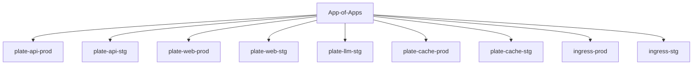
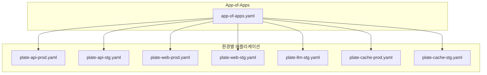
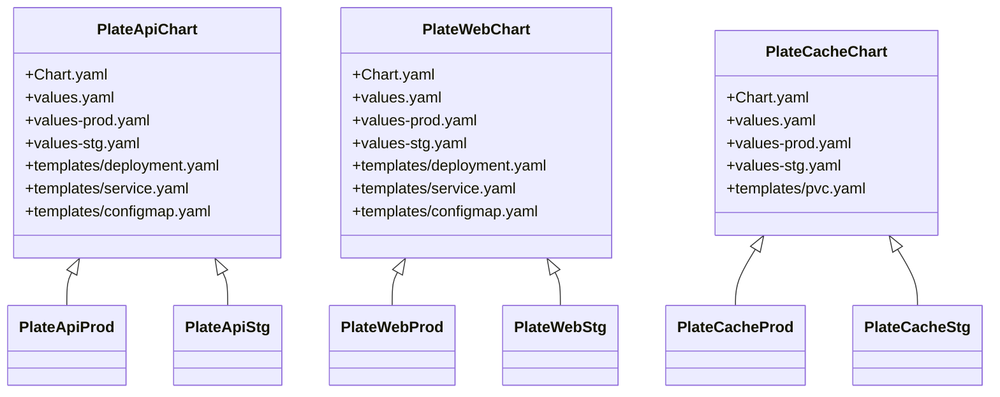
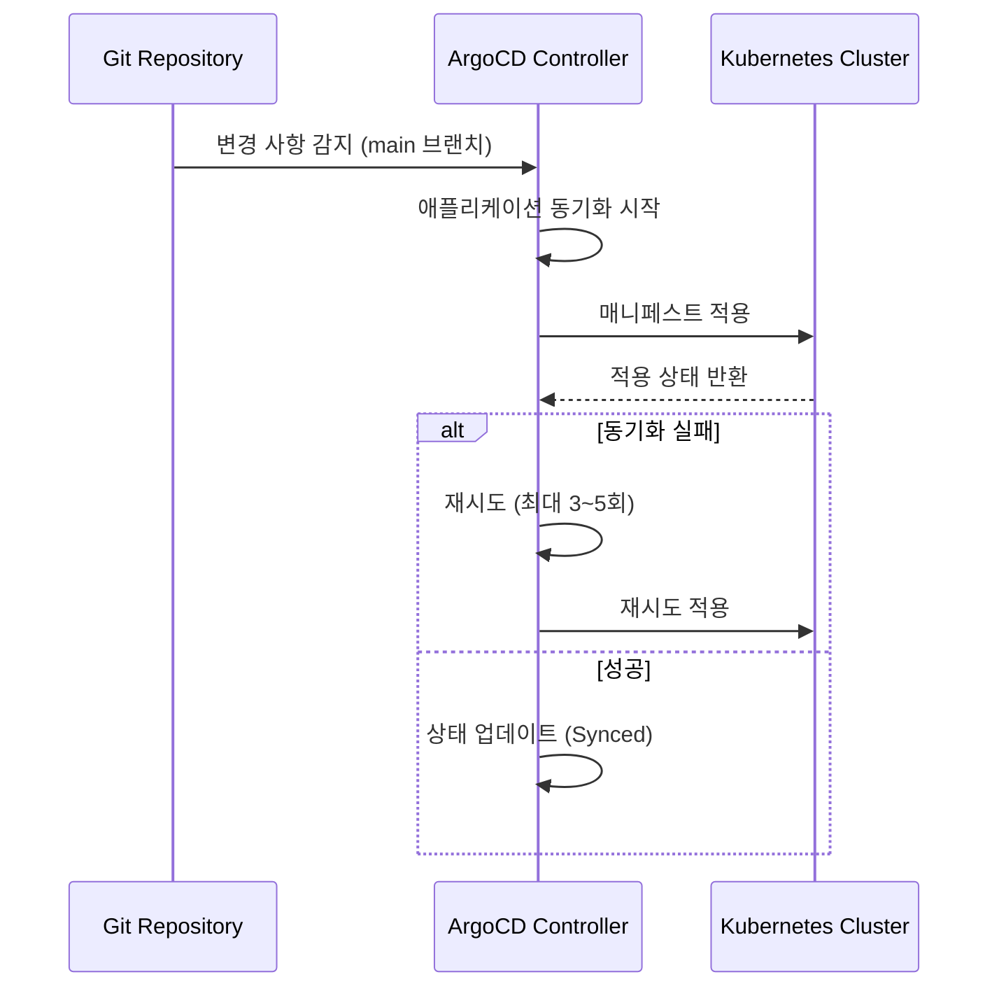

# App-of-Apps 패턴

<cite>
**이 문서에서 참조한 파일**  
- [app-of-apps.yaml](file://environments/argocd/app-of-apps.yaml)
- [plate-api/values.yaml](file://helm/applications/plate-server/values.yaml)
- [plate-api/values-prod.yaml](file://helm/applications/plate-server/values-prod.yaml)
- [plate-api/values-stg.yaml](file://helm/applications/plate-server/values-stg.yaml)
- [plate-web/values.yaml](file://helm/applications/plate-web/values.yaml)
- [plate-web/values-prod.yaml](file://helm/applications/plate-web/values-prod.yaml)
- [plate-web/values-stg.yaml](file://helm/applications/plate-web/values-stg.yaml)
- [plate-cache/values.yaml](file://helm/applications/plate-cache/values.yaml)
- [plate-cache/values-prod.yaml](file://helm/applications/plate-cache/values-prod.yaml)
- [plate-cache/values-stg.yaml](file://helm/applications/plate-cache/values-stg.yaml)
- [plate-llm/values.yaml](file://helm/applications/plate-llm/values.yaml)
- [plate-llm/values-stg.yaml](file://helm/applications/plate-llm/values-stg.yaml)
- [plate-api-prod.yaml](file://environments/argocd/apps/plate-api-prod.yaml)
- [plate-api-stg.yaml](file://environments/argocd/apps/plate-api-stg.yaml)
- [plate-web-prod.yaml](file://environments/argocd/apps/plate-web-prod.yaml)
- [plate-web-stg.yaml](file://environments/argocd/apps/plate-web-stg.yaml)
- [plate-llm-stg.yaml](file://environments/argocd/apps/plate-llm-stg.yaml)
</cite>

## 목차
1. [소개](#소개)
2. [App-of-Apps 패턴 개요](#app-of-apps-패턴-개요)
3. [계층적 애플리케이션 구조](#계층적-애플리케이션-구조)
4. [Helm 차트 기반 애플리케이션 정의](#helm-차트-기반-애플리케이션-정의)
5. [환경별 설정 오버라이드](#환경별-설정-오버라이드)
6. [의존성 관리 및 동기화 전략](#의존성-관리-및-동기화-전략)
7. [결론](#결론)

## 소개
이 문서는 `prj-devops` 프로젝트에서 App-of-Apps 패턴이 어떻게 구현되었는지를 설명합니다. 이 패턴은 ArgoCD를 사용하여 Kubernetes 애플리케이션을 선언적으로 관리하는 핵심 설계 원칙으로, 전체 시스템을 구성하는 다수의 애플리케이션을 하나의 최상위 애플리케이션으로 통합 관리합니다. 이를 통해 복잡한 마이크로서비스 아키텍처를 체계적으로 배포하고 운영할 수 있습니다.

## App-of-Apps 패턴 개요

App-of-Apps 패턴은 하나의 메인 ArgoCD 애플리케이션이 다른 여러 ArgoCD 애플리케이션을 관리하는 구조입니다. 이 패턴을 통해 GitOps 기반의 선언적 배포를 계층적으로 구현할 수 있습니다.

`app-of-apps.yaml` 파일은 이 패턴의 중심으로, `environments/argocd/apps` 디렉터리에 위치한 모든 애플리케이션을 자동으로 포함하여 관리합니다. 이 파일은 `kind: Application` 리소스로 정의되며, `path: environments/argocd/apps`를 소스 경로로 지정함으로써 하위 애플리케이션들을 동적으로 로드합니다.



**다이어그램 출처**  
- [app-of-apps.yaml](file://environments/argocd/app-of-apps.yaml#L1-L35)

**섹션 출처**  
- [app-of-apps.yaml](file://environments/argocd/app-of-apps.yaml#L1-L35)

## 계층적 애플리케이션 구조

프로젝트는 명확한 계층 구조를 따릅니다. 최상위 `app-of-apps`가 하위 애플리케이션들을 포함하고, 각 애플리케이션은 특정 서비스를 담당합니다. 이러한 구조는 다음과 같은 이점을 제공합니다:

- **중앙 집중식 관리**: 모든 애플리케이션 상태를 하나의 뷰에서 확인 가능
- **배포 자동화**: Git 변경 사항 감지 시 자동 동기화 (`selfHeal: true`, `prune: true`)
- **네임스페이스 분리**: `plate-prod`, `plate-stg` 등 환경별 네임스페이스로 격리
- **선언적 구성**: 모든 배포 상태가 Git에 저장되어 재현 가능

각 하위 애플리케이션은 별도의 YAML 파일로 정의되며, 예를 들어 `plate-api-prod.yaml`은 프로덕션 환경의 백엔드 API를 관리합니다.



**다이어그램 출처**  
- [app-of-apps.yaml](file://environments/argocd/app-of-apps.yaml#L1-L35)
- [plate-api-prod.yaml](file://environments/argocd/apps/plate-api-prod.yaml#L1-L62)
- [plate-web-prod.yaml](file://environments/argocd/apps/plate-web-prod.yaml#L1-L62)

**섹션 출처**  
- [environments/argocd/apps/plate-api-prod.yaml](file://environments/argocd/apps/plate-api-prod.yaml#L1-L62)
- [environments/argocd/apps/plate-web-prod.yaml](file://environments/argocd/apps/plate-web-prod.yaml#L1-L62)
- [environments/argocd/apps/plate-llm-stg.yaml](file://environments/argocd/apps/plate-llm-stg.yaml#L1-L62)

## Helm 차트 기반 애플리케이션 정의

모든 애플리케이션은 Helm 차트를 기반으로 정의됩니다. 각 서비스는 `helm/applications/` 디렉터리 아래에 독립적인 차트로 구성되어 있으며, 다음과 같은 구조를 가집니다:

- `Chart.yaml`: 차트 메타데이터
- `values.yaml`: 기본 설정 값
- `values-prod.yaml`: 프로덕션 전용 오버라이드
- `values-stg.yaml`: 스테이징 전용 오버라이드
- `templates/`: Kubernetes 매니페스트 템플릿

예를 들어, `plate-api` 차트는 백엔드 서버를 위한 Deployment, Service, ConfigMap 등을 정의하며, `values.yaml`을 통해 복제본 수, 이미지 태그, 리소스 제한 등을 설정합니다.



**다이어그램 출처**  
- [plate-api/values.yaml](file://helm/applications/plate-server/values.yaml#L1-L116)
- [plate-web/values.yaml](file://helm/applications/plate-web/values.yaml#L1-L73)
- [plate-cache/values.yaml](file://helm/applications/plate-cache/values.yaml#L1-L14)

**섹션 출처**  
- [helm/applications/plate-server](file://helm/applications/plate-server)
- [helm/applications/plate-web](file://helm/applications/plate-web)
- [helm/applications/plate-cache](file://helm/applications/plate-cache)

## 환경별 설정 오버라이드

환경별 설정은 Helm의 `valueFiles` 기능을 통해 구현됩니다. 각 ArgoCD 애플리케이션은 기본 `values.yaml` 외에 환경 전용 파일을 참조합니다.

예를 들어, `plate-api-prod.yaml`은 다음과 같이 `values-prod.yaml`을 명시적으로 로드합니다:

```yaml
spec:
  source:
    helm:
      valueFiles:
        - values-prod.yaml
```

이를 통해 환경별로 다음 설정을 오버라이드할 수 있습니다:

- **이미지 저장소 및 태그**: 프로덕션은 안정된 태그, 스테이징은 `latest`
- **리소스 요청 및 제한**: 프로덕션은 더 높은 리소스 할당
- **PVC 크기**: 프로덕션은 50Gi, 스테이징은 30Gi
- **Pull Policy**: 스테이징은 `Always`, 프로덕션은 `IfNotPresent`

이러한 오버라이드는 Git에 저장되므로, 환경 간 일관성과 추적 가능성을 보장합니다.

**섹션 출처**  
- [plate-api/values-prod.yaml](file://helm/applications/plate-server/values-prod.yaml#L1-L31)
- [plate-api/values-stg.yaml](file://helm/applications/plate-server/values-stg.yaml#L1-L30)
- [plate-web/values-prod.yaml](file://helm/applications/plate-web/values-prod.yaml#L1-L39)
- [plate-web/values-stg.yaml](file://helm/applications/plate-web/values-stg.yaml#L1-L38)
- [plate-cache/values-prod.yaml](file://helm/applications/plate-cache/values-prod.yaml#L1-L12)
- [plate-cache/values-stg.yaml](file://helm/applications/plate-cache/values-stg.yaml#L1-L12)

## 의존성 관리 및 동기화 전략

ArgoCD는 애플리케이션 간 의존성과 동기화를 효율적으로 관리합니다. 주요 전략은 다음과 같습니다:

- **자동 동기화**: `automated: true` 설정으로 Git 변경 시 자동 적용
- **자기 치유**: `selfHeal: true`로 클러스터 상태가 Git과 다를 경우 자동 복구
- **리소스 정리**: `prune: true`로 Git에서 제거된 리소스를 클러스터에서도 삭제
- **재시도 정책**: 실패 시 재시도 (`retry`)를 통해 안정성 확보

특히, 프로덕션 환경은 `limit: 3`의 보수적인 재시도 정책을 사용하고, 스테이징은 `limit: 5`로 더 유연하게 설정하여 문제 조기 발견을 지원합니다.



**다이어그램 출처**  
- [plate-api-prod.yaml](file://environments/argocd/apps/plate-api-prod.yaml#L32-L50)
- [plate-api-stg.yaml](file://environments/argocd/apps/plate-api-stg.yaml#L32-L50)

**섹션 출처**  
- [environments/argocd/apps/plate-api-prod.yaml](file://environments/argocd/apps/plate-api-prod.yaml#L32-L50)
- [environments/argocd/apps/plate-api-stg.yaml](file://environments/argocd/apps/plate-api-stg.yaml#L32-L50)

## 결론

`prj-devops` 프로젝트는 App-of-Apps 패턴을 통해 다중 환경의 애플리케이션을 효과적으로 관리하고 있습니다. Helm 차트 기반의 선언적 구성과 환경별 `values.yaml` 오버라이드를 통해 유연성과 일관성을 동시에 달성하였으며, ArgoCD의 자동 동기화 및 자기 치유 기능을 통해 운영 안정성을 극대화했습니다. 이 구조는 향후 새로운 서비스 추가 시에도 확장 가능하며, GitOps 원칙을 철저히 준수하는 모범적인 사례입니다.