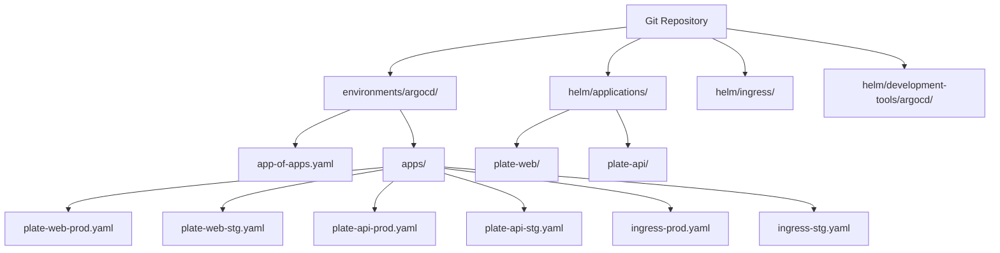
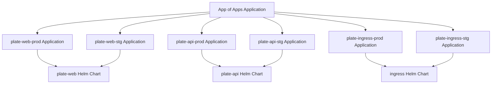

# ArgoCD 구성

<cite>
**이 문서에서 참조한 파일**  
- [environments/argocd/README.md](file://environments/argocd/README.md)
- [environments/argocd/app-of-apps.yaml](file://environments/argocd/app-of-apps.yaml)
- [environments/argocd/apps/plate-web-prod.yaml](file://environments/argocd/apps/plate-web-prod.yaml)
- [environments/argocd/apps/plate-web-stg.yaml](file://environments/argocd/apps/plate-web-stg.yaml)
- [environments/argocd/apps/ingress-prod.yaml](file://environments/argocd/apps/ingress-prod.yaml)
- [environments/argocd/apps/ingress-stg.yaml](file://environments/argocd/apps/ingress-stg.yaml)
- [environments/argocd/apps/plate-api-prod.yaml](file://environments/argocd/apps/plate-api-prod.yaml)
- [environments/argocd/apps/plate-api-stg.yaml](file://environments/argocd/apps/plate-api-stg.yaml)
- [helm/development-tools/argocd/Chart.yaml](file://helm/development-tools/argocd/Chart.yaml)
- [helm/development-tools/argocd/values.yaml](file://helm/development-tools/argocd/values.yaml)
- [helm/applications/plate-web/values-prod.yaml](file://helm/applications/plate-web/values-prod.yaml)
- [helm/applications/plate-web/values-stg.yaml](file://helm/applications/plate-web/values-stg.yaml)
- [helm/applications/plate-server/values-prod.yaml](file://helm/applications/plate-server/values-prod.yaml)
- [helm/applications/plate-server/values-stg.yaml](file://helm/applications/plate-server/values-stg.yaml)
- [helm/ingress/values.yaml](file://helm/ingress/values.yaml)
- [helm/ingress/values-stg.yaml](file://helm/ingress/values-stg.yaml)
</cite>

## 목차
1. [소개](#소개)
2. [프로젝트 구조](#프로젝트-구조)
3. [ArgoCD Application 리소스 구성](#argocd-application-리소스-구성)
4. [App of Apps 패턴](#app-of-apps-패턴)
5. [환경별 Application 구성](#환경별-application-구성)
6. [Helm 기반 ArgoCD 설치](#helm-기반-argocd-설치)
7. [보안 설정](#보안-설정)
8. [결론](#결론)

## 소개

이 문서는 `prj-devops` 프로젝트에서 ArgoCD를 사용하여 GitOps 기반으로 애플리케이션을 관리하는 구체적인 구성 방법을 설명합니다. 특히 `environments/argocd/apps` 디렉터리 내의 각 YAML 파일이 개별 애플리케이션을 어떻게 정의하는지, `Application` 리소스의 주요 필드인 `spec.source`, `spec.destination`, `spec.syncPolicy` 등의 의미와 설정 방법을 다룹니다. 또한 ArgoCD 자체가 Helm 차트로 관리되는 방식, `values.yaml`을 통한 맞춤형 구성, 인증 및 권한 부여 등 보안 설정에 대해서도 설명합니다.

## 프로젝트 구조

`prj-devops` 프로젝트는 GitOps 원칙에 따라 ArgoCD를 통해 애플리케이션을 선언적으로 관리합니다. 핵심 구성 요소는 다음과 같습니다.

- `environments/argocd/`: ArgoCD 관련 설정 파일들이 위치한 디렉터리
  - `app-of-apps.yaml`: 모든 애플리케이션을 관리하는 최상위 `Application` 리소스
  - `apps/`: 개별 애플리케이션을 정의하는 YAML 파일들
- `helm/development-tools/argocd/`: ArgoCD 자체를 Helm 차트로 설치하기 위한 설정
- `helm/applications/`: 실제 애플리케이션(plate-web, plate-api 등)의 Helm 차트
- `helm/ingress/`: 인그레스 컨트롤러를 위한 Helm 차트

이 구조는 애플리케이션 배포 정의(Application 리소스)와 애플리케이션의 실제 매니페스트(Helm 차트)를 분리하여 관리함으로써, GitOps의 이점을 극대화합니다.

**다이어그램 출처**
- [environments/argocd/app-of-apps.yaml](file://environments/argocd/app-of-apps.yaml)
- [environments/argocd/apps/plate-web-prod.yaml](file://environments/argocd/apps/plate-web-prod.yaml)
- [environments/argocd/apps/plate-web-stg.yaml](file://environments/argocd/apps/plate-web-stg.yaml)
- [helm/applications/plate-web/Chart.yaml](file://helm/applications/plate-web/Chart.yaml)
- [helm/applications/plate-server/Chart.yaml](file://helm/applications/plate-server/Chart.yaml)
- [helm/ingress/Chart.yaml](file://helm/ingress/Chart.yaml)
- [helm/development-tools/argocd/Chart.yaml](file://helm/development-tools/argocd/Chart.yaml)

**섹션 출처**
- [environments/argocd/README.md](file://environments/argocd/README.md)
- [environments/argocd/app-of-apps.yaml](file://environments/argocd/app-of-apps.yaml)
- [environments/argocd/apps/](file://environments/argocd/apps/)

## ArgoCD Application 리소스 구성

ArgoCD의 핵심은 `Application` 리소스입니다. 이 리소스는 Git 저장소에 있는 애플리케이션 매니페스트를 어떤 클러스터와 네임스페이스에 배포할지, 그리고 어떻게 동기화할지를 정의합니다. `environments/argocd/apps` 디렉터리 내의 각 YAML 파일은 하나의 `Application` 리소스를 정의합니다.

### spec.source

`spec.source` 필드는 애플리케이션의 소스 코드와 매니페스트가 위치한 Git 저장소를 지정합니다.

- `repoURL`: 애플리케이션 매니페스트가 있는 Git 저장소의 URL입니다. 예: `https://github.com/kimjoongwon/prj-devops.git`
- `path`: 저장소 내에서 Helm 차트가 위치한 경로입니다. 예: `helm/applications/plate-web`
- `targetRevision`: 추적할 Git 브랜치, 태그 또는 커밋입니다. 일반적으로 `main` 브랜치를 사용합니다.
- `helm.valueFiles`: Helm 차트에 적용할 환경별 `values.yaml` 파일의 목록입니다. 예: `[- values-prod.yaml]`은 `helm/applications/plate-web/values-prod.yaml` 파일을 로드합니다.
- `helm.parameters`: Helm 템플릿에 전달할 파라미터를 동적으로 오버라이드할 수 있습니다. 예: `- name: image.tag, value: "1.26"`은 이미지 태그를 변경합니다.

### spec.destination

`spec.destination` 필드는 애플리케이션을 배포할 대상 클러스터와 네임스페이스를 지정합니다.

- `server`: 대상 Kubernetes 클러스터의 API 서버 주소입니다. 현재 클러스터에 설치된 ArgoCD에서 다른 클러스터로 배포할 때 사용합니다. 예: `https://kubernetes.default.svc`는 현재 클러스터를 의미합니다.
- `namespace`: 애플리케이션 리소스들을 생성할 네임스페이스입니다. 예: `plate-prod` 또는 `plate-stg`

### spec.syncPolicy

`spec.syncPolicy` 필드는 애플리케이션의 동기화 방식을 제어합니다.

- `automated`: Git 저장소의 변경 사항을 자동으로 클러스터에 반영할지 여부를 결정합니다.
  - `prune: true`: Git 저장소에서 삭제된 리소스를 클러스터에서도 자동으로 삭제합니다.
  - `selfHeal: true`: 클러스터에서 수동으로 변경된 사항을 Git 저장소의 상태로 자동 복구합니다.
- `syncOptions`: 동기화 과정의 세부 옵션을 설정합니다.
  - `CreateNamespace=true`: 대상 네임스페이스가 존재하지 않으면 자동으로 생성합니다.
  - `ApplyOutOfSyncOnly=true`: 상태가 불일치한 리소스만 적용하여 성능을 최적화합니다.
  - `RespectIgnoreDifferences=true`: `ignoreDifferences` 설정을 준수합니다.
- `retry`: 동기화 실패 시 재시도 정책을 정의합니다. `limit`, `backoff.duration`, `backoff.factor`, `maxDuration` 등을 설정하여 안정적인 배포를 보장합니다.

### 기타 주요 필드

- `info`: ArgoCD UI에 표시될 애플리케이션의 설명, 환경, 도메인 등의 메타 정보를 포함합니다.
- `revisionHistoryLimit`: Git 이력을 보관할 개수로, 롤백 가능한 리비전 수를 결정합니다.
- `ignoreDifferences`: 특정 필드의 변경 사항을 무시하도록 설정합니다. 예를 들어, 인그레스 리소스의 `.metadata.annotations`는 클러스터에서 자동으로 추가되는 경우가 많으므로 동기화 오류를 방지하기 위해 무시할 수 있습니다.

**섹션 출처**
- [environments/argocd/apps/plate-web-prod.yaml](file://environments/argocd/apps/plate-web-prod.yaml)
- [environments/argocd/apps/plate-web-stg.yaml](file://environments/argocd/apps/plate-web-stg.yaml)
- [environments/argocd/apps/ingress-prod.yaml](file://environments/argocd/apps/ingress-prod.yaml)
- [environments/argocd/apps/ingress-stg.yaml](file://environments/argocd/apps/ingress-stg.yaml)
- [environments/argocd/README.md](file://environments/argocd/README.md)

## App of Apps 패턴

`app-of-apps.yaml` 파일은 "App of Apps" 패턴을 구현한 최상위 `Application` 리소스입니다. 이 패턴은 하나의 `Application` 리소스가 다른 여러 `Application` 리소스들을 관리함으로써, 전체 애플리케이션 스택을 단일 진입점에서 관리할 수 있게 해줍니다.

- `spec.source.path`: `environments/argocd/apps`로 설정되어 있으며, 이 디렉터리 내에 있는 모든 `Application` 리소스(YAML 파일)를 자동으로 감지하고 생성합니다.
- `spec.destination`: ArgoCD가 설치된 `argocd` 네임스페이스에 `Application` 리소스들을 생성합니다.
- `spec.syncPolicy`: `prune: true`와 `selfHeal: true`를 설정하여, `apps/` 디렉터리에서 파일이 삭제되거나 수정되면 클러스터의 상태도 자동으로 동기화됩니다.

이 패턴을 사용하면 `kubectl apply -f environments/argocd/app-of-apps.yaml` 명령 한 줄로 전체 애플리케이션 스택을 배포할 수 있으며, Git 저장소의 변경을 통해 전체 인프라를 선언적으로 관리할 수 있습니다.

**다이어그램 출처**
- [environments/argocd/app-of-apps.yaml](file://environments/argocd/app-of-apps.yaml)
- [environments/argocd/apps/plate-web-prod.yaml](file://environments/argocd/apps/plate-web-prod.yaml)
- [environments/argocd/apps/plate-web-stg.yaml](file://environments/argocd/apps/plate-web-stg.yaml)
- [environments/argocd/apps/plate-api-prod.yaml](file://environments/argocd/apps/plate-api-prod.yaml)
- [environments/argocd/apps/plate-api-stg.yaml](file://environments/argocd/apps/plate-api-stg.yaml)
- [environments/argocd/apps/ingress-prod.yaml](file://environments/argocd/apps/ingress-prod.yaml)
- [environments/argocd/apps/ingress-stg.yaml](file://environments/argocd/apps/ingress-stg.yaml)

**섹션 출처**
- [environments/argocd/app-of-apps.yaml](file://environments/argocd/app-of-apps.yaml)
- [environments/argocd/README.md](file://environments/argocd/README.md)

## 환경별 Application 구성

`prj-devops`는 프로덕션(production)과 스테이징(staging) 두 가지 환경을 지원합니다. 각 환경은 별도의 `Application` 리소스와 `values.yaml` 파일을 통해 구성됩니다.

### 프로덕션 환경

- **네임스페이스**: `plate-prod`
- **Application 파일**: `plate-web-prod.yaml`, `plate-api-prod.yaml`, `ingress-prod.yaml`
- **values 파일**: `values-prod.yaml`
- **주요 특징**:
  - 이미지 태그를 고정된 버전(예: `1.25`)으로 사용하여 안정성을 보장합니다.
  - `pullPolicy: IfNotPresent`를 사용하여 이미지 풀링을 최소화합니다.
  - `syncPolicy.retry`를 보수적으로 설정하여 배포 실패 시 재시도 횟수를 제한합니다.
  - 인그레스는 `letsencrypt-prod` ClusterIssuer를 사용하여 실서명 TLS 인증서를 발급받습니다.

### 스테이징 환경

- **네임스페이스**: `plate-stg`
- **Application 파일**: `plate-web-stg.yaml`, `plate-api-stg.yaml`, `ingress-stg.yaml`
- **values 파일**: `values-stg.yaml`
- **주요 특징**:
  - 이미지 태그를 `latest`로 사용하여 최신 빌드를 항상 가져옵니다.
  - `pullPolicy: Always`를 사용하여 캐시된 이미지를 무시하고 항상 최신 이미지를 풀링합니다.
  - `syncPolicy.retry`를 더 높은 횟수로 설정하여 테스트 환경에서의 유연성을 제공합니다.
  - 인그레스는 `stg.cocdev.co.kr` 도메인을 사용하며, `ssl-redirect`를 비활성화하여 HTTP 테스트를 허용합니다.

이러한 환경별 분리는 개발 및 테스트 과정에서의 유연성과 프로덕션 환경의 안정성을 동시에 확보할 수 있게 해줍니다.

**섹션 출처**
- [environments/argocd/apps/plate-web-prod.yaml](file://environments/argocd/apps/plate-web-prod.yaml)
- [environments/argocd/apps/plate-web-stg.yaml](file://environments/argocd/apps/plate-web-stg.yaml)
- [environments/argocd/apps/plate-api-prod.yaml](file://environments/argocd/apps/plate-api-prod.yaml)
- [environments/argocd/apps/plate-api-stg.yaml](file://environments/argocd/apps/plate-api-stg.yaml)
- [environments/argocd/apps/ingress-prod.yaml](file://environments/argocd/apps/ingress-prod.yaml)
- [environments/argocd/apps/ingress-stg.yaml](file://environments/argocd/apps/ingress-stg.yaml)
- [helm/applications/plate-web/values-prod.yaml](file://helm/applications/plate-web/values-prod.yaml)
- [helm/applications/plate-web/values-stg.yaml](file://helm/applications/plate-web/values-stg.yaml)
- [helm/applications/plate-server/values-prod.yaml](file://helm/applications/plate-server/values-prod.yaml)
- [helm/applications/plate-server/values-stg.yaml](file://helm/applications/plate-server/values-stg.yaml)
- [helm/ingress/values.yaml](file://helm/ingress/values.yaml)
- [helm/ingress/values-stg.yaml](file://helm/ingress/values-stg.yaml)

## Helm 기반 ArgoCD 설치

ArgoCD 자체도 Helm 차트로 관리됩니다. `helm/development-tools/argocd/` 디렉터리에는 ArgoCD를 설치하기 위한 Helm 차트가 포함되어 있습니다.

- `Chart.yaml`: 차트의 메타데이터를 정의하며, `argo-cd`라는 이름의 Helm 차트임을 나타냅니다.
- `values.yaml`: ArgoCD의 다양한 구성 요소를 맞춤 설정할 수 있는 파일입니다. 주요 설정 항목은 다음과 같습니다.
  - `global.domain`: ArgoCD UI의 기본 도메인을 설정합니다.
  - `configs.rbac.policy.csv`: 역할 기반 접근 제어(RBAC) 정책을 정의합니다. 예를 들어, `role:admin` 역할에 모든 리소스에 대한 접근 권한을 부여합니다.
  - `configs.secret.argocdServerAdminPassword`: 관리자 비밀번호를 bcrypt 해시로 설정합니다.
  - `configs.ssh.knownHosts`: Git 저장소의 SSH 호스트 키를 사전에 등록하여 연결을 안전하게 합니다.
  - `configs.repositories`: Helm 차트 저장소와 같은 추가 리포지토리 정보를 정의합니다.

이 `values.yaml` 파일을 사용하면 ArgoCD의 동작 방식을 세밀하게 제어할 수 있으며, 인증, 권한 부여, 외부 리포지토리 연결 등 다양한 기능을 설정할 수 있습니다.

**섹션 출처**
- [helm/development-tools/argocd/Chart.yaml](file://helm/development-tools/argocd/Chart.yaml)
- [helm/development-tools/argocd/values.yaml](file://helm/development-tools/argocd/values.yaml)

## 보안 설정

ArgoCD의 보안은 여러 계층에서 설정됩니다.

### 인증 및 권한 부여

- **RBAC (역할 기반 접근 제어)**: `values.yaml` 파일의 `configs.rbac.policy.csv` 섹션을 통해 사용자 역할과 권한을 정의합니다. 예를 들어, `p, role:admin, applications, *, *, allow` 규칙은 `admin` 역할이 모든 애플리케이션에 대한 모든 작업을 수행할 수 있도록 허용합니다.
- **관리자 비밀번호**: `configs.secret.argocdServerAdminPassword`를 통해 관리자 비밀번호를 설정합니다. 이 값은 bcrypt 해시로 인코딩되어야 합니다.
- **외부 인증**: Dex 또는 OIDC를 통한 외부 인증(SAML, LDAP, GitHub 등)을 설정할 수 있습니다. 이는 `values.yaml`의 `configs.dex.config` 또는 `configs.oidc.config` 섹션에서 구성합니다.

### 비밀 정보 관리

- **Git 저장소**: 민감한 정보는 비공개(private) 저장소에 저장하는 것이 좋습니다.
- **비밀 정보 암호화**: Sealed Secrets 또는 External Secrets와 같은 도구를 사용하여 Kubernetes 비밀 정보를 암호화하고 Git에 저장할 수 있습니다.
- **컨테이너 이미지 보안**: 컨테이너 이미지 스캐닝을 적용하여 취약점이 있는 이미지의 배포를 방지합니다.

이러한 보안 설정은 ArgoCD를 안전하게 운영하고, 무단 접근 및 데이터 유출을 방지하는 데 필수적입니다.

**섹션 출처**
- [environments/argocd/README.md](file://environments/argocd/README.md)
- [helm/development-tools/argocd/values.yaml](file://helm/development-tools/argocd/values.yaml)

## 결론

`prj-devops` 프로젝트는 ArgoCD를 중심으로 GitOps 워크플로우를 구축하여 애플리케이션의 배포와 관리를 자동화하고 있습니다. `environments/argocd/apps` 디렉터리의 `Application` 리소스들은 `spec.source`, `spec.destination`, `spec.syncPolicy` 등을 통해 애플리케이션의 소스, 대상, 동기화 정책을 명확하게 정의합니다. "App of Apps" 패턴을 사용하면 전체 스택을 단일 진입점에서 관리할 수 있으며, Helm 기반의 설치와 `values.yaml`을 통한 맞춤 설정은 ArgoCD 자체의 유연한 구성이 가능하게 합니다. 또한, RBAC와 같은 보안 설정을 통해 안전한 운영 환경을 보장할 수 있습니다. 이러한 구성은 애플리케이션의 일관성, 추적성, 안정성을 높이는 데 기여합니다.