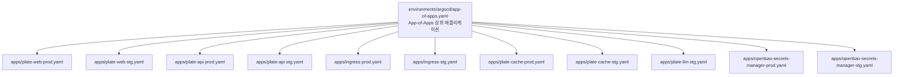
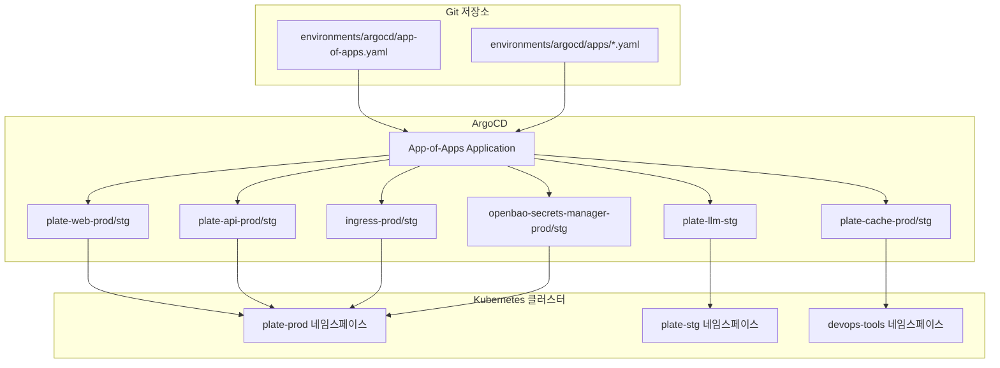
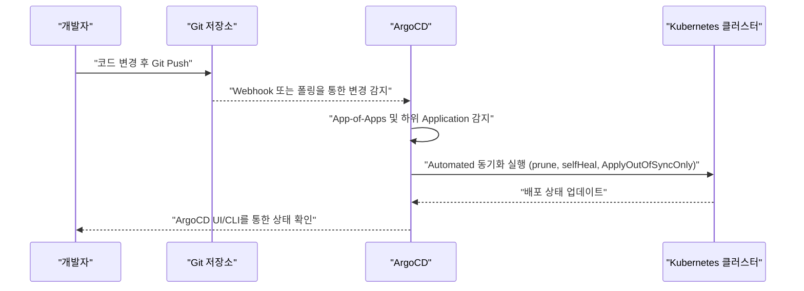
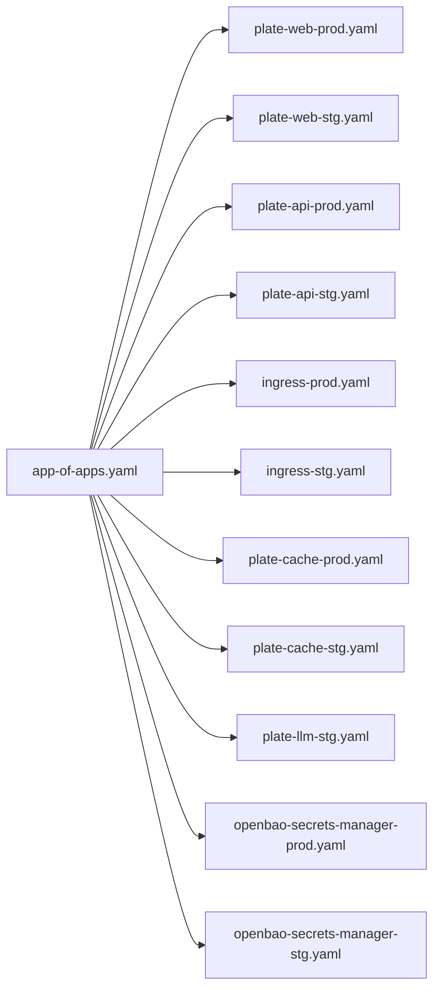

# ArgoCD 통합

<cite>
**문서에 참조된 파일**
- [environments/argocd/app-of-apps.yaml](file://environments/argocd/app-of-apps.yaml)
- [environments/argocd/README.md](file://environments/argocd/README.md)
- [environments/argocd/apps/plate-web-prod.yaml](file://environments/argocd/apps/plate-web-prod.yaml)
- [environments/argocd/apps/plate-web-stg.yaml](file://environments/argocd/apps/plate-web-stg.yaml)
- [environments/argocd/apps/plate-api-prod.yaml](file://environments/argocd/apps/plate-api-prod.yaml)
- [environments/argocd/apps/plate-api-stg.yaml](file://environments/argocd/apps/plate-api-stg.yaml)
- [environments/argocd/apps/ingress-prod.yaml](file://environments/argocd/apps/ingress-prod.yaml)
- [environments/argocd/apps/ingress-stg.yaml](file://environments/argocd/apps/ingress-stg.yaml)
- [environments/argocd/apps/plate-cache-prod.yaml](file://environments/argocd/apps/plate-cache-prod.yaml)
- [environments/argocd/apps/plate-cache-stg.yaml](file://environments/argocd/apps/plate-cache-stg.yaml)
- [environments/argocd/apps/plate-llm-stg.yaml](file://environments/argocd/apps/plate-llm-stg.yaml)
- [environments/argocd/apps/openbao-secrets-manager-prod.yaml](file://environments/argocd/apps/openbao-secrets-manager-prod.yaml)
- [environments/argocd/apps/openbao-secrets-manager-stg.yaml](file://environments/argocd/apps/openbao-secrets-manager-stg.yaml)
</cite>

## 목차
1. [소개](#소개)
2. [프로젝트 구조](#프로젝트-구조)
3. [핵심 구성 요소](#핵심-구성-요소)
4. [아키텍처 개요](#아키텍처-개요)
5. [상세 구성 요소 분석](#상세-구성-요소-분석)
6. [의존성 분석](#의존성-분석)
7. [성능 고려사항](#성능-고려사항)
8. [장애 진단 가이드](#장애-진단-가이드)
9. [결론](#결론)
10. [부록](#부록)

## 소개
이 문서는 prj-devops 프로젝트에서 ArgoCD와 GitOps를 통한 애플리케이션 배포 및 관리를 설명합니다. App-of-Apps 패턴을 사용하여 여러 애플리케이션을 계층적으로 관리하고, Git 저장소의 변경을 감지하여 자동으로 배포하는 워크플로우를 중심으로 설명합니다. environments/argocd 디렉토리의 파일 구조와 각 파일의 역할, 특히 app-of-apps.yaml이 상위 애플리케이션을 정의하고 apps 디렉토리의 YAML이 개별 애플리케이션을 정의하는 방식을 자세히 설명합니다. 또한 ArgoCD를 통한 시스템 상태 관리 및 모니터링 방법을 이해할 수 있도록 합니다.

## 프로젝트 구조
environments/argocd 디렉토리는 GitOps 기반 배포를 위한 ArgoCD 설정을 담고 있습니다. 핵심 파일은 다음과 같습니다:
- app-of-apps.yaml: App-of-Apps 패턴을 적용한 상위 Application으로, Git 저장소의 특정 경로를 추적하고 하위 Application들을 자동으로 생성합니다.
- apps/: 하위 Application들을 정의한 YAML 파일들이 위치하며, 각 파일은 하나의 애플리케이션(예: plate-web, plate-api, ingress 등)과 환경(production/staging)을 매핑합니다.
- README.md: ArgoCD 연동 절차, GitOps 워크플로우, 환경별 설정, 보안 고려사항 등을 안내합니다.

**다이어그램 출처**
- [environments/argocd/app-of-apps.yaml](file://environments/argocd/app-of-apps.yaml#L1-L35)
- [environments/argocd/apps/plate-web-prod.yaml](file://environments/argocd/apps/plate-web-prod.yaml#L1-L46)
- [environments/argocd/apps/plate-web-stg.yaml](file://environments/argocd/apps/plate-web-stg.yaml#L1-L62)
- [environments/argocd/apps/plate-api-prod.yaml](file://environments/argocd/apps/plate-api-prod.yaml#L1-L46)
- [environments/argocd/apps/plate-api-stg.yaml](file://environments/argocd/apps/plate-api-stg.yaml#L1-L46)
- [environments/argocd/apps/ingress-prod.yaml](file://environments/argocd/apps/ingress-prod.yaml#L1-L60)
- [environments/argocd/apps/ingress-stg.yaml](file://environments/argocd/apps/ingress-stg.yaml#L1-L51)
- [environments/argocd/apps/plate-cache-prod.yaml](file://environments/argocd/apps/plate-cache-prod.yaml#L1-L35)
- [environments/argocd/apps/plate-cache-stg.yaml](file://environments/argocd/apps/plate-cache-stg.yaml#L1-L35)
- [environments/argocd/apps/plate-llm-stg.yaml](file://environments/argocd/apps/plate-llm-stg.yaml#L1-L46)
- [environments/argocd/apps/openbao-secrets-manager-prod.yaml](file://environments/argocd/apps/openbao-secrets-manager-prod.yaml#L1-L62)
- [environments/argocd/apps/openbao-secrets-manager-stg.yaml](file://environments/argocd/apps/openbao-secrets-manager-stg.yaml#L1-L60)

**섹션 출처**
- [environments/argocd/README.md](file://environments/argocd/README.md#L1-L107)
- [environments/argocd/app-of-apps.yaml](file://environments/argocd/app-of-apps.yaml#L1-L35)

## 핵심 구성 요소
- App-of-Apps Application (app-of-apps.yaml): Git 저장소의 environments/argocd/apps 경로를 추적하며, 하위 Application들을 자동으로 생성하고 동기화합니다. 자동화된 동작은 prune, selfHeal, CreateNamespace 등의 정책을 포함합니다.
- 개별 Application들 (apps/*.yaml): 각 파일은 하나의 애플리케이션과 환경(production/staging)을 정의합니다. source.path는 Helm 차트 경로를 가리키며, destination.namespace는 배포될 네임스페이스를 지정합니다. syncPolicy는 자동 동기화, 재시도, 리비전 히스토리 등을 포함합니다.
- GitOps 워크플로우: 코드 변경 → Git Push → ArgoCD 감지 → 자동 배포 → 상태 동기화. README.md에 명시된 3분 이내 자동 감지 및 동기화 과정이 있습니다.

**섹션 출처**
- [environments/argocd/app-of-apps.yaml](file://environments/argocd/app-of-apps.yaml#L1-L35)
- [environments/argocd/apps/plate-web-prod.yaml](file://environments/argocd/apps/plate-web-prod.yaml#L1-L46)
- [environments/argocd/apps/plate-web-stg.yaml](file://environments/argocd/apps/plate-web-stg.yaml#L1-L62)
- [environments/argocd/apps/plate-api-prod.yaml](file://environments/argocd/apps/plate-api-prod.yaml#L1-L46)
- [environments/argocd/apps/plate-api-stg.yaml](file://environments/argocd/apps/plate-api-stg.yaml#L1-L46)
- [environments/argocd/apps/ingress-prod.yaml](file://environments/argocd/apps/ingress-prod.yaml#L1-L60)
- [environments/argocd/apps/ingress-stg.yaml](file://environments/argocd/apps/ingress-stg.yaml#L1-L51)
- [environments/argocd/README.md](file://environments/argocd/README.md#L59-L66)

## 아키텍처 개요
ArgoCD는 Git 저장소를 원천으로 하여 Kubernetes 클러스터에 대한 선언적 상태를 관리합니다. App-of-Apps 패턴을 통해 상위 Application이 하위 Application들을 집중적으로 관리하고, 각 하위 Application은 Helm 차트를 기반으로 특정 네임스페이스에 배포됩니다. Git 변경이 발생하면 ArgoCD가 주기적으로 감지하고, 자동 동기화 정책에 따라 클러스터 상태를 Git 상태로 복원합니다.

**다이어그램 출처**
- [environments/argocd/app-of-apps.yaml](file://environments/argocd/app-of-apps.yaml#L1-L35)
- [environments/argocd/apps/plate-web-prod.yaml](file://environments/argocd/apps/plate-web-prod.yaml#L1-L46)
- [environments/argocd/apps/plate-web-stg.yaml](file://environments/argocd/apps/plate-web-stg.yaml#L1-L62)
- [environments/argocd/apps/plate-api-prod.yaml](file://environments/argocd/apps/plate-api-prod.yaml#L1-L46)
- [environments/argocd/apps/plate-api-stg.yaml](file://environments/argocd/apps/plate-api-stg.yaml#L1-L46)
- [environments/argocd/apps/ingress-prod.yaml](file://environments/argocd/apps/ingress-prod.yaml#L1-L60)
- [environments/argocd/apps/ingress-stg.yaml](file://environments/argocd/apps/ingress-stg.yaml#L1-L51)
- [environments/argocd/apps/plate-cache-prod.yaml](file://environments/argocd/apps/plate-cache-prod.yaml#L1-L35)
- [environments/argocd/apps/plate-cache-stg.yaml](file://environments/argocd/apps/plate-cache-stg.yaml#L1-L35)
- [environments/argocd/apps/plate-llm-stg.yaml](file://environments/argocd/apps/plate-llm-stg.yaml#L1-L46)
- [environments/argocd/apps/openbao-secrets-manager-prod.yaml](file://environments/argocd/apps/openbao-secrets-manager-prod.yaml#L1-L62)
- [environments/argocd/apps/openbao-secrets-manager-stg.yaml](file://environments/argocd/apps/openbao-secrets-manager-stg.yaml#L1-L60)

## 상세 구성 요소 분석

### App-of-Apps Application (app-of-apps.yaml)
- 역할: Git 저장소의 environments/argocd/apps 디렉토리를 추적하고, 해당 디렉토리 내 모든 Application YAML을 자동으로 생성합니다.
- 동작: automated 옵션으로 prune, selfHeal, CreateNamespace를 활성화하여 Git 변경을 자동으로 반영하고, 클러스터 상태를 Git 상태로 복구합니다.
- 목적: 여러 애플리케이션과 환경을 한 곳에서 통합 관리하고, GitOps 워크플로우를 통해 일관된 배포를 보장합니다.

**섹션 출처**
- [environments/argocd/app-of-apps.yaml](file://environments/argocd/app-of-apps.yaml#L1-L35)

### Plate Web Application (production/staging)
- 역할: 웹 애플리케이션을 배포하고, production/staging 환경에 따라 다른 values 파일을 사용합니다.
- 특징: Automated 동기화, 네임스페이스 자동 생성, OutOfSync 리소스만 적용, 재시도 정책이 설정되어 있습니다.
- 배포 대상: production → plate-prod, staging → plate-stg 네임스페이스.

**섹션 출처**
- [environments/argocd/apps/plate-web-prod.yaml](file://environments/argocd/apps/plate-web-prod.yaml#L1-L46)
- [environments/argocd/apps/plate-web-stg.yaml](file://environments/argocd/apps/plate-web-stg.yaml#L1-L62)

### Plate API Application (production/staging)
- 역할: 백엔드 API 서버를 배포하고, production/staging 환경에 따라 values 파일을 다르게 적용합니다.
- 특징: Automated 동기화, 네임스페이스 자동 생성, OutOfSync 리소스만 적용, 재시도 정책이 설정되어 있습니다.
- 배포 대상: production → plate-prod, staging → plate-stg 네임스페이스.

**섹션 출처**
- [environments/argocd/apps/plate-api-prod.yaml](file://environments/argocd/apps/plate-api-prod.yaml#L1-L46)
- [environments/argocd/apps/plate-api-stg.yaml](file://environments/argocd/apps/plate-api-stg.yaml#L1-L46)

### Ingress Application (production/staging)
- 역할: 인그레스 컨트롤러를 배포하고, production/staging 환경에 따라 values 파일과 도메인을 다르게 설정합니다.
- 특징: Automated 동기화, 네임스페이스 자동 생성, OutOfSync 리소스만 적용, ignoreDifferences를 통해 인그레스 어노테이션 차이를 무시합니다.
- 배포 대상: production → plate-prod, staging → plate-stg 네임스페이스.

**섹션 출처**
- [environments/argocd/apps/ingress-prod.yaml](file://environments/argocd/apps/ingress-prod.yaml#L1-L60)
- [environments/argocd/apps/ingress-stg.yaml](file://environments/argocd/apps/ingress-stg.yaml#L1-L51)

### Plate Cache Application (production/staging)
- 역할: 컨테이너 캐시 스토리지를 배포하고, production/staging 환경에 따라 values 파일을 다르게 적용합니다.
- 특징: sync-wave 어노테이션을 사용하여 스토리지 리소스를 먼저 생성하고, Automated 동기화 및 OutOfSync 리소스만 적용됩니다.
- 배포 대상: production → devops-tools, staging → devops-tools 네임스페이스.

**섹션 출처**
- [environments/argocd/apps/plate-cache-prod.yaml](file://environments/argocd/apps/plate-cache-prod.yaml#L1-L35)
- [environments/argocd/apps/plate-cache-stg.yaml](file://environments/argocd/apps/plate-cache-stg.yaml#L1-L35)

### Plate LLM Application (staging)
- 역할: LangChain 기반 LLM 서비스를 배포하고, staging 환경에 맞춘 values 파일을 사용합니다.
- 특징: Automated 동기화, 네임스페이스 자동 생성, OutOfSync 리소스만 적용, 재시도 정책이 설정되어 있습니다.
- 배포 대상: staging → plate-stg 네임스페이스.

**섹션 출처**
- [environments/argocd/apps/plate-llm-stg.yaml](file://environments/argocd/apps/plate-llm-stg.yaml#L1-L46)

### OpenBao Secrets Manager Application (production/staging)
- 역할: OpenBao 시크릿 관리자를 배포하고, production/staging 환경에 따라 values 파일을 다르게 적용합니다.
- 특징: sync-wave 어노테이션을 사용하여 공유 구성 리소스를 먼저 생성하고, production에서는 보다 보수적인 prune 정책과 검증 옵션이 설정되어 있습니다. ignoreDifferences를 통해 Secret 데이터와 ExternalSecret 상태 차이를 무시합니다.
- 배포 대상: production → plate-prod, staging → plate-stg 네임스페이스.

**섹션 출처**
- [environments/argocd/apps/openbao-secrets-manager-prod.yaml](file://environments/argocd/apps/openbao-secrets-manager-prod.yaml#L1-L62)
- [environments/argocd/apps/openbao-secrets-manager-stg.yaml](file://environments/argocd/apps/openbao-secrets-manager-stg.yaml#L1-L60)

### GitOps 워크플로우 시퀀스

**다이어그램 출처**
- [environments/argocd/README.md](file://environments/argocd/README.md#L59-L66)
- [environments/argocd/app-of-apps.yaml](file://environments/argocd/app-of-apps.yaml#L1-L35)
- [environments/argocd/apps/plate-web-prod.yaml](file://environments/argocd/apps/plate-web-prod.yaml#L1-L46)
- [environments/argocd/apps/plate-web-stg.yaml](file://environments/argocd/apps/plate-web-stg.yaml#L1-L62)

## 의존성 분석
- 상위 → 하위: app-of-apps.yaml이 apps/*.yaml을 상위에서 관리하고, 각 하위 Application은 Helm 차트를 기반으로 배포됩니다.
- 네임스페이스 의존성: plate-web, plate-api, ingress는 production/staging 네임스페이스에 배포되며, plate-cache는 devops-tools 네임스페이스에 배포됩니다.
- 동기화 정책 의존성: Automated 동기화, prune, selfHeal, ApplyOutOfSyncOnly, retry 정책이 각 Application에 적용되어 Git 변경에 대한 응답 속도와 안정성을 보장합니다.
- OpenBao Secrets Manager: production/staging 환경에 따라 values 파일이 다르며, production에서는 보다 보수적인 정책이 적용됩니다.

**다이어그램 출처**
- [environments/argocd/app-of-apps.yaml](file://environments/argocd/app-of-apps.yaml#L1-L35)
- [environments/argocd/apps/plate-web-prod.yaml](file://environments/argocd/apps/plate-web-prod.yaml#L1-L46)
- [environments/argocd/apps/plate-web-stg.yaml](file://environments/argocd/apps/plate-web-stg.yaml#L1-L62)
- [environments/argocd/apps/plate-api-prod.yaml](file://environments/argocd/apps/plate-api-prod.yaml#L1-L46)
- [environments/argocd/apps/plate-api-stg.yaml](file://environments/argocd/apps/plate-api-stg.yaml#L1-L46)
- [environments/argocd/apps/ingress-prod.yaml](file://environments/argocd/apps/ingress-prod.yaml#L1-L60)
- [environments/argocd/apps/ingress-stg.yaml](file://environments/argocd/apps/ingress-stg.yaml#L1-L51)
- [environments/argocd/apps/plate-cache-prod.yaml](file://environments/argocd/apps/plate-cache-prod.yaml#L1-L35)
- [environments/argocd/apps/plate-cache-stg.yaml](file://environments/argocd/apps/plate-cache-stg.yaml#L1-L35)
- [environments/argocd/apps/plate-llm-stg.yaml](file://environments/argocd/apps/plate-llm-stg.yaml#L1-L46)
- [environments/argocd/apps/openbao-secrets-manager-prod.yaml](file://environments/argocd/apps/openbao-secrets-manager-prod.yaml#L1-L62)
- [environments/argocd/apps/openbao-secrets-manager-stg.yaml](file://environments/argocd/apps/openbao-secrets-manager-stg.yaml#L1-L60)

**섹션 출처**
- [environments/argocd/app-of-apps.yaml](file://environments/argocd/app-of-apps.yaml#L1-L35)
- [environments/argocd/apps/plate-web-prod.yaml](file://environments/argocd/apps/plate-web-prod.yaml#L1-L46)
- [environments/argocd/apps/plate-web-stg.yaml](file://environments/argocd/apps/plate-web-stg.yaml#L1-L62)
- [environments/argocd/apps/plate-api-prod.yaml](file://environments/argocd/apps/plate-api-prod.yaml#L1-L46)
- [environments/argocd/apps/plate-api-stg.yaml](file://environments/argocd/apps/plate-api-stg.yaml#L1-L46)
- [environments/argocd/apps/ingress-prod.yaml](file://environments/argocd/apps/ingress-prod.yaml#L1-L60)
- [environments/argocd/apps/ingress-stg.yaml](file://environments/argocd/apps/ingress-stg.yaml#L1-L51)
- [environments/argocd/apps/plate-cache-prod.yaml](file://environments/argocd/apps/plate-cache-prod.yaml#L1-L35)
- [environments/argocd/apps/plate-cache-stg.yaml](file://environments/argocd/apps/plate-cache-stg.yaml#L1-L35)
- [environments/argocd/apps/plate-llm-stg.yaml](file://environments/argocd/apps/plate-llm-stg.yaml#L1-L46)
- [environments/argocd/apps/openbao-secrets-manager-prod.yaml](file://environments/argocd/apps/openbao-secrets-manager-prod.yaml#L1-L62)
- [environments/argocd/apps/openbao-secrets-manager-stg.yaml](file://environments/argocd/apps/openbao-secrets-manager-stg.yaml#L1-L60)

## 성능 고려사항
- OutOfSync 리소스만 적용: ApplyOutOfSyncOnly 옵션을 통해 불필요한 전체 리소스 재배포를 줄이고, 배포 성능을 향상시킵니다.
- 재시도 정책: exponential backoff를 사용하여 일시적인 오류 상황에서 과도한 요청 부하를 방지합니다.
- 네임스페이스 자동 생성: CreateNamespace=true를 통해 미존재 네임스페이스에 대한 추가 작업 없이 배포가 가능합니다.
- 리비전 히스토리 제한: revisionHistoryLimit을 조절하여 과거 배포 이력을 제한함으로써 리소스 사용량을 절감합니다.

**섹션 출처**
- [environments/argocd/apps/plate-web-prod.yaml](file://environments/argocd/apps/plate-web-prod.yaml#L1-L46)
- [environments/argocd/apps/plate-web-stg.yaml](file://environments/argocd/apps/plate-web-stg.yaml#L1-L62)
- [environments/argocd/apps/plate-api-prod.yaml](file://environments/argocd/apps/plate-api-prod.yaml#L1-L46)
- [environments/argocd/apps/plate-api-stg.yaml](file://environments/argocd/apps/plate-api-stg.yaml#L1-L46)
- [environments/argocd/apps/ingress-prod.yaml](file://environments/argocd/apps/ingress-prod.yaml#L1-L60)
- [environments/argocd/apps/ingress-stg.yaml](file://environments/argocd/apps/ingress-stg.yaml#L1-L51)

## 장애 진단 가이드
- ArgoCD UI/CLI 확인: 배포 상태, 동기화 로그, 에러 메시지를 확인하여 문제 원인 파악.
- Automated 동기화 정책 검토: prune, selfHeal, ApplyOutOfSyncOnly, retry 설정이 적절한지 검토합니다.
- ignoreDifferences: 인그레스 어노테이션이나 ExternalSecret 상태 차이로 인한 동기화 실패를 방지하기 위해 ignoreDifferences 설정을 확인합니다.
- 네임스페이스 존재 여부: CreateNamespace=false인 경우 네임스페이스가 미리 생성되어야 합니다.
- OpenBao Secrets Manager: production 환경에서는 prune=false, 검증 옵션을 활성화하고, staging 환경에서는 더 유연한 정책이 적용됩니다.

**섹션 출처**
- [environments/argocd/README.md](file://environments/argocd/README.md#L92-L107)
- [environments/argocd/apps/ingress-prod.yaml](file://environments/argocd/apps/ingress-prod.yaml#L1-L60)
- [environments/argocd/apps/openbao-secrets-manager-prod.yaml](file://environments/argocd/apps/openbao-secrets-manager-prod.yaml#L1-L62)
- [environments/argocd/apps/openbao-secrets-manager-stg.yaml](file://environments/argocd/apps/openbao-secrets-manager-stg.yaml#L1-L60)

## 결론
prj-devops는 App-of-Apps 패턴을 통해 GitOps 기반의 일관되고 자동화된 배포를 실현합니다. environments/argocd 디렉토리의 app-of-apps.yaml이 상위 Application 역할을 하고, apps/*.yaml이 각 애플리케이션과 환경을 세밀하게 정의합니다. Git 저장소의 변경은 3분 이내에 감지되어 자동으로 배포되며, Automated 동기화, prune, selfHeal, ignoreDifferences 등의 정책을 통해 안정적인 운영이 가능합니다. production/staging 환경에 따라 values 파일과 정책이 다르게 적용되어 보안과 안정성을 강화합니다.

## 부록
- GitOps 워크플로우 요약
  1) 코드 변경: helm/applications 또는 environments 디렉토리 수정
  2) Git Push: main 브랜치에 푸시
  3) ArgoCD 감지: 3분 이내 자동 감지
  4) 자동 배포: 변경사항 자동 적용
  5) 상태 동기화: Kubernetes와 Git 상태 일치

**섹션 출처**
- [environments/argocd/README.md](file://environments/argocd/README.md#L59-L66)