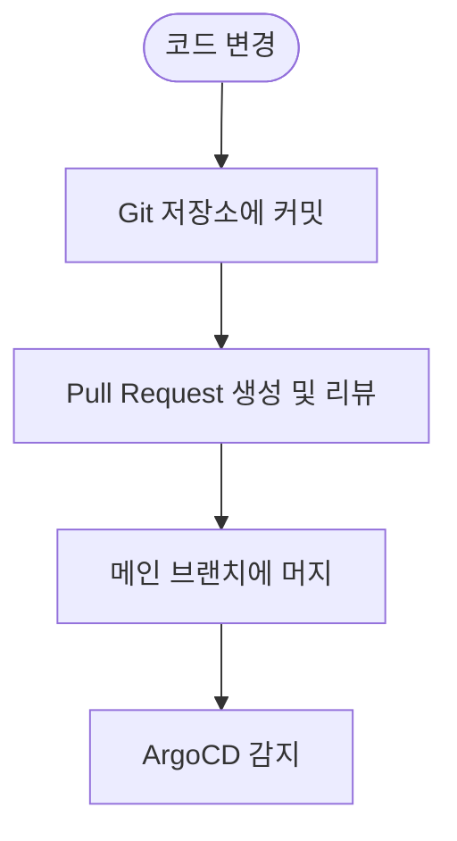
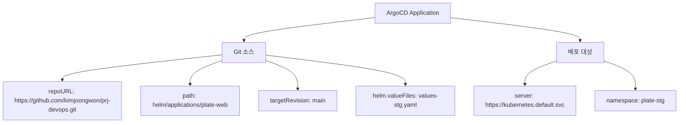
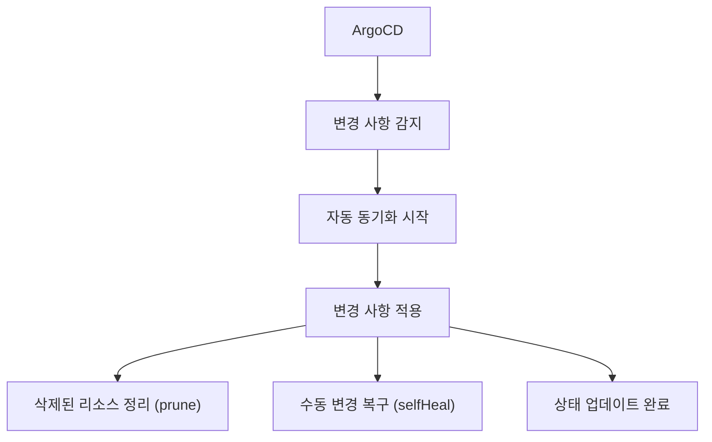
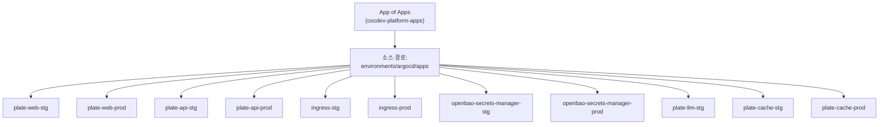
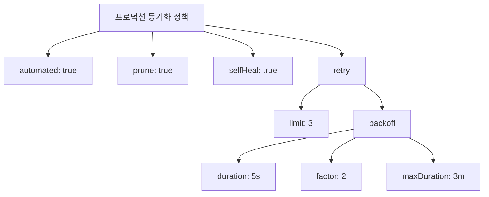
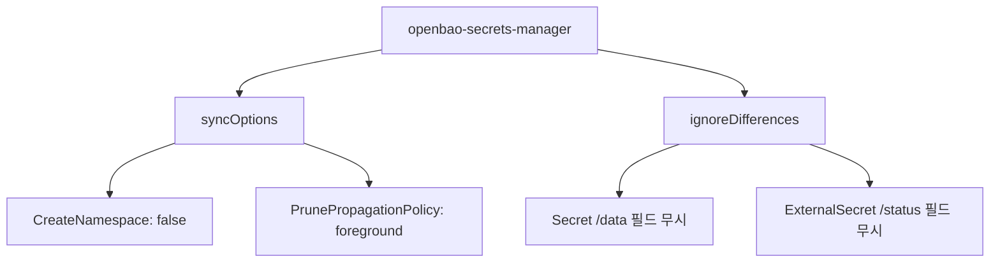
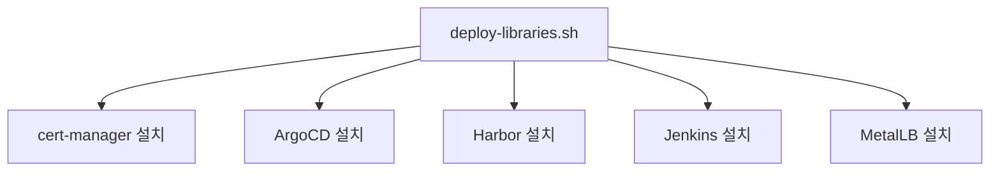
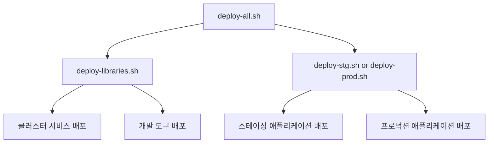
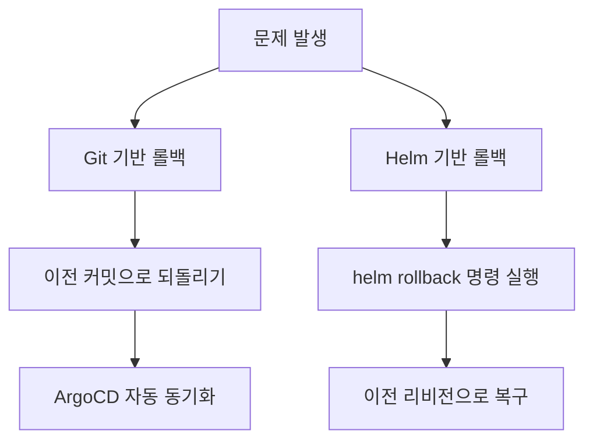
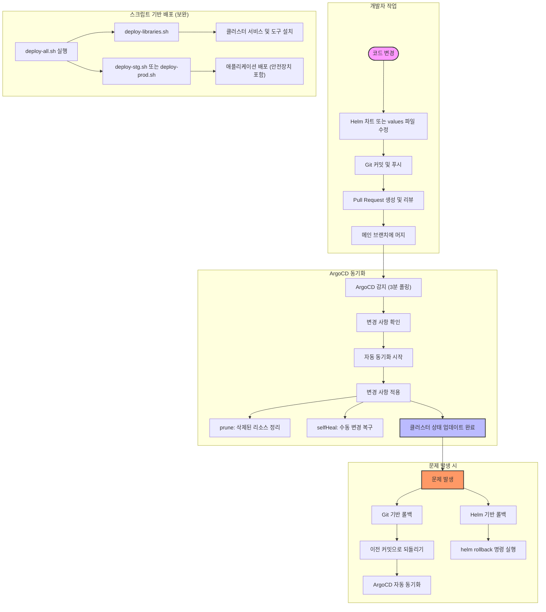

# GitOps 워크플로우

<cite>
**이 문서에서 참조한 파일**   
- [README.md](file://README.md)
- [environments/argocd/README.md](file://environments/argocd/README.md)
- [environments/argocd/app-of-apps.yaml](file://environments/argocd/app-of-apps.yaml)
- [environments/argocd/apps/plate-web-stg.yaml](file://environments/argocd/apps/plate-web-stg.yaml)
- [environments/argocd/apps/plate-web-prod.yaml](file://environments/argocd/apps/plate-web-prod.yaml)
- [environments/argocd/apps/plate-api-stg.yaml](file://environments/argocd/apps/plate-api-stg.yaml)
- [environments/argocd/apps/plate-api-prod.yaml](file://environments/argocd/apps/plate-api-prod.yaml)
- [environments/argocd/apps/plate-llm-stg.yaml](file://environments/argocd/apps/plate-llm-stg.yaml)
- [environments/argocd/apps/plate-cache-stg.yaml](file://environments/argocd/apps/plate-cache-stg.yaml)
- [environments/argocd/apps/plate-cache-prod.yaml](file://environments/argocd/apps/plate-cache-prod.yaml)
- [environments/argocd/apps/ingress-stg.yaml](file://environments/argocd/apps/ingress-stg.yaml)
- [environments/argocd/apps/ingress-prod.yaml](file://environments/argocd/apps/ingress-prod.yaml)
- [environments/argocd/apps/openbao-secrets-manager-stg.yaml](file://environments/argocd/apps/openbao-secrets-manager-stg.yaml)
- [environments/argocd/apps/openbao-secrets-manager-prod.yaml](file://environments/argocd/apps/openbao-secrets-manager-prod.yaml)
- [helm/applications/plate-web/Chart.yaml](file://helm/applications/plate-web/Chart.yaml)
- [helm/applications/plate-server/Chart.yaml](file://helm/applications/plate-server/Chart.yaml)
- [helm/applications/plate-server/values-stg.yaml](file://helm/applications/plate-server/values-stg.yaml)
- [helm/applications/plate-server/values-prod.yaml](file://helm/applications/plate-server/values-prod.yaml)
- [helm/development-tools/argocd/README.md](file://helm/development-tools/argocd/README.md)
- [helm/development-tools/argocd/values.yaml](file://helm/development-tools/argocd/values.yaml)
- [scripts/deploy-all.sh](file://scripts/deploy-all.sh)
- [scripts/deploy-stg.sh](file://scripts/deploy-stg.sh)
- [scripts/deploy-prod.sh](file://scripts/deploy-prod.sh)
- [scripts/deploy-libraries.sh](file://scripts/deploy-libraries.sh)
</cite>

## 목차
1. [소개](#소개)
2. [GitOps 아키텍처 개요](#gitops-아키텍처-개요)
3. [ArgoCD 기반 GitOps 워크플로우](#argocd-기반-gitops-워크플로우)
4. [App-of-Apps 패턴](#app-of-apps-패턴)
5. [환경별 동기화 정책](#환경별-동기화-정책)
6. [스크립트 기반 배포와 GitOps 통합](#스크립트-기반-배포와-gitops-통합)
7. [충돌 해결 및 롤백 메커니즘](#충돌-해결-및-롤백-메커니즘)
8. [시각적 워크플로우 다이어그램](#시각적-워크플로우-다이어그램)
9. [결론](#결론)

## 소개

prj-devops 프로젝트는 GitOps 원칙을 기반으로 Kubernetes 클러스터를 관리하는 포괄적인 DevOps 솔루션입니다. 이 문서는 코드 변경이 Git 저장소에 커밋된 후 ArgoCD에 의해 감지되어 자동으로 Kubernetes 클러스터에 배포되는 전체 흐름을 설명합니다. 특히 코드 변경 → 커밋 → ArgoCD 동기화 → 클러스터 상태 업데이트의 사이클과 함께, 이 과정에서 발생할 수 있는 충돌 해결 전략과 롤백 메커니즘을 상세히 다룹니다. 또한 스크립트 기반 배포(deploy-all.sh)와 GitOps 기반 배포의 관계와 통합 방식을 설명합니다.

**Section sources**
- [README.md](file://README.md#L1-L417)

## GitOps 아키텍처 개요

prj-devops 프로젝트는 GitOps 원칙을 철저히 구현한 계층화된 아키텍처를 갖추고 있습니다. 이 아키텍처는 인프라, 개발 도구, 애플리케이션의 세 가지 주요 계층으로 구성되어 있으며, 각 계층은 독립적으로 관리되면서도 전체 시스템의 일관성을 유지합니다. Git 저장소는 시스템의 단일 진실 원천(Single Source of Truth)으로 기능하며, 모든 구성 변경 사항은 Git을 통해 추적되고 관리됩니다.

ArgoCD는 이 GitOps 아키텍처의 핵심 구성 요소로, Git 저장소의 상태와 Kubernetes 클러스터의 실제 상태를 지속적으로 비교하고 동기화합니다. 이는 선언적이고 자동화된 배포 프로세스를 가능하게 하며, 수동 개입을 최소화하여 운영 오류를 줄이고 시스템의 안정성을 높입니다. 전체 아키텍처는 Git 저장소를 중심으로 구성되며, ArgoCD는 이 저장소의 변경 사항을 감지하여 클러스터에 자동으로 적용합니다.

**Section sources**
- [README.md](file://README.md#L7-L15)
- [environments/argocd/README.md](file://environments/argocd/README.md#L1-L107)

## ArgoCD 기반 GitOps 워크플로우

prj-devops에서 GitOps 워크플로우는 ArgoCD를 중심으로 작동합니다. 이 워크플로우는 코드 변경이 Git 저장소에 반영되는 순간부터 시작되어, ArgoCD에 의해 클러스터에 자동으로 배포되는 일련의 과정을 포함합니다.

### 코드 변경 및 커밋

GitOps 워크플로우의 시작은 코드 변경입니다. 개발자는 Helm 차트, values 파일, 또는 애플리케이션 코드를 수정한 후, 이 변경 사항을 Git 저장소에 커밋합니다. 이 커밋은 변경 사항의 내용과 이유를 명확히 기록하며, Pull Request를 통해 코드 리뷰를 거칩니다. 이 과정은 변경 사항의 품질을 보장하고, 팀원 간의 협업을 촉진합니다.

**Diagram sources**
- [environments/argocd/apps/plate-web-stg.yaml](file://environments/argocd/apps/plate-web-stg.yaml#L18-L20)
- [environments/argocd/apps/plate-api-stg.yaml](file://environments/argocd/apps/plate-api-stg.yaml#L18-L20)

### ArgoCD 동기화

ArgoCD는 설정된 폴링 주기(기본 3분)로 Git 저장소를 주기적으로 감시합니다. 메인 브랜치에 새로운 커밋이 감지되면, ArgoCD는 해당 변경 사항을 즉시 인식합니다. ArgoCD는 각 애플리케이션에 대해 별도의 ArgoCD Application 리소스를 사용하여, 특정 Helm 차트 경로와 values 파일을 추적합니다. 예를 들어, `plate-web-stg` 애플리케이션은 `helm/applications/plate-web` 경로의 차트와 `values-stg.yaml` 파일을 소스로 지정합니다.

**Diagram sources**
- [environments/argocd/apps/plate-web-stg.yaml](file://environments/argocd/apps/plate-web-stg.yaml#L17-L30)
- [environments/argocd/apps/plate-api-prod.yaml](file://environments/argocd/apps/plate-api-prod.yaml#L17-L30)

### 클러스터 상태 업데이트

ArgoCD가 변경 사항을 감지하면, 자동 동기화 정책에 따라 클러스터 상태를 업데이트합니다. 이 과정은 `syncPolicy.automated` 설정에 의해 제어되며, `prune: true` 옵션은 Git 저장소에서 삭제된 리소스를 클러스터에서도 자동으로 제거하고, `selfHeal: true` 옵션은 클러스터에서 수동으로 변경된 상태를 Git 저장소의 상태로 자동 복구합니다. 이로 인해 Git 저장소와 클러스터의 상태는 항상 일치하게 유지됩니다.

**Diagram sources**
- [environments/argocd/apps/plate-web-stg.yaml](file://environments/argocd/apps/plate-web-stg.yaml#L34-L36)
- [environments/argocd/apps/plate-api-prod.yaml](file://environments/argocd/apps/plate-api-prod.yaml#L34-L36)

**Section sources**
- [environments/argocd/README.md](file://environments/argocd/README.md#L60-L65)
- [environments/argocd/apps/plate-web-stg.yaml](file://environments/argocd/apps/plate-web-stg.yaml#L31-L62)
- [environments/argocd/apps/plate-api-prod.yaml](file://environments/argocd/apps/plate-api-prod.yaml#L31-L62)

## App-of-Apps 패턴

prj-devops 프로젝트는 ArgoCD의 App-of-Apps 패턴을 활용하여 모든 애플리케이션을 효율적으로 관리합니다. 이 패턴은 하나의 상위 ArgoCD Application이 여러 하위 ArgoCD Application을 관리하는 구조로, 전체 시스템의 복잡성을 줄이고 관리의 일관성을 제공합니다.

### App-of-Apps 메인 애플리케이션

`environments/argocd/app-of-apps.yaml` 파일은 App-of-Apps 패턴의 핵심인 메인 ArgoCD Application을 정의합니다. 이 애플리케이션은 `environments/argocd/apps` 디렉터리에 있는 모든 하위 Application 파일을 소스로 지정합니다. 이로 인해 새로운 애플리케이션이 이 디렉터리에 추가되면, 메인 Application이 자동으로 이를 감지하고 생성합니다.

**Diagram sources**
- [environments/argocd/app-of-apps.yaml](file://environments/argocd/app-of-apps.yaml#L1-L35)

### 개별 애플리케이션 관리

각 하위 ArgoCD Application은 특정 서비스와 환경을 위한 독립적인 배포 단위입니다. 예를 들어, `plate-web-stg.yaml`은 스테이징 환경의 웹 애플리케이션을 관리하며, `plate-api-prod.yaml`은 프로덕션 환경의 API 서버를 관리합니다. 이러한 분리된 관리는 환경 간의 오염을 방지하고, 각 환경에 맞는 정책과 설정을 적용할 수 있게 합니다.

**Section sources**
- [environments/argocd/README.md](file://environments/argocd/README.md#L400-L407)
- [environments/argocd/app-of-apps.yaml](file://environments/argocd/app-of-apps.yaml#L1-L35)

## 환경별 동기화 정책

prj-devops는 스테이징과 프로덕션 환경에 따라 서로 다른 동기화 정책을 적용하여, 개발의 유연성과 프로덕션의 안정성을 동시에 확보합니다.

### 스테이징 환경 정책

스테이징 환경은 빠른 피드백과 반복적인 개발을 위해 설계되었습니다. 따라서 동기화 재시도 정책이 보다 공격적입니다. `retry.limit`이 5로 설정되어 있어, 동기화 실패 시 최대 5번까지 재시도하며, 백오프 전략은 지수적으로 증가합니다(5s → 10s → 20s → 40s → 80s). 이는 개발 과정에서 일시적인 오류가 발생하더라도 자동으로 복구될 가능성을 높입니다.

**Diagram sources**
- [environments/argocd/apps/plate-web-stg.yaml](file://environments/argocd/apps/plate-web-stg.yaml#L43-L49)
- [environments/argocd/apps/plate-api-stg.yaml](file://environments/argocd/apps/plate-api-stg.yaml#L43-L49)

### 프로덕션 환경 정책

프로덕션 환경은 안정성과 신뢰성이 최우선입니다. 따라서 동기화 재시도 정책이 보수적으로 설정되어 있습니다. `retry.limit`이 3으로 설정되어 있어, 재시도 횟수가 제한되며, 이는 장애가 지속될 경우 빠르게 수동 개입을 유도합니다. 또한, `revisionHistoryLimit`이 10으로 설정되어 있어, 롤백 가능한 이전 리비전을 충분히 보관합니다.

**Diagram sources**
- [environments/argocd/apps/plate-web-prod.yaml](file://environments/argocd/apps/plate-web-prod.yaml#L43-L49)
- [environments/argocd/apps/plate-api-prod.yaml](file://environments/argocd/apps/plate-api-prod.yaml#L43-L49)

### 특수한 동기화 요구사항

일부 애플리케이션은 특수한 동기화 요구사항을 가집니다. 예를 들어, `openbao-secrets-manager` 애플리케이션은 `CreateNamespace: false`로 설정되어 있어, 네임스페이스가 사전에 생성되어야 합니다. 이는 시크릿 관리자가 애플리케이션보다 먼저 생성되어야 하는 의존성 때문입니다. 또한, `ignoreDifferences` 설정을 통해 외부 시스템에 의해 관리되는 Secret의 `data` 필드나 ExternalSecret의 `status` 필드 변경을 무시하도록 구성되어 있습니다.

**Diagram sources**
- [environments/argocd/apps/openbao-secrets-manager-stg.yaml](file://environments/argocd/apps/openbao-secrets-manager-stg.yaml#L47-L48)
- [environments/argocd/apps/openbao-secrets-manager-stg.yaml](file://environments/argocd/apps/openbao-secrets-manager-stg.yaml#L63-L72)

**Section sources**
- [environments/argocd/apps/plate-web-stg.yaml](file://environments/argocd/apps/plate-web-stg.yaml#L43-L49)
- [environments/argocd/apps/plate-web-prod.yaml](file://environments/argocd/apps/plate-web-prod.yaml#L43-L49)
- [environments/argocd/apps/openbao-secrets-manager-stg.yaml](file://environments/argocd/apps/openbao-secrets-manager-stg.yaml#L37-L78)
- [environments/argocd/apps/openbao-secrets-manager-prod.yaml](file://environments/argocd/apps/openbao-secrets-manager-prod.yaml#L61-L80)

## 스크립트 기반 배포와 GitOps 통합

prj-devops는 GitOps 기반의 자동화된 배포와 스크립트 기반의 수동 배포를 전략적으로 통합하여, 다양한 운영 요구사항을 충족합니다.

### 스크립트 기반 배포의 역할

`scripts/deploy-all.sh`, `deploy-libraries.sh`, `deploy-stg.sh`, `deploy-prod.sh` 등의 스크립트는 GitOps 워크플로우의 보완 역할을 합니다. 특히, 클러스터 서비스(cert-manager, MetalLB)와 개발 도구(ArgoCD, Harbor)는 초기 설치 시점에만 필요하며, 이후에는 자주 변경되지 않습니다. 이러한 컴포넌트들은 스크립트를 통해 Helm CLI로 배포되며, 그 설정값은 각 차트 디렉터리의 `values.yaml` 파일에 형상 관리됩니다.

**Diagram sources**
- [scripts/deploy-libraries.sh](file://scripts/deploy-libraries.sh#L43-L102)

### 통합된 배포 오케스트레이션

`deploy-all.sh` 스크립트는 전체 배포 프로세스를 오케스트레이션합니다. 이 스크립트는 먼저 `deploy-libraries.sh`를 실행하여 인프라와 도구를 배포한 후, `deploy-stg.sh` 또는 `deploy-prod.sh`를 실행하여 애플리케이션을 배포합니다. 이 과정에서 `deploy-prod.sh`는 사용자 확인, 자동 백업 생성, 헬스 체크 검증 등의 안전장치를 포함하여 프로덕션 배포의 위험을 최소화합니다.

**Diagram sources**
- [scripts/deploy-all.sh](file://scripts/deploy-all.sh#L119-L154)

### GitOps와의 관계

이러한 스크립트 기반 배포는 GitOps 워크플로우의 전제 조건을 설정하는 역할을 합니다. 즉, ArgoCD 자체가 GitOps를 통해 관리되기 전에, `deploy-libraries.sh`를 통해 수동으로 설치되어야 합니다. 이후에는 모든 애플리케이션 배포가 ArgoCD를 통해 자동화되며, 스크립트는 주로 초기 설정, 드라이런, 또는 예외적인 상황에서 사용됩니다. 이는 GitOps의 이점을 극대화하면서도, 초기 설정의 유연성을 보장하는 균형 잡힌 접근 방식입니다.

**Section sources**
- [README.md](file://README.md#L119-L130)
- [scripts/deploy-all.sh](file://scripts/deploy-all.sh#L119-L154)
- [scripts/deploy-libraries.sh](file://scripts/deploy-libraries.sh#L113-L115)

## 충돌 해결 및 롤백 메커니즘

GitOps 워크플로우는 여러 팀원이 동시에 작업할 때 발생할 수 있는 충돌을 효과적으로 해결하고, 문제가 발생했을 때 빠르게 복구할 수 있는 강력한 메커니즘을 제공합니다.

### 충돌 해결 전략

가장 중요한 충돌 해결 전략은 Git의 브랜치 전략과 Pull Request 리뷰 프로세스입니다. 모든 변경 사항은 먼저 기능 브랜치에서 개발된 후, 메인 브랜치에 머지되기 전에 코드 리뷰를 거칩니다. 이 과정에서 충돌이 발생하면 Git의 머지 기능을 통해 해결되며, 리뷰어는 변경 사항의 영향을 검토하여 승인합니다. 이는 변경 사항이 클러스터에 적용되기 전에 충돌을 사전에 방지하는 효과적인 수단입니다.

또한, ArgoCD의 `selfHeal: true` 정책은 수동 변경과의 충돌을 해결합니다. 만약 운영자가 클러스터에서 수동으로 리소스를 수정하더라도, ArgoCD는 이를 감지하고 Git 저장소의 상태로 자동 복구합니다. 이는 Git 저장소를 단일 진실 원천으로 유지하여, 수동 변경으로 인한 불일치를 방지합니다.

### 롤백 메커니즘

prj-devops는 두 가지 주요 롤백 메커니즘을 제공합니다. 첫째, Git 기반 롤백입니다. 문제가 발생하면, Git 저장소에서 이전의 안정적인 커밋으로 되돌린 후, ArgoCD가 자동으로 해당 상태로 클러스터를 동기화합니다. 이는 Git의 버전 관리 기능을 직접 활용하는 가장 신뢰할 수 있는 방법입니다.

둘째, Helm 기반 롤백입니다. `deploy-prod.sh` 스크립트는 `helm rollback` 명령을 통해 이전 리비전으로 롤백할 수 있는 기능을 제공합니다. 이는 Git 기반 롤백이 어려운 상황에서 보조적인 수단으로 사용됩니다.

**Diagram sources**
- [README.md](file://README.md#L228-L229)
- [scripts/deploy-prod.sh](file://scripts/deploy-prod.sh#L277-L281)

**Section sources**
- [README.md](file://README.md#L228-L229)
- [scripts/deploy-prod.sh](file://scripts/deploy-prod.sh#L277-L281)

## 시각적 워크플로우 다이어그램

다음 다이어그램은 prj-devops의 전체 GitOps 워크플로우를 시각적으로 요약합니다. 이는 코드 변경이 시작되어 클러스터에 배포되고, 필요 시 롤백되는 일련의 과정을 단계별로 보여줍니다.

**Diagram sources**
- [environments/argocd/apps/plate-web-stg.yaml](file://environments/argocd/apps/plate-web-stg.yaml#L34-L36)
- [environments/argocd/apps/plate-api-prod.yaml](file://environments/argocd/apps/plate-api-prod.yaml#L34-L36)
- [scripts/deploy-all.sh](file://scripts/deploy-all.sh#L119-L154)
- [scripts/deploy-prod.sh](file://scripts/deploy-prod.sh#L277-L281)

## 결론

prj-devops 프로젝트는 GitOps 원칙을 효과적으로 구현하여, 안정적이고 신뢰할 수 있는 Kubernetes 운영 환경을 제공합니다. ArgoCD를 중심으로 한 App-of-Apps 패턴은 복잡한 다중 환경 애플리케이션을 체계적으로 관리할 수 있게 하며, 자동 동기화 정책은 Git 저장소와 클러스터 상태의 일관성을 보장합니다. 스테이징과 프로덕션 환경에 맞춘 차별화된 동기화 정책은 개발의 유연성과 프로덕션의 안정성을 동시에 확보합니다. 또한, 스크립트 기반 배포와 GitOps 기반 배포의 전략적 통합은 초기 설정과 예외 상황에 대한 유연성을 제공합니다. 강력한 충돌 해결 전략과 이중 롤백 메커니즘은 운영 중 발생할 수 있는 문제에 대비한 견고한 안전망을 제공합니다. 이러한 종합적인 접근 방식은 현대적인 클라우드 네이티브 애플리케이션을 운영하는 데 있어 모범 사례를 제시합니다.