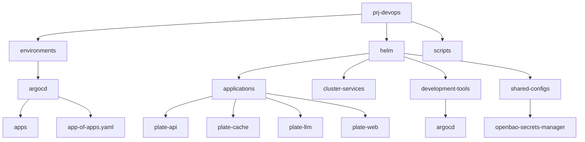
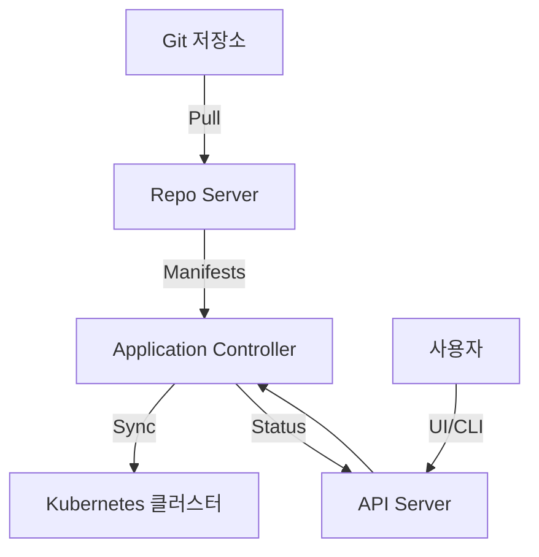
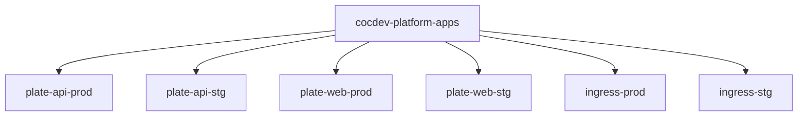
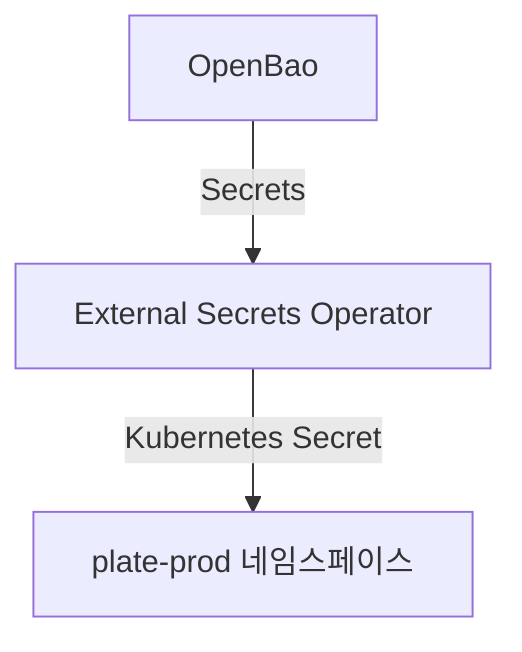
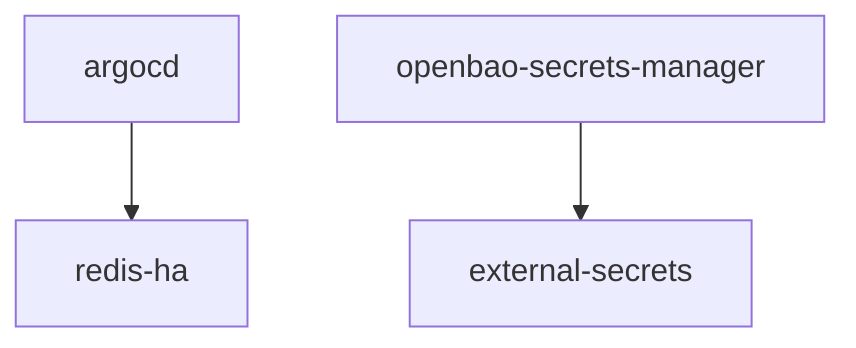

# ArgoCD

<cite>
**이 문서에서 참조한 파일**  
- [app-of-apps.yaml](file://environments/argocd/app-of-apps.yaml)
- [plate-api-prod.yaml](file://environments/argocd/apps/plate-api-prod.yaml)
- [plate-api-stg.yaml](file://environments/argocd/apps/plate-api-stg.yaml)
- [plate-web-prod.yaml](file://environments/argocd/apps/plate-web-prod.yaml)
- [plate-web-stg.yaml](file://environments/argocd/apps/plate-web-stg.yaml)
- [argocd/Chart.yaml](file://helm/development-tools/argocd/Chart.yaml)
- [argocd/values.yaml](file://helm/development-tools/argocd/values.yaml)
- [plate-api/Chart.yaml](file://helm/applications/plate-api/Chart.yaml)
- [plate-api/values-prod.yaml](file://helm/applications/plate-api/values-prod.yaml)
- [plate-api/values-stg.yaml](file://helm/applications/plate-api/values-stg.yaml)
- [plate-web/Chart.yaml](file://helm/applications/plate-web/Chart.yaml)
- [plate-web/values-prod.yaml](file://helm/applications/plate-web/values-prod.yaml)
- [plate-web/values-stg.yaml](file://helm/applications/plate-web/values-stg.yaml)
- [openbao-secrets-manager/Chart.yaml](file://helm/shared-configs/openbao-secrets-manager/Chart.yaml)
- [openbao-secrets-manager/values-production.yaml](file://helm/shared-configs/openbao-secrets-manager/values-production.yaml)
</cite>

## 목차
1. [소개](#소개)
2. [프로젝트 구조](#프로젝트-구조)
3. [핵심 구성 요소](#핵심-구성-요소)
4. [아키텍처 개요](#아키텍처-개요)
5. [상세 구성 요소 분석](#상세-구성-요소-분석)
6. [의존성 분석](#의존성-분석)
7. [성능 고려사항](#성능-고려사항)
8. [문제 해결 가이드](#문제-해결-가이드)
9. [결론](#결론)

## 소개
이 문서는 prj-devops 리포지토리에서 ArgoCD를 활용한 GitOps 기반 배포 자동화 기능을 심층적으로 설명합니다. Chart.yaml과 values.yaml을 기반으로 한 설치 및 구성 방법, 주요 컴포넌트(Application Controller, Repo Server, API Server)의 역할과 상호작용을 문서화합니다. App-of-Apps 패턴을 통한 계층적 애플리케이션 관리, 환경별 동기화 전략, 인증 및 RBAC 설정, 네트워크 정책, 모니터링 연동(Servicemonitor)을 포함합니다. 실제 코드베이스에서의 사용 예시와 함께 배포 상태 확인, 동기화 오류 해결, 민감 정보 관리(External Secrets, OpenBao 연동)에 대한 가이드를 제공합니다. 고가용성 구성 및 확장성 고려사항도 포함합니다.

## 프로젝트 구조
prj-devops 리포지토리는 Helm 기반의 애플리케이션 배포를 위한 구조로 구성되어 있습니다. 주요 디렉터리는 environments, helm, scripts로 나뉩니다. environments 디렉터리는 ArgoCD를 위한 설정 파일을 포함하고 있으며, helm 디렉터리는 각 애플리케이션의 Helm 차트를 포함하고 있습니다. scripts 디렉터리는 배포 및 검증을 위한 스크립트를 포함하고 있습니다.

**다이어그램 출처**  
- [app-of-apps.yaml](file://environments/argocd/app-of-apps.yaml)
- [argocd/Chart.yaml](file://helm/development-tools/argocd/Chart.yaml)
- [plate-api/Chart.yaml](file://helm/applications/plate-api/Chart.yaml)
- [plate-web/Chart.yaml](file://helm/applications/plate-web/Chart.yaml)
- [openbao-secrets-manager/Chart.yaml](file://helm/shared-configs/openbao-secrets-manager/Chart.yaml)

**섹션 출처**  
- [app-of-apps.yaml](file://environments/argocd/app-of-apps.yaml)
- [argocd/Chart.yaml](file://helm/development-tools/argocd/Chart.yaml)
- [plate-api/Chart.yaml](file://helm/applications/plate-api/Chart.yaml)
- [plate-web/Chart.yaml](file://helm/applications/plate-web/Chart.yaml)
- [openbao-secrets-manager/Chart.yaml](file://helm/shared-configs/openbao-secrets-manager/Chart.yaml)

## 핵심 구성 요소
ArgoCD의 핵심 구성 요소는 Application Controller, Repo Server, API Server로 구성됩니다. Application Controller는 클러스터 상태와 Git 저장소 상태를 비교하고 동기화를 수행합니다. Repo Server는 Git 저장소에서 매니페스트를 가져와 클러스터에 적용합니다. API Server는 웹 UI와 CLI를 통해 사용자와 상호작용합니다.

**섹션 출처**  
- [argocd/Chart.yaml](file://helm/development-tools/argocd/Chart.yaml)
- [argocd/values.yaml](file://helm/development-tools/argocd/values.yaml)

## 아키텍처 개요
ArgoCD는 GitOps 원칙에 따라 애플리케이션을 배포하고 관리합니다. Git 저장소에 정의된 상태와 클러스터의 실제 상태를 비교하여 차이를 자동으로 동기화합니다. App-of-Apps 패턴을 사용하여 여러 애플리케이션을 계층적으로 관리할 수 있습니다.

**다이어그램 출처**  
- [app-of-apps.yaml](file://environments/argocd/app-of-apps.yaml)
- [argocd/values.yaml](file://helm/development-tools/argocd/values.yaml)

## 상세 구성 요소 분석

### App-of-Apps 패턴 분석
App-of-Apps 패턴은 여러 애플리케이션을 하나의 상위 애플리케이션으로 관리하는 방법입니다. environments/argocd/app-of-apps.yaml 파일에서 cocdev-platform-apps라는 상위 애플리케이션이 environments/argocd/apps 디렉터리에 있는 모든 애플리케이션을 관리합니다.

**다이어그램 출처**  
- [app-of-apps.yaml](file://environments/argocd/app-of-apps.yaml)

**섹션 출처**  
- [app-of-apps.yaml](file://environments/argocd/app-of-apps.yaml)

### 환경별 동기화 전략 분석
각 애플리케이션은 환경별로 별도의 ArgoCD Application 리소스로 정의되어 있습니다. 예를 들어, plate-api-prod.yaml과 plate-api-stg.yaml은 각각 production과 staging 환경을 위한 설정을 포함하고 있습니다. 동기화 정책은 automated로 설정되어 있어 Git 저장소의 변경 사항이 자동으로 클러스터에 반영됩니다.

**섹션 출처**  
- [plate-api-prod.yaml](file://environments/argocd/apps/plate-api-prod.yaml)
- [plate-api-stg.yaml](file://environments/argocd/apps/plate-api-stg.yaml)
- [plate-web-prod.yaml](file://environments/argocd/apps/plate-web-prod.yaml)
- [plate-web-stg.yaml](file://environments/argocd/apps/plate-web-stg.yaml)

### 인증 및 RBAC 설정 분석
ArgoCD의 RBAC 설정은 values.yaml 파일의 configs.rbac.policy.csv 항목을 통해 정의됩니다. admin 역할은 모든 리소스에 대한 접근 권한을 가지며, readonly 역할은 읽기 전용 권한을 가집니다. 이 설정을 통해 사용자별로 적절한 권한을 부여할 수 있습니다.

**섹션 출처**  
- [argocd/values.yaml](file://helm/development-tools/argocd/values.yaml#L478-L497)

### 민감 정보 관리 분석
민감 정보 관리는 External Secrets Operator와 OpenBao를 연동하여 수행됩니다. openbao-secrets-manager Helm 차트는 OpenBao에 저장된 비밀 정보를 Kubernetes Secret으로 동기화합니다. values-production.yaml 파일은 production 환경에서 사용할 비밀 정보의 매핑을 정의합니다.

**다이어그램 출처**  
- [openbao-secrets-manager/Chart.yaml](file://helm/shared-configs/openbao-secrets-manager/Chart.yaml)
- [openbao-secrets-manager/values-production.yaml](file://helm/shared-configs/openbao-secrets-manager/values-production.yaml)

**섹션 출처**  
- [openbao-secrets-manager/Chart.yaml](file://helm/shared-configs/openbao-secrets-manager/Chart.yaml)
- [openbao-secrets-manager/values-production.yaml](file://helm/shared-configs/openbao-secrets-manager/values-production.yaml)

## 의존성 분석
ArgoCD는 Helm 차트를 통해 다양한 외부 서비스에 의존합니다. development-tools 디렉터리의 argocd 차트는 redis-ha 차트에 의존하며, shared-configs 디렉터리의 openbao-secrets-manager 차트는 external-secrets 차트에 의존합니다. 이러한 의존성은 Chart.yaml 파일의 dependencies 섹션에 정의되어 있습니다.

**다이어그램 출처**  
- [argocd/Chart.yaml](file://helm/development-tools/argocd/Chart.yaml#L10-L14)
- [openbao-secrets-manager/Chart.yaml](file://helm/shared-configs/openbao-secrets-manager/Chart.yaml#L19-L23)

**섹션 출처**  
- [argocd/Chart.yaml](file://helm/development-tools/argocd/Chart.yaml)
- [openbao-secrets-manager/Chart.yaml](file://helm/shared-configs/openbao-secrets-manager/Chart.yaml)

## 성능 고려사항
ArgoCD의 성능은 여러 요소에 의해 영향을 받습니다. values.yaml 파일의 controller.status.processors와 controller.operation.processors 설정을 통해 상태 처리 및 작업 처리 성능을 조정할 수 있습니다. 또한, syncOptions의 ApplyOutOfSyncOnly 설정을 통해 변경된 리소스만 적용하여 성능을 최적화할 수 있습니다.

**섹션 출처**  
- [argocd/values.yaml](file://helm/development-tools/argocd/values.yaml#L403-L406)

## 문제 해결 가이드
ArgoCD에서 발생할 수 있는 일반적인 문제는 동기화 실패, 리소스 충돌, 네트워크 정책 위반 등입니다. 동기화 실패 시 retry 정책을 통해 자동 재시도가 가능하며, 리소스 충돌 시 prune 설정을 통해 Git 저장소에 없는 리소스를 자동으로 삭제할 수 있습니다. 네트워크 정책 위반 시 networkPolicy 설정을 통해 적절한 네트워크 규칙을 정의해야 합니다.

**섹션 출처**  
- [plate-api-prod.yaml](file://environments/argocd/apps/plate-api-prod.yaml#L43-L49)
- [plate-api-stg.yaml](file://environments/argocd/apps/plate-api-stg.yaml#L43-L49)
- [argocd/values.yaml](file://helm/development-tools/argocd/values.yaml#L117-L121)

## 결론
prj-devops 리포지토리는 ArgoCD를 활용한 GitOps 기반 배포 자동화를 효과적으로 구현하고 있습니다. App-of-Apps 패턴을 통한 계층적 관리, 환경별 동기화 전략, RBAC 기반의 보안 설정, External Secrets와 OpenBao를 활용한 민감 정보 관리 등 다양한 기능을 통해 안정적이고 확장 가능한 배포 환경을 제공합니다. 향후 고가용성 구성 및 확장성 고려사항을 반영하여 더욱 견고한 시스템을 구축할 수 있습니다.