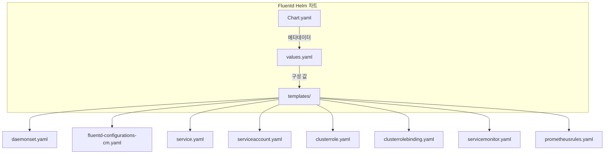
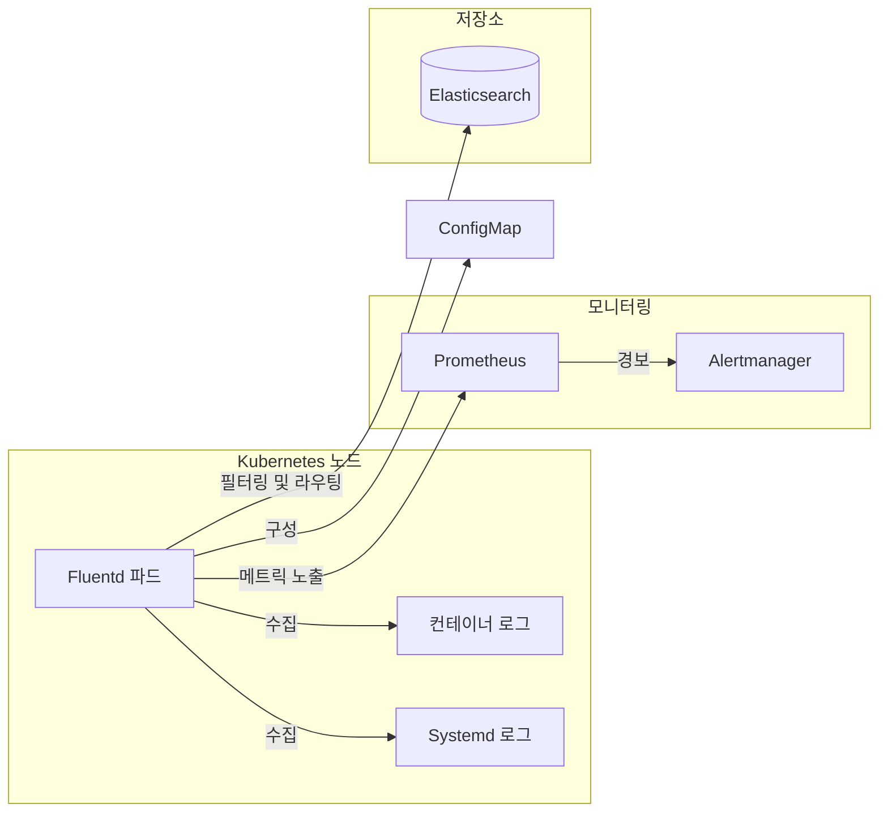
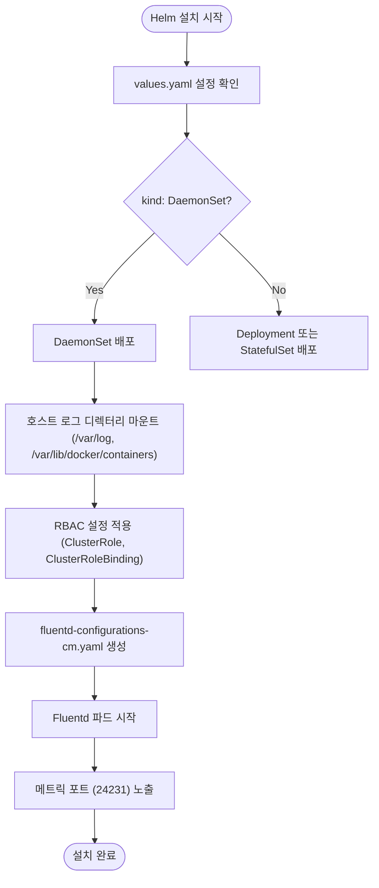
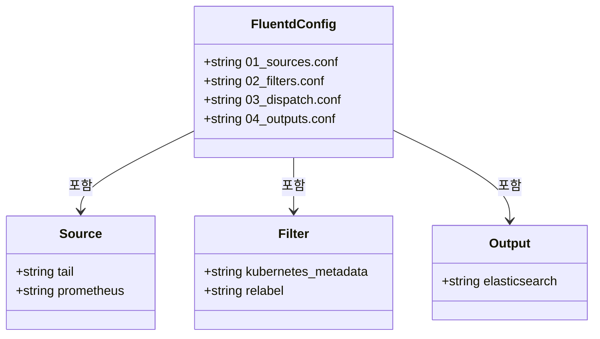
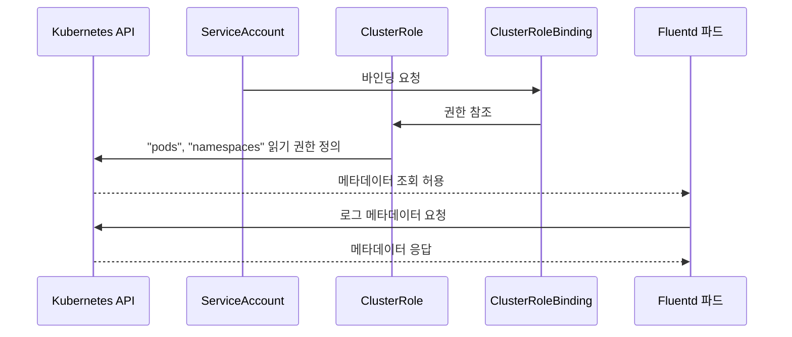

# Fluentd

<cite>
**이 문서에서 참조한 파일**  
- [Chart.yaml](file://helm/development-tools/fluentd/Chart.yaml)
- [values.yaml](file://helm/development-tools/fluentd/values.yaml)
- [fluentd-configurations-cm.yaml](file://helm/development-tools/fluentd/templates/fluentd-configurations-cm.yaml)
- [daemonset.yaml](file://helm/development-tools/fluentd/templates/daemonset.yaml)
- [service.yaml](file://helm/development-tools/fluentd/templates/service.yaml)
- [serviceaccount.yaml](file://helm/development-tools/fluentd/templates/serviceaccount.yaml)
- [clusterrole.yaml](file://helm/development-tools/fluentd/templates/clusterrole.yaml)
- [clusterrolebinding.yaml](file://helm/development-tools/fluentd/templates/clusterrolebinding.yaml)
- [servicemonitor.yaml](file://helm/development-tools/fluentd/templates/servicemonitor.yaml)
- [prometheusrules.yaml](file://helm/development-tools/fluentd/templates/prometheusrules.yaml)
- [_pod.tpl](file://helm/development-tools/fluentd/templates/_pod.tpl)
</cite>

## 목차
1. [소개](#소개)
2. [프로젝트 구조](#프로젝트-구조)
3. [핵심 구성 요소](#핵심-구성-요소)
4. [아키텍처 개요](#아키텍처-개요)
5. [상세 구성 분석](#상세-구성-분석)
6. [로그 수집 파이프라인 설계](#로그-수집-파이프라인-설계)
7. [성능 최적화 및 오류 진단](#성능-최적화-및-오류-진단)
8. [Loki(Promtail) 통합 고려사항](#lokipromtail-통합-고려사항)
9. [결론](#결론)

## 소개
본 문서는 `prj-devops` 프로젝트 내에서 Fluentd를 활용한 로깅 인프라 구축에 대해 심층적으로 설명합니다. Helm 차트 기반의 설치 및 구성 방법, 클러스터 전역 로그 수집을 위한 DaemonSet 활용, 다양한 소스(systemd, 파일)로부터의 로그 수집 설정, Fluentd 구성 파일을 통한 필터링 및 라우팅 전략, Prometheus 연동을 통한 자체 메트릭 노출, 보안 설정(RBAC, 네트워크 정책) 등을 다룹니다. 또한 실제 코드베이스 기반의 사용 예시와 함께 로그 수집 파이프라인 설계, 성능 최적화, 오류 진단 가이드를 제공하며, Loki(Promtail)와의 통합 로깅 아키텍처 고려사항도 포함합니다.

## 프로젝트 구조
Fluentd 관련 구성은 `helm/development-tools/fluentd/` 디렉터리에 위치하며, Helm 차트 형태로 관리됩니다. 주요 구성 요소는 다음과 같습니다:

- **Chart.yaml**: 차트의 메타데이터 및 버전 정보를 포함합니다.
- **values.yaml**: 설치 시 사용자 정의 가능한 기본 설정 값을 정의합니다.
- **templates/**: Kubernetes 리소스를 생성하기 위한 템플릿 파일들이 포함됩니다.
  - `daemonset.yaml`: 각 노드에 Fluentd를 배포하기 위한 DaemonSet 정의
  - `fluentd-configurations-cm.yaml`: 로그 수집, 필터링, 출력을 위한 Fluentd 구성 파일을 저장하는 ConfigMap
  - `service.yaml`: 메트릭 노출을 위한 서비스 정의
  - `serviceaccount.yaml`, `clusterrole.yaml`, `clusterrolebinding.yaml`: RBAC 기반 보안 설정
  - `servicemonitor.yaml`, `prometheusrules.yaml`: Prometheus 연동을 위한 설정

**다이어그램 출처**  
- [Chart.yaml](file://helm/development-tools/fluentd/Chart.yaml)
- [values.yaml](file://helm/development-tools/fluentd/values.yaml)
- [daemonset.yaml](file://helm/development-tools/fluentd/templates/daemonset.yaml)
- [fluentd-configurations-cm.yaml](file://helm/development-tools/fluentd/templates/fluentd-configurations-cm.yaml)

**섹션 출처**  
- [Chart.yaml](file://helm/development-tools/fluentd/Chart.yaml)
- [values.yaml](file://helm/development-tools/fluentd/values.yaml)

## 핵심 구성 요소

Fluentd Helm 차트는 클러스터 전역 로깅을 위한 핵심 구성 요소들로 이루어져 있습니다. 주요 요소는 다음과 같습니다:

- **DaemonSet**: 모든 워커 노드에 Fluentd 파드를 배포하여 노드 수준의 로그를 수집합니다.
- **ConfigMap**: Fluentd의 로그 수집 소스, 필터링 규칙, 출력 대상을 정의하는 구성 파일을 저장합니다.
- **ServiceAccount 및 RBAC**: Fluentd 파드가 Kubernetes API에 접근하여 메타데이터를 수집할 수 있도록 적절한 권한을 부여합니다.
- **Service 및 ServiceMonitor**: Fluentd의 내부 메트릭을 Prometheus에서 수집할 수 있도록 노출합니다.
- **PrometheusRule**: Fluentd의 가용성 및 메트릭 수집 상태를 모니터링하기 위한 경보 규칙을 정의합니다.

**섹션 출처**  
- [values.yaml](file://helm/development-tools/fluentd/values.yaml#L5-L8)
- [daemonset.yaml](file://helm/development-tools/fluentd/templates/daemonset.yaml)
- [fluentd-configurations-cm.yaml](file://helm/development-tools/fluentd/templates/fluentd-configurations-cm.yaml)

## 아키텍처 개요

Fluentd는 Kubernetes 클러스터 내에서 로그 수집 에이전트로 동작하며, 다음과 같은 아키텍처를 따릅니다:

**다이어그램 출처**  
- [fluentd-configurations-cm.yaml](file://helm/development-tools/fluentd/templates/fluentd-configurations-cm.yaml)
- [values.yaml](file://helm/development-tools/fluentd/values.yaml#L7)
- [servicemonitor.yaml](file://helm/development-tools/fluentd/templates/servicemonitor.yaml)

## 상세 구성 분석

### 설치 및 구성 방법

Fluentd는 Helm 차트를 통해 설치되며, `values.yaml` 파일을 통해 다양한 설정을 사용자 정의할 수 있습니다. 주요 설정 항목은 다음과 같습니다:

- **kind**: `DaemonSet`으로 설정되어 모든 노드에 Fluentd 파드를 배포합니다.
- **variant**: `elasticsearch7`로 설정되어 Elasticsearch 7.x 버전과 호환되도록 구성됩니다.
- **image**: Fluentd 공식 이미지가 사용됩니다.
- **rbac.create**: `true`로 설정되어 RBAC 리소스가 자동 생성됩니다.
- **metrics.serviceMonitor.enabled**: `false`로 기본 설정되어 있으나, Prometheus 연동 시 `true`로 설정해야 합니다.

**다이어그램 출처**  
- [values.yaml](file://helm/development-tools/fluentd/values.yaml)
- [daemonset.yaml](file://helm/development-tools/fluentd/templates/daemonset.yaml)
- [fluentd-configurations-cm.yaml](file://helm/development-tools/fluentd/templates/fluentd-configurations-cm.yaml)

**섹션 출처**  
- [Chart.yaml](file://helm/development-tools/fluentd/Chart.yaml)
- [values.yaml](file://helm/development-tools/fluentd/values.yaml)
- [daemonset.yaml](file://helm/development-tools/fluentd/templates/daemonset.yaml)

### 로그 수집 설정

Fluentd는 `fluentd-configurations-cm.yaml`에 정의된 구성 파일을 통해 다양한 소스에서 로그를 수집합니다. 주요 소스는 다음과 같습니다:

- **컨테이너 로그**: `/var/log/containers/*.log` 경로의 JSON 형식 로그를 수집합니다.
- **systemd 로그**: 별도의 `systemd.yaml` 구성 파일을 통해 수집 가능하도록 설계되어 있습니다.
- **프로메테우스 메트릭**: 내장된 `prometheus` 소스를 통해 자체 메트릭을 `/metrics` 엔드포인트에서 노출합니다.

**다이어그램 출처**  
- [fluentd-configurations-cm.yaml](file://helm/development-tools/fluentd/templates/fluentd-configurations-cm.yaml)
- [values.yaml](file://helm/development-tools/fluentd/values.yaml#L291-L390)

**섹션 출처**  
- [fluentd-configurations-cm.yaml](file://helm/development-tools/fluentd/templates/fluentd-configurations-cm.yaml)
- [values.yaml](file://helm/development-tools/fluentd/values.yaml#L291-L390)

### 필터링 및 라우팅

Fluentd는 수집된 로그에 대해 다양한 필터링 및 라우팅 규칙을 적용합니다:

- **kubernetes_metadata 필터**: 파드, 네임스페이스 등의 Kubernetes 메타데이터를 로그에 추가합니다.
- **relabel 매치**: 특정 로그 스트림(예: Fluentd 자체 로그)을 다른 레이블로 전달하거나 무시합니다.
- **프로메테우스 메트릭 필터**: 입력 레코드 수를 카운터 메트릭으로 수집합니다.

### 보안 설정

Fluentd는 다음과 같은 보안 설정을 통해 안전하게 운영됩니다:

- **RBAC**: `ClusterRole`과 `ClusterRoleBinding`을 통해 파드 및 네임스페이스 정보를 읽을 수 있는 최소한의 권한만 부여합니다.
- **ServiceAccount**: 전용 서비스 어카운트를 사용하여 인증합니다.
- **네트워크 정책**: 별도의 네트워크 정책 파일은 제공되지 않으나, 필요 시 외부 네트워크 정책 컨트롤러를 통해 제어 가능합니다.

**다이어그램 출처**  
- [serviceaccount.yaml](file://helm/development-tools/fluentd/templates/serviceaccount.yaml)
- [clusterrole.yaml](file://helm/development-tools/fluentd/templates/clusterrole.yaml)
- [clusterrolebinding.yaml](file://helm/development-tools/fluentd/templates/clusterrolebinding.yaml)

**섹션 출처**  
- [serviceaccount.yaml](file://helm/development-tools/fluentd/templates/serviceaccount.yaml)
- [clusterrole.yaml](file://helm/development-tools/fluentd/templates/clusterrole.yaml)
- [clusterrolebinding.yaml](file://helm/development-tools/fluentd/templates/clusterrolebinding.yaml)

### Prometheus 연동

Fluentd는 자체 메트릭을 Prometheus에서 수집할 수 있도록 구성됩니다:

- **ServiceMonitor**: `servicemonitor.yaml` 템플릿을 통해 생성되며, Fluentd 서비스의 메트릭 엔드포인트를 타겟으로 추가합니다.
- **PrometheusRule**: `prometheusrules.yaml`을 통해 Fluentd 파드 다운 또는 메트릭 수집 실패 시 경보를 발생시킵니다.

**섹션 출처**  
- [servicemonitor.yaml](file://helm/development-tools/fluentd/templates/servicemonitor.yaml)
- [prometheusrules.yaml](file://helm/development-tools/fluentd/templates/prometheusrules.yaml)
- [values.yaml](file://helm/development-tools/fluentd/values.yaml#L214-L269)

## 로그 수집 파이프라인 설계

Fluentd의 로그 수집 파이프라인은 다음과 같은 단계로 구성됩니다:

1. **수집(Sources)**: 호스트의 `/var/log/containers/*.log`에서 컨테이너 로그를 실시간으로 수집합니다.
2. **필터링(Filters)**: Kubernetes 메타데이터를 추가하고, Fluentd 자체 로그는 별도 레이블로 분리합니다.
3. **디스패치(Dispatch)**: 모든 로그를 출력 레이블로 전달하며, 입력 레코드 수를 메트릭으로 기록합니다.
4. **출력(Outputs)**: Elasticsearch로 로그를 전송합니다.

이러한 파이프라인 설계는 확장성과 유지보수성을 고려하여 모듈화된 구성 파일로 구현되어 있습니다.

**섹션 출처**  
- [fluentd-configurations-cm.yaml](file://helm/development-tools/fluentd/templates/fluentd-configurations-cm.yaml)
- [_pod.tpl](file://helm/development-tools/fluentd/templates/_pod.tpl)

## 성능 최적화 및 오류 진단

### 성능 최적화

- **리소스 제한**: `values.yaml`의 `resources` 섹션을 통해 CPU 및 메모리 요청/제한을 설정하여 리소스 과다 사용을 방지합니다.
- **Termination Grace Period**: 파드 종료 시 로그 처리 완료를 보장하기 위해 적절한 `terminationGracePeriodSeconds`를 설정합니다.
- **볼륨 마운트 최적화**: 불필요한 디렉터리 마운트를 피하고, 읽기 전용 마운트를 활용합니다.

### 오류 진단 가이드

- **파드 상태 확인**: `kubectl get pods -l app=fluentd`로 파드 상태를 확인합니다.
- **로그 확인**: `kubectl logs` 명령으로 Fluentd 파드의 내부 로그를 분석합니다.
- **메트릭 확인**: Prometheus에서 `fluentd_input_status_num_records_total` 등의 메트릭을 통해 로그 수집 상태를 모니터링합니다.
- **구성 오류**: ConfigMap의 YAML 구문 오류 또는 잘못된 경로 설정을 확인합니다.

**섹션 출처**  
- [values.yaml](file://helm/development-tools/fluentd/values.yaml#L82-L87)
- [_pod.tpl](file://helm/development-tools/fluentd/templates/_pod.tpl#L13-L15)
- [fluentd-configurations-cm.yaml](file://helm/development-tools/fluentd/templates/fluentd-configurations-cm.yaml)

## Loki(Promtail) 통합 고려사항

Fluentd와 Loki(Promtail)의 통합은 다음과 같은 방식으로 고려할 수 있습니다:

- **병렬 수집**: Fluentd는 Elasticsearch로, Promtail은 Loki로 각각 로그를 전송하는 병렬 아키텍처.
- **단일 파이프라인**: Fluentd에서 Loki 출력 플러그인(`fluent-plugin-loki`)을 사용하여 직접 전송.
- **비용 및 성능**: Promtail은 경량화된 설계로 리소스 소모가 적으나, Fluentd는 복잡한 변환 및 라우팅이 가능합니다.
- **운영 복잡성**: 두 시스템을 동시에 운영할 경우 모니터링 및 설정 관리의 복잡성이 증가합니다.

**섹션 출처**  
- [values.yaml](file://helm/development-tools/fluentd/values.yaml#L279-L282)
- [fluentd-configurations-cm.yaml](file://helm/development-tools/fluentd/templates/fluentd-configurations-cm.yaml)

## 결론

`prj-devops` 프로젝트의 Fluentd Helm 차트는 클러스터 전역 로그 수집을 위한 견고한 기반을 제공합니다. DaemonSet 기반의 배포, 유연한 구성 관리, Prometheus 연동, RBAC 기반 보안 설정 등을 통해 안정적이고 확장 가능한 로깅 인프라를 구축할 수 있습니다. 향후 Loki와의 통합을 고려할 때는 사용 사례, 성능 요구사항, 운영 복잡성 등을 종합적으로 평가하여 적절한 아키텍처를 선택해야 합니다.