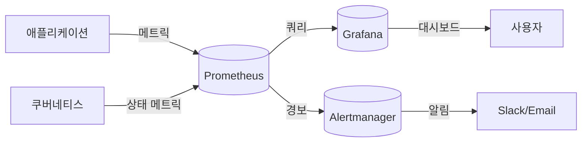
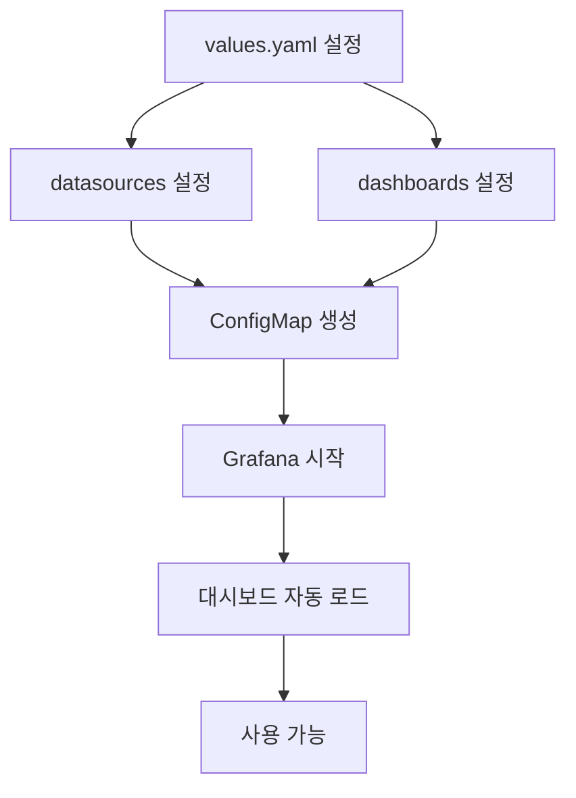
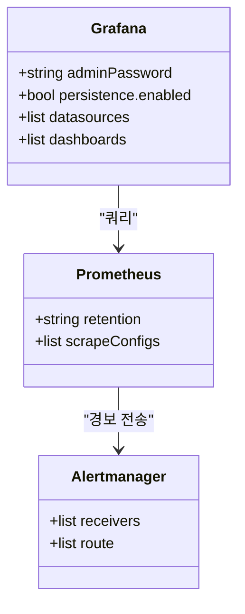

# Grafana

<cite>
**이 문서에서 참조한 파일**  
- [Chart.yaml](file://helm/development-tools/grafana/Chart.yaml)
- [values.yaml](file://helm/development-tools/prometheus/values.yaml)
- [dashboards-json-configmap.yaml](file://helm/development-tools/grafana/templates/dashboards-json-configmap.yaml)
- [values.yaml](file://helm/development-tools/prometheus/charts/alertmanager/values.yaml)
</cite>

## 목차
1. [소개](#소개)
2. [프로젝트 구조](#프로젝트-구조)
3. [핵심 구성 요소](#핵심-구성-요소)
4. [아키텍처 개요](#아키텍처-개요)
5. [상세 구성 분석](#상세-구성-분석)
6. [의존성 분석](#의존성-분석)
7. [성능 고려사항](#성능-고려사항)
8. [문제 해결 가이드](#문제-해결-가이드)
9. [결론](#결론)

## 소개
본 문서는 `prj-devops` 프로젝트 내에서 Grafana와 Prometheus를 활용한 모니터링 및 대시보드 구축 기능을 심층적으로 설명합니다. Helm 기반 설치 및 구성 방법, Prometheus와의 데이터 연동, 대시보드 자동 임포트 메커니즘, Alertmanager를 통한 알림 설정, 이미지 렌더러 구성, 고가용성(HA) 및 영속성(Persistence) 설정을 포함합니다. 또한 보안, 확장성, 성능 최적화에 대한 가이드도 제공합니다.

## 프로젝트 구조
Grafana는 `helm/development-tools/grafana/` 디렉터리에 Helm 차트 형태로 구성되어 있으며, 주요 구성 요소는 다음과 같습니다:
- `Chart.yaml`: 차트 메타데이터 정의
- `values.yaml`: 사용자 정의 설정 값
- `templates/`: Kubernetes 리소스 템플릿
  - `deployment.yaml`: Grafana 서버 배포 정의
  - `service.yaml`: 서비스 노출 설정
  - `dashboards-json-configmap.yaml`: 대시보드 자동 임포트 설정
  - `image-renderer-*`: 이미지 렌더러 구성

Prometheus는 `helm/development-tools/prometheus/`에 위치하며, Alertmanager, kube-state-metrics 등 서브 차트를 포함합니다.

```mermaid
graph TD
subgraph "모니터링 스택"
Grafana[grafana/]
Prometheus[prometheus/]
Alertmanager[alertmanager/]
end
Grafana --> Prometheus : "데이터 소스 연동"
Prometheus --> Alertmanager : "경보 전달"
Grafana --> ImageRenderer["이미지 렌더러"]
```

**Diagram sources**
- [Chart.yaml](file://helm/development-tools/grafana/Chart.yaml)
- [values.yaml](file://helm/development-tools/prometheus/values.yaml)

**Section sources**
- [Chart.yaml](file://helm/development-tools/grafana/Chart.yaml)
- [values.yaml](file://helm/development-tools/prometheus/values.yaml)

## 핵심 구성 요소
Grafana Helm 차트는 Chart.yaml과 values.yaml을 기반으로 설치되며, values.yaml을 통해 인증, 권한, 데이터 소스, 대시보드, 영속성, 리소스 제한 등을 설정할 수 있습니다. Prometheus는 메트릭 수집을 담당하며, Alertmanager는 경보를 관리합니다.

**Section sources**
- [Chart.yaml](file://helm/development-tools/grafana/Chart.yaml)
- [values.yaml](file://helm/development-tools/prometheus/values.yaml)

## 아키텍처 개요
시스템은 Prometheus가 애플리케이션 및 클러스터 메트릭을 수집하고, Grafana가 이를 시각화하는 구조로 구성됩니다. Grafana는 대시보드를 ConfigMap으로 관리하며, `dashboards-json-configmap.yaml`을 통해 대시보드를 자동으로 임포트합니다. Alertmanager는 Prometheus에서 발생한 경보를 Slack, 이메일 등으로 전달합니다.



**Diagram sources**
- [values.yaml](file://helm/development-tools/prometheus/values.yaml)
- [dashboards-json-configmap.yaml](file://helm/development-tools/grafana/templates/dashboards-json-configmap.yaml)

## 상세 구성 분석

### Grafana 설치 및 구성
Grafana는 Helm 차트를 통해 설치되며, `Chart.yaml`에 버전, 종속성, 설명이 정의되어 있습니다. `values.yaml`을 통해 관리자 비밀번호, 인그레스 설정, 리소스 요청/제한, 보안 컨텍스트 등을 설정할 수 있습니다.

#### 데이터 소스 연동
Prometheus는 `values.yaml` 내 `datasources` 섹션을 통해 Grafana에 자동으로 등록됩니다. 데이터 소스 URL은 일반적으로 `http://prometheus-server` 형식으로 설정됩니다.

#### 대시보드 자동 임포트
`dashboards-json-configmap.yaml`은 JSON 형식의 대시보드를 ConfigMap으로 생성하고, Grafana의 대시보드 공급자 설정을 통해 자동으로 로드되도록 구성합니다. 이 메커니즘은 OpenBao와 같은 시스템의 대시보드도 포함합니다.



**Diagram sources**
- [dashboards-json-configmap.yaml](file://helm/development-tools/grafana/templates/dashboards-json-configmap.yaml)

**Section sources**
- [dashboards-json-configmap.yaml](file://helm/development-tools/grafana/templates/dashboards-json-configmap.yaml)

### Alertmanager 구성
Alertmanager는 `prometheus/charts/alertmanager/values.yaml`을 통해 설정되며, 수신자, 경보 라우팅, 중복 방지 등을 정의합니다. 예: Slack 웹훅 URL, 이메일 설정.

**Section sources**
- [values.yaml](file://helm/development-tools/prometheus/charts/alertmanager/values.yaml)

### 이미지 렌더러
Grafana의 대시보드를 PNG 등 이미지로 내보내기 위해 `image-renderer` 별도의 배포로 구성됩니다. `image-renderer-deployment.yaml`과 `image-renderer-service.yaml`이 이를 담당하며, Grafana Pod에서 해당 서비스로 렌더링 요청을 전달합니다.

### 고가용성 및 영속성
Grafana는 StatefulSet 또는 Deployment로 배포되며, PVC를 사용하여 `/var/lib/grafana` 디렉터리의 영속성을 보장합니다. 다중 인스턴스 구성 시 외부 DB(MySQL, PostgreSQL) 사용이 권장됩니다.

## 의존성 분석
Grafana는 Prometheus, Alertmanager, Image Renderer와 밀접하게 연동됩니다. Helm 차트의 `dependencies` 섹션에는 명시적 종속성이 정의되어 있으며, `helm dependency build`를 통해 관리됩니다.



**Diagram sources**
- [Chart.yaml](file://helm/development-tools/grafana/Chart.yaml)
- [values.yaml](file://helm/development-tools/prometheus/values.yaml)

**Section sources**
- [Chart.yaml](file://helm/development-tools/grafana/Chart.yaml)
- [values.yaml](file://helm/development-tools/prometheus/values.yaml)

## 성능 고려사항
- **Prometheus 저장소**: 장기 저장을 위해 Thanos 또는 Cortex와 통합 고려
- **Grafana 캐싱**: 반복 쿼리 성능 향상을 위해 Redis 캐싱 사용
- **리소스 할당**: Grafana 및 Prometheus에 적절한 CPU/Memory 요청 및 제한 설정
- **대시보드 최적화**: 복잡한 쿼리는 범위 축소, 샘플링, 캐싱으로 개선

## 문제 해결 가이드
- **대시보드 미표시**: `dashboards-json-configmap.yaml` 생성 여부 및 Grafana 로그 확인
- **데이터 소스 연결 실패**: Prometheus 서비스 이름 및 포트 확인
- **이미지 렌더링 실패**: Image Renderer Pod 상태 및 네트워크 정책 확인
- **경보 미수신**: Alertmanager 구성 및 외부 알림 서비스 인증 정보 확인

**Section sources**
- [dashboards-json-configmap.yaml](file://helm/development-tools/grafana/templates/dashboards-json-configmap.yaml)
- [values.yaml](file://helm/development-tools/prometheus/charts/alertmanager/values.yaml)

## 결론
prj-devops의 Grafana 및 Prometheus 기반 모니터링 스택은 Helm을 통해 일관되고 자동화된 방식으로 배포되며, 대시보드 자동 임포트, Alertmanager 연동, 이미지 렌더러 구성 등을 통해 운영 효율성을 극대화합니다. 보안, 고가용성, 성능 최적화를 위한 설정들이 포함되어 있어 안정적인 모니터링 환경을 제공합니다.