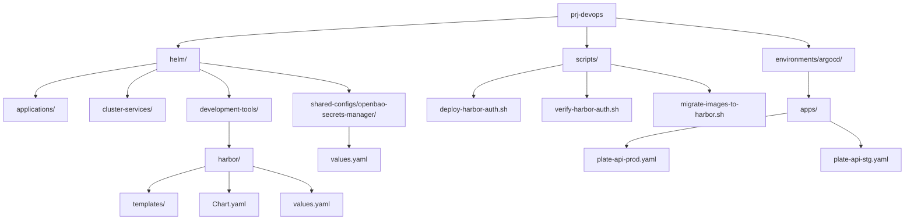
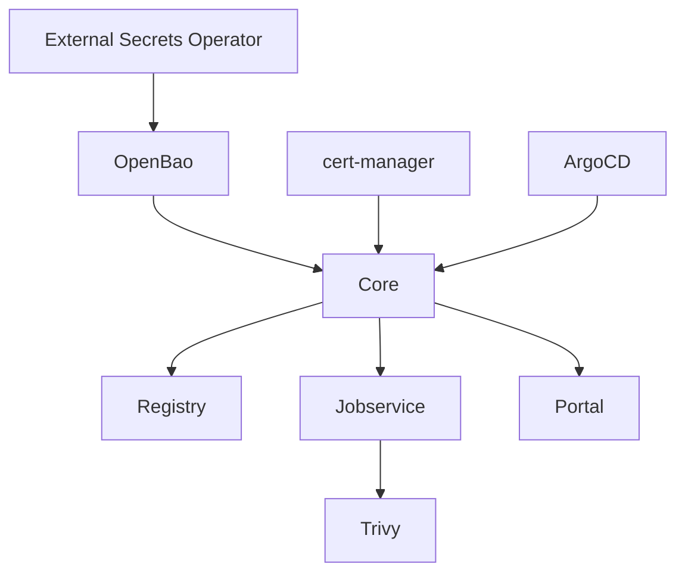
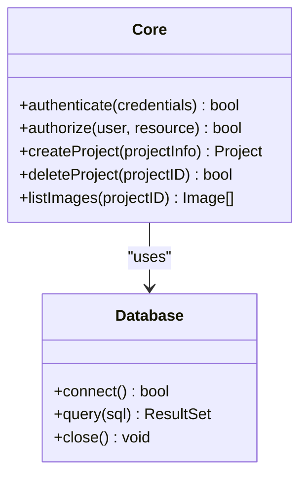
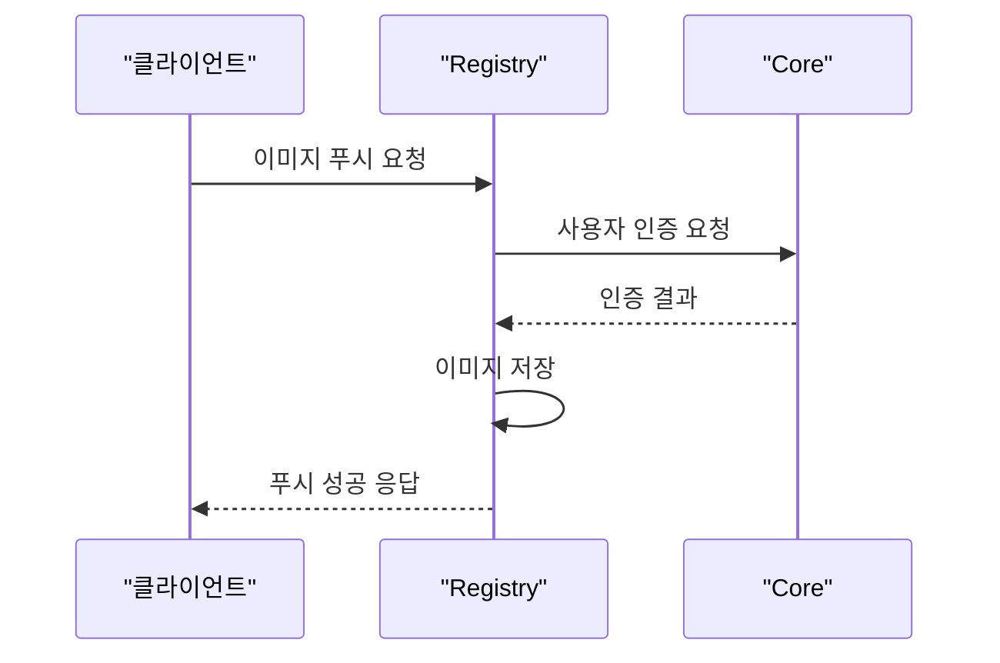
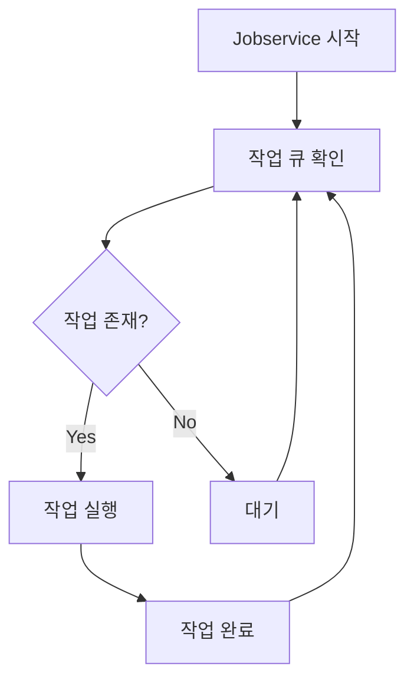
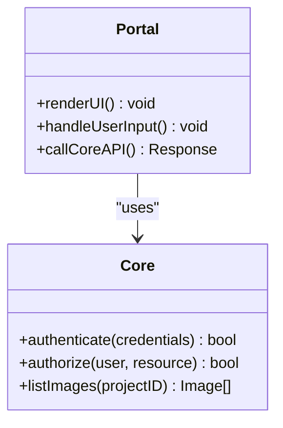
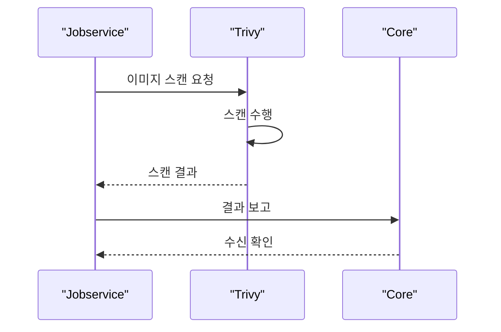
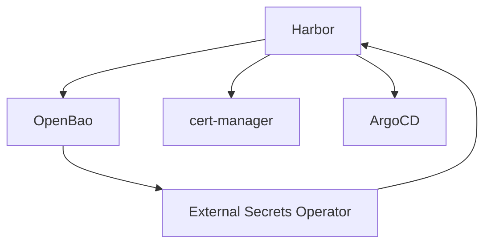

# Harbor

<cite>
**이 문서에서 참조한 파일**  
- [plate-api/values.yaml](file://helm/applications/plate-api/values.yaml)
- [plate-api/Chart.yaml](file://helm/applications/plate-api/Chart.yaml)
- [deploy-harbor-auth.sh](file://scripts/deploy-harbor-auth.sh)
- [verify-harbor-auth.sh](file://scripts/verify-harbor-auth.sh)
- [migrate-images-to-harbor.sh](file://scripts/migrate-images-to-harbor.sh)
- [openbao-secrets-manager/values.yaml](file://helm/shared-configs/openbao-secrets-manager/values.yaml)
- [plate-api-prod.yaml](file://environments/argocd/apps/plate-api-prod.yaml)
- [plate-api-stg.yaml](file://environments/argocd/apps/plate-api-stg.yaml)
</cite>

## 목차
1. [소개](#소개)
2. [프로젝트 구조](#프로젝트-구조)
3. [핵심 구성 요소](#핵심-구성-요소)
4. [아키텍처 개요](#아키텍처-개요)
5. [상세 구성 요소 분석](#상세-구성-요소-분석)
6. [의존성 분석](#의존성-분석)
7. [성능 고려사항](#성능-고려사항)
8. [문제 해결 가이드](#문제-해결-가이드)
9. [결론](#결론)

## 소개
이 문서는 prj-devops 환경에서 Harbor를 활용한 프라이빗 컨테이너 이미지 레지스트리 운영 전략을 상세히 설명합니다. Harbor는 컨테이너 이미지 저장소로서 보안, 접근 제어, 이미지 스캔, 복제 정책 등의 기능을 제공하며, 이 문서는 Helm 차트 기반의 설치 및 구성 방법, 핵심 컴포넌트의 역할, 인증서 관리, HTTPS 설정, 이미지 스캔(Trivy), 복제 정책, 프로젝트 관리 기능을 포함합니다. 또한, 실제 코드베이스에서의 사용 예시와 함께 Harbor 인증 설정 자동화 스크립트(deploy-harbor-auth.sh, verify-harbor-auth.sh), 기존 이미지 마이그레이션 절차(migrate-images-to-harbor.sh)에 대한 실용적인 가이드를 제공합니다. 보안 설정, 확장성 및 고가용성 고려사항도 포함합니다.

## 프로젝트 구조
prj-devops 프로젝트는 Helm 차트 기반으로 구성되어 있으며, 다양한 애플리케이션과 클러스터 서비스를 관리합니다. Helm 차트는 `helm/` 디렉터리 아래에 `applications/`, `cluster-services/`, `development-tools/` 등으로 분류되어 있습니다. Harbor는 `development-tools/harbor/` 디렉터리에 위치한 Helm 차트를 통해 배포되며, `shared-configs/openbao-secrets-manager/`를 통해 OpenBao와 연동된 인증 정보를 관리합니다. 스크립트는 `scripts/` 디렉터리에 위치하며, Harbor 관련 자동화 작업을 수행합니다.

**다이어그램 출처**  
- [helm/development-tools/harbor/Chart.yaml](file://helm/development-tools/harbor/Chart.yaml)
- [scripts/deploy-harbor-auth.sh](file://scripts/deploy-harbor-auth.sh)
- [scripts/verify-harbor-auth.sh](file://scripts/verify-harbor-auth.sh)
- [scripts/migrate-images-to-harbor.sh](file://scripts/migrate-images-to-harbor.sh)

**섹션 출처**  
- [helm/development-tools/harbor/Chart.yaml](file://helm/development-tools/harbor/Chart.yaml)
- [scripts/deploy-harbor-auth.sh](file://scripts/deploy-harbor-auth.sh)

## 핵심 구성 요소
Harbor는 여러 핵심 컴포넌트로 구성되어 있으며, 각 컴포넌트는 특정한 역할을 수행합니다. Core 컴포넌트는 Harbor의 중심적인 기능을 담당하며, 사용자 인증, 권한 관리, 이미지 저장소 관리 등을 수행합니다. Registry 컴포넌트는 Docker 레지스트리 프로토콜을 구현하여 이미지의 푸시 및 풀을 처리합니다. Jobservice 컴포넌트는 주기적인 작업 및 비동기 작업을 관리하며, 이미지 스캔, 복제, 백업 등의 작업을 수행합니다. Portal 컴포넌트는 웹 기반의 사용자 인터페이스를 제공하여 사용자가 쉽게 Harbor를 사용할 수 있도록 합니다. Trivy 컴포넌트는 이미지 스캔을 수행하여 보안 취약점을 탐지합니다.

**섹션 출처**  
- [helm/development-tools/harbor/templates/core/core-dpl.yaml](file://helm/development-tools/harbor/templates/core/core-dpl.yaml)
- [helm/development-tools/harbor/templates/registry/registry-dpl.yaml](file://helm/development-tools/harbor/templates/registry/registry-dpl.yaml)
- [helm/development-tools/harbor/templates/jobservice/jobservice-dpl.yaml](file://helm/development-tools/harbor/templates/jobservice/jobservice-dpl.yaml)
- [helm/development-tools/harbor/templates/portal/portal-dpl.yaml](file://helm/development-tools/harbor/templates/portal/portal-dpl.yaml)
- [helm/development-tools/harbor/templates/trivy/trivy-sts.yaml](file://helm/development-tools/harbor/templates/trivy/trivy-sts.yaml)

## 아키텍처 개요
Harbor는 Helm 차트를 통해 Kubernetes 클러스터에 배포되며, 다양한 컴포넌트들이 서로 협력하여 작동합니다. Core 컴포넌트는 사용자 인증 및 권한 관리를 수행하며, Registry 컴포넌트와 통신하여 이미지 저장소를 관리합니다. Jobservice 컴포넌트는 주기적인 작업을 관리하며, Trivy 컴포넌트와 연동하여 이미지 스캔을 수행합니다. Portal 컴포넌트는 웹 기반의 사용자 인터페이스를 제공하여 사용자가 쉽게 Harbor를 사용할 수 있도록 합니다. 전체 아키텍처는 OpenBao와 연동되어 인증 정보를 안전하게 관리하며, cert-manager를 통해 인증서를 자동으로 관리합니다.

**다이어그램 출처**  
- [helm/development-tools/harbor/Chart.yaml](file://helm/development-tools/harbor/Chart.yaml)
- [helm/shared-configs/openbao-secrets-manager/values.yaml](file://helm/shared-configs/openbao-secrets-manager/values.yaml)
- [environments/argocd/apps/plate-api-prod.yaml](file://environments/argocd/apps/plate-api-prod.yaml)

## 상세 구성 요소 분석

### Core 컴포넌트 분석
Core 컴포넌트는 Harbor의 중심적인 기능을 담당하며, 사용자 인증, 권한 관리, 이미지 저장소 관리 등을 수행합니다. Core 컴포넌트는 REST API를 제공하여 다른 컴포넌트들과 통신하며, 데이터베이스와 연동하여 사용자 및 프로젝트 정보를 저장합니다.

**다이어그램 출처**  
- [helm/development-tools/harbor/templates/core/core-dpl.yaml](file://helm/development-tools/harbor/templates/core/core-dpl.yaml)
- [helm/development-tools/harbor/templates/core/core-cm.yaml](file://helm/development-tools/harbor/templates/core/core-cm.yaml)

### Registry 컴포넌트 분석
Registry 컴포넌트는 Docker 레지스트리 프로토콜을 구현하여 이미지의 푸시 및 풀을 처리합니다. Registry 컴포넌트는 Core 컴포넌트와 통신하여 사용자 인증 및 권한을 확인하며, 이미지 저장소를 관리합니다.

**다이어그램 출처**  
- [helm/development-tools/harbor/templates/registry/registry-dpl.yaml](file://helm/development-tools/harbor/templates/registry/registry-dpl.yaml)
- [helm/development-tools/harbor/templates/registry/registry-cm.yaml](file://helm/development-tools/harbor/templates/registry/registry-cm.yaml)

### Jobservice 컴포넌트 분석
Jobservice 컴포넌트는 주기적인 작업 및 비동기 작업을 관리하며, 이미지 스캔, 복제, 백업 등의 작업을 수행합니다. Jobservice 컴포넌트는 Core 컴포넌트와 통신하여 작업을 등록하고 상태를 확인합니다.

**다이어그램 출처**  
- [helm/development-tools/harbor/templates/jobservice/jobservice-dpl.yaml](file://helm/development-tools/harbor/templates/jobservice/jobservice-dpl.yaml)
- [helm/development-tools/harbor/templates/jobservice/jobservice-cm.yaml](file://helm/development-tools/harbor/templates/jobservice/jobservice-cm.yaml)

### Portal 컴포넌트 분석
Portal 컴포넌트는 웹 기반의 사용자 인터페이스를 제공하여 사용자가 쉽게 Harbor를 사용할 수 있도록 합니다. Portal 컴포넌트는 Core 컴포넌트와 통신하여 사용자 인증 및 권한을 확인하며, 이미지 저장소를 관리합니다.

**다이어그램 출처**  
- [helm/development-tools/harbor/templates/portal/portal-dpl.yaml](file://helm/development-tools/harbor/templates/portal/portal-dpl.yaml)
- [helm/development-tools/harbor/templates/portal/configmap.yaml](file://helm/development-tools/harbor/templates/portal/configmap.yaml)

### Trivy 컴포넌트 분석
Trivy 컴포넌트는 이미지 스캔을 수행하여 보안 취약점을 탐지합니다. Trivy 컴포넌트는 Jobservice 컴포넌트와 연동되어 주기적으로 이미지 스캔을 수행하며, 결과를 Core 컴포넌트에 보고합니다.

**다이어그램 출처**  
- [helm/development-tools/harbor/templates/trivy/trivy-sts.yaml](file://helm/development-tools/harbor/templates/trivy/trivy-sts.yaml)
- [helm/development-tools/harbor/templates/trivy/trivy-secret.yaml](file://helm/development-tools/harbor/templates/trivy/trivy-secret.yaml)

**섹션 출처**  
- [helm/development-tools/harbor/templates/core/core-dpl.yaml](file://helm/development-tools/harbor/templates/core/core-dpl.yaml)
- [helm/development-tools/harbor/templates/registry/registry-dpl.yaml](file://helm/development-tools/harbor/templates/registry/registry-dpl.yaml)
- [helm/development-tools/harbor/templates/jobservice/jobservice-dpl.yaml](file://helm/development-tools/harbor/templates/jobservice/jobservice-dpl.yaml)
- [helm/development-tools/harbor/templates/portal/portal-dpl.yaml](file://helm/development-tools/harbor/templates/portal/portal-dpl.yaml)
- [helm/development-tools/harbor/templates/trivy/trivy-sts.yaml](file://helm/development-tools/harbor/templates/trivy/trivy-sts.yaml)

## 의존성 분석
Harbor는 다양한 외부 서비스와 연동되어 작동합니다. OpenBao는 인증 정보를 안전하게 저장 및 관리하며, External Secrets Operator는 OpenBao에서 인증 정보를 가져와 Kubernetes Secret으로 생성합니다. cert-manager는 인증서를 자동으로 관리하며, ArgoCD는 GitOps 방식으로 Harbor를 배포 및 관리합니다. 이러한 의존성은 Harbor의 보안성과 안정성을 높이는 데 중요한 역할을 합니다.

**다이어그램 출처**  
- [helm/shared-configs/openbao-secrets-manager/values.yaml](file://helm/shared-configs/openbao-secrets-manager/values.yaml)
- [scripts/deploy-harbor-auth.sh](file://scripts/deploy-harbor-auth.sh)
- [scripts/verify-harbor-auth.sh](file://scripts/verify-harbor-auth.sh)

**섹션 출처**  
- [helm/shared-configs/openbao-secrets-manager/values.yaml](file://helm/shared-configs/openbao-secrets-manager/values.yaml)
- [scripts/deploy-harbor-auth.sh](file://scripts/deploy-harbor-auth.sh)
- [scripts/verify-harbor-auth.sh](file://scripts/verify-harbor-auth.sh)

## 성능 고려사항
Harbor의 성능은 여러 요소에 의해 영향을 받습니다. 데이터베이스 성능, 저장소 백엔드 성능, 네트워크 대역폭 등이 주요한 영향 요소입니다. 고가용성을 위해 여러 인스턴스를 배포하고, 로드 밸런서를 통해 트래픽을 분산하는 것이 권장됩니다. 또한, 이미지 스캔 및 복제 작업은 리소스를 많이 소모하므로, 적절한 리소스 할당과 스케줄링이 필요합니다.

## 문제 해결 가이드
Harbor 운영 중 발생할 수 있는 문제를 해결하기 위한 가이드를 제공합니다. 인증 실패, 이미지 푸시/풀 실패, UI 접근 실패 등의 문제를 진단하고 해결하는 방법을 설명합니다. 특히, `verify-harbor-auth.sh` 스크립트를 사용하여 인증 설정을 검증하고, `deploy-harbor-auth.sh` 스크립트를 사용하여 인증 설정을 자동화하는 방법을 포함합니다.

**섹션 출처**  
- [scripts/deploy-harbor-auth.sh](file://scripts/deploy-harbor-auth.sh)
- [scripts/verify-harbor-auth.sh](file://scripts/verify-harbor-auth.sh)
- [scripts/migrate-images-to-harbor.sh](file://scripts/migrate-images-to-harbor.sh)

## 결론
prj-devops 환경에서 Harbor를 활용한 프라이빗 컨테이너 이미지 레지스트리 운영은 Helm 차트 기반으로 구성되어 있으며, OpenBao, cert-manager, ArgoCD 등과 연동되어 보안성과 안정성을 높이고 있습니다. Core, Registry, Jobservice, Portal, Trivy 등의 핵심 컴포넌트가 협력하여 작동하며, 다양한 기능을 제공합니다. 자동화 스크립트를 통해 인증 설정 및 이미지 마이그레이션을 쉽게 수행할 수 있으며, 문제 해결 가이드를 통해 운영 중 발생할 수 있는 문제를 신속하게 해결할 수 있습니다.