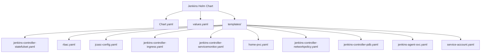
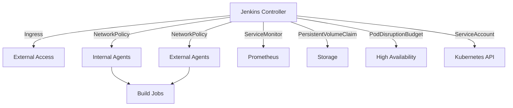
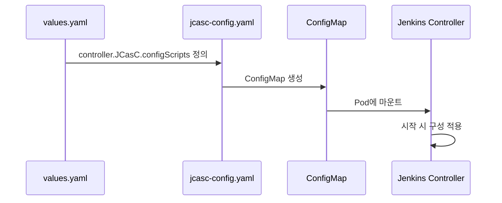
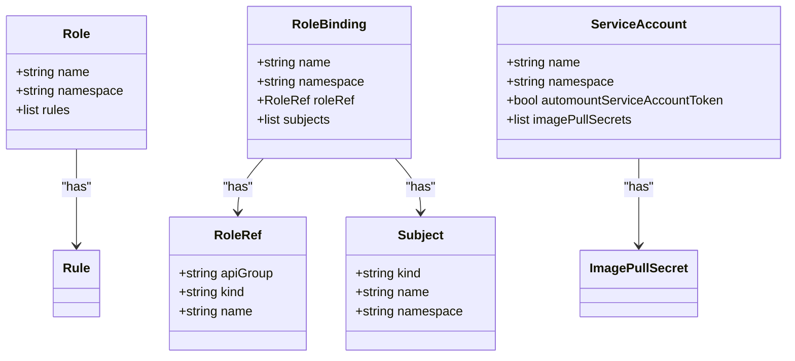
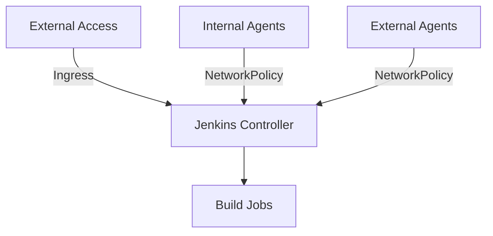
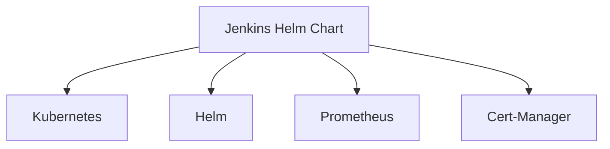

```mermaid
classDiagram
class JenkinsController {
+string componentName
+string image
+int numExecutors
+string executorMode
+list customJenkinsLabels
+bool disableRememberMe
+Admin admin
+string jenkinsHome
+string jenkinsRef
+string jenkinsWar
+Resources resources
+bool shareProcessNamespace
+bool enableServiceLinks
+InitContainerResources initContainerResources
+list initContainerEnvFrom
+list initContainerEnv
+list containerEnvFrom
+list containerEnv
+string javaOpts
+string jenkinsOpts
+string jenkinsUrlProtocol
+string jenkinsUrl
+string jenkinsUriPrefix
+bool usePodSecurityContext
+int runAsUser
+int fsGroup
+SecurityContextCapabilities securityContextCapabilities
+PodSecurityContextOverride podSecurityContextOverride
+ContainerSecurityContext containerSecurityContext
+bool serviceEnabled
+string serviceType
+string clusterIp
+int servicePort
+int targetPort
+int nodePort
+string serviceExternalTrafficPolicy
+bool publishNotReadyAddresses
+map serviceAnnotations
+map statefulSetLabels
+map serviceLabels
+map podLabels
+bool healthProbes
+Probes probes
+PodDisruptionBudget podDisruptionBudget
+bool agentListenerEnabled
+int agentListenerPort
+int agentListenerHostPort
+int agentListenerNodePort
+string agentListenerExternalTrafficPolicy
+list agentListenerLoadBalancerSourceRanges
+list disabledAgentProtocols
+CSRF csrf
+string agentListenerServiceType
+map agentListenerServiceAnnotations
+string agentListenerLoadBalancerIP
+bool legacyRemotingSecurityEnabled
+list loadBalancerSourceRanges
+string loadBalancerIP
+int jmxPort
+list extraPorts
+list installPlugins
+bool installLatestPlugins
+bool installLatestSpecifiedPlugins
+list additionalPlugins
+bool initializeOnce
+bool overwritePlugins
+bool overwritePluginsFromImage
+string projectNamingStrategy
+bool enableRawHtmlMarkupFormatter
+string markupFormatter
+list scriptApproval
+map initScripts
+string initConfigMap
+string existingSecret
+list additionalExistingSecrets
+list additionalSecrets
+list secretClaims
+string cloudName
+JCasC JCasC
+list customInitContainers
+Sidecars sidecars
+string schedulerName
+map nodeSelector
+list tolerations
+int terminationGracePeriodSeconds
+string terminationMessagePath
+string terminationMessagePolicy
+map affinity
+string priorityClassName
+map podAnnotations
+map statefulSetAnnotations
+UpdateStrategy updateStrategy
+map topologySpreadConstraints
+Ingress ingress
+SecondaryIngress secondaryingress
+BackendConfig backendconfig
+Route route
+list hostAliases
}
class Admin {
+string username
+string password
+string userKey
+string passwordKey
+bool createSecret
+string existingSecret
}
class Resources {
+Requests requests
+Limits limits
}
class Requests {
+string cpu
+string memory
}
class Limits {
+string cpu
+string memory
}
class SecurityContextCapabilities {
+list drop
}
class PodSecurityContextOverride {
+int runAsUser
+bool runAsNonRoot
+list supplementalGroups
+Capabilities capabilities
}
class ContainerSecurityContext {
+int runAsUser
+int runAsGroup
+bool readOnlyRootFilesystem
+bool allowPrivilegeEscalation
}
class Probes {
+StartupProbe startupProbe
+LivenessProbe livenessProbe
+ReadinessProbe readinessProbe
}
class StartupProbe {
+int failureThreshold
+HttpGet httpGet
+int periodSeconds
+int timeoutSeconds
}
class LivenessProbe {
+int failureThreshold
+HttpGet httpGet
+int periodSeconds
+int timeoutSeconds
+int initialDelaySeconds
}
class ReadinessProbe {
+int failureThreshold
+HttpGet httpGet
+int periodSeconds
+int timeoutSeconds
+int initialDelaySeconds
}
class HttpGet {
+string path
+string port
}
class PodDisruptionBudget {
+bool enabled
+string apiVersion
+map annotations
+map labels
+string maxUnavailable
}
class CSRF {
+DefaultCrumbIssuer defaultCrumbIssuer
}
class DefaultCrumbIssuer {
+bool enabled
+bool proxyCompatability
}
class JCasC {
+bool defaultConfig
+bool overwriteConfiguration
+list configUrls
+map configScripts
+Security security
+string securityRealm
+string authorizationStrategy
+map configMapAnnotations
}
class Security {
+ApiToken apiToken
}
class ApiToken {
+bool creationOfLegacyTokenEnabled
+bool tokenGenerationOnCreationEnabled
+bool usageStatisticsEnabled
}
class Sidecars {
+ConfigAutoReload configAutoReload
+list additionalSidecarContainers
}
class ConfigAutoReload {
+bool enabled
+Image image
+string imagePullPolicy
+Resources resources
+list additionalVolumeMounts
+Logging logging
+string scheme
+bool skipTlsVerify
+int reqRetryConnect
+int sleepTime
+list envFrom
+list env
+int sshTcpPort
+string folder
+string searchNamespace
+ContainerSecurityContext containerSecurityContext
}
class Image {
+string registry
+string repository
+string tag
}
class Logging {
+Configuration configuration
}
class Configuration {
+bool override
+string logLevel
+string formatter
+bool logToConsole
+bool logToFile
+int maxBytes
+int backupCount
}
class Ingress {
+bool enabled
+list paths
+string apiVersion
+map labels
+map annotations
+string ingressClassName
+string path
+string hostName
+string resourceRootUrl
+list tls
}
class SecondaryIngress {
+bool enabled
+list paths
+string apiVersion
+map labels
+map annotations
+string hostName
+list tls
}
class BackendConfig {
+bool enabled
+string apiVersion
+string name
+map labels
+map annotations
+map spec
}
class Route {
+bool enabled
+map labels
+map annotations
+string path
}
JenkinsController --> Admin : "has"
JenkinsController --> Resources : "has"
JenkinsController --> SecurityContextCapabilities : "has"
JenkinsController --> PodSecurityContextOverride : "has"
JenkinsController --> ContainerSecurityContext : "has"
JenkinsController --> Probes : "has"
JenkinsController --> PodDisruptionBudget : "has"
JenkinsController --> CSRF : "has"
JenkinsController --> JCasC : "has"
JenkinsController --> Sidecars : "has"
JenkinsController --> Ingress : "has"
JenkinsController --> SecondaryIngress : "has"
JenkinsController --> BackendConfig : "has"
JenkinsController --> Route : "has"
StartupProbe --> HttpGet : "has"
LivenessProbe --> HttpGet : "has"
ReadinessProbe --> HttpGet : "has"
JCasC --> Security : "has"
ConfigAutoReload --> Image : "has"
ConfigAutoReload --> Resources : "has"
ConfigAutoReload --> Logging : "has"
ConfigAutoReload --> ContainerSecurityContext : "has"
Logging --> Configuration : "has"
```

# Jenkins

<cite>
**이 문서에서 참조한 파일**   
- [Chart.yaml](file://helm/development-tools/jenkins/Chart.yaml)
- [values.yaml](file://helm/development-tools/jenkins/values.yaml)
- [jenkins-controller-statefulset.yaml](file://helm/development-tools/jenkins/templates/jenkins-controller-statefulset.yaml)
- [rbac.yaml](file://helm/development-tools/jenkins/templates/rbac.yaml)
- [jcasc-config.yaml](file://helm/development-tools/jenkins/templates/jcasc-config.yaml)
- [jenkins-controller-ingress.yaml](file://helm/development-tools/jenkins/templates/jenkins-controller-ingress.yaml)
- [jenkins-controller-servicemonitor.yaml](file://helm/development-tools/jenkins/templates/jenkins-controller-servicemonitor.yaml)
- [home-pvc.yaml](file://helm/development-tools/jenkins/templates/home-pvc.yaml)
- [jenkins-controller-networkpolicy.yaml](file://helm/development-tools/jenkins/templates/jenkins-controller-networkpolicy.yaml)
- [jenkins-controller-pdb.yaml](file://helm/development-tools/jenkins/templates/jenkins-controller-pdb.yaml)
- [jenkins-agent-svc.yaml](file://helm/development-tools/jenkins/templates/jenkins-agent-svc.yaml)
- [service-account.yaml](file://helm/development-tools/jenkins/templates/service-account.yaml)
- [README.md](file://helm/development-tools/jenkins/README.md)
</cite>

## 목차
1. [소개](#소개)
2. [프로젝트 구조](#프로젝트-구조)
3. [핵심 구성 요소](#핵심-구성-요소)
4. [아키텍처 개요](#아키텍처-개요)
5. [상세 구성 요소 분석](#상세-구성-요소-분석)
6. [의존성 분석](#의존성-분석)
7. [성능 고려사항](#성능-고려사항)
8. [문제 해결 가이드](#문제-해결-가이드)
9. [결론](#결론)

## 소개
이 문서는 `prj-devops` 프로젝트 내에서 Jenkins를 활용한 CI/CD 파이프라인 구축 기능을 상세히 설명합니다. Jenkins는 Helm 차트를 통해 Kubernetes 환경에 배포되며, Chart.yaml과 values.yaml을 기반으로 설치 및 구성이 이루어집니다. StatefulSet을 사용하여 상태를 유지하며, JCasC(Jenkins Configuration as Code)를 통해 선언적 구성 관리가 가능합니다. 또한 RBAC 설정, 컨트롤러 및 에이전트 아키텍처, 네트워크 정책, 모니터링 연동(Servicemonitor), Ingress 설정이 포함되어 있으며, 실제 코드베이스에서의 사용 예시와 함께 CI/CD 파이프라인 정의, 빌드 에이전트 관리, 보안 설정(크리덴셜 관리), 플러그인 관리 가이드를 제공합니다. 확장성, 고가용성 및 성능 최적화 고려사항도 포함되어 있습니다.

## 프로젝트 구조
Jenkins Helm 차트는 `helm/development-tools/jenkins/` 디렉터리에 위치하며, 다음과 같은 주요 구성 요소로 이루어져 있습니다:

- **Chart.yaml**: 차트의 메타데이터와 종속성 정보를 포함합니다.
- **values.yaml**: Jenkins 배포를 위한 구성 값을 정의합니다.
- **templates/**: Kubernetes 리소스를 생성하기 위한 템플릿 파일들이 포함되어 있습니다. 주요 템플릿으로는 StatefulSet, Service, Ingress, RBAC, NetworkPolicy 등이 있습니다.
- **README.md**: Jenkins Helm 차트의 사용법과 구성 옵션에 대한 설명을 제공합니다.

**다이어그램 출처**
- [Chart.yaml](file://helm/development-tools/jenkins/Chart.yaml)
- [values.yaml](file://helm/development-tools/jenkins/values.yaml)
- [jenkins-controller-statefulset.yaml](file://helm/development-tools/jenkins/templates/jenkins-controller-statefulset.yaml)
- [rbac.yaml](file://helm/development-tools/jenkins/templates/rbac.yaml)
- [jcasc-config.yaml](file://helm/development-tools/jenkins/templates/jcasc-config.yaml)
- [jenkins-controller-ingress.yaml](file://helm/development-tools/jenkins/templates/jenkins-controller-ingress.yaml)
- [jenkins-controller-servicemonitor.yaml](file://helm/development-tools/jenkins/templates/jenkins-controller-servicemonitor.yaml)
- [home-pvc.yaml](file://helm/development-tools/jenkins/templates/home-pvc.yaml)
- [jenkins-controller-networkpolicy.yaml](file://helm/development-tools/jenkins/templates/jenkins-controller-networkpolicy.yaml)
- [jenkins-controller-pdb.yaml](file://helm/development-tools/jenkins/templates/jenkins-controller-pdb.yaml)
- [jenkins-agent-svc.yaml](file://helm/development-tools/jenkins/templates/jenkins-agent-svc.yaml)
- [service-account.yaml](file://helm/development-tools/jenkins/templates/service-account.yaml)

**섹션 출처**
- [Chart.yaml](file://helm/development-tools/jenkins/Chart.yaml)
- [values.yaml](file://helm/development-tools/jenkins/values.yaml)
- [README.md](file://helm/development-tools/jenkins/README.md)

## 핵심 구성 요소
Jenkins Helm 차트의 핵심 구성 요소는 다음과 같습니다:

- **StatefulSet**: Jenkins 컨트롤러를 StatefulSet으로 배포하여 상태를 유지합니다. 이는 Jenkins의 설정 및 플러그인 상태를 영구적으로 저장할 수 있도록 합니다.
- **JCasC (Jenkins Configuration as Code)**: Jenkins의 구성이 코드로 관리되며, values.yaml 내의 `controller.JCasC.configScripts`를 통해 선언적으로 정의됩니다. 이를 통해 Jenkins의 설정을 버전 관리하고, 일관성 있는 환경을 유지할 수 있습니다.
- **RBAC**: Jenkins 컨트롤러와 에이전트 간의 권한을 관리하기 위해 RBAC 설정이 사용됩니다. `rbac.yaml` 템플릿을 통해 Role과 RoleBinding이 생성되며, Jenkins 서비스 어카운트에 적절한 권한이 부여됩니다.
- **Ingress**: Jenkins 컨트롤러에 대한 외부 접근을 위해 Ingress 리소스가 사용됩니다. `jenkins-controller-ingress.yaml` 템플릿을 통해 Ingress가 생성되며, TLS 설정과 함께 안전한 접근이 가능합니다.
- **NetworkPolicy**: 네트워크 정책을 통해 Jenkins 컨트롤러와 에이전트 간의 통신을 제어합니다. `jenkins-controller-networkpolicy.yaml` 템플릿을 통해 Ingress 규칙이 정의되며, 내부 및 외부 에이전트의 접근을 제한할 수 있습니다.
- **ServiceMonitor**: Prometheus를 통해 Jenkins의 메트릭을 수집하기 위해 ServiceMonitor가 사용됩니다. `jenkins-controller-servicemonitor.yaml` 템플릿을 통해 ServiceMonitor가 생성되며, Jenkins의 상태를 모니터링할 수 있습니다.
- **PersistentVolumeClaim**: Jenkins의 데이터를 영구적으로 저장하기 위해 PVC가 사용됩니다. `home-pvc.yaml` 템플릿을 통해 PVC가 생성되며, Jenkins의 설정 및 작업 공간이 유지됩니다.
- **PodDisruptionBudget**: Jenkins 컨트롤러의 가용성을 보장하기 위해 PodDisruptionBudget이 사용됩니다. `jenkins-controller-pdb.yaml` 템플릿을 통해 PDB가 생성되며, 예기치 않은 중단을 방지할 수 있습니다.
- **ServiceAccount**: Jenkins 컨트롤러와 에이전트가 Kubernetes API에 접근하기 위해 ServiceAccount가 사용됩니다. `service-account.yaml` 템플릿을 통해 ServiceAccount가 생성되며, 적절한 권한이 부여됩니다.

**섹션 출처**
- [values.yaml](file://helm/development-tools/jenkins/values.yaml)
- [jenkins-controller-statefulset.yaml](file://helm/development-tools/jenkins/templates/jenkins-controller-statefulset.yaml)
- [rbac.yaml](file://helm/development-tools/jenkins/templates/rbac.yaml)
- [jcasc-config.yaml](file://helm/development-tools/jenkins/templates/jcasc-config.yaml)
- [jenkins-controller-ingress.yaml](file://helm/development-tools/jenkins/templates/jenkins-controller-ingress.yaml)
- [jenkins-controller-servicemonitor.yaml](file://helm/development-tools/jenkins/templates/jenkins-controller-servicemonitor.yaml)
- [home-pvc.yaml](file://helm/development-tools/jenkins/templates/home-pvc.yaml)
- [jenkins-controller-networkpolicy.yaml](file://helm/development-tools/jenkins/templates/jenkins-controller-networkpolicy.yaml)
- [jenkins-controller-pdb.yaml](file://helm/development-tools/jenkins/templates/jenkins-controller-pdb.yaml)
- [service-account.yaml](file://helm/development-tools/jenkins/templates/service-account.yaml)

## 아키텍처 개요
Jenkins는 Kubernetes 환경에서 Helm 차트를 통해 배포되며, 다음과 같은 아키텍처를 따릅니다:

- **컨트롤러**: Jenkins 컨트롤러는 StatefulSet으로 배포되며, Jenkins 마스터 역할을 수행합니다. 컨트롤러는 JCasC를 통해 구성되며, RBAC를 통해 권한이 관리됩니다.
- **에이전트**: Jenkins 에이전트는 빌드 작업을 수행하는 역할을 합니다. 에이전트는 Kubernetes 클러스터 내에서 Pod로 실행되며, 컨트롤러와의 통신을 통해 작업을 수행합니다.
- **Ingress**: Ingress 리소스를 통해 외부에서 Jenkins 컨트롤러에 접근할 수 있습니다. Ingress는 TLS 설정을 통해 안전한 접근을 제공합니다.
- **NetworkPolicy**: 네트워크 정책을 통해 컨트롤러와 에이전트 간의 통신을 제어합니다. 내부 및 외부 에이전트의 접근을 제한할 수 있습니다.
- **ServiceMonitor**: Prometheus를 통해 Jenkins의 메트릭을 수집합니다. ServiceMonitor는 Jenkins 컨트롤러의 상태를 모니터링할 수 있도록 합니다.
- **PersistentVolumeClaim**: Jenkins의 설정 및 작업 공간을 영구적으로 저장하기 위해 PVC가 사용됩니다.
- **PodDisruptionBudget**: Jenkins 컨트롤러의 가용성을 보장하기 위해 PDB가 사용됩니다.
- **ServiceAccount**: Jenkins 컨트롤러와 에이전트가 Kubernetes API에 접근하기 위해 ServiceAccount가 사용됩니다.

**다이어그램 출처**
- [jenkins-controller-statefulset.yaml](file://helm/development-tools/jenkins/templates/jenkins-controller-statefulset.yaml)
- [rbac.yaml](file://helm/development-tools/jenkins/templates/rbac.yaml)
- [jcasc-config.yaml](file://helm/development-tools/jenkins/templates/jcasc-config.yaml)
- [jenkins-controller-ingress.yaml](file://helm/development-tools/jenkins/templates/jenkins-controller-ingress.yaml)
- [jenkins-controller-servicemonitor.yaml](file://helm/development-tools/jenkins/templates/jenkins-controller-servicemonitor.yaml)
- [home-pvc.yaml](file://helm/development-tools/jenkins/templates/home-pvc.yaml)
- [jenkins-controller-networkpolicy.yaml](file://helm/development-tools/jenkins/templates/jenkins-controller-networkpolicy.yaml)
- [jenkins-controller-pdb.yaml](file://helm/development-tools/jenkins/templates/jenkins-controller-pdb.yaml)
- [service-account.yaml](file://helm/development-tools/jenkins/templates/service-account.yaml)

## 상세 구성 요소 분석

### Jenkins 컨트롤러 분석
Jenkins 컨트롤러는 StatefulSet으로 배포되며, 다음과 같은 주요 구성 요소를 포함합니다:

- **StatefulSet**: Jenkins 컨트롤러는 StatefulSet으로 배포되며, `jenkins-controller-statefulset.yaml` 템플릿을 통해 정의됩니다. StatefulSet은 Jenkins의 상태를 유지하며, Pod의 이름과 순서를 보장합니다.
- **JCasC**: Jenkins의 구성은 JCasC를 통해 코드로 관리됩니다. `values.yaml` 내의 `controller.JCasC.configScripts`를 통해 구성이 정의되며, `jcasc-config.yaml` 템플릿을 통해 ConfigMap으로 생성됩니다.
- **RBAC**: Jenkins 컨트롤러와 에이전트 간의 권한을 관리하기 위해 RBAC 설정이 사용됩니다. `rbac.yaml` 템플릿을 통해 Role과 RoleBinding이 생성되며, Jenkins 서비스 어카운트에 적절한 권한이 부여됩니다.
- **Ingress**: Jenkins 컨트롤러에 대한 외부 접근을 위해 Ingress 리소스가 사용됩니다. `jenkins-controller-ingress.yaml` 템플릿을 통해 Ingress가 생성되며, TLS 설정과 함께 안전한 접근이 가능합니다.
- **NetworkPolicy**: 네트워크 정책을 통해 Jenkins 컨트롤러와 에이전트 간의 통신을 제어합니다. `jenkins-controller-networkpolicy.yaml` 템플릿을 통해 Ingress 규칙이 정의되며, 내부 및 외부 에이전트의 접근을 제한할 수 있습니다.
- **ServiceMonitor**: Prometheus를 통해 Jenkins의 메트릭을 수집하기 위해 ServiceMonitor가 사용됩니다. `jenkins-controller-servicemonitor.yaml` 템플릿을 통해 ServiceMonitor가 생성되며, Jenkins의 상태를 모니터링할 수 있습니다.
- **PersistentVolumeClaim**: Jenkins의 데이터를 영구적으로 저장하기 위해 PVC가 사용됩니다. `home-pvc.yaml` 템플릿을 통해 PVC가 생성되며, Jenkins의 설정 및 작업 공간이 유지됩니다.
- **PodDisruptionBudget**: Jenkins 컨트롤러의 가용성을 보장하기 위해 PodDisruptionBudget이 사용됩니다. `jenkins-controller-pdb.yaml` 템플릿을 통해 PDB가 생성되며, 예기치 않은 중단을 방지할 수 있습니다.
- **ServiceAccount**: Jenkins 컨트롤러와 에이전트가 Kubernetes API에 접근하기 위해 ServiceAccount가 사용됩니다. `service-account.yaml` 템플릿을 통해 ServiceAccount가 생성되며, 적절한 권한이 부여됩니다.

**다이어그램 출처**
- [values.yaml](file://helm/development-tools/jenkins/values.yaml)
- [jenkins-controller-statefulset.yaml](file://helm/development-tools/jenkins/templates/jenkins-controller-statefulset.yaml)

**섹션 출처**
- [values.yaml](file://helm/development-tools/jenkins/values.yaml)
- [jenkins-controller-statefulset.yaml](file://helm/development-tools/jenkins/templates/jenkins-controller-statefulset.yaml)

### JCasC 구성 분석
Jenkins Configuration as Code (JCasC)는 Jenkins의 구성이 코드로 관리되도록 하는 기능입니다. `values.yaml` 내의 `controller.JCasC.configScripts`를 통해 구성이 정의되며, `jcasc-config.yaml` 템플릿을 통해 ConfigMap으로 생성됩니다. JCasC는 다음과 같은 장점을 제공합니다:

- **버전 관리**: Jenkins의 구성이 코드로 관리되므로, Git과 같은 버전 관리 시스템을 통해 구성의 변경 이력을 추적할 수 있습니다.
- **일관성**: 동일한 구성 파일을 사용하여 여러 환경(Jenkins 인스턴스)에 동일한 설정을 적용할 수 있습니다.
- **자동화**: Jenkins의 설정이 코드로 관리되므로, CI/CD 파이프라인을 통해 자동으로 설정을 적용할 수 있습니다.

JCasC 구성은 다음과 같은 단계로 이루어집니다:

1. **configScripts 정의**: `values.yaml` 내의 `controller.JCasC.configScripts`를 통해 구성이 정의됩니다. 각 구성은 YAML 형식으로 작성되며, Jenkins의 설정을 나타냅니다.
2. **ConfigMap 생성**: `jcasc-config.yaml` 템플릿을 통해 `configScripts`에 정의된 구성이 ConfigMap으로 생성됩니다. ConfigMap은 Jenkins 컨트롤러 Pod에 마운트되어, Jenkins의 설정으로 사용됩니다.
3. **Jenkins 시작 시 적용**: Jenkins 컨트롤러가 시작될 때, ConfigMap에 저장된 구성이 Jenkins에 적용됩니다. 이를 통해 Jenkins의 설정이 코드로 관리된 상태로 시작됩니다.

**다이어그램 출처**
- [values.yaml](file://helm/development-tools/jenkins/values.yaml)
- [jcasc-config.yaml](file://helm/development-tools/jenkins/templates/jcasc-config.yaml)

**섹션 출처**
- [values.yaml](file://helm/development-tools/jenkins/values.yaml)
- [jcasc-config.yaml](file://helm/development-tools/jenkins/templates/jcasc-config.yaml)
- [README.md](file://helm/development-tools/jenkins/README.md)

### RBAC 설정 분석
Jenkins는 Kubernetes 환경에서 RBAC를 통해 권한을 관리합니다. `rbac.yaml` 템플릿을 통해 Role과 RoleBinding이 생성되며, Jenkins 서비스 어카운트에 적절한 권한이 부여됩니다. RBAC 설정은 다음과 같은 주요 구성 요소를 포함합니다:

- **Role**: Jenkins 컨트롤러와 에이전트 간의 권한을 정의합니다. Role은 `pods`, `pods/exec`, `pods/log`, `persistentvolumeclaims`, `events` 리소스에 대한 `get`, `list`, `watch`, `create`, `delete`, `deletecollection`, `patch`, `update` 권한을 포함합니다.
- **RoleBinding**: Role을 Jenkins 서비스 어카운트에 바인딩합니다. RoleBinding은 Jenkins 서비스 어카운트가 Role에 정의된 권한을 사용할 수 있도록 합니다.
- **ServiceAccount**: Jenkins 컨트롤러와 에이전트가 Kubernetes API에 접근하기 위해 ServiceAccount가 사용됩니다. ServiceAccount는 `service-account.yaml` 템플릿을 통해 생성되며, 적절한 권한이 부여됩니다.

**다이어그램 출처**
- [rbac.yaml](file://helm/development-tools/jenkins/templates/rbac.yaml)
- [service-account.yaml](file://helm/development-tools/jenkins/templates/service-account.yaml)

**섹션 출처**
- [rbac.yaml](file://helm/development-tools/jenkins/templates/rbac.yaml)
- [service-account.yaml](file://helm/development-tools/jenkins/templates/service-account.yaml)

### Ingress 및 네트워크 정책 분석
Jenkins는 Ingress 리소스를 통해 외부에서 접근할 수 있으며, 네트워크 정책을 통해 내부 및 외부 에이전트의 접근을 제어합니다. `jenkins-controller-ingress.yaml` 템플릿을 통해 Ingress가 생성되며, `jenkins-controller-networkpolicy.yaml` 템플릿을 통해 네트워크 정책이 정의됩니다.

- **Ingress**: Ingress 리소스를 통해 외부에서 Jenkins 컨트롤러에 접근할 수 있습니다. Ingress는 TLS 설정을 통해 안전한 접근을 제공하며, `values.yaml` 내의 `controller.ingress` 설정을 통해 구성됩니다.
- **NetworkPolicy**: 네트워크 정책을 통해 Jenkins 컨트롤러와 에이전트 간의 통신을 제어합니다. 내부 에이전트는 PodSelector를 통해 접근이 허용되며, 외부 에이전트는 IP CIDR을 통해 접근이 허용됩니다.

**다이어그램 출처**
- [jenkins-controller-ingress.yaml](file://helm/development-tools/jenkins/templates/jenkins-controller-ingress.yaml)
- [jenkins-controller-networkpolicy.yaml](file://helm/development-tools/jenkins/templates/jenkins-controller-networkpolicy.yaml)

**섹션 출처**
- [jenkins-controller-ingress.yaml](file://helm/development-tools/jenkins/templates/jenkins-controller-ingress.yaml)
- [jenkins-controller-networkpolicy.yaml](file://helm/development-tools/jenkins/templates/jenkins-controller-networkpolicy.yaml)

## 의존성 분석
Jenkins Helm 차트는 다음과 같은 주요 의존성을 가지고 있습니다:

- **Kubernetes**: Jenkins는 Kubernetes 환경에서 실행되며, StatefulSet, Service, Ingress, RBAC, NetworkPolicy 등의 Kubernetes 리소스를 사용합니다.
- **Helm**: Jenkins는 Helm 차트를 통해 배포되며, Helm을 통해 구성 값이 관리됩니다.
- **Prometheus**: Jenkins의 메트릭을 수집하기 위해 Prometheus가 사용됩니다. ServiceMonitor를 통해 Prometheus가 Jenkins의 메트릭을 수집할 수 있습니다.
- **Cert-Manager**: Ingress에 TLS를 적용하기 위해 Cert-Manager가 사용됩니다. Cert-Manager는 Let's Encrypt와 같은 인증 기관을 통해 TLS 인증서를 자동으로 발급합니다.

**다이어그램 출처**
- [Chart.yaml](file://helm/development-tools/jenkins/Chart.yaml)
- [values.yaml](file://helm/development-tools/jenkins/values.yaml)
- [jenkins-controller-ingress.yaml](file://helm/development-tools/jenkins/templates/jenkins-controller-ingress.yaml)
- [jenkins-controller-servicemonitor.yaml](file://helm/development-tools/jenkins/templates/jenkins-controller-servicemonitor.yaml)

**섹션 출처**
- [Chart.yaml](file://helm/development-tools/jenkins/Chart.yaml)
- [values.yaml](file://helm/development-tools/jenkins/values.yaml)

## 성능 고려사항
Jenkins의 성능을 최적화하기 위해 다음과 같은 고려사항이 있습니다:

- **리소스 할당**: Jenkins 컨트롤러와 에이전트에 적절한 CPU 및 메모리 리소스를 할당해야 합니다. `values.yaml` 내의 `controller.resources` 설정을 통해 리소스를 할당할 수 있습니다.
- **확장성**: Jenkins는 에이전트를 동적으로 생성하여 빌드 작업을 분산할 수 있습니다. 이를 통해 빌드 작업의 병렬 처리가 가능하며, 성능이 향상됩니다.
- **고가용성**: Jenkins 컨트롤러는 StatefulSet으로 배포되며, PodDisruptionBudget을 통해 가용성을 보장할 수 있습니다. 이를 통해 예기치 않은 중단을 방지할 수 있습니다.
- **모니터링**: Prometheus를 통해 Jenkins의 메트릭을 수집하여, 성능을 모니터링할 수 있습니다. 이를 통해 성능 병목을 식별하고, 최적화할 수 있습니다.

**섹션 출처**
- [values.yaml](file://helm/development-tools/jenkins/values.yaml)
- [jenkins-controller-pdb.yaml](file://helm/development-tools/jenkins/templates/jenkins-controller-pdb.yaml)
- [jenkins-controller-servicemonitor.yaml](file://helm/development-tools/jenkins/templates/jenkins-controller-servicemonitor.yaml)

## 문제 해결 가이드
Jenkins를 운영하면서 발생할 수 있는 문제와 그 해결 방법은 다음과 같습니다:

- **Jenkins 컨트롤러 Pod가 시작되지 않는 경우**: Jenkins 컨트롤러 Pod가 시작되지 않는 경우, 로그를 확인하여 원인을 파악해야 합니다. 주로 리소스 부족, 구성 오류, 네트워크 문제 등이 원인일 수 있습니다.
- **에이전트 연결 문제**: 에이전트가 컨트롤러에 연결되지 않는 경우, 네트워크 정책을 확인하여 에이전트의 접근이 허용되는지 확인해야 합니다. 또한, RBAC 설정을 확인하여 에이전트에 적절한 권한이 부여되었는지 확인해야 합니다.
- **성능 저하**: Jenkins의 성능이 저하되는 경우, 리소스 할당을 확인하여 CPU 및 메모리 리소스가 충분한지 확인해야 합니다. 또한, Prometheus를 통해 메트릭을 확인하여 성능 병목을 식별해야 합니다.
- **TLS 인증서 문제**: Ingress에 TLS 인증서가 적용되지 않는 경우, Cert-Manager의 로그를 확인하여 인증서 발급에 문제가 없는지 확인해야 합니다.

**섹션 출처**
- [README.md](file://helm/development-tools/jenkins/README.md)
- [values.yaml](file://helm/development-tools/jenkins/values.yaml)
- [jenkins-controller-ingress.yaml](file://helm/development-tools/jenkins/templates/jenkins-controller-ingress.yaml)
- [rbac.yaml](file://helm/development-tools/jenkins/templates/rbac.yaml)

## 결론
이 문서는 `prj-devops` 프로젝트 내에서 Jenkins를 활용한 CI/CD 파이프라인 구축 기능을 상세히 설명하였습니다. Jenkins는 Helm 차트를 통해 Kubernetes 환경에 배포되며, Chart.yaml과 values.yaml을 기반으로 설치 및 구성이 이루어집니다. StatefulSet을 사용하여 상태를 유지하며, JCasC를 통해 선언적 구성 관리가 가능합니다. 또한 RBAC 설정, 컨트롤러 및 에이전트 아키텍처, 네트워크 정책, 모니터링 연동(Servicemonitor), Ingress 설정이 포함되어 있으며, 실제 코드베이스에서의 사용 예시와 함께 CI/CD 파이프라인 정의, 빌드 에이전트 관리, 보안 설정(크리덴셜 관리), 플러그인 관리 가이드를 제공합니다. 확장성, 고가용성 및 성능 최적화 고려사항도 포함되어 있습니다. 이를 통해 Jenkins를 안정적이고 효율적으로 운영할 수 있습니다.