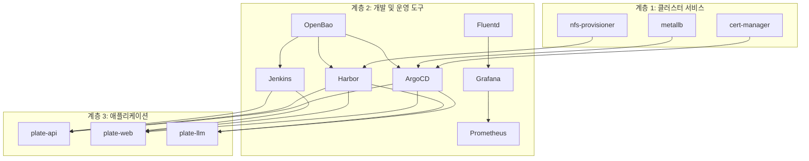

# 개발 도구

<cite>
**이 문서에서 참조된 파일**
- [argocd/Chart.yaml](file://helm/development-tools/argocd/Chart.yaml)
- [harbor/Chart.yaml](file://helm/development-tools/harbor/Chart.yaml)
- [grafana/Chart.yaml](file://helm/development-tools/grafana/Chart.yaml)
- [prometheus/Chart.yaml](file://helm/development-tools/prometheus/Chart.yaml)
- [jenkins/Chart.yaml](file://helm/development-tools/jenkins/Chart.yaml)
- [fluentd/Chart.yaml](file://helm/development-tools/fluentd/Chart.yaml)
- [argocd/values.yaml](file://helm/development-tools/argocd/values.yaml)
- [harbor/values.yaml](file://helm/development-tools/harbor/values.yaml)
- [grafana/values.yaml](file://helm/development-tools/grafana/values.yaml)
- [prometheus/values.yaml](file://helm/development-tools/prometheus/values.yaml)
- [jenkins/values.yaml](file://helm/development-tools/jenkins/values.yaml)
- [fluentd/values.yaml](file://helm/development-tools/fluentd/values.yaml)
- [app-of-apps.yaml](file://environments/argocd/app-of-apps.yaml)
- [README.md](file://README.md)
</cite>

## 목차
1. [소개](#소개)
2. [도구 계층 아키텍처](#도구-계층-아키텍처)
3. [GitOps 기반 배포 자동화 (ArgoCD)](#gitops-기반-배포-자동화-argocd)
4. [프라이빗 컨테이너 이미지 레지스트리 (Harbor)](#프라이빗-컨테이너-이미지-레지스트리-harbor)
5. [모니터링 및 대시보드 (Grafana & Prometheus)](#모니터링-및-대시보드-grafana--prometheus)
6. [CI/CD 파이프라인 (Jenkins)](#cicd-파이프라인-jenkins)
7. [로깅 인프라 (Fluentd)](#로깅-인프라-fluentd)
8. [통합 운영 시나리오](#통합-운영-시나리오)
9. [보안 설정](#보안-설정)
10. [확장성 고려사항](#확장성-고려사항)
11. [결론](#결론)

## 소개

prj-devops 프로젝트는 GitOps 기반의 현대적인 DevOps 인프라를 구축하기 위한 포괄적인 솔루션입니다. 이 문서는 프로젝트의 핵심 개발 도구 계층을 심층적으로 분석하며, ArgoCD, Harbor, Grafana, Prometheus, Jenkins, Fluentd 등 주요 도구들의 기술적 세부 사항, 구성 옵션, 상호작용 및 통합 운영 방식을 설명합니다. 각 도구는 Helm 차트를 통해 선언적으로 관리되며, 전체 시스템은 Git 저장소를 단일 진실 원천(Single Source of Truth)으로 삼아 안정적이고 반복 가능한 배포를 가능하게 합니다.

**Section sources**
- [README.md](file://README.md#L1-L461)

## 도구 계층 아키텍처

prj-devops 프로젝트는 명확한 계층 구조를 따르며, 이는 관리의 용이성과 책임의 분리를 보장합니다. 전체 개발 도구 계층은 다음과 같이 구성됩니다.



**Diagram sources**
- [README.md](file://README.md#L17-L70)

**Section sources**
- [README.md](file://README.md#L17-L70)

## GitOps 기반 배포 자동화 (ArgoCD)

ArgoCD는 prj-devops의 핵심 배포 엔진으로, GitOps 원칙을 구현합니다. 모든 인프라와 애플리케이션의 상태는 Git 저장소에 선언되며, ArgoCD가 이 상태를 클러스터의 실제 상태와 지속적으로 비교하고 동기화합니다.

### 기술적 세부 사항

ArgoCD는 `helm/development-tools/argocd` 디렉토리에 있는 Helm 차트를 통해 배포됩니다. `Chart.yaml` 파일은 ArgoCD의 버전과 종속성을 정의합니다.

```yaml
# helm/development-tools/argocd/Chart.yaml
apiVersion: v2
name: argo-cd
appVersion: v3.1.1
version: 8.3.1
dependencies:
- name: redis-ha
  repository: https://dandydeveloper.github.io/charts/
  version: 4.33.7
```

`values.yaml` 파일은 ArgoCD의 다양한 구성 요소에 대한 세부 설정을 포함합니다. 주요 설정은 다음과 같습니다.

- **`global.domain`**: `argocd.cocdev.co.kr`로 설정되어 모든 구성 요소가 일관된 도메인을 사용합니다.
- **`configs.rbac.policy.csv`**: 역할 기반 접근 제어(RBAC) 정책을 정의합니다. 예를 들어, `admin` 사용자에게 모든 리소스에 대한 완전한 접근 권한을 부여하고, `readonly` 사용자에게는 읽기 전용 권한을 부여합니다.
- **`createClusterRoles`**: 클러스터 전체에 걸쳐 ArgoCD가 애플리케이션을 관리할 수 있도록 클러스터 역할을 생성합니다.

### App of Apps 패턴

배포는 `App of Apps` 패턴을 통해 계층적으로 관리됩니다. 최상위 `Application` 리소스는 `environments/argocd/app-of-apps.yaml`에 정의되어 있으며, 이 리소스는 다른 모든 `Application` 리소스를 관리합니다.

```yaml
# environments/argocd/app-of-apps.yaml
apiVersion: argoproj.io/v1alpha1
kind: Application
metadata:
  name: cocdev-platform-apps
  namespace: argocd
spec:
  project: default
  source:
    repoURL: https://github.com/kimjoongwon/prj-devops.git
    path: environments/argocd/apps
    targetRevision: main
  destination:
    server: https://kubernetes.default.svc
    namespace: argocd
  syncPolicy:
    automated:
      prune: true
      selfHeal: true
    syncOptions:
      - CreateNamespace=true
```

이 설정은 다음과 같은 동작을 수행합니다.
- **자동 동기화 (`automated`)**: Git 저장소의 변경 사항을 감지하면 자동으로 클러스터를 업데이트합니다.
- **리소스 제거 (`prune: true`)**: Git 저장소에 존재하지 않는 리소스를 클러스터에서 자동으로 제거합니다.
- **자기 치유 (`selfHeal: true`)**: 클러스터의 상태가 Git 저장소와 불일치하면 자동으로 Git 저장소의 상태로 되돌립니다.
- **네임스페이스 생성 (`CreateNamespace=true`)**: 필요한 경우 네임스페이스를 자동으로 생성합니다.

**Section sources**
- [argocd/Chart.yaml](file://helm/development-tools/argocd/Chart.yaml#L1-L32)
- [argocd/values.yaml](file://helm/development-tools/argocd/values.yaml#L1-L800)
- [app-of-apps.yaml](file://environments/argocd/app-of-apps.yaml#L1-L35)

## 프라이빗 컨테이너 이미지 레지스트리 (Harbor)

Harbor는 프라이빗 컨테이너 이미지 레지스트리로서, 이미지 저장, 서명, 스캔 기능을 제공합니다. 이는 보안 강화된 CI/CD 파이프라인의 핵심 구성 요소입니다.

### 기술적 세부 사항

Harbor는 `helm/development-tools/harbor` 디렉토리에 있는 Helm 차트를 통해 배포됩니다. `Chart.yaml` 파일은 Harbor의 버전을 명시합니다.

```yaml
# helm/development-tools/harbor/Chart.yaml
apiVersion: v1
appVersion: 2.13.2
name: harbor
version: 1.17.2
```

`values.yaml` 파일은 Harbor의 핵심 구성 요소를 설정합니다.

- **`expose.type`**: `ingress`로 설정되어 외부에서 접근할 수 있도록 합니다.
- **`expose.tls.certSource`**: `secret`으로 설정되어, Let's Encrypt를 통해 발급된 인증서를 사용합니다. `cert-manager.io/cluster-issuer: "letsencrypt-prod"` 어노테이션이 이를 가능하게 합니다.
- **`externalURL`**: `https://harbor.cocdev.co.kr`로 설정되어, 사용자가 웹 UI에 접근할 수 있는 URL을 정의합니다.
- **`persistence.enabled`**: `true`로 설정되어, 데이터가 영구적으로 저장되도록 합니다. `storageClass: "openebs-hostpath"`를 사용하여 스토리지를 프로비저닝합니다.
- **`harborAdminPassword`**: 초기 관리자 비밀번호를 설정합니다. 운영 환경에서는 이 값을 비밀로 관리해야 합니다.
- **`trivy.enabled`**: `true`로 설정되어, 이미지 스캔을 위한 Trivy 스캐너를 활성화합니다.

### 통합 운영

Harbor는 Jenkins와 긴밀하게 통합됩니다. Jenkins 파이프라인은 빌드된 애플리케이션 이미지를 Harbor 레지스트리에 푸시합니다. 이 과정에서 OpenBao가 Harbor에 접근하기 위한 인증 정보를 안전하게 제공합니다. 또한, ArgoCD는 애플리케이션 배포 시 Harbor에서 이미지를 풀(Pull)할 수 있도록 `imagePullSecrets`를 구성합니다.

**Section sources**
- [harbor/Chart.yaml](file://helm/development-tools/harbor/Chart.yaml#L1-L25)
- [harbor/values.yaml](file://helm/development-tools/harbor/values.yaml#L1-L800)

## 모니터링 및 대시보드 (Grafana & Prometheus)

Grafana와 Prometheus는 시스템의 가시성과 모니터링을 제공하는 핵심 도구입니다. Prometheus가 메트릭을 수집하고, Grafana가 이를 시각화하여 대시보드로 제공합니다.

### 기술적 세부 사항

#### Prometheus

Prometheus는 `helm/development-tools/prometheus` 디렉토리에 있는 Helm 차트를 통해 배포됩니다. `Chart.yaml` 파일은 Prometheus의 버전과 종속성을 정의합니다.

```yaml
# helm/development-tools/prometheus/Chart.yaml
apiVersion: v2
appVersion: v3.5.0
name: prometheus
version: 27.37.0
dependencies:
- name: alertmanager
  repository: https://prometheus-community.github.io/helm-charts
  version: 1.26.*
```

`values.yaml` 파일의 주요 설정은 다음과 같습니다.
- **`server.ingress.enabled`**: `true`로 설정되어, Ingress를 통해 외부에서 접근할 수 있도록 합니다.
- **`server.ingress.hosts`**: `prometheus.cocdev.co.kr`로 설정되어, 도메인 기반 접근을 가능하게 합니다.
- **`server.persistentVolume.enabled`**: `true`로 설정되어, 수집된 메트릭 데이터를 영구적으로 저장합니다. `storageClass: "openebs-hostpath"`를 사용합니다.
- **`server.extraFlags`**: `web.enable-lifecycle` 플래그를 포함하여, 설정 변경 시 리로드를 가능하게 합니다.

#### Grafana

Grafana는 `helm/development-tools/grafana` 디렉토리에 있는 Helm 차트를 통해 배포됩니다. `Chart.yaml` 파일은 Grafana의 버전을 명시합니다.

```yaml
# helm/development-tools/grafana/Chart.yaml
apiVersion: v2
appVersion: 12.1.1
name: grafana
version: 9.4.5
```

`values.yaml` 파일의 주요 설정은 다음과 같습니다.
- **`adminPassword`**: 초기 관리자 비밀번호를 설정합니다.
- **`persistence.enabled`**: `true`로 설정되어, 대시보드 및 사용자 설정을 영구적으로 저장합니다. `storageClass: "openebs-hostpath"`를 사용합니다.
- **`ingress.enabled`**: `true`로 설정되어, Ingress를 통해 외부에서 접근할 수 있도록 합니다. `grafana.cocdev.co.kr` 도메인을 사용합니다.
- **`datasources`**: Prometheus를 기본 데이터 소스로 구성하여, 수집된 메트릭을 시각화할 수 있도록 합니다.

### 통합 운영

Prometheus는 클러스터 내의 모든 서비스에서 메트릭을 수집합니다. 이는 `kube-state-metrics`와 `node-exporter`와 같은 종속성 차트를 통해 가능합니다. Grafana는 Prometheus를 데이터 소스로 추가하고, 다양한 대시보드를 통해 CPU 사용률, 메모리 사용량, 네트워크 트래픽 등의 지표를 실시간으로 모니터링할 수 있습니다. 이 통합은 시스템의 상태를 포괄적으로 파악하고, 성능 병목 현상이나 장애를 신속하게 식별하는 데 필수적입니다.

**Section sources**
- [prometheus/Chart.yaml](file://helm/development-tools/prometheus/Chart.yaml#L1-L59)
- [prometheus/values.yaml](file://helm/development-tools/prometheus/values.yaml#L1-L800)
- [grafana/Chart.yaml](file://helm/development-tools/grafana/Chart.yaml#L1-L36)
- [grafana/values.yaml](file://helm/development-tools/grafana/values.yaml#L1-L800)

## CI/CD 파이프라인 (Jenkins)

Jenkins는 지속적 통합 및 지속적 배포(CI/CD) 파이프라인을 오케스트레이션하는 핵심 도구입니다. 코드 커밋부터 이미지 빌드, 테스트, 레지스트리 푸시까지의 전체 프로세스를 자동화합니다.

### 기술적 세부 사항

Jenkins는 `helm/development-tools/jenkins` 디렉토리에 있는 Helm 차트를 통해 배포됩니다. `Chart.yaml` 파일은 Jenkins의 버전과 이미지를 정의합니다.

```yaml
# helm/development-tools/jenkins/Chart.yaml
apiVersion: v2
appVersion: 2.516.2
name: jenkins
version: 5.8.86
```

`values.yaml` 파일의 주요 설정은 다음과 같습니다.
- **`controller.admin.password`**: 초기 관리자 비밀번호를 설정합니다.
- **`controller.installPlugins`**: Kubernetes 플러그인(`kubernetes`)과 Configuration as Code 플러그인(`configuration-as-code`) 등 필수 플러그인을 설치합니다.
- **`controller.JCasC.defaultConfig`**: Jenkins Configuration as Code(JCasC)를 활성화하여, Jenkins의 모든 구성(보안, 사용자, 파이프라인 등)을 코드로 관리할 수 있도록 합니다.
- **`controller.sidecars.configAutoReload.enabled`**: `true`로 설정되어, JCasC 설정이 변경되면 Jenkins를 재시작하지 않고도 자동으로 리로드합니다.
- **`controller.ingress.enabled`**: `true`로 설정되어, `jenkins.cocdev.co.kr` 도메인을 통해 외부에서 접근할 수 있도록 합니다.

### 통합 운영

Jenkins 파이프라인은 GitHub 또는 GitLab과 같은 소스 코드 관리(SCM) 시스템에 연결됩니다. 코드가 푸시되면 Jenkins는 자동으로 빌드를 트리거합니다. 빌드 과정에서 애플리케이션은 컨테이너 이미지로 패키징되어, OpenBao로부터 인증 정보를 받아 Harbor 레지스트리에 푸시됩니다. 이후, ArgoCD는 Git 저장소의 `values.yaml` 파일에 업데이트된 이미지 태그를 감지하고, 이를 기반으로 애플리케이션을 새로운 버전으로 자동 업데이트합니다. 이로써 코드 변경부터 프로덕션 배포까지의 전 과정이 완전히 자동화됩니다.

**Section sources**
- [jenkins/Chart.yaml](file://helm/development-tools/jenkins/Chart.yaml#L1-L50)
- [jenkins/values.yaml](file://helm/development-tools/jenkins/values.yaml#L1-L800)

## 로깅 인프라 (Fluentd)

Fluentd는 로깅 인프라의 핵심 요소로, 클러스터 내 모든 파드에서 생성된 로그를 수집, 변환 및 전달합니다. 이는 중앙 집중식 로깅을 가능하게 하여, 문제 진단과 감사 추적을 용이하게 합니다.

### 기술적 세부 사항

Fluentd는 `helm/development-tools/fluentd` 디렉토리에 있는 Helm 차트를 통해 배포됩니다. `Chart.yaml` 파일은 Fluentd의 버전을 명시합니다.

```yaml
# helm/development-tools/fluentd/Chart.yaml
apiVersion: v2
appVersion: v1.17.1
name: fluentd
version: 0.5.3
```

`values.yaml` 파일은 Fluentd의 동작을 정의하는 주요 설정을 포함합니다.
- **`kind`**: `DaemonSet`으로 설정되어, 클러스터의 모든 노드에 Fluentd 파드가 실행되도록 합니다. 이는 모든 파드의 로그를 수집할 수 있도록 보장합니다.
- **`mountVarLogDirectory`**: `true`로 설정되어, 호스트 노드의 `/var/log` 디렉토리를 마운트하여 컨테이너 로그를 읽을 수 있도록 합니다.
- **`fileConfigs`**: Fluentd의 구성 파일을 정의합니다. 주요 구성은 다음과 같습니다.
  - **소스(Source)**: `/var/log/containers/*.log` 경로에서 컨테이너 로그를 읽어들입니다.
  - **필터(Filter)**: Kubernetes 메타데이터(네임스페이스, 파드 이름, 레이블 등)를 로그에 추가합니다.
  - **출력(Output)**: 처리된 로그를 Elasticsearch로 전송합니다.
- **`metrics.serviceMonitor.enabled`**: `false`로 설정되어, 현재 Prometheus와의 메트릭 수집 통합은 비활성화되어 있습니다.

### 통합 운영

Fluentd는 클러스터의 모든 노드에서 실행되어, 각 파드의 stdout/stderr 로그를 수집합니다. 수집된 로그는 Kubernetes 메타데이터와 함께 enrich되며, Elasticsearch로 전송됩니다. 이후, Kibana 또는 Grafana와 같은 시각화 도구를 사용하여 이러한 로그를 검색하고 분석할 수 있습니다. 이 로깅 파이프라인은 애플리케이션 오류, 보안 이벤트, 성능 문제 등을 추적하는 데 중요한 역할을 합니다.

**Section sources**
- [fluentd/Chart.yaml](file://helm/development-tools/fluentd/Chart.yaml#L1-L16)
- [fluentd/values.yaml](file://helm/development-tools/fluentd/values.yaml#L1-L404)

## 통합 운영 시나리오

다음은 prj-devops의 개발 도구들이 어떻게 통합되어 작동하는지를 보여주는 실제 운영 시나리오입니다.

1.  **코드 변경 및 커밋**: 개발자는 `plate-api` 애플리케이션의 코드를 수정하고 Git 저장소에 커밋합니다.
2.  **CI 파이프라인 트리거**: Jenkins는 GitHub 웹훅을 통해 코드 변경을 감지하고, CI 파이프라인을 자동으로 트리거합니다.
3.  **빌드 및 테스트**: Jenkins는 코드를 빌드하고 단위 테스트 및 통합 테스트를 실행합니다.
4.  **이미지 빌드 및 푸시**: 테스트가 성공하면, Jenkins는 애플리케이션을 컨테이너 이미지로 빌드하고, OpenBao로부터 인증 정보를 받아 Harbor 레지스트리에 푸시합니다.
5.  **GitOps 동기화**: ArgoCD는 Git 저장소를 주기적으로 폴링하거나 웹훅을 통해 변경을 감지합니다. `values-stg.yaml` 파일에 업데이트된 이미지 태그를 발견하면, 자동으로 스테이징 환경에 배포를 시작합니다.
6.  **모니터링 및 검증**: Grafana 대시보드를 통해 애플리케이션의 상태와 성능 지표를 모니터링합니다. Fluentd를 통해 생성된 로그를 분석하여, 배포 후 문제 여부를 확인합니다.
7.  **프로덕션 배포**: 스테이징 환경에서 검증이 완료되면, 변경 사항을 프로덕션 `values-prod.yaml` 파일에 반영합니다. ArgoCD는 이 변경을 감지하고, `syncPolicy`에 따라 프로덕션 환경에 자동으로 배포합니다.

이 시나리오는 GitOps, CI/CD, 모니터링, 로깅이라는 모든 핵심 도구들이 긴밀하게 협력하여, 안전하고 신속한 소프트웨어 배포를 가능하게 함을 보여줍니다.

**Section sources**
- [README.md](file://README.md#L130-L135)

## 보안 설정

prj-devops 프로젝트는 여러 계층에서 보안을 강화하고 있습니다.

- **시크릿 관리**: OpenBao를 통해 모든 민감한 정보(데이터베이스 비밀번호, API 키, 인증서 등)를 중앙에서 관리합니다. Jenkins, ArgoCD, Harbor 등은 OpenBao에서 시크릿을 동적으로 가져와 사용합니다.
- **네트워크 보안**: Ingress 컨트롤러를 통해 모든 외부 트래픽을 관리하며, Let's Encrypt를 사용하여 HTTPS를 강제합니다. 필요 시 NetworkPolicy를 적용하여 Pod 간 트래픽을 제한할 수 있습니다.
- **접근 제어**: ArgoCD의 RBAC 정책을 통해 사용자 권한을 세밀하게 제어합니다. Jenkins는 JCasC를 통해 사용자 및 권한을 코드로 관리합니다.
- **이미지 보안**: Harbor의 Trivy 스캐너를 통해 모든 컨테이너 이미지를 취약점 스캔합니다. 스캔이 실패하면 파이프라인이 중단되어, 취약한 이미지가 배포되는 것을 방지합니다.
- **운영 보안**: 프로덕션 배포 스크립트는 드라이런, 사용자 확인, 자동 백업 등의 안전장치를 포함하여 실수를 방지합니다.

**Section sources**
- [README.md](file://README.md#L274-L284)

## 확장성 고려사항

이 아키텍처는 확장성에 유리한 설계를 가지고 있습니다.

- **모듈성**: 각 도구는 독립적인 Helm 차트로 관리되므로, 필요에 따라 쉽게 추가, 제거 또는 업데이트할 수 있습니다.
- **환경 분리**: 스테이징과 프로덕션 환경이 완전히 분리되어 있으며, 각 환경에 맞는 `values.yaml` 파일을 사용하여 서로 다른 구성이 가능합니다.
- **선언적 구성**: 모든 구성이 Git 저장소에 저장되므로, 새로운 클러스터를 빠르게 프로비저닝하거나 기존 클러스터를 복제하는 것이 용이합니다.
- **자동화**: ArgoCD와 Jenkins의 자동화 덕분에, 애플리케이션의 수가 증가하더라도 운영 부담이 크게 증가하지 않습니다.

향후 개선 사항으로는 백업/복구 전략(Velero), 통합 테스트 파이프라인, 더 정교한 모니터링 및 경고 설정 등이 있습니다.

**Section sources**
- [README.md](file://README.md#L454-L460)

## 결론

prj-devops 프로젝트는 ArgoCD, Harbor, Grafana, Prometheus, Jenkins, Fluentd 등 현대적인 DevOps 도구들을 효과적으로 통합하여, 안정적이고 자동화된 소프트웨어 배포 인프라를 구축하고 있습니다. GitOps 기반의 선언적 접근 방식은 배포의 일관성과 신뢰성을 보장하며, 각 도구의 전문화된 기능은 개발, 운영, 보안의 모든 측면에서 효율성을 극대화합니다. 이 문서는 각 도구의 기술적 세부 사항과 상호작용을 심층적으로 분석함으로써, 시스템의 전반적인 이해를 돕고, 향후 운영 및 확장을 위한 견고한 기반을 제공합니다.