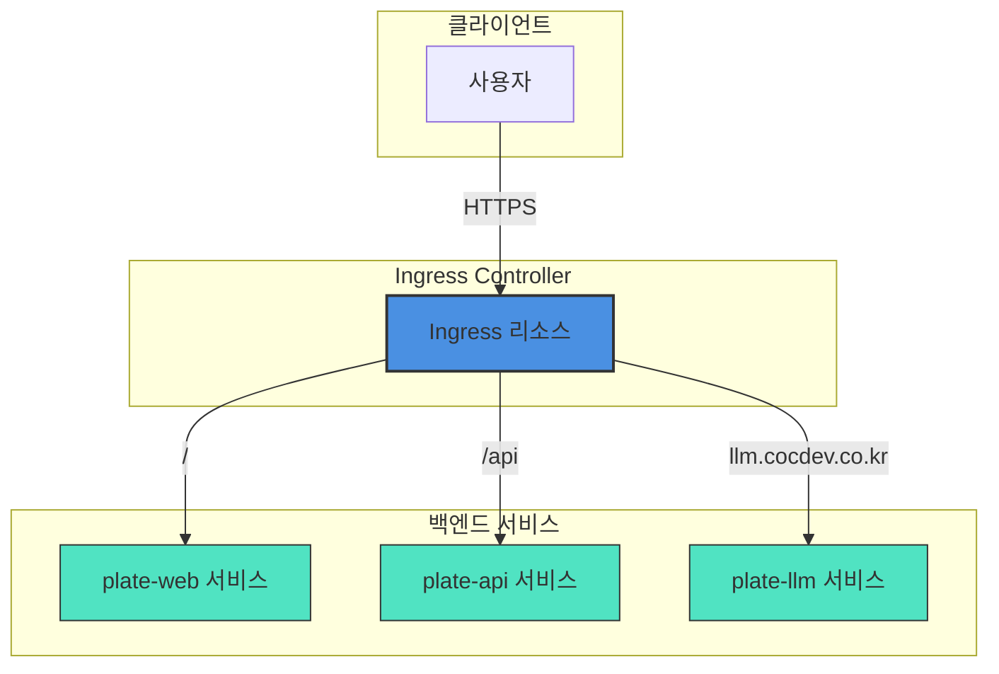
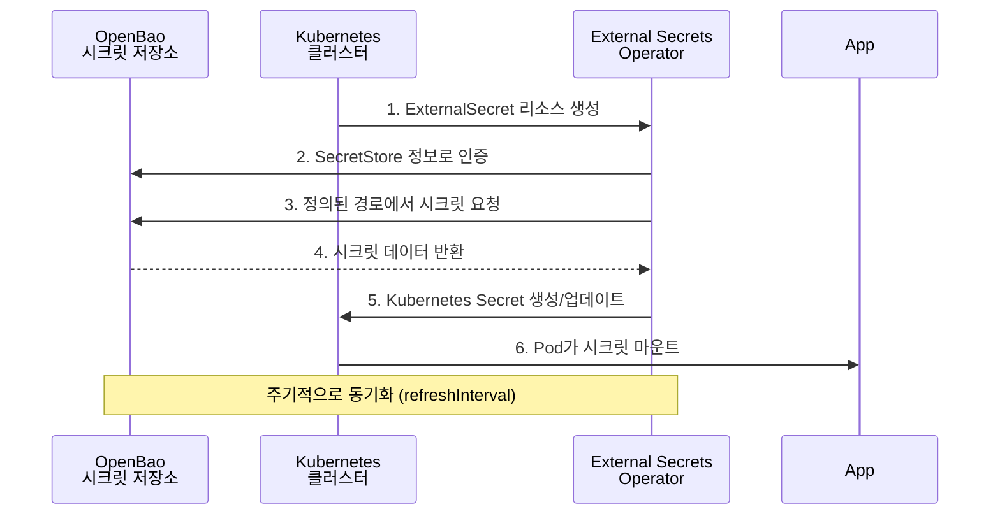

# 공유 인프라 구성

<cite>
**이 문서에서 참조한 파일**  
- [ingress.yaml](file://helm/ingress/templates/ingress.yaml)
- [ingress/values.yaml](file://helm/ingress/values.yaml)
- [ingress/values-stg.yaml](file://helm/ingress/values-stg.yaml)
- [openbao-secrets-manager/Chart.yaml](file://helm/shared-configs/openbao-secrets-manager/Chart.yaml)
- [openbao-secrets-manager/templates/external-secret.yaml](file://helm/shared-configs/openbao-secrets-manager/templates/external-secret.yaml)
- [openbao-secrets-manager/templates/secret-store.yaml](file://helm/shared-configs/openbao-secrets-manager/templates/secret-store.yaml)
- [openbao-secrets-manager/values.yaml](file://helm/shared-configs/openbao-secrets-manager/values.yaml)
- [openbao-secrets-manager/values-staging.yaml](file://helm/shared-configs/openbao-secrets-manager/values-staging.yaml)
- [openbao-secrets-manager/values-production.yaml](file://helm/shared-configs/openbao-secrets-manager/values-production.yaml)
- [environments/argocd/apps/ingress-prod.yaml](file://environments/argocd/apps/ingress-prod.yaml)
- [environments/argocd/apps/ingress-stg.yaml](file://environments/argocd/apps/ingress-stg.yaml)
- [environments/argocd/apps/openbao-secrets-manager-prod.yaml](file://environments/argocd/apps/openbao-secrets-manager-prod.yaml)
- [environments/argocd/apps/openbao-secrets-manager-stg.yaml](file://environments/argocd/apps/openbao-secrets-manager-stg.yaml)
</cite>

## 목차
1. [소개](#소개)
2. [통합 Ingress 구성](#통합-ingress-구성)
3. [중앙화된 시크릿 관리](#중앙화된-시크릿-관리)
4. [보안 및 가용성 전략](#보안-및-가용성-전략)
5. [구성 관리 방식](#구성-관리-방식)
6. [장애 대응 절차](#장애-대응-절차)
7. [확장성 고려사항](#확장성-고려사항)
8. [결론](#결론)

## 소개

prj-devops 프로젝트는 GitOps 기반의 Kubernetes 배포 인프라로, Helm과 ArgoCD를 활용하여 선언적이고 자동화된 배포를 지원합니다. 이 문서는 공유 인프라 구성 요소 중 통합 Ingress 설정과 OpenBao 기반의 중앙화된 시크릿 관리 기능을 심층적으로 분석합니다. 트래픽 라우팅 전략, 시크릿 저장소 통합 방식, 운영 환경에서의 보안 및 가용성 보장 전략을 설명하며, 구성 관리, 장애 대응, 확장성 측면도 포함합니다.

## 통합 Ingress 구성

### 트래픽 라우팅 전략

프로젝트는 `helm/ingress` 차트를 통해 통합 Ingress 리소스를 제공하여 모든 애플리케이션의 트래픽을 중앙에서 관리합니다. 이 접근 방식은 라우팅 규칙의 일관성과 유지보수성을 보장합니다.

Ingress는 `networking.k8s.io/v1` API를 사용하며, 환경별로 별도의 values 파일(`values.yaml` 및 `values-stg.yaml`)을 통해 설정을 오버라이드합니다. 프로덕션과 스테이징 환경 모두 `nginx` IngressClass를 사용하며, `cert-manager`와 연동하여 Let's Encrypt를 통해 TLS 인증서를 자동으로 발급받습니다.

**라우팅 규칙**
- **프로덕션 환경** (`values.yaml` 기반):
  - `cocdev.co.kr` 도메인으로 들어오는 모든 트래픽을 처리합니다.
  - 루트 경로(`/`)는 `plate-web-prod` 서비스(프론트엔드)로 라우팅됩니다.
  - `/api` 접두사가 붙은 경로는 `plate-api-prod` 서비스(백엔드)로 라우팅됩니다.
- **스테이징 환경** (`values-stg.yaml` 기반):
  - `stg.cocdev.co.kr` 및 `llm.cocdev.co.kr` 두 도메인을 지원합니다.
  - `stg.cocdev.co.kr`에 대한 라우팅은 프로덕션과 동일한 패턴을 따릅니다.
  - `llm.cocdev.co.kr`에 대한 모든 트래픽은 `plate-llm-stg` 서비스로 라우팅되어 LLM 서비스를 위한 별도의 엔드포인트를 제공합니다.

이러한 구성은 애플리케이션 개발자에게는 Ingress 설정의 복잡성을 추상화하면서도, DevOps 팀은 라우팅 전략을 중앙에서 통제할 수 있도록 합니다.

**다이어그램 출처**
- [ingress.yaml](file://helm/ingress/templates/ingress.yaml#L1-L80)
- [values.yaml](file://helm/ingress/values.yaml#L1-L49)
- [values-stg.yaml](file://helm/ingress/values-stg.yaml#L1-L59)

**섹션 출처**
- [ingress.yaml](file://helm/ingress/templates/ingress.yaml#L1-L80)
- [values.yaml](file://helm/ingress/values.yaml#L1-L49)
- [values-stg.yaml](file://helm/ingress/values-stg.yaml#L1-L59)
- [ingress-prod.yaml](file://environments/argocd/apps/ingress-prod.yaml#L1-L81)
- [ingress-stg.yaml](file://environments/argocd/apps/ingress-stg.yaml#L1-L70)

## 중앙화된 시크릿 관리

### OpenBao와 External Secrets Operator 통합

프로젝트는 `shared-configs/openbao-secrets-manager` Helm 차트를 통해 OpenBao(Vault)를 중앙화된 시크릿 저장소로 통합합니다. 이 차트는 External Secrets Operator(ESO)를 사용하여 OpenBao에 저장된 시크릿을 Kubernetes Secret으로 동기화하는 역할을 합니다.

**핵심 구성 요소**
1. **SecretStore**: OpenBao 서버의 연결 정보(서버 URL, 경로, 인증 토큰 참조)를 정의합니다. 이 정보는 `secret-store.yaml` 템플릿을 통해 생성되며, 각 네임스페이스에 배포됩니다.
2. **ExternalSecret**: OpenBao 내 특정 경로에서 어떤 키를 가져와 Kubernetes Secret의 어떤 키로 매핑할지 정의합니다. 이는 `external-secret.yaml` 템플릿을 통해 생성됩니다.
3. **ServiceAccount**: ESO 컨트롤러가 SecretStore를 관리할 수 있도록 권한을 부여합니다.

**환경별 구성**
- **스테이징 환경** (`values-staging.yaml`):
  - `plate-stg` 네임스페이스에만 배포됩니다.
  - 시크릿 동기화 주기는 30분으로 설정되어 개발 환경의 빠른 변경에 대응합니다.
  - OpenBao의 `server/staging` 경로에서 시크릿을 가져옵니다.
- **프로덕션 환경** (`values-production.yaml`):
  - `plate-prod` 네임스페이스에만 배포됩니다.
  - 시크릿 동기화 주기는 1시간으로 설정되어 안정성을 우선시합니다.
  - OpenBao의 `server/production` 경로에서 시크릿을 가져옵니다.
  - 추가적인 보안 컨텍스트 설정(읽기 전용 루트 파일시스템)과 노드 선택기, 허용 오차를 통해 프로덕션 워커 노드에 우선적으로 스케줄링됩니다.

이러한 구조는 개발, 스테이징, 프로덕션 환경 간 시크릿의 완전한 격리를 보장하며, 환경 간 시크릿 유출을 방지합니다.

**다이어그램 출처**
- [external-secret.yaml](file://helm/shared-configs/openbao-secrets-manager/templates/external-secret.yaml#L1-L49)
- [secret-store.yaml](file://helm/shared-configs/openbao-secrets-manager/templates/secret-store.yaml#L1-L29)
- [values-staging.yaml](file://helm/shared-configs/openbao-secrets-manager/values-staging.yaml#L1-L167)
- [values-production.yaml](file://helm/shared-configs/openbao-secrets-manager/values-production.yaml#L1-L196)

**섹션 출처**
- [Chart.yaml](file://helm/shared-configs/openbao-secrets-manager/Chart.yaml#L1-L25)
- [external-secret.yaml](file://helm/shared-configs/openbao-secrets-manager/templates/external-secret.yaml#L1-L49)
- [secret-store.yaml](file://helm/shared-configs/openbao-secrets-manager/templates/secret-store.yaml#L1-L29)
- [values.yaml](file://helm/shared-configs/openbao-secrets-manager/values.yaml#L1-L233)
- [values-staging.yaml](file://helm/shared-configs/openbao-secrets-manager/values-staging.yaml#L1-L167)
- [values-production.yaml](file://helm/shared-configs/openbao-secrets-manager/values-production.yaml#L1-L196)
- [openbao-secrets-manager-prod.yaml](file://environments/argocd/apps/openbao-secrets-manager-prod.yaml#L1-L80)
- [openbao-secrets-manager-stg.yaml](file://environments/argocd/apps/openbao-secrets-manager-stg.yaml#L1-L70)

## 보안 및 가용성 전략

### 운영 환경 보안 강화

실제 운영 환경에서는 다음과 같은 보안 및 가용성 전략을 적용합니다.

**Ingress 보안**
- **TLS 강제 적용**: 프로덕션 Ingress는 `letsencrypt-prod` ClusterIssuer를 사용하여 실서명된 TLS 인증서를 발급받습니다. 모든 HTTP 트래픽은 HTTPS로 리다이렉트됩니다.
- **주석 관리**: `ignoreDifferences` 설정을 통해 Ingress 리소스의 `metadata.annotations` 필드 변경을 무시함으로써, cert-manager가 자동으로 추가하는 주석으로 인한 불필요한 동기화 사이클을 방지합니다.

**시크릿 관리 보안**
- **토큰 분리**: OpenBao 인증 토큰은 Helm 차트 내에서 생성하지 않고, 별도의 스크립트(`./scripts/openbao/create-token.sh`)를 통해 Kubernetes Secret으로 생성합니다. 이는 토큰이 Git 저장소에 노출되는 것을 방지합니다.
- **데이터 무시 설정**: ArgoCD의 `ignoreDifferences` 설정을 통해 `Secret` 리소스의 `/data` 필드와 `ExternalSecret` 리소스의 `/status` 필드 변경을 무시합니다. 이는 외부 시스템(ESO)이 관리하는 데이터가 Git 상태와 일치하지 않아도 동기화 오류로 간주되지 않도록 합니다.
- **프로덕션 전용 정책**: 프로덕션 환경의 `openbao-secrets-manager`는 `prune: false`로 설정되어 Git 저장소에서 리소스를 삭제하더라도 클러스터에서 자동으로 삭제되지 않도록 합니다. 이는 실수로 인한 시크릿 삭제를 방지하는 안전 장치입니다.

**가용성**
- **의존성 관리**: `openbao-secrets-manager`는 ArgoCD의 `sync-wave: "1"` 어노테이션을 통해 애플리케이션보다 먼저 배포됩니다. 이는 애플리케이션이 시작되기 전에 필요한 시크릿이 준비되도록 보장합니다.
- **재시도 정책**: 프로덕션 환경의 동기화 실패 시 재시도 정책은 더 긴 대기 시간(`duration: 10s`, `maxDuration: 5m`)을 가지며, 일시적인 네트워크 문제에 더 유연하게 대응합니다.

## 구성 관리 방식

### GitOps 기반 선언적 관리

모든 구성은 Git 저장소를 단일 진실 원천(Single Source of Truth)으로 관리합니다.

**Ingress 구성 관리**
- `helm/ingress` 디렉터리의 `values.yaml`과 `values-stg.yaml` 파일이 각 환경의 Ingress 설정을 정의합니다.
- 변경 사항은 Git을 통해 제어되며, ArgoCD가 변경을 감지하고 클러스터에 자동 적용합니다.
- 롤백은 Git에서 이전 커밋으로 되돌린 후 ArgoCD를 재동기화하는 방식으로 수행됩니다.

**시크릿 관리 구성 관리**
- `shared-configs/openbao-secrets-manager` 차트의 `values.yaml`은 기본 매핑 구조를 정의합니다.
- 환경별 오버라이드는 `values-staging.yaml`과 `values-production.yaml`에서 수행됩니다.
- 실제 시크릿 값은 Git 저장소에 저장되지 않고, OpenBao 내부에 안전하게 저장됩니다. Git에는 시크릿의 존재와 매핑 정보만 선언됩니다.

## 장애 대응 절차

### 주요 장애 시나리오 및 대응

**Ingress 장애**
- **증상**: 도메인으로 접근이 불가능하거나 HTTPS 연결이 실패함.
- **점검 항목**:
  1. `kubectl get ingress -A`로 Ingress 리소스 상태 확인.
  2. `kubectl get certificates -A`로 인증서 리소스 상태 확인.
  3. `kubectl logs -n cert-manager -l app=cert-manager`로 cert-manager 로그 확인.
  4. DNS 레코드가 Ingress Controller의 LoadBalancer IP와 올바르게 연결되었는지 확인.

**시크릿 동기화 장애**
- **증상**: 애플리케이션 Pod가 시작되지 않거나, 환경 변수가 누락되었다는 오류 발생.
- **점검 항목**:
  1. `kubectl get externalsecrets -n <namespace>`로 ExternalSecret 리소스 상태 확인.
  2. `kubectl get secrets -n <namespace>`로 대상 Secret이 생성되었는지 확인.
  3. `kubectl logs -n external-secrets <external-secrets-controller-pod>`로 ESO 컨트롤러 로그 확인.
  4. OpenBao 서버의 가용성과 토큰의 유효성 확인.

## 확장성 고려사항

### 미래 확장을 위한 설계

현재의 구성은 새로운 애플리케이션과 환경의 추가를 용이하게 합니다.

**새 애플리케이션 추가**
- 새로운 애플리케이션을 `helm/applications/` 아래에 새 Helm 차트로 생성합니다.
- `helm/ingress/values-*.yaml` 파일에 새로운 호스트와 경로를 추가하여 라우팅 규칙을 정의합니다.
- 필요 시 `shared-configs/openbao-secrets-manager/values-*.yaml`에 새로운 시크릿 매핑을 추가합니다.

**새 환경 추가**
- `environments/` 아래에 새 환경 디렉터리를 생성합니다.
- `helm/ingress/values-<env>.yaml`과 `shared-configs/openbao-secrets-manager/values-<env>.yaml` 파일을 작성합니다.
- `environments/argocd/apps/`에 각각의 ArgoCD Application 정의 파일(`ingress-<env>.yaml`, `openbao-secrets-manager-<env>.yaml`)을 추가합니다.

이러한 모듈화된 구조는 시스템의 복잡성을 제어하면서도 유연한 확장을 가능하게 합니다.

## 결론

prj-devops의 공유 인프라 구성은 통합 Ingress를 통한 효율적인 트래픽 라우팅과 OpenBao 기반의 중앙화된 시크릿 관리를 핵심으로 합니다. 이는 GitOps 원칙에 따라 선언적으로 관리되며, 환경 간 일관성과 보안을 보장합니다. 프로덕션 환경을 위한 보수적인 운영 전략과 장애 대응 절차는 시스템의 안정성과 가용성을 높이며, 모듈화된 설계는 미래의 확장을 용이하게 합니다. 이러한 기반 위에서 애플리케이션 개발은 인프라 세부 사항에서 자유로워져, 비즈니스 로직에 집중할 수 있습니다.