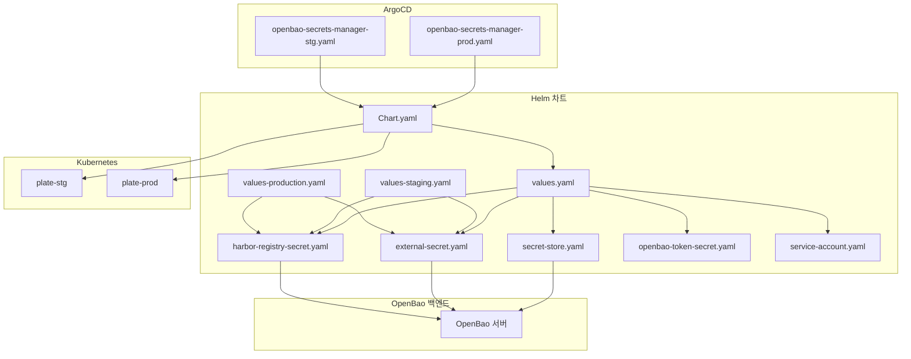
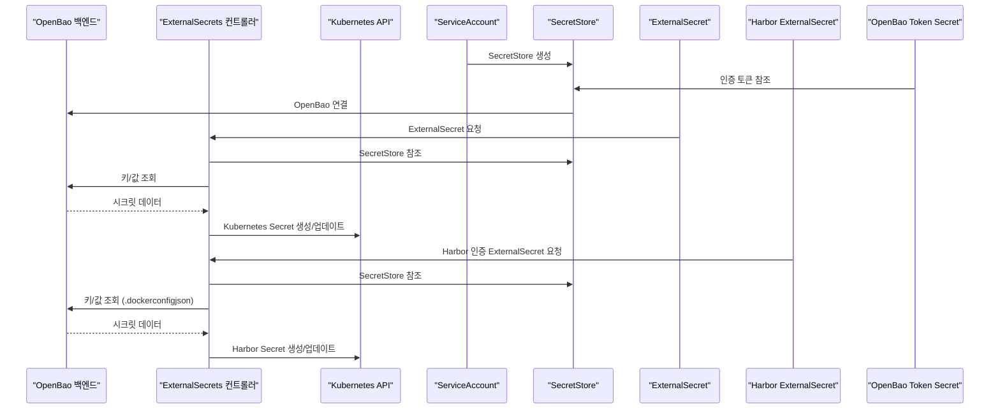
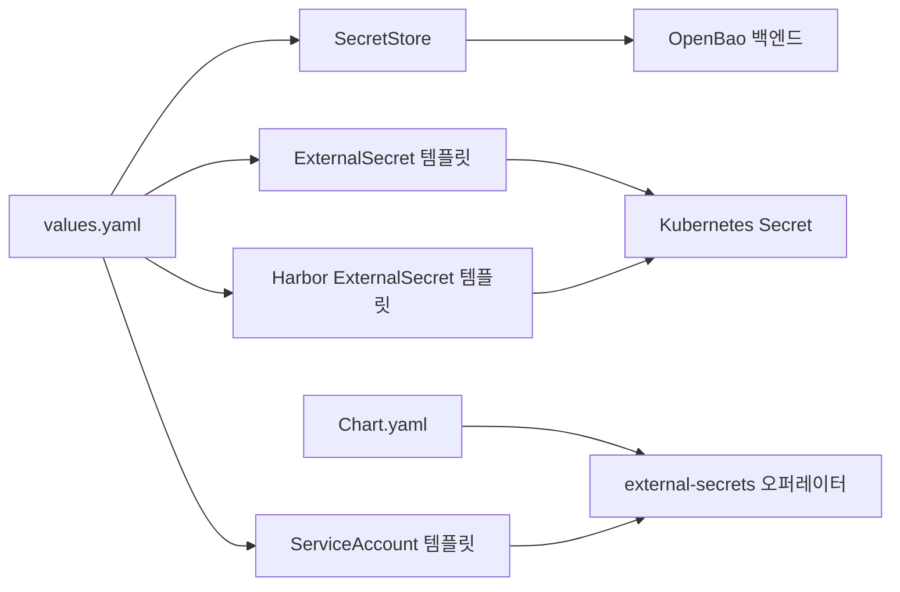

# 중앙화된 시크릿 관리

<cite>
**이 문서에서 참조하는 파일**
- [Chart.yaml](file://helm/shared-configs/openbao-secrets-manager/Chart.yaml)
- [values.yaml](file://helm/shared-configs/openbao-secrets-manager/values.yaml)
- [values-production.yaml](file://helm/shared-configs/openbao-secrets-manager/values-production.yaml)
- [values-staging.yaml](file://helm/shared-configs/openbao-secrets-manager/values-staging.yaml)
- [secret-store.yaml](file://helm/shared-configs/openbao-secrets-manager/templates/secret-store.yaml)
- [external-secret.yaml](file://helm/shared-configs/openbao-secrets-manager/templates/external-secret.yaml)
- [harbor-registry-secret.yaml](file://helm/shared-configs/openbao-secrets-manager/templates/harbor-registry-secret.yaml)
- [openbao-token-secret.yaml](file://helm/shared-configs/openbao-secrets-manager/templates/openbao-token-secret.yaml)
- [service-account.yaml](file://helm/shared-configs/openbao-secrets-manager/templates/service-account.yaml)
- [openbao-secrets-manager-prod.yaml](file://environments/argocd/apps/openbao-secrets-manager-prod.yaml)
- [openbao-secrets-manager-stg.yaml](file://environments/argocd/apps/openbao-secrets-manager-stg.yaml)
- [create-token.sh](file://scripts/openbao/create-token.sh)
</cite>

## 목차
1. [소개](#소개)
2. [프로젝트 구조](#프로젝트-구조)
3. [핵심 구성 요소](#핵심-구성-요소)
4. [아키텍처 개요](#아키텍처-개요)
5. [상세 구성 요소 분석](#상세-구성-요소-분석)
6. [의존성 분석](#의존성-분석)
7. [성능 고려사항](#성능-고려사항)
8. [장애 복구 가이드](#장애-복구-가이드)
9. [결론](#결론)
10. [부록](#부록)

## 소개
본 문서는 prj-devops에서 OpenBao를 활용한 중앙화된 시크릿 관리 시스템을 심층적으로 분석합니다. OpenBao 백엔드 연결 설정(secret-store.yaml), 외부 시크릿 동기화 메커니즘(external-secret.yaml), Harbor 레지스트리 인증 토큰 관리(harbor-registry-secret.yaml), OpenBao 인증 토큰(openbao-token-secret.yaml) 및 서비스 계정(service-account.yaml) 통합, RBAC 기반 접근 제어 전략, 시크릿 수명 주기 및 회전 전략, 장애 복구 절차, 보안 감사 로깅까지 포괄적으로 설명합니다.

## 프로젝트 구조
- Helm 차트: central OpenBao 시크릿 관리 컴포넌트를 제공하는 차트입니다. OpenBao 백엔드 연결, ExternalSecrets 동기화, Harbor 인증 시크릿, 토큰 시크릿, 서비스 계정 등을 템플릿화하여 배포합니다.
- ArgoCD 어플리케이션: 프로덕션(staging) 환경별로 OpenBao 시크릿 관리 차트를 배포하고, 동기화 정책과 무시 규칙을 설정합니다.
- 스크립트: OpenBao 토큰 생성 및 Kubernetes Secret 배포를 자동화합니다.

**도표 출처**
- [Chart.yaml](file://helm/shared-configs/openbao-secrets-manager/Chart.yaml#L1-L25)
- [values.yaml](file://helm/shared-configs/openbao-secrets-manager/values.yaml#L1-L233)
- [values-staging.yaml](file://helm/shared-configs/openbao-secrets-manager/values-staging.yaml#L1-L167)
- [values-production.yaml](file://helm/shared-configs/openbao-secrets-manager/values-production.yaml#L1-L196)
- [secret-store.yaml](file://helm/shared-configs/openbao-secrets-manager/templates/secret-store.yaml#L1-L29)
- [external-secret.yaml](file://helm/shared-configs/openbao-secrets-manager/templates/external-secret.yaml#L1-L49)
- [harbor-registry-secret.yaml](file://helm/shared-configs/openbao-secrets-manager/templates/harbor-registry-secret.yaml#L1-L77)
- [openbao-token-secret.yaml](file://helm/shared-configs/openbao-secrets-manager/templates/openbao-token-secret.yaml#L1-L26)
- [service-account.yaml](file://helm/shared-configs/openbao-secrets-manager/templates/service-account.yaml#L1-L19)
- [openbao-secrets-manager-prod.yaml](file://environments/argocd/apps/openbao-secrets-manager-prod.yaml#L1-L80)
- [openbao-secrets-manager-stg.yaml](file://environments/argocd/apps/openbao-secrets-manager-stg.yaml#L1-L78)

**섹션 출처**
- [Chart.yaml](file://helm/shared-configs/openbao-secrets-manager/Chart.yaml#L1-L25)
- [values.yaml](file://helm/shared-configs/openbao-secrets-manager/values.yaml#L1-L233)

## 핵심 구성 요소
- SecretStore: OpenBao 백엔드 연결 설정을 정의합니다. 서버 주소, 엔진 경로, 버전, 인증 토큰 참조를 포함합니다.
- ExternalSecret: OpenBao에서 가져온 값을 Kubernetes Secret으로 동기화합니다. refreshInterval, target, data 매핑, 템플릿 등을 지원합니다.
- Harbor Registry Secret: Docker 인증 정보(.dockerconfigjson)를 OpenBao에서 가져와서 Harbor 레지스트리 인증용 Secret으로 동기화합니다.
- OpenBao Token Secret: OpenBao 인증 토큰을 Kubernetes Secret으로 관리합니다. 토큰은 스크립트를 통해 생성되고, 이후 ExternalSecret이 이를 참조합니다.
- ServiceAccount: ExternalSecrets 컨트롤러 및 OpenBao 연동에 필요한 서비스 계정을 제공합니다.

**섹션 출처**
- [secret-store.yaml](file://helm/shared-configs/openbao-secrets-manager/templates/secret-store.yaml#L1-L29)
- [external-secret.yaml](file://helm/shared-configs/openbao-secrets-manager/templates/external-secret.yaml#L1-L49)
- [harbor-registry-secret.yaml](file://helm/shared-configs/openbao-secrets-manager/templates/harbor-registry-secret.yaml#L1-L77)
- [openbao-token-secret.yaml](file://helm/shared-configs/openbao-secrets-manager/templates/openbao-token-secret.yaml#L1-L26)
- [service-account.yaml](file://helm/shared-configs/openbao-secrets-manager/templates/service-account.yaml#L1-L19)

## 아키텍처 개요
OpenBao 백엔드에 연결된 SecretStore를 통해 ExternalSecrets 컨트롤러가 OpenBao의 키/값을 읽고 Kubernetes Secret으로 동기화합니다. Harbor 인증 정보는 별도 ExternalSecret을 통해 .dockerconfigjson 형식으로 관리됩니다. 토큰은 스크립트를 통해 생성된 Secret을 SecretStore 인증 토큰으로 사용합니다. ArgoCD는 각 환경별 어플리케이션을 통해 차트를 배포하고, 동기화 정책과 무시 규칙을 적용합니다.

**도표 출처**
- [secret-store.yaml](file://helm/shared-configs/openbao-secrets-manager/templates/secret-store.yaml#L1-L29)
- [external-secret.yaml](file://helm/shared-configs/openbao-secrets-manager/templates/external-secret.yaml#L1-L49)
- [harbor-registry-secret.yaml](file://helm/shared-configs/openbao-secrets-manager/templates/harbor-registry-secret.yaml#L1-L77)
- [openbao-token-secret.yaml](file://helm/shared-configs/openbao-secrets-manager/templates/openbao-token-secret.yaml#L1-L26)
- [service-account.yaml](file://helm/shared-configs/openbao-secrets-manager/templates/service-account.yaml#L1-L19)

## 상세 구성 요소 분석

### SecretStore 구성
- OpenBao 서버 주소, 엔진 경로, 버전을 설정합니다.
- 인증 토큰은 Kubernetes Secret을 참조합니다. 토큰 Secret은 스크립트를 통해 생성되며, 이후 SecretStore가 이를 사용합니다.
- 네임스페이스별로 SecretStore를 배포합니다. 환경 라벨(production/staging)을 붙여 관리합니다.

**섹션 출처**
- [secret-store.yaml](file://helm/shared-configs/openbao-secrets-manager/templates/secret-store.yaml#L1-L29)
- [values.yaml](file://helm/shared-configs/openbao-secrets-manager/values.yaml#L13-L33)
- [openbao-token-secret.yaml](file://helm/shared-configs/openbao-secrets-manager/templates/openbao-token-secret.yaml#L1-L26)

### ExternalSecret 동기화 메커니즘
- refreshInterval: 시크릿 동기화 주기(기본 1시간, staging은 30분).
- secretStoreRef: SecretStore 참조.
- target: 생성 정책(Owner), 대상 Secret 이름, 라벨, 템플릿 타입(Opaque).
- data: OpenBao 키/속성 매핑. 환경별 values에서 정의됩니다.
- 템플릿: OpenBao에서 가져온 값들을 Kubernetes Secret에 맞게 매핑합니다.

**섹션 출처**
- [external-secret.yaml](file://helm/shared-configs/openbao-secrets-manager/templates/external-secret.yaml#L1-L49)
- [values.yaml](file://helm/shared-configs/openbao-secrets-manager/values.yaml#L35-L63)
- [values-staging.yaml](file://helm/shared-configs/openbao-secrets-manager/values-staging.yaml#L17-L36)
- [values-production.yaml](file://helm/shared-configs/openbao-secrets-manager/values-production.yaml#L17-L38)

### Harbor Registry Secret 관리
- ExternalSecret을 통해 OpenBao에서 registry, username, password를 가져옵니다.
- 템플릿 타입은 kubernetes.io/dockerconfigjson이며, .dockerconfigjson 내용은 템플릿 내에 정의됩니다.
- 환경별 OpenBao 키 경로를 values에서 지정합니다(staging/production/development).
- refreshInterval은 환경별로 설정됩니다.

**섹션 출처**
- [harbor-registry-secret.yaml](file://helm/shared-configs/openbao-secrets-manager/templates/harbor-registry-secret.yaml#L1-L77)
- [values.yaml](file://helm/shared-configs/openbao-secrets-manager/values.yaml#L210-L230)
- [values-staging.yaml](file://helm/shared-configs/openbao-secrets-manager/values-staging.yaml#L149-L156)
- [values-production.yaml](file://helm/shared-configs/openbao-secrets-manager/values-production.yaml#L180-L196)

### OpenBao 인증 토큰 관리
- 토큰은 스크립트(create-token.sh)를 통해 생성됩니다. Vault CLI를 사용하여 OpenBao에 연결하고, 정책을 기반으로 토큰을 생성합니다.
- 토큰은 Kubernetes Secret으로 저장되며, SecretStore의 tokenSecretRef.name/key를 통해 참조됩니다.
- values.yaml에서는 openbao.token.create=false로 설정되어 있어, 토큰 Secret은 스크립트를 통해 수동으로 생성되어야 합니다.

**섹션 출처**
- [create-token.sh](file://scripts/openbao/create-token.sh#L1-L550)
- [openbao-token-secret.yaml](file://helm/shared-configs/openbao-secrets-manager/templates/openbao-token-secret.yaml#L1-L26)
- [values.yaml](file://helm/shared-configs/openbao-secrets-manager/values.yaml#L27-L33)

### 서비스 계정과 RBAC 통합
- ServiceAccount는 각 네임스페이스에 배포되며, ExternalSecrets 컨트롤러가 SecretStore/ExternalSecret을 관리하는 데 필요한 권한을 부여받습니다.
- values.yaml에 serviceAccount.create=true로 설정되어 있어, 차트가 자체적으로 ServiceAccount를 생성합니다.
- ArgoCD 어플리케이션은 ignoreDifferences를 통해 Secret data 필드와 ExternalSecret status 필드 변경을 무시하여, 외부 시스템(OpenBao)이 관리하는 시크릿 데이터를 보호합니다.

**섹션 출처**
- [service-account.yaml](file://helm/shared-configs/openbao-secrets-manager/templates/service-account.yaml#L1-L19)
- [values.yaml](file://helm/shared-configs/openbao-secrets-manager/values.yaml#L199-L209)
- [openbao-secrets-manager-prod.yaml](file://environments/argocd/apps/openbao-secrets-manager-prod.yaml#L64-L74)
- [openbao-secrets-manager-stg.yaml](file://environments/argocd/apps/openbao-secrets-manager-stg.yaml#L62-L72)

### 수명 주기 및 회전 전략
- refreshInterval: OpenBao에서 가져온 시크릿을 주기적으로 동기화합니다. staging은 30분, production은 1시간.
- 토큰 회전: create-token.sh에서 TTL(period) 설정을 통해 자동 갱신 주기를 지정할 수 있으며, renewal 가능 여부를 선택할 수 있습니다.
- 무효화: 기존 토큰 검색 후 일괄 또는 선택적으로 무효화할 수 있습니다.

**섹션 출처**
- [external-secret.yaml](file://helm/shared-configs/openbao-secrets-manager/templates/external-secret.yaml#L20-L21)
- [harbor-registry-secret.yaml](file://helm/shared-configs/openbao-secrets-manager/templates/harbor-registry-secret.yaml#L20-L21)
- [create-token.sh](file://scripts/openbao/create-token.sh#L117-L131)
- [create-token.sh](file://scripts/openbao/create-token.sh#L237-L281)

### 장애 복구 절차
- ArgoCD 동기화 실패 재시도: production은 3회, staging은 5회 재시도하며, backoff 설정이 적용됩니다.
- prune 정책: production은 prune=false, staging은 prune=true로 설정되어 있습니다.
- ignoreDifferences: Secret data와 ExternalSecret status 필드 변경을 무시하여, 수동 변경 시 Git 상태로 자동 복구됩니다.
- OpenBao 연결 테스트: create-token.sh에서 OpenBao 서버 연결 테스트를 수행합니다.

**섹션 출처**
- [openbao-secrets-manager-prod.yaml](file://environments/argocd/apps/openbao-secrets-manager-prod.yaml#L38-L60)
- [openbao-secrets-manager-stg.yaml](file://environments/argocd/apps/openbao-secrets-manager-stg.yaml#L38-L58)
- [openbao-secrets-manager-prod.yaml](file://environments/argocd/apps/openbao-secrets-manager-prod.yaml#L64-L74)
- [openbao-secrets-manager-stg.yaml](file://environments/argocd/apps/openbao-secrets-manager-stg.yaml#L62-L72)
- [create-token.sh](file://scripts/openbao/create-token.sh#L47-L58)

### 보안 감사 로깅
- ArgoCD 어플리케이션에 ignoreDifferences를 통해 Secret data와 ExternalSecret status 변경을 무시하여, 외부 시스템이 관리하는 시크릿 데이터를 보호합니다.
- 토큰 생성 스크립트는 토큰 정보를 화면에 출력하고, 파일로 저장할 수 있도록 유도하나, 보안 경고를 포함합니다.
- OpenBao 토큰 Secret에는 라벨과 어노테이션을 추가하여 감사 및 모니터링이 용이하도록 구성됩니다.

**섹션 출처**
- [openbao-secrets-manager-prod.yaml](file://environments/argocd/apps/openbao-secrets-manager-prod.yaml#L64-L74)
- [openbao-secrets-manager-stg.yaml](file://environments/argocd/apps/openbao-secrets-manager-stg.yaml#L62-L72)
- [openbao-token-secret.yaml](file://helm/shared-configs/openbao-secrets-manager/templates/openbao-token-secret.yaml#L9-L16)
- [create-token.sh](file://scripts/openbao/create-token.sh#L355-L362)

## 의존성 분석
- Chart.yaml은 external-secrets 오퍼레이터를 의존성으로 선언합니다. values.yaml에서는 externalSecrets.install=false로 설정되어 있어, 오퍼레이터는 별도로 설치되어야 합니다.
- SecretStore는 OpenBao 백엔드에 연결되며, ExternalSecrets 컨트롤러가 이를 통해 시크릿을 가져옵니다.
- Harbor ExternalSecret은 OpenBao 키 경로를 통해 registry, username, password를 가져옵니다.
- ServiceAccount는 ExternalSecrets 컨트롤러가 SecretStore/ExternalSecret을 관리하는 데 필요한 권한을 부여받습니다.

**도표 출처**
- [Chart.yaml](file://helm/shared-configs/openbao-secrets-manager/Chart.yaml#L19-L24)
- [values.yaml](file://helm/shared-configs/openbao-secrets-manager/values.yaml#L35-L63)
- [secret-store.yaml](file://helm/shared-configs/openbao-secrets-manager/templates/secret-store.yaml#L1-L29)
- [external-secret.yaml](file://helm/shared-configs/openbao-secrets-manager/templates/external-secret.yaml#L1-L49)
- [harbor-registry-secret.yaml](file://helm/shared-configs/openbao-secrets-manager/templates/harbor-registry-secret.yaml#L1-L77)
- [service-account.yaml](file://helm/shared-configs/openbao-secrets-manager/templates/service-account.yaml#L1-L19)

**섹션 출처**
- [Chart.yaml](file://helm/shared-configs/openbao-secrets-manager/Chart.yaml#L19-L24)
- [values.yaml](file://helm/shared-configs/openbao-secrets-manager/values.yaml#L35-L63)

## 성능 고려사항
- refreshInterval은 production(1시간)과 staging(30분)으로 다르게 설정되어 있어, 환경별 부하를 조절합니다.
- ArgoCD 동기화 재시도는 production(3회)과 staging(5회)로 다르게 설정되어 있습니다.
- ExternalSecrets 컨트롤러는 SecretStore/ExternalSecret 수에 따라 CPU/메모리 사용량이 증가할 수 있으므로, values.yaml의 resources 설정을 환경별로 조정할 수 있습니다.

[이 섹션은 일반적인 성능 논의를 포함하므로 구체적인 파일 분석 없음]

## 장애 복구 가이드
- OpenBao 연결 실패: create-token.sh의 연결 테스트를 통해 OpenBao 서버 상태를 확인하고, VAULT_ADDR, Vault CLI 설치 여부를 점검합니다.
- ExternalSecret 동기화 실패: ArgoCD 어플리케이션의 retry 설정을 확인하고, ignoreDifferences로 인한 상태 불일치를 해결합니다.
- 토큰 무효화: create-token.sh에서 기존 토큰 검색 후 일괄 또는 선택적으로 무효화합니다.
- 네임스페이스 및 ServiceAccount: ServiceAccount가 존재하고 권한이 있는지 확인합니다.

**섹션 출처**
- [create-token.sh](file://scripts/openbao/create-token.sh#L22-L31)
- [create-token.sh](file://scripts/openbao/create-token.sh#L47-L58)
- [openbao-secrets-manager-prod.yaml](file://environments/argocd/apps/openbao-secrets-manager-prod.yaml#L38-L60)
- [openbao-secrets-manager-stg.yaml](file://environments/argocd/apps/openbao-secrets-manager-stg.yaml#L38-L58)
- [service-account.yaml](file://helm/shared-configs/openbao-secrets-manager/templates/service-account.yaml#L1-L19)

## 결론
본 시스템은 ExternalSecrets 오퍼레이터를 통해 OpenBao 백엔드에 중앙화된 시크릿 관리를 구현합니다. SecretStore를 통한 백엔드 연결, ExternalSecret을 통한 자동 동기화, Harbor 인증 정보 관리, OpenBao 토큰 관리, 서비스 계정 통합, RBAC 기반 접근 제어 전략, 수명 주기 및 회전 전략, 장애 복구 절차, 보안 감사 로깅까지 포괄적으로 설계되었습니다. ArgoCD 어플리케이션을 통해 환경별 배포 및 동기화 정책이 체계적으로 관리되며, production 환경에서는 보수적인 설정이 적용되어 있습니다.

[이 섹션은 요약을 포함하므로 구체적인 파일 분석 없음]

## 부록
- 토큰 생성 절차: create-token.sh를 실행하여 OpenBao에 연결하고, 정책을 기반으로 토큰을 생성합니다. 이후 Kubernetes Secret으로 저장하고, SecretStore가 이를 참조합니다.
- 환경별 values: values-staging.yaml과 values-production.yaml을 통해 환경별 OpenBao 키 경로, refreshInterval, 보안 및 리소스 설정을 관리합니다.

**섹션 출처**
- [create-token.sh](file://scripts/openbao/create-token.sh#L1-L550)
- [values-staging.yaml](file://helm/shared-configs/openbao-secrets-manager/values-staging.yaml#L1-L167)
- [values-production.yaml](file://helm/shared-configs/openbao-secrets-manager/values-production.yaml#L1-L196)