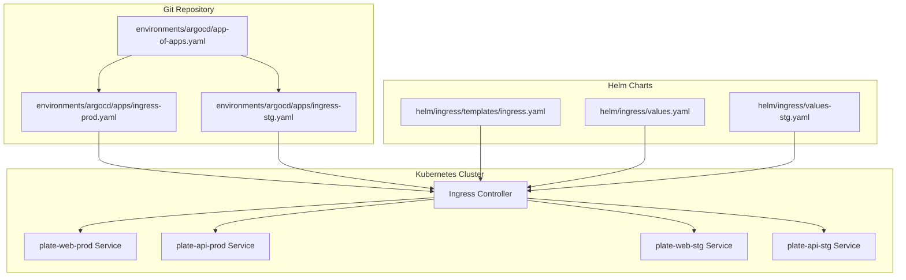
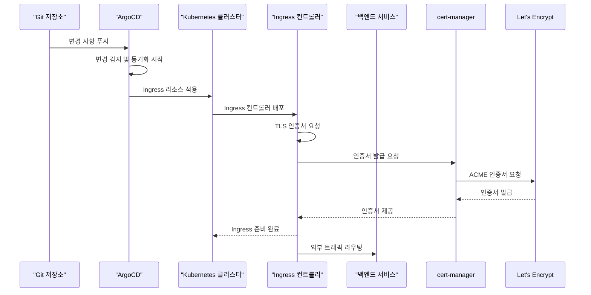
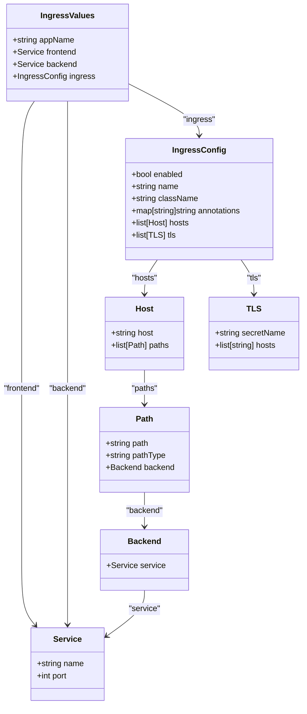
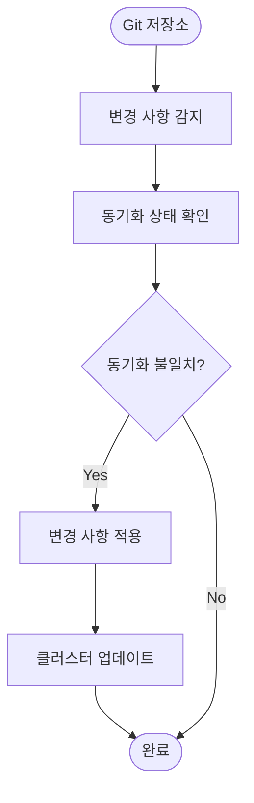
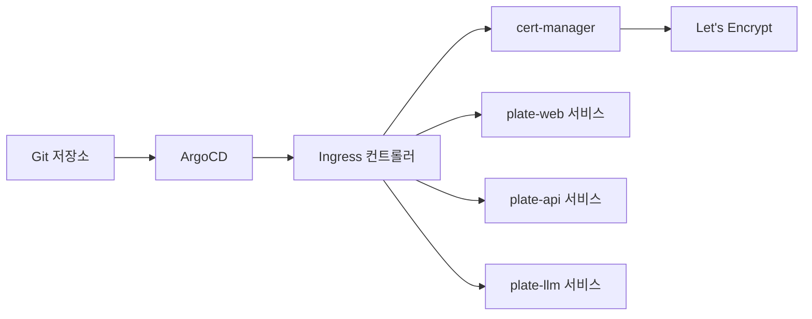

# 통합 Ingress 설정

<cite>
**이 문서에서 참조한 파일**   
- [ingress-prod.yaml](file://environments/argocd/apps/ingress-prod.yaml)
- [ingress-stg.yaml](file://environments/argocd/apps/ingress-stg.yaml)
- [ingress.yaml](file://helm/ingress/templates/ingress.yaml)
- [values.yaml](file://helm/ingress/values.yaml)
- [values-stg.yaml](file://helm/ingress/values-stg.yaml)
- [cluster-issuer-prod.yaml](file://helm/cluster-services/cert-manager/templates/cluster-issuer-prod.yaml)
- [cluster-issuer-staging.yaml](file://helm/cluster-services/cert-manager/templates/cluster-issuer-staging.yaml)
- [app-of-apps.yaml](file://environments/argocd/app-of-apps.yaml)
</cite>

## 목차
1. [소개](#소개)
2. [프로젝트 구조](#프로젝트-구조)
3. [핵심 구성 요소](#핵심-구성-요소)
4. [아키텍처 개요](#아키텍처-개요)
5. [상세 구성 요소 분석](#상세-구성-요소-분석)
6. [의존성 분석](#의존성-분석)
7. [성능 고려사항](#성능-고려사항)
8. [문제 해결 가이드](#문제-해결-가이드)
9. [결론](#결론)

## 소개
본 문서는 prj-devops 리포지토리의 통합 Ingress 구성 요소에 대한 심층적인 분석을 제공합니다. Kubernetes 클러스터 내에서 서비스로의 트래픽 라우팅 전략을 설명하며, 스테이징 및 프로덕션 환경에서의 Ingress 리소스 배포 방식과 TLS 종료 처리 방식을 포함합니다. 다중 도메인 및 경로 기반 라우팅 규칙, 인그레스 컨트롤러와의 통합, 고가용성 및 장애 대응 전략을 문서화합니다. 또한 실제 운영 환경에서의 성능 최적화 및 보안 설정(예: WAF 연동 가능성)에 대해서도 설명하며, ArgoCD를 통한 GitOps 기반 자동 동기화 흐름을 함께 다룹니다.

## 프로젝트 구조
prj-devops 리포지토리는 Helm 차트 기반의 Kubernetes 인프라를 GitOps 방식으로 관리하는 구조를 가지고 있습니다. 핵심 구성 요소는 `helm/ingress` 디렉터리에 위치한 통합 Ingress Helm 차트이며, 이 차트는 다양한 애플리케이션 서비스로의 트래픽을 라우팅하는 데 사용됩니다. 환경별 설정은 `helm/ingress/values.yaml`과 `helm/ingress/values-stg.yaml` 파일을 통해 관리되며, 각 환경의 ArgoCD 애플리케이션 정의는 `environments/argocd/apps/` 디렉터리에 위치합니다.

**다이어그램 출처**
- [ingress-prod.yaml](file://environments/argocd/apps/ingress-prod.yaml)
- [ingress-stg.yaml](file://environments/argocd/apps/ingress-stg.yaml)
- [ingress.yaml](file://helm/ingress/templates/ingress.yaml)
- [values.yaml](file://helm/ingress/values.yaml)
- [values-stg.yaml](file://helm/ingress/values-stg.yaml)

**섹션 출처**
- [environments/argocd/apps/ingress-prod.yaml](file://environments/argocd/apps/ingress-prod.yaml)
- [environments/argocd/apps/ingress-stg.yaml](file://environments/argocd/apps/ingress-stg.yaml)
- [helm/ingress/templates/ingress.yaml](file://helm/ingress/templates/ingress.yaml)

## 핵심 구성 요소
통합 Ingress 구성 요소는 `helm/ingress` 디렉터리에 위치한 Helm 차트를 통해 관리됩니다. 이 차트는 `ingress.yaml` 템플릿 파일을 사용하여 Kubernetes Ingress 리소스를 생성하며, 환경별 설정은 `values.yaml`과 `values-stg.yaml` 파일을 통해 제공됩니다. Ingress 리소스는 `plate-web` 및 `plate-api` 서비스로의 트래픽을 라우팅하며, TLS 종료는 cert-manager를 통해 자동으로 처리됩니다. ArgoCD를 통해 Git 저장소의 변경 사항이 자동으로 클러스터에 동기화되며, 이는 GitOps 기반의 운영 모델을 구현합니다.

**섹션 출처**
- [helm/ingress/templates/ingress.yaml](file://helm/ingress/templates/ingress.yaml)
- [helm/ingress/values.yaml](file://helm/ingress/values.yaml)
- [helm/ingress/values-stg.yaml](file://helm/ingress/values-stg.yaml)

## 아키텍처 개요
prj-devops의 통합 Ingress 아키텍처는 GitOps 기반의 자동화된 배포 흐름을 중심으로 구성됩니다. ArgoCD는 Git 저장소의 변경 사항을 감지하고, 이를 기반으로 Kubernetes 클러스터에 Ingress 리소스를 자동으로 배포합니다. Ingress 컨트롤러는 외부 트래픽을 수신하고, 설정된 라우팅 규칙에 따라 적절한 백엔드 서비스로 트래픽을 전달합니다. TLS 인증서는 Let's Encrypt를 통해 자동으로 발급 및 갱신되며, 이는 cert-manager를 통해 관리됩니다.

**다이어그램 출처**
- [ingress-prod.yaml](file://environments/argocd/apps/ingress-prod.yaml)
- [ingress-stg.yaml](file://environments/argocd/apps/ingress-stg.yaml)
- [ingress.yaml](file://helm/ingress/templates/ingress.yaml)
- [cluster-issuer-prod.yaml](file://helm/cluster-services/cert-manager/templates/cluster-issuer-prod.yaml)
- [cluster-issuer-staging.yaml](file://helm/cluster-services/cert-manager/templates/cluster-issuer-staging.yaml)

## 상세 구성 요소 분석

### Ingress 리소스 분석
Ingress 리소스는 `helm/ingress/templates/ingress.yaml` 템플릿 파일을 기반으로 생성되며, 환경별 설정은 `values.yaml`과 `values-stg.yaml` 파일을 통해 제공됩니다. 프로덕션 환경에서는 `cocdev.co.kr` 도메인을 통해 `plate-web-prod` 및 `plate-api-prod` 서비스로 트래픽을 라우팅하며, 스테이징 환경에서는 `stg.cocdev.co.kr` 및 `llm.cocdev.co.kr` 도메인을 통해 각각의 스테이징 서비스로 트래픽을 라우팅합니다.

**다이어그램 출처**
- [ingress.yaml](file://helm/ingress/templates/ingress.yaml)
- [values.yaml](file://helm/ingress/values.yaml)
- [values-stg.yaml](file://helm/ingress/values-stg.yaml)

**섹션 출처**
- [helm/ingress/templates/ingress.yaml](file://helm/ingress/templates/ingress.yaml)
- [helm/ingress/values.yaml](file://helm/ingress/values.yaml)
- [helm/ingress/values-stg.yaml](file://helm/ingress/values-stg.yaml)

### ArgoCD 통합 분석
ArgoCD는 `environments/argocd/apps/` 디렉터리에 정의된 애플리케이션 리소스를 통해 Ingress 구성 요소를 관리합니다. `ingress-prod.yaml`과 `ingress-stg.yaml` 파일은 각각 프로덕션 및 스테이징 환경의 Ingress 리소스를 정의하며, `app-of-apps.yaml` 파일은 모든 환경의 애플리케이션을 한 번에 관리하는 메인 애플리케이션을 정의합니다. ArgoCD는 자동 동기화 정책을 통해 Git 저장소의 변경 사항을 실시간으로 클러스터에 반영합니다.

**다이어그램 출처**
- [ingress-prod.yaml](file://environments/argocd/apps/ingress-prod.yaml)
- [ingress-stg.yaml](file://environments/argocd/apps/ingress-stg.yaml)
- [app-of-apps.yaml](file://environments/argocd/app-of-apps.yaml)

**섹션 출처**
- [environments/argocd/apps/ingress-prod.yaml](file://environments/argocd/apps/ingress-prod.yaml)
- [environments/argocd/apps/ingress-stg.yaml](file://environments/argocd/apps/ingress-stg.yaml)
- [environments/argocd/app-of-apps.yaml](file://environments/argocd/app-of-apps.yaml)

## 의존성 분석
통합 Ingress 구성 요소는 여러 외부 컴포넌트와 긴밀하게 연동됩니다. 가장 중요한 의존성은 cert-manager로, 이는 Let's Encrypt와의 통신을 통해 TLS 인증서를 자동으로 발급 및 갱신합니다. Ingress 컨트롤러는 nginx 기반으로 동작하며, 이는 Kubernetes 클러스터 내에서 외부 트래픽을 수신하고 라우팅하는 핵심 역할을 수행합니다. ArgoCD는 GitOps 기반의 배포를 담당하며, 모든 구성 요소의 상태를 Git 저장소와 일치시키는 데 중요한 역할을 합니다.

**다이어그램 출처**
- [ingress-prod.yaml](file://environments/argocd/apps/ingress-prod.yaml)
- [ingress-stg.yaml](file://environments/argocd/apps/ingress-stg.yaml)
- [ingress.yaml](file://helm/ingress/templates/ingress.yaml)
- [cluster-issuer-prod.yaml](file://helm/cluster-services/cert-manager/templates/cluster-issuer-prod.yaml)
- [cluster-issuer-staging.yaml](file://helm/cluster-services/cert-manager/templates/cluster-issuer-staging.yaml)

**섹션 출처**
- [environments/argocd/apps/ingress-prod.yaml](file://environments/argocd/apps/ingress-prod.yaml)
- [environments/argocd/apps/ingress-stg.yaml](file://environments/argocd/apps/ingress-stg.yaml)
- [helm/ingress/templates/ingress.yaml](file://helm/ingress/templates/ingress.yaml)
- [helm/cluster-services/cert-manager/templates/cluster-issuer-prod.yaml](file://helm/cluster-services/cert-manager/templates/cluster-issuer-prod.yaml)
- [helm/cluster-services/cert-manager/templates/cluster-issuer-staging.yaml](file://helm/cluster-services/cert-manager/templates/cluster-issuer-staging.yaml)

## 성능 고려사항
Ingress 구성 요소의 성능 최적화를 위해서는 여러 가지 요소를 고려해야 합니다. 첫째, Ingress 컨트롤러의 리소스 요청 및 제한을 적절히 설정하여 안정적인 성능을 보장해야 합니다. 둘째, TLS 세션 재사용 및 HTTP/2 지원을 활성화하여 네트워크 지연을 최소화해야 합니다. 셋째, 적절한 로드 밸런싱 알고리즘을 선택하여 트래픽을 균등하게 분산시켜야 합니다. 마지막으로, 고가용성을 위해 다수의 Ingress 컨트롤러 인스턴스를 배포하고, 적절한 PodDisruptionBudget을 설정하여 예기치 않은 중단을 방지해야 합니다.

## 문제 해결 가이드
Ingress 구성 요소에서 발생할 수 있는 일반적인 문제는 다음과 같습니다. 첫째, TLS 인증서 발급 실패의 경우, cert-manager의 로그를 확인하고, ACME 도전 과제가 정상적으로 완료되었는지 확인해야 합니다. 둘째, 트래픽 라우팅 실패의 경우, Ingress 리소스의 라우팅 규칙과 백엔드 서비스의 상태를 확인해야 합니다. 셋째, 성능 저하의 경우, Ingress 컨트롤러의 리소스 사용량과 네트워크 대역폭을 모니터링해야 합니다. 마지막으로, ArgoCD 동기화 실패의 경우, Git 저장소의 접근 권한과 네트워크 연결 상태를 확인해야 합니다.

**섹션 출처**
- [ingress-prod.yaml](file://environments/argocd/apps/ingress-prod.yaml)
- [ingress-stg.yaml](file://environments/argocd/apps/ingress-stg.yaml)
- [ingress.yaml](file://helm/ingress/templates/ingress.yaml)

## 결론
prj-devops의 통합 Ingress 구성 요소는 GitOps 기반의 자동화된 배포 흐름을 통해 안정적이고 확장 가능한 트래픽 라우팅을 제공합니다. ArgoCD를 통한 자동 동기화, cert-manager를 통한 자동 TLS 관리, 그리고 다중 도메인 및 경로 기반 라우팅 기능은 현대적인 Kubernetes 환경에서 필수적인 요소입니다. 이 구성은 운영 환경의 복잡성을 줄이고, 변경 사항의 추적성과 재현성을 높이며, 전체 시스템의 안정성과 보안을 강화합니다.