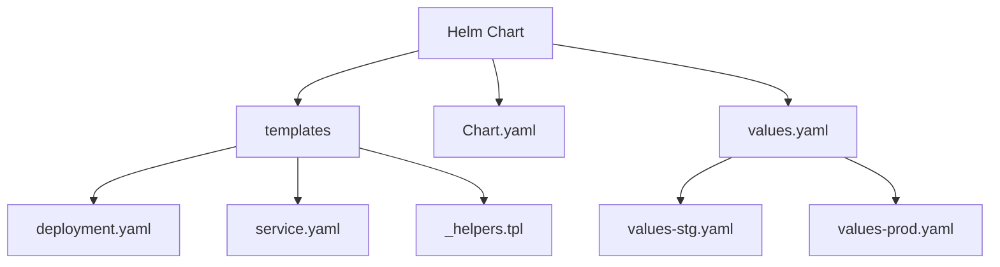
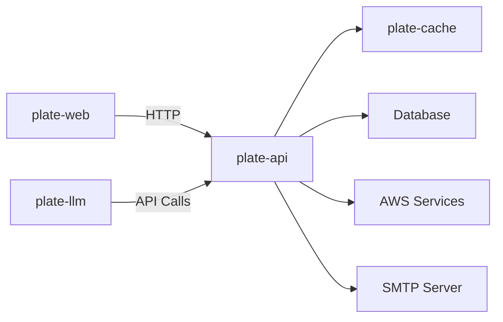
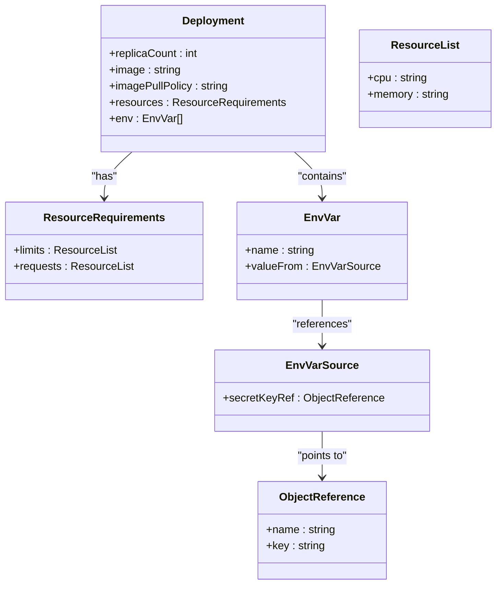
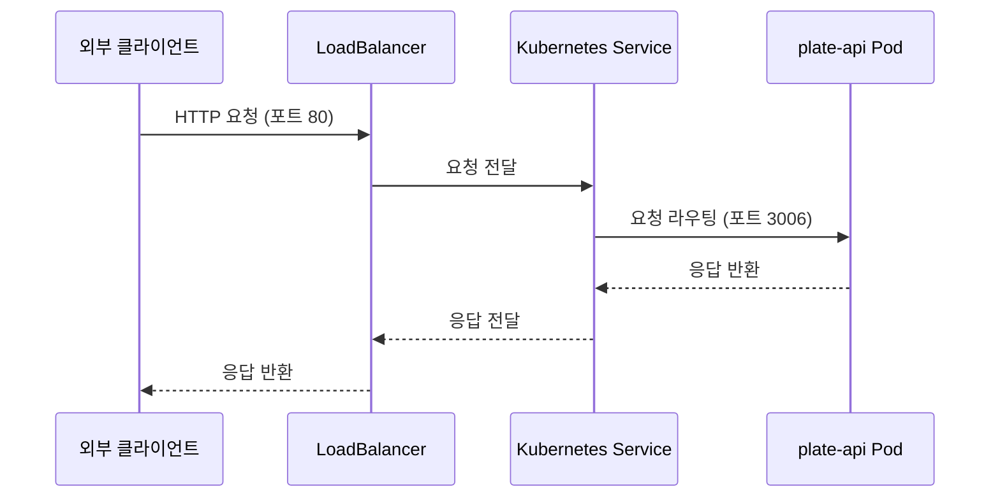
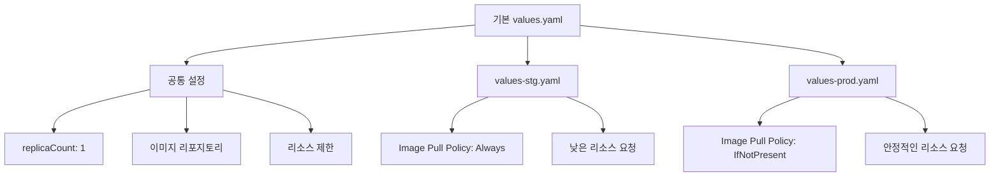
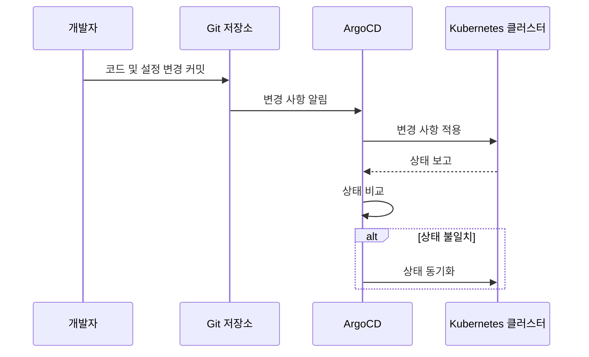
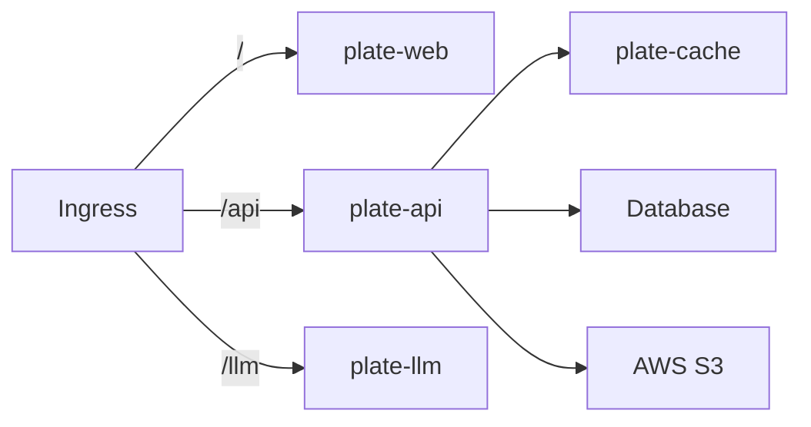
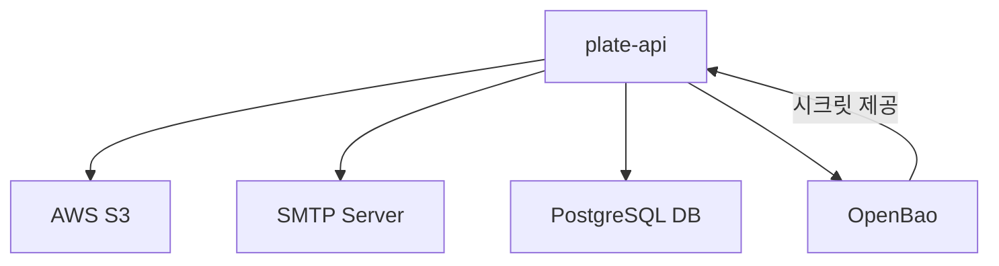
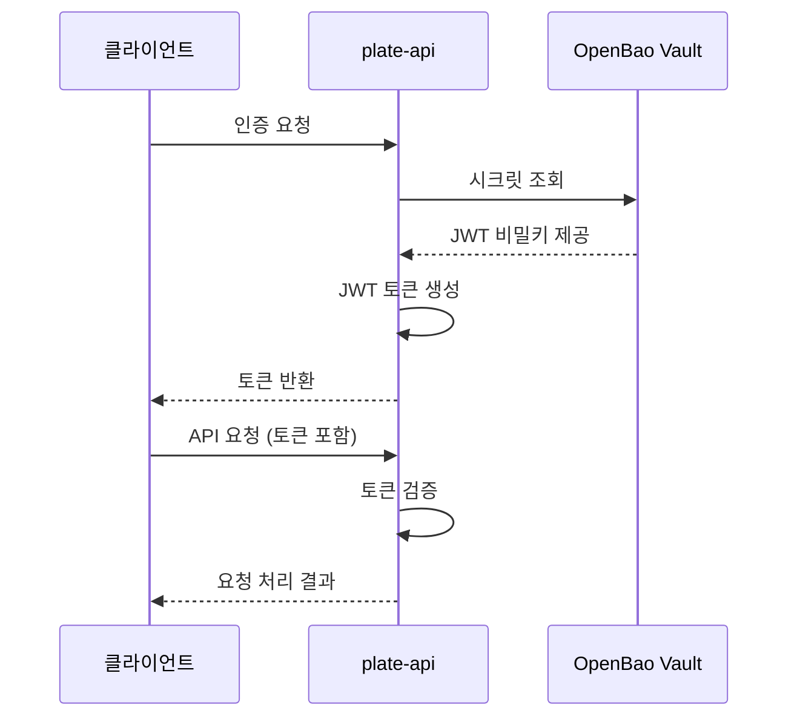

# plate-api 애플리케이션

<cite>
**이 문서에서 참조한 파일**
- [Chart.yaml](file://helm/applications/plate-api/Chart.yaml)
- [values.yaml](file://helm/applications/plate-api/values.yaml)
- [values-stg.yaml](file://helm/applications/plate-api/values-stg.yaml)
- [values-prod.yaml](file://helm/applications/plate-api/values-prod.yaml)
- [deployment.yaml](file://helm/applications/plate-api/templates/deployment.yaml)
- [service.yaml](file://helm/applications/plate-api/templates/service.yaml)
- [plate-api-stg.yaml](file://environments/argocd/apps/plate-api-stg.yaml)
- [plate-api-prod.yaml](file://environments/argocd/apps/plate-api-prod.yaml)
- [create-secrets.sh](file://scripts/openbao/create-secrets.sh)
- [esc-policy.hcl](file://scripts/openbao/policies/esc-policy.hcl)
</cite>

## 목차
1. [소개](#소개)
2. [프로젝트 구조](#프로젝트-구조)
3. [핵심 구성 요소](#핵심-구성-요소)
4. [아키텍처 개요](#아키텍처-개요)
5. [상세 구성 분석](#상세-구성-분석)
6. [환경별 구성 관리](#환경별-구성-관리)
7. [배포 전략](#배포-전략)
8. [내부 노출 및 서비스 통신](#내부-노출-및-서비스-통신)
9. [외부 상호작용 및 연동](#외부-상호작용-및-연동)
10. [보안 및 인증](#보안-및-인증)
11. [성능 최적화 및 장애 대응](#성능-최적화-및-장애-대응)
12. [결론](#결론)

## 소개
plate-api는 Plate 플랫폼의 백엔드 API 서비스로서, 프론트엔드 애플리케이션과 LLM 서비스 간의 핵심 연결 고리 역할을 수행합니다. 이 문서는 plate-api의 Helm 차트 구조, 환경별 구성 관리 방식, 배포 전략, 외부 상호작용 및 보안 전략을 심층적으로 분석합니다.

## 프로젝트 구조
plate-api는 Helm 기반으로 구성된 Kubernetes 애플리케이션으로, 다음과 같은 주요 디렉터리 구조를 가집니다:

```
helm/applications/plate-api/
├── templates/
│   ├── deployment.yaml
│   ├── service.yaml
│   └── _helpers.tpl
├── Chart.yaml
├── values.yaml
├── values-stg.yaml
└── values-prod.yaml
```

Helm 차트는 애플리케이션의 배포를 위한 템플릿과 구성 값을 포함하며, values.yaml 파일을 통해 환경별로 다양한 설정을 적용할 수 있습니다.



**Diagram sources**
- [Chart.yaml](file://helm/applications/plate-api/Chart.yaml)
- [values.yaml](file://helm/applications/plate-api/values.yaml)

**Section sources**
- [Chart.yaml](file://helm/applications/plate-api/Chart.yaml)
- [values.yaml](file://helm/applications/plate-api/values.yaml)

## 핵심 구성 요소
plate-api의 핵심 구성 요소는 다음과 같습니다:

- **Deployment**: 애플리케이션의 배포 및 스케일링을 관리
- **Service**: 내부 네트워크를 통한 서비스 노출
- **ConfigMap 및 Secret**: 설정 및 민감 정보 관리
- **Environment Variables**: 애플리케이션 동작 제어

이러한 구성 요소들은 Helm 차트를 통해 일관된 방식으로 관리됩니다.

**Section sources**
- [deployment.yaml](file://helm/applications/plate-api/templates/deployment.yaml)
- [service.yaml](file://helm/applications/plate-api/templates/service.yaml)

## 아키텍처 개요
plate-api는 Kubernetes 클러스터 내에서 실행되는 마이크로서비스 아키텍처의 일환으로, 다음과 같은 구성 요소들과 상호작용합니다:



**Diagram sources**
- [plate-api-stg.yaml](file://environments/argocd/apps/plate-api-stg.yaml)
- [plate-api-prod.yaml](file://environments/argocd/apps/plate-api-prod.yaml)

**Section sources**
- [plate-api-stg.yaml](file://environments/argocd/apps/plate-api-stg.yaml)
- [plate-api-prod.yaml](file://environments/argocd/apps/plate-api-prod.yaml)

## 상세 구성 분석

### Deployment 구성
plate-api의 Deployment 구성은 애플리케이션의 실행 환경을 정의합니다. 주요 설정 항목은 다음과 같습니다:

- **Replica Count**: 1개의 복제본으로 시작
- **Resource Limits**: CPU 500m, 메모리 1Gi
- **Resource Requests**: CPU 250m, 메모리 512Mi
- **Image Repository**: Harbor 레지스트리 사용
- **Image Pull Policy**: 환경에 따라 Always 또는 IfNotPresent



**Diagram sources**
- [deployment.yaml](file://helm/applications/plate-api/templates/deployment.yaml)
- [values.yaml](file://helm/applications/plate-api/values.yaml)

**Section sources**
- [deployment.yaml](file://helm/applications/plate-api/templates/deployment.yaml)
- [values.yaml](file://helm/applications/plate-api/values.yaml)

### Service 구성
plate-api의 Service 구성은 내부 네트워크를 통한 서비스 노출 방식을 정의합니다. 주요 특징은 다음과 같습니다:

- **Service Type**: LoadBalancer
- **External Port**: 80
- **Target Port**: 3006 (컨테이너 내부 포트)
- **Protocol**: TCP



**Diagram sources**
- [service.yaml](file://helm/applications/plate-api/templates/service.yaml)
- [values.yaml](file://helm/applications/plate-api/values.yaml)

**Section sources**
- [service.yaml](file://helm/applications/plate-api/templates/service.yaml)
- [values.yaml](file://helm/applications/plate-api/values.yaml)

## 환경별 구성 관리
plate-api는 values.yaml 파일을 기반으로 환경별로 다양한 설정을 관리합니다. 주요 환경별 차이는 다음과 같습니다:

### 개발/스테이징 환경 (values-stg.yaml)
- **Image Pull Policy**: Always (항상 최신 이미지 가져오기)
- **Resource Requests**: CPU 200m, 메모리 512Mi (다소 낮은 사양)

### 프로덕션 환경 (values-prod.yaml)
- **Image Pull Policy**: IfNotPresent (이미지가 없을 때만 가져오기)
- **Resource Requests**: CPU 250m, 메모리 512Mi (안정적인 운영을 위한 사양)

이러한 환경별 설정은 Helm의 values 파일 오버라이드 기능을 통해 구현되며, 각 환경에 적합한 리소스 할당과 배포 전략을 적용할 수 있습니다.



**Diagram sources**
- [values-stg.yaml](file://helm/applications/plate-api/values-stg.yaml)
- [values-prod.yaml](file://helm/applications/plate-api/values-prod.yaml)
- [values.yaml](file://helm/applications/plate-api/values.yaml)

**Section sources**
- [values-stg.yaml](file://helm/applications/plate-api/values-stg.yaml)
- [values-prod.yaml](file://helm/applications/plate-api/values-prod.yaml)
- [values.yaml](file://helm/applications/plate-api/values.yaml)

## 배포 전략
plate-api는 ArgoCD를 통한 GitOps 기반 배포 전략을 사용합니다. 주요 배포 특징은 다음과 같습니다:

- **자동 동기화**: Git 저장소의 변경 사항을 자동으로 클러스터에 반영
- **자기 치유(Self-healing)**: 클러스터에서 수동 변경 시 Git 상태로 자동 복구
- **네임스페이스 자동 생성**: 필요한 네임스페이스가 없을 경우 자동 생성
- **변경된 리소스만 적용**: 성능 최적화를 위해 변경된 리소스만 적용

ArgoCD Application 구성은 환경별로 별도의 설정 파일을 사용하여 관리됩니다.



**Diagram sources**
- [plate-api-stg.yaml](file://environments/argocd/apps/plate-api-stg.yaml)
- [plate-api-prod.yaml](file://environments/argocd/apps/plate-api-prod.yaml)

**Section sources**
- [plate-api-stg.yaml](file://environments/argocd/apps/plate-api-stg.yaml)
- [plate-api-prod.yaml](file://environments/argocd/apps/plate-api-prod.yaml)

## 내부 노출 및 서비스 통신
plate-api는 내부 네트워크를 통해 다른 서비스들과 상호작용합니다. 주요 통신 방식은 다음과 같습니다:

- **plate-web과의 통신**: Ingress를 통해 HTTP 요청 처리
- **plate-llm과의 통신**: 내부 API 호출
- **plate-cache와의 연동**: 캐시 데이터 접근
- **데이터베이스 연결**: 외부 데이터베이스에 대한 연결

Ingress 구성은 특정 경로를 기반으로 요청을 적절한 서비스로 라우팅합니다.



**Diagram sources**
- [ingress/values-stg.yaml](file://helm/ingress/values-stg.yaml)
- [service.yaml](file://helm/applications/plate-api/templates/service.yaml)

**Section sources**
- [ingress/values-stg.yaml](file://helm/ingress/values-stg.yaml)
- [service.yaml](file://helm/applications/plate-api/templates/service.yaml)

## 외부 상호작용 및 연동
plate-api는 다양한 외부 서비스와 연동하여 기능을 확장합니다. 주요 연동 서비스는 다음과 같습니다:

### AWS 서비스
- **S3 버킷**: 파일 저장 및 접근
- **Region**: ap-northeast-2 (서울 리전)

### SMTP 서버
- **호스트**: smtp.gmail.com
- **포트**: 587
- **보안**: TLS 사용

### 데이터베이스
- **연결 정보**: 외부 PostgreSQL 데이터베이스
- **환경 변수를 통한 주입**: DATABASE_URL, DIRECT_URL

이러한 외부 서비스와의 연동은 환경 변수를 통해 구성되며, 민감 정보는 OpenBao를 통해 안전하게 관리됩니다.



**Diagram sources**
- [values.yaml](file://helm/applications/plate-api/values.yaml)
- [create-secrets.sh](file://scripts/openbao/create-secrets.sh)

**Section sources**
- [values.yaml](file://helm/applications/plate-api/values.yaml)
- [create-secrets.sh](file://scripts/openbao/create-secrets.sh)

## 보안 및 인증
plate-api는 다양한 보안 메커니즘을 통해 안전한 운영을 보장합니다.

### 인증 및 인가
- **JWT 기반 인증**: AUTH_JWT_SECRET 키를 사용한 토큰 생성
- **토큰 만료 시간**: 3600초 (1시간)
- **토큰 갱신 시간**: 86400초 (24시간)
- **비밀번호 해시 라운드**: 10

### 민감 정보 관리
- **OpenBao 활용**: 모든 민감 정보를 OpenBao Vault에 저장
- **Secrets Injection**: Kubernetes Secret을 통해 환경 변수로 주입
- **정책 기반 접근 제어**: esc-policy.hcl을 통한 세밀한 접근 권한 관리

### CORS 설정
- **CORS 활성화**: 외부 도메인에서의 API 접근 허용
- **허용 도메인**: FRONTEND_DOMAIN 환경 변수로 정의



**Diagram sources**
- [values.yaml](file://helm/applications/plate-api/values.yaml)
- [create-secrets.sh](file://scripts/openbao/create-secrets.sh)
- [esc-policy.hcl](file://scripts/openbao/policies/esc-policy.hcl)

**Section sources**
- [values.yaml](file://helm/applications/plate-api/values.yaml)
- [create-secrets.sh](file://scripts/openbao/create-secrets.sh)
- [esc-policy.hcl](file://scripts/openbao/policies/esc-policy.hcl)

## 성능 최적화 및 장애 대응
plate-api는 안정적인 서비스 제공을 위해 다양한 성능 최적화 및 장애 대응 전략을 적용합니다.

### 리소스 관리
- **리소스 제한 설정**: CPU 및 메모리 사용량 제한
- **리소스 요청 설정**: 최소한의 리소스 보장
- **스케일링 전략**: 필요 시 수동 또는 자동 스케일링

### 장애 대응
- **자동 재시도 정책**: 배포 실패 시 최대 5회 재시도 (스테이징), 3회 재시도 (프로덕션)
- **백오프 전략**: 지수 백오프 (5s → 10s → 20s → ...)
- **최대 대기 시간**: 3분

### 모니터링 및 로깅
- **헬스 체크 엔드포인트**: 시스템 상태 확인
- **로그 수집**: Fluentd를 통한 중앙 집중식 로그 관리
- **메트릭 수집**: Prometheus를 통한 성능 모니터링

```mermaid
flowchart TD
A[장애 발생] --> B[자동 재시도]
B --> C{재시도 성공?}
C --> |예| D[정상 복구]
C --> |아니오| E[최대 재시도 횟수 도달?]
E --> |예| F[알림 전송]
E --> |아니오| G[다음 재시도 (백오프 적용)]
G --> B
```

**Diagram sources**
- [plate-api-stg.yaml](file://environments/argocd/apps/plate-api-stg.yaml)
- [plate-api-prod.yaml](file://environments/argocd/apps/plate-api-prod.yaml)

**Section sources**
- [plate-api-stg.yaml](file://environments/argocd/apps/plate-api-stg.yaml)
- [plate-api-prod.yaml](file://environments/argocd/apps/plate-api-prod.yaml)

## 결론
plate-api는 Helm 차트를 기반으로 한 현대적인 Kubernetes 애플리케이션으로, 환경별 구성 관리, 안정적인 배포 전략, 안전한 보안 구조를 갖추고 있습니다. GitOps 기반의 ArgoCD 배포 전략과 OpenBao를 활용한 민감 정보 관리는 시스템의 안정성과 보안을 동시에 확보하는 데 기여합니다. 다양한 외부 서비스와의 연동과 RESTful API 설계는 플랫폼의 확장성을 보장하며, 체계적인 성능 최적화 및 장애 대응 전략은 서비스의 신뢰성을 높입니다.

plate-api는 단순한 백엔드 API 서비스를 넘어, 전체 Plate 플랫폼의 핵심 인프라로서의 역할을 충실히 수행하고 있습니다.