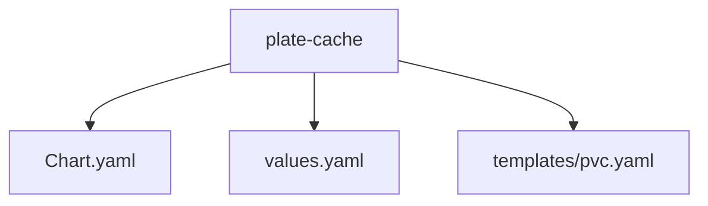
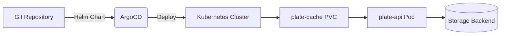
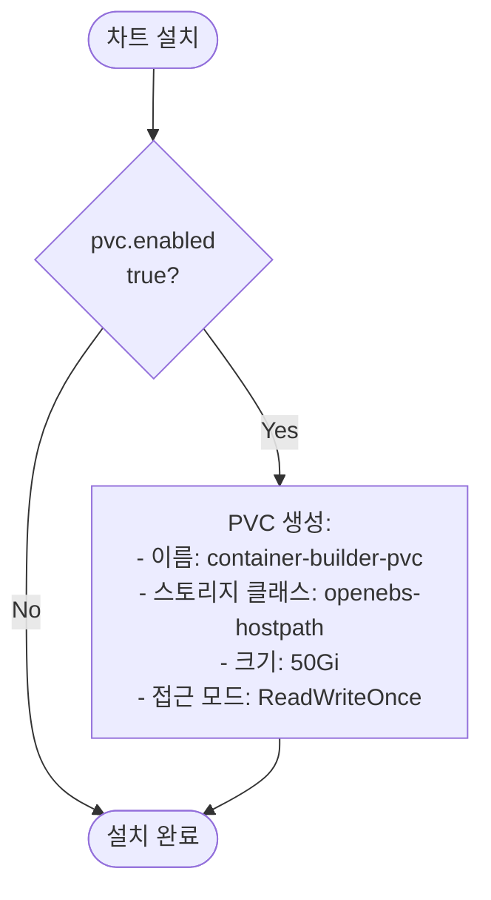
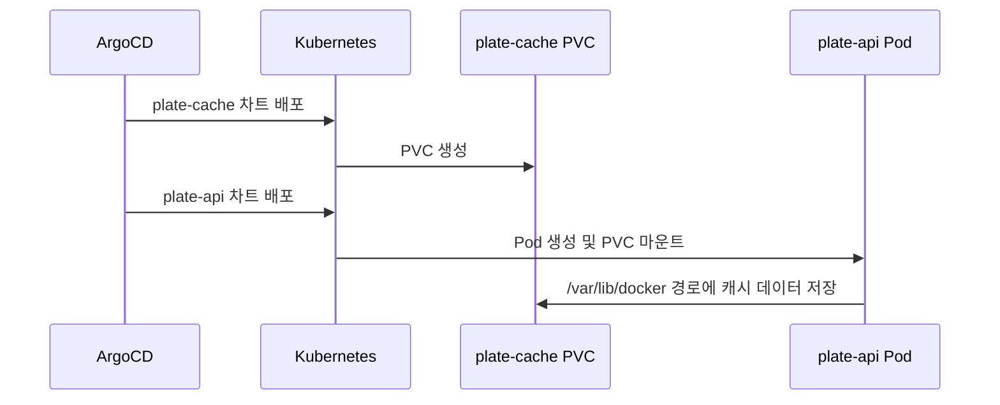
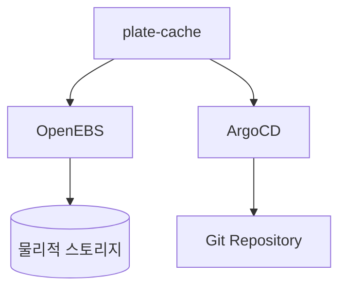

# plate-cache 애플리케이션

<cite>
**이 문서에서 참조한 파일**  
- [Chart.yaml](file://helm/applications/plate-cache/Chart.yaml)
- [values.yaml](file://helm/applications/plate-cache/values.yaml)
- [templates/pvc.yaml](file://helm/applications/plate-cache/templates/pvc.yaml)
- [plate-api/Chart.yaml](file://helm/applications/plate-server/Chart.yaml)
- [plate-api/values.yaml](file://helm/applications/plate-server/values.yaml)
- [plate-api/values-stg.yaml](file://helm/applications/plate-server/values-stg.yaml)
- [plate-api/values-prod.yaml](file://helm/applications/plate-server/values-prod.yaml)
- [plate-api/templates/deployment.yaml](file://helm/applications/plate-server/templates/deployment.yaml)
- [environments/argocd/apps/plate-api-prod.yaml](file://environments/argocd/apps/plate-api-prod.yaml)
- [environments/argocd/apps/plate-api-stg.yaml](file://environments/argocd/apps/plate-api-stg.yaml)
</cite>

## 목차
1. [소개](#소개)
2. [프로젝트 구조](#프로젝트-구조)
3. [핵심 구성 요소](#핵심-구성-요소)
4. [아키텍처 개요](#아키텍처-개요)
5. [상세 구성 요소 분석](#상세-구성-요소-분석)
6. [의존성 분석](#의존성-분석)
7. [성능 고려사항](#성능-고려사항)
8. [문제 해결 가이드](#문제-해결-가이드)
9. [결론](#결론)

## 소개
plate-cache 애플리케이션은 Plate 플랫폼의 컨테이너 빌드 캐시를 위한 영구 스토리지 솔루션을 제공하는 Helm 차트입니다. 이 문서는 plate-cache의 역할, 기능, 구성 관리 방식, plate-api와의 연동, 스토리지 지속성 보장 전략, 백업 및 복구 전략, 성능 최적화 전략을 심층적으로 분석합니다.

## 프로젝트 구조
plate-cache는 Helm 기반의 애플리케이션으로, `helm/applications/plate-cache/` 디렉터리에 위치합니다. 주요 구성 요소는 다음과 같습니다:
- `Chart.yaml`: 차트의 메타데이터와 설명을 포함
- `values.yaml`: 기본 구성 값 정의
- `templates/pvc.yaml`: PersistentVolumeClaim(PVC) 리소스 템플릿



**Diagram sources**
- [Chart.yaml](file://helm/applications/plate-cache/Chart.yaml)
- [values.yaml](file://helm/applications/plate-cache/values.yaml)
- [templates/pvc.yaml](file://helm/applications/plate-cache/templates/pvc.yaml)

**Section sources**
- [Chart.yaml](file://helm/applications/plate-cache/Chart.yaml#L1-L15)
- [values.yaml](file://helm/applications/plate-cache/values.yaml#L1-L14)
- [templates/pvc.yaml](file://helm/applications/plate-cache/templates/pvc.yaml#L1-L25)

## 핵심 구성 요소

plate-cache의 핵심 구성 요소는 PVC(PersistentVolumeClaim)를 통한 영구 스토리지 제공입니다. 이는 컨테이너 빌드 과정에서 생성되는 캐시 데이터를 영구적으로 저장하여, 빌드 성능을 향상시키고 리소스 사용을 최적화합니다.

**Section sources**
- [values.yaml](file://helm/applications/plate-cache/values.yaml#L4-L13)
- [templates/pvc.yaml](file://helm/applications/plate-cache/templates/pvc.yaml#L1-L25)

## 아키텍처 개요

plate-cache는 Kubernetes 클러스터 내에서 PVC를 생성하여, plate-api와 같은 애플리케이션에 영구 스토리지를 제공합니다. 이 아키텍처는 GitOps 방식으로 관리되며, ArgoCD를 통해 자동 동기화됩니다.



**Diagram sources**
- [Chart.yaml](file://helm/applications/plate-cache/Chart.yaml#L1-L15)
- [values.yaml](file://helm/applications/plate-cache/values.yaml#L4-L13)
- [templates/pvc.yaml](file://helm/applications/plate-cache/templates/pvc.yaml#L1-L25)

## 상세 구성 요소 분석

### plate-cache Helm 차트 분석

plate-cache Helm 차트는 PVC 리소스를 생성하는 데 초점을 맞추고 있습니다. `values.yaml` 파일을 통해 PVC의 이름, 스토리지 클래스, 접근 모드, 크기 등을 구성할 수 있습니다.

#### 구성 매개변수
```yaml
pvc:
  enabled: true
  name: container-builder-pvc
  storageClass: "openebs-hostpath"
  accessModes:
    - ReadWriteOnce
  size: 50Gi
  mountPath: /var/lib/docker
```

**Diagram sources**
- [values.yaml](file://helm/applications/plate-cache/values.yaml#L4-L13)

#### PVC 템플릿
PVC 템플릿은 `.Values.pvc` 설정을 기반으로 PVC 리소스를 동적으로 생성합니다. `.Values.pvc.enabled`가 true일 경우에만 PVC가 생성됩니다.



**Diagram sources**
- [templates/pvc.yaml](file://helm/applications/plate-cache/templates/pvc.yaml#L1-L25)

**Section sources**
- [values.yaml](file://helm/applications/plate-cache/values.yaml#L4-L13)
- [templates/pvc.yaml](file://helm/applications/plate-cache/templates/pvc.yaml#L1-L25)

### plate-api와의 연동 분석

plate-api는 plate-cache에서 제공하는 PVC를 마운트하여, 컨테이너 빌드 캐시를 저장합니다. 이 연동은 plate-api의 Deployment 구성에서 volume 및 volumeMount를 통해 이루어집니다.

#### 연동 방식


**Diagram sources**
- [plate-api/templates/deployment.yaml](file://helm/applications/plate-server/templates/deployment.yaml#L1-L45)
- [values.yaml](file://helm/applications/plate-cache/values.yaml#L13)

**Section sources**
- [plate-api/templates/deployment.yaml](file://helm/applications/plate-server/templates/deployment.yaml#L1-L45)
- [values.yaml](file://helm/applications/plate-cache/values.yaml#L13)

## 의존성 분석

plate-cache는 OpenEBS와 같은 스토리지 프로비저너에 의존하여, PVC에 대한 실제 스토리지 볼륨을 프로비저닝합니다. 또한, ArgoCD에 의존하여 GitOps 방식으로 배포 및 관리됩니다.



**Diagram sources**
- [Chart.yaml](file://helm/applications/plate-cache/Chart.yaml#L1-L15)
- [values.yaml](file://helm/applications/plate-cache/values.yaml#L7)
- [environments/argocd/apps/plate-api-prod.yaml](file://environments/argocd/apps/plate-api-prod.yaml#L1-L62)

**Section sources**
- [values.yaml](file://helm/applications/plate-cache/values.yaml#L7)
- [environments/argocd/apps/plate-api-prod.yaml](file://environments/argocd/apps/plate-api-prod.yaml#L1-L62)

## 성능 고려사항

plate-cache의 성능은 스토리지 클래스 선택, 접근 모드 설정, 리소스 제한 전략에 크게 영향을 받습니다.

### 스토리지 클래스 선택
`openebs-hostpath` 스토리지 클래스는 노드 로컬 스토리지를 사용하므로, 낮은 지연 시간과 높은 IOPS를 제공합니다. 이는 빌드 캐시와 같은 I/O 집약적 작업에 적합합니다.

### 접근 모드 설정
`ReadWriteOnce` 접근 모드는 단일 노드에서의 읽기/쓰기만을 허용하므로, 빌드 작업이 단일 노드에서 수행되는 경우에 최적화됩니다.

### 리소스 제한 전략
PVC 크기를 50Gi로 설정함으로써, 빌드 캐시가 과도하게 증가하는 것을 방지하고, 스토리지 리소스를 효율적으로 관리할 수 있습니다.

**Section sources**
- [values.yaml](file://helm/applications/plate-cache/values.yaml#L7-L10)

## 문제 해결 가이드

### PVC 생성 실패
PVC 생성이 실패하는 경우, 다음 사항을 확인하세요:
- 스토리지 클래스 이름이 정확한지 확인
- 충분한 클러스터 리소스가 있는지 확인
- 노드에 마운트 경로(`/var/lib/docker`)가 존재하고 접근 가능한지 확인

### 캐시 데이터 손실
캐시 데이터가 예기치 않게 손실되는 경우, 다음 사항을 점검하세요:
- PVC가 정상적으로 연결되었는지 확인
- 스토리지 백엔드의 상태를 확인
- 노드 장애 시 볼륨 재연결 정책을 검토

**Section sources**
- [values.yaml](file://helm/applications/plate-cache/values.yaml#L6-L13)
- [templates/pvc.yaml](file://helm/applications/plate-cache/templates/pvc.yaml#L1-L25)

## 결론

plate-cache 애플리케이션은 Plate 플랫폼의 빌드 성능을 극대화하기 위한 핵심 인프라 컴포넌트입니다. Helm 차트를 통해 PVC를 선언적으로 관리하고, GitOps 방식으로 배포함으로써, 일관성 있고 신뢰할 수 있는 스토리지 환경을 제공합니다. 적절한 스토리지 클래스와 접근 모드 선택을 통해 성능을 최적화하고, 명확한 구성 관리 전략을 통해 운영의 투명성을 보장합니다.