# plate-llm 애플리케이션

<cite>
**이 문서에서 참조한 파일**  
- [Chart.yaml](file://helm/applications/plate-llm/Chart.yaml)
- [values.yaml](file://helm/applications/plate-llm/values.yaml)
- [values-stg.yaml](file://helm/applications/plate-llm/values-stg.yaml)
- [templates/deployment.yaml](file://helm/applications/plate-llm/templates/deployment.yaml)
- [templates/service.yaml](file://helm/applications/plate-llm/templates/service.yaml)
- [templates/serviceaccount.yaml](file://helm/applications/plate-llm/templates/serviceaccount.yaml)
- [templates/_helpers.tpl](file://helm/applications/plate-llm/templates/_helpers.tpl)
- [environments/argocd/apps/plate-llm-stg.yaml](file://environments/argocd/apps/plate-llm-stg.yaml)
- [helm/shared-configs/openbao-secrets-manager/values.yaml](file://helm/shared-configs/openbao-secrets-manager/values.yaml)
- [helm/applications/plate-server/values.yaml](file://helm/applications/plate-server/values.yaml)
- [helm/applications/plate-server/values-stg.yaml](file://helm/applications/plate-server/values-stg.yaml)
</cite>

## 목차
1. [소개](#소개)
2. [프로젝트 구조](#프로젝트-구조)
3. [핵심 구성 요소](#핵심-구성-요소)
4. [아키텍처 개요](#아키텍처-개요)
5. [상세 구성 분석](#상세-구성-분석)
6. [배포 전략](#배포-전략)
7. [외부 연동 및 통합](#외부-연동-및-통합)
8. [보안 및 인증](#보안-및-인증)
9. [모니터링 및 트래픽 제어](#모니터링-및-트래픽-제어)
10. [성능 및 확장성 고려사항](#성능-및-확장성-고려사항)

## 소개
plate-llm 애플리케이션은 LangChain 기반의 LLM 서비스로, Kubernetes 환경에서 Helm 차트를 통해 배포되고 관리됩니다. 이 문서는 plate-llm의 Helm 차트 구조, 구성 관리 방식, 배포 전략, 서비스 노출 방식, 외부 LLM 프로바이더와의 연동, 보안 설정, 인증 처리, 트래픽 제어 및 모니터링 전략을 심층적으로 분석합니다.

## 프로젝트 구조
plate-llm 애플리케이션은 Helm 차트 기반으로 구성되어 있으며, 주요 구성 요소는 다음과 같습니다:

- **Chart.yaml**: 차트의 메타데이터와 버전 정보를 포함
- **values.yaml**: 기본 구성 값 정의
- **values-stg.yaml**: 스테이징 환경 전용 구성 값
- **templates/**: Kubernetes 리소스 템플릿 디렉터리
  - deployment.yaml: 애플리케이션 배포 정의
  - service.yaml: 내부 서비스 노출 정의
  - serviceaccount.yaml: 서비스 어카운트 정의
  - _helpers.tpl: 템플릿 헬퍼 함수 정의
- **environments/argocd/apps/plate-llm-stg.yaml**: ArgoCD를 통한 스테이징 환경 배포 정의

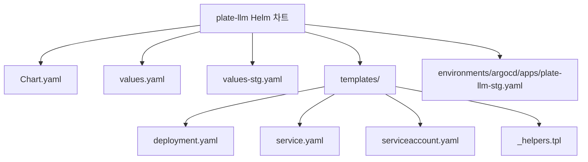

**다이어그램 출처**
- [Chart.yaml](file://helm/applications/plate-llm/Chart.yaml)
- [values.yaml](file://helm/applications/plate-llm/values.yaml)
- [values-stg.yaml](file://helm/applications/plate-llm/values-stg.yaml)
- [templates/deployment.yaml](file://helm/applications/plate-llm/templates/deployment.yaml)
- [templates/service.yaml](file://helm/applications/plate-llm/templates/service.yaml)
- [templates/serviceaccount.yaml](file://helm/applications/plate-llm/templates/serviceaccount.yaml)
- [environments/argocd/apps/plate-llm-stg.yaml](file://environments/argocd/apps/plate-llm-stg.yaml)

**섹션 출처**
- [Chart.yaml](file://helm/applications/plate-llm/Chart.yaml)
- [values.yaml](file://helm/applications/plate-llm/values.yaml)
- [values-stg.yaml](file://helm/applications/plate-llm/values-stg.yaml)
- [templates/deployment.yaml](file://helm/applications/plate-llm/templates/deployment.yaml)
- [templates/service.yaml](file://helm/applications/plate-llm/templates/service.yaml)
- [templates/serviceaccount.yaml](file://helm/applications/plate-llm/templates/serviceaccount.yaml)
- [environments/argocd/apps/plate-llm-stg.yaml](file://environments/argocd/apps/plate-llm-stg.yaml)

## 핵심 구성 요소
plate-llm 애플리케이션의 핵심 구성 요소는 Helm 차트 기반의 선언적 구성으로 관리되며, 각 구성 요소는 다음과 같은 역할을 수행합니다.

**섹션 출처**
- [Chart.yaml](file://helm/applications/plate-llm/Chart.yaml)
- [values.yaml](file://helm/applications/plate-llm/values.yaml)
- [values-stg.yaml](file://helm/applications/plate-llm/values-stg.yaml)

## 아키텍처 개요
plate-llm 애플리케이션은 Kubernetes 클러스터 내에서 Helm 차트를 통해 배포되며, ArgoCD를 통해 GitOps 방식으로 관리됩니다. 애플리케이션은 외부 LLM 프로바이더와 연동하여 AI 기반 서비스를 제공하며, OpenBao를 통해 민감한 구성 정보를 안전하게 관리합니다.

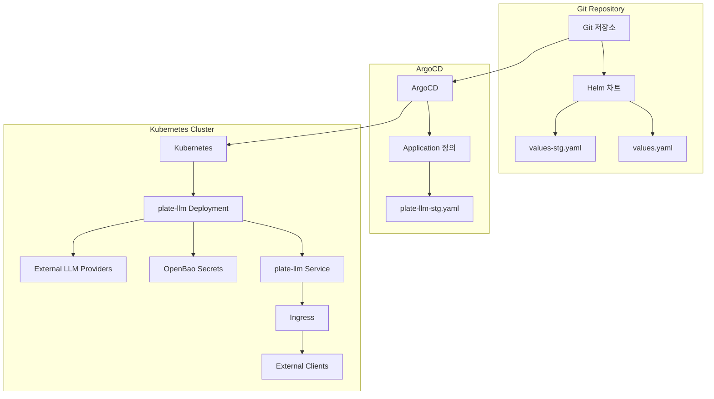

**다이어그램 출처**
- [environments/argocd/apps/plate-llm-stg.yaml](file://environments/argocd/apps/plate-llm-stg.yaml)
- [templates/deployment.yaml](file://helm/applications/plate-llm/templates/deployment.yaml)
- [templates/service.yaml](file://helm/applications/plate-llm/templates/service.yaml)

## 상세 구성 분석
plate-llm 애플리케이션의 각 구성 요소는 Helm 템플릿을 통해 Kubernetes 리소스로 변환되며, values.yaml 파일을 통해 환경별로 구성이 오버라이드됩니다.

### Helm 차트 구성
plate-llm Helm 차트는 Chart.yaml 파일을 통해 정의되며, 애플리케이션의 메타데이터, 버전 정보, 유지 관리자 정보를 포함합니다. 차트는 LangChain 기반 LLM 서비스를 위한 애플리케이션 타입으로 정의되어 있습니다.

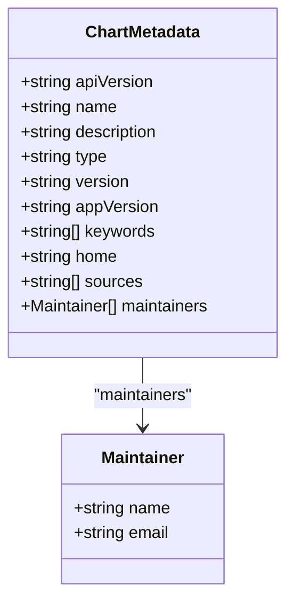

**다이어그램 출처**
- [Chart.yaml](file://helm/applications/plate-llm/Chart.yaml)

**섹션 출처**
- [Chart.yaml](file://helm/applications/plate-llm/Chart.yaml)

### values.yaml 구성 분석
values.yaml 파일은 plate-llm 애플리케이션의 기본 구성 값을 정의하며, 환경별로 오버라이드될 수 있습니다. 주요 구성 항목은 다음과 같습니다:

- **replicaCount**: 기본 복제본 수 (1)
- **image**: Harbor 레지스트리에 저장된 LLM 서버 이미지 정보
- **port**: LangChain 서버 리스닝 포트 (8000)
- **appSecrets**: 민감한 환경 변수를 Secret으로부터 주입하는 설정
- **imagePullSecrets**: Harbor 레지스트리 인증을 위한 비밀번호
- **service**: Kubernetes Service 구성 (ClusterIP)
- **resources**: 리소스 제한 및 요청 (CPU 1000m, 메모리 2Gi)

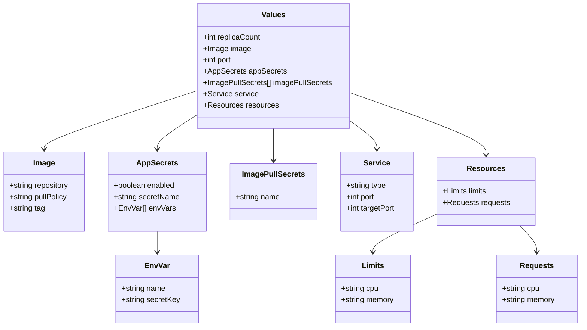

**다이어그램 출처**
- [values.yaml](file://helm/applications/plate-llm/values.yaml)

**섹션 출처**
- [values.yaml](file://helm/applications/plate-llm/values.yaml)

### 스테이징 환경 전용 구성
values-stg.yaml 파일은 스테이징 환경 전용 구성 값을 정의하며, 기본 values.yaml의 값을 오버라이드합니다. 주요 차이점은 다음과 같습니다:

- **image.pullPolicy**: Always로 설정되어 최신 빌드를 항상 가져옴
- **ingress**: 활성화되어 외부 접근이 가능하도록 구성
- **appSecrets.secretName**: cluster-env-secrets로 설정되어 클러스터 레벨 시크릿 사용
- **appSecrets.envVars**: OPENAI_API_KEY, LLM_ENVIRONMENT 등 LLM 관련 환경 변수 포함

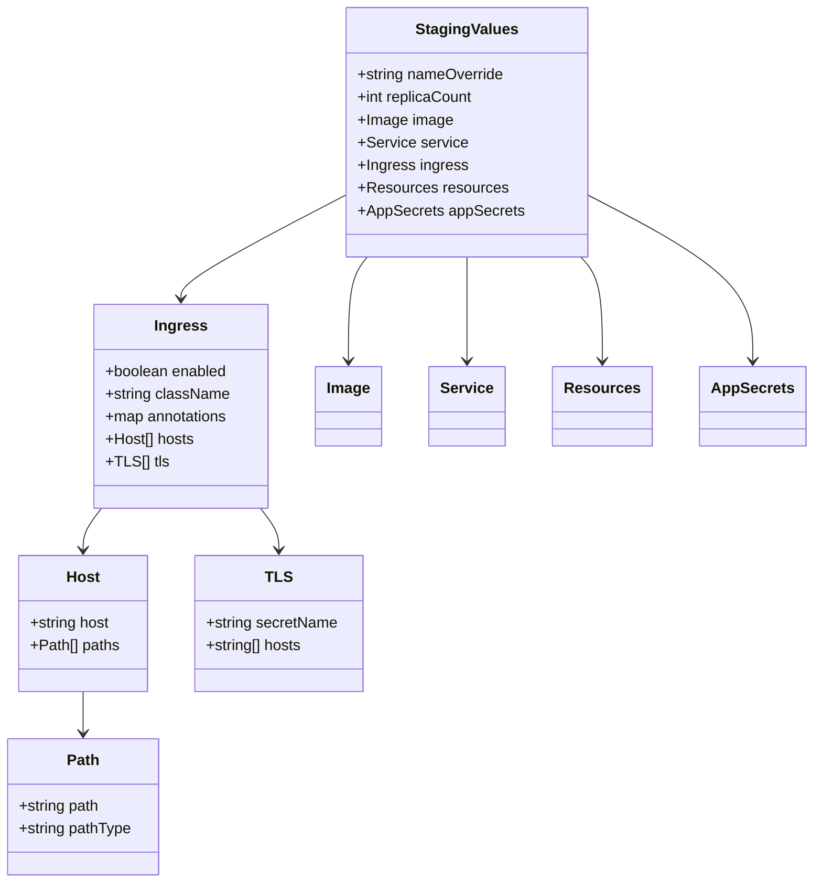

**다이어그램 출처**
- [values-stg.yaml](file://helm/applications/plate-llm/values-stg.yaml)

**섹션 출처**
- [values-stg.yaml](file://helm/applications/plate-llm/values-stg.yaml)

## 배포 전략
plate-llm 애플리케이션은 ArgoCD를 통해 GitOps 방식으로 배포되며, environments/argocd/apps/plate-llm-stg.yaml 파일을 통해 스테이징 환경의 배포 정책이 정의됩니다.

### ArgoCD Application 정의
ArgoCD Application 리소스는 Git 저장소에 있는 Helm 차트를 Kubernetes 클러스터에 배포하는 방법을 정의합니다. 주요 구성 요소는 다음과 같습니다:

- **source**: Helm 차트의 위치 (helm/applications/plate-llm) 및 values-stg.yaml 파일 참조
- **destination**: 배포 대상 클러스터 및 네임스페이스 (plate-stg)
- **syncPolicy**: 자동 동기화 정책 (prune, selfHeal 활성화)
- **syncOptions**: CreateNamespace=true로 설정되어 네임스페이스가 없을 경우 자동 생성
- **retry**: 동기화 실패 시 재시도 정책 정의

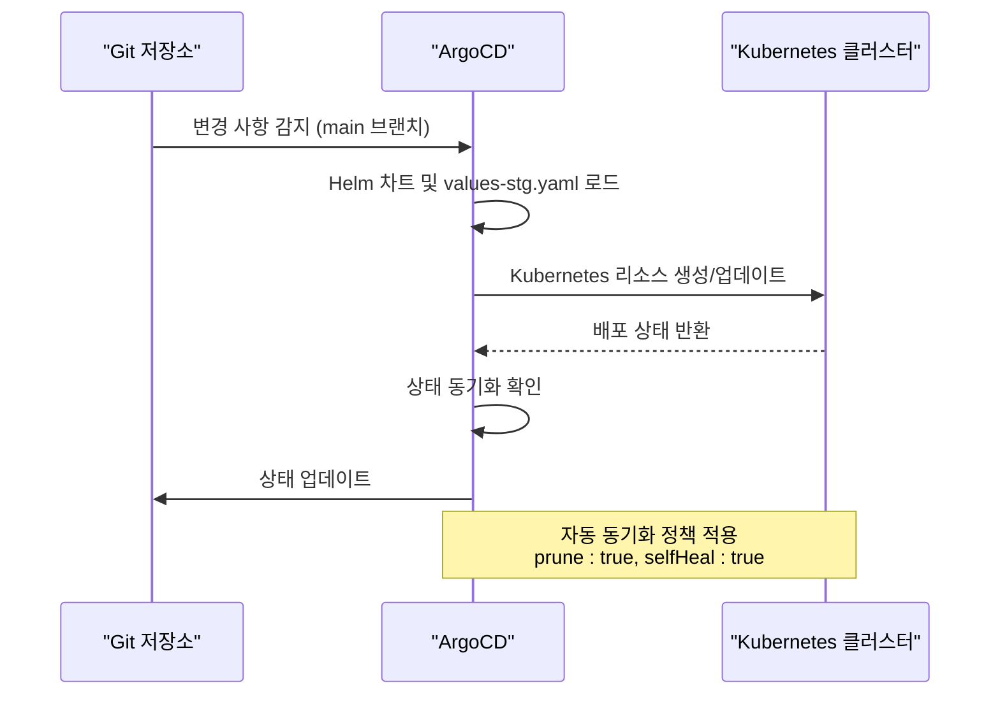

**다이어그램 출처**
- [environments/argocd/apps/plate-llm-stg.yaml](file://environments/argocd/apps/plate-llm-stg.yaml)

**섹션 출처**
- [environments/argocd/apps/plate-llm-stg.yaml](file://environments/argocd/apps/plate-llm-stg.yaml)

### Deployment 구성
Deployment 템플릿은 plate-llm 애플리케이션의 Pod를 관리하는 방법을 정의합니다. 주요 특징은 다음과 같습니다:

- **replicas**: values.yaml의 replicaCount 값에 따라 복제본 수 결정
- **serviceAccountName**: 템플릿 헬퍼 함수를 통해 동적으로 생성된 서비스 어카운트 이름 사용
- **imagePullSecrets**: Harbor 레지스트리 인증을 위한 비밀번호 참조
- **containers**: LLM 서버 컨테이너 정의, 환경 변수는 Secret에서 주입
- **resources**: CPU 및 메모리 리소스 제한 및 요청 정의

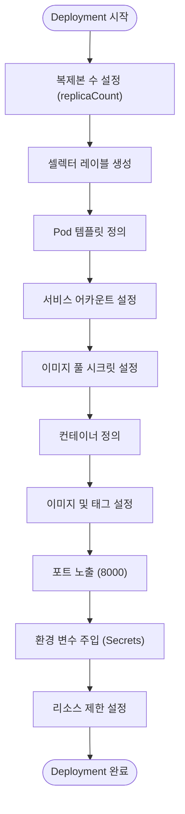

**다이어그램 출처**
- [templates/deployment.yaml](file://helm/applications/plate-llm/templates/deployment.yaml)

**섹션 출처**
- [templates/deployment.yaml](file://helm/applications/plate-llm/templates/deployment.yaml)

### Service 및 Ingress 구성
Service 템플릿은 plate-llm 애플리케이션의 내부 노출을 정의하며, Ingress 구성은 외부 접근을 가능하게 합니다.

- **Service**: ClusterIP 타입으로 내부 클러스터에서만 접근 가능
- **Ingress**: Nginx Ingress 컨트롤러를 통해 외부 도메인(llm.cocdev.co.kr)으로 접근 가능
- **TLS**: cert-manager를 통해 Let's Encrypt 인증서 자동 발급

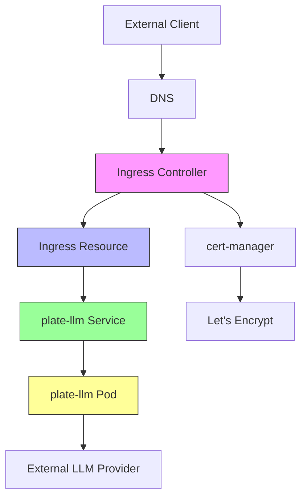

**다이어그램 출처**
- [templates/service.yaml](file://helm/applications/plate-llm/templates/service.yaml)
- [values-stg.yaml](file://helm/applications/plate-llm/values-stg.yaml)

**섹션 출처**
- [templates/service.yaml](file://helm/applications/plate-llm/templates/service.yaml)
- [values-stg.yaml](file://helm/applications/plate-llm/values-stg.yaml)

## 외부 연동 및 통합
plate-llm 애플리케이션은 다양한 외부 시스템과 연동하여 기능을 확장합니다.

### plate-api 통합
plate-llm은 plate-api와 긴밀하게 통합되어 있으며, 사용자 인증, 데이터 저장 등의 기능을 공유합니다. 통합은 다음과 같은 방식으로 이루어집니다:

- **환경 변수 공유**: plate-api와 동일한 OpenBao 시크릿 저장소를 사용
- **도메인 통합**: 동일한 cocdev.co.kr 도메인 하에서 운영
- **인증 통합**: GitHub OAuth를 통한 통합 인증

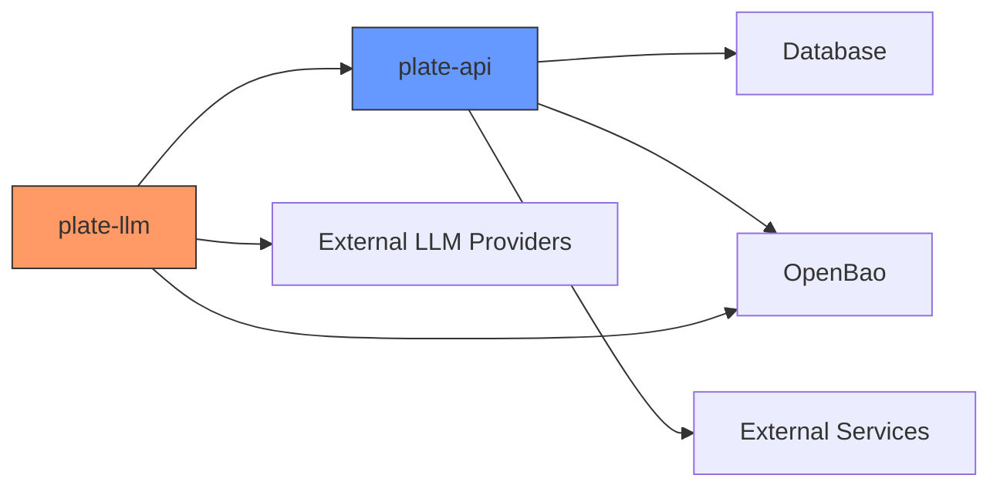

**섹션 출처**
- [helm/applications/plate-server/values.yaml](file://helm/applications/plate-server/values.yaml)
- [helm/applications/plate-server/values-stg.yaml](file://helm/applications/plate-server/values-stg.yaml)

### 외부 LLM 프로바이더 연동
plate-llm 애플리케이션은 다양한 외부 LLM 프로바이더와 연동하여 AI 기능을 제공합니다.

- **OpenAI**: OPENAI_API_KEY를 통해 GPT 모델 접근
- **Anthropic**: ANTHROPIC_API_KEY를 통해 Claude 모델 접근
- **LangChain**: LangChain API를 통해 다양한 LLM 통합 관리

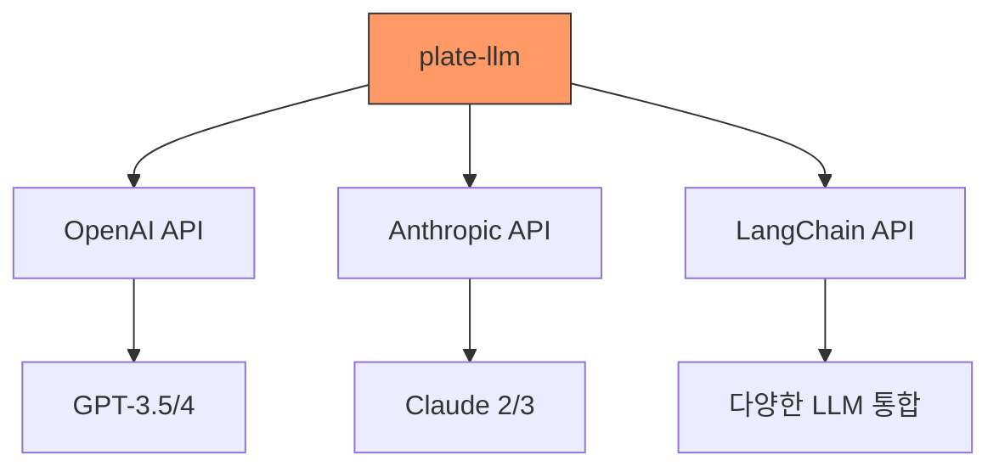

**섹션 출처**
- [values.yaml](file://helm/applications/plate-llm/values.yaml)
- [values-stg.yaml](file://helm/applications/plate-llm/values-stg.yaml)

## 보안 및 인증
plate-llm 애플리케이션은 다양한 보안 및 인증 메커니즘을 통해 안전한 운영을 보장합니다.

### 시크릿 관리
민감한 구성 정보는 OpenBao를 통해 안전하게 관리되며, Kubernetes Secret으로 자동 동기화됩니다.

- **OpenBao**: 중앙 집중식 시크릿 저장소
- **External Secrets**: OpenBao에서 Kubernetes Secret으로 자동 동기화
- **Harbor 인증**: Harbor 레지스트리 접근을 위한 전용 시크릿

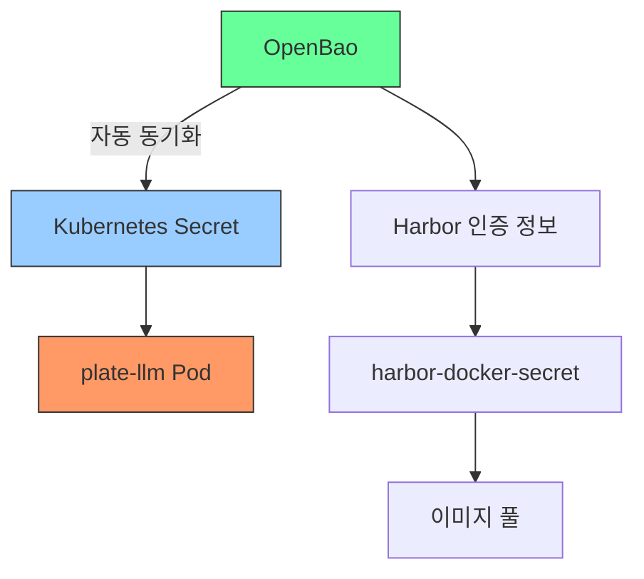

**섹션 출처**
- [helm/shared-configs/openbao-secrets-manager/values.yaml](file://helm/shared-configs/openbao-secrets-manager/values.yaml)

### 인증 처리
사용자 인증은 GitHub OAuth를 통해 처리되며, 관련 정보는 환경 변수를 통해 관리됩니다.

- **GITHUB_CLIENT_ID**: GitHub OAuth 클라이언트 ID
- **GITHUB_CLIENT_SECRET**: GitHub OAuth 클라이언트 비밀번호
- **JWT 토큰**: 사용자 세션 관리를 위한 JWT 기반 인증

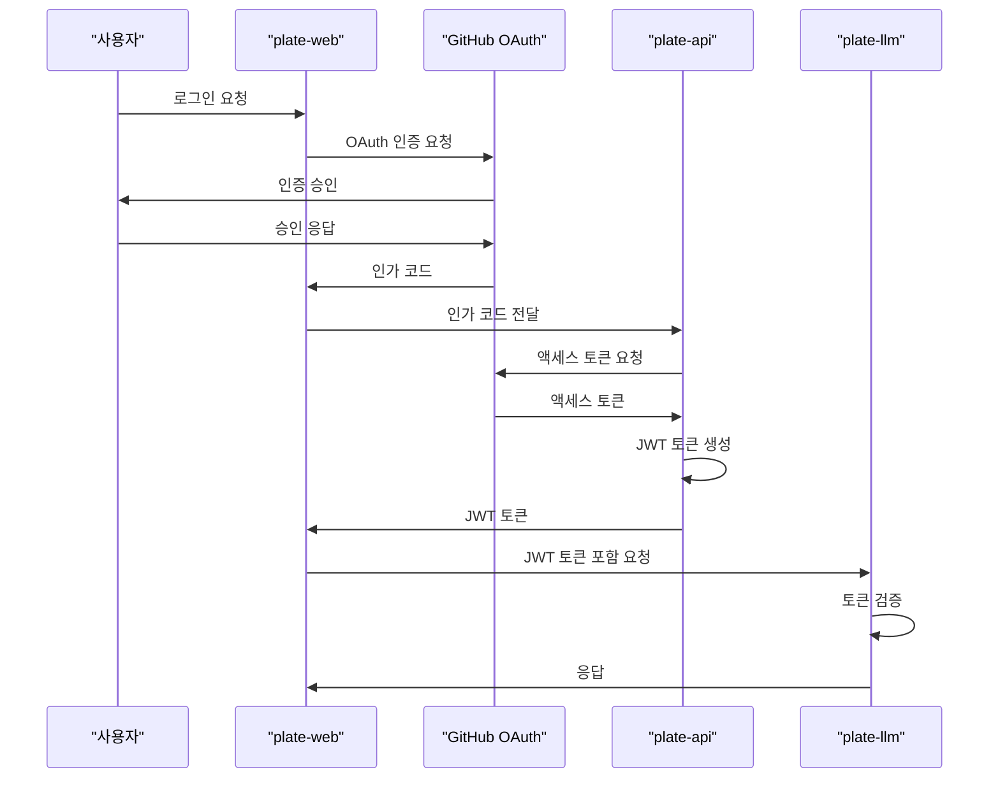

**섹션 출처**
- [values-stg.yaml](file://helm/applications/plate-llm/values-stg.yaml)

## 모니터링 및 트래픽 제어
plate-llm 애플리케이션은 효과적인 모니터링과 트래픽 제어를 위해 다양한 전략을 적용합니다.

### 트래픽 제어
Ingress를 통해 외부 트래픽을 제어하며, 다음과 같은 기능을 제공합니다:

- **SSL 리다이렉션 비활성화**: 특정 클라이언트 호환성 문제 해결
- **HTTP01 인증 도전**: cert-manager를 통한 자동 인증서 갱신
- **도메인 기반 라우팅**: llm.cocdev.co.kr 도메인으로의 트래픽만 허용

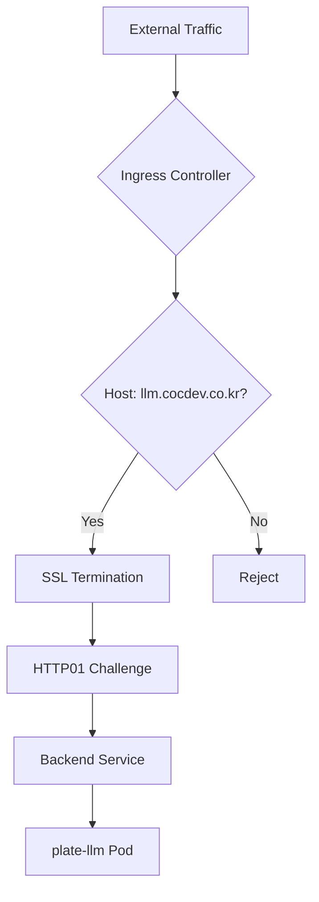

**섹션 출처**
- [values-stg.yaml](file://helm/applications/plate-llm/values-stg.yaml)

### 모니터링 전략
애플리케이션은 다음과 같은 모니터링 전략을 통해 안정적인 운영을 보장합니다:

- **리소스 모니터링**: CPU 및 메모리 사용량 실시간 모니터링
- **로그 수집**: Fluentd를 통한 중앙 집중식 로그 관리
- **성능 추적**: LangChain Tracing V2를 통한 LLM 호출 성능 분석

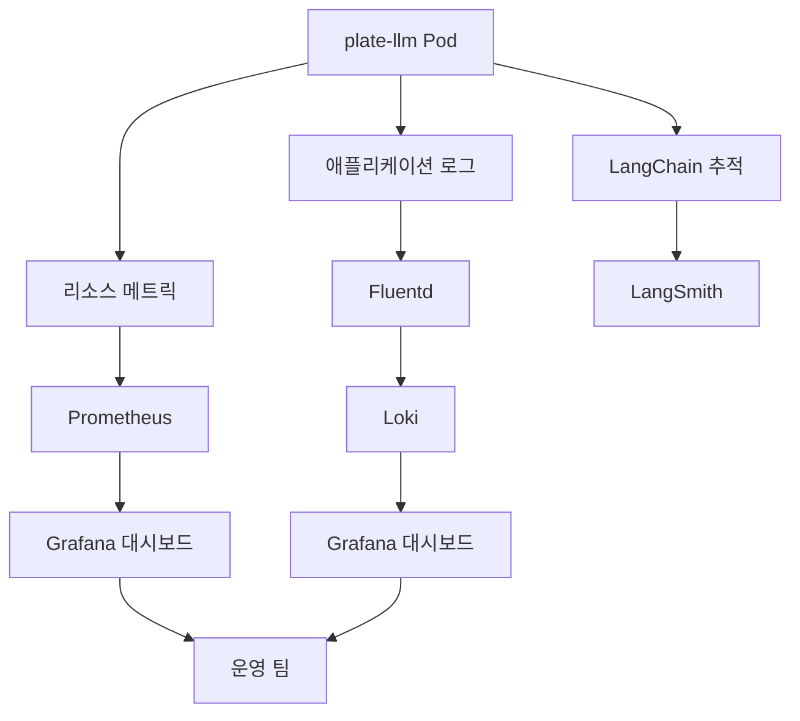

**섹션 출처**
- [values.yaml](file://helm/applications/plate-llm/values.yaml)
- [values-stg.yaml](file://helm/applications/plate-llm/values-stg.yaml)

## 성능 및 확장성 고려사항
plate-llm 애플리케이션은 대용량 요청 처리와 지연 시간 최적화를 위해 다양한 전략을 적용합니다.

### 대용량 요청 처리 전략
- **리소스 할당**: 1코어 CPU와 2Gi 메모리 할당으로 충분한 처리 능력 보장
- **복제본 관리**: 필요 시 replicaCount 증가를 통한 수평 확장
- **캐싱 전략**: plate-cache와의 통합을 통한 응답 캐싱

### 지연 시간 최적화
- **LLM 모델 선택**: LLM_MODEL_NAME 환경 변수를 통해 최적의 모델 선택
- **온도 및 토큰 제한**: LLM_TEMPERATURE 및 LLM_MAX_TOKENS를 통한 응답 품질과 속도 조절
- **네트워크 최적화**: 내부 클러스터 네트워크를 통한 plate-api와의 고속 통신

### 확장성 고려사항
- **모듈화 설계**: Helm 차트 기반의 모듈화로 쉽게 확장 가능
- **환경 분리**: 스테이징과 프로덕션 환경 분리로 안정적인 배포
- **GitOps 운영**: ArgoCD를 통한 선언적이고 자동화된 배포 프로세스

**섹션 출처**
- [values.yaml](file://helm/applications/plate-llm/values.yaml)
- [values-stg.yaml](file://helm/applications/plate-llm/values-stg.yaml)