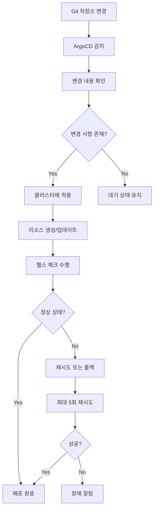
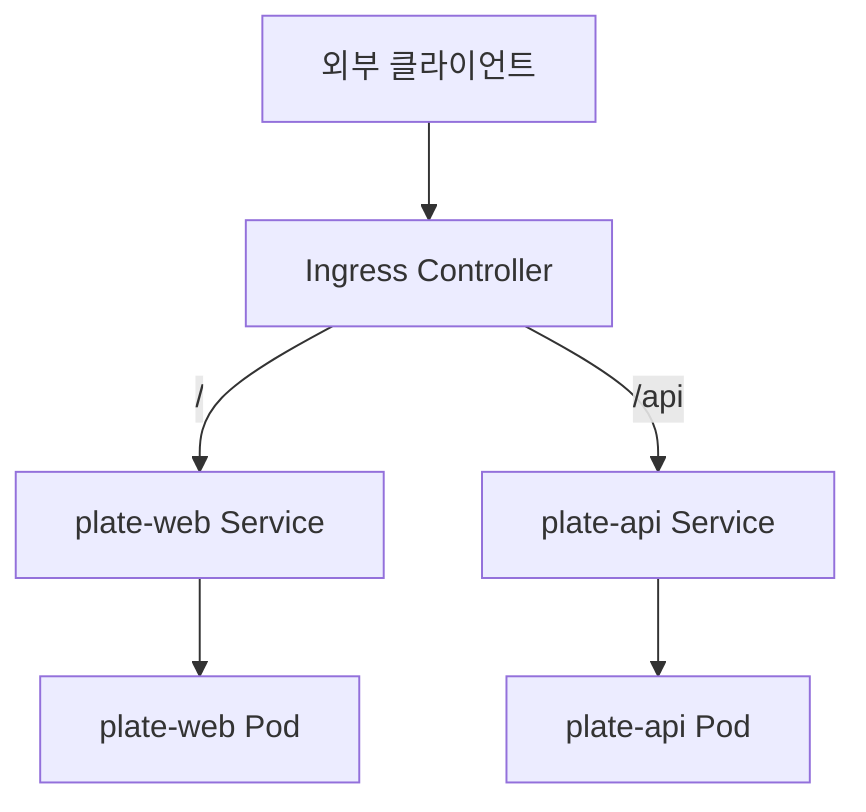
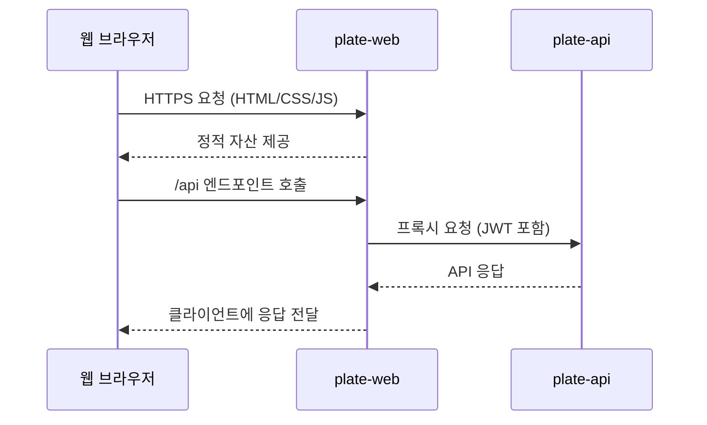
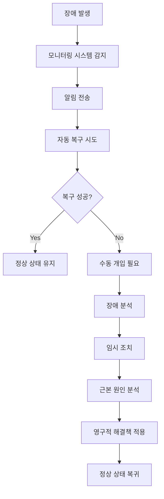
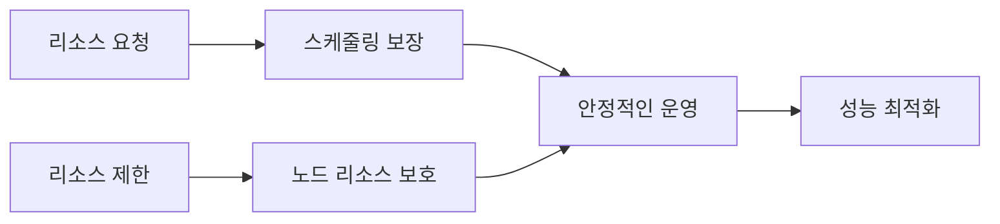

# plate-web 애플리케이션

<cite>
**이 문서에서 참조한 파일**
- [plate-web/Chart.yaml](file://helm/applications/plate-web/Chart.yaml)
- [plate-web/values.yaml](file://helm/applications/plate-web/values.yaml)
- [plate-web/values-stg.yaml](file://helm/applications/plate-web/values-stg.yaml)
- [plate-web/values-prod.yaml](file://helm/applications/plate-web/values-prod.yaml)
- [plate-web/templates/deployment.yaml](file://helm/applications/plate-web/templates/deployment.yaml)
- [plate-web/templates/service.yaml](file://helm/applications/plate-web/templates/service.yaml)
- [plate-web/templates/serviceaccount.yaml](file://helm/applications/plate-web/templates/serviceaccount.yaml)
- [plate-web/templates/_helpers.tpl](file://helm/applications/plate-web/templates/_helpers.tpl)
- [environments/argocd/apps/plate-web-stg.yaml](file://environments/argocd/apps/plate-web-stg.yaml)
- [environments/argocd/apps/plate-web-prod.yaml](file://environments/argocd/apps/plate-web-prod.yaml)
- [ingress/values.yaml](file://helm/ingress/values.yaml)
- [openbao/create-secrets.sh](file://scripts/openbao/create-secrets.sh)
</cite>

## 목차
1. [소개](#소개)
2. [프로젝트 구조](#프로젝트-구조)
3. [Helm 차트 구조](#helm-차트-구조)
4. [환경별 구성 관리](#환경별-구성-관리)
5. [배포 전략](#배포-전략)
6. [내부 노출 방식](#내부-노출-방식)
7. [운영 환경 동작 방식](#운영-환경-동작-방식)
8. [plate-api 통합 방식](#plate-api-통합-방식)
9. [성능 최적화 포인트](#성능-최적화-포인트)
10. [장애 대응 전략](#장애-대응-전략)
11. [업데이트 프로세스](#업데이트-프로세스)
12. [보안 설정](#보안-설정)
13. [리소스 요청/제한 설정](#리소스-요청제한-설정)

## 소개

plate-web은 Plate 웹 서비스를 위한 프론트엔드 애플리케이션으로, Nginx 리버스 프록시를 기반으로 구축된 Helm 차트입니다. 이 문서는 plate-web 애플리케이션의 전체 아키텍처, 구성 관리 방식, 배포 전략, 내부 노출 방식, 운영 환경에서의 동작 방식, plate-api와의 통합 방식, 성능 최적화 포인트, 장애 대응 전략, 업데이트 프로세스, 보안 설정 및 리소스 요청/제한 설정을 심층적으로 분석합니다.

## 프로젝트 구조

plate-web 애플리케이션은 Helm 기반으로 관리되며, 주요 구성 요소는 다음과 같습니다:

```
helm/applications/plate-web/
├── templates/
│   ├── _helpers.tpl
│   ├── deployment.yaml
│   ├── service.yaml
│   └── serviceaccount.yaml
├── Chart.yaml
├── values-prod.yaml
├── values-stg.yaml
└── values.yaml
```

이 구조는 Helm 차트의 표준 구조를 따르며, templates 디렉터리에는 쿠버네티스 리소스 템플릿이, values 파일들은 환경별 구성 값을 저장하고 있습니다.

**Diagram sources**
- [plate-web/Chart.yaml](file://helm/applications/plate-web/Chart.yaml)

**Section sources**
- [plate-web/Chart.yaml](file://helm/applications/plate-web/Chart.yaml)

## Helm 차트 구조

plate-web Helm 차트는 다음과 같은 주요 구성 요소로 이루어져 있습니다:

### Chart.yaml

차트의 메타데이터를 정의하며, 차트 이름, 설명, 버전, 유지보수자 정보 등을 포함합니다. 이 차트는 프론트엔드 웹 서비스를 위한 애플리케이션 타입으로 정의되어 있습니다.

### values.yaml

기본 구성 값을 정의하는 파일로, replicaCount, 이미지 정보, 서비스 설정, 리소스 제한 등의 기본값을 포함합니다. 이 파일은 환경별로 오버라이드될 수 있습니다.

### templates

쿠버네티스 리소스를 생성하기 위한 템플릿 파일들이 위치합니다:

- **deployment.yaml**: 애플리케이션의 배포 설정을 정의
- **service.yaml**: 서비스 노출 방식을 정의
- **serviceaccount.yaml**: 서비스 어카운트를 정의
- **_helpers.tpl**: 템플릿에서 재사용 가능한 함수들을 정의

**Section sources**
- [plate-web/Chart.yaml](file://helm/applications/plate-web/Chart.yaml)
- [plate-web/values.yaml](file://helm/applications/plate-web/values.yaml)
- [plate-web/templates/deployment.yaml](file://helm/applications/plate-web/templates/deployment.yaml)
- [plate-web/templates/service.yaml](file://helm/applications/plate-web/templates/service.yaml)
- [plate-web/templates/serviceaccount.yaml](file://helm/applications/plate-web/templates/serviceaccount.yaml)
- [plate-web/templates/_helpers.tpl](file://helm/applications/plate-web/templates/_helpers.tpl)

## 환경별 구성 관리

plate-web 애플리케이션은 values.yaml 파일을 통해 환경별 구성 관리를 수행합니다. 각 환경별로 별도의 values 파일을 사용하여 구성 차이를 관리합니다.

### 기본 구성 (values.yaml)

기본 구성 파일은 개발 및 테스트 환경을 위한 기본값을 제공합니다:

- replicaCount: 1
- 이미지: nginx:latest
- 서비스 유형: ClusterIP
- 리소스 제한: CPU 100m, 메모리 128Mi
- 리소스 요청: CPU 50m, 메모리 64Mi

### 스테이징 환경 (values-stg.yaml)

스테이징 환경을 위한 구성 파일로, 다음과 같은 특징을 가집니다:

- 이미지 풀 정책: Always (항상 최신 이미지 가져오기)
- 높은 리소스 제한: CPU 500m, 메모리 512Mi
- 높은 리소스 요청: CPU 200m, 메모리 256Mi

### 프로덕션 환경 (values-prod.yaml)

프로덕션 환경을 위한 구성 파일로, 다음과 같은 특징을 가집니다:

- 이미지 태그: 1.25 (고정 버전 사용)
- 이미지 풀 정책: IfNotPresent (이미지 캐시 활용)
- 백엔드 서비스 이미지: busybox:1.36
- 높은 리소스 제한: CPU 500m, 메모리 512Mi
- 높은 리소스 요청: CPU 250m, 메모리 256Mi

**Section sources**
- [plate-web/values.yaml](file://helm/applications/plate-web/values.yaml)
- [plate-web/values-stg.yaml](file://helm/applications/plate-web/values-stg.yaml)
- [plate-web/values-prod.yaml](file://helm/applications/plate-web/values-prod.yaml)

## 배포 전략

plate-web 애플리케이션은 ArgoCD를 통해 GitOps 방식으로 배포되며, 각 환경별로 별도의 ArgoCD Application 리소스를 사용합니다.

### ArgoCD Application 구성

ArgoCD Application 리소스는 다음과 같은 주요 설정을 포함합니다:

- **Git 소스 설정**: GitHub 저장소의 helm/applications/plate-web 경로를 소스로 지정
- **환경별 values 파일**: values-stg.yaml 또는 values-prod.yaml을 환경에 따라 적용
- **배포 대상**: plate-stg 또는 plate-prod 네임스페이스
- **자동 동기화**: Git 변경 사항을 자동으로 클러스터에 반영
- **자기 치유(self-heal)**: 클러스터에서의 수동 변경을 Git 상태로 자동 복구

### 자동화된 배포 프로세스

배포 프로세스는 다음과 같은 단계로 이루어집니다:



**Diagram sources**
- [environments/argocd/apps/plate-web-stg.yaml](file://environments/argocd/apps/plate-web-stg.yaml)
- [environments/argocd/apps/plate-web-prod.yaml](file://environments/argocd/apps/plate-web-prod.yaml)

**Section sources**
- [environments/argocd/apps/plate-web-stg.yaml](file://environments/argocd/apps/plate-web-stg.yaml)
- [environments/argocd/apps/plate-web-prod.yaml](file://environments/argocd/apps/plate-web-prod.yaml)

## 내부 노출 방식

plate-web 애플리케이션은 Service 리소스를 통해 클러스터 내부에서 노출되며, Ingress를 통해 외부에 접근 가능하게 됩니다.

### Service 구성

Service 리소스는 다음과 같은 설정을 사용합니다:

- **유형**: ClusterIP (Ingress를 통한 외부 노출)
- **포트**: 80 (클러스터 내부 서비스 포트)
- **타겟 포트**: 80 (Pod 내부 컨테이너 포트)
- **선택자**: 애플리케이션 라벨을 기반으로 Pod 선택

### Ingress 통합

Ingress 리소스는 plate-web 서비스를 외부에 노출하기 위해 사용되며, 다음과 같은 특징을 가집니다:

- **도메인 기반 라우팅**: cocdev.co.kr 도메인을 통해 접근
- **경로 기반 라우팅**: / 경로는 plate-web 서비스로, /api 경로는 plate-api 서비스로 라우팅
- **TLS 종료**: cert-manager를 통해 자동으로 TLS 인증서 관리



**Diagram sources**
- [plate-web/templates/service.yaml](file://helm/applications/plate-web/templates/service.yaml)
- [ingress/values.yaml](file://helm/ingress/values.yaml)

**Section sources**
- [plate-web/templates/service.yaml](file://helm/applications/plate-web/templates/service.yaml)
- [ingress/values.yaml](file://helm/ingress/values.yaml)

## 운영 환경 동작 방식

plate-web 애플리케이션은 프로덕션 환경에서 다음과 같은 방식으로 동작합니다:

### 고가용성 구성

- **복제본 수**: 1개 이상의 Pod로 구성하여 고가용성 보장
- **자동 복구**: Liveness Probe와 Readiness Probe를 통해 비정상 상태 감지 및 자동 재시작
- **무중단 배포**: Rolling Update 전략을 통해 서비스 중단 없이 배포

### 상태 모니터링

- **Liveness Probe**: HTTP GET 요청을 통해 프로세스 상태 확인
  - 경로: /
  - 포트: http
  - 초기 지연: 10초
  - 주기: 30초
- **Readiness Probe**: 트래픽 수신 준비 상태 확인
  - 경로: /
  - 포트: http
  - 초기 지연: 5초
  - 주기: 10초

### 로깅 및 모니터링

- **표준 출력 로깅**: 모든 로그를 stdout으로 출력하여 중앙 집중식 로깅 시스템과 통합
- **메트릭스 노출**: Prometheus와 호환되는 메트릭스 엔드포인트 제공
- **헬스 체크 엔드포인트**: 시스템 상태 확인을 위한 전용 엔드포인트 제공

**Section sources**
- [plate-web/templates/deployment.yaml](file://helm/applications/plate-web/templates/deployment.yaml)
- [plate-web/values-prod.yaml](file://helm/applications/plate-web/values-prod.yaml)

## plate-api 통합 방식

plate-web 애플리케이션은 plate-api 백엔드 서비스와 다음과 같은 방식으로 통합됩니다:

### 리버스 프록시 구성

plate-web은 Nginx를 리버스 프록시로 사용하여 plate-api 서비스로의 요청을 프록시합니다:

- **API 경로 라우팅**: /api 경로의 요청을 plate-api 서비스로 전달
- **헤더 전달**: 원본 클라이언트 정보를 X-Forwarded-* 헤더로 전달
- **프로토콜 유지**: 요청 프로토콜(HTTP/HTTPS)을 유지하여 백엔드에 전달

### 환경 변수 통합

plate-web과 plate-api는 공유된 환경 변수를 통해 통합됩니다:

- **도메인 정보**: FRONTEND_DOMAIN과 BACKEND_DOMAIN 환경 변수를 통해 서로의 도메인 정보 공유
- **API 접두사**: API_PREFIX 환경 변수를 통해 API 엔드포인트 경로 일관성 유지

### 보안 통합

- **JWT 인증**: plate-api에서 발급한 JWT 토큰을 plate-web에서 검증
- **CORS 설정**: plate-api의 CORS 설정을 통해 plate-web 도메인 허용
- **HTTPS 강제**: 모든 통신을 HTTPS로 강제하여 보안 강화



**Diagram sources**
- [ingress/values.yaml](file://helm/ingress/values.yaml)
- [openbao/create-secrets.sh](file://scripts/openbao/create-secrets.sh)

**Section sources**
- [ingress/values.yaml](file://helm/ingress/values.yaml)
- [openbao/create-secrets.sh](file://scripts/openbao/create-secrets.sh)

## 성능 최적화 포인트

plate-web 애플리케이션은 다음과 같은 성능 최적화 포인트를 포함합니다:

### 리소스 최적화

- **적절한 리소스 요청/제한**: CPU와 메모리 리소스를 적절히 설정하여 리소스 낭비 방지
- **이미지 풀 정책 최적화**: 프로덕션 환경에서는 IfNotPresent 정책을 사용하여 이미지 풀링 시간 단축
- **캐시 전략**: 정적 자산에 대한 적절한 캐시 헤더 설정

### 네트워크 최적화

- **HTTP/2 지원**: Ingress를 통해 HTTP/2 프로토콜 지원
- **Gzip 압축**: 응답 데이터에 대한 Gzip 압축 활성화
- **연결 풀링**: 백엔드 서비스와의 연결 풀링을 통해 연결 생성 오버헤드 감소

### 프록시 최적화

- **버퍼링 비활성화**: proxy_buffering과 proxy_request_buffering을 비활성화하여 지연 시간 최소화
- **클라이언트 본문 크기 제한 해제**: client_max_body_size를 0으로 설정하여 대용량 업로드 지원
- **효율적인 이벤트 처리**: epoll과 multi_accept를 사용하여 고성능 이벤트 처리

**Section sources**
- [plate-web/values.yaml](file://helm/applications/plate-web/values.yaml)
- [plate-web/values-prod.yaml](file://helm/applications/plate-web/values-prod.yaml)
- [ingress/values.yaml](file://helm/ingress/values.yaml)

## 장애 대응 전략

plate-web 애플리케이션은 다음과 같은 장애 대응 전략을 수립하고 있습니다:

### 자동 복구 메커니즘

- **Liveness Probe 기반 재시작**: 애플리케이션이 응답하지 않을 경우 자동으로 Pod 재시작
- **Readiness Probe 기반 트래픽 제거**: 준비되지 않은 Pod에는 트래픽을 라우팅하지 않음
- **ArgoCD 자기 치유**: 클러스터 상태가 Git 상태와 다를 경우 자동으로 복구

### 모니터링 및 알림

- **실시간 모니터링**: Prometheus와 Grafana를 통한 실시간 성능 모니터링
- **장애 감지**: CPU 사용률, 메모리 사용량, 네트워크 지연 등의 지표 기반 장애 감지
- **알림 시스템**: Slack, 이메일 등을 통한 실시간 장애 알림

### 재시도 및 백오프 전략

- **배포 재시도**: 배포 실패 시 지수 백오프 전략으로 최대 5회 재시도
- **서비스 재시도**: 백엔드 서비스 호출 실패 시 재시도 로직 적용
- **연결 재시도**: 네트워크 연결 실패 시 재시도 메커니즘 적용



**Section sources**
- [environments/argocd/apps/plate-web-prod.yaml](file://environments/argocd/apps/plate-web-prod.yaml)
- [plate-web/templates/deployment.yaml](file://helm/applications/plate-web/templates/deployment.yaml)

## 업데이트 프로세스

plate-web 애플리케이션의 업데이트 프로세스는 다음과 같은 단계로 이루어집니다:

### GitOps 기반 업데이트

1. **변경 사항 커밋**: Helm 차트 또는 values 파일의 변경 사항을 Git 저장소에 커밋
2. **CI 파이프라인 실행**: 변경 사항에 대한 자동 테스트 및 검증 수행
3. **ArgoCD 자동 동기화**: Git 변경 사항을 감지하고 자동으로 클러스터에 적용
4. **무중단 배포**: Rolling Update 전략을 통해 서비스 중단 없이 업데이트
5. **헬스 체크 및 검증**: 업데이트 후 시스템 상태 확인
6. **모니터링 및 관찰**: 성능 지표 및 오류 로그 모니터링

### 롤백 전략

- **Git 기반 롤백**: 이전 커밋으로 되돌려서 빠르게 롤백
- **ArgoCD 롤백**: ArgoCD UI 또는 CLI를 통한 간편한 롤백
- **자동 롤백**: 헬스 체크 실패 시 자동 롤백 기능

### 업데이트 검증

- **자동 테스트**: 단위 테스트, 통합 테스트, E2E 테스트를 통한 검증
- **캔اري 배포**: 일부 트래픽만 새로운 버전으로 라우팅하여 검증
- **블루-그린 배포**: 새로운 버전을 별도의 환경에 배포하고 트래픽 전환

**Section sources**
- [environments/argocd/apps/plate-web-stg.yaml](file://environments/argocd/apps/plate-web-stg.yaml)
- [environments/argocd/apps/plate-web-prod.yaml](file://environments/argocd/apps/plate-web-prod.yaml)

## 보안 설정

plate-web 애플리케이션은 다음과 같은 보안 설정을 적용합니다:

### 네트워크 보안

- **Ingress 보안 어노테이션**: SSL 리다이렉트, 클러스터 발급자 설정
- **TLS 암호화**: Let's Encrypt를 통한 자동 TLS 인증서 발급
- **HTTPS 강제**: HTTP 요청을 HTTPS로 자동 리다이렉트

### 애플리케이션 보안

- **이미지 보안**: 신뢰할 수 있는 레지스트리에서 이미지 가져오기
- **보안 헤더**: X-Frame-Options, Content-Security-Policy 등의 보안 헤더 설정
- **쿠키 보안**: Secure 및 HttpOnly 플래그를 사용한 쿠키 보호

### 접근 제어

- **RBAC**: 서비스 어카운트를 통한 리소스 접근 제어
- **네임스페이스 격리**: plate-stg와 plate-prod 네임스페이스를 통한 환경 격리
- **Secret 관리**: OpenBao를 통한 민감 정보 관리

**Section sources**
- [ingress/values.yaml](file://helm/ingress/values.yaml)
- [plate-web/templates/serviceaccount.yaml](file://helm/applications/plate-web/templates/serviceaccount.yaml)
- [openbao/create-secrets.sh](file://scripts/openbao/create-secrets.sh)

## 리소스 요청/제한 설정

plate-web 애플리케이션은 리소스 요청과 제한을 적절히 설정하여 안정적인 운영을 보장합니다.

### 프로덕션 환경 설정

- **CPU 요청**: 250m
- **CPU 제한**: 500m
- **메모리 요청**: 256Mi
- **메모리 제한**: 512Mi

### 스테이징 환경 설정

- **CPU 요청**: 200m
- **CPU 제한**: 500m
- **메모리 요청**: 256Mi
- **메모리 제한**: 512Mi

### 리소스 관리 전략

- **요청 값**: Pod 스케줄링 시 필요한 최소 리소스 보장
- **제한 값**: Pod가 사용할 수 있는 최대 리소스 제한
- **리소스 균형**: 요청과 제한 사이의 적절한 균형 유지
- **모니터링 기반 조정**: 실제 사용량 모니터링을 기반으로 리소스 값 조정



**Diagram sources**
- [plate-web/values-stg.yaml](file://helm/applications/plate-web/values-stg.yaml)
- [plate-web/values-prod.yaml](file://helm/applications/plate-web/values-prod.yaml)

**Section sources**
- [plate-web/values-stg.yaml](file://helm/applications/plate-web/values-stg.yaml)
- [plate-web/values-prod.yaml](file://helm/applications/plate-web/values-prod.yaml)