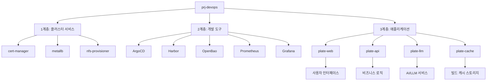
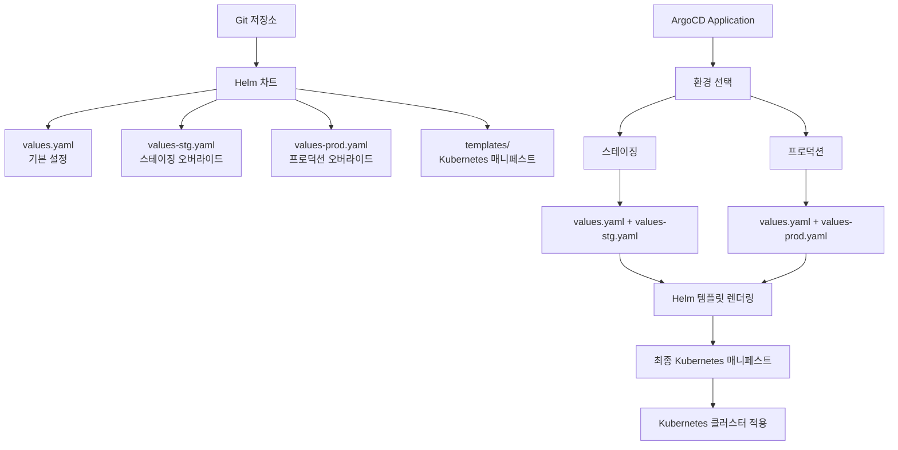
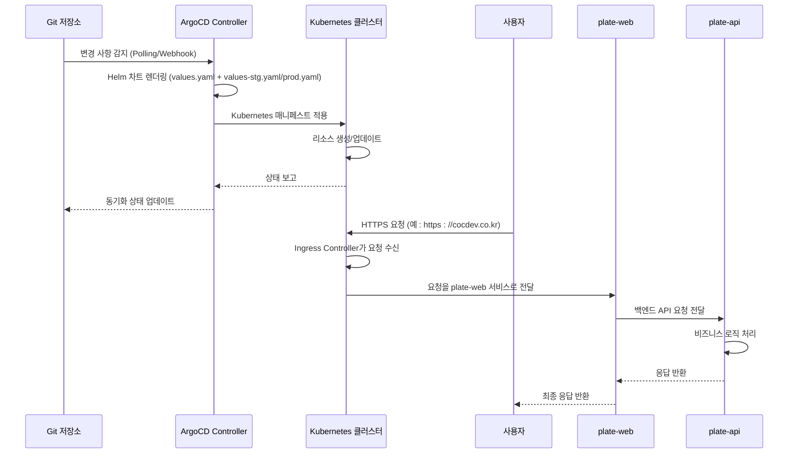

# 애플리케이션

<cite>
**이 문서에서 참조한 파일**  
- [plate-api/Chart.yaml](file://helm/applications/plate-api/Chart.yaml)
- [plate-api/values.yaml](file://helm/applications/plate-api/values.yaml)
- [plate-api/values-stg.yaml](file://helm/applications/plate-api/values-stg.yaml)
- [plate-api/values-prod.yaml](file://helm/applications/plate-api/values-prod.yaml)
- [plate-web/Chart.yaml](file://helm/applications/plate-web/Chart.yaml)
- [plate-web/values.yaml](file://helm/applications/plate-web/values.yaml)
- [plate-web/values-stg.yaml](file://helm/applications/plate-web/values-stg.yaml)
- [plate-web/values-prod.yaml](file://helm/applications/plate-web/values-prod.yaml)
- [plate-llm/Chart.yaml](file://helm/applications/plate-llm/Chart.yaml)
- [plate-llm/values.yaml](file://helm/applications/plate-llm/values.yaml)
- [plate-llm/values-stg.yaml](file://helm/applications/plate-llm/values-stg.yaml)
- [plate-cache/Chart.yaml](file://helm/applications/plate-cache/Chart.yaml)
- [plate-cache/values.yaml](file://helm/applications/plate-cache/values.yaml)
- [app-of-apps.yaml](file://environments/argocd/app-of-apps.yaml)
- [plate-api-stg.yaml](file://environments/argocd/apps/plate-api-stg.yaml)
- [plate-api-prod.yaml](file://environments/argocd/apps/plate-api-prod.yaml)
- [plate-web-stg.yaml](file://environments/argocd/apps/plate-web-stg.yaml)
- [plate-web-prod.yaml](file://environments/argocd/apps/plate-web-prod.yaml)
- [plate-llm-stg.yaml](file://environments/argocd/apps/plate-llm-stg.yaml)
- [plate-cache-stg.yaml](file://environments/argocd/apps/plate-cache-stg.yaml)
</cite>

## 목차
1. [소개](#소개)
2. [애플리케이션 계층 구조](#애플리케이션-계층-구조)
3. [각 애플리케이션의 역할과 기능](#각-애플리케이션의-역할과-기능)
4. [Helm 차트 구조 및 values.yaml 구성 관리](#helm-차트-구조-및-valuesyaml-구성-관리)
5. [배포 전략 및 서비스 노출 방식](#배포-전략-및-서비스-노출-방식)
6. [상호 의존성 관계 및 통합 동작](#상호-의존성-관계-및-통합-동작)
7. [성능 최적화 포인트](#성능-최적화-포인트)
8. [장애 대응 전략](#장애-대응-전략)
9. [업데이트 프로세스](#업데이트-프로세스)
10. [결론](#결론)

## 소개

prj-devops 리포지토리는 GitOps 기반의 Kubernetes 배포 자동화를 위한 인프라스트럭처로서, Helm과 ArgoCD를 중심으로 구성된 선언적 배포 시스템입니다. 이 문서는 plate-web, plate-api, plate-llm, plate-cache 네 가지 핵심 애플리케이션의 계층 구조, 역할, 기능, 배포 전략, 상호 의존성, 운영 전략을 심층적으로 분석합니다. 각 애플리케이션은 Helm 차트로 패키징되어 있으며, ArgoCD를 통해 Git 저장소의 선언적 구성에 따라 자동으로 배포되고 동기화됩니다.

**소개**
- [README.md](file://README.md#L1-L461)

## 애플리케이션 계층 구조

prj-devops는 계층화된 아키텍처를 채택하여 인프라, 도구, 애플리케이션을 명확히 분리합니다. 이 구조는 관리의 용이성과 안정성을 보장합니다.



**Diagram sources**
- [README.md](file://README.md#L17-L37)

**Section sources**
- [README.md](file://README.md#L17-L37)

## 각 애플리케이션의 역할과 기능

### plate-web

plate-web은 사용자에게 웹 인터페이스를 제공하는 프론트엔드 애플리케이션입니다. Nginx 컨테이너를 기반으로 한 리버스 프록시 역할을 하며, 정적 자산을 제공하고 백엔드 API 서버로 요청을 전달합니다. 스테이징과 프로덕션 환경에서 서로 다른 이미지 태그와 리소스 설정을 사용하여 개발과 운영의 요구를 충족합니다.

**Section sources**
- [plate-web/Chart.yaml](file://helm/applications/plate-web/Chart.yaml#L1-L17)
- [plate-web/values.yaml](file://helm/applications/plate-web/values.yaml#L1-L30)
- [plate-web/values-stg.yaml](file://helm/applications/plate-web/values-stg.yaml#L1-L23)
- [plate-web/values-prod.yaml](file://helm/applications/plate-web/values-prod.yaml#L1-L39)

### plate-api

plate-api는 비즈니스 로직을 처리하는 백엔드 서버입니다. RESTful API를 제공하며, 데이터베이스와의 상호작용, 인증, 권한 부여, 비즈니스 규칙 검증 등의 핵심 기능을 수행합니다. 환경 변수를 통해 다양한 설정을 주입받으며, OpenBao를 통해 민감한 정보(예: 데이터베이스 URL, API 키)를 안전하게 관리합니다.

**Section sources**
- [plate-api/Chart.yaml](file://helm/applications/plate-api/Chart.yaml#L1-L16)
- [plate-api/values.yaml](file://helm/applications/plate-api/values.yaml#L1-L85)
- [plate-api/values-stg.yaml](file://helm/applications/plate-api/values-stg.yaml#L1-L19)
- [plate-api/values-prod.yaml](file://helm/applications/plate-api/values-prod.yaml#L1-L22)

### plate-llm

plate-llm은 LangChain 기반의 대규모 언어 모델(LLM) 서비스입니다. AI 기능을 제공하며, 외부 LLM 제공자(예: OpenAI, Anthropic)의 API를 활용합니다. 이 서비스는 고성능 컴퓨팅 리소스를 필요로 하며, 따라서 상대적으로 높은 CPU 및 메모리 리소스 제한이 설정되어 있습니다. 스테이징 환경에서만 Ingress를 통해 외부에 노출되며, 프로덕션 환경에서는 내부 서비스로 운영될 수 있습니다.

**Section sources**
- [plate-llm/Chart.yaml](file://helm/applications/plate-llm/Chart.yaml#L1-L18)
- [plate-llm/values.yaml](file://helm/applications/plate-llm/values.yaml#L1-L52)
- [plate-llm/values-stg.yaml](file://helm/applications/plate-llm/values-stg.yaml#L1-L54)

### plate-cache

plate-cache는 컨테이너 빌드 과정에서 사용되는 캐시를 저장하기 위한 영구 볼륨 클레임(PVC)을 제공하는 특수한 애플리케이션입니다. 이는 실제 워크로드를 실행하는 것이 아니라, 스토리지 리소스를 프로비저닝하는 역할을 합니다. 따라서 Deployment나 Service 리소스가 없으며, 오직 PVC만을 생성합니다. 이 리소스는 환경 간에 공유되므로, 별도의 `values-stg.yaml` 또는 `values-prod.yaml` 없이 단일 `values.yaml` 파일로 관리됩니다.

**Section sources**
- [plate-cache/Chart.yaml](file://helm/applications/plate-cache/Chart.yaml#L1-L16)
- [plate-cache/values.yaml](file://helm/applications/plate-cache/values.yaml#L1-L14)

## Helm 차트 구조 및 values.yaml 구성 관리

모든 애플리케이션은 Helm 차트로 패키징되어 있으며, `helm/applications/<서비스명>/` 디렉토리에 위치합니다. 각 차트는 `Chart.yaml`, `values.yaml`, `templates/` 디렉토리로 구성됩니다.

### Helm 차트 구조

- **Chart.yaml**: 차트의 메타데이터(이름, 버전, 설명 등)를 정의합니다.
- **values.yaml**: 애플리케이션 배포의 기본 설정 값을 포함합니다. 이 파일은 모든 환경에서 공통으로 사용되는 기본값을 제공합니다.
- **templates/**: Kubernetes 매니페스트 템플릿 파일들이 위치합니다. Helm은 `values.yaml`의 값을 이 템플릿에 주입하여 최종적인 매니페스트를 생성합니다.
- **values-stg.yaml**, **values-prod.yaml**: 스테이징과 프로덕션 환경에 특화된 설정 오버라이드를 포함합니다. ArgoCD는 배포 시 기본 `values.yaml`과 환경별 `values-*.yaml` 파일을 결합하여 최종 설정을 생성합니다.

### 환경별 구성 관리

환경별 구성은 다음과 같은 계층적 오버라이드 방식으로 관리됩니다.

1.  **기본값 (`values.yaml`)**: 모든 환경에 적용되는 공통 설정.
2.  **환경 오버라이드 (`values-stg.yaml`, `values-prod.yaml`)**: 특정 환경에서 기본값을 재정의하는 설정. 예를 들어, 프로덕션 환경에서는 이미지 태그를 `latest` 대신 고정된 버전으로 설정하거나, 리소스 요청량을 증가시킬 수 있습니다.
3.  **ArgoCD Application 정의**: `environments/argocd/apps/` 디렉토리의 YAML 파일이 어떤 `values-*.yaml` 파일을 사용할지 명시합니다.

이 구조는 구성의 일관성을 유지하면서도 환경별로 필요한 유연성을 제공합니다.



**Diagram sources**
- [README.md](file://README.md#L103-L118)
- [plate-api/values.yaml](file://helm/applications/plate-api/values.yaml#L1-L85)
- [plate-api/values-stg.yaml](file://helm/applications/plate-api/values-stg.yaml#L1-L19)
- [plate-api/values-prod.yaml](file://helm/applications/plate-api/values-prod.yaml#L1-L22)

**Section sources**
- [README.md](file://README.md#L103-L118)
- [plate-api/Chart.yaml](file://helm/applications/plate-api/Chart.yaml#L1-L16)
- [plate-api/values.yaml](file://helm/applications/plate-api/values.yaml#L1-L85)
- [plate-api/values-stg.yaml](file://helm/applications/plate-api/values-stg.yaml#L1-L19)
- [plate-api/values-prod.yaml](file://helm/applications/plate-api/values-prod.yaml#L1-L22)

## 배포 전략 및 서비스 노출 방식

### 배포 전략

이 프로젝트는 **GitOps** 원칙을 기반으로 한 **App of Apps** 패턴을 사용합니다.

- **App of Apps**: 최상위 `app-of-apps.yaml` 애플리케이션이 `environments/argocd/apps/` 디렉토리의 모든 하위 애플리케이션(Application)을 관리합니다. ArgoCD는 이 최상위 애플리케이션을 동기화함으로써, 전체 인프라와 애플리케이션을 한 번에 배포하고 관리할 수 있습니다.
- **자동 동기화**: ArgoCD는 Git 저장소를 주기적으로 폴링하거나 웹훅을 통해 변경 사항을 감지합니다. 변경이 감지되면, 자동으로 Helm 차트를 렌더링하고 Kubernetes 클러스터에 매니페스트를 적용합니다.
- **자기 치유(Self-Healing)**: 클러스터의 실제 상태가 Git 저장소의 선언적 상태와 다를 경우, ArgoCD는 자동으로 클러스터를 Git의 상태로 되돌립니다.
- **삭제 자동화(Prune)**: Git 저장소에서 제거된 리소스는 클러스터에서도 자동으로 삭제됩니다.

### 서비스 노출 방식

각 애플리케이션의 서비스 노출 방식은 그 역할에 따라 다릅니다.

- **plate-web**: `ClusterIP` 타입의 서비스를 사용하며, 외부 노출은 별도의 `ingress` Helm 차트를 통해 통합 관리됩니다. Ingress 리소스는 `stg.cocdev.co.kr` 및 `cocdev.co.kr` 도메인을 통해 HTTPS로 접근할 수 있도록 설정됩니다.
- **plate-api**: `LoadBalancer` 또는 `ClusterIP` 타입의 서비스를 사용할 수 있습니다. 외부 API 엔드포인트는 Ingress를 통해 노출되며, 내부 서비스 간 통신은 클러스터 내부 DNS를 통해 이루어집니다.
- **plate-llm**: `ClusterIP` 타입의 서비스를 사용하며, 스테이징 환경에서는 `llm.cocdev.co.kr` 도메인을 통해 직접 Ingress로 노출됩니다. 프로덕션 환경에서는 내부 서비스로만 접근 가능하도록 제한될 수 있습니다.
- **plate-cache**: 서비스 리소스를 생성하지 않으며, PVC만을 생성합니다. 이 PVC는 다른 애플리케이션의 Pod에서 볼륨 마운트를 통해 사용됩니다.



**Diagram sources**
- [app-of-apps.yaml](file://environments/argocd/app-of-apps.yaml#L1-L20)
- [plate-api-stg.yaml](file://environments/argocd/apps/plate-api-stg.yaml#L1-L20)
- [plate-web-stg.yaml](file://environments/argocd/apps/plate-web-stg.yaml#L1-L20)
- [plate-llm-stg.yaml](file://environments/argocd/apps/plate-llm-stg.yaml#L1-L20)

**Section sources**
- [README.md](file://README.md#L120-L135)
- [environments/argocd/app-of-apps.yaml](file://environments/argocd/app-of-apps.yaml#L1-L20)

## 상호 의존성 관계 및 통합 동작

애플리케이션 간의 주요 의존성은 다음과 같습니다.

- **plate-web → plate-api**: 프론트엔드는 백엔드 API 서버에 RESTful 요청을 보내 데이터를 가져오고, 사용자 작업을 처리합니다.
- **plate-api → plate-cache**: 백엔드 서버는 컨테이너 이미지 빌드와 같은 작업에서 plate-cache PVC를 마운트하여 빌드 캐시를 활용함으로써 빌드 속도를 향상시킵니다.
- **plate-llm → plate-api**: LLM 서비스는 백엔드 서버를 통해 사용자 요청을 수신하거나, 백엔드 서버가 LLM 서비스를 호출하여 AI 기능을 활용할 수 있습니다. (구체적인 통신 방식은 애플리케이션 로직에 따라 다름)
- **모든 애플리케이션 → OpenBao**: 모든 애플리케이션은 OpenBao를 통해 데이터베이스 비밀번호, API 키 등의 민감한 정보를 안전하게 가져옵니다.

통합 동작 흐름은 다음과 같습니다. 사용자가 웹 브라우저에서 `https://cocdev.co.kr`에 접속하면, Ingress Controller가 요청을 `plate-web` 서비스로 라우팅합니다. `plate-web`은 정적 자산을 제공하고, 동적 데이터 요청은 `plate-api`로 프록시합니다. `plate-api`는 비즈니스 로직을 처리하며, 필요한 경우 `plate-cache`에 접근하거나 `plate-llm`과 통신합니다. 모든 구성과 비밀 정보는 Git 저장소와 OpenBao에 선언적으로 저장되어 있으며, ArgoCD에 의해 자동으로 배포됩니다.

```mermaid
graph LR
User[사용자] --> |HTTPS| Ingress[Ingress Controller]
Ingress --> |HTTP| plate-web[plate-web<br/>프론트엔드]
plate-web --> |API 요청| plate-api[plate-api<br/>백엔드]
plate-api --> |데이터베이스| DB[(Database)]
plate-api --> |캐시 마운트| plate-cache[plate-cache<br/>PVC]
plate-api < --> |HTTP| plate-llm[plate-llm<br/>LLM 서비스]
All[모든 애플리케이션] --> |비밀 정보| OpenBao[OpenBao<br/>시크릿 매니저]
ArgoCD[ArgoCD] --> |GitOps| Git[Git 저장소]
ArgoCD --> |배포| K8s[Kubernetes 클러스터]
```

**Diagram sources**
- [README.md](file://README.md#L199-L204)
- [plate-api/values.yaml](file://helm/applications/plate-api/values.yaml#L31-L85)
- [plate-llm/values-stg.yaml](file://helm/applications/plate-llm/values-stg.yaml#L44-L54)

**Section sources**
- [README.md](file://README.md#L199-L204)
- [plate-api/values.yaml](file://helm/applications/plate-api/values.yaml#L31-L85)
- [plate-llm/values-stg.yaml](file://helm/applications/plate-llm/values-stg.yaml#L44-L54)

## 성능 최적화 포인트

- **리소스 요청 및 제한**: 각 애플리케이션은 `resources` 설정을 통해 CPU와 메모리의 `requests` 및 `limits`를 명시적으로 정의합니다. 이는 노드 스케줄링을 최적화하고, OOMKilled와 같은 리소스 부족 문제를 방지합니다.
- **이미지 풀 정책**: 스테이징 환경에서는 최신 빌드를 반영하기 위해 `imagePullPolicy: Always`를 사용하고, 프로덕션 환경에서는 성능을 위해 `IfNotPresent`를 사용합니다.
- **빌드 캐시**: `plate-cache` PVC를 통해 컨테이너 이미지 빌드 과정의 캐시를 지속적으로 유지함으로써, 반복적인 빌드 시간을 크게 단축시킵니다.
- **Ingress 최적화**: 통합 Ingress 차트를 사용하여, 단일 Ingress Controller에서 여러 서비스를 효율적으로 라우팅합니다.
- **환경 변수 주입**: OpenBao를 통해 비밀 정보를 직접 주입함으로써, 애플리케이션 시작 시 외부 구성 서버에 대한 추가 네트워크 호출을 줄일 수 있습니다.

**Section sources**
- [plate-api/values.yaml](file://helm/applications/plate-api/values.yaml#L14-L20)
- [plate-web/values-stg.yaml](file://helm/applications/plate-web/values-stg.yaml#L9)
- [plate-web/values-prod.yaml](file://helm/applications/plate-web/values-prod.yaml#L9)
- [plate-cache/values.yaml](file://helm/applications/plate-cache/values.yaml#L4-L10)

## 장애 대응 전략

- **Git을 단일 진실 원천으로 삼기**: 모든 구성은 Git 저장소에 저장되며, ArgoCD는 클러스터 상태를 Git과 항상 일치시키려고 합니다. 이는 구성의 일관성을 보장하고, 구성 오류를 쉽게 추적할 수 있게 합니다.
- **자동 롤백**: Git에서 이전 커밋으로 되돌리면, ArgoCD가 자동으로 이전 상태로 클러스터를 롤백합니다.
- **헬스 체크**: `deploy-prod.sh` 스크립트는 배포 후 헬스 체크를 수행하여, 서비스가 정상적으로 시작되었는지 검증합니다.
- **모니터링**: Prometheus와 Grafana를 통해 메트릭을 수집하고, Grafana 대시보드에서 실시간으로 시스템 상태를 모니터링할 수 있습니다.
- **문제 진단**: `kubectl get pods`, `kubectl logs`, `kubectl describe` 명령어를 사용하여 Pod 상태, 로그, 이벤트를 확인할 수 있습니다. cert-manager와 Ingress 관련 문제는 각각의 리소스(Certificate, Ingress) 상태를 확인해야 합니다.

**Section sources**
- [README.md](file://README.md#L254-L255)
- [scripts/deploy-prod.sh](file://scripts/deploy-prod.sh#L1-L20)
- [README.md](file://README.md#L368-L387)

## 업데이트 프로세스

1.  **변경 사항 커밋**: 개발자는 로컬에서 `helm/applications/<서비스>/values-stg.yaml` 또는 템플릿 파일을 수정합니다.
2.  **풀 리퀘스트(PR)**: 변경 사항을 Git 저장소에 푸시하고, 팀 리뷰를 위한 PR을 생성합니다.
3.  **스테이징 검증**: PR이 머지되면, ArgoCD가 자동으로 스테이징 환경에 변경 사항을 배포합니다. 팀은 스테이징 환경에서 기능과 성능을 검증합니다.
4.  **프로덕션 반영**: 스테이징 검증이 완료되면, `values-prod.yaml` 파일에 동일한 변경 사항을 반영하고 커밋합니다.
5.  **프로덕션 배포**: ArgoCD가 `values-prod.yaml`의 변경 사항을 감지하고, 프로덕션 환경에 자동으로 배포합니다. `deploy-prod.sh` 스크립트를 사용하면 추가적인 안전장치(사용자 확인, 백업 생성)를 거칠 수 있습니다.

이 프로세스는 안정적인 배포를 보장하면서도 GitOps의 자동화 이점을 최대한 활용합니다.

**Section sources**
- [README.md](file://README.md#L246-L255)
- [scripts/deploy-prod.sh](file://scripts/deploy-prod.sh#L1-L20)

## 결론

prj-devops는 Helm과 ArgoCD를 중심으로 한 견고한 GitOps 기반의 DevOps 인프라입니다. `plate-web`, `plate-api`, `plate-llm`, `plate-cache`는 각자의 역할을 명확히 하며, 계층화된 구조와 선언적 구성 관리를 통해 효율적이고 안정적인 운영이 가능합니다. 환경별 `values.yaml` 파일을 통한 구성 관리, App of Apps 패턴을 활용한 통합 배포, OpenBao를 통한 중앙화된 시크릿 관리는 이 시스템의 핵심 강점입니다. 이러한 구조는 복잡한 애플리케이션을 안전하게 관리하고, 빠르게 반복하며, 장애에 대응할 수 있는 기반을 제공합니다.