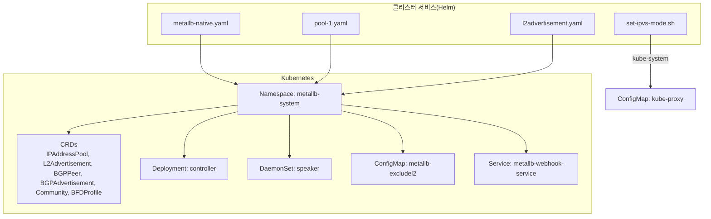
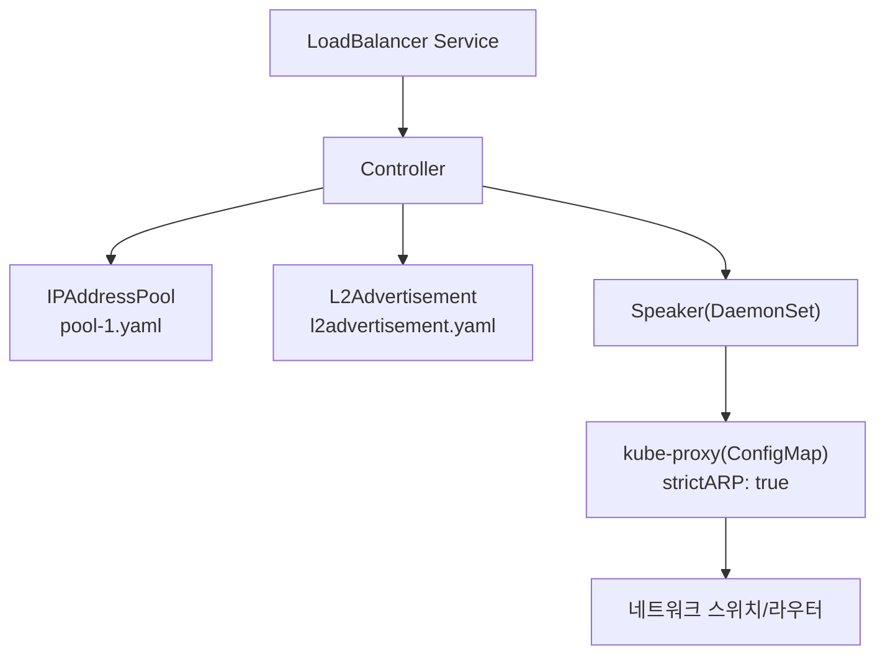
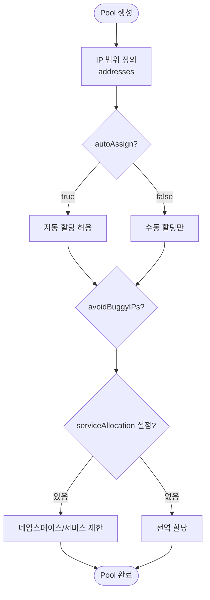
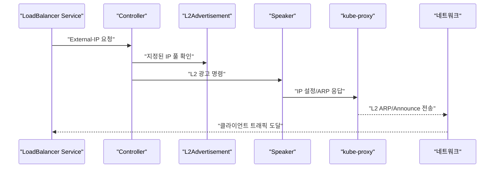
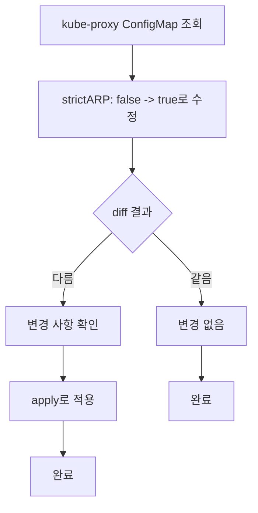
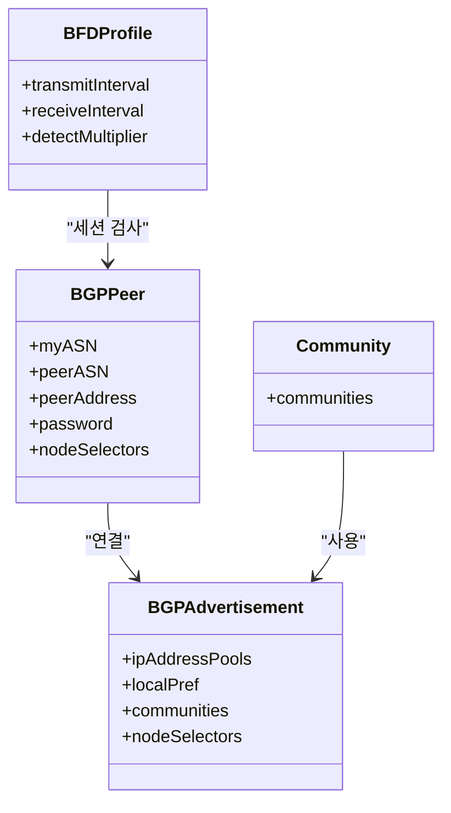
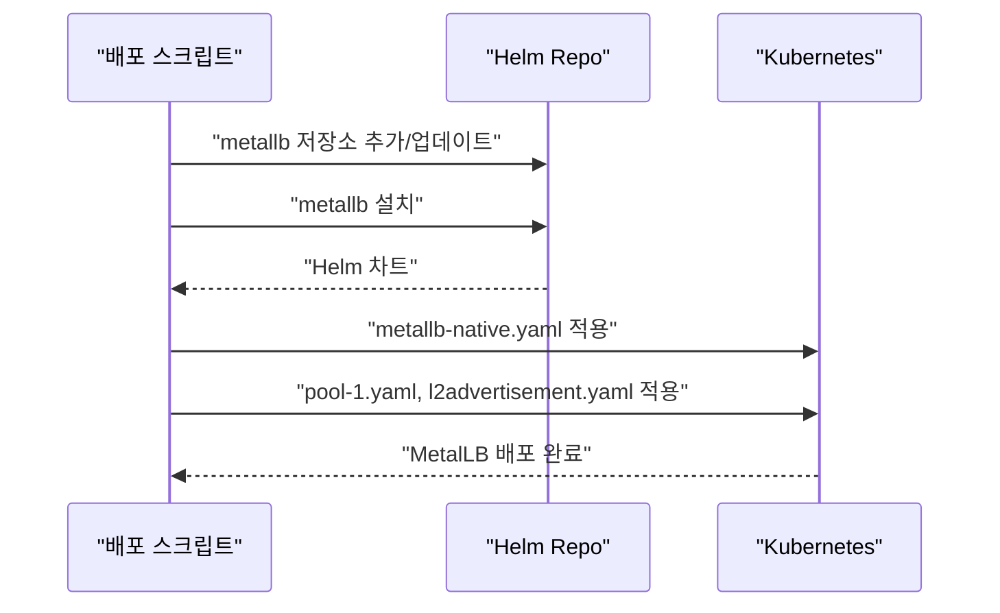
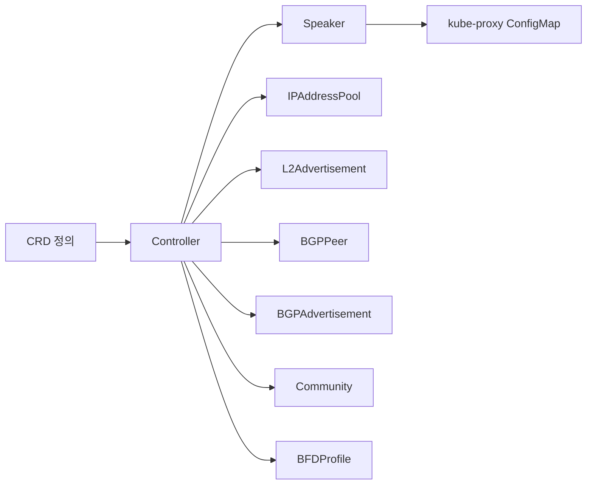

# MetalLB

<cite>
**문서에 참조된 파일**
- [metallb-native.yaml](file://helm/cluster-services/metallb/metallb-native.yaml)
- [pool-1.yaml](file://helm/cluster-services/metallb/pool-1.yaml)
- [l2advertisement.yaml](file://helm/cluster-services/metallb/l2advertisement.yaml)
- [set-ipvs-mode.sh](file://helm/cluster-services/metallb/set-ipvs-mode.sh)
- [deploy-libraries.sh](file://scripts/deploy-libraries.sh)
</cite>

## 목차
1. [소개](#소개)
2. [프로젝트 구조](#프로젝트-구조)
3. [핵심 구성 요소](#핵심-구성-요소)
4. [아키텍처 개요](#아키텍처-개요)
5. [상세 구성 요소 분석](#상세-구성-요소-분석)
6. [의존성 분석](#의존성-분석)
7. [성능 고려사항](#성능-고려사항)
8. [장애 진단 가이드](#장애-진단-가이드)
9. [결론](#결론)
10. [부록](#부록)

## 소개
본 문서는 MetalLB를 통한 Kubernetes 클러스터 외부 서비스 노출 메커니즘을 설명합니다. BGP 또는 L2 모드에서 클러스터 외부 IP를 할당하고, metallb-native.yaml 기반 설치 구조, IP 풀(pool-1.yaml) 구성 방법, L2 광고 설정(l2advertisement.yaml), IPVS 모드 자동화(set-ipvs-mode.sh)를 중심으로 설명합니다. 또한 다양한 네트워크 환경(Bare Metal, 가상화 환경)에서의 배포 시나리오와 고가용성 설정, 상태 모니터링 및 장애 조치(Failover) 메커니즘을 다룹니다.

## 프로젝트 구조
MetalLB 관련 리소스는 클러스터 서비스 Helm 차트 내에 위치하며, 다음과 같은 구조로 배포됩니다:
- 설치 매니페스트: metallb-native.yaml
- IP 풀: pool-1.yaml
- L2 광고: l2advertisement.yaml
- IPVS 모드 자동화 스크립트: set-ipvs-mode.sh
- 배포 스크립트: deploy-libraries.sh

**도표 출처**
- [metallb-native.yaml](file://helm/cluster-services/metallb/metallb-native.yaml#L1638-L1836)
- [pool-1.yaml](file://helm/cluster-services/metallb/pool-1.yaml#L1-L9)
- [l2advertisement.yaml](file://helm/cluster-services/metallb/l2advertisement.yaml#L1-L9)
- [set-ipvs-mode.sh](file://helm/cluster-services/metallb/set-ipvs-mode.sh#L1-L10)

**섹션 출처**
- [metallb-native.yaml](file://helm/cluster-services/metallb/metallb-native.yaml#L1638-L1836)
- [pool-1.yaml](file://helm/cluster-services/metallb/pool-1.yaml#L1-L9)
- [l2advertisement.yaml](file://helm/cluster-services/metallb/l2advertisement.yaml#L1-L9)
- [set-ipvs-mode.sh](file://helm/cluster-services/metallb/set-ipvs-mode.sh#L1-L10)
- [deploy-libraries.sh](file://scripts/deploy-libraries.sh#L84-L102)

## 핵심 구성 요소
- 컨트롤러(Deployment): MetalLB의 관리 컴포넌트로, CRD 기반 설정을 감시하고 상태를 관리합니다.
- 스포커(DaemonSet): 각 워커 노드에 배포되어 L2/BGP 광고를 수행하고, kube-proxy와 연동합니다.
- CRD: IPAddressPool, L2Advertisement, BGPPeer, BGPAdvertisement, Community, BFDProfile 등으로 IP 할당 및 광고 규칙을 정의합니다.
- ConfigMap: L2 광고 제외 인터페이스 목록(excludel2.yaml)을 포함합니다.
- Webhook Service: 컨트롤러의 webhook 서버를 노출합니다.
- kube-proxy ConfigMap: IPVS 모드를 위한 strictARP 설정을 포함합니다.

**섹션 출처**
- [metallb-native.yaml](file://helm/cluster-services/metallb/metallb-native.yaml#L1638-L1836)
- [metallb-native.yaml](file://helm/cluster-services/metallb/metallb-native.yaml#L809-L1008)
- [metallb-native.yaml](file://helm/cluster-services/metallb/metallb-native.yaml#L977-L1046)

## 아키텍처 개요
MetalLB는 클러스터 내 LoadBalancer 서비스에 대해 외부 IP를 할당하고, 이를 L2 또는 BGP를 통해 네트워크에 광고합니다. IP 할당은 IP 풀(IPAddressPool)에 의해 관리되며, L2 광고(L2Advertisement)는 특정 IP 풀을 지정하여 해당 IP를 L2 스위치에 직접 알립니다. BGP 모드에서는 BGPPeer와 BGPAdvertisement를 통해 외부 BGP 라우터에 IP를 알리고, BFDProfile을 사용해 세션 상태를 검사할 수 있습니다.

**도표 출처**
- [pool-1.yaml](file://helm/cluster-services/metallb/pool-1.yaml#L1-L9)
- [l2advertisement.yaml](file://helm/cluster-services/metallb/l2advertisement.yaml#L1-L9)
- [metallb-native.yaml](file://helm/cluster-services/metallb/metallb-native.yaml#L1638-L1836)
- [set-ipvs-mode.sh](file://helm/cluster-services/metallb/set-ipvs-mode.sh#L1-L10)

## 상세 구성 요소 분석

### IP 풀(IPAddressPool) 구성
- 목적: MetalLB가 할당할 수 있는 IP 주소 범위를 정의합니다.
- 주요 필드:
  - addresses: CIDR 또는 시작-끝 IP 범위 목록
  - autoAssign: 자동 할당 여부
  - avoidBuggyIPs: .0/.255 피하기 여부
  - serviceAllocation: 특정 네임스페이스/서비스에 할당 제한 및 우선순위

**도표 출처**
- [metallb-native.yaml](file://helm/cluster-services/metallb/metallb-native.yaml#L809-L965)
- [pool-1.yaml](file://helm/cluster-services/metallb/pool-1.yaml#L1-L9)

**섹션 출처**
- [metallb-native.yaml](file://helm/cluster-services/metallb/metallb-native.yaml#L809-L965)
- [pool-1.yaml](file://helm/cluster-services/metallb/pool-1.yaml#L1-L9)

### L2 광고(L2Advertisement) 설정
- 목적: 지정된 IP 풀의 IP를 L2 스위치에 직접 광고합니다.
- 주요 필드:
  - ipAddressPools: 광고 대상 IP 풀 목록
  - interfaces: 광고할 인터페이스 목록(선택)
  - nodeSelectors: 광고할 노드 선택자(선택)

**도표 출처**
- [l2advertisement.yaml](file://helm/cluster-services/metallb/l2advertisement.yaml#L1-L9)
- [metallb-native.yaml](file://helm/cluster-services/metallb/metallb-native.yaml#L977-L1046)

**섹션 출처**
- [l2advertisement.yaml](file://helm/cluster-services/metallb/l2advertisement.yaml#L1-L9)
- [metallb-native.yaml](file://helm/cluster-services/metallb/metallb-native.yaml#L977-L1046)

### IPVS 모드 자동화(set-ipvs-mode.sh)
- 목적: kube-proxy ConfigMap에서 strictARP를 true로 설정하여 IPVS 모드를 활성화합니다.
- 동작:
  - diff를 통해 변경 사항 확인
  - apply를 통해 실제 적용

**도표 출처**
- [set-ipvs-mode.sh](file://helm/cluster-services/metallb/set-ipvs-mode.sh#L1-L10)

**섹션 출처**
- [set-ipvs-mode.sh](file://helm/cluster-services/metallb/set-ipvs-mode.sh#L1-L10)

### BGP 모드 구성 요소
- BGPPeer: 외부 BGP 라우터에 대한 연결 정보(AS, 주소, 인증 등)를 정의합니다.
- BGPAdvertisement: 특정 IP 풀을 BGP를 통해 광고하고, 지역 선호도(localPref), 커뮤니티 등을 설정합니다.
- Community: BGP 커뮤니티 이름 별칭을 정의합니다.
- BFDProfile: BGP 세션의 BFD 상태를 검사하기 위한 프로파일입니다.

**도표 출처**
- [metallb-native.yaml](file://helm/cluster-services/metallb/metallb-native.yaml#L131-L346)
- [metallb-native.yaml](file://helm/cluster-services/metallb/metallb-native.yaml#L348-L694)
- [metallb-native.yaml](file://helm/cluster-services/metallb/metallb-native.yaml#L696-L760)

**섹션 출처**
- [metallb-native.yaml](file://helm/cluster-services/metallb/metallb-native.yaml#L131-L346)
- [metallb-native.yaml](file://helm/cluster-services/metallb/metallb-native.yaml#L348-L694)
- [metallb-native.yaml](file://helm/cluster-services/metallb/metallb-native.yaml#L696-L760)

### 배포 및 설치 흐름(deploy-libraries.sh)
- Helm 저장소 추가 및 MetalLB 설치
- metallb-native.yaml 기반 리소스 적용
- MetalLB 구성(CRD, Pool, L2Advertisement) 적용

**도표 출처**
- [deploy-libraries.sh](file://scripts/deploy-libraries.sh#L84-L102)
- [metallb-native.yaml](file://helm/cluster-services/metallb/metallb-native.yaml#L1638-L1836)
- [pool-1.yaml](file://helm/cluster-services/metallb/pool-1.yaml#L1-L9)
- [l2advertisement.yaml](file://helm/cluster-services/metallb/l2advertisement.yaml#L1-L9)

**섹션 출처**
- [deploy-libraries.sh](file://scripts/deploy-libraries.sh#L84-L102)

## 의존성 분석
- 컨트롤러는 CRD를 감시하고, 스포커는 각 노드에 배포되어 kube-proxy와 연동합니다.
- L2 광고는 IP 풀에 의해 지정된 IP를 L2 스위치에 알립니다.
- IPVS 모드는 kube-proxy ConfigMap의 strictARP 설정에 따라 동작합니다.
- BGP 모드는 BGPPeer, BGPAdvertisement, Community, BFDProfile에 의해 제어됩니다.

**도표 출처**
- [metallb-native.yaml](file://helm/cluster-services/metallb/metallb-native.yaml#L809-L1008)
- [metallb-native.yaml](file://helm/cluster-services/metallb/metallb-native.yaml#L977-L1046)
- [metallb-native.yaml](file://helm/cluster-services/metallb/metallb-native.yaml#L131-L346)
- [metallb-native.yaml](file://helm/cluster-services/metallb/metallb-native.yaml#L348-L694)
- [metallb-native.yaml](file://helm/cluster-services/metallb/metallb-native.yaml#L696-L760)

**섹션 출처**
- [metallb-native.yaml](file://helm/cluster-services/metallb/metallb-native.yaml#L809-L1008)
- [metallb-native.yaml](file://helm/cluster-services/metallb/metallb-native.yaml#L977-L1046)
- [metallb-native.yaml](file://helm/cluster-services/metallb/metallb-native.yaml#L131-L346)
- [metallb-native.yaml](file://helm/cluster-services/metallb/metallb-native.yaml#L348-L694)
- [metallb-native.yaml](file://helm/cluster-services/metallb/metallb-native.yaml#L696-L760)

## 성능 고려사항
- IP 할당 효율성: IPAddressPool의 addresses는 최대한 겹치지 않도록 설계하여 중복 할당을 방지합니다.
- L2 광고 범위 제한: L2Advertisement의 interfaces/nodeSelectors를 활용하여 불필요한 트래픽을 줄일 수 있습니다.
- BGP 커뮤니티 및 localPref: BGPAdvertisement에서 localPref를 조절하면 경로 선호도를 조정할 수 있습니다.
- kube-proxy IPVS: set-ipvs-mode.sh를 통한 strictARP 설정은 IPVS 모드에서 ARP 응답을 보다 효율적으로 처리합니다.

[이 섹션은 일반적인 성능 팁을 제공하므로 구체적인 파일 분석 없음]

## 장애 진단 가이드
- 상태 확인
  - MetalLB Pod 상태 확인: kubectl get pods -n metallb-system
  - CRD 리소스 상태 확인: kubectl get ipaddresspools, l2advertisements, bgppeers, bgpadvertisements
- kube-proxy 설정 검토
  - strictARP 설정 확인: kubectl get configmap kube-proxy -n kube-system -o yaml
  - IPVS 모드 자동화 스크립트 재실행: set-ipvs-mode.sh
- L2 광고 문제
  - excludel2.yaml에 의해 특정 인터페이스가 제외되지 않도록 확인
  - L2Advertisement의 ipAddressPools가 올바르게 지정되었는지 확인
- BGP 문제
  - BGPPeer 연결 상태 확인
  - BFDProfile 설정 검토
  - BGPAdvertisement의 peers/nodeSelectors 검토

**섹션 출처**
- [set-ipvs-mode.sh](file://helm/cluster-services/metallb/set-ipvs-mode.sh#L1-L10)
- [metallb-native.yaml](file://helm/cluster-services/metallb/metallb-native.yaml#L1638-L1836)

## 결론
MetalLB는 IP 풀과 L2/BGP 광고를 통해 Kubernetes LoadBalancer 서비스를 외부에 안정적으로 노출합니다. IPVS 모드를 위한 strictARP 설정과 CRD 기반 구성은 네트워크 환경에 맞춘 유연한 배포를 가능하게 합니다. BGP 모드에서는 BFDProfile과 BGPAdvertisement를 통해 고가용성과 신뢰성을 강화할 수 있으며, 다양한 네트워크 환경에 맞춘 배포 시나리오를 통해 안정적인 운영이 가능합니다.

[이 섹션은 요약 내용이므로 구체적인 파일 분석 없음]

## 부록
- 배포 시나리오
  - Bare Metal: L2Advertisement를 사용하여 스위치에 직접 IP를 광고합니다.
  - 가상화 환경: BGP 모드를 사용하여 외부 BGP 라우터에 IP를 광고하고, BFDProfile을 통해 세션 상태를 검사합니다.
- 고가용성 설정
  - 여러 BGPPeer를 등록하고, BGPAdvertisement의 peers/nodeSelectors를 통해 장애 상황에서 다른 노드/라우터로 트래픽을 전환합니다.
  - L2Advertisement의 nodeSelectors를 사용하여 특정 노드에서만 광고하도록 제한하여 장애 격리가 가능합니다.
- 상태 모니터링
  - Controller/Speaker Pod의 liveness/readiness probe를 통해 상태를 확인합니다.
  - Prometheus scraping을 통해 메트릭을 수집할 수 있도록 주석이 포함되어 있습니다.

[이 섹션은 일반적인 가이드이므로 구체적인 파일 분석 없음]