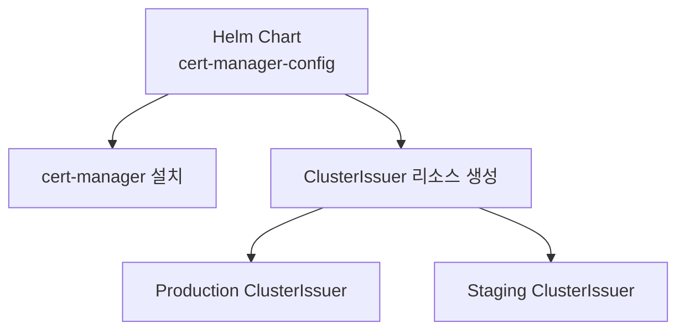
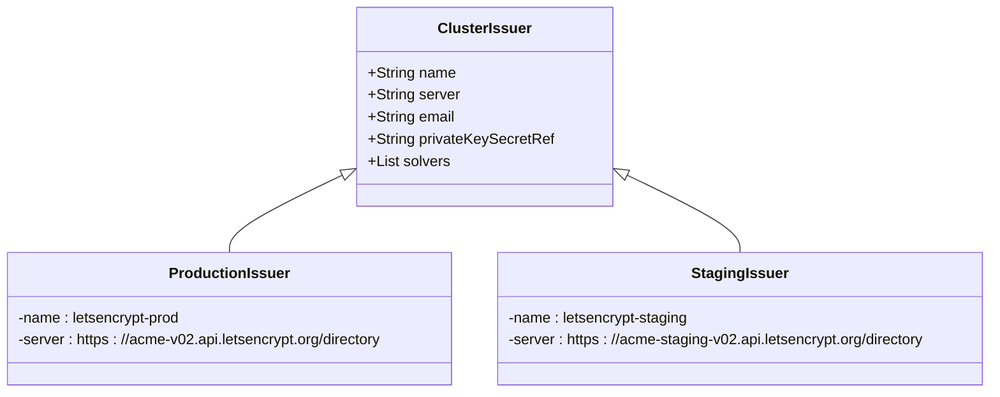
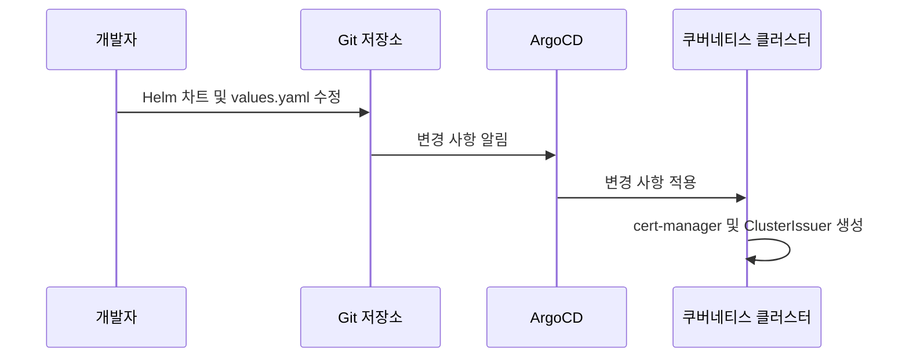

# cert-manager

<cite>
**이 문서에서 참조한 파일**
- [Chart.yaml](file://helm/cluster-services/cert-manager/Chart.yaml)
- [values.yaml](file://helm/cluster-services/cert-manager/values.yaml)
- [cluster-issuer-prod.yaml](file://helm/cluster-services/cert-manager/templates/cluster-issuer-prod.yaml)
- [cluster-issuer-staging.yaml](file://helm/cluster-services/cert-manager/templates/cluster-issuer-staging.yaml)
- [ingress-prod.yaml](file://environments/argocd/apps/ingress-prod.yaml)
- [ingress-stg.yaml](file://environments/argocd/apps/ingress-stg.yaml)
- [plate-llm/values-stg.yaml](file://helm/applications/plate-llm/values-stg.yaml)
</cite>

## 목차
1. [소개](#소개)
2. [설치 구조](#설치-구조)
3. [구성 옵션](#구성-옵션)
4. [ClusterIssuer 설정](#clusterissuer-설정)
5. [인증서 발급 및 갱신](#인증서-발급-및-갱신)
6. [문제 해결](#문제-해결)
7. [ArgoCD와의 통합](#argocd와의-통합)

## 소개
cert-manager는 쿠버네티스 클러스터 내에서 SSL/TLS 인증서를 자동으로 발급하고 갱신하는 오픈소스 솔루션입니다. 이 문서는 `prj-devops` 리포지토리에서 cert-manager를 어떻게 구성하고 운영하는지 상세히 설명합니다. Let's Encrypt와 같은 ACME 제공업체와의 통합, 다양한 인증서 유형 지원, GitOps 기반 관리 워크플로우까지 다룹니다.

## 설치 구조
cert-manager는 Helm 차트를 통해 설치되며, 해당 설정은 `helm/cluster-services/cert-manager/` 디렉터리에 위치합니다. 이 차트는 cert-manager 자체를 설치하고, 프로덕션 및 스테이징 환경을 위한 ClusterIssuer 리소스를 생성하는 데 사용됩니다.



**Diagram sources**
- [Chart.yaml](file://helm/cluster-services/cert-manager/Chart.yaml)
- [values.yaml](file://helm/cluster-services/cert-manager/values.yaml)

**이 섹션의 소스**
- [Chart.yaml](file://helm/cluster-services/cert-manager/Chart.yaml#L1-L23)
- [values.yaml](file://helm/cluster-services/cert-manager/values.yaml#L1-L35)

## 구성 옵션
cert-manager의 주요 구성은 `values.yaml` 파일을 통해 관리됩니다. 이 파일은 cert-manager의 설치 여부와 함께, 프로덕션 및 스테이징 환경을 위한 두 가지 ClusterIssuer의 설정을 포함합니다.

### 주요 구성 항목
- **cert-manager.install**: cert-manager 자체를 설치할지 여부를 결정합니다.
- **cert-manager.installCRDs**: cert-manager의 CRD(사용자 정의 리소스 정의)를 설치할지 여부를 결정합니다.
- **clusterIssuer.production**: 프로덕션 환경의 Let's Encrypt ClusterIssuer 설정입니다.
- **clusterIssuer.staging**: 스테이징 환경의 Let's Encrypt ClusterIssuer 설정입니다.

**이 섹션의 소스**
- [values.yaml](file://helm/cluster-services/cert-manager/values.yaml#L1-L35)

## ClusterIssuer 설정
ClusterIssuer는 클러스터 전체에서 사용할 수 있는 인증서 발급자를 정의합니다. `prj-devops`에서는 프로덕션과 스테이징 환경을 위해 별도의 ClusterIssuer를 설정하고 있습니다.

### 프로덕션 환경
- **이름**: `letsencrypt-prod`
- **서버 URL**: `https://acme-v02.api.letsencrypt.org/directory`
- **이메일**: `admin@example.com`
- **도전 방식**: HTTP-01 (Ingress를 통해 도전 토큰을 노출)

### 스테이징 환경
- **이름**: `letsencrypt-staging`
- **서버 URL**: `https://acme-staging-v02.api.letsencrypt.org/directory`
- **이메일**: `admin@example.com`
- **도전 방식**: HTTP-01 (Ingress를 통해 도전 토큰을 노출)



**Diagram sources**
- [values.yaml](file://helm/cluster-services/cert-manager/values.yaml#L12-L35)
- [cluster-issuer-prod.yaml](file://helm/cluster-services/cert-manager/templates/cluster-issuer-prod.yaml#L1-L20)
- [cluster-issuer-staging.yaml](file://helm/cluster-services/cert-manager/templates/cluster-issuer-staging.yaml#L1-L20)

**이 섹션의 소스**
- [values.yaml](file://helm/cluster-services/cert-manager/values.yaml#L12-L35)
- [cluster-issuer-prod.yaml](file://helm/cluster-services/cert-manager/templates/cluster-issuer-prod.yaml#L1-L20)
- [cluster-issuer-staging.yaml](file://helm/cluster-services/cert-manager/templates/cluster-issuer-staging.yaml#L1-L20)

## 인증서 발급 및 갱신
Ingress 리소스에 `cert-manager.io/cluster-issuer` 어노테이션을 추가하면 cert-manager가 자동으로 인증서를 발급하고 갱신합니다.

### 예시: plate-llm 서비스
`plate-llm` 서비스의 `values-stg.yaml` 파일을 보면, Ingress 설정에 다음과 같은 어노테이션이 포함되어 있습니다:
```yaml
annotations:
  cert-manager.io/cluster-issuer: "letsencrypt-prod"
  acme.cert-manager.io/http01-edit-in-place: "true"
```
이 설정은 `letsencrypt-prod` ClusterIssuer를 사용하여 `llm.cocdev.co.kr` 도메인의 인증서를 발급하도록 지시합니다.

**이 섹션의 소스**
- [plate-llm/values-stg.yaml](file://helm/applications/plate-llm/values-stg.yaml#L19-L34)

## 문제 해결
인증서 발급에 실패할 경우, 다음 단계를 따라 문제를 진단할 수 있습니다.

1. **Ingress 리소스 확인**: `kubectl describe ingress <ingress-name>` 명령으로 Ingress 리소스의 상태와 이벤트를 확인합니다.
2. **Certificate 리소스 확인**: `kubectl describe certificate <certificate-name>` 명령으로 인증서 리소스의 상태와 이벤트를 확인합니다.
3. **cert-manager 컨트롤러 로그 확인**: `kubectl logs -n cert-manager <cert-manager-pod-name>` 명령으로 cert-manager 컨트롤러의 로그를 확인합니다.

**이 섹션의 소스**
- [plate-llm/values-stg.yaml](file://helm/applications/plate-llm/values-stg.yaml#L23-L25)

## ArgoCD와의 통합
cert-manager의 구성은 ArgoCD를 통해 GitOps 방식으로 관리됩니다. `environments/argocd/apps/` 디렉터리에 있는 ArgoCD Application 리소스가 cert-manager Helm 차트를 추적하고, Git 저장소의 변경 사항을 클러스터에 자동으로 동기화합니다.



**Diagram sources**
- [ingress-prod.yaml](file://environments/argocd/apps/ingress-prod.yaml#L1-L81)
- [ingress-stg.yaml](file://environments/argocd/apps/ingress-stg.yaml#L1-L70)

**이 섹션의 소스**
- [ingress-prod.yaml](file://environments/argocd/apps/ingress-prod.yaml#L1-L81)
- [ingress-stg.yaml](file://environments/argocd/apps/ingress-stg.yaml#L1-L70)