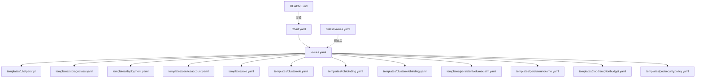
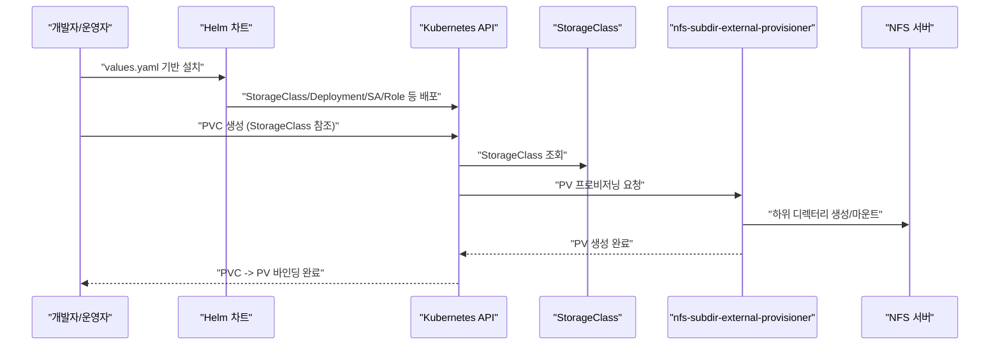
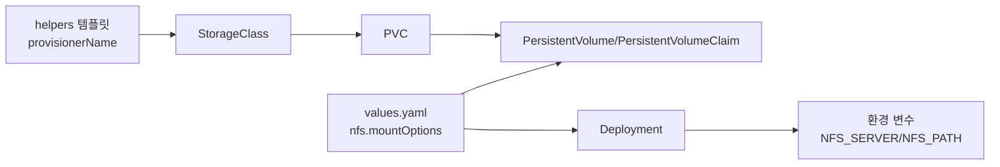

# nfs-provisioner

<cite>
**이 문서에서 참조하는 파일**
- [Chart.yaml](file://helm/cluster-services/nfs-provisioner/Chart.yaml)
- [values.yaml](file://helm/cluster-services/nfs-provisioner/values.yaml)
- [README.md](file://helm/cluster-services/nfs-provisioner/README.md)
- [templates/storageclass.yaml](file://helm/cluster-services/nfs-provisioner/templates/storageclass.yaml)
- [templates/deployment.yaml](file://helm/cluster-services/nfs-provisioner/templates/deployment.yaml)
- [templates/_helpers.tpl](file://helm/cluster-services/nfs-provisioner/templates/_helpers.tpl)
- [templates/persistentvolume.yaml](file://helm/cluster-services/nfs-provisioner/templates/persistentvolume.yaml)
- [templates/persistentvolumeclaim.yaml](file://helm/cluster-services/nfs-provisioner/templates/persistentvolumeclaim.yaml)
- [ci/test-values.yaml](file://helm/cluster-services/nfs-provisioner/ci/test-values.yaml)
</cite>

## 목차
1. [소개](#소개)
2. [프로젝트 구조](#프로젝트-구조)
3. [핵심 컴포넌트](#핵심-컴포넌트)
4. [아키텍처 개요](#아키텍처-개요)
5. [상세 컴포넌트 분석](#상세-컴포넌트-분석)
6. [의존성 분석](#의존성-분석)
7. [성능 고려사항](#성능-고려사항)
8. [장애 대응 가이드](#장애-대응-가이드)
9. [결론](#결론)
10. [부록](#부록)

## 소개
본 문서는 Kubernetes 클러스터 내에서 NFS 기반 동적 스토리지 프로비저닝을 제공하는 Helm 차트인 nfs-provisioner에 대해 설명합니다. 이 차트는 기존에 구성된 NFS 서버를 사용하여, PersistentVolumeClaim(PVC) 요청에 따라 자동으로 PersistentVolume(PV)을 프로비저닝하고, StorageClass를 통해 PVC가 PV를 바인딩할 수 있도록 합니다. 또한 Chart.yaml 기반 설치 구조, values.yaml을 통한 구성 옵션(스토리지 용량, NFS 서버 설정 등), deployment.yaml 기반의 NFS 서버 배포 방식, 그리고 다중 노드 환경에서의 데이터 접근성 보장 방법, 성능 최적화 전략, 백업 및 복구 절차, 모니터링 방법을 포함합니다.

## 프로젝트 구조
nfs-provisioner 차트는 Helm 템플릿 기반으로 구성되어 있으며, 핵심 파일은 다음과 같습니다:
- Chart.yaml: 차트 버전, 의존성, 지원 K8s 버전 정보
- values.yaml: 기본 구성 옵션 (replicaCount, 이미지, NFS 서버, StorageClass, RBAC, 리소스 제약 등)
- templates/: 실제 Kubernetes 리소스 템플릿들 (StorageClass, Deployment, ServiceAccount, Role/ClusterRole, PVC/PV, PDB, PSP)
- README.md: 설치 안내, 파라미터 설명, 다중 프로비저너 설치 방법
- ci/test-values.yaml: CI 테스트용 values 예시

**도표 출처**
- [Chart.yaml](file://helm/cluster-services/nfs-provisioner/Chart.yaml#L1-L14)
- [values.yaml](file://helm/cluster-services/nfs-provisioner/values.yaml#L1-L115)
- [templates/_helpers.tpl](file://helm/cluster-services/nfs-provisioner/templates/_helpers.tpl#L1-L104)
- [templates/storageclass.yaml](file://helm/cluster-services/nfs-provisioner/templates/storageclass.yaml#L1-L34)
- [templates/deployment.yaml](file://helm/cluster-services/nfs-provisioner/templates/deployment.yaml#L1-L84)
- [templates/persistentvolume.yaml](file://helm/cluster-services/nfs-provisioner/templates/persistentvolume.yaml#L1-L27)
- [templates/persistentvolumeclaim.yaml](file://helm/cluster-services/nfs-provisioner/templates/persistentvolumeclaim.yaml#L1-L20)
- [README.md](file://helm/cluster-services/nfs-provisioner/README.md#L1-L102)
- [ci/test-values.yaml](file://helm/cluster-services/nfs-provisioner/ci/test-values.yaml#L1-L6)

**섹션 출처**
- [Chart.yaml](file://helm/cluster-services/nfs-provisioner/Chart.yaml#L1-L14)
- [values.yaml](file://helm/cluster-services/nfs-provisioner/values.yaml#L1-L115)
- [README.md](file://helm/cluster-services/nfs-provisioner/README.md#L1-L102)

## 핵심 컴포넌트
- StorageClass: PVC에 의해 동적으로 PV를 생성하는 프로비저너를 지정하며, reclaimPolicy, volumeBindingMode, accessModes 등을 설정합니다.
- Deployment: nfs-subdir-external-provisioner 컨테이너를 실행하고, NFS 서버 정보를 환경 변수로 전달합니다.
- ServiceAccount, Role/ClusterRole, RoleBinding/ClusterRoleBinding: RBAC 권한 부여를 통해 프로비저너가 PV/PVC 관리를 할 수 있도록 합니다.
- PVC/PV (조건부): mountOptions이 설정된 경우, 루트 PV와 PVC를 미리 생성하여 프로비저너가 하위 디렉터리를 관리할 수 있도록 합니다.
- PDB/PSP: 장애 격리 및 보안 정책 적용을 위한 선택적 리소스입니다.

**섹션 출처**
- [templates/storageclass.yaml](file://helm/cluster-services/nfs-provisioner/templates/storageclass.yaml#L1-L34)
- [templates/deployment.yaml](file://helm/cluster-services/nfs-provisioner/templates/deployment.yaml#L1-L84)
- [templates/_helpers.tpl](file://helm/cluster-services/nfs-provisioner/templates/_helpers.tpl#L1-L104)
- [templates/persistentvolume.yaml](file://helm/cluster-services/nfs-provisioner/templates/persistentvolume.yaml#L1-L27)
- [templates/persistentvolumeclaim.yaml](file://helm/cluster-services/nfs-provisioner/templates/persistentvolumeclaim.yaml#L1-L20)

## 아키텍처 개요
nfs-provisioner는 PVC가 생성되면 StorageClass에 의해 프로비저너가 동작하고, NFS 서버에서 지정된 경로에 하위 디렉터리를 생성하여 PV를 프로비저닝합니다. PVC는 StorageClass를 통해 PV에 바인딩되고, Pod는 PVC를 마운트하여 사용합니다.

**도표 출처**
- [templates/storageclass.yaml](file://helm/cluster-services/nfs-provisioner/templates/storageclass.yaml#L1-L34)
- [templates/deployment.yaml](file://helm/cluster-services/nfs-provisioner/templates/deployment.yaml#L1-L84)
- [values.yaml](file://helm/cluster-services/nfs-provisioner/values.yaml#L1-L115)

## 상세 컴포넌트 분석

### StorageClass 구성
- 프로비저너 이름: helpers 템플릿에 의해 자동 또는 명시적으로 설정됩니다.
- 기본 StorageClass 여부: defaultClass 플래그에 따라 설정 가능합니다.
- 확장 가능 여부: allowVolumeExpansion으로 PVC 크기 조절 가능 여부 결정.
- 회수 정책: reclaimPolicy로 PV 회수 방식 지정.
- 볼륨 바인딩 모드: volumeBindingMode으로 Immediate 또는 WaitForFirstConsumer 선택.
- 매개변수:
  - archiveOnDelete: PVC 삭제 시 디렉터리 보관 여부.
  - pathPattern: PVC 메타데이터를 기반으로 하위 디렉터리 경로 패턴 지정.
  - onDelete: 'delete' 또는 'retain'으로 PVC 삭제 시 행동 재정의.
  - mountOptions: NFS 마운트 옵션 배열 전달.

**섹션 출처**
- [templates/storageclass.yaml](file://helm/cluster-services/nfs-provisioner/templates/storageclass.yaml#L1-L34)
- [templates/_helpers.tpl](file://helm/cluster-services/nfs-provisioner/templates/_helpers.tpl#L34-L40)
- [values.yaml](file://helm/cluster-services/nfs-provisioner/values.yaml#L19-L60)

### Deployment 및 NFS 서버 연결
- 컨테이너 이미지: values.yaml의 image.repository/tag/pullPolicy에 따라 설정.
- 환경 변수:
  - PROVISIONER_NAME: 프로비저너 이름 (helpers 템플릿).
  - NFS_SERVER/NFS_PATH: values.yaml의 nfs.server/path.
  - ENABLE_LEADER_ELECTION: leaderElection.enabled에 따라 활성화 여부.
- 볼륨 마운트:
  - /persistentvolumes에 nfs 또는 PVC를 마운트.
  - nfs.mountOptions이 없으면 NFS 직접 마운트, 있으면 PVC/PV를 사용.
- 리소스 제약: resources에 CPU/메모리 제한 및 요청 설정 가능.
- 노드 스케줄링: nodeSelector/affinity/tolerations를 통한 위치 제어.

**섹션 출처**
- [templates/deployment.yaml](file://helm/cluster-services/nfs-provisioner/templates/deployment.yaml#L1-L84)
- [templates/_helpers.tpl](file://helm/cluster-services/nfs-provisioner/templates/_helpers.tpl#L34-L40)
- [values.yaml](file://helm/cluster-services/nfs-provisioner/values.yaml#L1-L115)

### PVC/PV (mountOptions 사용 시)
- mountOptions이 설정된 경우, 미리 PV/PVC를 생성하여 프로비저너가 하위 디렉터리를 관리할 수 있도록 합니다.
- PV 용량은 10Mi로 고정되어 있으며, PVC 요청 용량은 프로비저너가 생성하는 하위 디렉터리 기준으로 작동합니다.

**섹션 출처**
- [templates/persistentvolume.yaml](file://helm/cluster-services/nfs-provisioner/templates/persistentvolume.yaml#L1-L27)
- [templates/persistentvolumeclaim.yaml](file://helm/cluster-services/nfs-provisioner/templates/persistentvolumeclaim.yaml#L1-L20)
- [values.yaml](file://helm/cluster-services/nfs-provisioner/values.yaml#L13-L16)

### RBAC 및 보안
- ServiceAccount, Role/ClusterRole, RoleBinding/ClusterRoleBinding 템플릿이 존재하여 프로비저너에 필요한 권한을 부여합니다.
- podSecurityPolicy.enabled는 values.yaml에서 설정 가능하며, PSP 리소스 템플릿도 함께 제공됩니다.

**섹션 출처**
- [templates/serviceaccount.yaml](file://helm/cluster-services/nfs-provisioner/templates/serviceaccount.yaml)
- [templates/role.yaml](file://helm/cluster-services/nfs-provisioner/templates/role.yaml)
- [templates/clusterrole.yaml](file://helm/cluster-services/nfs-provisioner/templates/clusterrole.yaml)
- [templates/rolebinding.yaml](file://helm/cluster-services/nfs-provisioner/templates/rolebinding.yaml)
- [templates/clusterrolebinding.yaml](file://helm/cluster-services/nfs-provisioner/templates/clusterrolebinding.yaml)
- [templates/podsecuritypolicy.yaml](file://helm/cluster-services/nfs-provisioner/templates/podsecuritypolicy.yaml)
- [values.yaml](file://helm/cluster-services/nfs-provisioner/values.yaml#L64-L73)

### 다중 노드 환경에서의 데이터 접근성 보장
- NFS 서버는 클러스터 외부에 존재해야 하며, 모든 워커 노드에서 동일한 NFS 경로에 접근 가능해야 합니다.
- Deployment의 tolerations/affinity/nodeSelector를 활용해 프로비저너를 특정 노드에 배치하거나, PVC의 volumeBindingMode를 WaitForFirstConsumer으로 설정하면 Pod가 실제 사용될 노드에서 PV가 바인딩되어 접근성을 높일 수 있습니다.
- leaderElection.enabled를 통해 프로비저너 인스턴스 간 선거를 통해 안정적인 동작을 보장할 수 있습니다.

**섹션 출처**
- [templates/deployment.yaml](file://helm/cluster-services/nfs-provisioner/templates/deployment.yaml#L1-L84)
- [values.yaml](file://helm/cluster-services/nfs-provisioner/values.yaml#L55-L60)

### 설치 및 구성 절차
- 설치: Helm을 통해 차트를 설치하고, nfs.server와 nfs.path를 values.yaml 또는 --set으로 지정합니다.
- StorageClass 자동 생성: storageClass.create=true로 설정하면 StorageClass가 자동으로 배포됩니다.
- 기본 StorageClass 설정: storageClass.defaultClass=true로 하면 해당 StorageClass가 클러스터 기본 StorageClass가 됩니다.
- PVC 크기 조절: allowVolumeExpansion=true로 설정하면 PVC 크기를 확장할 수 있습니다.

**섹션 출처**
- [README.md](file://helm/cluster-services/nfs-provisioner/README.md#L1-L102)
- [values.yaml](file://helm/cluster-services/nfs-provisioner/values.yaml#L19-L60)

### CI 테스트 구성
- ci/test-values.yaml에서는 nfs.server, podSecurityPolicy.enabled, buildMode를 설정하여 테스트 환경을 구성합니다.

**섹션 출처**
- [ci/test-values.yaml](file://helm/cluster-services/nfs-provisioner/ci/test-values.yaml#L1-L6)

## 의존성 분석
- 프로비저너 이름: helpers 템플릿에 의해 StorageClass.provisionerName 또는 기본적으로 cluster.local/<fullname> 형식으로 설정됩니다.
- PVC/PV: nfs.mountOptions이 설정되었을 때만 PV/PVC 템플릿이 활성화되며, 이는 프로비저너가 하위 디렉터리를 관리하기 위한 준비 단계입니다.
- K8s 버전 호환성: helpers 템플릿에 따라 PSP/PDB API 버전이 K8s 버전에 따라 달라집니다.

**도표 출처**
- [templates/_helpers.tpl](file://helm/cluster-services/nfs-provisioner/templates/_helpers.tpl#L34-L40)
- [templates/storageclass.yaml](file://helm/cluster-services/nfs-provisioner/templates/storageclass.yaml#L1-L34)
- [templates/persistentvolume.yaml](file://helm/cluster-services/nfs-provisioner/templates/persistentvolume.yaml#L1-L27)
- [templates/persistentvolumeclaim.yaml](file://helm/cluster-services/nfs-provisioner/templates/persistentvolumeclaim.yaml#L1-L20)
- [templates/deployment.yaml](file://helm/cluster-services/nfs-provisioner/templates/deployment.yaml#L1-L84)
- [values.yaml](file://helm/cluster-services/nfs-provisioner/values.yaml#L1-L115)

**섹션 출처**
- [templates/_helpers.tpl](file://helm/cluster-services/nfs-provisioner/templates/_helpers.tpl#L1-L104)
- [templates/storageclass.yaml](file://helm/cluster-services/nfs-provisioner/templates/storageclass.yaml#L1-L34)
- [templates/deployment.yaml](file://helm/cluster-services/nfs-provisioner/templates/deployment.yaml#L1-L84)
- [templates/persistentvolume.yaml](file://helm/cluster-services/nfs-provisioner/templates/persistentvolume.yaml#L1-L27)
- [templates/persistentvolumeclaim.yaml](file://helm/cluster-services/nfs-provisioner/templates/persistentvolumeclaim.yaml#L1-L20)
- [values.yaml](file://helm/cluster-services/nfs-provisioner/values.yaml#L1-L115)

## 성능 고려사항
- 마운트 옵션: nfs.mountOptions을 통해 NFS 버전, sync/async, rsize/wsize 등을 조정하여 네트워크 성능을 최적화할 수 있습니다.
- 볼륨 바인딩 모드: volumeBindingMode를 WaitForFirstConsumer으로 설정하면 Pod가 실제 사용될 노드에서 PV가 바인딩되어 I/O 패턴에 맞춘 위치 배치가 가능합니다.
- 확장 가능한 볼륨: allowVolumeExpansion=true로 설정하면 PVC 크기를 필요에 따라 확장할 수 있어 성능 저하를 줄일 수 있습니다.
- 리소스 제약: Deployment에 resources를 설정하여 CPU/메모리 제한을 두어 프로비저너의 안정적인 동작을 도모할 수 있습니다.
- 리더 선거: leaderElection.enabled=true로 설정하면 프로비저너 인스턴스 간 경쟁을 피하고 안정적인 프로비저닝이 가능합니다.

**섹션 출처**
- [values.yaml](file://helm/cluster-services/nfs-provisioner/values.yaml#L13-L16)
- [templates/storageclass.yaml](file://helm/cluster-services/nfs-provisioner/templates/storageclass.yaml#L1-L34)
- [templates/deployment.yaml](file://helm/cluster-services/nfs-provisioner/templates/deployment.yaml#L1-L84)

## 장애 대응 가이드
- PVC가 PV로 바인딩되지 않는 경우:
  - StorageClass의 provisionerName이 올바른지 확인합니다.
  - Deployment 로그에서 NFS 서버/경로 연결 여부를 점검합니다.
  - nfs.mountOptions이 설정되었고 PV/PVC가 생성되었는지 확인합니다.
- PVC 확장 실패:
  - allowVolumeExpansion이 true인지 확인하고, StorageClass의 reclaimPolicy가 Delete인지 확인합니다.
- 프로비저너 다중화 시 충돌:
  - 각 프로비저너의 storageClass.provisionerName과 storageClass.name이 서로 다른지 확인합니다.
- RBAC 문제:
  - ServiceAccount/Role/ClusterRole/Binding이 모두 생성되었는지 확인하고, 권한이 부여되었는지 검토합니다.

**섹션 출처**
- [templates/storageclass.yaml](file://helm/cluster-services/nfs-provisioner/templates/storageclass.yaml#L1-L34)
- [templates/deployment.yaml](file://helm/cluster-services/nfs-provisioner/templates/deployment.yaml#L1-L84)
- [README.md](file://helm/cluster-services/nfs-provisioner/README.md#L91-L102)

## 결론
nfs-provisioner는 기존 NFS 서버를 활용하여 PVC에 대한 동적 PV 프로비저닝을 실현하는 효율적인 솔루션입니다. Chart.yaml과 values.yaml을 통해 설치 및 구성이 간편하며, StorageClass를 통한 PVC-PV 바인딩과 Deployment를 통한 프로비저너 운영이 명확하게 분리되어 있습니다. 복잡한 NFS 서버 관리 없이 Kubernetes 내에서 안정적이고 확장 가능한 스토리지를 제공할 수 있습니다.

## 부록
- 설치 및 구성 요약
  - Helm 차트 버전: Chart.yaml 참조
  - 기본 이미지: registry.k8s.io/sig-storage/nfs-subdir-external-provisioner:v4.0.2
  - NFS 서버 주소/경로: values.yaml의 nfs.server, nfs.path
  - StorageClass 이름: values.yaml의 storageClass.name (기본 nfs-client)
  - PVC 확장 가능 여부: values.yaml의 storageClass.allowVolumeExpansion
  - 기본 StorageClass 설정: values.yaml의 storageClass.defaultClass
  - 리더 선거: values.yaml의 leaderElection.enabled

**섹션 출처**
- [Chart.yaml](file://helm/cluster-services/nfs-provisioner/Chart.yaml#L1-L14)
- [values.yaml](file://helm/cluster-services/nfs-provisioner/values.yaml#L1-L115)
- [README.md](file://helm/cluster-services/nfs-provisioner/README.md#L1-L102)