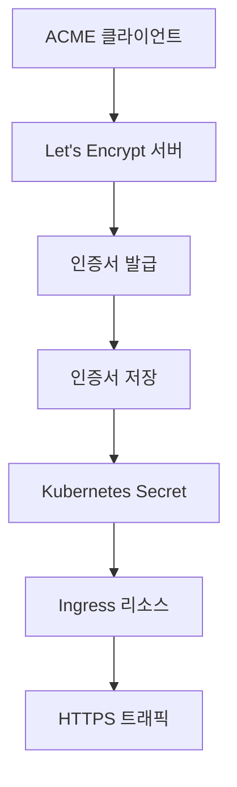
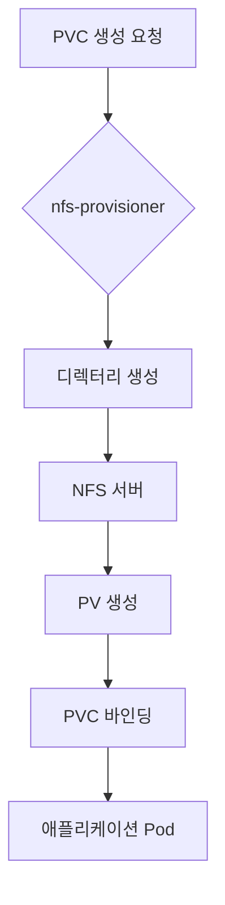

# 클러스터 서비스

<cite>
**이 문서에서 참조한 파일**  
- [cert-manager/Chart.yaml](file://helm/cluster-services/cert-manager/Chart.yaml)
- [cert-manager/values.yaml](file://helm/cluster-services/cert-manager/values.yaml)
- [cert-manager/templates/cluster-issuer-prod.yaml](file://helm/cluster-services/cert-manager/templates/cluster-issuer-prod.yaml)
- [cert-manager/templates/cluster-issuer-staging.yaml](file://helm/cluster-services/cert-manager/templates/cluster-issuer-staging.yaml)
- [metallb/metallb-native.yaml](file://helm/cluster-services/metallb/metallb-native.yaml)
- [metallb/pool-1.yaml](file://helm/cluster-services/metallb/pool-1.yaml)
- [metallb/l2advertisement.yaml](file://helm/cluster-services/metallb/l2advertisement.yaml)
- [metallb/set-ipvs-mode.sh](file://helm/cluster-services/metallb/set-ipvs-mode.sh)
- [nfs-provisioner/Chart.yaml](file://helm/cluster-services/nfs-provisioner/Chart.yaml)
- [nfs-provisioner/values.yaml](file://helm/cluster-services/nfs-provisioner/values.yaml)
- [nfs-provisioner/templates/deployment.yaml](file://helm/cluster-services/nfs-provisioner/templates/deployment.yaml)
- [nfs-provisioner/templates/storageclass.yaml](file://helm/cluster-services/nfs-provisioner/templates/storageclass.yaml)
- [nfs-provisioner/README.md](file://helm/cluster-services/nfs-provisioner/README.md)
</cite>

## 목차
1. [소개](#소개)
2. [cert-manager를 통한 SSL/TLS 인증서 자동 관리](#cert-manager를-통한-ssltls-인증서-자동-관리)
3. [MetalLB를 활용한 클러스터 외부 서비스 노출](#metallb를-활용한-클러스터-외부-서비스-노출)
4. [nfs-provisioner를 통한 동적 스토리지 프로비저닝](#nfs-provisioner를-통한-동적-스토리지-프로비저닝)
5. [설치 시 고려사항](#설치-시-고려사항)
6. [운영 중 모니터링 포인트](#운영-중-모니터링-포인트)
7. [일반적인 문제 해결 방법](#일반적인-문제-해결-방법)
8. [결론](#결론)

## 소개
prj-devops 리포지토리의 클러스터 서비스 계층은 cert-manager, MetalLB, nfs-provisioner 세 가지 핵심 구성 요소로 구성되어 있으며, 각각 SSL/TLS 인증서 자동 관리, 클러스터 외부 서비스 노출, 동적 스토리지 프로비저닝 기능을 제공합니다. 이 문서는 각 서비스의 Helm 차트 기반 기술적 세부 사항과 구성 옵션을 분석하고, 실제 배포 시나리오에서의 역할과 상호작용을 설명합니다. 또한 설치 시 고려사항, 운영 중 모니터링 포인트, 일반적인 문제 해결 방법을 포함합니다.

## cert-manager를 통한 SSL/TLS 인증서 자동 관리

cert-manager는 Kubernetes 클러스터에서 SSL/TLS 인증서를 자동으로 관리하는 오픈소스 솔루션입니다. 이 서비스는 Let's Encrypt와 같은 ACME 프로바이더를 통해 인증서를 자동으로 발급하고 갱신하며, 클러스터 내 서비스에 대한 안전한 HTTPS 연결을 보장합니다. prj-devops에서는 cert-manager Helm 차트를 사용하여 인증서 관리 기능을 구현하고 있습니다.

### 기술적 세부 사항
`cert-manager/Chart.yaml` 파일은 이 Helm 차트의 메타데이터를 정의하며, cert-manager의 메인 차트를 종속성으로 포함하고 있습니다. 이 차트는 `cert-manager`라는 이름의 애플리케이션으로, 버전 0.1.0을 사용하며, cert-manager의 1.13.0 버전을 설치하도록 구성되어 있습니다. Chart.yaml 파일은 cert-manager의 공식 저장소(https://charts.jetstack.io)를 참조하여 설치를 수행합니다.

**Diagram sources**
- [cert-manager/Chart.yaml](file://helm/cluster-services/cert-manager/Chart.yaml)
- [cert-manager/values.yaml](file://helm/cluster-services/cert-manager/values.yaml)

### 구성 옵션
`values.yaml` 파일은 cert-manager의 주요 구성 옵션을 정의합니다. 이 파일은 두 가지 클러스터 발급자(ClusterIssuer)를 설정합니다: 프로덕션용 `letsencrypt-prod`과 스테이징용 `letsencrypt-staging`. 프로덕션 발급자는 Let's Encrypt의 공식 디렉터리인 `https://acme-v02.api.letsencrypt.org/directory`를 사용하며, 스테이징 발급자는 테스트를 위한 `https://acme-staging-v02.api.letsencrypt.org/directory`를 사용합니다. 두 발급자 모두 `http01` 챌린지 타입을 사용하여 인증서를 검증하며, Nginx Ingress 컨트롤러를 통해 HTTP 요청을 처리합니다.

`templates/cluster-issuer-prod.yaml` 및 `templates/cluster-issuer-staging.yaml` 템플릿 파일은 `values.yaml`에서 정의된 설정을 기반으로 `ClusterIssuer` 리소스를 생성합니다. 이러한 템플릿은 Helm의 조건문(`if`)을 사용하여 발급자가 활성화된 경우에만 리소스를 생성합니다. 인증서의 개인 키는 `privateKeySecretRef`를 통해 Kubernetes Secret에 저장되며, 이는 인증서의 보안을 보장합니다.

**Section sources**
- [cert-manager/Chart.yaml](file://helm/cluster-services/cert-manager/Chart.yaml#L1-L23)
- [cert-manager/values.yaml](file://helm/cluster-services/cert-manager/values.yaml#L1-L35)
- [cert-manager/templates/cluster-issuer-prod.yaml](file://helm/cluster-services/cert-manager/templates/cluster-issuer-prod.yaml#L1-L20)
- [cert-manager/templates/cluster-issuer-staging.yaml](file://helm/cluster-services/cert-manager/templates/cluster-issuer-staging.yaml#L1-L20)

## MetalLB를 활용한 클러스터 외부 서비스 노출

MetalLB는 bare-metal Kubernetes 클러스터에서 `LoadBalancer` 유형의 서비스를 지원하는 네트워크 솔루션입니다. 클라우드 환경이 아닌 물리적 서버 또는 가상 머신에서 실행되는 클러스터에서 외부 트래픽을 서비스에 노출하기 위해 필수적인 역할을 합니다. MetalLB는 IP 주소 풀을 관리하고, 클러스터 외부에서 접근 가능한 IP 주소를 `LoadBalancer` 서비스에 할당합니다.

### 기술적 세부 사항
`metallb-native.yaml` 파일은 MetalLB의 핵심 구성 요소인 여러 개의 CustomResourceDefinition(CRD)을 정의합니다. 이 파일은 `IPAddressPool`, `L2Advertisement`, `BGPPeer` 등의 리소스를 생성하여 MetalLB의 동작을 구성합니다. CRD는 MetalLB가 클러스터 내에서 고유한 리소스 타입을 관리할 수 있도록 하며, IP 주소 할당 및 광고 메커니즘을 구현합니다.

MetalLB는 두 가지 모드를 지원합니다: L2(Layer 2) 모드와 BGP(Border Gateway Protocol) 모드. prj-devops에서는 L2 모드를 사용하고 있습니다. 이 모드는 ARP(Address Resolution Protocol)를 사용하여 클러스터 외부의 라우터에 IP 주소를 광고합니다. `pool-1.yaml` 파일은 IP 주소 풀을 정의하며, `192.168.0.20`부터 `192.168.0.200`까지의 범위를 포함합니다. `l2advertisement.yaml` 파일은 이 IP 풀을 광고하는 방법을 정의하며, `first-pool`이라는 이름의 IP 풀을 `metallb-system` 네임스페이스에서 광고합니다.

**Diagram sources**
- [metallb/metallb-native.yaml](file://helm/cluster-services/metallb/metallb-native.yaml#L1-L800)
- [metallb/pool-1.yaml](file://helm/cluster-services/metallb/pool-1.yaml#L1-L8)
- [metallb/l2advertisement.yaml](file://helm/cluster-services/metallb/l2advertisement.yaml#L1-L9)

### 구성 옵션
MetalLB의 구성은 주로 YAML 매니페스트 파일을 통해 이루어집니다. `pool-1.yaml`에서 정의된 `IPAddressPool`은 `addresses` 필드를 통해 IP 주소 범위를 지정합니다. `l2advertisement.yaml`에서 정의된 `L2Advertisement`는 `ipAddressPools` 필드를 통해 어떤 IP 풀을 광고할지 지정합니다. MetalLB는 `kube-proxy`의 설정도 필요로 하며, `set-ipvs-mode.sh` 스크립트는 `kube-proxy`의 `strictARP` 설정을 `true`로 변경하여 MetalLB가 올바르게 작동하도록 합니다. 이 스크립트는 `kubectl patch` 명령을 사용하여 `kube-proxy` ConfigMap을 수정합니다.

**Section sources**
- [metallb/metallb-native.yaml](file://helm/cluster-services/metallb/metallb-native.yaml#L1-L800)
- [metallb/pool-1.yaml](file://helm/cluster-services/metallb/pool-1.yaml#L1-L8)
- [metallb/l2advertisement.yaml](file://helm/cluster-services/metallb/l2advertisement.yaml#L1-L9)
- [metallb/set-ipvs-mode.sh](file://helm/cluster-services/metallb/set-ipvs-mode.sh#L1-L10)

## nfs-provisioner를 통한 동적 스토리지 프로비저닝

nfs-provisioner는 기존에 설정된 NFS 서버를 기반으로 Kubernetes 클러스터 내에서 동적 스토리지 프로비저닝을 가능하게 하는 구성 요소입니다. 이 서비스는 사용자가 PVC(PersistentVolumeClaim)를 생성할 때마다, NFS 서버의 지정된 경로에 자동으로 디렉터리를 생성하고, 이를 PV(PersistentVolume)로 매핑하여 스토리지 리소스를 제공합니다.

### 기술적 세부 사항
`nfs-provisioner/Chart.yaml` 파일은 이 Helm 차트의 메타데이터를 정의하며, `nfs-subdir-external-provisioner`라는 이름의 애플리케이션으로, 버전 4.0.18을 사용합니다. 이 차트는 Kubernetes 1.9.0 이상을 요구하며, 공식 GitHub 저장소(https://github.com/kubernetes-sigs/nfs-subdir-external-provisioner)를 참조합니다.

`templates/deployment.yaml` 파일은 nfs-provisioner의 핵심인 `Deployment` 리소스를 정의합니다. 이 Deployment는 `replicaCount`에 따라 하나 이상의 Pod를 실행하며, 각 Pod는 NFS 서버에 연결하여 스토리지 프로비저닝을 수행합니다. Pod는 `PROVISIONER_NAME`, `NFS_SERVER`, `NFS_PATH` 등의 환경 변수를 통해 NFS 서버 정보를 전달받습니다. `volumeMounts`를 통해 NFS 볼륨을 `/persistentvolumes` 경로에 마운트하며, PVC 생성 시 이 경로 하위에 디렉터리를 생성합니다.

**Diagram sources**
- [nfs-provisioner/Chart.yaml](file://helm/cluster-services/nfs-provisioner/Chart.yaml#L1-L14)
- [nfs-provisioner/templates/deployment.yaml](file://helm/cluster-services/nfs-provisioner/templates/deployment.yaml#L1-L74)
- [nfs-provisioner/templates/storageclass.yaml](file://helm/cluster-services/nfs-provisioner/templates/storageclass.yaml#L1-L33)

### 구성 옵션
`values.yaml` 파일은 nfs-provisioner의 주요 구성 옵션을 정의합니다. `nfs.server`와 `nfs.path`는 NFS 서버의 IP 주소와 공유 경로를 지정합니다. 현재 설정에서는 서버 주소가 `192.168.97`로, 경로가 `/export/k8s`로 되어 있으나, 서버 주소의 마지막 옥텟이 누락된 것으로 보입니다. `storageClass.create`가 `true`로 설정되어 있어, Helm 설치 시 자동으로 `StorageClass` 리소스가 생성됩니다. `storageClass.name`은 `nfs-client`로 설정되어 있으며, 이 이름은 PVC에서 `storageClassName`으로 참조됩니다. `storageClass.reclaimPolicy`는 `Delete`로 설정되어 있어, PVC가 삭제되면 해당 디렉터리도 NFS 서버에서 삭제됩니다. `storageClass.archiveOnDelete`가 `true`로 설정되어 있어, 삭제 전에 디렉터리를 보관할 수 있습니다.

**Section sources**
- [nfs-provisioner/Chart.yaml](file://helm/cluster-services/nfs-provisioner/Chart.yaml#L1-L14)
- [nfs-provisioner/values.yaml](file://helm/cluster-services/nfs-provisioner/values.yaml#L1-L52)
- [nfs-provisioner/templates/deployment.yaml](file://helm/cluster-services/nfs-provisioner/templates/deployment.yaml#L1-L74)
- [nfs-provisioner/templates/storageclass.yaml](file://helm/cluster-services/nfs-provisioner/templates/storageclass.yaml#L1-L33)
- [nfs-provisioner/README.md](file://helm/cluster-services/nfs-provisioner/README.md#L1-L102)

## 설치 시 고려사항

각 클러스터 서비스를 설치할 때는 다음과 같은 사항을 고려해야 합니다.

- **cert-manager**: 설치 전에 `CustomResourceDefinition` (CRD)을 먼저 적용해야 합니다. `values.yaml`에서 `cert-manager.installCRDs` 값을 `true`로 설정하면 Helm 차트가 자동으로 CRD를 설치합니다. `ClusterIssuer`의 이메일 주소는 유효한 주소로 설정해야 하며, Let's Encrypt에서 중요한 알림을 보낼 수 있습니다. `http01` 챌린지를 사용할 경우, Ingress 리소스가 정상적으로 작동하고 외부에서 접근 가능해야 합니다.
- **MetalLB**: 설치 전에 `kube-proxy`의 `strictARP` 설정을 `true`로 변경해야 합니다. `set-ipvs-mode.sh` 스크립트를 실행하여 이 설정을 적용할 수 있습니다. IP 주소 풀은 클러스터 외부 네트워크에서 사용되지 않는 범위로 설정해야 하며, 중복 IP 주소 문제를 방지해야 합니다. L2 모드를 사용할 경우, 모든 노드가 동일한 레이어 2 도메인에 있어야 합니다.
- **nfs-provisioner**: 설치 전에 NFS 서버가 정상적으로 설정되어 있어야 하며, 지정된 경로가 읽기/쓰기 권한을 가지고 있어야 합니다. `values.yaml`에서 `nfs.server`와 `nfs.path`를 정확히 설정해야 합니다. RBAC가 활성화되어 있어야 하며, `rbac.create` 값을 `true`로 설정해야 합니다. `StorageClass`가 자동 생성되도록 `storageClass.create` 값을 `true`로 설정해야 합니다.

## 운영 중 모니터링 포인트

클러스터 서비스를 운영할 때는 다음과 같은 포인트를 모니터링해야 합니다.

- **cert-manager**: `Certificate` 리소스의 상태를 주기적으로 확인해야 합니다. `kubectl get certificate` 명령을 사용하여 인증서의 발급 상태, 만료일 등을 확인할 수 있습니다. `cert-manager` 네임스페이스의 컨트롤러 Pod 로그를 모니터링하여 인증서 갱신 실패 등의 오류를 감지할 수 있습니다. Let's Encrypt의 요청 제한을 초과하지 않도록 주의해야 합니다.
- **MetalLB**: `metallb-system` 네임스페이스의 컨트롤러 및 스피커 Pod의 상태를 확인해야 합니다. `kubectl get svc` 명령을 사용하여 `LoadBalancer` 서비스의 EXTERNAL-IP가 할당되었는지 확인할 수 있습니다. IP 주소 풀의 사용률을 모니터링하여 IP 주소가 고갈되지 않도록 해야 합니다.
- **nfs-provisioner**: `nfs-provisioner` Pod의 상태와 로그를 확인해야 합니다. `kubectl get pv` 명령을 사용하여 PV가 정상적으로 생성되는지 확인할 수 있습니다. NFS 서버의 디스크 용량을 모니터링하여 스토리지가 부족하지 않도록 해야 합니다. `StorageClass`의 `reclaimPolicy` 설정에 따라 PV가 올바르게 삭제되거나 보존되는지 확인해야 합니다.

## 일반적인 문제 해결 방법

다음은 각 서비스에서 발생할 수 있는 일반적인 문제와 그 해결 방법입니다.

- **cert-manager**: 인증서 발급이 실패하는 경우, 먼저 `kubectl describe certificate <name>` 명령을 사용하여 이벤트 로그를 확인해야 합니다. 가장 흔한 원인은 Ingress 리소스의 설정 오류 또는 외부 접근 불가입니다. `ClusterIssuer`의 `solvers` 설정이 올바른 Ingress 클래스를 가리키고 있는지 확인해야 합니다. `staging` 발급자를 사용하여 테스트한 후, 문제가 해결되면 `production` 발급자로 전환해야 합니다.
- **MetalLB**: `LoadBalancer` 서비스에 EXTERNAL-IP가 할당되지 않는 경우, `metallb-system` 네임스페이스의 Pod 로그를 확인해야 합니다. `IPAddressPool`의 IP 범위가 올바른지, `L2Advertisement`가 올바른 풀을 참조하고 있는지 확인해야 합니다. `kube-proxy`의 `strictARP` 설정이 `true`인지 확인해야 합니다. ARP 캐시를 클리어하거나 네트워크 장비를 재시작해야 할 수도 있습니다.
- **nfs-provisioner**: PVC 생성이 실패하는 경우, `nfs-provisioner` Pod의 로그를 확인해야 합니다. 가장 흔한 원인은 NFS 서버에 대한 접근 권한 문제 또는 잘못된 서버 주소입니다. `values.yaml`에서 `nfs.server`와 `nfs.path`를 다시 확인해야 합니다. NFS 서버의 방화벽 설정을 확인하여 포트 2049(NFS)가 열려 있는지 확인해야 합니다. `StorageClass`의 이름이 PVC에서 정확히 일치하는지 확인해야 합니다.

## 결론

prj-devops의 클러스터 서비스 계층은 cert-manager, MetalLB, nfs-provisioner를 통해 클러스터의 보안성, 가용성, 유연성을 크게 향상시킵니다. cert-manager는 수동적인 인증서 관리의 부담을 없애고, MetalLB는 bare-metal 환경에서도 클라우드와 유사한 서비스 노출 경험을 제공하며, nfs-provisioner는 개발 및 테스트 환경에 적합한 간편한 스토리지 솔루션을 제공합니다. 각 서비스는 Helm 차트를 통해 일관된 방식으로 구성 및 배포되며, `values.yaml` 파일을 통해 다양한 설정을 유연하게 조정할 수 있습니다. 성공적인 운영을 위해서는 설치 시 정확한 설정과 함께, 지속적인 모니터링과 문제 해결 능력이 필요합니다.