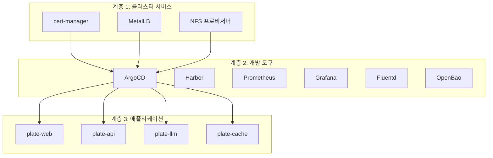
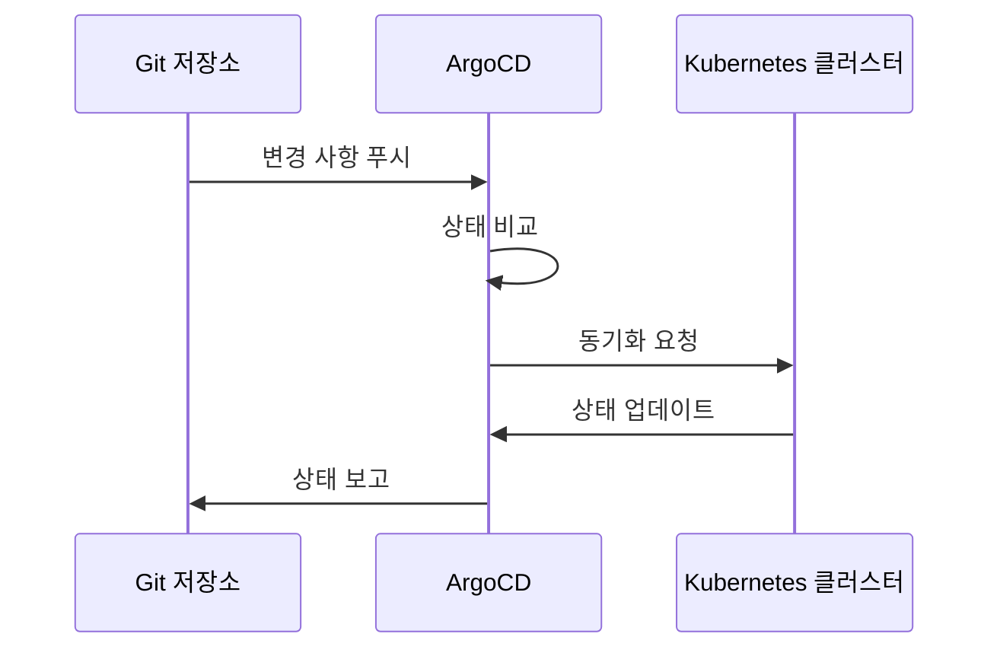
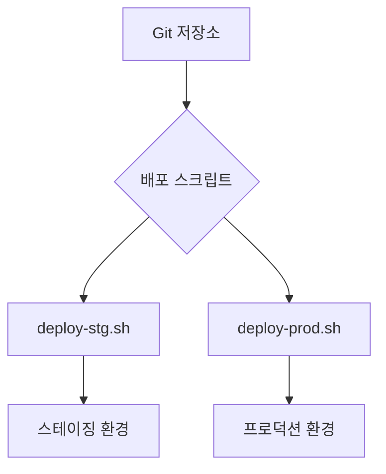
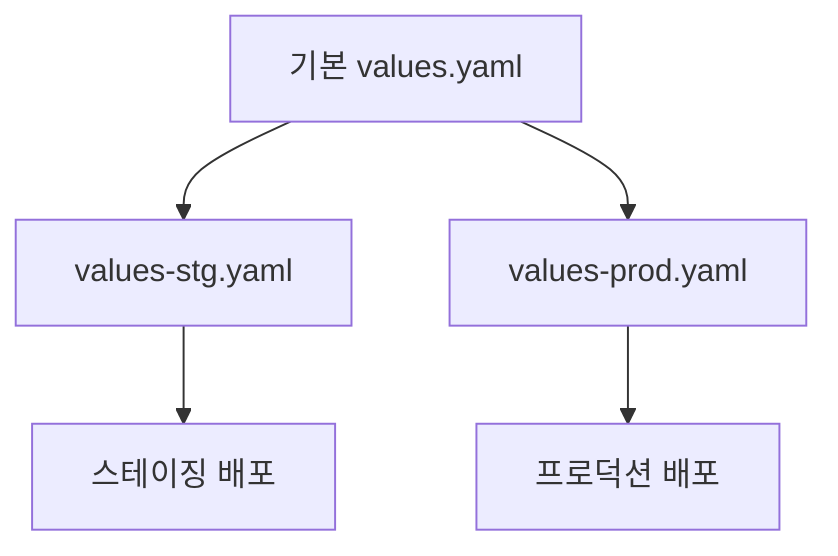
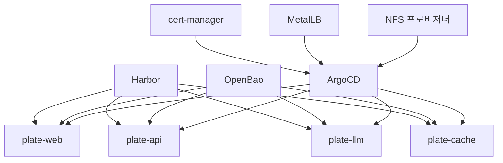

# 기술 아키텍처

<cite>
**이 문서에서 참조한 파일**
- [README.md](file://README.md)
- [app-of-apps.yaml](file://environments/argocd/app-of-apps.yaml)
- [cert-manager/Chart.yaml](file://helm/cluster-services/cert-manager/Chart.yaml)
- [metallb/l2advertisement.yaml](file://helm/cluster-services/metallb/l2advertisement.yaml)
- [nfs-provisioner/Chart.yaml](file://helm/cluster-services/nfs-provisioner/Chart.yaml)
- [argocd/Chart.yaml](file://helm/development-tools/argocd/Chart.yaml)
- [argocd/templates/argocd-server/deployment.yaml](file://helm/development-tools/argocd/templates/argocd-server/deployment.yaml)
- [argocd/templates/argocd-application-controller/deployment.yaml](file://helm/development-tools/argocd/templates/argocd-application-controller/deployment.yaml)
- [plate-api/Chart.yaml](file://helm/applications/plate-server/Chart.yaml)
- [plate-web/Chart.yaml](file://helm/applications/plate-web/Chart.yaml)
- [plate-llm/Chart.yaml](file://helm/applications/plate-llm/Chart.yaml)
- [plate-cache/Chart.yaml](file://helm/applications/plate-cache/Chart.yaml)
- [plate-api/values-stg.yaml](file://helm/applications/plate-server/values-stg.yaml)
- [plate-web/values-stg.yaml](file://helm/applications/plate-web/values-stg.yaml)
- [plate-llm/values-stg.yaml](file://helm/applications/plate-llm/values-stg.yaml)
- [plate-cache/values-stg.yaml](file://helm/applications/plate-cache/values-stg.yaml)
</cite>

## 목차
1. [소개](#소개)
2. [계층화된 배포 구조](#계층화된-배포-구조)
3. [App-of-Apps 및 GitOps 아키텍처](#app-of-apps-및-gitops-아키텍처)
4. [환경 분리 및 관리](#환경-분리-및-관리)
5. [Helm 기반 구성 관리](#helm-기반-구성-관리)
6. [주요 구성 요소 간 관계](#주요-구성-요소-간-관계)
7. [결론](#결론)

## 소개

이 문서는 `prj-devops` 프로젝트의 기술 아키텍처를 심층적으로 분석합니다. 이 프로젝트는 Helm 차트를 사용한 프로덕션 준비된 Kubernetes 배포 구조를 제공하며, 다중 환경 배포를 위해 체계적으로 구성되어 있습니다. 본 아키텍처는 클러스터 서비스, 개발 도구, 애플리케이션의 3계층 구조를 기반으로 하며, ArgoCD를 통한 GitOps 원칙과 App-of-Apps 패턴을 활용하여 안정적이고 자동화된 배포를 구현합니다. 또한, 스테이징과 프로덕션 환경을 완전히 분리하여 관리하며, Helm을 통한 구성 관리로 재사용성과 유지보수성을 극대화합니다.

**참조 파일**
- [README.md](file://README.md)

## 계층화된 배포 구조

`prj-devops` 프로젝트는 명확한 계층 구조를 기반으로 구성되어 있으며, 각 계층은 독립적인 책임을 가지며 상호 의존성을 최소화합니다. 이 구조는 인프라와 애플리케이션의 변경을 분리하여 운영 안정성을 높이고, 배포 프로세스를 단순화합니다.

### 클러스터 서비스 (계층 1)

클러스터 서비스는 Kubernetes 클러스터의 핵심 인프라를 구성하는 요소들로, 클러스터 전체에 영향을 미치는 공통 서비스를 제공합니다. 이 계층은 `helm/cluster-services/` 디렉터리에 위치하며, 다음과 같은 주요 구성 요소를 포함합니다:

- **cert-manager**: SSL/TLS 인증서를 자동으로 발급하고 관리합니다. Let's Encrypt와 통합되어 스테이징 및 프로덕션 환경에 맞는 인증서를 제공합니다.
- **MetalLB**: Bare-metal 환경에서 LoadBalancer 타입의 서비스를 제공하여, 클러스터 외부에서의 접근을 가능하게 합니다.
- **NFS 프로비저너**: 동적 스토리지 프로비저닝을 통해 PVC(Persistent Volume Claim)를 생성하고 관리합니다.

이 계층은 `deploy-libraries.sh` 스크립트를 통해 배포되며, 설정값은 각 Helm 차트의 `values.yaml` 파일에 저장되어 Git을 통해 형상 관리됩니다.

### 개발 도구 (계층 2)

개발 도구 계층은 CI/CD, 모니터링, 보안 등 개발 및 운영에 필요한 도구들을 포함합니다. 이 계층은 `helm/development-tools/` 디렉터리에 위치하며, 다음과 같은 주요 도구를 포함합니다:

- **ArgoCD**: GitOps 기반의 선언적 배포 도구로, Git 저장소의 상태를 기반으로 애플리케이션을 자동으로 동기화합니다.
- **Harbor**: 프라이빗 컨테이너 이미지 레지스트리로, 이미지 저장 및 보안 스캔 기능을 제공합니다.
- **Prometheus & Grafana**: 메트릭 수집 및 시각화를 위한 모니터링 스택입니다.
- **Fluentd**: 로그 수집 및 전송을 위한 로깅 에이전트입니다.
- **OpenBao**: 시크릿 및 구성 관리를 위한 도구입니다.

이 계층 역시 `deploy-libraries.sh` 스크립트를 통해 배포되며, 각 도구의 설정은 Helm 차트의 `values.yaml` 파일을 통해 관리됩니다.

### 애플리케이션 (계층 3)

애플리케이션 계층은 비즈니스 로직을 수행하는 실제 서비스들로 구성되어 있으며, `helm/applications/` 디렉터리에 위치합니다. 이 계층은 다음과 같은 주요 서비스를 포함합니다:

- **plate-web**: Plate 웹 서비스를 제공하는 프론트엔드 애플리케이션입니다.
- **plate-api**: Plate 백엔드 API 서버입니다.
- **plate-llm**: Plate LLM 서비스로, 대규모 언어 모델을 제공합니다.
- **plate-cache**: 컨테이너 빌드 캐시를 위한 스토리지 서비스입니다.

이 계층은 ArgoCD를 통해 GitOps 방식으로 배포되며, 각 서비스는 독립적인 Helm 차트로 구성되어 재사용성과 유지보수성을 향상시킵니다.



**다이어그램 출처**
- [README.md](file://README.md)
- [cert-manager/Chart.yaml](file://helm/cluster-services/cert-manager/Chart.yaml)
- [metallb/l2advertisement.yaml](file://helm/cluster-services/metallb/l2advertisement.yaml)
- [nfs-provisioner/Chart.yaml](file://helm/cluster-services/nfs-provisioner/Chart.yaml)
- [argocd/Chart.yaml](file://helm/development-tools/argocd/Chart.yaml)
- [plate-web/Chart.yaml](file://helm/applications/plate-web/Chart.yaml)
- [plate-api/Chart.yaml](file://helm/applications/plate-server/Chart.yaml)
- [plate-llm/Chart.yaml](file://helm/applications/plate-llm/Chart.yaml)
- [plate-cache/Chart.yaml](file://helm/applications/plate-cache/Chart.yaml)

**섹션 출처**
- [README.md](file://README.md)

## App-of-Apps 및 GitOps 아키텍처

이 프로젝트는 ArgoCD의 App-of-Apps 패턴을 활용하여 모든 애플리케이션을 중앙에서 관리합니다. 이 패턴은 하나의 상위 애플리케이션이 여러 하위 애플리케이션을 관리함으로써, 복잡한 배포 구조를 단순화하고, 배포 순서와 의존성을 명확히 합니다.

### App-of-Apps 패턴

`environments/argocd/app-of-apps.yaml` 파일은 모든 하위 애플리케이션을 관리하는 상위 ArgoCD 애플리케이션을 정의합니다. 이 파일은 `environments/argocd/apps/` 디렉터리에 위치한 개별 애플리케이션 정의 파일들을 참조하여, 전체 시스템의 배포를 오케스트레이션합니다.

```yaml
apiVersion: argoproj.io/v1alpha1
kind: Application
metadata:
  name: cocdev-platform-apps
  namespace: argocd
spec:
  project: default
  source:
    repoURL: https://github.com/kimjoongwon/prj-devops.git
    path: environments/argocd/apps
    targetRevision: main
  destination:
    server: https://kubernetes.default.svc
    namespace: argocd
  syncPolicy:
    automated:
      prune: true
      selfHeal: true
    syncOptions:
      - CreateNamespace=true
```

이 설정은 `environments/argocd/apps/` 경로에 있는 모든 ArgoCD Application 리소스를 자동으로 동기화하며, Git 저장소의 변경 사항이 발생하면 자동으로 클러스터에 반영됩니다.

### GitOps 원칙

GitOps는 Git 저장소를 단일 진실 원천(Single Source of Truth)으로 삼아, 시스템의 상태를 선언적으로 관리하는 원칙입니다. 이 프로젝트는 다음과 같은 GitOps 원칙을 따릅니다:

- **선언적 구성**: 모든 구성은 Helm 차트와 ArgoCD Application 리소스를 통해 선언적으로 정의됩니다.
- **자동 동기화**: ArgoCD는 Git 저장소의 상태와 클러스터의 실제 상태를 지속적으로 비교하고, 차이가 발생하면 자동으로 동기화합니다.
- **감사 추적**: 모든 변경 사항은 Git 커밋을 통해 추적 가능하며, 롤백이 용이합니다.
- **보안 강화**: 민감한 정보는 OpenBao와 같은 외부 시크릿 매니저를 통해 관리되며, Git 저장소에는 민감 정보가 포함되지 않습니다.



**다이어그램 출처**
- [app-of-apps.yaml](file://environments/argocd/app-of-apps.yaml)
- [README.md](file://README.md)

**섹션 출처**
- [app-of-apps.yaml](file://environments/argocd/app-of-apps.yaml)
- [README.md](file://README.md)

## 환경 분리 및 관리

이 프로젝트는 스테이징과 프로덕션 환경을 완전히 분리하여 관리함으로써, 개발 및 운영의 안정성을 확보합니다. 각 환경은 독립적인 네임스페이스와 구성 값을 가지며, 서로 간섭하지 않습니다.

### 환경별 구성 관리

각 애플리케이션은 환경별로 별도의 `values` 파일을 사용하여 구성 값을 관리합니다. 예를 들어, `plate-api` 서비스는 다음과 같은 파일 구조를 가집니다:

- `values.yaml`: 기본 구성 값
- `values-stg.yaml`: 스테이징 환경 전용 구성 값
- `values-prod.yaml`: 프로덕션 환경 전용 구성 값

이러한 구조를 통해 각 환경의 리소스 요청, 복제본 수, 이미지 태그 등을 독립적으로 관리할 수 있습니다.

### 배포 스크립트

환경별 배포는 다음과 같은 스크립트를 통해 수행됩니다:

- `deploy-stg.sh`: 스테이징 환경에 배포합니다. 빠른 반복 배포를 위해 설계되었습니다.
- `deploy-prod.sh`: 프로덕션 환경에 배포합니다. 사용자 확인, 자동 백업, 헬스 체크 검증 등의 안전장치를 포함합니다.
- `deploy-all.sh`: 전체 시스템을 배포하는 메인 오케스트레이션 스크립트입니다.

이러한 스크립트는 배포 프로세스를 표준화하고, 실수를 방지하는 데 도움을 줍니다.



**다이어그램 출처**
- [README.md](file://README.md)

**섹션 출처**
- [README.md](file://README.md)
- [plate-api/values-stg.yaml](file://helm/applications/plate-server/values-stg.yaml)
- [plate-web/values-stg.yaml](file://helm/applications/plate-web/values-stg.yaml)
- [plate-llm/values-stg.yaml](file://helm/applications/plate-llm/values-stg.yaml)
- [plate-cache/values-stg.yaml](file://helm/applications/plate-cache/values-stg.yaml)

## Helm 기반 구성 관리

Helm은 Kubernetes 애플리케이션을 패키징하고 배포하기 위한 강력한 도구로, 이 프로젝트는 Helm을 기반으로 구성 관리를 수행합니다. 각 구성 요소는 독립적인 Helm 차트로 구성되어 있으며, 재사용성과 유지보수성을 극대화합니다.

### 독립적인 Helm 차트

각 서비스는 독립적인 Helm 차트로 구성되어 있으며, 다음과 같은 이점을 제공합니다:

- **재사용성**: 동일한 차트를 다양한 환경에서 재사용할 수 있습니다.
- **유지보수성**: 각 차트는 독립적으로 업데이트 및 관리할 수 있습니다.
- **버전 관리**: Helm 차트는 버전을 관리할 수 있어, 롤백이 용이합니다.

예를 들어, `plate-web` 서비스의 `Chart.yaml` 파일은 다음과 같습니다:

```yaml
apiVersion: v2
name: plate-web
description: Plate 웹 서비스용 Helm 차트
version: 0.1.0
appVersion: "1.0.0"
```

### 구성 값 오버라이드

Helm은 `values.yaml` 파일을 통해 구성 값을 정의하며, ArgoCD는 `helm.valueFiles`를 통해 환경별 구성 값을 오버라이드합니다. 이를 통해 동일한 차트를 다양한 환경에서 다르게 구성할 수 있습니다.



**다이어그램 출처**
- [plate-web/Chart.yaml](file://helm/applications/plate-web/Chart.yaml)
- [plate-api/Chart.yaml](file://helm/applications/plate-server/Chart.yaml)
- [plate-llm/Chart.yaml](file://helm/applications/plate-llm/Chart.yaml)
- [plate-cache/Chart.yaml](file://helm/applications/plate-cache/Chart.yaml)

**섹션 출처**
- [plate-web/Chart.yaml](file://helm/applications/plate-web/Chart.yaml)
- [plate-api/Chart.yaml](file://helm/applications/plate-server/Chart.yaml)
- [plate-llm/Chart.yaml](file://helm/applications/plate-llm/Chart.yaml)
- [plate-cache/Chart.yaml](file://helm/applications/plate-cache/Chart.yaml)

## 주요 구성 요소 간 관계

이 프로젝트의 주요 구성 요소들은 다음과 같은 관계를 가지고 있습니다:

- **클러스터 서비스**는 **개발 도구**와 **애플리케이션**에 기반 인프라를 제공합니다.
- **ArgoCD**는 **Git 저장소**의 상태를 기반으로 **애플리케이션**을 자동으로 배포하고 동기화합니다.
- **Harbor**는 컨테이너 이미지를 저장하고, **애플리케이션**은 이 이미지를 사용하여 배포됩니다.
- **OpenBao**는 시크릿과 구성 값을 관리하며, **애플리케이션**은 이 정보를 사용합니다.

이러한 관계는 시스템의 안정성과 유연성을 보장하며, 각 구성 요소의 변경이 다른 구성 요소에 미치는 영향을 최소화합니다.



**다이어그램 출처**
- [README.md](file://README.md)
- [app-of-apps.yaml](file://environments/argocd/app-of-apps.yaml)
- [argocd/Chart.yaml](file://helm/development-tools/argocd/Chart.yaml)
- [plate-web/Chart.yaml](file://helm/applications/plate-web/Chart.yaml)
- [plate-api/Chart.yaml](file://helm/applications/plate-server/Chart.yaml)
- [plate-llm/Chart.yaml](file://helm/applications/plate-llm/Chart.yaml)
- [plate-cache/Chart.yaml](file://helm/applications/plate-cache/Chart.yaml)

**섹션 출처**
- [README.md](file://README.md)
- [app-of-apps.yaml](file://environments/argocd/app-of-apps.yaml)

## 결론

`prj-devops` 프로젝트는 계층화된 배포 구조, App-of-Apps 패턴, GitOps 원칙, Helm 기반 구성 관리 등을 통해 안정적이고 자동화된 Kubernetes 배포 환경을 제공합니다. 이 아키텍처는 인프라와 애플리케이션의 변경을 분리하여 운영 안정성을 높이며, 스테이징과 프로덕션 환경을 완전히 분리하여 관리합니다. 또한, 각 구성 요소가 독립적인 Helm 차트로 구성되어 재사용성과 유지보수성을 극대화합니다. 이러한 설계 원칙과 이점은 현대적인 클라우드 네이티브 애플리케이션 배포에 있어 중요한 기준이 됩니다.