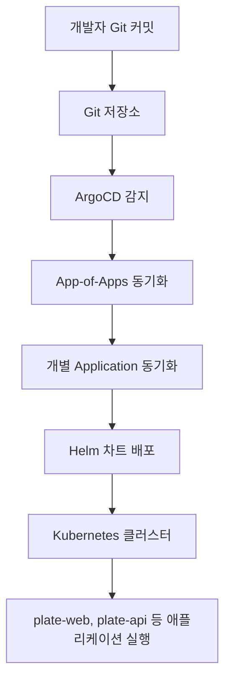
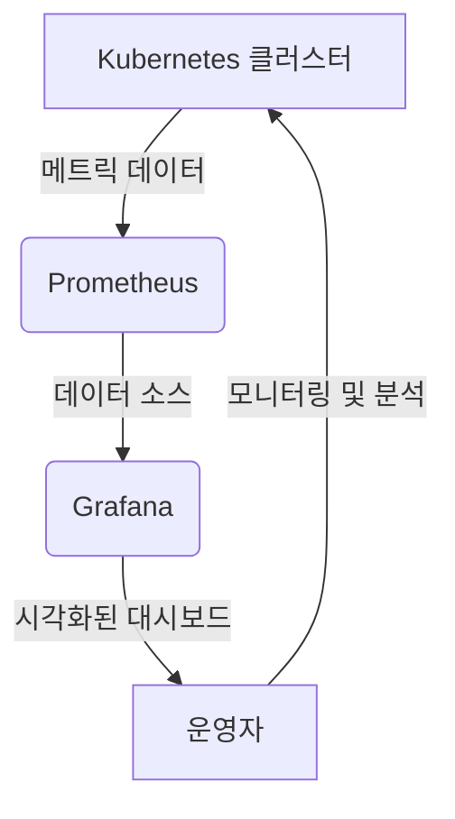
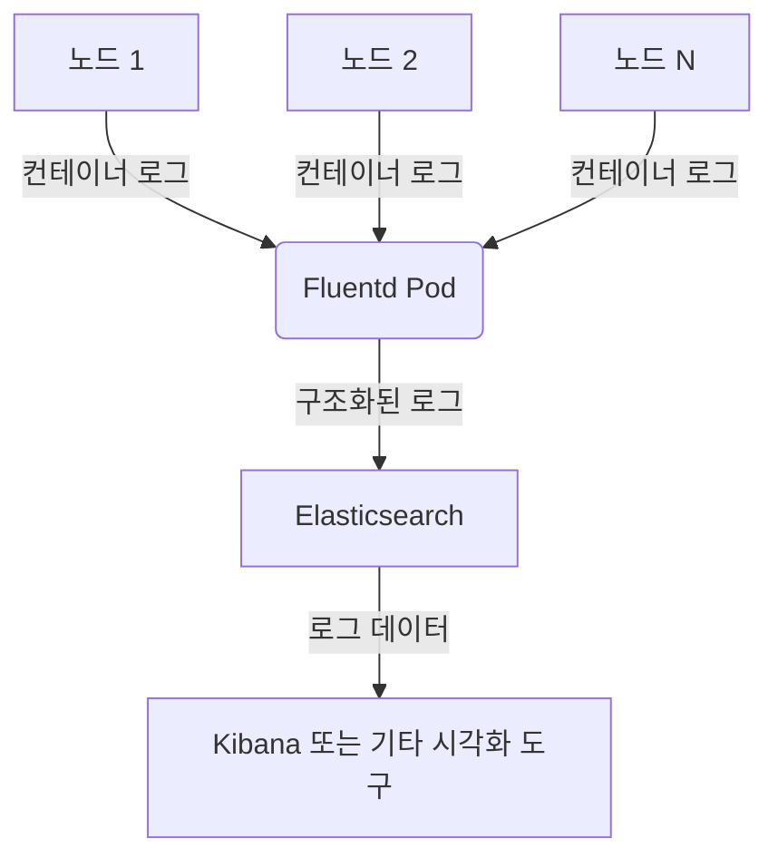
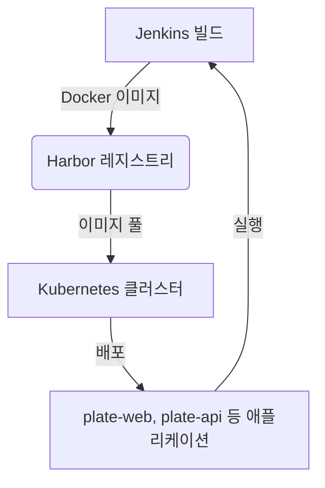

# 데이터 흐름

<cite>
**이 문서에서 참조된 파일**   
- [README.md](file://README.md)
- [app-of-apps.yaml](file://environments/argocd/app-of-apps.yaml)
- [plate-web-stg.yaml](file://environments/argocd/apps/plate-web-stg.yaml)
- [plate-api-stg.yaml](file://environments/argocd/apps/plate-api-stg.yaml)
- [prometheus/values.yaml](file://helm/development-tools/prometheus/values.yaml)
- [grafana/values.yaml](file://helm/development-tools/grafana/values.yaml)
- [fluentd/values.yaml](file://helm/development-tools/fluentd/values.yaml)
- [jenkins/values.yaml](file://helm/development-tools/jenkins/values.yaml)
- [harbor/values.yaml](file://helm/development-tools/harbor/values.yaml)
- [plate-web/templates/deployment.yaml](file://helm/applications/plate-web/templates/deployment.yaml)
- [plate-api/templates/deployment.yaml](file://helm/applications/plate-server/templates/deployment.yaml)
</cite>

## 목차
1. [GitOps 기반 배포 데이터 흐름](#gitops-기반-배포-데이터-흐름)
2. [모니터링 데이터 흐름](#모니터링-데이터-흐름)
3. [로깅 데이터 흐름](#로깅-데이터-흐름)
4. [이미지 배포 흐름](#이미지-배포-흐름)

## GitOps 기반 배포 데이터 흐름

이 프로젝트는 GitOps 기반의 자동화된 배포 파이프라인을 구현하고 있으며, 개발자가 Git 저장소에 코드를 커밋하면 ArgoCD가 이를 감지하고 Helm 차트를 통해 Kubernetes 클러스터에 배포하는 구조를 따릅니다. 이 흐름은 `environments/argocd` 디렉터리에 정의된 ArgoCD Application 리소스를 중심으로 작동합니다.

ArgoCD는 App-of-Apps 패턴을 사용하여 전체 애플리케이션을 관리합니다. `environments/argocd/app-of-apps.yaml` 파일은 `environments/argocd/apps` 디렉터리에 있는 모든 개별 ArgoCD Application을 관리하는 메인 Application입니다. 이 메인 Application은 `syncPolicy.automated` 설정을 통해 Git 저장소의 변경 사항을 자동으로 감지하고 클러스터 상태를 동기화(self-heal)합니다.

각 개별 애플리케이션은 별도의 ArgoCD Application으로 정의되어 있습니다. 예를 들어, `plate-web-stg.yaml`과 `plate-api-stg.yaml`은 각각 스테이징 환경의 웹 프론트엔드와 API 백엔드 서비스를 위한 ArgoCD Application입니다. 이들 파일은 `source.path`를 통해 Helm 차트의 경로를 지정하고, `spec.source.helm.valueFiles`를 통해 환경별 설정 파일(`values-stg.yaml`)을 오버라이드합니다. 이로 인해 동일한 Helm 차트를 다양한 환경(스테이징, 프로덕션)에 유연하게 배포할 수 있습니다.

**Diagram sources**
- [app-of-apps.yaml](file://environments/argocd/app-of-apps.yaml#L1-L35)
- [plate-web-stg.yaml](file://environments/argocd/apps/plate-web-stg.yaml#L1-L62)
- [plate-api-stg.yaml](file://environments/argocd/apps/plate-api-stg.yaml#L1-L62)

**Section sources**
- [README.md](file://README.md#L356-L407)
- [app-of-apps.yaml](file://environments/argocd/app-of-apps.yaml#L1-L35)
- [plate-web-stg.yaml](file://environments/argocd/apps/plate-web-stg.yaml#L1-L62)
- [plate-api-stg.yaml](file://environments/argocd/apps/plate-api-stg.yaml#L1-L62)

## 모니터링 데이터 흐름

Kubernetes 클러스터에서 생성된 메트릭 데이터는 Prometheus에 의해 수집되며, Grafana를 통해 시각화됩니다. 이 모니터링 스택은 `helm/development-tools` 디렉터리에 위치한 Helm 차트를 통해 배포됩니다.

Prometheus는 `helm/development-tools/prometheus` 차트를 사용하여 배포되며, `values.yaml` 설정 파일에서 Ingress를 활성화하고 도메인 `prometheus.cocdev.co.kr`을 통해 접근할 수 있도록 구성되어 있습니다. Prometheus는 클러스터 내의 다양한 타겟(예: kube-state-metrics, node-exporter)에서 메트릭을 수집합니다.

Grafana는 `helm/development-tools/grafana` 차트를 사용하여 배포되며, 마찬가지로 `values.yaml` 설정 파일에서 Ingress를 활성화하고 도메인 `grafana.cocdev.co.kr`을 통해 접근할 수 있도록 구성되어 있습니다. Grafana는 Prometheus를 데이터 소스로 추가하여 수집된 메트릭을 대시보드 형태로 시각화합니다. `datasources` 설정을 통해 Prometheus 서버의 URL을 지정함으로써 두 시스템이 통합됩니다.

**Diagram sources**
- [prometheus/values.yaml](file://helm/development-tools/prometheus/values.yaml#L381-L431)
- [grafana/values.yaml](file://helm/development-tools/grafana/values.yaml#L284-L323)
- [grafana/values.yaml](file://helm/development-tools/grafana/values.yaml#L676-L742)

**Section sources**
- [prometheus/values.yaml](file://helm/development-tools/prometheus/values.yaml#L381-L431)
- [grafana/values.yaml](file://helm/development-tools/grafana/values.yaml#L284-L323)
- [grafana/values.yaml](file://helm/development-tools/grafana/values.yaml#L676-L742)

## 로깅 데이터 흐름

클러스터 내에서 생성된 로그 데이터는 Fluentd를 통해 수집됩니다. Fluentd는 `helm/development-tools/fluentd` 차트를 사용하여 DaemonSet 형태로 배포되며, 각 노드에 하나의 Fluentd Pod가 실행되어 해당 노드의 모든 컨테이너 로그를 수집합니다.

`values.yaml` 설정 파일의 `fileConfigs` 섹션은 Fluentd의 주요 구성 파일을 정의합니다. `01_sources.conf`는 `/var/log/containers/*.log` 경로에서 컨테이너 로그를 읽어들이는 소스를 설정합니다. `02_filters.conf`는 수집된 로그에 쿠버네티스 메타데이터(네임스페이스, 파드 이름 등)를 추가하는 필터를 적용합니다. 마지막으로 `04_outputs.conf`는 수집된 로그를 Elasticsearch 백엔드로 전송하도록 구성되어 있습니다.

**Diagram sources**
- [fluentd/values.yaml](file://helm/development-tools/fluentd/values.yaml#L292-L390)

**Section sources**
- [fluentd/values.yaml](file://helm/development-tools/fluentd/values.yaml#L292-L390)

## 이미지 배포 흐름

Jenkins에서 빌드된 컨테이너 이미지는 Harbor 컨테이너 레지스트리에 저장됩니다. Harbor는 `helm/development-tools/harbor` 차트를 사용하여 배포되며, `values.yaml` 설정 파일에서 `expose.type: ingress`로 설정되어 있으며, `externalURL: https://harbor.cocdev.co.kr`을 통해 접근할 수 있습니다.

Jenkins 파이프라인은 빌드 후 `docker push` 명령을 사용하여 생성된 이미지를 Harbor 레지스트리에 푸시합니다. Kubernetes 클러스터 내의 애플리케이션은 Helm 차트의 `values.yaml` 파일에서 이미지 리포지토리와 태그를 지정함으로써, Harbor에서 이미지를 풀(Pull)합니다. 예를 들어, `plate-web/templates/deployment.yaml`에서는 `image.repository`와 `image.tag` 값을 통해 이미지 소스를 정의합니다.

**Diagram sources**
- [jenkins/values.yaml](file://helm/development-tools/jenkins/values.yaml#L696-L742)
- [harbor/values.yaml](file://helm/development-tools/harbor/values.yaml#L1-L113)
- [plate-web/templates/deployment.yaml](file://helm/applications/plate-web/templates/deployment.yaml#L28-L32)

**Section sources**
- [jenkins/values.yaml](file://helm/development-tools/jenkins/values.yaml#L696-L742)
- [harbor/values.yaml](file://helm/development-tools/harbor/values.yaml#L1-L113)
- [plate-web/templates/deployment.yaml](file://helm/applications/plate-web/templates/deployment.yaml#L28-L32)