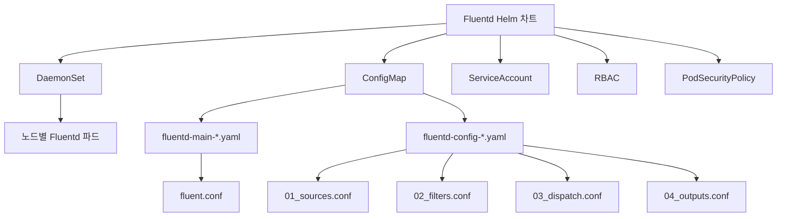
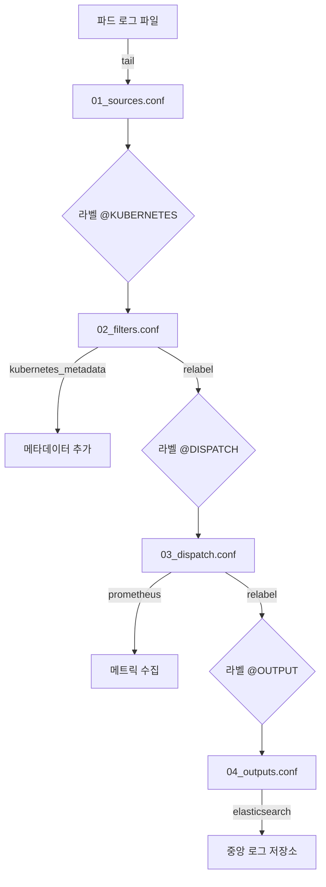
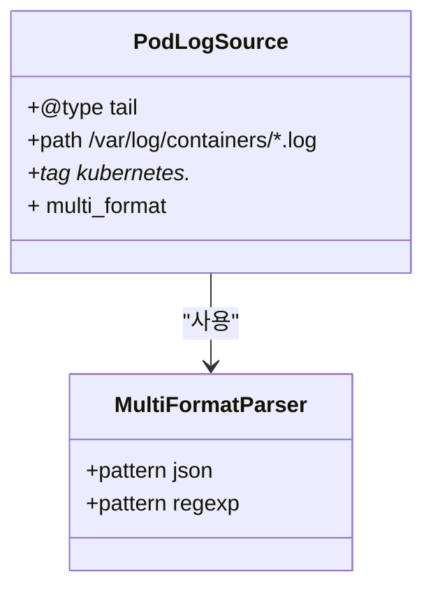
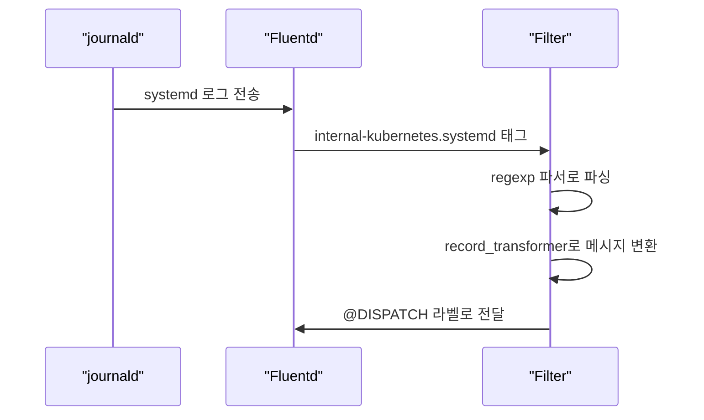
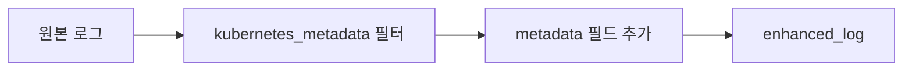
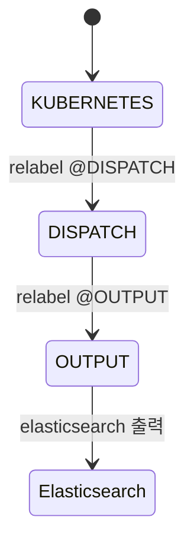
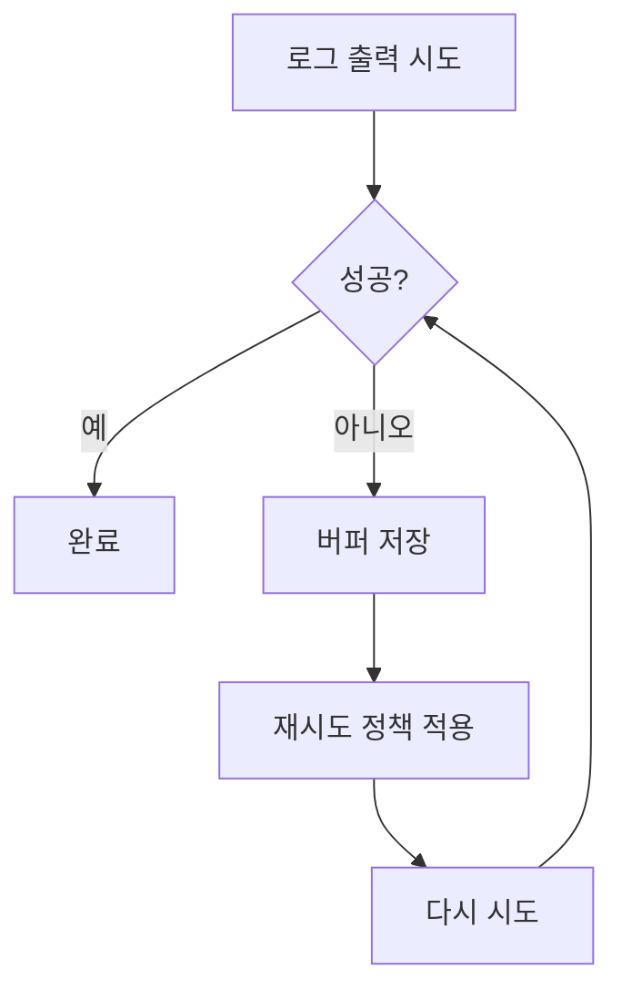
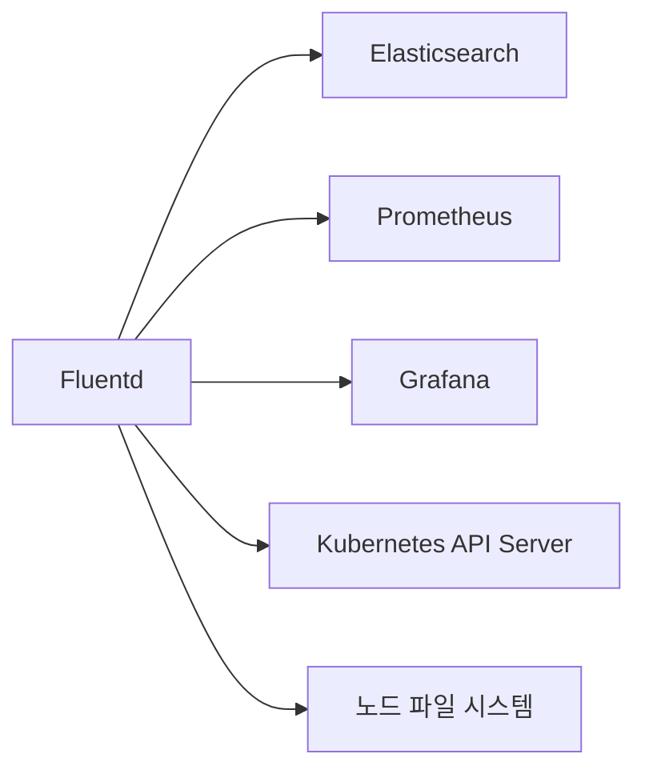
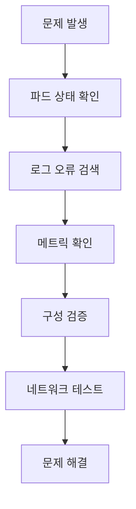

# 로깅 데이터 흐름

<cite>
**이 문서에서 참조한 파일**  
- [fluentd-configurations-cm.yaml](file://helm/development-tools/fluentd/templates/fluentd-configurations-cm.yaml)
- [daemonset.yaml](file://helm/development-tools/fluentd/templates/daemonset.yaml)
- [values.yaml](file://helm/development-tools/fluentd/values.yaml)
- [systemd.yaml](file://helm/development-tools/fluentd/templates/files.conf/systemd.yaml)
- [prometheus.yaml](file://helm/development-tools/fluentd/templates/files.conf/prometheus.yaml)
- [fluentd.json](file://helm/development-tools/fluentd/dashboards/fluentd.json)
- [Chart.yaml](file://helm/development-tools/fluentd/Chart.yaml)
- [README.md](file://helm/development-tools/fluentd/README.md)
</cite>

## 목차
1. [소개](#소개)
2. [프로젝트 구조](#프로젝트-구조)
3. [핵심 구성 요소](#핵심-구성-요소)
4. [아키텍처 개요](#아키텍처-개요)
5. [상세 구성 요소 분석](#상세-구성-요소-분석)
6. [의존성 분석](#의존성-분석)
7. [성능 고려사항](#성능-고려사항)
8. [문제 해결 가이드](#문제-해결-가이드)
9. [결론](#결론)

## 소개
이 문서는 Kubernetes 클러스터 내에서 로그 데이터가 수집되고 처리되는 전체 흐름을 설명합니다. 특히 Fluentd 데몬셋이 각 노드에서 파드 로그를 수집하고, 이를 중앙 집중식 로그 저장소로 전송하는 과정을 중심으로 다룹니다. Fluentd의 플러그인 아키텍처, 설정 관리 방식, 로그 파싱 및 필터링 전략, 오류 처리 메커니즘, 성능 최적화 및 보안 측면에 대해 심층적으로 분석합니다.

## 프로젝트 구조
Fluentd는 Helm 차트로 관리되며, `helm/development-tools/fluentd/` 디렉터리에 위치합니다. 주요 구성 요소는 다음과 같습니다:

- `templates/`: Kubernetes 리소스를 정의하는 템플릿 파일들
- `values.yaml`: 사용자 정의 설정 값
- `Chart.yaml`: 차트 메타데이터
- `dashboards/`: Grafana 대시보드 정의
- `files.conf/`: Fluentd 구성 파일 템플릿

**다이어그램 출처**  
- [daemonset.yaml](file://helm/development-tools/fluentd/templates/daemonset.yaml)
- [fluentd-configurations-cm.yaml](file://helm/development-tools/fluentd/templates/fluentd-configurations-cm.yaml)

**섹션 출처**  
- [Chart.yaml](file://helm/development-tools/fluentd/Chart.yaml)
- [values.yaml](file://helm/development-tools/fluentd/values.yaml)

## 핵심 구성 요소
Fluentd는 Kubernetes 클러스터의 모든 노드에서 로그를 수집하는 데 핵심적인 역할을 합니다. 주요 구성 요소는 다음과 같습니다:

- **DaemonSet**: 각 노드에 Fluentd 파드를 배포하여 로그 수집을 보장
- **ConfigMap**: 로그 수집, 필터링, 출력 규칙을 정의하는 구성 파일들
- **RBAC**: 필요한 리소스에 대한 접근 권한 부여
- **ServiceAccount**: 파드가 클러스터 내에서 인증할 수 있도록 제공

**섹션 출처**  
- [daemonset.yaml](file://helm/development-tools/fluentd/templates/daemonset.yaml)
- [values.yaml](file://helm/development-tools/fluentd/values.yaml)

## 아키텍처 개요
Fluentd는 로그 데이터를 수집 → 파싱 → 변환 → 출력하는 일련의 흐름을 따릅니다. 이 과정은 Fluentd 구성 파일 내의 `<source>`, `<filter>`, `<match>` 블록으로 정의됩니다.

**다이어그램 출처**  
- [values.yaml](file://helm/development-tools/fluentd/values.yaml#L291-L390)
- [fluentd-configurations-cm.yaml](file://helm/development-tools/fluentd/templates/fluentd-configurations-cm.yaml)

**섹션 출처**  
- [values.yaml](file://helm/development-tools/fluentd/values.yaml#L291-L390)

## 상세 구성 요소 분석

### 로그 수집 구성 분석
Fluentd는 주로 두 가지 소스에서 로그를 수집합니다: 파드 로그와 시스템 로그.

#### 파드 로그 수집
`01_sources.conf`는 `/var/log/containers/*.log` 경로에서 JSON 및 정규식 형식의 로그를 수집합니다. `multi_format` 파서를 사용하여 다양한 형식의 로그를 처리할 수 있습니다.

**다이어그램 출처**  
- [values.yaml](file://helm/development-tools/fluentd/values.yaml#L292-L319)

**섹션 출처**  
- [values.yaml](file://helm/development-tools/fluentd/values.yaml#L292-L319)

#### 시스템 로그 수집
`systemd.yaml`은 kubelet, etcd 등 시스템 서비스의 journald 로그를 수집합니다. 수집된 로그는 `@KUBERNETES_SYSTEM` 라벨을 통해 별도로 처리됩니다.

**다이어그램 출처**  
- [systemd.yaml](file://helm/development-tools/fluentd/templates/files.conf/systemd.yaml)

**섹션 출처**  
- [systemd.yaml](file://helm/development-tools/fluentd/templates/files.conf/systemd.yaml)

### 로그 필터링 및 변환 분석
로그는 수집 후 다양한 필터를 통해 풍부한 메타데이터를 추가하고 구조화됩니다.

#### 쿠버네티스 메타데이터 추가
`kubernetes_metadata` 필터는 파드 이름, 네임스페이스, 레이블 등의 정보를 로그에 추가합니다. 이를 통해 로그를 리소스 기준으로 쉽게 검색할 수 있습니다.

**다이어그램 출처**  
- [values.yaml](file://helm/development-tools/fluentd/values.yaml#L342-L348)

**섹션 출처**  
- [values.yaml](file://helm/development-tools/fluentd/values.yaml#L342-L348)

### 출력 및 라우팅 전략
로그는 최종적으로 중앙 저장소로 전송되기 전에 라우팅 라벨을 통해 흐름이 제어됩니다.

#### 라벨 기반 라우팅
Fluentd는 `@label`과 `<match>`를 사용하여 로그 처리 흐름을 제어합니다. 이는 복잡한 로그 처리 파이프라인을 구축할 수 있게 해줍니다.

**다이어그램 출처**  
- [values.yaml](file://helm/development-tools/fluentd/values.yaml#L330-L375)

**섹션 출처**  
- [values.yaml](file://helm/development-tools/fluentd/values.yaml#L330-L375)

### 오류 재시도 및 모니터링
Fluentd는 출력 실패 시 자동 재시도 메커니즘을 제공하며, Prometheus를 통해 상태를 모니터링할 수 있습니다.

#### 재시도 메커니즘
출력 플러그인은 실패한 로그를 버퍼에 저장하고, 설정된 정책에 따라 재시도합니다. 재시도 횟수는 메트릭으로 노출되어 모니터링에 활용됩니다.

**다이어그램 출처**  
- [fluentd.json](file://helm/development-tools/fluentd/dashboards/fluentd.json#L88-L97)
- [values.yaml](file://helm/development-tools/fluentd/values.yaml#L380-L388)

**섹션 출처**  
- [fluentd.json](file://helm/development-tools/fluentd/dashboards/fluentd.json#L88-L97)

## 의존성 분석
Fluentd는 여러 외부 시스템과 상호작용합니다.

**다이어그램 출처**  
- [values.yaml](file://helm/development-tools/fluentd/values.yaml#L380-L388)
- [prometheus.yaml](file://helm/development-tools/fluentd/templates/files.conf/prometheus.yaml)

**섹션 출처**  
- [values.yaml](file://helm/development-tools/fluentd/values.yaml)
- [prometheus.yaml](file://helm/development-tools/fluentd/templates/files.conf/prometheus.yaml)

## 성능 고려사항
대량의 로그 데이터를 처리할 때는 다음과 같은 성능 고려사항이 필요합니다:

- **버퍼링**: 디스크 기반 버퍼를 사용하여 출력 실패 시 데이터 손실 방지
- **리소스 제한**: CPU 및 메모리 리소스를 적절히 제한하여 노드 자원 고갈 방지
- **병렬 처리**: Fluentd 내부 큐와 워커를 통해 로그 처리 병렬화
- **네트워크 최적화**: 배치 전송과 압축을 통해 네트워크 오버헤드 감소

**섹션 출처**  
- [values.yaml](file://helm/development-tools/fluentd/values.yaml#L82-L87)
- [statefulset.yaml](file://helm/development-tools/fluentd/templates/statefulset.yaml#L43-L55)

## 문제 해결 가이드
로그 수집 및 전송 문제를 진단할 때는 다음 단계를 따르세요:

1. Fluentd 파드의 상태 확인
2. 로그에서 오류 메시지 검색
3. Prometheus 메트릭을 통한 재시도 및 오류율 확인
4. 구성 파일의 구문 오류 검증
5. 네트워크 연결성 테스트

**다이어그램 출처**  
- [NOTES.txt](file://helm/development-tools/fluentd/templates/NOTES.txt)
- [values.yaml](file://helm/development-tools/fluentd/values.yaml#L58-L80)

**섹션 출처**  
- [NOTES.txt](file://helm/development-tools/fluentd/templates/NOTES.txt)
- [values.yaml](file://helm/development-tools/fluentd/values.yaml#L58-L80)

## 결론
Fluentd는 Kubernetes 환경에서 로그를 수집하고 처리하는 강력한 도구입니다. DaemonSet으로 배포되어 모든 노드에서 로그를 수집하며, 유연한 플러그인 아키텍처를 통해 다양한 소스와 출력을 지원합니다. ConfigMap을 통한 구성 관리는 설정의 버전 관리와 배포를 용이하게 하며, 라벨 기반 라우팅은 복잡한 로그 처리 파이프라인을 구축할 수 있게 해줍니다. 성능과 신뢰성을 위해 버퍼링, 재시도, 모니터링 기능을 갖추고 있어, 대규모 프로덕션 환경에서도 안정적으로 로그를 처리할 수 있습니다.