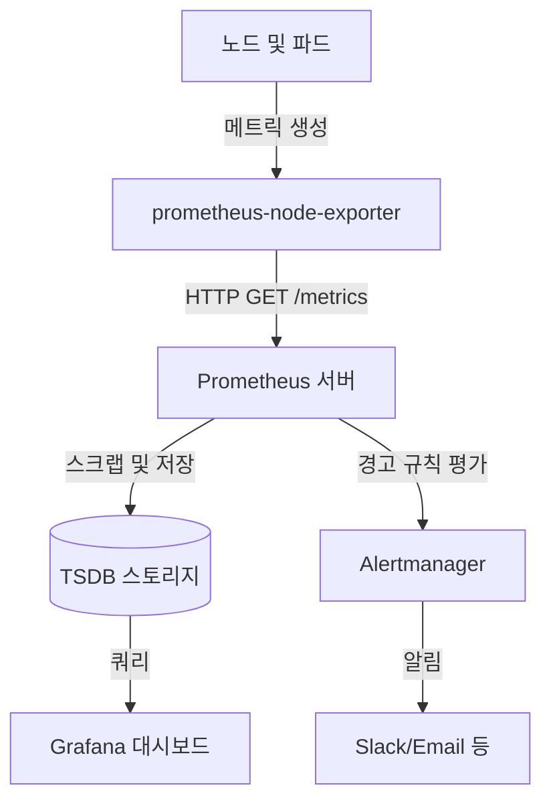
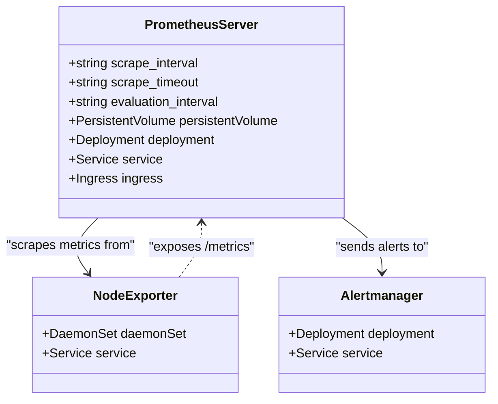
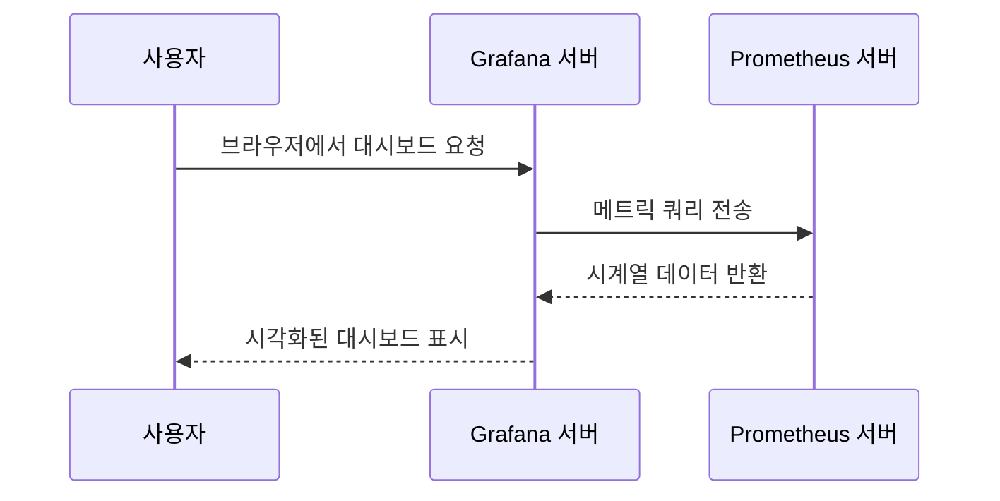

# 모니터링 데이터 흐름

<cite>
**이 문서에서 참조한 파일**   
- [prometheus/Chart.yaml](file://helm/development-tools/prometheus/Chart.yaml)
- [prometheus/values.yaml](file://helm/development-tools/prometheus/values.yaml)
- [prometheus/templates/deploy.yaml](file://helm/development-tools/prometheus/templates/deploy.yaml)
- [prometheus/templates/cm.yaml](file://helm/development-tools/prometheus/templates/cm.yaml)
- [prometheus/templates/service.yaml](file://helm/development-tools/prometheus/templates/service.yaml)
- [prometheus/templates/headless-svc.yaml](file://helm/development-tools/prometheus/templates/headless-svc.yaml)
- [grafana/values.yaml](file://helm/development-tools/grafana/values.yaml)
- [grafana/templates/deployment.yaml](file://helm/development-tools/grafana/templates/deployment.yaml)
- [grafana/templates/service.yaml](file://helm/development-tools/grafana/templates/service.yaml)
- [prometheus/charts/prometheus-node-exporter/Chart.yaml](file://helm/development-tools/prometheus/charts/prometheus-node-exporter/Chart.yaml)
</cite>

## 목차
1. [소개](#소개)
2. [메트릭 수집 및 스크랩 흐름](#메트릭-수집-및-스크랩-흐름)
3. [프로메테우스 구성 요소 분석](#프로메테우스-구성-요소-분석)
4. [Grafana 통합 및 시각화](#grafana-통합-및-시각화)
5. [경고 규칙 및 알림](#경고-규칙-및-알림)
6. [성능 최적화 및 확장성 전략](#성능-최적화-및-확장성-전략)
7. [결론](#결론)

## 소개

이 문서는 Kubernetes 클러스터 내에서 메트릭 데이터가 수집되고, 저장되며, 시각화되는 전체 흐름을 설명합니다. 특히, `helm/development-tools/prometheus` 차트를 기반으로 한 모니터링 아키텍처를 분석하며, 노드 및 파드에서 생성된 메트릭이 `prometheus-node-exporter`를 통해 수집되고, Prometheus 서버에 의해 스크랩(scrapping)되어 저장되는 과정을 다룹니다. 또한, 수집된 데이터가 Grafana를 통해 시각화되는 방식과 Prometheus의 경고 규칙(alerting rules) 작동 방식을 설명합니다. 마지막으로, 성능 최적화를 위한 샘플링 주기 조정, 스토리지 설정, 그리고 대규모 클러스터에서의 확장성 전략에 대해 설명합니다.

**Section sources**
- [prometheus/Chart.yaml](file://helm/development-tools/prometheus/Chart.yaml)
- [grafana/values.yaml](file://helm/development-tools/grafana/values.yaml)

## 메트릭 수집 및 스크랩 흐름

Kubernetes 클러스터의 메트릭 데이터 흐름은 다음과 같은 단계로 구성됩니다:

1. **노드 및 파드 메트릭 생성**: 각 노드와 파드는 시스템 리소스 사용량(예: CPU, 메모리, 네트워크)과 애플리케이션 메트릭을 생성합니다.
2. **prometheus-node-exporter를 통한 수집**: `prometheus-node-exporter`는 각 노드에서 실행되는 데몬셋(DaemonSet)으로, 노드 수준의 하드웨어 및 OS 메트릭을 `/metrics` 엔드포인트를 통해 노출합니다.
3. **Prometheus 서버의 스크랩핑**: Prometheus 서버는 정의된 `scrape_interval`(기본값: 1분)에 따라 `prometheus-node-exporter`의 `/metrics` 엔드포인트를 주기적으로 스크랩하여 메트릭 데이터를 수집합니다.
4. **데이터 저장**: 수집된 메트릭은 Prometheus 서버의 로컬 스토리지(`/data`)에 시계열 데이터베이스(TSDB) 형식으로 저장됩니다. 스토리지 크기는 `values.yaml` 파일에서 `server.persistentVolume.size`로 설정되며, 이 예에서는 8Gi입니다.
5. **Grafana를 통한 시각화**: Grafana는 Prometheus를 데이터 소스로 구성하여 저장된 메트릭을 대시보드를 통해 시각화합니다.

이러한 흐름은 Helm 차트의 설정을 통해 자동으로 구성되며, 사용자는 `values.yaml` 파일을 통해 각 구성 요소의 동작을 사용자 정의할 수 있습니다.



**Diagram sources**
- [prometheus/values.yaml](file://helm/development-tools/prometheus/values.yaml#L271-L279)
- [grafana/values.yaml](file://helm/development-tools/grafana/values.yaml#L674-L684)

## 프로메테우스 구성 요소 분석

`helm/development-tools/prometheus` 차트는 여러 핵심 구성 요소로 이루어져 있습니다. 이러한 구성 요소들은 서로 협력하여 메트릭 수집, 저장, 경고 기능을 제공합니다.

### 프로메테우스 서버

Prometheus 서버는 메트릭을 수집하고 저장하는 핵심 컴포넌트입니다. `values.yaml` 파일에서 다음과 같은 주요 설정을 통해 구성됩니다:

- **스크랩 설정**: `server.global.scrape_interval`과 `server.global.scrape_timeout`을 통해 스크랩 간격과 타임아웃을 정의합니다.
- **스토리지 설정**: `server.persistentVolume` 섹션을 통해 PVC를 사용하여 영구 스토리지를 구성하며, `storageClass`는 `openebs-hostpath`로 설정되어 있습니다.
- **배포 전략**: `server.strategy.type`이 `Recreate`로 설정되어 있어, 업데이트 시 기존 파드를 종료한 후 새로운 파드를 생성합니다.
- **리소스 제한**: `server.resources`를 통해 CPU 및 메모리 리소스 요청과 제한을 설정할 수 있습니다.

서버는 `Deployment` 리소스로 배포되며, `server.replicaCount`가 1로 설정되어 있습니다. 다중 복제본이 필요한 경우 `server.statefulSet.enabled`를 `true`로 설정하여 `StatefulSet`으로 배포할 수 있습니다.

### 서비스 및 네트워크 구성

Prometheus 서버는 다음과 같은 서비스를 통해 접근할 수 있습니다:

- **ClusterIP 서비스**: 내부 클러스터에서 접근하기 위한 기본 서비스입니다.
- **Ingress**: 외부에서 접근하기 위해 `Ingress` 리소스가 사용되며, `ingress.kubernetes.io/ssl-redirect`와 `cert-manager.io/cluster-issuer` 어노테이션을 통해 HTTPS를 지원합니다.
- **Headless 서비스**: `StatefulSet`을 사용할 경우, 파드 간의 직접적인 네트워크 연결을 위해 `headless-svc.yaml` 템플릿을 통해 Headless 서비스가 생성됩니다.



**Diagram sources**
- [prometheus/values.yaml](file://helm/development-tools/prometheus/values.yaml#L128-L799)
- [prometheus/templates/deploy.yaml](file://helm/development-tools/prometheus/templates/deploy.yaml)
- [prometheus/templates/service.yaml](file://helm/development-tools/prometheus/templates/service.yaml)
- [prometheus/templates/headless-svc.yaml](file://helm/development-tools/prometheus/templates/headless-svc.yaml)

**Section sources**
- [prometheus/values.yaml](file://helm/development-tools/prometheus/values.yaml#L128-L799)
- [prometheus/templates/deploy.yaml](file://helm/development-tools/prometheus/templates/deploy.yaml)
- [prometheus/templates/service.yaml](file://helm/development-tools/prometheus/templates/service.yaml)

## Grafana 통합 및 시각화

Grafana는 Prometheus에서 수집된 메트릭을 시각화하는 데 사용되는 대시보드 도구입니다. `helm/development-tools/grafana` 차트를 통해 배포되며, 다음과 같은 방식으로 구성됩니다.

### 데이터 소스 구성

Grafana는 `values.yaml` 파일의 `datasources` 섹션을 통해 Prometheus를 데이터 소스로 자동으로 구성할 수 있습니다. 예를 들어, 다음과 같은 설정을 통해 Prometheus 서버에 연결할 수 있습니다:

```yaml
datasources:
  datasources.yaml:
    apiVersion: 1
    datasources:
    - name: Prometheus
      type: prometheus
      url: http://prometheus-prometheus-server
      access: proxy
      isDefault: true
```

이 설정은 Grafana의 프로비저닝 시스템을 통해 적용되며, 사용자가 수동으로 데이터 소스를 추가할 필요 없이 자동으로 연결됩니다.

### 대시보드 및 지속성

- **대시보드**: Grafana는 `dashboards` 디렉터리에 정의된 JSON 파일을 기반으로 대시보드를 자동으로 로드할 수 있습니다.
- **지속성**: `persistence.enabled`가 `true`로 설정되어 있으며, `storageClassName`은 `openebs-hostpath`로, `size`는 10Gi로 구성되어 있습니다. 이를 통해 Grafana의 설정과 대시보드가 재시작 후에도 유지됩니다.

### 접근 및 보안

- **Ingress**: Grafana는 `ingress.enabled`가 `true`로 설정되어 외부 접근이 가능하며, `grafana.cocdev.co.kr` 도메인을 통해 HTTPS로 접근할 수 있습니다.
- **관리자 계정**: `adminUser`와 `adminPassword`를 통해 기본 관리자 계정이 생성되며, 보안을 위해 `admin.existingSecret`을 사용하여 기존 시크릿을 참조할 수 있습니다.



**Diagram sources**
- [grafana/values.yaml](file://helm/development-tools/grafana/values.yaml#L674-L684)
- [grafana/templates/deployment.yaml](file://helm/development-tools/grafana/templates/deployment.yaml)
- [grafana/templates/service.yaml](file://helm/development-tools/grafana/templates/service.yaml)

**Section sources**
- [grafana/values.yaml](file://helm/development-tools/grafana/values.yaml#L422-L441)
- [grafana/templates/deployment.yaml](file://helm/development-tools/grafana/templates/deployment.yaml)
- [grafana/templates/service.yaml](file://helm/development-tools/grafana/templates/service.yaml)

## 경고 규칙 및 알림

Prometheus는 수집된 메트릭을 기반으로 경고 규칙을 평가하고, 경고가 발생할 경우 Alertmanager를 통해 알림을 전송합니다.

### 경고 규칙 정의

경고 규칙은 `values.yaml` 파일의 `ruleFiles` 또는 `serverFiles` 섹션을 통해 정의할 수 있습니다. 예를 들어, CPU 사용률이 80%를 초과할 경우 경고를 발생시키는 규칙은 다음과 같이 설정할 수 있습니다:

```yaml
ruleFiles:
  alert-rules.yml: |
    groups:
    - name: example
      rules:
      - alert: HighCpuUsage
        expr: 100 - (avg by(instance) (rate(node_cpu_seconds_total{mode="idle"}[5m])) * 100) > 80
        for: 5m
        labels:
          severity: warning
        annotations:
          summary: "High CPU usage on {{ $labels.instance }}"
```

이 규칙은 `evaluation_interval`(기본값: 1분)마다 평가되며, 조건이 충족되면 Alertmanager로 전송됩니다.

### Alertmanager 통합

`prometheus/Chart.yaml` 파일의 `dependencies` 섹션을 통해 Alertmanager가 프로메테우스 차트의 의존성으로 포함되어 있습니다. 이는 `alertmanager.enabled` 값에 따라 Alertmanager가 자동으로 배포되도록 합니다. Prometheus 서버는 기본적으로 동일한 릴리스 내의 Alertmanager 인스턴스를 탐지하고, 경고를 전송합니다.

**Section sources**
- [prometheus/values.yaml](file://helm/development-tools/prometheus/values.yaml#L277-L279)
- [prometheus/Chart.yaml](file://helm/development-tools/prometheus/Chart.yaml#L10-L14)

## 성능 최적화 및 확장성 전략

대규모 Kubernetes 클러스터에서의 성능과 확장성을 보장하기 위해 다음과 같은 전략을 적용할 수 있습니다.

### 샘플링 주기 조정

스크랩 간격(`scrape_interval`)을 조정하여 메트릭 수집 빈도를 제어할 수 있습니다. 기본값은 1분이지만, 더 높은 정밀도가 필요한 경우 15초 또는 30초로 줄일 수 있습니다. 반대로, 리소스 사용을 줄이기 위해 2분 또는 5분으로 늘릴 수도 있습니다.

```yaml
server:
  global:
    scrape_interval: 30s
    scrape_timeout: 10s
```

### 스토리지 최적화

- **보존 기간**: `server.retention` 값을 설정하여 데이터를 저장할 기간을 조정할 수 있습니다. 예: `15d` (15일).
- **스토리지 크기**: `server.persistentVolume.size`를 적절한 크기로 설정하여 데이터 저장소의 용량을 확보합니다.
- **WAL 압축**: `extraFlags`에 `--storage.tsdb.wal-compression`을 추가하여 쓰기 앞 로그(WAL)의 크기를 줄일 수 있습니다.

### 확장성 전략

- **StatefulSet 사용**: `server.statefulSet.enabled`를 `true`로 설정하여 다중 복제본을 지원하고, 각 복제본이 고유한 스토리지 볼륨을 가질 수 있도록 합니다.
- **리소스 요청 및 제한**: `server.resources`를 통해 CPU와 메모리 리소스를 명시적으로 설정하여, 노드 리소스를 효율적으로 사용하고 OOM(Out of Memory)을 방지합니다.
- **노드 선택 및 친화성**: `nodeSelector`, `tolerations`, `affinity` 설정을 통해 특정 노드에 프로메테우스 서버를 스케줄링하여 성능을 최적화할 수 있습니다.

**Section sources**
- [prometheus/values.yaml](file://helm/development-tools/prometheus/values.yaml#L271-L280)
- [prometheus/values.yaml](file://helm/development-tools/prometheus/values.yaml#L544-L580)
- [prometheus/values.yaml](file://helm/development-tools/prometheus/values.yaml#L260-L261)

## 결론

이 문서는 Kubernetes 클러스터의 메트릭 데이터 흐름을 상세히 설명하며, `helm/development-tools/prometheus` 차트를 중심으로 한 모니터링 아키텍처를 분석했습니다. `prometheus-node-exporter`를 통한 메트릭 수집, Prometheus 서버의 스크랩 및 저장, Grafana를 통한 시각화, 그리고 경고 규칙의 작동 방식을 다루었습니다. 또한, `values.yaml` 파일을 통한 사용자 정의 설정과 성능 최적화를 위한 다양한 전략을 제시했습니다. 이러한 구성은 대규모 클러스터에서도 안정적이고 확장 가능한 모니터링 시스템을 구축하는 데 필수적입니다.