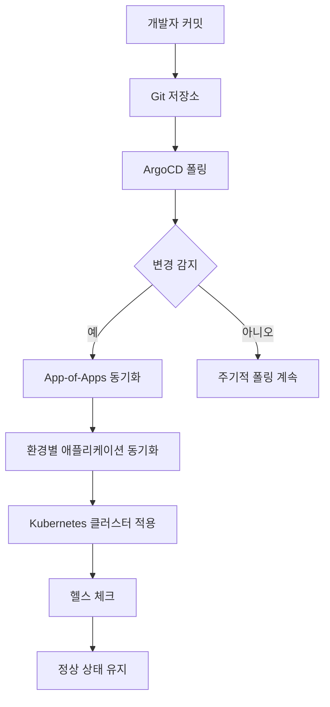
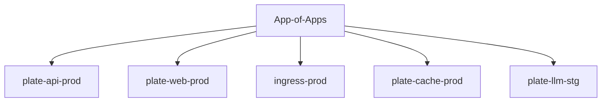
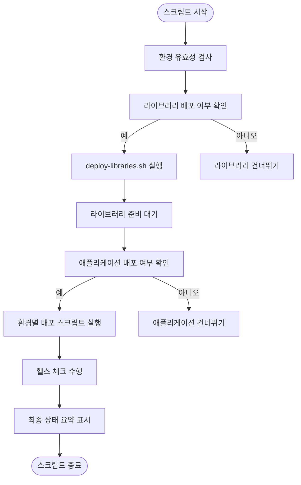
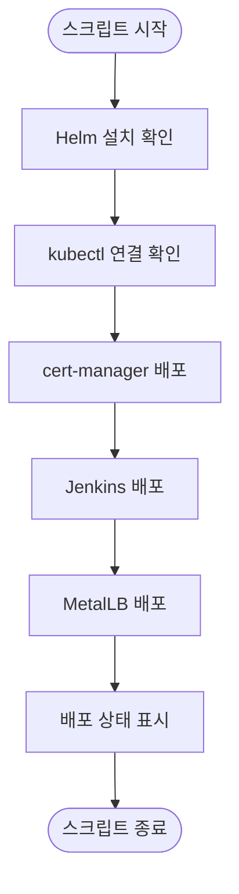
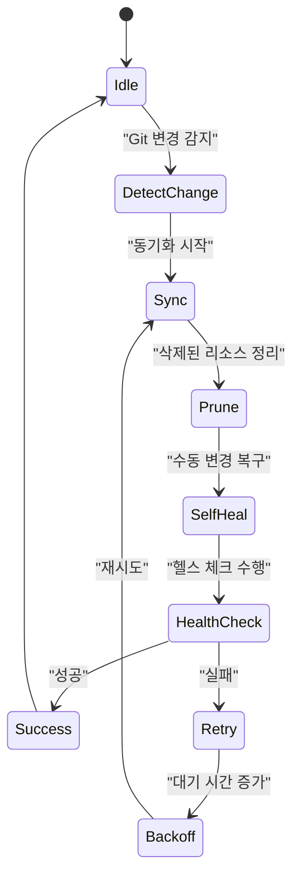
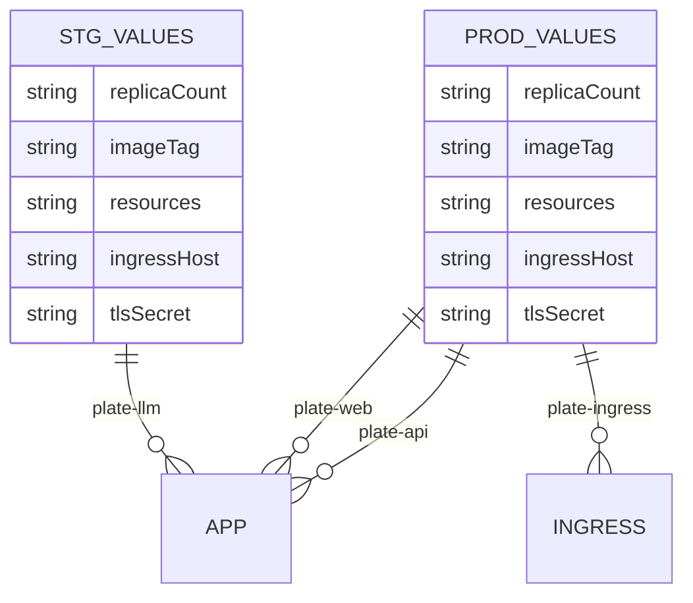

# 배포 데이터 흐름

<cite>
**이 문서에서 참조한 파일**  
- [app-of-apps.yaml](file://environments/argocd/app-of-apps.yaml)
- [plate-api-prod.yaml](file://environments/argocd/apps/plate-api-prod.yaml)
- [plate-web-prod.yaml](file://environments/argocd/apps/plate-web-prod.yaml)
- [ingress-prod.yaml](file://environments/argocd/apps/ingress-prod.yaml)
- [plate-cache-prod.yaml](file://environments/argocd/apps/plate-cache-prod.yaml)
- [plate-llm-stg.yaml](file://environments/argocd/apps/plate-llm-stg.yaml)
- [deploy-all.sh](file://scripts/deploy-all.sh)
- [deploy-libraries.sh](file://scripts/deploy-libraries.sh)
- [values-prod.yaml](file://helm/applications/plate-api/values-prod.yaml)
- [values.yaml](file://helm/ingress/values.yaml)
- [values-prod.yaml](file://helm/applications/plate-web/values-prod.yaml)
- [values-prod.yaml](file://helm/applications/plate-cache/values-prod.yaml)
- [values-stg.yaml](file://helm/applications/plate-llm/values-stg.yaml)
</cite>

## 목차
1. [소개](#소개)
2. [GitOps 기반 배포 아키텍처](#gitops-기반-배포-아키텍처)
3. [App-of-Apps 패턴](#app-of-apps-패턴)
4. [배포 오케스트레이션 스크립트](#배포-오케스트레이션-스크립트)
5. [ArgoCD 동기화 및 헬스 체크 메커니즘](#argocd-동기화-및-헬스-체크-메커니즘)
6. [환경별 Helm Values 구성](#환경별-helm-values-구성)
7. [실제 운영 환경 배포 전략](#실제-운영-환경-배포-전략)
8. [결론](#결론)

## 소개

이 문서는 GitOps 기반의 배포 데이터 흐름을 상세히 설명합니다. 개발자가 Git 저장소에 코드를 커밋하면 ArgoCD가 변경 사항을 감지하고, app-of-apps 패턴을 통해 계층화된 Helm 차트를 Kubernetes 클러스터에 적용하는 과정을 단계별로 설명합니다. 특히, `environments/argocd` 디렉토리의 애플리케이션 정의 파일들이 어떻게 사용되는지, 그리고 `deploy-all.sh` 및 `deploy-libraries.sh` 스크립트가 배포 오케스트레이션에 어떻게 기여하는지를 다룹니다. 또한 ArgoCD의 동기화 주기, 헬스 체크, 롤백 메커니즘에 대해 설명하고, 실제 운영 환경에서의 배포 전략과 모범 사례를 제시합니다.

## GitOps 기반 배포 아키텍처

**도표 출처**  
- [app-of-apps.yaml](file://environments/argocd/app-of-apps.yaml)
- [plate-api-prod.yaml](file://environments/argocd/apps/plate-api-prod.yaml)
- [plate-web-prod.yaml](file://environments/argocd/apps/plate-web-prod.yaml)

**섹션 출처**  
- [app-of-apps.yaml](file://environments/argocd/app-of-apps.yaml)
- [environments/argocd/README.md](file://environments/argocd/README.md)

## App-of-Apps 패턴

App-of-Apps 패턴은 중앙 집중식으로 모든 애플리케이션을 관리하기 위한 아키텍처 패턴입니다. `app-of-apps.yaml` 파일은 메인 ArgoCD Application으로, `environments/argocd/apps` 디렉토리에 정의된 모든 환경별 애플리케이션을 자동으로 동기화합니다. 이 방식은 배포의 일관성과 추적 가능성을 보장하며, 전체 시스템의 상태를 단일 지점에서 관리할 수 있게 합니다.

**도표 출처**  
- [app-of-apps.yaml](file://environments/argocd/app-of-apps.yaml)
- [environments/argocd/apps/](file://environments/argocd/apps/)

**섹션 출처**  
- [app-of-apps.yaml](file://environments/argocd/app-of-apps.yaml)
- [environments/argocd/README.md](file://environments/argocd/README.md)

## 배포 오케스트레이션 스크립트

### deploy-all.sh 스크립트 분석

`deploy-all.sh` 스크립트는 전체 컴포넌트 배포를 오케스트레이션합니다. 이 스크립트는 라이브러리와 애플리케이션의 배포 순서를 관리하며, 환경에 따라 적절한 하위 스크립트를 호출합니다. 주요 기능으로는 환경 유효성 검사, 라이브러리 배포, 애플리케이션 배포, 건강 상태 점검, 최종 상태 요약 등이 있습니다.

**도표 출처**  
- [deploy-all.sh](file://scripts/deploy-all.sh)

**섹션 출처**  
- [deploy-all.sh](file://scripts/deploy-all.sh)

### deploy-libraries.sh 스크립트 분석

`deploy-libraries.sh` 스크립트는 클러스터 레벨의 공통 라이브러리 컴포넌트들을 배포합니다. 주요 배포 대상은 cert-manager, Jenkins, MetalLB입니다. 이 스크립트는 Helm을 사용하여 각 컴포넌트를 설치하고, 필요한 CRD를 적용하며, 네임스페이스를 생성합니다.

**도표 출처**  
- [deploy-libraries.sh](file://scripts/deploy-libraries.sh)

**섹션 출처**  
- [deploy-libraries.sh](file://scripts/deploy-libraries.sh)

## ArgoCD 동기화 및 헬스 체크 메커니즘

ArgoCD는 기본적으로 3분 주기로 Git 저장소를 폴링하여 변경 사항을 감지합니다. `syncPolicy` 설정을 통해 자동 동기화, 리소스 정리(prune), 자가 치유(self-heal) 기능을 활성화할 수 있습니다. `retry` 정책은 동기화 실패 시 재시도 횟수와 백오프 전략을 정의하며, `revisionHistoryLimit`은 롤백 가능한 이력의 수를 제한합니다.

**도표 출처**  
- [plate-api-prod.yaml](file://environments/argocd/apps/plate-api-prod.yaml)
- [plate-web-prod.yaml](file://environments/argocd/apps/plate-web-prod.yaml)
- [ingress-prod.yaml](file://environments/argocd/apps/ingress-prod.yaml)

**섹션 출처**  
- [plate-api-prod.yaml](file://environments/argocd/apps/plate-api-prod.yaml)
- [plate-web-prod.yaml](file://environments/argocd/apps/plate-web-prod.yaml)
- [ingress-prod.yaml](file://environments/argocd/apps/ingress-prod.yaml)

## 환경별 Helm Values 구성

각 애플리케이션은 환경별로 별도의 values 파일을 사용하여 구성됩니다. 예를 들어, `plate-api`의 경우 `values-prod.yaml`이 프로덕션 환경을 위한 설정을 포함하며, `plate-web`의 경우 `values-prod.yaml`에서 이미지 태그를 안정적인 버전(`1.25`)으로 지정합니다. 인그레스 설정은 `helm/ingress/values.yaml`에서 TLS 인증서, 리다이렉트 정책, Rate Limit 등을 정의합니다.

**도표 출처**  
- [values-prod.yaml](file://helm/applications/plate-api/values-prod.yaml)
- [values-prod.yaml](file://helm/applications/plate-web/values-prod.yaml)
- [values.yaml](file://helm/ingress/values.yaml)
- [values-stg.yaml](file://helm/applications/plate-llm/values-stg.yaml)

**섹션 출처**  
- [values-prod.yaml](file://helm/applications/plate-api/values-prod.yaml)
- [values-prod.yaml](file://helm/applications/plate-web/values-prod.yaml)
- [values.yaml](file://helm/ingress/values.yaml)
- [values-stg.yaml](file://helm/applications/plate-llm/values-stg.yaml)

## 실제 운영 환경 배포 전략

실제 운영 환경에서는 안정성과 신뢰성을 최우선으로 고려합니다. 이미지 태그는 `latest` 대신 특정 버전을 사용하며, 리소스 요청 및 제한을 명시적으로 설정합니다. 또한, `deploy-all.sh` 스크립트는 프로덕션 배포 시 사용자 확인을 요구하여 실수를 방지합니다. 헬스 체크는 배포 후 애플리케이션의 가용성을 검증하며, 모니터링 및 로그 확인을 통해 문제를 조기에 발견할 수 있습니다.

**섹션 출처**  
- [deploy-all.sh](file://scripts/deploy-all.sh)
- [values-prod.yaml](file://helm/applications/plate-api/values-prod.yaml)
- [values-prod.yaml](file://helm/applications/plate-web/values-prod.yaml)

## 결론

GitOps 기반의 배포 시스템은 코드 중심의 인프라 관리를 가능하게 하며, 변경 사항의 추적성과 일관성을 보장합니다. App-of-Apps 패턴은 복잡한 애플리케이션 구조를 체계적으로 관리할 수 있게 해주며, `deploy-all.sh` 및 `deploy-libraries.sh` 스크립트는 배포 프로세스를 자동화하고 오케스트레이션합니다. ArgoCD의 강력한 동기화 및 헬스 체크 메커니즘은 시스템의 안정성을 유지하는 데 핵심적인 역할을 합니다. 이러한 전략과 도구들을 적절히 활용하면 안정적이고 효율적인 CI/CD 파이프라인을 구축할 수 있습니다.