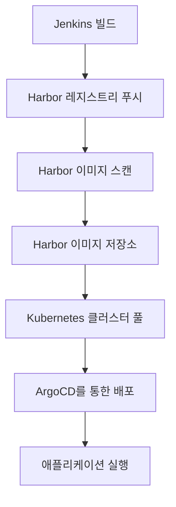
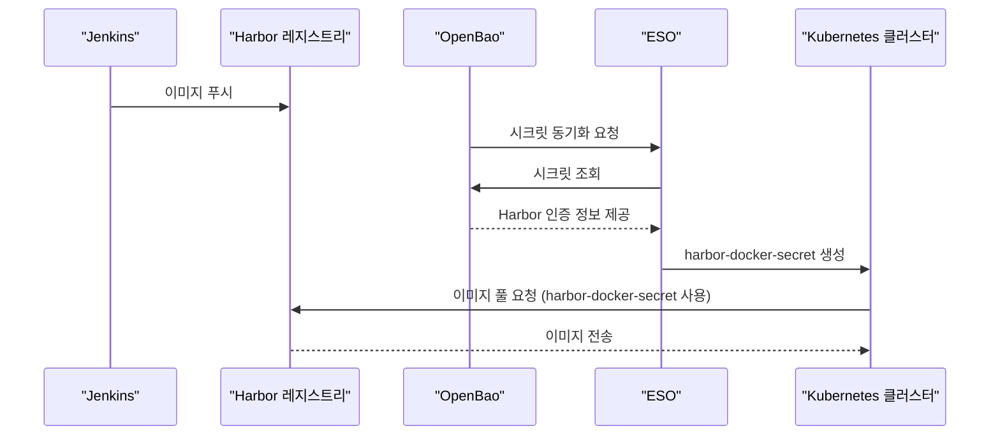
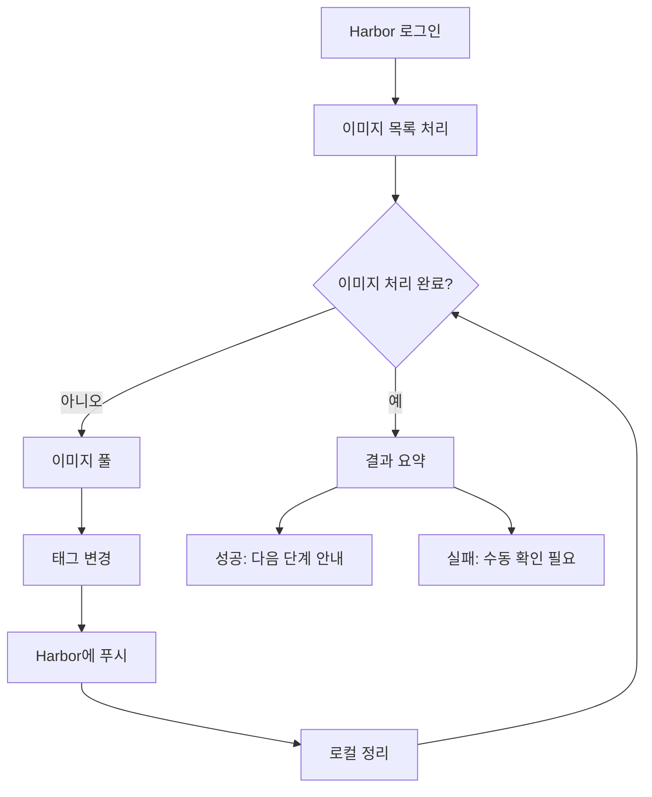
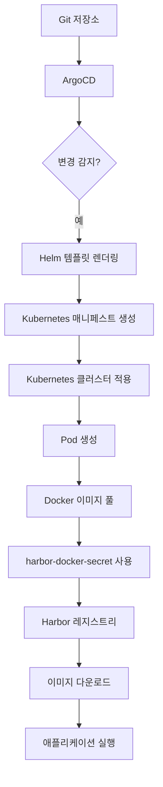

# 이미지 관리 흐름

<cite>
**이 문서에서 참조한 파일**   
- [README.md](file://README.md)
- [deploy-harbor-auth.sh](file://scripts/deploy-harbor-auth.sh)
- [migrate-images-to-harbor.sh](file://scripts/migrate-images-to-harbor.sh)
- [harbor/values.yaml](file://helm/development-tools/harbor/values.yaml)
- [harbor/README.md](file://helm/development-tools/harbor/README.md)
- [openbao-secrets-manager/templates/harbor-registry-secret.yaml](file://helm/shared-configs/openbao-secrets-manager/templates/harbor-registry-secret.yaml)
- [plate-api/values.yaml](file://helm/applications/plate-server/values.yaml)
</cite>

## 목차
1. [소개](#소개)
2. [컨테이너 이미지 라이프사이클 개요](#컨테이너-이미지-라이프사이클-개요)
3. [Harbor 레지스트리 설정 및 인증](#harbor-레지스트리-설정-및-인증)
4. [이미지 마이그레이션 절차](#이미지-마이그레이션-절차)
5. [이미지 스캔 및 보안 정책](#이미지-스캔-및-보안-정책)
6. [Kubernetes 클러스터에서의 이미지 배포](#kubernetes-클러스터에서의-이미지-배포)
7. [결론](#결론)

## 소개

이 문서는 Jenkins에서 빌드된 컨테이너 이미지가 Harbor 레지스트리에 푸시되고, Kubernetes 클러스터의 애플리케이션이 이를 풀하여 배포되는 전체 라이프사이클을 설명합니다. Harbor의 이미지 스캔, 접근 제어, 복제 기능과, `deploy-harbor-auth.sh` 스크립트를 통한 인증 설정 방법을 다룹니다. 또한 기존 이미지 저장소에서 Harbor로의 마이그레이션 절차와, `migrate-images-to-harbor.sh` 스크립트의 동작 원리를 설명하며, 이미지의 버전 관리, 태깅 전략, 그리고 취약점 스캔 결과에 기반한 보안 정책 적용에 대해 설명합니다.

**Section sources**
- [README.md](file://README.md#L1-L461)

## 컨테이너 이미지 라이프사이클 개요

컨테이너 이미지의 라이프사이클은 다음과 같은 주요 단계로 구성됩니다:

1. **빌드**: Jenkins CI/CD 파이프라인에서 소스 코드를 기반으로 컨테이너 이미지를 빌드합니다.
2. **푸시**: 빌드된 이미지를 Harbor 프라이빗 레지스트리로 푸시합니다.
3. **스캔**: Harbor는 Trivy 스캐너를 사용하여 이미지에 대한 취약점 스캔을 수행합니다.
4. **저장 및 관리**: 이미지는 Harbor의 프로젝트에 저장되며, 접근 제어 및 복제 정책이 적용됩니다.
5. **풀**: Kubernetes 클러스터의 애플리케이션은 Helm 차트를 통해 Harbor에서 이미지를 풀합니다.
6. **배포**: ArgoCD GitOps 파이프라인을 통해 애플리케이션이 Kubernetes 클러스터에 배포됩니다.

이러한 흐름은 DevOps 프로젝트의 GitOps 기반 인프라와 통합되어 있으며, Helm과 ArgoCD를 활용한 선언적 배포를 지원합니다.



**Diagram sources**
- [README.md](file://README.md#L1-L461)

## Harbor 레지스트리 설정 및 인증

Harbor는 프라이빗 컨테이너 이미지 레지스트리로서, 이미지 저장, 스캔, 접근 제어 등의 기능을 제공합니다. 이 프로젝트에서는 Helm 차트를 통해 Harbor를 Kubernetes 클러스터에 배포하며, `helm/development-tools/harbor/values.yaml` 파일을 통해 다양한 설정을 구성합니다.

### Harbor 주요 설정

- **노출 방식**: `ingress`를 통해 외부에 노출되며, TLS가 활성화되어 있습니다.
- **외부 URL**: `https://harbor.cocdev.co.kr`로 설정되어 있으며, 인그레스 호스트와 일치합니다.
- **지속성**: `persistence.enabled`가 `true`로 설정되어 있으며, `openebs-hostpath` 스토리지 클래스를 사용합니다.
- **관리자 비밀번호**: `Harbor12345`로 기본 설정되어 있으며, 포털에서 변경해야 합니다.
- **Trivy 스캔**: `trivy.enabled`가 `true`로 설정되어 있으며, OS 및 라이브러리 취약점을 스캔합니다.

### 인증 설정

Harbor에 대한 인증은 OpenBao를 통해 중앙화된 시크릿 관리 시스템으로 처리됩니다. `deploy-harbor-auth.sh` 스크립트는 ArgoCD를 통해 Harbor 인증을 위한 ESO(External Secrets Operator) 리소스를 배포합니다.

스크립트의 주요 동작은 다음과 같습니다:

1. **필수 파일 확인**: `serviceaccount.yaml`, `openbao-token-secret.yaml`, `secret-store.yaml`, `external-secret.yaml` 파일이 존재하는지 확인합니다.
2. **OpenBao 토큰 확인**: `openbao-token-secret.yaml` 파일에 OpenBao 토큰이 설정되어 있는지 확인합니다.
3. **네임스페이스 생성**: `plate-stg` 및 `plate-prod` 네임스페이스를 생성합니다.
4. **ESO 설치 확인**: `external-secrets-system` 네임스페이스에 ESO가 설치되어 있고 실행 중인지 확인합니다.
5. **ArgoCD Application 배포**: `harbor-auth.yaml` 파일을 사용하여 ArgoCD Application을 생성하고 동기화합니다.
6. **배포 상태 확인**: SecretStore, ExternalSecret, Harbor Docker Secret의 상태를 확인합니다.

최종적으로, Harbor Robot Account가 생성되어야 하며, OpenBao에 Harbor 인증 정보가 저장되어 있어야 합니다. 이후 `verify-harbor-auth.sh` 스크립트를 실행하여 인증을 검증하고, 애플리케이션을 재배포하여 Harbor 이미지를 성공적으로 풀할 수 있어야 합니다.



**Diagram sources**
- [deploy-harbor-auth.sh](file://scripts/deploy-harbor-auth.sh#L1-L194)
- [harbor/values.yaml](file://helm/development-tools/harbor/values.yaml#L1-L1070)
- [harbor/README.md](file://helm/development-tools/harbor/README.md#L24-L424)

**Section sources**
- [deploy-harbor-auth.sh](file://scripts/deploy-harbor-auth.sh#L1-L194)
- [harbor/values.yaml](file://helm/development-tools/harbor/values.yaml#L1-L1070)
- [harbor/README.md](file://helm/development-tools/harbor/README.md#L24-L424)

## 이미지 마이그레이션 절차

기존 Docker Hub에 저장된 이미지를 Harbor 레지스트리로 마이그레이션하기 위해 `migrate-images-to-harbor.sh` 스크립트를 사용합니다.

### 마이그레이션 스크립트 동작 원리

1. **Harbor 로그인**: 스크립트는 `docker login` 명령을 사용하여 Harbor에 로그인합니다. 로그인 정보는 스크립트 내에 하드코딩되어 있습니다 (`HARBOR_URL`, `HARBOR_USER`, `HARBOR_PASSWORD`).
2. **이미지 목록 처리**: `IMAGES` 배열에 정의된 이미지 목록을 순회합니다. 현재는 `kimjoongwon/server:48` 하나의 이미지만 마이그레이션 대상으로 설정되어 있습니다.
3. **이미지 풀**: 각 이미지를 로컬로 `docker pull`합니다.
4. **태그 변경**: 이미지에 Harbor 레지스트리 URL과 프로젝트 경로를 포함한 새로운 태그를 지정합니다 (예: `harbor.cocdev.co.kr/server-stg/server:48`).
5. **Harbor에 푸시**: `docker push` 명령을 사용하여 태그가 변경된 이미지를 Harbor로 푸시합니다.
6. **로컬 정리**: 푸시 후 로컬에서 Harbor 태그가 지정된 이미지를 삭제합니다.

스크립트는 성공/실패 카운터를 유지하며, 모든 이미지의 마이그레이션이 완료되면 결과를 요약합니다. 성공 시 다음 단계로 OpenBao에 Harbor 인증 정보 저장, ESO 리소스 배포, 애플리케이션 재배포를 안내합니다.



**Diagram sources**
- [migrate-images-to-harbor.sh](file://scripts/migrate-images-to-harbor.sh#L1-L120)

**Section sources**
- [migrate-images-to-harbor.sh](file://scripts/migrate-images-to-harbor.sh#L1-L120)

## 이미지 스캔 및 보안 정책

Harbor는 내장된 Trivy 스캐너를 사용하여 컨테이너 이미지의 취약점을 스캔합니다. 이는 이미지의 보안성을 보장하고, 취약점이 있는 이미지의 배포를 방지하는 데 중요한 역할을 합니다.

### Trivy 스캔 설정

`harbor/values.yaml` 파일에서 Trivy 관련 설정을 확인할 수 있습니다:

- `trivy.enabled: true`: Trivy 스캐너를 활성화합니다.
- `trivy.vulnType: os,library`: OS 패키지와 애플리케이션 라이브러리의 취약점을 모두 스캔합니다.
- `trivy.severity: UNKNOWN,LOW,MEDIUM,HIGH,CRITICAL`: 모든 심각도의 취약점을 스캔합니다.
- `trivy.skipUpdate: false`: GitHub에서 Trivy DB를 다운로드하여 최신 상태로 유지합니다.

### 보안 정책 적용

이미지 스캔 결과는 다음과 같은 방식으로 보안 정책에 반영됩니다:

1. **취약점 보고서**: Harbor UI에서 각 이미지의 스캔 결과를 확인할 수 있으며, 발견된 취약점의 심각도, CVE 번호, 영향을 받는 패키지 등을 확인할 수 있습니다.
2. **정책 기반 블록**: Harbor는 정책을 설정하여 특정 심각도 이상의 취약점이 있는 이미지의 푸시 또는 풀을 차단할 수 있습니다. 예를 들어, HIGH 또는 CRITICAL 심각도의 취약점이 있는 이미지는 푸시가 거부될 수 있습니다.
3. **자동화된 대응**: CI/CD 파이프라인에서 이미지 스캔 결과를 확인하고, 취약점이 있는 경우 빌드를 실패시켜 배포를 중단할 수 있습니다.

이러한 보안 정책은 이미지의 품질과 보안을 보장하며, 프로덕션 환경에 배포되는 이미지의 신뢰성을 높입니다.

**Section sources**
- [harbor/values.yaml](file://helm/development-tools/harbor/values.yaml#L1-L1070)
- [harbor/README.md](file://helm/development-tools/harbor/README.md#L24-L424)

## Kubernetes 클러스터에서의 이미지 배포

Harbor에 저장된 이미지는 Kubernetes 클러스터의 애플리케이션에 의해 풀되어 배포됩니다. 이 과정은 Helm 차트와 ArgoCD GitOps 파이프라인을 통해 자동화됩니다.

### 이미지 풀을 위한 인증 설정

Kubernetes 클러스터가 Harbor에서 이미지를 풀하려면 인증 정보가 필요합니다. 이는 `imagePullSecrets`를 통해 제공됩니다.

1. **OpenBao에 시크릿 저장**: `create-secrets.sh` 스크립트를 사용하여 Harbor Robot Account의 사용자명과 비밀번호를 OpenBao에 저장합니다. 이 정보는 `secret/harbor/staging` 및 `secret/harbor/production` 경로에 저장됩니다.
2. **ESO를 통한 동기화**: `openbao-secrets-manager` Helm 차트는 ESO를 사용하여 OpenBao의 시크릿을 Kubernetes Secret으로 동기화합니다. `harbor-registry-secret.yaml` 템플릿은 OpenBao에서 `registry`, `username`, `password` 속성을 가져와 `.dockerconfigjson` 형식의 Docker 인증 정보를 생성합니다.
3. **harbor-docker-secret 생성**: 동기화된 결과로 `harbor-docker-secret`이라는 Kubernetes Secret이 `plate-stg` 및 `plate-prod` 네임스페이스에 생성됩니다.

### Helm 차트를 통한 이미지 참조

애플리케이션 Helm 차트(예: `plate-api`)는 `values.yaml` 파일에서 이미지 정보를 정의합니다.

```yaml
backend:
  image:
    repository: harbor.cocdev.co.kr/stg-server/server
    tag: "latest"
    pullPolicy: IfNotPresent
imagePullSecrets:
  - name: harbor-docker-secret
```

- `repository`: Harbor 레지스트리의 전체 URL과 프로젝트 경로를 포함합니다.
- `imagePullSecrets`: 앞서 생성된 `harbor-docker-secret`을 참조하여 인증 정보를 제공합니다.

### ArgoCD를 통한 배포

ArgoCD는 Git 저장소의 Helm 차트 정의를 감시하고, 변경 사항이 있을 때 자동으로 Kubernetes 클러스터에 배포합니다. `environments/argocd/apps/plate-api-stg.yaml`과 같은 ArgoCD Application 정의 파일은 `helm/applications/plate-server` 경로의 차트를 지정하고, `values-stg.yaml` 오버라이드를 적용합니다. 이로 인해 애플리케이션은 Harbor에서 이미지를 성공적으로 풀하고, 지정된 태그의 이미지로 배포됩니다.



**Diagram sources**
- [openbao-secrets-manager/templates/harbor-registry-secret.yaml](file://helm/shared-configs/openbao-secrets-manager/templates/harbor-registry-secret.yaml#L40-L77)
- [plate-api/values.yaml](file://helm/applications/plate-server/values.yaml#L1-L85)

**Section sources**
- [openbao-secrets-manager/templates/harbor-registry-secret.yaml](file://helm/shared-configs/openbao-secrets-manager/templates/harbor-registry-secret.yaml#L40-L77)
- [plate-api/values.yaml](file://helm/applications/plate-server/values.yaml#L1-L85)

## 결론

이 문서는 Jenkins에서 빌드된 컨테이너 이미지가 Harbor 레지스트리에 푸시되고, Kubernetes 클러스터의 애플리케이션이 이를 풀하여 배포되는 전체 라이프사이클을 상세히 설명했습니다. Harbor는 이미지 스캔, 접근 제어, 복제 기능을 통해 이미지의 보안과 관리를 강화하며, `deploy-harbor-auth.sh` 스크립트를 통해 OpenBao와 연동된 인증 설정을 자동화합니다. 또한, `migrate-images-to-harbor.sh` 스크립트를 사용하여 기존 저장소의 이미지를 Harbor로 원활하게 마이그레이션할 수 있습니다. 이미지의 버전 관리와 태깅 전략은 Helm 차트를 통해 명확하게 정의되며, 취약점 스캔 결과에 기반한 보안 정책은 프로덕션 환경의 안정성과 신뢰성을 보장합니다. 이와 같은 통합된 이미지 관리 흐름은 DevOps 프로세스의 자동화와 보안을 극대화합니다.