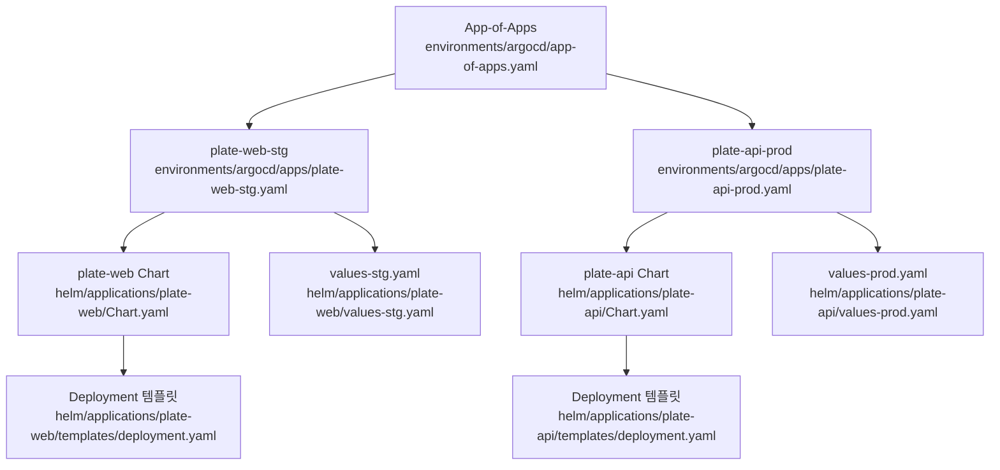
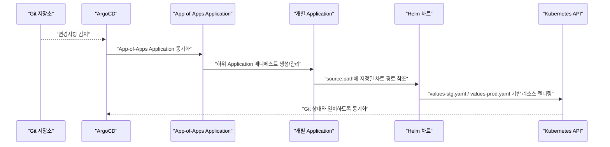
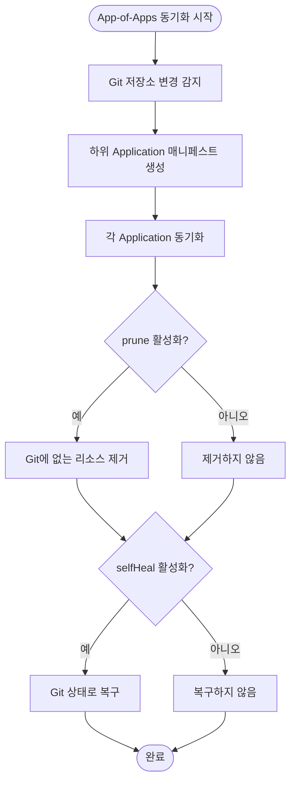
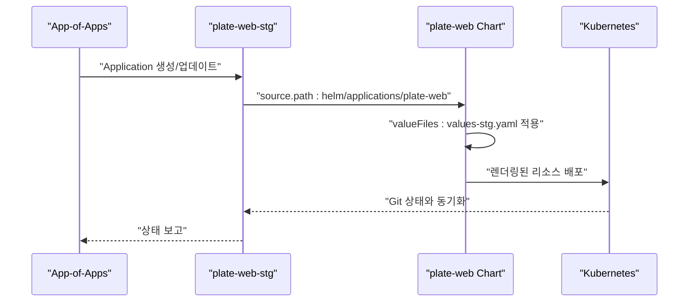
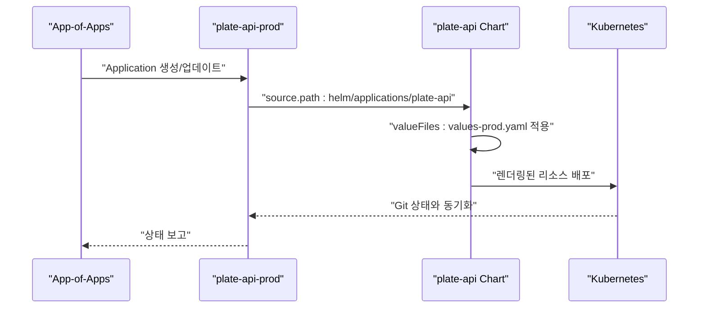
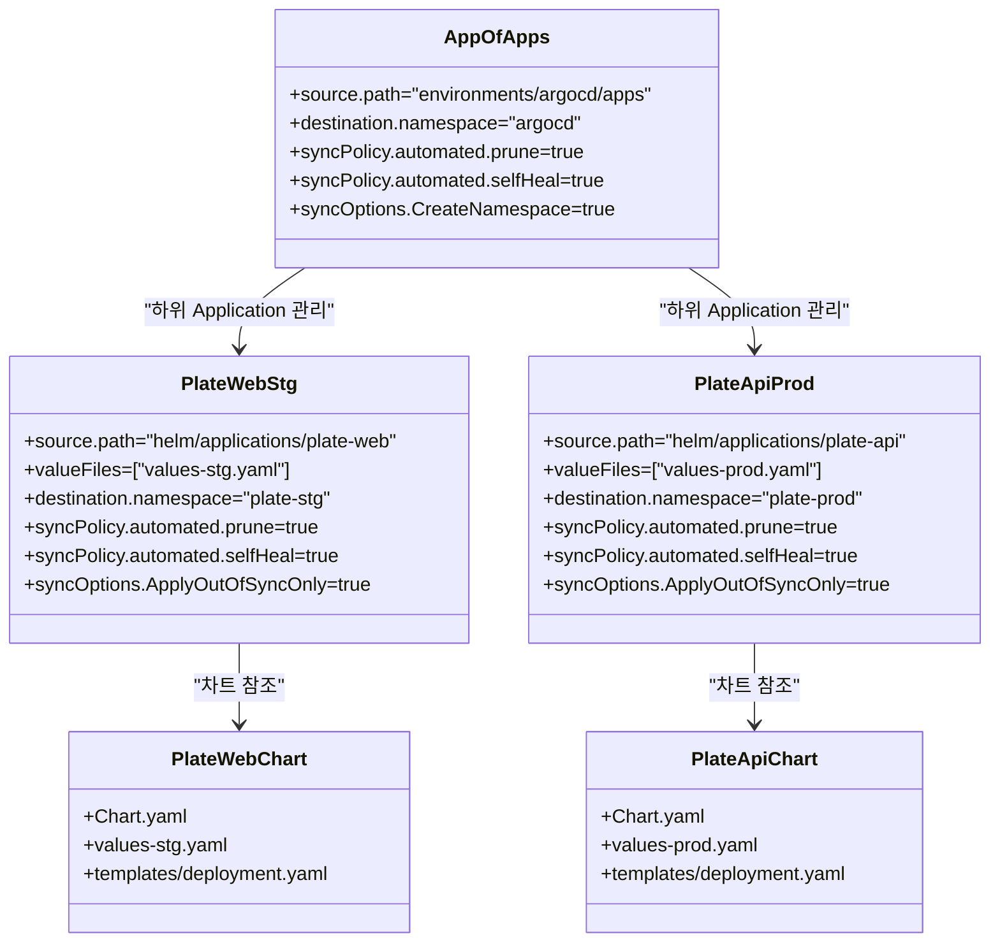
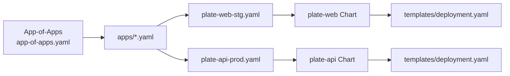

# App-of-Apps 패턴

<cite>
**문서에서 인용하는 파일**
- [environments/argocd/app-of-apps.yaml](file://environments/argocd/app-of-apps.yaml)
- [environments/argocd/apps/plate-web-stg.yaml](file://environments/argocd/apps/plate-web-stg.yaml)
- [environments/argocd/apps/plate-api-prod.yaml](file://environments/argocd/apps/plate-api-prod.yaml)
- [helm/applications/plate-web/Chart.yaml](file://helm/applications/plate-web/Chart.yaml)
- [helm/applications/plate-api/Chart.yaml](file://helm/applications/plate-api/Chart.yaml)
- [helm/applications/plate-web/values-stg.yaml](file://helm/applications/plate-web/values-stg.yaml)
- [helm/applications/plate-api/values-prod.yaml](file://helm/applications/plate-api/values-prod.yaml)
- [helm/applications/plate-web/templates/deployment.yaml](file://helm/applications/plate-web/templates/deployment.yaml)
- [helm/applications/plate-api/templates/deployment.yaml](file://helm/applications/plate-api/templates/deployment.yaml)
- [README.md](file://README.md)
</cite>

## 목차
1. [소개](#소개)
2. [프로젝트 구조](#프로젝트-구조)
3. [핵심 컴포넌트](#핵심-컴포넌트)
4. [아키텍처 개요](#아키텍처-개요)
5. [상세 컴포넌트 분석](#상세-컴포넌트-분석)
6. [의존성 분석](#의존성-분석)
7. [성능 고려사항](#성능-고려사항)
8. [장애 대응 가이드](#장애-대응-가이드)
9. [결론](#결론)

## 소개
이 문서는 App-of-Apps 설계 패턴을 중심으로, environments/argocd/app-of-apps.yaml이 environments/argocd/apps 디렉토리 내 개별 ArgoCD Application 매니페스트를 어떻게 참조하고 관리하는지를 심층적으로 설명합니다. 또한, Helm 차트(helm/applications/, helm/development-tools/)와의 통합 방식, syncPolicy의 automated, prune, selfHeal 설정이 자동 동기화 및 상태 복구에 어떻게 기여하는지를 구체적인 코드 예시와 함께 기술합니다. 마지막으로, 이 아키텍처가 다중 환경(스테이징/프로덕션) 관리에 제공하는 이점을 제시합니다.

## 프로젝트 구조
- environments/argocd/app-of-apps.yaml: App-of-Apps 패턴의 메인 ArgoCD Application으로, environments/argocd/apps 디렉토리에 있는 모든 Application 매니페스트를 관리합니다.
- environments/argocd/apps/: 개별 Application 매니페스트들이 위치하며, 각 매니페스트는 특정 서비스와 환경(예: plate-web-stg.yaml, plate-api-prod.yaml)에 대한 Helm 차트 경로와 환경별 values를 지정합니다.
- helm/applications/: 각 서비스(Application)에 대한 Helm 차트가 위치하며, values-stg.yaml, values-prod.yaml을 통해 환경별 설정을 제공합니다.
- helm/development-tools/: 개발 도구(예: ArgoCD 자체)를 위한 Helm 차트가 위치합니다.

**다이어그램 출처**
- [environments/argocd/app-of-apps.yaml](file://environments/argocd/app-of-apps.yaml#L1-L35)
- [environments/argocd/apps/plate-web-stg.yaml](file://environments/argocd/apps/plate-web-stg.yaml#L1-L62)
- [environments/argocd/apps/plate-api-prod.yaml](file://environments/argocd/apps/plate-api-prod.yaml#L1-L62)
- [helm/applications/plate-web/Chart.yaml](file://helm/applications/plate-web/Chart.yaml#L1-L17)
- [helm/applications/plate-api/Chart.yaml](file://helm/applications/plate-api/Chart.yaml#L1-L16)
- [helm/applications/plate-web/values-stg.yaml](file://helm/applications/plate-web/values-stg.yaml#L1-L38)
- [helm/applications/plate-api/values-prod.yaml](file://helm/applications/plate-api/values-prod.yaml#L1-L31)
- [helm/applications/plate-web/templates/deployment.yaml](file://helm/applications/plate-web/templates/deployment.yaml#L1-L128)
- [helm/applications/plate-api/templates/deployment.yaml](file://helm/applications/plate-api/templates/deployment.yaml#L1-L61)

**섹션 출처**
- [environments/argocd/app-of-apps.yaml](file://environments/argocd/app-of-apps.yaml#L1-L35)
- [environments/argocd/apps/plate-web-stg.yaml](file://environments/argocd/apps/plate-web-stg.yaml#L1-L62)
- [environments/argocd/apps/plate-api-prod.yaml](file://environments/argocd/apps/plate-api-prod.yaml#L1-L62)
- [helm/applications/plate-web/Chart.yaml](file://helm/applications/plate-web/Chart.yaml#L1-L17)
- [helm/applications/plate-api/Chart.yaml](file://helm/applications/plate-api/Chart.yaml#L1-L16)
- [helm/applications/plate-web/values-stg.yaml](file://helm/applications/plate-web/values-stg.yaml#L1-L38)
- [helm/applications/plate-api/values-prod.yaml](file://helm/applications/plate-api/values-prod.yaml#L1-L31)
- [helm/applications/plate-web/templates/deployment.yaml](file://helm/applications/plate-web/templates/deployment.yaml#L1-L128)
- [helm/applications/plate-api/templates/deployment.yaml](file://helm/applications/plate-api/templates/deployment.yaml#L1-L61)

## 핵심 컴포넌트
- App-of-Apps Application (environments/argocd/app-of-apps.yaml)
  - source.path: environments/argocd/apps로 설정되어 있어, 해당 디렉토리에 있는 모든 Application 매니페스트를 대상으로 합니다.
  - destination.namespace: argocd로 설정되어 있어, ArgoCD가 설치된 네임스페이스에서 관리됩니다.
  - syncPolicy.automated.prune: true로 설정되어 있어, Git에 존재하지 않는 리소스는 클러스터에서도 자동 제거됩니다.
  - syncPolicy.automated.selfHeal: true로 설정되어 있어, 클러스터 상태가 Git과 다르게 변경되었을 경우 자동 복구됩니다.
  - syncOptions.CreateNamespace=true: 네임스페이스가 없을 경우 자동 생성됩니다.

- 개별 Application (plate-web-stg.yaml, plate-api-prod.yaml)
  - source.path: helm/applications/<서비스>로 지정되어 있으며, helm valueFiles를 통해 환경별 설정을 적용합니다.
  - destination.namespace: 각 환경에 맞는 네임스페이스(예: plate-stg, plate-prod)로 지정됩니다.
  - syncPolicy.automated.prune/selfHeal: 각 Application에 대해 자동 동기화 및 상태 복구가 활성화됩니다.
  - syncOptions.ApplyOutOfSyncOnly=true: 변경된 리소스만 적용되도록 성능 최적화가 이루어집니다.
  - retry: 동기화 실패 시 재시도 정책이 설정되어 있어, 안정적인 배포를 지원합니다.

**섹션 출처**
- [environments/argocd/app-of-apps.yaml](file://environments/argocd/app-of-apps.yaml#L1-L35)
- [environments/argocd/apps/plate-web-stg.yaml](file://environments/argocd/apps/plate-web-stg.yaml#L1-L62)
- [environments/argocd/apps/plate-api-prod.yaml](file://environments/argocd/apps/plate-api-prod.yaml#L1-L62)

## 아키텍처 개요
App-of-Apps 패턴은 하나의 ArgoCD Application이 다른 Application 매니페스트들을 관리함으로써, 계층화된 배포 구조를 실현합니다. environments/argocd/app-of-apps.yaml은 environments/argocd/apps 디렉토리에 있는 Application들을 자동으로 생성하고, 각 Application은 helm/applications/<서비스> 차트와 환경별 values를 통해 Kubernetes 리소스를 배포합니다.

**다이어그램 출처**
- [environments/argocd/app-of-apps.yaml](file://environments/argocd/app-of-apps.yaml#L1-L35)
- [environments/argocd/apps/plate-web-stg.yaml](file://environments/argocd/apps/plate-web-stg.yaml#L1-L62)
- [environments/argocd/apps/plate-api-prod.yaml](file://environments/argocd/apps/plate-api-prod.yaml#L1-L62)

**섹션 출처**
- [environments/argocd/app-of-apps.yaml](file://environments/argocd/app-of-apps.yaml#L1-L35)
- [environments/argocd/apps/plate-web-stg.yaml](file://environments/argocd/apps/plate-web-stg.yaml#L1-L62)
- [environments/argocd/apps/plate-api-prod.yaml](file://environments/argocd/apps/plate-api-prod.yaml#L1-L62)

## 상세 컴포넌트 분석

### App-of-Apps Application (environments/argocd/app-of-apps.yaml)
- 역할: environments/argocd/apps 디렉토리에 있는 모든 Application 매니페스트를 관리하며, Git 변경 시 자동 동기화를 통해 하위 Application들을 생성/관리합니다.
- 동기화 정책:
  - automated.prune: true → Git에 없는 리소스는 클러스터에서도 제거됩니다.
  - automated.selfHeal: true → 수동 변경이 감지되면 Git 상태로 복구됩니다.
  - syncOptions.CreateNamespace=true → 네임스페이스가 없을 경우 자동 생성됩니다.

**다이어그램 출처**
- [environments/argocd/app-of-apps.yaml](file://environments/argocd/app-of-apps.yaml#L1-L35)

**섹션 출처**
- [environments/argocd/app-of-apps.yaml](file://environments/argocd/app-of-apps.yaml#L1-L35)

### plate-web-stg Application (environments/argocd/apps/plate-web-stg.yaml)
- 역할: plate-web 서비스의 스테이징 환경 배포를 담당하며, Helm 차트(helm/applications/plate-web)와 values-stg.yaml을 사용합니다.
- 동기화 정책:
  - automated.prune: true
  - automated.selfHeal: true
  - syncOptions.ApplyOutOfSyncOnly=true: 변경된 리소스만 적용
  - retry: 최대 5회 재시도, 지수 백오프로 대기 시간 증가

**다이어그램 출처**
- [environments/argocd/apps/plate-web-stg.yaml](file://environments/argocd/apps/plate-web-stg.yaml#L1-L62)
- [helm/applications/plate-web/Chart.yaml](file://helm/applications/plate-web/Chart.yaml#L1-L17)
- [helm/applications/plate-web/values-stg.yaml](file://helm/applications/plate-web/values-stg.yaml#L1-L38)

**섹션 출처**
- [environments/argocd/apps/plate-web-stg.yaml](file://environments/argocd/apps/plate-web-stg.yaml#L1-L62)
- [helm/applications/plate-web/Chart.yaml](file://helm/applications/plate-web/Chart.yaml#L1-L17)
- [helm/applications/plate-web/values-stg.yaml](file://helm/applications/plate-web/values-stg.yaml#L1-L38)

### plate-api-prod Application (environments/argocd/apps/plate-api-prod.yaml)
- 역할: plate-api 서비스의 프로덕션 환경 배포를 담당하며, Helm 차트(helm/applications/plate-api)와 values-prod.yaml을 사용합니다.
- 동기화 정책:
  - automated.prune: true
  - automated.selfHeal: true
  - syncOptions.ApplyOutOfSyncOnly=true
  - retry: 최대 3회 재시도, 지수 백오프

**다이어그램 출처**
- [environments/argocd/apps/plate-api-prod.yaml](file://environments/argocd/apps/plate-api-prod.yaml#L1-L62)
- [helm/applications/plate-api/Chart.yaml](file://helm/applications/plate-api/Chart.yaml#L1-L16)
- [helm/applications/plate-api/values-prod.yaml](file://helm/applications/plate-api/values-prod.yaml#L1-L31)

**섹션 출처**
- [environments/argocd/apps/plate-api-prod.yaml](file://environments/argocd/apps/plate-api-prod.yaml#L1-L62)
- [helm/applications/plate-api/Chart.yaml](file://helm/applications/plate-api/Chart.yaml#L1-L16)
- [helm/applications/plate-api/values-prod.yaml](file://helm/applications/plate-api/values-prod.yaml#L1-L31)

### Helm 차트 통합 (plate-web, plate-api)
- plate-web Chart
  - Chart.yaml: 서비스 이름, 버전, 소스 정보를 포함합니다.
  - values-stg.yaml: 스테이징 환경에 맞춘 replicaCount, image, backend, resources 등의 설정이 정의되어 있습니다.
  - templates/deployment.yaml: Deployment 리소스를 정의하며, ConfigMap을 통한 설정 관리, 프록시/백엔드 컨테이너 구성을 포함합니다.

- plate-api Chart
  - Chart.yaml: 서비스 이름, 버전, 소스 정보를 포함합니다.
  - values-prod.yaml: 프로덕션 환경에 맞춘 replicaCount, image, service, resources 등의 설정이 정의되어 있습니다.
  - templates/deployment.yaml: Deployment 리소스를 정의하며, ConfigMap을 통한 설정 관리, 백엔드 컨테이너 구성을 포함합니다.

**다이어그램 출처**
- [environments/argocd/app-of-apps.yaml](file://environments/argocd/app-of-apps.yaml#L1-L35)
- [environments/argocd/apps/plate-web-stg.yaml](file://environments/argocd/apps/plate-web-stg.yaml#L1-L62)
- [environments/argocd/apps/plate-api-prod.yaml](file://environments/argocd/apps/plate-api-prod.yaml#L1-L62)
- [helm/applications/plate-web/Chart.yaml](file://helm/applications/plate-web/Chart.yaml#L1-L17)
- [helm/applications/plate-api/Chart.yaml](file://helm/applications/plate-api/Chart.yaml#L1-L16)
- [helm/applications/plate-web/values-stg.yaml](file://helm/applications/plate-web/values-stg.yaml#L1-L38)
- [helm/applications/plate-api/values-prod.yaml](file://helm/applications/plate-api/values-prod.yaml#L1-L31)
- [helm/applications/plate-web/templates/deployment.yaml](file://helm/applications/plate-web/templates/deployment.yaml#L1-L128)
- [helm/applications/plate-api/templates/deployment.yaml](file://helm/applications/plate-api/templates/deployment.yaml#L1-L61)

**섹션 출처**
- [helm/applications/plate-web/Chart.yaml](file://helm/applications/plate-web/Chart.yaml#L1-L17)
- [helm/applications/plate-api/Chart.yaml](file://helm/applications/plate-api/Chart.yaml#L1-L16)
- [helm/applications/plate-web/values-stg.yaml](file://helm/applications/plate-web/values-stg.yaml#L1-L38)
- [helm/applications/plate-api/values-prod.yaml](file://helm/applications/plate-api/values-prod.yaml#L1-L31)
- [helm/applications/plate-web/templates/deployment.yaml](file://helm/applications/plate-web/templates/deployment.yaml#L1-L128)
- [helm/applications/plate-api/templates/deployment.yaml](file://helm/applications/plate-api/templates/deployment.yaml#L1-L61)

## 의존성 분석
- App-of-Apps → 하위 Application: environments/argocd/app-of-apps.yaml이 environments/argocd/apps 디렉토리에 있는 Application 매니페스트를 관리합니다.
- 하위 Application → Helm 차트: 각 Application은 helm/applications/<서비스> 경로를 source.path로 참조하고, valueFiles를 통해 환경별 설정을 적용합니다.
- Helm 차트 → Kubernetes 리소스: templates/*.yaml 기반으로 Deployment, Service, ConfigMap 등의 리소스가 렌더링됩니다.

**다이어그램 출처**
- [environments/argocd/app-of-apps.yaml](file://environments/argocd/app-of-apps.yaml#L1-L35)
- [environments/argocd/apps/plate-web-stg.yaml](file://environments/argocd/apps/plate-web-stg.yaml#L1-L62)
- [environments/argocd/apps/plate-api-prod.yaml](file://environments/argocd/apps/plate-api-prod.yaml#L1-L62)
- [helm/applications/plate-web/templates/deployment.yaml](file://helm/applications/plate-web/templates/deployment.yaml#L1-L128)
- [helm/applications/plate-api/templates/deployment.yaml](file://helm/applications/plate-api/templates/deployment.yaml#L1-L61)

**섹션 출처**
- [environments/argocd/app-of-apps.yaml](file://environments/argocd/app-of-apps.yaml#L1-L35)
- [environments/argocd/apps/plate-web-stg.yaml](file://environments/argocd/apps/plate-web-stg.yaml#L1-L62)
- [environments/argocd/apps/plate-api-prod.yaml](file://environments/argocd/apps/plate-api-prod.yaml#L1-L62)
- [helm/applications/plate-web/templates/deployment.yaml](file://helm/applications/plate-web/templates/deployment.yaml#L1-L128)
- [helm/applications/plate-api/templates/deployment.yaml](file://helm/applications/plate-api/templates/deployment.yaml#L1-L61)

## 성능 고려사항
- syncOptions.ApplyOutOfSyncOnly=true: 변경된 리소스만 적용되도록 하여 배포 성능을 최적화합니다.
- retry.backoff.factor: 지수 백오프를 통해 재시도 간격을 점진적으로 늘림으로써, 임시 장애 상황에서도 안정적인 동기화를 유지합니다.
- CreateNamespace=true: 네임스페이스 누락 시 자동 생성으로 인해 수동 작업을 줄이고 배포 파이프라인 효율을 높입니다.

**섹션 출처**
- [environments/argocd/apps/plate-web-stg.yaml](file://environments/argocd/apps/plate-web-stg.yaml#L1-L62)
- [environments/argocd/apps/plate-api-prod.yaml](file://environments/argocd/apps/plate-api-prod.yaml#L1-L62)
- [environments/argocd/app-of-apps.yaml](file://environments/argocd/app-of-apps.yaml#L1-L35)

## 장애 대응 가이드
- 자동 복구 (selfHeal)
  - 클러스터 상태가 Git과 다를 경우, ArgoCD가 자동으로 Git 상태로 복구합니다. 문제가 반복될 경우, retry 설정을 통해 일정 횟수 재시도 후 중단됩니다.
- 리소스 제거 (prune)
  - Git에 더 이상 존재하지 않는 리소스는 자동으로 클러스터에서 제거되어, 상태 불일치를 방지합니다.
- 재시도 정책 (retry)
  - 지수 백오프를 사용하여 일시적인 네트워크나 API 서버 문제에 대응합니다. 프로덕션에서는 최대 재시도 횟수가 적게 설정되어 있어, 안정성을 우선합니다.

**섹션 출처**
- [environments/argocd/app-of-apps.yaml](file://environments/argocd/app-of-apps.yaml#L1-L35)
- [environments/argocd/apps/plate-web-stg.yaml](file://environments/argocd/apps/plate-web-stg.yaml#L1-L62)
- [environments/argocd/apps/plate-api-prod.yaml](file://environments/argocd/apps/plate-api-prod.yaml#L1-L62)

## 결론
App-of-Apps 패턴은 environments/argocd/app-of-apps.yaml을 통해 하위 Application 매니페스트를 일괄 관리하고, 각 Application은 Helm 차트와 환경별 values를 통해 스테이징/프로덕션 환경에 맞춘 배포를 실현합니다. syncPolicy의 automated, prune, selfHeal 설정은 자동 동기화와 상태 복구를 보장하며, retry 설정은 장애 상황에 대한 견고함을 제공합니다. 이 아키텍처는 계층화된 배포 구조(클러스터 서비스 → 개발 도구 → 애플리케이션)를 가능하게 하고, 다중 환경 관리에 있어 일관성과 안정성을 동시에 추구할 수 있습니다.