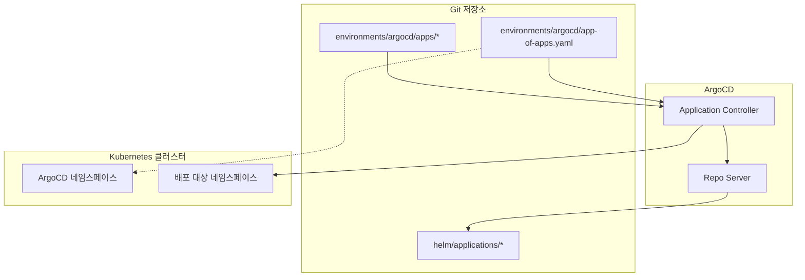
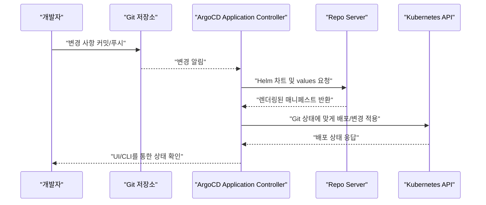
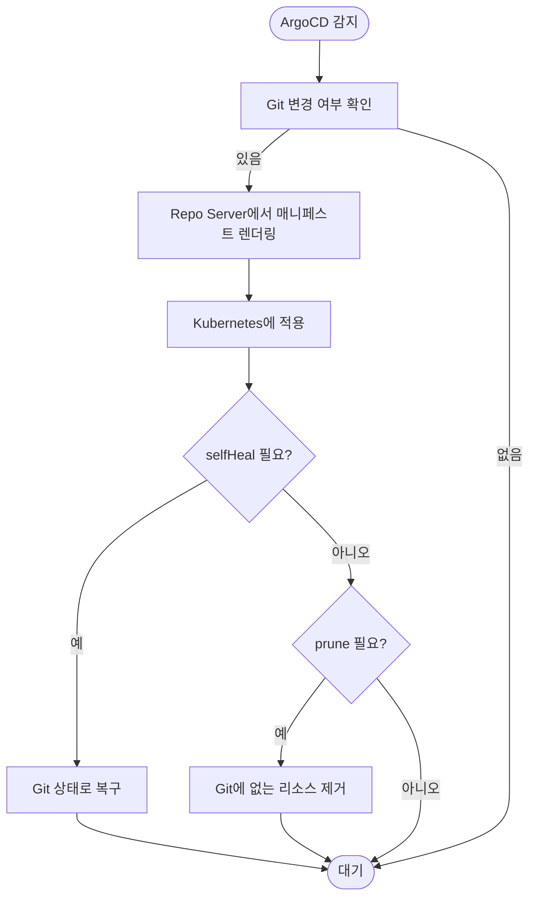
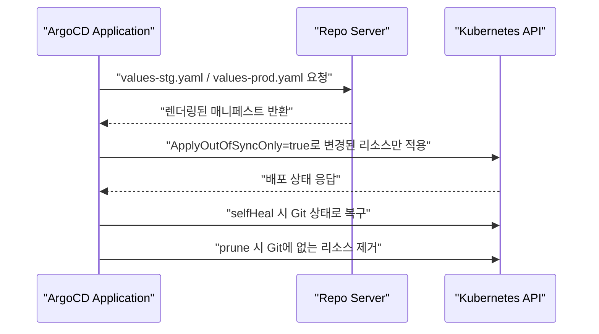
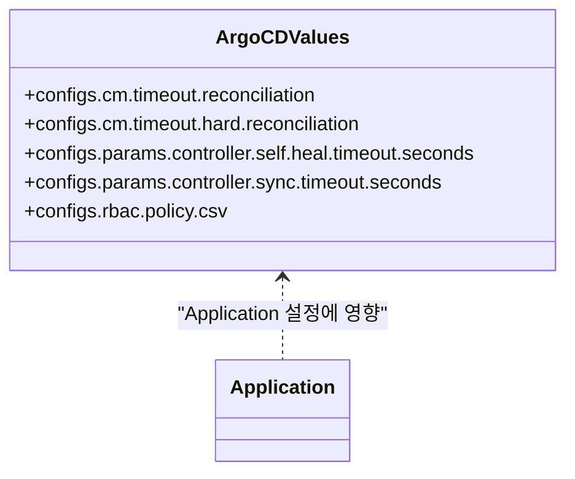
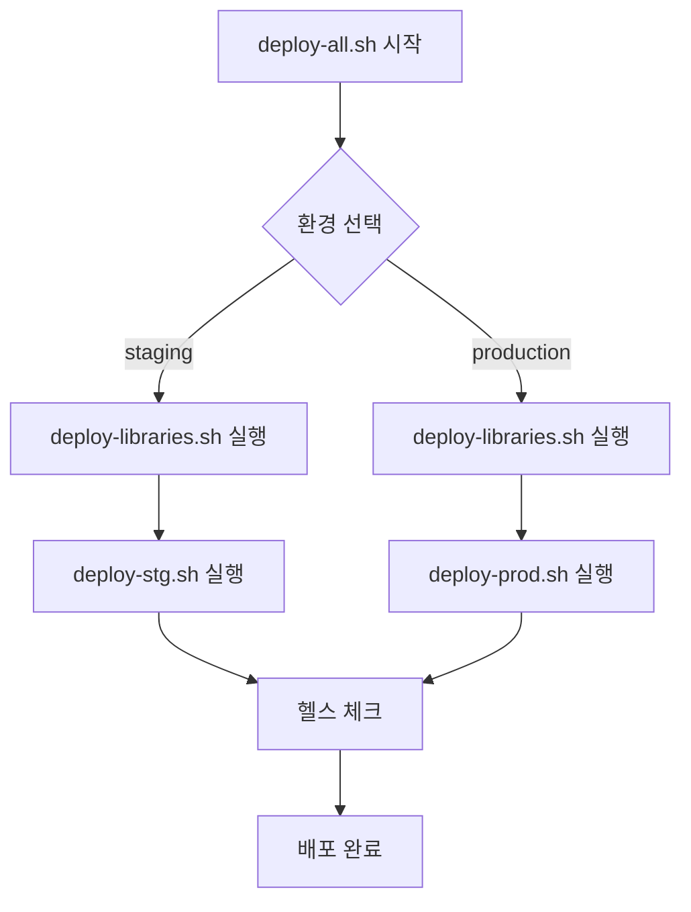
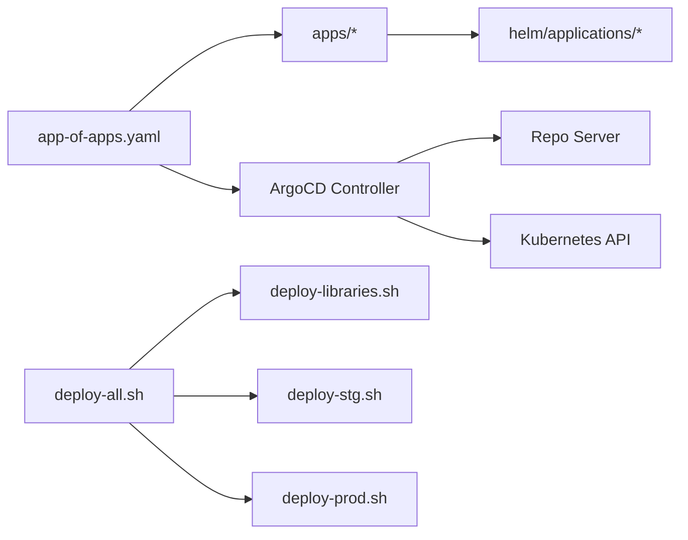

# GitOps 원칙

<cite>
**문서에서 참조하는 파일 목록**
- [README.md](file://README.md)
- [environments/argocd/app-of-apps.yaml](file://environments/argocd/app-of-apps.yaml)
- [environments/argocd/apps/plate-web-stg.yaml](file://environments/argocd/apps/plate-web-stg.yaml)
- [environments/argocd/apps/plate-api-prod.yaml](file://environments/argocd/apps/plate-api-prod.yaml)
- [scripts/deploy-all.sh](file://scripts/deploy-all.sh)
- [scripts/deploy-libraries.sh](file://scripts/deploy-libraries.sh)
- [scripts/deploy-stg.sh](file://scripts/deploy-stg.sh)
- [scripts/deploy-prod.sh](file://scripts/deploy-prod.sh)
- [helm/development-tools/argocd/values.yaml](file://helm/development-tools/argocd/values.yaml)
</cite>

## 목차
1. [소개](#소개)
2. [프로젝트 구조](#프로젝트-구조)
3. [핵심 구성 요소](#핵심-구성-요소)
4. [아키텍처 개요](#아키텍처-개요)
5. [상세 구성 요소 분석](#상세-구성-요소-분석)
6. [의존성 분석](#의존성-분석)
7. [성능 고려사항](#성능-고려사항)
8. [장애 대응 가이드](#장애-대응-가이드)
9. [결론](#결론)

## 소개
이 문서는 GitOps 운영 모델을 중심으로, Git 저장소를 유일한 진실의 원천(Single Source of Truth)으로 삼아 Kubernetes 클러스터 내 애플리케이션 상태를 선언적으로 관리하고 자동 동기화하는 방법을 설명합니다. ArgoCD의 App-of-Apps 패턴을 기반으로 한 선언적 구성이 어떻게 변경 사항의 추적성과 재현성을 보장하며, 스크립트 기반 배포가 GitOps 워크플로우를 어떻게 보완하는지를 구체적인 예시와 함께 설명합니다.

## 프로젝트 구조
- GitOps 기반 배포는 Helm 차트를 기반으로 하며, ArgoCD Application 리소스를 통해 선언적으로 관리됩니다.
- environments/argocd/app-of-apps.yaml이 App-of-Apps 패턴의 메인 Application으로, environments/argocd/apps/ 디렉토리에 있는 개별 Application들을 관리합니다.
- scripts/ 디렉토리에는 배포 자동화 스크립트가 위치하며, deploy-all.sh이 전체 배포 오케스트레이터 역할을 합니다.
- helm/development-tools/argocd/values.yaml은 ArgoCD 설치 및 동작 파라미터를 관리합니다.

**도표 출처**
- [environments/argocd/app-of-apps.yaml](file://environments/argocd/app-of-apps.yaml#L1-L35)
- [environments/argocd/apps/plate-web-stg.yaml](file://environments/argocd/apps/plate-web-stg.yaml#L1-L62)
- [helm/development-tools/argocd/values.yaml](file://helm/development-tools/argocd/values.yaml#L1-L120)

**섹션 출처**
- [README.md](file://README.md#L18-L213)
- [environments/argocd/app-of-apps.yaml](file://environments/argocd/app-of-apps.yaml#L1-L35)
- [scripts/deploy-all.sh](file://scripts/deploy-all.sh#L1-L279)

## 핵심 구성 요소
- App-of-Apps Application: environments/argocd/app-of-apps.yaml은 Git 저장소의 environments/argocd/apps를 소스로 하여 모든 하위 Application을 관리합니다. syncPolicy.automated, prune, selfHeal, CreateNamespace=true 등의 설정을 통해 Git 기반 자동 동기화가 활성화됩니다.
- 개별 Application: environments/argocd/apps/plate-web-stg.yaml, environments/argocd/apps/plate-api-prod.yaml 등은 각 서비스별 ArgoCD Application으로, Helm 차트 경로(path)와 환경별 values를 지정하여 배포합니다. syncPolicy.automated, prune, selfHeal, ApplyOutOfSyncOnly=true 등의 설정을 통해 Git 상태에 대한 자동 복구와 성능 최적화가 이루어집니다.
- ArgoCD 설치 및 파라미터: helm/development-tools/argocd/values.yaml은 ArgoCD의 ConfigMap, 파라미터, RBAC, SSH/TLS 설정 등을 관리하며, self-heal, sync timeout, reconciliation timeout 등 핵심 동작 파라미터를 설정합니다.
- 배포 스크립트: scripts/deploy-all.sh은 라이브러리(인프라/도구) 배포와 애플리케이션 배포를 오케스트레이션하며, deploy-libraries.sh, deploy-stg.sh, deploy-prod.sh은 각각 라이브러리 배포, 스테이징 배포, 프로덕션 배포를 담당합니다.

**섹션 출처**
- [environments/argocd/app-of-apps.yaml](file://environments/argocd/app-of-apps.yaml#L1-L35)
- [environments/argocd/apps/plate-web-stg.yaml](file://environments/argocd/apps/plate-web-stg.yaml#L1-L62)
- [environments/argocd/apps/plate-api-prod.yaml](file://environments/argocd/apps/plate-api-prod.yaml#L1-L62)
- [helm/development-tools/argocd/values.yaml](file://helm/development-tools/argocd/values.yaml#L388-L460)
- [scripts/deploy-all.sh](file://scripts/deploy-all.sh#L1-L279)
- [scripts/deploy-libraries.sh](file://scripts/deploy-libraries.sh#L1-L128)
- [scripts/deploy-stg.sh](file://scripts/deploy-stg.sh#L1-L173)
- [scripts/deploy-prod.sh](file://scripts/deploy-prod.sh#L1-L299)

## 아키텍처 개요
GitOps 워크플로우는 다음과 같습니다:
1. 코드 변경: Git 저장소에 변경 사항을 커밋합니다.
2. ArgoCD 감지: ArgoCD Application Controller가 Git 저장소를 폴링하여 변경 사항을 감지합니다.
3. 자동 배포: ArgoCD는 지정된 Helm 차트와 values를 기반으로 Kubernetes에 배포합니다.
4. 상태 동기화: Git 상태와 클러스터 상태가 일치하도록 self-heal이 작동하고, 불필요한 리소스는 prune으로 제거됩니다.

**도표 출처**
- [environments/argocd/app-of-apps.yaml](file://environments/argocd/app-of-apps.yaml#L1-L35)
- [environments/argocd/apps/plate-web-stg.yaml](file://environments/argocd/apps/plate-web-stg.yaml#L1-L62)
- [helm/development-tools/argocd/values.yaml](file://helm/development-tools/argocd/values.yaml#L388-L460)

**섹션 출처**
- [README.md](file://README.md#L356-L409)
- [environments/argocd/app-of-apps.yaml](file://environments/argocd/app-of-apps.yaml#L1-L35)

## 상세 구성 요소 분석

### App-of-Apps 패턴
- App-of-Apps Application은 Git 저장소의 environments/argocd/apps를 소스로 하여 모든 하위 Application을 관리합니다.
- syncPolicy.automated: Git 변경 시 자동 동기화를 활성화합니다.
- prune: Git에 존재하지 않는 리소스는 클러스터에서도 자동 제거됩니다.
- selfHeal: 수동 변경이 감지되면 Git 상태로 자동 복구됩니다.
- CreateNamespace=true: 네임스페이스가 없을 경우 자동 생성됩니다.

**도표 출처**
- [environments/argocd/app-of-apps.yaml](file://environments/argocd/app-of-apps.yaml#L21-L35)

**섹션 출처**
- [environments/argocd/app-of-apps.yaml](file://environments/argocd/app-of-apps.yaml#L1-L35)

### 개별 Application (plate-web-stg, plate-api-prod)
- Application은 Helm 차트 경로(path)와 환경별 values를 지정하여 배포합니다.
- syncPolicy.automated, prune, selfHeal, ApplyOutOfSyncOnly=true를 통해 Git 기반 자동 동기화와 성능 최적화가 이루어집니다.
- retry 설정을 통해 동기화 실패 시 재시도를 제어합니다.

**도표 출처**
- [environments/argocd/apps/plate-web-stg.yaml](file://environments/argocd/apps/plate-web-stg.yaml#L1-L62)
- [environments/argocd/apps/plate-api-prod.yaml](file://environments/argocd/apps/plate-api-prod.yaml#L1-L62)

**섹션 출처**
- [environments/argocd/apps/plate-web-stg.yaml](file://environments/argocd/apps/plate-web-stg.yaml#L1-L62)
- [environments/argocd/apps/plate-api-prod.yaml](file://environments/argocd/apps/plate-api-prod.yaml#L1-L62)

### ArgoCD 설치 및 파라미터
- configs.cm.timeout.reconciliation, configs.cm.timeout.hard.reconciliation: ArgoCD가 Git 변경을 감지하고 매니페스트를 새로 고치는 타임아웃을 설정합니다.
- configs.params.controller.self.heal.timeout.seconds: self-heal 시도 간격을 제어합니다.
- configs.params.controller.sync.timeout.seconds: sync 작업의 타임아웃을 설정합니다.
- configs.rbac.policy.csv: RBAC 권한 정책을 정의합니다.

**도표 출처**
- [helm/development-tools/argocd/values.yaml](file://helm/development-tools/argocd/values.yaml#L172-L213)
- [helm/development-tools/argocd/values.yaml](file://helm/development-tools/argocd/values.yaml#L388-L460)
- [helm/development-tools/argocd/values.yaml](file://helm/development-tools/argocd/values.yaml#L462-L515)

**섹션 출처**
- [helm/development-tools/argocd/values.yaml](file://helm/development-tools/argocd/values.yaml#L172-L213)
- [helm/development-tools/argocd/values.yaml](file://helm/development-tools/argocd/values.yaml#L388-L460)
- [helm/development-tools/argocd/values.yaml](file://helm/development-tools/argocd/values.yaml#L462-L515)

### 배포 스크립트 오케스트레이션 (deploy-all.sh)
- deploy-all.sh은 라이브러리 배포와 애플리케이션 배포를 오케스트레이션하며, 환경(staging/production)에 따라 배포 전략이 달라집니다.
- 라이브러리 배포: deploy-libraries.sh을 통해 cert-manager, MetalLB, Jenkins 등을 배포합니다.
- 애플리케이션 배포: deploy-stg.sh 또는 deploy-prod.sh을 통해 스테이징/프로덕션 환경에 배포합니다.
- 프로덕션 배포 시 사용자 확인, 자동 백업, 헬스 체크, 롤백 지원이 포함됩니다.

**도표 출처**
- [scripts/deploy-all.sh](file://scripts/deploy-all.sh#L1-L279)
- [scripts/deploy-libraries.sh](file://scripts/deploy-libraries.sh#L1-L128)
- [scripts/deploy-stg.sh](file://scripts/deploy-stg.sh#L1-L173)
- [scripts/deploy-prod.sh](file://scripts/deploy-prod.sh#L1-L299)

**섹션 출처**
- [scripts/deploy-all.sh](file://scripts/deploy-all.sh#L1-L279)
- [scripts/deploy-libraries.sh](file://scripts/deploy-libraries.sh#L1-L128)
- [scripts/deploy-stg.sh](file://scripts/deploy-stg.sh#L1-L173)
- [scripts/deploy-prod.sh](file://scripts/deploy-prod.sh#L1-L299)

## 의존성 분석
- App-of-Apps Application은 environments/argocd/apps 디렉토리에 있는 모든 Application을 관리합니다.
- 각 Application은 Helm 차트 경로(path)와 values를 지정하여 배포되며, ArgoCD는 Repo Server를 통해 매니페스트를 렌더링하고 Kubernetes에 적용합니다.
- 배포 스크립트는 ArgoCD를 보완하여 라이브러리(인프라/도구) 배포와 애플리케이션 배포를 순차적으로 관리합니다.

**도표 출처**
- [environments/argocd/app-of-apps.yaml](file://environments/argocd/app-of-apps.yaml#L1-L35)
- [environments/argocd/apps/plate-web-stg.yaml](file://environments/argocd/apps/plate-web-stg.yaml#L1-L62)
- [helm/development-tools/argocd/values.yaml](file://helm/development-tools/argocd/values.yaml#L388-L460)
- [scripts/deploy-all.sh](file://scripts/deploy-all.sh#L1-L279)

**섹션 출처**
- [environments/argocd/app-of-apps.yaml](file://environments/argocd/app-of-apps.yaml#L1-L35)
- [environments/argocd/apps/plate-web-stg.yaml](file://environments/argocd/apps/plate-web-stg.yaml#L1-L62)
- [scripts/deploy-all.sh](file://scripts/deploy-all.sh#L1-L279)

## 성능 고려사항
- ApplyOutOfSyncOnly=true: 변경된 리소스만 적용함으로써 동기화 성능을 최적화합니다.
- reconciliation timeout: ArgoCD가 Git 변경을 감지하고 매니페스트를 새로 고치는 타임아웃을 조절하여 과도한 API 부담을 피합니다.
- sync timeout: sync 작업의 타임아웃을 설정하여 장시간 걸리는 작업이 클러스터에 영향을 미치지 않도록 합니다.
- retry backoff: 동기화 실패 시 재시도 간격을 점진적으로 늘림으로써 임시 장애에 대한 회복력을 높입니다.

**섹션 출처**
- [environments/argocd/apps/plate-web-stg.yaml](file://environments/argocd/apps/plate-web-stg.yaml#L31-L61)
- [environments/argocd/apps/plate-api-prod.yaml](file://environments/argocd/apps/plate-api-prod.yaml#L31-L61)
- [helm/development-tools/argocd/values.yaml](file://helm/development-tools/argocd/values.yaml#L388-L460)

## 장애 대응 가이드
- 수동 변경 복구: selfHeal=true로 인해 수동 변경이 감지되면 Git 상태로 자동 복구됩니다.
- 불필요 리소스 제거: prune=true로 인해 Git에 존재하지 않는 리소스는 자동 제거됩니다.
- 동기화 실패 재시도: retry 설정을 통해 일시적인 오류에 대해 재시도가 이루어집니다.
- 프로덕션 롤백: deploy-prod.sh은 atomic 옵션과 rollback 기능을 제공하여 배포 실패 시 안전하게 롤백할 수 있습니다.
- 배포 검증: deploy-all.sh은 health check를 통해 배포 상태를 검증하고, 문제가 있을 경우 신속히 대응할 수 있습니다.

**섹션 출처**
- [environments/argocd/app-of-apps.yaml](file://environments/argocd/app-of-apps.yaml#L21-L35)
- [environments/argocd/apps/plate-web-stg.yaml](file://environments/argocd/apps/plate-web-stg.yaml#L31-L61)
- [environments/argocd/apps/plate-api-prod.yaml](file://environments/argocd/apps/plate-api-prod.yaml#L31-L61)
- [scripts/deploy-all.sh](file://scripts/deploy-all.sh#L183-L215)
- [scripts/deploy-prod.sh](file://scripts/deploy-prod.sh#L147-L173)

## 결론
이 프로젝트는 GitOps 원칙에 따라 Git 저장소를 유일한 진실의 원천으로 삼아, ArgoCD의 선언적 구성과 App-of-Apps 패턴을 통해 자동 동기화(self-healing)를 실현합니다. 변경 사항의 추적성과 재현성은 Helm 차트와 values 기반의 선언적 배포, ArgoCD의 자동화된 동작, 그리고 배포 스크립트의 검증 및 롤백 기능을 통해 보장됩니다. 이러한 접근은 수동 배포 오류를 줄이고 운영 안정성을 향상시키며, 프로덕션 환경에서는 특히 안전 검사와 롤백 전략을 통해 위험을 최소화합니다.