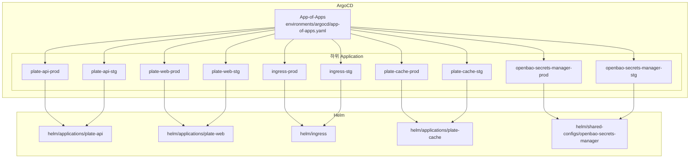
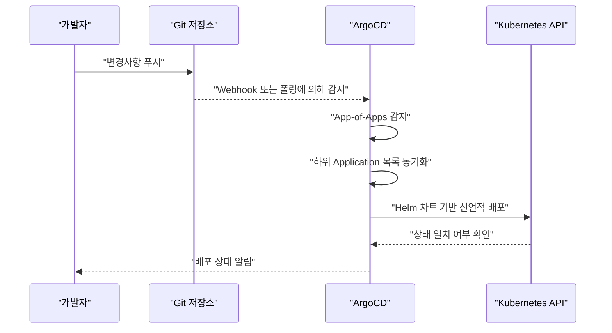
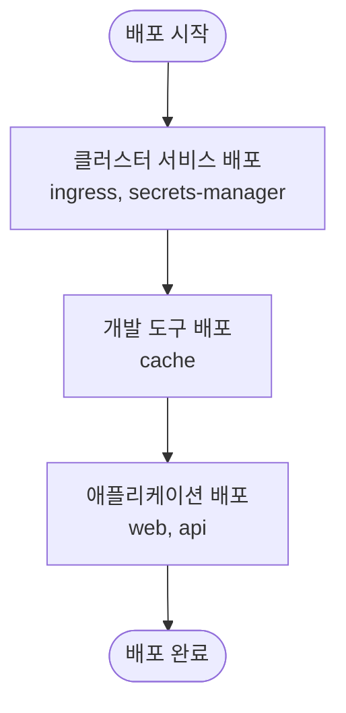

# 설계 패턴

<cite>
**문서에서 참조하는 파일**
- [environments/argocd/app-of-apps.yaml](file://environments/argocd/app-of-apps.yaml)
- [environments/argocd/README.md](file://environments/argocd/README.md)
- [environments/argocd/apps/plate-api-prod.yaml](file://environments/argocd/apps/plate-api-prod.yaml)
- [environments/argocd/apps/plate-web-prod.yaml](file://environments/argocd/apps/plate-web-prod.yaml)
- [environments/argocd/apps/ingress-prod.yaml](file://environments/argocd/apps/ingress-prod.yaml)
- [environments/argocd/apps/plate-cache-prod.yaml](file://environments/argocd/apps/plate-cache-prod.yaml)
- [environments/argocd/apps/openbao-secrets-manager-prod.yaml](file://environments/argocd/apps/openbao-secrets-manager-prod.yaml)
- [environments/argocd/apps/plate-api-stg.yaml](file://environments/argocd/apps/plate-api-stg.yaml)
- [environments/argocd/apps/plate-web-stg.yaml](file://environments/argocd/apps/plate-web-stg.yaml)
- [environments/argocd/apps/ingress-stg.yaml](file://environments/argocd/apps/ingress-stg.yaml)
- [environments/argocd/apps/plate-cache-stg.yaml](file://environments/argocd/apps/plate-cache-stg.yaml)
- [environments/argocd/apps/openbao-secrets-manager-stg.yaml](file://environments/argocd/apps/openbao-secrets-manager-stg.yaml)
- [helm/applications/plate-api/values-prod.yaml](file://helm/applications/plate-api/values-prod.yaml)
- [helm/applications/plate-api/values-stg.yaml](file://helm/applications/plate-api/values-stg.yaml)
- [helm/applications/plate-web/values-prod.yaml](file://helm/applications/plate-web/values-prod.yaml)
- [helm/applications/plate-web/values-stg.yaml](file://helm/applications/plate-web/values-stg.yaml)
</cite>

## 목차
1. [소개](#소개)
2. [프로젝트 구조](#프로젝트-구조)
3. [핵심 구성 요소](#핵심-구성-요소)
4. [아키텍처 개요](#아키텍처-개요)
5. [상세 구성 요소 분석](#상세-구성-요소-분석)
6. [의존성 분석](#의존성-분석)
7. [성능 고려사항](#성능-고려사항)
8. [장애 진단 가이드](#장애-진단-가이드)
9. [결론](#결론)

## 소개
이 문서는 저장소에서 사용하는 핵심 설계 패턴인 App-of-Apps(Apps-of-Apps) 패턴과 GitOps 원칙을 중심으로, ArgoCD를 통한 선언적 배포와 자동 동기화 메커니즘을 상세히 설명합니다. 또한, 스테이징(staging)과 프로덕션(production) 환경 분리를 통해 계층화된 배포 구조(클러스터 서비스 → 개발 도구 → 애플리케이션)의 이점을 기술하고, 이러한 패턴이 프로덕션 환경의 안정성과 유지보수성을 어떻게 향상시키는지 설명합니다.

## 프로젝트 구조
- environments/argocd/: ArgoCD Application 리소스와 GitOps 배포 설정이 위치합니다.
  - app-of-apps.yaml: App-of-Apps 패턴을 적용한 메인 Application으로, environments/argocd/apps 디렉터리에 있는 하위 Application들을 한 번에 관리합니다.
  - apps/: 각 환경(스테이징/프로덕션)별 Application 리소스가 위치합니다. 여기에는 인그레스, API 서버, 웹 애플리케이션, 캐시, 시크릿 관리자 등이 포함됩니다.
- helm/: Helm 차트와 환경별 values 파일이 위치합니다. 각 Application은 해당 차트를 사용하여 Kubernetes 리소스를 선언적으로 배포합니다.



**도표 출처**
- [environments/argocd/app-of-apps.yaml](file://environments/argocd/app-of-apps.yaml#L1-L35)
- [environments/argocd/apps/plate-api-prod.yaml](file://environments/argocd/apps/plate-api-prod.yaml#L1-L62)
- [environments/argocd/apps/plate-web-prod.yaml](file://environments/argocd/apps/plate-web-prod.yaml#L1-L62)
- [environments/argocd/apps/ingress-prod.yaml](file://environments/argocd/apps/ingress-prod.yaml#L1-L81)
- [environments/argocd/apps/plate-cache-prod.yaml](file://environments/argocd/apps/plate-cache-prod.yaml#L1-L51)
- [environments/argocd/apps/openbao-secrets-manager-prod.yaml](file://environments/argocd/apps/openbao-secrets-manager-prod.yaml#L1-L80)
- [environments/argocd/apps/plate-api-stg.yaml](file://environments/argocd/apps/plate-api-stg.yaml#L1-L62)
- [environments/argocd/apps/plate-web-stg.yaml](file://environments/argocd/apps/plate-web-stg.yaml#L1-L62)
- [environments/argocd/apps/ingress-stg.yaml](file://environments/argocd/apps/ingress-stg.yaml#L1-L70)
- [environments/argocd/apps/plate-cache-stg.yaml](file://environments/argocd/apps/plate-cache-stg.yaml#L1-L51)
- [environments/argocd/apps/openbao-secrets-manager-stg.yaml](file://environments/argocd/apps/openbao-secrets-manager-stg.yaml#L1-L78)

**섹션 출처**
- [environments/argocd/app-of-apps.yaml](file://environments/argocd/app-of-apps.yaml#L1-L35)
- [environments/argocd/README.md](file://environments/argocd/README.md#L1-L107)

## 핵심 구성 요소
- App-of-Apps(Application of Applications): environments/argocd/app-of-apps.yaml에 정의된 메인 Application으로, environments/argocd/apps 디렉터리에 있는 모든 Application을 한 번에 관리합니다. 이는 GitOps 원칙에 따라 선언적으로 배포되고, 자동 동기화 정책을 통해 변경사항이 자동으로 반영됩니다.
- GitOps 원칙: 코드 변경 → Git 푸시 → ArgoCD 감지 → 자동 배포 → 상태 동기화. 이 과정은 environments/argocd/README.md에 명시된 워크플로우를 따릅니다.
- 환경 분리 전략: 스테이징(stg)과 프로덕션(prod) 환경을 분리하여 서로 다른 values 파일과 동기화 정책을 적용함으로써 안정성과 실험 공간을 동시에 확보합니다.
- 계층화된 배포 구조: 클러스터 서비스(예: 인그레스, 시크릿 관리자) → 개발 도구 → 애플리케이션(웹, API, 캐시) 순으로 배포되며, ArgoCD의 sync-wave 등을 통해 의도된 순서를 보장합니다.

**섹션 출처**
- [environments/argocd/app-of-apps.yaml](file://environments/argocd/app-of-apps.yaml#L1-L35)
- [environments/argocd/README.md](file://environments/argocd/README.md#L59-L66)

## 아키텍처 개요
다음은 App-of-Apps 패턴을 기반으로 한 GitOps 배포 흐름을 보여줍니다. 메인 Application이 하위 Application들을 감시하고, 각 하위 Application은 Helm 차트를 사용해 Kubernetes에 선언적으로 배포됩니다. 동기화 정책은 프로덕션과 스테이징 환경에 따라 다르게 적용됩니다.



**도표 출처**
- [environments/argocd/app-of-apps.yaml](file://environments/argocd/app-of-apps.yaml#L1-L35)
- [environments/argocd/README.md](file://environments/argocd/README.md#L59-L66)

## 상세 구성 요소 분석

### App-of-Apps 패턴
- 역할: environments/argocd/app-of-apps.yaml은 단일 Application 리소스로, environments/argocd/apps 디렉터리에 있는 모든 하위 Application을 관리합니다. 이는 GitOps 원칙에 따라 선언적으로 배포되고, 자동 동기화 정책을 통해 변경사항이 자동으로 반영됩니다.
- 동기화 정책: prune(true), selfHeal(true), CreateNamespace=true 등이 적용되어 Git 상태와 Kubernetes 상태를 지속적으로 일치시킵니다.
- 정보 필드: Description, Environment, Components, Namespaces 등의 정보를 ArgoCD UI에 표시하여 운영 편의성을 높입니다.

**섹션 출처**
- [environments/argocd/app-of-apps.yaml](file://environments/argocd/app-of-apps.yaml#L1-L35)

### GitOps 원칙
- 워크플로우: 코드 변경 → Git 푸시 → ArgoCD 감지 → 자동 배포 → 상태 동기화. environments/argocd/README.md에 명시된 3분 이내 자동 감지 및 자동 배포 과정을 따릅니다.
- 보안 고려사항: Private repository 사용, RBAC 접근 제한, External Secrets 또는 Sealed Secrets 사용, 컨테이너 이미지 스캔 적용 등이 권장됩니다.

**섹션 출처**
- [environments/argocd/README.md](file://environments/argocd/README.md#L59-L66)
- [environments/argocd/README.md](file://environments/argocd/README.md#L101-L107)

### 프로덕션 환경(plate-web, plate-api, ingress, cache, secrets-manager)
- plate-web-prod: Helm 차트를 사용하여 웹 애플리케이션을 배포하고, 프로덕션 환경에 맞춘 values를 적용합니다. 동기화 정책은 보수적이며, 네임스페이스 생성, 변경된 리소스만 적용, 재시도 정책이 설정되어 있습니다.
- plate-api-prod: 내부 API 서버를 배포하며, 프로덕션 환경에 맞춘 values를 적용합니다. 동기화 정책은 보수적이며, 네임스페이스 생성, 변경된 리소스만 적용, 재시도 정책이 설정되어 있습니다.
- ingress-prod: 인그레스 컨트롤러를 배포하여 plate-web 및 plate-api 라우팅을 처리합니다. ignoreDifferences 설정을 통해 클러스터가 자동 추가하는 annotation 변경을 무시하고, 리소스 교체 방식을 적용합니다.
- plate-cache-prod: 캐시 스토리지를 배포하며, sync-wave를 사용하여 먼저 스토리지를 생성합니다. 네임스페이스 생성, 변경된 리소스만 적용이 설정되어 있습니다.
- openbao-secrets-manager-prod: 프로덕션 환경의 시크릿 관리자를 배포합니다. sync-wave를 사용하여 먼저 시크릿 관리자가 초기화되도록 하고, 네임스페이스는 사전 생성되어야 하며, Validate=true, PrunePropagationPolicy=foreground, PruneLast=true 등의 안전 장치가 적용되어 있습니다.

**섹션 출처**
- [environments/argocd/apps/plate-web-prod.yaml](file://environments/argocd/apps/plate-web-prod.yaml#L1-L62)
- [environments/argocd/apps/plate-api-prod.yaml](file://environments/argocd/apps/plate-api-prod.yaml#L1-L62)
- [environments/argocd/apps/ingress-prod.yaml](file://environments/argocd/apps/ingress-prod.yaml#L1-L81)
- [environments/argocd/apps/plate-cache-prod.yaml](file://environments/argocd/apps/plate-cache-prod.yaml#L1-L51)
- [environments/argocd/apps/openbao-secrets-manager-prod.yaml](file://environments/argocd/apps/openbao-secrets-manager-prod.yaml#L1-L80)
- [helm/applications/plate-web/values-prod.yaml](file://helm/applications/plate-web/values-prod.yaml#L1-L39)
- [helm/applications/plate-api/values-prod.yaml](file://helm/applications/plate-api/values-prod.yaml#L1-L31)

### 스테이징 환경(plate-web, plate-api, ingress, cache, secrets-manager)
- plate-web-stg: 스테이징 환경에 맞춘 values를 적용하고, 동기화 정책은 프로덕션보다 유연하게 설정되어 있습니다. 네임스페이스 생성, 변경된 리소스만 적용, 재시도 정책이 설정되어 있습니다.
- plate-api-stg: 스테이징 환경에 맞춘 values를 적용하고, 동기화 정책은 프로덕션보다 유연하게 설정되어 있습니다. 네임스페이스 생성, 변경된 리소스만 적용, 재시도 정책이 설정되어 있습니다.
- ingress-stg: 인그레스 컨트롤러를 배포하여 스테이징 환경의 라우팅을 처리합니다. ignoreDifferences 설정이 적용되어 있으며, 리소스 교체 방식이 적용되지 않습니다.
- plate-cache-stg: 캐시 스토리지를 배포하며, sync-wave를 사용하여 먼저 스토리지를 생성합니다. 네임스페이스 생성, 변경된 리소스만 적용이 설정되어 있습니다.
- openbao-secrets-manager-stg: 스테이징 환경의 시크릿 관리자를 배포합니다. sync-wave를 사용하여 먼저 시크릿 관리자가 초기화되도록 하고, 네임스페이스는 사전 생성되어야 하며, PrunePropagationPolicy=foreground, PruneLast=true 등의 안전 장치가 적용되어 있습니다.

**섹션 출처**
- [environments/argocd/apps/plate-web-stg.yaml](file://environments/argocd/apps/plate-web-stg.yaml#L1-L62)
- [environments/argocd/apps/plate-api-stg.yaml](file://environments/argocd/apps/plate-api-stg.yaml#L1-L62)
- [environments/argocd/apps/ingress-stg.yaml](file://environments/argocd/apps/ingress-stg.yaml#L1-L70)
- [environments/argocd/apps/plate-cache-stg.yaml](file://environments/argocd/apps/plate-cache-stg.yaml#L1-L51)
- [environments/argocd/apps/openbao-secrets-manager-stg.yaml](file://environments/argocd/apps/openbao-secrets-manager-stg.yaml#L1-L78)
- [helm/applications/plate-web/values-stg.yaml](file://helm/applications/plate-web/values-stg.yaml#L1-L38)
- [helm/applications/plate-api/values-stg.yaml](file://helm/applications/plate-api/values-stg.yaml#L1-L30)

### 계층화된 배포 구조
- 클러스터 서비스: 인그레스, 시크릿 관리자 등이 먼저 배포되어야 하며, sync-wave를 통해 의도된 순서를 보장합니다.
- 개발 도구: 캐시 스토리지 등이 개발/운영 편의를 위한 도구로 배포됩니다.
- 애플리케이션: 웹 애플리케이션, API 서버 등이 마지막에 배포됩니다.



**도표 출처**
- [environments/argocd/apps/ingress-prod.yaml](file://environments/argocd/apps/ingress-prod.yaml#L1-L81)
- [environments/argocd/apps/openbao-secrets-manager-prod.yaml](file://environments/argocd/apps/openbao-secrets-manager-prod.yaml#L1-L80)
- [environments/argocd/apps/plate-cache-prod.yaml](file://environments/argocd/apps/plate-cache-prod.yaml#L1-L51)
- [environments/argocd/apps/plate-web-prod.yaml](file://environments/argocd/apps/plate-web-prod.yaml#L1-L62)
- [environments/argocd/apps/plate-api-prod.yaml](file://environments/argocd/apps/plate-api-prod.yaml#L1-L62)

## 의존성 분석
- App-of-Apps → 하위 Application: 메인 Application이 하위 Application들을 감시하고 동기화합니다.
- 하위 Application → Helm 차트: 각 Application은 Helm 차트를 사용하여 Kubernetes 리소스를 선언적으로 배포합니다.
- 환경별 values → Application: 프로덕션과 스테이징 환경에 따라 서로 다른 values 파일이 적용됩니다.
- 동기화 정책 → Application: 프로덕션과 스테이징 환경에 따라 prune, selfHeal, retry, syncOptions 등이 다르게 설정되어 있습니다.

```mermaid
graph LR
AO["App-of-Apps"] --> AP["plate-api-prod"]
AO --> AW["plate-web-prod"]
AO --> IN["ingress-prod"]
AO --> PC["plate-cache-prod"]
AO --> OS["openbao-secrets-manager-prod"]
AP --> HAP["helm/applications/plate-api"]
AW --> HAW["helm/applications/plate-web"]
IN --> HIN["helm/ingress"]
PC --> HPC["helm/applications/plate-cache"]
OS --> HOS["helm/shared-configs/openbao-secrets-manager"]
AP -.values-prod.yaml.-> VAP["values-prod.yaml"]
AW -.values-prod.yaml.-> VAW["values-prod.yaml"]
IN -.values.yaml.-> VIN["values.yaml"]
PC -.values-prod.yaml.-> VPC["values-prod.yaml"]
OS -.values-production.yaml.-> VOS["values-production.yaml"]
```

**도표 출처**
- [environments/argocd/app-of-apps.yaml](file://environments/argocd/app-of-apps.yaml#L1-L35)
- [environments/argocd/apps/plate-api-prod.yaml](file://environments/argocd/apps/plate-api-prod.yaml#L1-L62)
- [environments/argocd/apps/plate-web-prod.yaml](file://environments/argocd/apps/plate-web-prod.yaml#L1-L62)
- [environments/argocd/apps/ingress-prod.yaml](file://environments/argocd/apps/ingress-prod.yaml#L1-L81)
- [environments/argocd/apps/plate-cache-prod.yaml](file://environments/argocd/apps/plate-cache-prod.yaml#L1-L51)
- [environments/argocd/apps/openbao-secrets-manager-prod.yaml](file://environments/argocd/apps/openbao-secrets-manager-prod.yaml#L1-L80)
- [helm/applications/plate-api/values-prod.yaml](file://helm/applications/plate-api/values-prod.yaml#L1-L31)
- [helm/applications/plate-web/values-prod.yaml](file://helm/applications/plate-web/values-prod.yaml#L1-L39)

**섹션 출처**
- [environments/argocd/app-of-apps.yaml](file://environments/argocd/app-of-apps.yaml#L1-L35)
- [environments/argocd/apps/plate-api-prod.yaml](file://environments/argocd/apps/plate-api-prod.yaml#L1-L62)
- [environments/argocd/apps/plate-web-prod.yaml](file://environments/argocd/apps/plate-web-prod.yaml#L1-L62)
- [environments/argocd/apps/ingress-prod.yaml](file://environments/argocd/apps/ingress-prod.yaml#L1-L81)
- [environments/argocd/apps/plate-cache-prod.yaml](file://environments/argocd/apps/plate-cache-prod.yaml#L1-L51)
- [environments/argocd/apps/openbao-secrets-manager-prod.yaml](file://environments/argocd/apps/openbao-secrets-manager-prod.yaml#L1-L80)
- [helm/applications/plate-api/values-prod.yaml](file://helm/applications/plate-api/values-prod.yaml#L1-L31)
- [helm/applications/plate-web/values-prod.yaml](file://helm/applications/plate-web/values-prod.yaml#L1-L39)

## 성능 고려사항
- 변경된 리소스만 적용: ApplyOutOfSyncOnly=true를 통해 불필요한 리소스 변경을 줄이고 성능을 최적화합니다.
- 네임스페이스 생성: CreateNamespace=true를 통해 미리 존재하지 않는 네임스페이스를 자동 생성하여 배포 준비를 간소화합니다.
- 재시도 정책: 프로덕션 환경에서는 보수적인 재시도 정책(backoff, maxDuration)을 적용하여 안정성을 높입니다.
- 리소스 검증: Validate=true를 통해 프로덕션 환경에서 리소스 검증을 활성화하여 배포 전 오류를 사전에 방지합니다.

**섹션 출처**
- [environments/argocd/apps/plate-web-prod.yaml](file://environments/argocd/apps/plate-web-prod.yaml#L31-L62)
- [environments/argocd/apps/plate-api-prod.yaml](file://environments/argocd/apps/plate-api-prod.yaml#L31-L62)
- [environments/argocd/apps/ingress-prod.yaml](file://environments/argocd/apps/ingress-prod.yaml#L37-L81)
- [environments/argocd/apps/openbao-secrets-manager-prod.yaml](file://environments/argocd/apps/openbao-secrets-manager-prod.yaml#L38-L80)

## 장애 진단 가이드
- GitOps 워크플로우 확인: environments/argocd/README.md에 명시된 워크플로우를 따라가며, ArgoCD가 3분 이내에 감지하고 자동 배포되는지 확인합니다.
- 동기화 정책 검토: 프로덕션 환경에서는 prune=false, Validate=true, PrunePropagationPolicy=foreground, PruneLast=true 등의 안전 장치가 적용되었는지 확인합니다.
- ignoreDifferences 설정: 인그레스의 경우 annotations 변경을 무시하도록 설정되어 있으므로, 실질적인 변경이 아닌 클러스터 자동 추가된 annotation은 무시됩니다.
- sync-wave 적용: 시크릿 관리자와 캐시 스토리지는 sync-wave를 통해 먼저 배포되도록 설정되어 있어야 합니다.
- 네임스페이스 문제: CreateNamespace=false인 경우 네임스페이스가 사전에 생성되어 있어야 하므로, 사전에 네임스페이스를 생성해야 합니다.

**섹션 출처**
- [environments/argocd/README.md](file://environments/argocd/README.md#L59-L66)
- [environments/argocd/apps/ingress-prod.yaml](file://environments/argocd/apps/ingress-prod.yaml#L58-L81)
- [environments/argocd/apps/openbao-secrets-manager-prod.yaml](file://environments/argocd/apps/openbao-secrets-manager-prod.yaml#L38-L80)
- [environments/argocd/apps/plate-cache-prod.yaml](file://environments/argocd/apps/plate-cache-prod.yaml#L1-L51)

## 결론
이 저장소는 App-of-Apps 패턴과 GitOps 원칙을 통해 선언적이고 자동화된 배포를 실현합니다. 메인 Application이 하위 Application들을 한 번에 관리하고, 프로덕션과 스테이징 환경을 분리함으로써 안정성과 실험 공간을 동시에 확보합니다. 계층화된 배포 구조를 통해 클러스터 서비스 → 개발 도구 → 애플리케이션 순으로 의도된 순서를 보장하고, 동기화 정책과 검증, 재시도 등의 안전 장치를 통해 프로덕션 환경의 안정성과 유지보수성을 향상시킵니다.