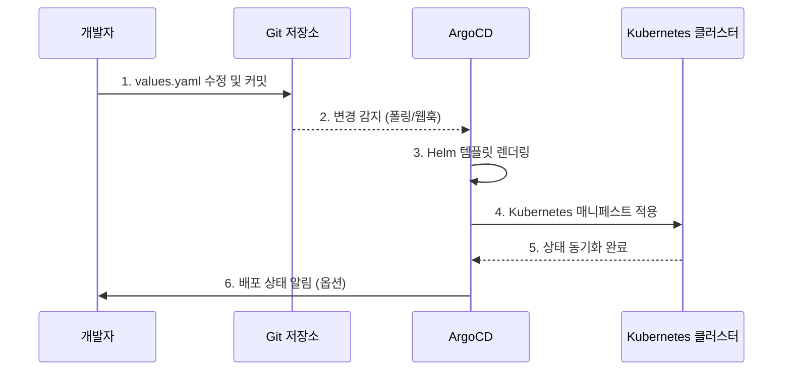
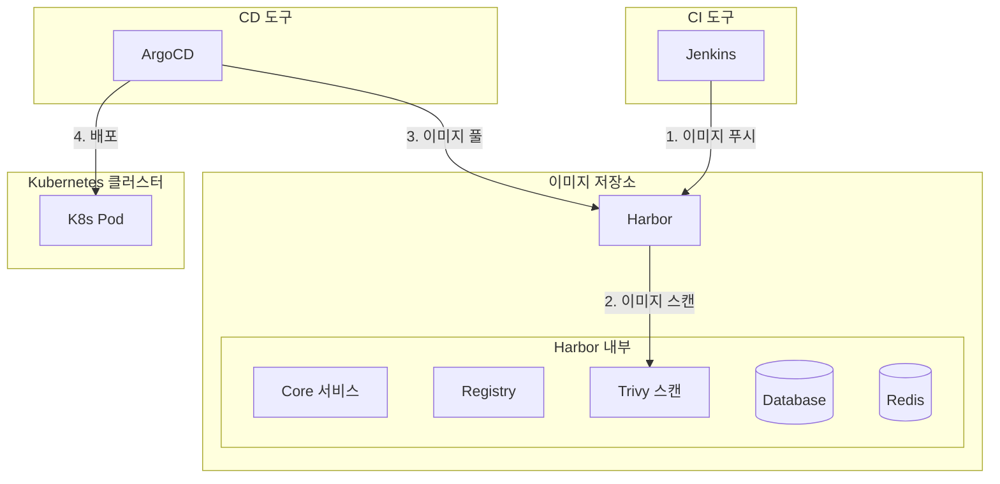
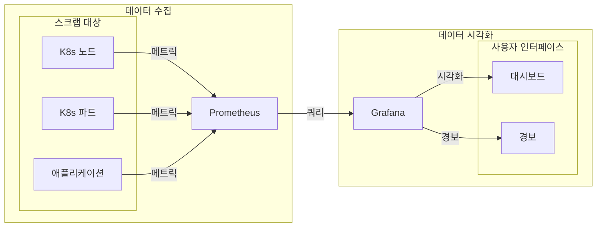
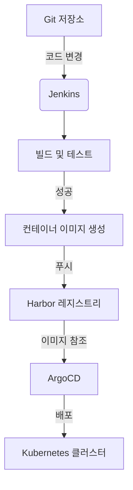
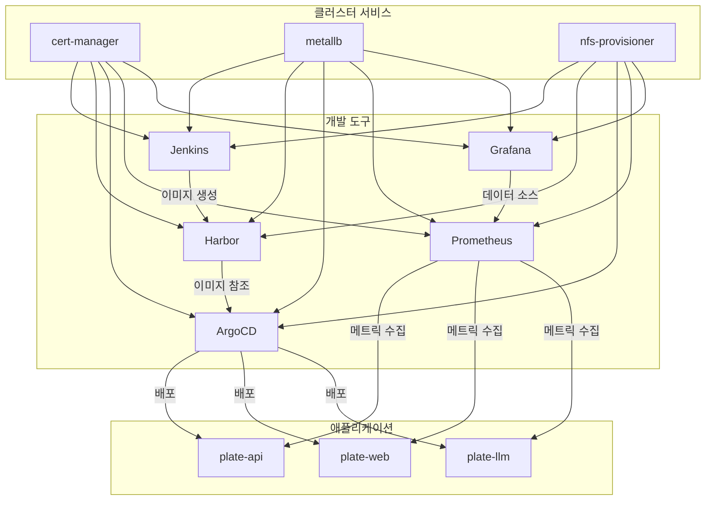

# 개발 도구 의존성

<cite>
**이 문서에서 참조한 파일**   
- [README.md](file://README.md)
- [environments/argocd/app-of-apps.yaml](file://environments/argocd/app-of-apps.yaml)
- [helm/development-tools/argocd/Chart.yaml](file://helm/development-tools/argocd/Chart.yaml)
- [helm/development-tools/argocd/values.yaml](file://helm/development-tools/argocd/values.yaml)
- [helm/development-tools/harbor/Chart.yaml](file://helm/development-tools/harbor/Chart.yaml)
- [helm/development-tools/harbor/values.yaml](file://helm/development-tools/harbor/values.yaml)
- [helm/development-tools/prometheus/Chart.yaml](file://helm/development-tools/prometheus/Chart.yaml)
- [helm/development-tools/prometheus/values.yaml](file://helm/development-tools/prometheus/values.yaml)
- [helm/development-tools/grafana/Chart.yaml](file://helm/development-tools/grafana/Chart.yaml)
- [helm/development-tools/grafana/values.yaml](file://helm/development-tools/grafana/values.yaml)
- [helm/development-tools/jenkins/Chart.yaml](file://helm/development-tools/jenkins/Chart.yaml)
- [helm/development-tools/jenkins/values.yaml](file://helm/development-tools/jenkins/values.yaml)
</cite>

## 목차
1. [소개](#소개)
2. [프로젝트 구조 분석](#프로젝트-구조-분석)
3. [ArgoCD: GitOps 기반 배포 자동화](#argocd-gitops-기반-배포-자동화)
4. [Harbor: 프라이빗 컨테이너 이미지 레지스트리](#harbor-프라이빗-컨테이너-이미지-레지스트리)
5. [Prometheus와 Grafana: 통합 모니터링 및 대시보드](#prometheus와-grafana-통합-모니터링-및-대시보드)
6. [Jenkins: CI/CD 파이프라인 자동화](#jenkins-cicd-파이프라인-자동화)
7. [도구 간 통합 및 의존성 구조](#도구-간-통합-및-의존성-구조)
8. [결론](#결론)

## 소개

이 문서는 Kubernetes 기반 클러스터 환경에서 애플리케이션의 배포와 운영을 지원하는 핵심 개발 도구들인 ArgoCD, Harbor, Prometheus, Grafana, Jenkins의 구성 요소들이 어떻게 클러스터 서비스 위에 구축되고, 서로 어떻게 통합되어 애플리케이션 계층의 배포와 운영을 지원하는지를 설명합니다.

이러한 도구들은 클러스터 서비스(예: 네트워킹, 스토리지, 인증)에 의존하면서도, 애플리케이션의 빌드, 배포, 실행, 모니터링이라는 전체 라이프사이클을 자동화하고 안정화하는 데 필수적인 중간 계층으로 기능합니다. 각 도구의 역할과 통합 구조를 분석함으로써, 현대적인 클라우드 네이티브 운영 환경의 핵심 아키텍처를 이해할 수 있습니다.

## 프로젝트 구조 분석

제공된 프로젝트 구조는 명확한 계층화된 아키텍처를 따르고 있습니다. 이 구조는 DevOps 파이프라인의 책임을 명확히 분리하여 관리의 용이성과 안정성을 높입니다.

```
prj-devops/
├── helm/                           # 모든 Helm 차트
│   ├── cluster-services/          # 계층 1: 클러스터 레벨 인프라
│   ├── development-tools/         # 계층 2: 개발 및 운영 도구
│   └── applications/              # 계층 3: Plate 애플리케이션
├── environments/                   # ArgoCD 설정
└── scripts/                       # 배포 자동화 스크립트
```

- **클러스터 서비스 계층 (Cluster Services)**: `helm/cluster-services/` 디렉터리에 위치한 `cert-manager`, `metallb`, `nfs-provisioner` 등은 Kubernetes 클러스터 자체의 기반 인프라를 구성합니다. 이들은 네트워크, 스토리지, 인증과 같은 핵심 서비스를 제공하며, 상위 계층의 모든 도구와 애플리케이션의 실행을 가능하게 하는 토대입니다.
- **개발 도구 계층 (Development Tools)**: `helm/development-tools/` 디렉터리에 위치한 `argocd`, `harbor`, `prometheus`, `grafana`, `jenkins` 등은 개발 및 운영을 위한 핵심 도구들을 포함합니다. 이 계층은 클러스터 서비스 위에 구축되며, 애플리케이션의 라이프사이클을 관리하는 데 직접적인 역할을 합니다.
- **애플리케이션 계층 (Applications)**: `helm/applications/` 디렉터리에 위치한 `plate-api`, `plate-web`, `plate-llm` 등은 비즈니스 로직을 구현하는 실제 애플리케이션입니다. 이들은 개발 도구 계층을 통해 빌드, 배포, 모니터링됩니다.

이러한 계층 구조는 각 계층이 이전 계층에 의존하면서도, 자신의 책임 영역을 명확히 하여 전체 시스템의 복잡성을 관리하고, 변경과 확장이 용이하도록 합니다.

**Diagram sources**
- [README.md](file://README.md#L17-L70)

## ArgoCD: GitOps 기반 배포 자동화

ArgoCD는 GitOps 워크플로우를 구현하는 핵심 도구로, 코드 저장소(Git)의 상태를 클러스터의 실제 상태와 자동으로 동기화합니다. 이는 인프라와 애플리케이션의 선언적이고 반복 가능한 배포를 가능하게 합니다.

### GitOps 워크플로우 구현

ArgoCD는 Git 저장소를 단일 진실 원천(Single Source of Truth)으로 삼습니다. 사용자는 애플리케이션의 Helm 차트 설정(`values.yaml`)을 수정하고 Git 저장소에 커밋합니다. ArgoCD는 주기적으로(또는 웹훅을 통해 실시간으로) 이 저장소를 폴링하여 변경 사항을 감지합니다. 감지된 변경 사항은 자동으로 클러스터에 적용되어, 저장소의 상태와 클러스터의 상태가 일치하도록 만듭니다.

이 과정은 다음과 같은 핵심 기능을 통해 안정성을 보장합니다:
- **자동 동기화 (`automated.sync`)`: `prune: true`와 `selfHeal: true` 설정을 통해, Git 저장소에서 삭제된 리소스는 클러스터에서도 자동으로 제거되며, 클러스터에서 수동으로 변경된 사항은 Git의 상태로 자동 복구됩니다.
- **App-of-Apps 패턴**: `environments/argocd/app-of-apps.yaml` 파일은 최상위 `Application` 리소스로, 다른 모든 애플리케이션(`plate-api-stg`, `plate-web-stg` 등)을 관리합니다. 이는 복잡한 시스템을 하나의 명령으로 전체적으로 관리할 수 있게 해줍니다.
- **의존성 관리 (`sync-wave`)**: `plate-llm-stg.yaml`과 같이 `argocd.argoproj.io/sync-wave` 어노테이션을 사용하여, 특정 애플리케이션이 다른 애플리케이션(예: 시크릿 매니저) 이후에 배포되도록 순서를 정의할 수 있습니다.

이러한 메커니즘을 통해 ArgoCD는 수동 배포의 오류를 방지하고, 변경 이력을 명확히 추적하며, 빠르고 안정적인 롤백을 가능하게 합니다.



**Diagram sources**
- [environments/argocd/app-of-apps.yaml](file://environments/argocd/app-of-apps.yaml#L1-L35)
- [environments/argocd/apps/plate-api-stg.yaml](file://environments/argocd/apps/plate-api-stg.yaml#L1-L62)
- [environments/argocd/apps/plate-llm-stg.yaml](file://environments/argocd/apps/plate-llm-stg.yaml#L1-L64)

**Section sources**
- [README.md](file://README.md#L101-L136)
- [environments/argocd/app-of-apps.yaml](file://environments/argocd/app-of-apps.yaml#L1-L35)
- [environments/argocd/apps/plate-api-stg.yaml](file://environments/argocd/apps/plate-api-stg.yaml#L1-L62)

## Harbor: 프라이빗 컨테이너 이미지 레지스트리

Harbor는 신뢰할 수 있는 프라이빗 컨테이너 이미지 레지스트리로, 이미지의 저장, 서명, 스캔 기능을 제공합니다. 이는 CI/CD 파이프라인에서 생성된 컨테이너 이미지를 안전하게 저장하고 관리하는 핵심 저장소 역할을 합니다.

### 프라이빗 레지스트리 제공

Harbor는 `helm/development-tools/harbor/` 디렉터리에 있는 Helm 차트를 통해 클러스터 내에 배포됩니다. 주요 구성 요소는 다음과 같습니다:
- **Core**: 사용자 인증, 권한 관리, 이미지 레지스트리 API를 제공합니다.
- **Registry**: Docker 레지스트리 v2 API를 구현하여, 컨테이너 이미지의 푸시(Push)와 풀(Pull)을 처리합니다.
- **Trivy**: 이미지 스캔 엔진으로, 배포 전에 이미지 내의 알려진 취약점을 자동으로 스캔하고 보고합니다.
- **Database & Redis**: Harbor의 구성 정보와 캐시를 저장합니다.

`values.yaml` 파일을 통해 외부 URL(`externalURL: https://harbor.cocdev.co.kr`)과 인그레스(Ingress) 설정을 통해 외부에서 접근할 수 있도록 구성됩니다. 또한, `persistence.enabled: true` 설정을 통해 이미지 데이터가 영구적으로 저장되도록 합니다.

이러한 구조를 통해 Harbor는 Jenkins와 같은 CI 도구가 빌드한 이미지를 안전하게 저장하고, ArgoCD와 같은 CD 도구가 해당 이미지를 클러스터에 배포할 수 있도록 하는 신뢰할 수 있는 중간 저장소를 제공합니다.



**Diagram sources**
- [helm/development-tools/harbor/Chart.yaml](file://helm/development-tools/harbor/Chart.yaml#L1-L25)
- [helm/development-tools/harbor/values.yaml](file://helm/development-tools/harbor/values.yaml#L1-L800)

**Section sources**
- [helm/development-tools/harbor/values.yaml](file://helm/development-tools/harbor/values.yaml#L1-L1070)

## Prometheus와 Grafana: 통합 모니터링 및 대시보드

Prometheus와 Grafana는 클러스터와 애플리케이션의 상태를 실시간으로 모니터링하고 시각화하는 통합된 솔루션을 제공합니다. 이들은 서로 긴밀하게 통합되어, 메트릭의 수집부터 대시보드 제공까지의 완전한 관측성(observability) 파이프라인을 구성합니다.

### 통합 모니터링 및 대시보드 구조

- **Prometheus**: `helm/development-tools/prometheus/` 차트를 통해 배포되며, 주기적으로(예: 1분 간격) 클러스터 내의 다양한 대상(노드, 파드, 서비스)을 스크랩(scrapping)하여 메트릭을 수집하고 저장합니다. 수집된 메트릭은 시계열 데이터베이스에 저장되며, 강력한 쿼리 언어(PromQL)를 통해 분석할 수 있습니다. 인그레스를 통해 `prometheus.cocdev.co.kr` 도메인으로 접근할 수 있습니다.
- **Grafana**: `helm/development-tools/grafana/` 차트를 통해 배포되며, Prometheus를 데이터 소스로 설정합니다. 사용자는 Grafana의 웹 인터페이스를 통해 다양한 차트와 패널을 구성하여, 수집된 메트릭을 직관적인 대시보드로 시각화할 수 있습니다. 이는 시스템의 성능, 가용성, 오류율 등을 한눈에 파악할 수 있게 해줍니다.

`values.yaml` 파일을 통해 두 도구는 서로를 인식하고 통신할 수 있도록 구성됩니다. 예를 들어, Grafana의 `datasources` 설정에 Prometheus의 URL이 명시되어 있어, Grafana가 Prometheus에서 데이터를 가져올 수 있습니다. 이처럼 두 도구는 분리된 구성 요소이지만, 함께 작동함으로써 강력한 모니터링 생태계를 형성합니다.



**Diagram sources**
- [helm/development-tools/prometheus/Chart.yaml](file://helm/development-tools/prometheus/Chart.yaml#L1-L59)
- [helm/development-tools/prometheus/values.yaml](file://helm/development-tools/prometheus/values.yaml#L1-L800)
- [helm/development-tools/grafana/Chart.yaml](file://helm/development-tools/grafana/Chart.yaml#L1-L36)
- [helm/development-tools/grafana/values.yaml](file://helm/development-tools/grafana/values.yaml#L1-L800)

**Section sources**
- [helm/development-tools/prometheus/values.yaml](file://helm/development-tools/prometheus/values.yaml#L1-L1446)
- [helm/development-tools/grafana/values.yaml](file://helm/development-tools/grafana/values.yaml#L1-L1671)

## Jenkins: CI/CD 파이프라인 자동화

Jenkins는 지속적 통합 및 지속적 배포(CI/CD) 파이프라인을 담당하는 핵심 도구입니다. 이는 코드 변경이 발생했을 때, 자동으로 빌드, 테스트, 그리고 컨테이너 이미지 생성까지의 일련의 작업을 수행합니다.

### CI/CD 파이프라인 역할

Jenkins는 `helm/development-tools/jenkins/` 디렉터리에 있는 Helm 차트를 통해 클러스터 내에 배포됩니다. 주요 기능은 다음과 같습니다:
- **빌드 자동화**: Git 저장소의 코드 변경을 감지하면, Jenkins는 미리 정의된 파이프라인을 실행하여 코드를 빌드하고 테스트합니다.
- **이미지 생성**: 빌드가 성공하면, Jenkins는 애플리케이션을 컨테이너 이미지로 패키징하고, 이를 Harbor 레지스트리에 푸시합니다.
- **구성 관리**: `values.yaml` 파일의 `controller.installPlugins` 설정을 통해 필요한 플러그인(kubernetes, git, configuration-as-code 등)을 자동으로 설치하여, 파이프라인을 구성합니다. 또한, `JCasC (Jenkins Configuration as Code)`를 통해 Jenkins의 설정 자체도 코드로 관리할 수 있습니다.

이러한 작업을 통해 Jenkins는 개발자가 작성한 코드가 검증된 상태의 컨테이너 이미지로 변환되는 과정을 자동화합니다. 생성된 이미지는 이후 ArgoCD에 의해 클러스터에 배포되는 원천이 됩니다. 따라서 Jenkins는 CI/CD 파이프라인의 시작점으로서, 전체 배포 자동화의 기초를 닦습니다.



**Diagram sources**
- [helm/development-tools/jenkins/Chart.yaml](file://helm/development-tools/jenkins/Chart.yaml#L1-L50)
- [helm/development-tools/jenkins/values.yaml](file://helm/development-tools/jenkins/values.yaml#L1-L800)

**Section sources**
- [helm/development-tools/jenkins/values.yaml](file://helm/development-tools/jenkins/values.yaml#L1-L1387)

## 도구 간 통합 및 의존성 구조

각 개발 도구들은 독립적으로 작동하는 것이 아니라, 서로 긴밀하게 연결되어 하나의 통합된 CI/CD 파이프라인을 형성합니다. 이들의 통합 구조는 다음과 같은 의존성 흐름을 보여줍니다.

### 중간 계층으로서의 기능

모든 개발 도구들은 클러스터 서비스 계층에 의존합니다. 예를 들어, ArgoCD, Harbor, Prometheus, Grafana, Jenkins 모두 `metallb`를 통해 외부 IP를 할당받고, `cert-manager`를 통해 TLS 인증서를 발급받으며, `nfs-provisioner`를 통해 영구 스토리지를 사용합니다. 이는 클러스터 서비스가 상위 모든 서비스의 기반이 됨을 의미합니다.

이러한 기반 위에서, 도구들은 다음과 같은 흐름으로 애플리케이션 배포를 지원합니다:
1.  **CI (Jenkins)**: 코드 변경을 감지하고, 빌드하여 컨테이너 이미지를 생성합니다.
2.  **이미지 저장 (Harbor)**: Jenkins가 생성한 이미지를 안전하게 저장하고, 보안 스캔을 수행합니다.
3.  **CD (ArgoCD)**: Git 저장소의 설정 변경을 감지하고, Harbor에 저장된 최신 이미지를 클러스터에 자동 배포합니다.
4.  **모니터링 (Prometheus & Grafana)**: 배포된 애플리케이션과 클러스터의 상태를 지속적으로 수집하고, 대시보드를 통해 시각화합니다.

이러한 흐름을 통해, 각 도구는 자신의 전문화된 영역에서만 책임을 지는 중간 계층으로 기능합니다. Jenkins는 빌드를, Harbor는 저장을, ArgoCD는 배포를, Prometheus/Grafana는 모니터링을 담당함으로써, 복잡한 배포 프로세스를 모듈화하고, 각 구성 요소의 안정성과 유지보수성을 극대화합니다.



**Diagram sources**
- [README.md](file://README.md#L11-L15)
- [helm/development-tools/argocd/values.yaml](file://helm/development-tools/argocd/values.yaml#L1-L800)
- [helm/development-tools/harbor/values.yaml](file://helm/development-tools/harbor/values.yaml#L1-L800)
- [helm/development-tools/prometheus/values.yaml](file://helm/development-tools/prometheus/values.yaml#L1-L800)
- [helm/development-tools/grafana/values.yaml](file://helm/development-tools/grafana/values.yaml#L1-L800)
- [helm/development-tools/jenkins/values.yaml](file://helm/development-tools/jenkins/values.yaml#L1-L800)

**Section sources**
- [README.md](file://README.md#L11-L15)

## 결론

ArgoCD, Harbor, Prometheus, Grafana, Jenkins는 각각 GitOps 기반의 자동 배포, 프라이빗 이미지 저장, 통합 모니터링, CI 파이프라인 자동화라는 고유한 역할을 수행합니다. 이 문서는 이러한 도구들이 `cert-manager`, `metallb`, `nfs-provisioner`와 같은 클러스터 서비스에 의존하여 구축되는 방식을 분석하였습니다.

이러한 도구들은 단순한 도구의 나열이 아니라, 서로 긴밀하게 통합된 생태계를 형성합니다. Jenkins는 코드를 이미지로 변환하고, Harbor는 그 이미지를 안전하게 저장하며, ArgoCD는 저장된 이미지를 클러스터에 자동 배포합니다. 동시에 Prometheus와 Grafana는 전체 시스템의 상태를 실시간으로 모니터링하여 가시성을 제공합니다. 이처럼 각 도구는 클러스터 서비스 위에 구축된 중간 계층으로서, 애플리케이션의 배포와 운영을 안정적이고 자동화된 방식으로 지원하는 핵심 인프라입니다. 이러한 통합된 아키텍처는 현대적인 클라우드 네이티브 환경에서 빠르고 신뢰할 수 있는 소프트웨어 제공을 가능하게 합니다.