# 구성 요소 의존성

<cite>
**이 문서에서 참조된 파일**
- [app-of-apps.yaml](file://environments/argocd/app-of-apps.yaml)
- [plate-web-prod.yaml](file://environments/argocd/apps/plate-web-prod.yaml)
- [plate-api-prod.yaml](file://environments/argocd/apps/plate-api-prod.yaml)
- [values.yaml](file://helm/applications/plate-web/values.yaml)
- [values.yaml](file://helm/applications/plate-api/values.yaml)
- [values.yaml](file://helm/development-tools/argocd/values.yaml)
- [values.yaml](file://helm/cluster-services/cert-manager/values.yaml)
- [values.yaml](file://helm/cluster-services/nfs-provisioner/values.yaml)
- [values.yaml](file://helm/development-tools/grafana/values.yaml)
- [values.yaml](file://helm/development-tools/harbor/values.yaml)
- [Chart.yaml](file://helm/applications/plate-web/Chart.yaml)
- [Chart.yaml](file://helm/applications/plate-api/Chart.yaml)
- [Chart.yaml](file://helm/cluster-services/cert-manager/Chart.yaml)
- [Chart.yaml](file://helm/development-tools/argocd/Chart.yaml)
</cite>

## 목차
1. [소개](#소개)
2. [3계층 아키텍처 개요](#3계층-아키텍처-개요)
3. [클러스터 서비스 계층](#클러스터-서비스-계층)
4. [개발 도구 계층](#개발-도구-계층)
5. [애플리케이션 계층](#애플리케이션-계층)
6. [ArgoCD App-of-Apps 패턴](#argocd-app-of-apps-패턴)
7. [환경별 설정 및 Helm Values](#환경별-설정-및-helm-values)
8. [배포 순서 및 의존성](#배포-순서-및-의존성)
9. [결론](#결론)

## 소개
이 문서는 `prj-devops` 리포지토리의 구성 요소 간 의존성 구조를 분석합니다. 시스템은 클러스터 서비스, 개발 도구, 애플리케이션의 세 가지 계층으로 구성되어 있으며, 각 계층은 하위 계층을 지원하는 구조를 가집니다. ArgoCD의 App-of-Apps 패턴을 통해 전체 시스템의 선언적 배포가 관리되며, Helm 차트의 `values.yaml` 파일을 통해 환경별 설정이 적용됩니다.

## 3계층 아키텍처 개요
`prj-devops`는 다음과 같은 3계층 구조를 따릅니다:

1. **클러스터 서비스 계층**: `cert-manager`, `MetalLB`, `nfs-provisioner`와 같은 클러스터의 핵심 기능을 제공하는 서비스들로 구성됩니다. 이 계층은 클러스터 내에서 안정적인 네트워크, 저장소, 인증 기능을 보장합니다.
2. **개발 도구 계층**: `ArgoCD`, `Harbor`, `Grafana` 등과 같은 CI/CD, 이미지 저장소, 모니터링 도구들로 구성됩니다. 이 계층은 클러스터 서비스 위에 구축되며, 애플리케이션의 배포와 운영을 위한 인프라를 제공합니다.
3. **애플리케이션 계층**: `plate-web`, `plate-api` 등 실제 비즈니스 로직을 수행하는 애플리케이션들로 구성됩니다. 이 계층은 개발 도구를 통해 배포되며, 최종 사용자에게 서비스를 제공합니다.

**Diagram sources**
- [app-of-apps.yaml](file://environments/argocd/app-of-apps.yaml)
- [Chart.yaml](file://helm/development-tools/argocd/Chart.yaml)
- [Chart.yaml](file://helm/applications/plate-web/Chart.yaml)
- [Chart.yaml](file://helm/applications/plate-api/Chart.yaml)

## 클러스터 서비스 계층
이 계층은 Kubernetes 클러스터의 기반을 형성하는 핵심 서비스들로 구성됩니다.

### cert-manager
`cert-manager`는 TLS 인증서를 자동으로 발급하고 관리하는 서비스입니다. Let's Encrypt와 통합되어 `production` 및 `staging` 환경용 `ClusterIssuer`를 생성합니다. 이는 `Harbor`, `Grafana`, `ArgoCD` 등 개발 도구 계층의 서비스들이 HTTPS를 통해 안전하게 접근될 수 있도록 합니다.

**Section sources**
- [values.yaml](file://helm/cluster-services/cert-manager/values.yaml#L9-L35)
- [Chart.yaml](file://helm/cluster-services/cert-manager/Chart.yaml#L1-L23)

### MetalLB
`MetalLB`는 온프레미스 환경에서 `LoadBalancer` 유형의 서비스를 제공하는 네트워크 부하 분산기입니다. `L2Advertisement` 리소스를 통해 특정 IP 풀(`first-pool`)을 광고함으로써, `Harbor`나 `plate-api`와 같은 서비스에 고정된 외부 IP를 할당할 수 있습니다.

**Section sources**
- [l2advertisement.yaml](file://helm/cluster-services/metallb/l2advertisement.yaml#L1-L9)
- [metallb-native.yaml](file://helm/cluster-services/metallb/metallb-native.yaml#L1-L800)

### nfs-provisioner
`nfs-provisioner`는 NFS 서버를 기반으로 동적 프로비저닝을 제공하는 스토리지 클래스(`nfs-client`)를 생성합니다. 이는 `Grafana`, `Harbor`, `Prometheus` 등의 상태 저장 애플리케이션이 영구적인 저장소를 사용할 수 있도록 합니다.

**Section sources**
- [values.yaml](file://helm/cluster-services/nfs-provisioner/values.yaml#L1-L115)

## 개발 도구 계층
이 계층은 클러스터 서비스 위에 구축되며, 애플리케이션의 라이프사이클을 관리하는 데 필수적인 도구들로 구성됩니다.

### ArgoCD
`ArgoCD`는 GitOps 기반의 지속적 배포 도구입니다. `environments/argocd/app-of-apps.yaml` 파일에서 정의된 `Application` 리소스는 다른 모든 애플리케이션을 관리하는 최상위 애플리케이션입니다. 이는 `environments/argocd/apps` 디렉터리에 있는 하위 `Application` 리소스들을 동기화합니다.

**Section sources**
- [app-of-apps.yaml](file://environments/argocd/app-of-apps.yaml#L1-L35)
- [values.yaml](file://helm/development-tools/argocd/values.yaml#L1-L800)
- [Chart.yaml](file://helm/development-tools/argocd/Chart.yaml#L1-L32)

### Harbor
`Harbor`는 프라이빗 컨테이너 이미지 레지스트리입니다. `cert-manager`를 통해 발급된 TLS 인증서를 사용하여 HTTPS 엔드포인트(`harbor.cocdev.co.kr`)를 제공합니다. `persistence` 설정을 통해 데이터를 영구적으로 저장하며, `imagePullSecrets`를 통해 `plate-api`와 같은 애플리케이션이 이미지를 안전하게 풀할 수 있도록 합니다.

**Section sources**
- [values.yaml](file://helm/development-tools/harbor/values.yaml#L1-L800)

### Grafana
`Grafana`는 모니터링 및 대시보드 도구입니다. `ingress`를 통해 `grafana.cocdev.co.kr` 도메인에서 접근 가능하며, `cert-manager`를 통해 TLS를 적용받습니다. `persistence`를 사용하여 대시보드 설정을 저장하고, `openebs-hostpath` 스토리지 클래스를 통해 PVC를 프로비저닝합니다.

**Section sources**
- [values.yaml](file://helm/development-tools/grafana/values.yaml#L1-L800)

## 애플리케이션 계층
이 계층은 최종 사용자에게 서비스를 제공하는 비즈니스 애플리케이션들로 구성됩니다.

### plate-web
`plate-web`은 프론트엔드 웹 애플리케이션으로, Nginx 리버스 프록시를 사용합니다. `values.yaml` 파일에서 기본 설정을 정의하며, `values-prod.yaml`과 같은 환경별 파일을 통해 `replicaCount`, `resources`, `image.tag` 등의 설정을 오버라이드합니다.

**Section sources**
- [values.yaml](file://helm/applications/plate-web/values.yaml#L1-L30)
- [values-prod.yaml](file://helm/applications/plate-web/values-prod.yaml#L1-L39)
- [Chart.yaml](file://helm/applications/plate-web/Chart.yaml#L1-L17)

### plate-api
`plate-api`는 백엔드 API 서버입니다. `values.yaml` 파일에서 `appSecrets`를 통해 민감한 환경 변수를 `app-env-secrets`라는 Kubernetes Secret에서 주입받습니다. 이미지 저장소는 `Harbor`를 사용하며, `values-prod.yaml`에서 프로덕션 환경에 맞는 이미지 태그를 지정합니다.

**Section sources**
- [values.yaml](file://helm/applications/plate-api/values.yaml#L1-L85)
- [values-prod.yaml](file://helm/applications/plate-api/values-prod.yaml#L1-L22)
- [Chart.yaml](file://helm/applications/plate-api/Chart.yaml#L1-L16)

## ArgoCD App-of-Apps 패턴
ArgoCD의 App-of-Apps 패턴은 복잡한 시스템을 모듈화하고 계층적으로 관리하는 데 사용됩니다.

`environments/argocd/app-of-apps.yaml` 파일은 최상위 `Application` 리소스를 정의합니다. 이 리소스는 `path: environments/argocd/apps`를 소스로 지정하여, `plate-web-prod.yaml`, `plate-api-prod.yaml` 등 다양한 환경의 애플리케이션을 관리합니다. `syncPolicy`의 `automated` 설정을 통해 Git 저장소의 변경 사항을 자동으로 클러스터에 반영합니다.

각 하위 `Application` 리소스(예: `plate-web-prod.yaml`)는 자신의 `spec.source.path`를 통해 Helm 차트의 위치를 지정하고, `spec.source.helm.valueFiles`를 통해 환경별 `values` 파일을 참조합니다. 이는 `plate-web` 애플리케이션의 경우 `helm/applications/plate-web/values-prod.yaml` 파일을 사용하도록 합니다.

```mermaid
sequenceDiagram
participant Git as Git Repository
participant ArgoCD as ArgoCD Controller
participant K8s as Kubernetes Cluster
Git->>ArgoCD : Git 저장소 변경 감지 (Polling)
ArgoCD->>Git : Git 저장소에서 manifests 가져오기
ArgoCD->>ArgoCD : app-of-apps.yaml 파싱
ArgoCD->>ArgoCD : 하위 Application 목록 확인 (plate-web-prod, plate-api-prod 등)
loop 각 하위 Application에 대해
ArgoCD->>Git : Helm 차트 경로에서 manifests 가져오기
ArgoCD->>Git : 환경별 values.yaml 파일 가져오기
ArgoCD->>ArgoCD : Helm 템플릿 렌더링
ArgoCD->>K8s : 렌더링된 manifests 적용
K8s-->>ArgoCD : 적용 상태 반환
end
ArgoCD->>Git : 상태 업데이트 (Synced/OutOfSync)
```

**Diagram sources**
- [app-of-apps.yaml](file://environments/argocd/app-of-apps.yaml#L1-L35)
- [plate-web-prod.yaml](file://environments/argocd/apps/plate-web-prod.yaml#L1-L62)
- [plate-api-prod.yaml](file://environments/argocd/apps/plate-api-prod.yaml#L1-L62)

## 환경별 설정 및 Helm Values
Helm 차트는 `values.yaml` 파일을 통해 구성 가능성을 제공합니다. 기본 설정은 차트 루트의 `values.yaml`에 정의되며, 환경별로 특화된 설정은 `values-prod.yaml`, `values-stg.yaml` 등의 파일로 오버라이드됩니다.

예를 들어, `plate-web` 차트의 `values.yaml`은 `replicaCount: 1`과 `image.tag: "latest"`를 기본값으로 설정합니다. 반면, `values-prod.yaml`은 프로덕션 환경의 안정성을 위해 `image.tag: "1.25"`와 같은 고정된 버전 태그를 사용합니다. ArgoCD `Application` 리소스는 `spec.source.helm.valueFiles` 배열을 통해 이러한 환경별 파일을 명시적으로 참조함으로써, 올바른 설정이 적용되도록 합니다.

이러한 구조는 설정의 일관성을 유지하면서도 각 환경의 요구사항에 유연하게 대응할 수 있게 합니다.

**Section sources**
- [values.yaml](file://helm/applications/plate-web/values.yaml#L1-L30)
- [values-prod.yaml](file://helm/applications/plate-web/values-prod.yaml#L1-L39)
- [values.yaml](file://helm/applications/plate-api/values.yaml#L1-L85)
- [values-prod.yaml](file://helm/applications/plate-api/values-prod.yaml#L1-L22)

## 배포 순서 및 의존성
시스템의 배포는 명시적인 의존성 관계를 따라 순차적으로 이루어져야 합니다.

1. **클러스터 서비스 배포**: 먼저 `cert-manager`, `MetalLB`, `nfs-provisioner`가 배포되어야 합니다. 이들은 개발 도구 계층의 서비스들이 정상적으로 작동하기 위한 기반을 제공합니다.
2. **개발 도구 배포**: 그 다음으로 `ArgoCD`, `Harbor`, `Grafana` 등이 배포됩니다. `Harbor`는 `cert-manager`에 의존하여 TLS 인증서를 획득하고, `Grafana`는 `nfs-provisioner`에 의존하여 영구 저장소를 확보합니다.
3. **애플리케이션 배포**: 마지막으로 `ArgoCD`를 통해 `plate-web`, `plate-api` 등의 애플리케이션이 배포됩니다. `plate-api`는 `Harbor`에 의존하여 컨테이너 이미지를 풀하고, `plate-web`은 `plate-api`와 통신하기 위해 `Ingress` 규칙이 필요합니다.

이러한 순서는 `ArgoCD`의 `Application` 리소스 자체에는 명시되어 있지 않지만, 실제 배포 시점에서의 물리적 의존성에 의해 결정됩니다. `App-of-Apps` 패턴은 이러한 복잡한 의존성 관계를 단일 진입점에서 관리할 수 있게 해줍니다.

**Section sources**
- [app-of-apps.yaml](file://environments/argocd/app-of-apps.yaml#L1-L35)
- [values.yaml](file://helm/cluster-services/cert-manager/values.yaml#L9-L35)
- [values.yaml](file://helm/development-tools/harbor/values.yaml#L1-L800)
- [values.yaml](file://helm/development-tools/grafana/values.yaml#L1-L800)

## 결론
`prj-devops`는 클러스터 서비스, 개발 도구, 애플리케이션의 3계층 구조를 통해 높은 수준의 관심사 분리를 달성합니다. ArgoCD의 App-of-Apps 패턴은 이 구조를 효과적으로 관리하는 핵심 메커니즘으로, Git 저장소의 선언적 구성에 따라 전체 시스템을 자동으로 동기화합니다. Helm의 `values.yaml` 오버라이드 메커니즘은 환경별 설정을 유연하게 적용할 수 있게 하며, 전체 시스템의 배포 순서는 각 계층 간의 물리적 의존성에 의해 자연스럽게 결정됩니다. 이 아키텍처는 확장성, 유지보수성, 안정성을 모두 고려한 모범 사례를 보여줍니다.