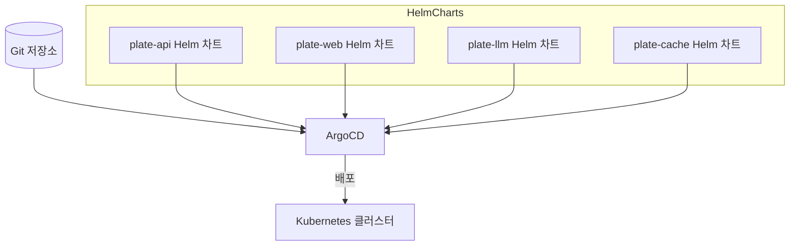
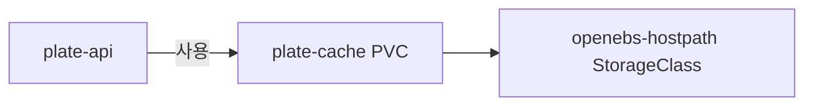
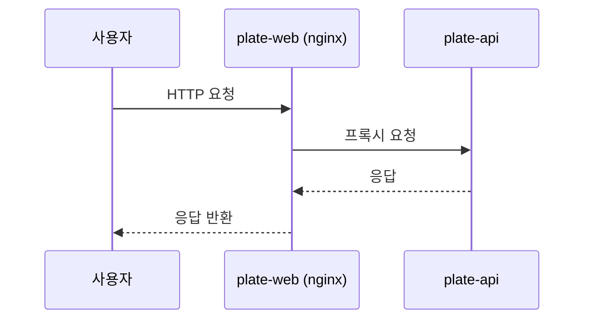
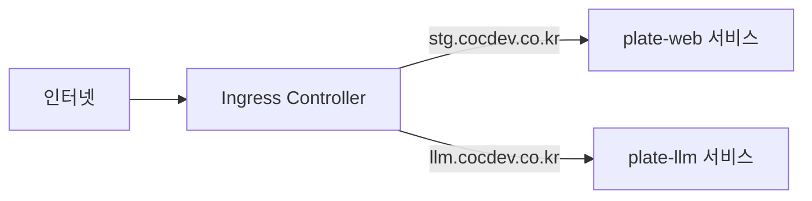

# 애플리케이션 서비스 의존성

<cite>
**이 문서에서 참조한 파일**  
- [plate-api-stg.yaml](file://environments/argocd/apps/plate-api-stg.yaml)
- [plate-web-stg.yaml](file://environments/argocd/apps/plate-web-stg.yaml)
- [plate-llm-stg.yaml](file://environments/argocd/apps/plate-llm-stg.yaml)
- [values.yaml](file://helm/applications/plate-server/values.yaml)
- [values.yaml](file://helm/applications/plate-web/values.yaml)
- [values.yaml](file://helm/applications/plate-cache/values.yaml)
- [values.yaml](file://helm/applications/plate-llm/values.yaml)
- [deployment.yaml](file://helm/applications/plate-server/templates/deployment.yaml)
- [deployment.yaml](file://helm/applications/plate-web/templates/deployment.yaml)
- [pvc.yaml](file://helm/applications/plate-cache/templates/pvc.yaml)
- [deployment.yaml](file://helm/applications/plate-llm/templates/deployment.yaml)
- [service.yaml](file://helm/applications/plate-server/templates/service.yaml)
- [service.yaml](file://helm/applications/plate-web/templates/service.yaml)
- [service.yaml](file://helm/applications/plate-llm/templates/service.yaml)
- [values.yaml](file://helm/development-tools/argocd/values.yaml)
</cite>

## 목차
1. [소개](#소개)
2. [애플리케이션 배포 아키텍처](#애플리케이션-배포-아키텍처)
3. [서비스 간 의존성](#서비스-간-의존성)
4. [개발 도구 및 인프라 의존성](#개발-도구-및-인프라-의존성)
5. [환경별 설정 오버라이드 메커니즘](#환경별-설정-오버라이드-메커니즘)
6. [외부 접근 및 Ingress 구성](#외부-접근-및-ingress-구성)
7. [결론](#결론)

## 소개
이 문서는 plate-web, plate-api, plate-llm, plate-cache 등 애플리케이션 계층의 서비스들이 어떻게 ArgoCD와 Helm을 통해 배포되며, 클러스터 서비스 및 개발 도구에 의존하는지를 설명합니다. 각 애플리케이션의 배포 방식, 환경별 설정 오버라이드, 서비스 간 의존성, 그리고 외부 접근을 위한 Ingress 구성까지 전체적인 의존성 구조를 다룹니다.

## 애플리케이션 배포 아키텍처
모든 애플리케이션은 GitOps 방식으로 ArgoCD를 통해 Helm 차트로 배포됩니다. 각 애플리케이션은 별도의 Helm 차트로 관리되며, `environments/argocd/apps/` 디렉터리에 위치한 ArgoCD Application 리소스에 의해 관리됩니다. ArgoCD는 Git 저장소의 변경을 감지하고, 이를 기반으로 클러스터 상태를 자동 동기화합니다.



**Diagram sources**
- [plate-api-stg.yaml](file://environments/argocd/apps/plate-api-stg.yaml)
- [plate-web-stg.yaml](file://environments/argocd/apps/plate-web-stg.yaml)
- [plate-llm-stg.yaml](file://environments/argocd/apps/plate-llm-stg.yaml)

**Section sources**
- [plate-api-stg.yaml](file://environments/argocd/apps/plate-api-stg.yaml)
- [plate-web-stg.yaml](file://environments/argocd/apps/plate-web-stg.yaml)
- [plate-llm-stg.yaml](file://environments/argocd/apps/plate-llm-stg.yaml)

## 서비스 간 의존성
애플리케이션 간에는 명시적인 의존성이 존재합니다. 예를 들어, plate-api는 plate-cache에 의존하여 컨테이너 빌드 컨텍스트를 저장하고, plate-web은 plate-api를 호출하여 백엔드 기능을 사용합니다. plate-llm은 LangChain 기반의 LLM 서버로, 별도의 독립된 서비스로 운영됩니다.

### plate-api와 plate-cache의 의존성
plate-api는 컨테이너 이미지 빌드 과정에서 plate-cache가 제공하는 PVC를 사용합니다. plate-cache는 `PersistentVolumeClaim`을 통해 `openebs-hostpath` 스토리지 클래스를 사용하며, 50Gi의 저장소를 할당합니다.



**Diagram sources**
- [pvc.yaml](file://helm/applications/plate-cache/templates/pvc.yaml)
- [values.yaml](file://helm/applications/plate-cache/values.yaml)

**Section sources**
- [pvc.yaml](file://helm/applications/plate-cache/templates/pvc.yaml)
- [values.yaml](file://helm/applications/plate-cache/values.yaml)

### plate-web과 plate-api의 의존성
plate-web은 프론트엔드 웹 애플리케이션으로, plate-api를 백엔드 API로 호출합니다. plate-web은 nginx 리버스 프록시로 구성되어 있으며, 내부적으로 plate-api 서비스에 요청을 전달합니다.



**Diagram sources**
- [deployment.yaml](file://helm/applications/plate-web/templates/deployment.yaml)
- [service.yaml](file://helm/applications/plate-server/templates/service.yaml)

**Section sources**
- [deployment.yaml](file://helm/applications/plate-web/templates/deployment.yaml)
- [service.yaml](file://helm/applications/plate-server/templates/service.yaml)

## 개발 도구 및 인프라 의존성
애플리케이션들은 다양한 개발 도구 및 클러스터 서비스에 의존합니다. ArgoCD는 배포 자동화를 담당하며, Harbor는 컨테이너 이미지 레지스트리 역할을 합니다. 또한, OpenBao는 비밀 정보 관리, OpenEBS는 스토리지 프로비저닝을 담당합니다.

### ArgoCD를 통한 배포
모든 애플리케이션은 ArgoCD를 통해 Git 저장소의 Helm 차트를 기반으로 배포됩니다. ArgoCD는 `automated` 정책을 사용하여 Git 변경 사항을 감지하고 자동으로 클러스터에 동기화합니다. `selfHeal` 기능을 통해 클러스터 상태가 Git과 다를 경우 자동으로 복구합니다.

**Section sources**
- [plate-api-stg.yaml](file://environments/argocd/apps/plate-api-stg.yaml)
- [plate-web-stg.yaml](file://environments/argocd/apps/plate-web-stg.yaml)
- [plate-llm-stg.yaml](file://environments/argocd/apps/plate-llm-stg.yaml)

### Harbor를 통한 이미지 풀
모든 애플리케이션은 Harbor 레지스트리에서 컨테이너 이미지를 가져옵니다. `imagePullSecrets`를 통해 인증된 접근이 가능하며, `harbor-docker-secret`을 사용하여 비공개 레지스트리에서 이미지를 풀합니다.

**Section sources**
- [values.yaml](file://helm/applications/plate-server/values.yaml)
- [values.yaml](file://helm/applications/plate-web/values.yaml)
- [values.yaml](file://helm/applications/plate-llm/values.yaml)

### OpenBao를 통한 비밀 관리
비밀 정보는 OpenBao를 통해 관리되며, `appSecrets`를 통해 Kubernetes Secret으로 주입됩니다. 예를 들어, plate-api는 `app-env-secrets`라는 Secret에서 데이터베이스 URL, JWT 비밀키 등의 환경변수를 가져옵니다.

**Section sources**
- [values.yaml](file://helm/applications/plate-server/values.yaml)
- [deployment.yaml](file://helm/applications/plate-server/templates/deployment.yaml)

## 환경별 설정 오버라이드 메커니즘
각 애플리케이션은 공통 `values.yaml` 파일을 기반으로 하며, 환경별로 `values-stg.yaml`, `values-prod.yaml` 파일을 통해 설정을 오버라이드합니다. ArgoCD Application 리소스에서 `helm.valueFiles` 필드를 통해 해당 환경의 values 파일을 지정합니다.

예를 들어, `plate-api-stg.yaml`은 `values-stg.yaml`을 참조하여 스테이징 환경에 맞는 설정을 적용합니다.

```yaml
spec:
  source:
    helm:
      valueFiles:
        - values-stg.yaml
```

이 메커니즘을 통해 개발, 스테이징, 프로덕션 환경 간에 리소스 제한, 이미지 태그, 로깅 수준 등을 다르게 설정할 수 있습니다.

**Section sources**
- [plate-api-stg.yaml](file://environments/argocd/apps/plate-api-stg.yaml)
- [values.yaml](file://helm/applications/plate-server/values.yaml)

## 외부 접근 및 Ingress 구성
plate-web과 plate-llm은 외부에서 접근 가능해야 하므로, Ingress 리소스를 통해 도메인 기반 라우팅이 구성됩니다. plate-api는 내부 서비스로, plate-web을 통해만 접근됩니다.

### Ingress를 통한 외부 노출
`plate-web-stg.yaml`은 `stg.cocdev.co.kr` 도메인을 통해 접근 가능하며, `plate-llm-stg.yaml`은 `llm.cocdev.co.kr`을 통해 노출됩니다. Ingress 컨트롤러는 이 요청들을 각각의 서비스로 라우팅합니다.



**Diagram sources**
- [plate-web-stg.yaml](file://environments/argocd/apps/plate-web-stg.yaml)
- [plate-llm-stg.yaml](file://environments/argocd/apps/plate-llm-stg.yaml)

**Section sources**
- [plate-web-stg.yaml](file://environments/argocd/apps/plate-web-stg.yaml)
- [plate-llm-stg.yaml](file://environments/argocd/apps/plate-llm-stg.yaml)

## 결론
이 문서는 plate-web, plate-api, plate-llm, plate-cache 등의 애플리케이션이 ArgoCD와 Helm을 통해 어떻게 배포되며, 서로 및 인프라 서비스에 어떻게 의존하는지를 설명했습니다. GitOps 기반의 배포 방식, 환경별 설정 오버라이드, 서비스 간 의존성, 외부 접근을 위한 Ingress 구성까지 전체적인 의존성 구조를 명확히 이해할 수 있습니다. 이러한 구조는 안정적이고 확장 가능한 CI/CD 파이프라인을 제공합니다.