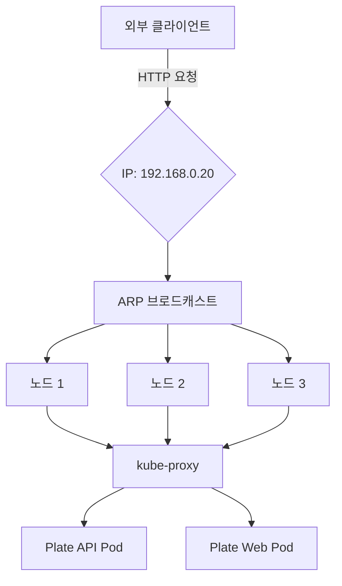
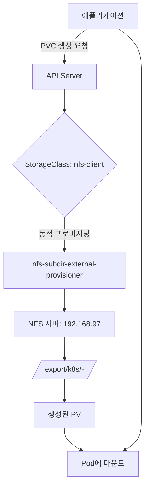

# 클러스터 서비스 의존성

<cite>
**이 문서에서 참조한 파일**  
- [cert-manager/Chart.yaml](file://helm/cluster-services/cert-manager/Chart.yaml)
- [cert-manager/values.yaml](file://helm/cluster-services/cert-manager/values.yaml)
- [cert-manager/templates/cluster-issuer-prod.yaml](file://helm/cluster-services/cert-manager/templates/cluster-issuer-prod.yaml)
- [cert-manager/templates/cluster-issuer-staging.yaml](file://helm/cluster-services/cert-manager/templates/cluster-issuer-staging.yaml)
- [metallb/metallb-native.yaml](file://helm/cluster-services/metalLB/metallb-native.yaml)
- [metallb/pool-1.yaml](file://helm/cluster-services/metalLB/pool-1.yaml)
- [metallb/l2advertisement.yaml](file://helm/cluster-services/metalLB/l2advertisement.yaml)
- [nfs-provisioner/Chart.yaml](file://helm/cluster-services/nfs-provisioner/Chart.yaml)
- [nfs-provisioner/values.yaml](file://helm/cluster-services/nfs-provisioner/values.yaml)
- [nfs-provisioner/templates/storageclass.yaml](file://helm/cluster-services/nfs-provisioner/templates/storageclass.yaml)
- [nfs-provisioner/templates/persistentvolume.yaml](file://helm/cluster-services/nfs-provisioner/templates/persistentvolume.yaml)
- [nfs-provisioner/templates/deployment.yaml](file://helm/cluster-services/nfs-provisioner/templates/deployment.yaml)
- [applications/plate-api/values-prod.yaml](file://helm/applications/plate-server/values-prod.yaml)
- [applications/plate-web/values-prod.yaml](file://helm/applications/plate-web/values-prod.yaml)
- [ingress/values.yaml](file://helm/ingress/values.yaml)
</cite>

## 목차
1. [소개](#소개)
2. [클러스터 서비스 구성 요소](#클러스터-서비스-구성-요소)
3. [cert-manager: SSL/TLS 인증서 자동 관리](#cert-manager-ssl/tls-인증서-자동-관리)
4. [MetalLB: LoadBalancer 서비스 제공](#metallb-loadbalancer-서비스-제공)
5. [nfs-provisioner: 동적 스토리지 프로비저닝](#nfs-provisioner-동적-스토리지-프로비저닝)
6. [개발 도구 및 애플리케이션 계층에서의 의존성](#개발-도구-및-애플리케이션-계층에서의-의존성)
7. [Helm을 통한 배포 예시](#helm을-통한-배포-예시)
8. [결론](#결론)

## 소개
이 문서는 프로덕션급 Kubernetes 환경에서 핵심적인 역할을 하는 클러스터 서비스 계층의 구성 요소들인 cert-manager, MetalLB, nfs-provisioner가 어떻게 기반 인프라를 제공하는지 설명합니다. 각 구성 요소는 클러스터의 보안, 네트워크 접근성, 스토리지 관리라는 핵심 기능을 담당하며, 개발 도구 및 애플리케이션 계층이 안정적으로 동작할 수 있도록 필수적인 기반 서비스를 제공합니다. 이들 서비스는 Helm 차트를 통해 일관되고 선언적인 방식으로 배포되며, 전체 시스템의 신뢰성과 자동화 수준을 높입니다.

## 클러스터 서비스 구성 요소
클러스터 서비스 계층은 Kubernetes 클러스터의 핵심 기능을 확장하는 세 가지 주요 구성 요소로 구성됩니다. 첫째, **cert-manager**는 SSL/TLS 인증서의 자동 발급 및 갱신을 통해 클러스터 내외부의 모든 통신을 암호화하고 보안을 보장합니다. 둘째, **MetalLB**는 클라우드 제공업체의 LoadBalancer 기능이 없는 온프레미스 환경에서도 서비스를 외부에 노출할 수 있도록 하여, 애플리케이션에 대한 안정적인 외부 접근성을 제공합니다. 셋째, **nfs-provisioner**는 NFS 서버를 기반으로 동적 스토리지 프로비저닝을 지원하여, 애플리케이션의 상태(Stateful) 관리와 데이터 영속성을 효율적으로 처리할 수 있게 합니다. 이 세 가지 서비스는 서로 독립적이면서도 상호보완적으로 작동하여, 프로덕션 환경에 필요한 견고한 기반을 형성합니다.

**클러스터 서비스 구성 요소**
- [cert-manager/Chart.yaml](file://helm/cluster-services/cert-manager/Chart.yaml)
- [metallb/metallb-native.yaml](file://helm/cluster-services/metalLB/metallb-native.yaml)
- [nfs-provisioner/Chart.yaml](file://helm/cluster-services/nfs-provisioner/Chart.yaml)

## cert-manager: SSL/TLS 인증서 자동 관리
cert-manager는 Kubernetes 클러스터 내에서 SSL/TLS 인증서를 자동으로 프로비저닝하고 갱신하는 오픈소스 솔루션입니다. 이는 Let's Encrypt와 같은 ACME(자동화된 인증서 관리 환경) 제공업체와 통합되어, 도메인 소유권을 검증하고 인증서를 발급받습니다. 이 프로세스는 HTTP-01 챌린지를 통해 수행되며, 클러스터 내의 Ingress 컨트롤러를 통해 도메인의 특정 경로에 임시 파일을 배치함으로써 검증을 완료합니다.

이 프로젝트에서는 Helm 차트를 통해 cert-manager를 배포하며, `values.yaml` 파일에서 프로덕션과 스테이징 환경을 위한 두 가지 `ClusterIssuer`를 정의합니다. `letsencrypt-prod`는 실서명 인증서를 발급받는 프로덕션용 발급자이며, `letsencrypt-staging`은 테스트 목적으로 사용되는 스테이징용 발급자입니다. 이러한 설정은 `templates/cluster-issuer-prod.yaml` 및 `templates/cluster-issuer-staging.yaml` 템플릿을 통해 실제 Kubernetes 리소스로 생성됩니다. 이후, Ingress 리소스에서 `cert-manager.io/cluster-issuer: "letsencrypt-prod"` 어노테이션을 사용하면, cert-manager는 해당 Ingress에 연결된 도메인에 대해 자동으로 인증서를 생성하고, 만료되기 전에 자동으로 갱신합니다. 이는 수동적인 인증서 관리의 부담을 완전히 제거하고, 서비스 중단 없이 지속적인 보안 연결을 보장합니다.

**Section sources**
- [cert-manager/values.yaml](file://helm/cluster-services/cert-manager/values.yaml#L9-L35)
- [cert-manager/templates/cluster-issuer-prod.yaml](file://helm/cluster-services/cert-manager/templates/cluster-issuer-prod.yaml#L1-L20)
- [cert-manager/templates/cluster-issuer-staging.yaml](file://helm/cluster-services/cert-manager/templates/cluster-issuer-staging.yaml#L1-L20)
- [ingress/values.yaml](file://helm/ingress/values.yaml#L22)

## MetalLB: LoadBalancer 서비스 제공
MetalLB는 온프레미스 또는 하이브리드 Kubernetes 클러스터에서 `LoadBalancer` 유형의 서비스를 구현하는 네트워크 솔루션입니다. 클라우드 환경에서는 제공업체가 이 기능을 제공하지만, 자체 관리 클러스터에서는 이러한 기능이 누락되기 때문에 MetalLB가 이를 대체합니다. MetalLB는 두 가지 모드, L2(Layer 2) 모드와 BGP(Border Gateway Protocol) 모드를 지원합니다. 이 프로젝트에서는 L2 모드를 사용합니다.

MetalLB의 작동 방식은 다음과 같습니다. 먼저, `metallb-native.yaml` 파일은 MetalLB의 핵심 CRD(Custom Resource Definition)와 네임스페이스를 생성합니다. 다음으로, `pool-1.yaml` 파일은 `IPAddressPool` 리소스를 정의하여, 클러스터 외부에서 서비스에 할당할 수 있는 IP 주소 풀(예: `192.168.0.20 - 192.168.0.200`)을 설정합니다. 마지막으로, `l2advertisement.yaml` 파일은 `L2Advertisement` 리소스를 통해 이 IP 풀을 클러스터 내의 모든 노드에 ARP(주소 해석 프로토콜) 브로드캐스트를 통해 알립니다. 이렇게 하면, 클러스터 외부에서 이 IP 주소로 요청이 들어오면, MetalLB는 해당 요청을 적절한 노드로 라우팅하고, 그 노드의 kube-proxy가 요청을 백엔드 Pod로 전달합니다. 이 메커니즘을 통해, 개발자와 사용자는 클라우드 환경과 동일한 방식으로 `LoadBalancer` 서비스를 사용할 수 있습니다.

**Diagram sources**

**Diagram sources**
- [metallb/metallb-native.yaml](file://helm/cluster-services/metalLB/metallb-native.yaml#L1-L800)
- [metallb/pool-1.yaml](file://helm/cluster-services/metalLB/pool-1.yaml#L1-L9)
- [metallb/l2advertisement.yaml](file://helm/cluster-services/metalLB/l2advertisement.yaml#L1-L9)

## nfs-provisioner: 동적 스토리지 프로비저닝
nfs-provisioner는 기존에 구성된 NFS 서버를 기반으로 동적 스토리지 프로비저닝을 제공하는 Kubernetes 스토리지 프로비저너입니다. 이는 `PersistentVolumeClaim`(PVC)이 생성될 때마다, 자동으로 NFS 서버 상에 디렉터리를 생성하고 이를 `PersistentVolume`(PV)으로 매핑함으로써, 개발자가 스토리지 인프라에 대한 지식 없이도 쉽게 영구 스토리지를 사용할 수 있게 합니다.

이 프로젝트에서 `nfs-provisioner`는 Helm 차트를 통해 배포됩니다. `values.yaml` 파일에서 NFS 서버의 주소(`192.168.97`)와 내보내기 경로(`/export/k8s`)를 지정합니다. 또한, `storageClass.create: true` 설정을 통해 `nfs-client`라는 이름의 `StorageClass` 리소스를 자동으로 생성합니다. 이 `StorageClass`는 `provisioner` 필드에 프로비저너의 이름을 포함하고 있으며, PVC가 이 `StorageClass`를 참조하면, nfs-provisioner 컨트롤러가 자동으로 PV를 생성합니다. `templates/deployment.yaml` 파일은 프로비저너 자체를 실행하는 Deployment를 정의하며, `templates/storageclass.yaml`은 `StorageClass` 리소스를 생성합니다. 이로 인해, 애플리케이션은 단순히 PVC를 요청하기만 하면, nfs-provisioner가 뒷단에서 모든 스토리지 프로비저닝 작업을 처리합니다.

**Diagram sources**

**Diagram sources**
- [nfs-provisioner/values.yaml](file://helm/cluster-services/nfs-provisioner/values.yaml#L10-L12)
- [nfs-provisioner/templates/storageclass.yaml](file://helm/cluster-services/nfs-provisioner/templates/storageclass.yaml#L1-L34)
- [nfs-provisioner/templates/deployment.yaml](file://helm/cluster-services/nfs-provisioner/templates/deployment.yaml#L1-L84)
- [nfs-provisioner/templates/persistentvolume.yaml](file://helm/cluster-services/nfs-provisioner/templates/persistentvolume.yaml#L1-L27)

## 개발 도구 및 애플리케이션 계층에서의 의존성
cert-manager, MetalLB, nfs-provisioner는 개발 도구 및 애플리케이션 계층의 핵심 의존성으로 작용합니다. 예를 들어, `plate-api` 및 `plate-web` 애플리케이션은 `LoadBalancer` 유형의 서비스를 통해 클러스터 외부에서 접근할 수 있어야 하며, 이는 MetalLB 없이는 불가능합니다. 또한, 이들 애플리케이션은 `Ingress` 리소스를 통해 HTTPS로 서비스되며, 이는 `ingress/values.yaml` 파일에서 `cert-manager.io/cluster-issuer` 어노테이션을 통해 cert-manager에 의존하고 있음을 보여줍니다. 마지막으로, 상태를 유지해야 하는 애플리케이션(예: 데이터베이스)은 PVC를 통해 영구 스토리를 요청하며, 이는 nfs-provisioner가 제공하는 `nfs-client` StorageClass에 의존합니다. 이러한 기반 서비스 없이는 애플리케이션의 배포, 접근성, 데이터 보존 모두 불가능해지므로, 이들은 진정한 의미에서 필수적인 기반 서비스입니다.

**Section sources**
- [ingress/values.yaml](file://helm/ingress/values.yaml#L17-L48)
- [applications/plate-api/values-prod.yaml](file://helm/applications/plate-server/values-prod.yaml#L21)
- [applications/plate-web/values-prod.yaml](file://helm/applications/plate-web/values-prod.yaml#L28)

## Helm을 통한 배포 예시
이 프로젝트의 모든 클러스터 서비스는 Helm을 통해 일관된 방식으로 배포됩니다. Helm은 `Chart.yaml` 파일에 정의된 메타데이터와 `values.yaml` 파일에 정의된 구성 값을 기반으로, `templates/` 디렉터리 내의 Go 템플릿을 렌더링하여 실제 Kubernetes 매니페스트를 생성합니다. 예를 들어, `cert-manager` 차트는 `dependencies` 섹션을 통해 공식 cert-manager 차트를 종속성으로 포함하며, 사용자 정의 `ClusterIssuer`만 추가로 배포합니다. `nfs-provisioner` 차트는 `values.yaml`에서 NFS 서버 정보를 설정하고, `storageClass.create` 옵션을 통해 StorageClass의 자동 생성 여부를 제어합니다. 이러한 선언적이고 버전 관리 가능한 배포 방식은 구성의 일관성을 보장하고, 재현 가능한 인프라 환경을 구축하는 데 핵심적인 역할을 합니다.

**Section sources**
- [cert-manager/Chart.yaml](file://helm/cluster-services/cert-manager/Chart.yaml#L1-L23)
- [nfs-provisioner/values.yaml](file://helm/cluster-services/nfs-provisioner/values.yaml#L1-L115)

## 결론
cert-manager, MetalLB, nfs-provisioner는 프로덕션급 Kubernetes 환경의 기반을 이루는 핵심 구성 요소입니다. cert-manager는 보안 통신을 위한 인증서 관리를 자동화하고, MetalLB는 온프레미스 환경에서도 외부 접근성을 보장하며, nfs-provisioner는 효율적인 동적 스토리지 프로비저닝을 제공합니다. 이들 서비스는 Helm 차트를 통해 선언적이고 일관된 방식으로 배포되며, 개발 도구 및 애플리케이션 계층이 안정적으로 동작할 수 있도록 필수적인 기반을 제공합니다. 이러한 기반 서비스의 안정적인 운영은 전체 시스템의 신뢰성과 가용성에 직접적인 영향을 미치므로, 그 중요성은 아무리 강조해도 지나치지 않습니다.