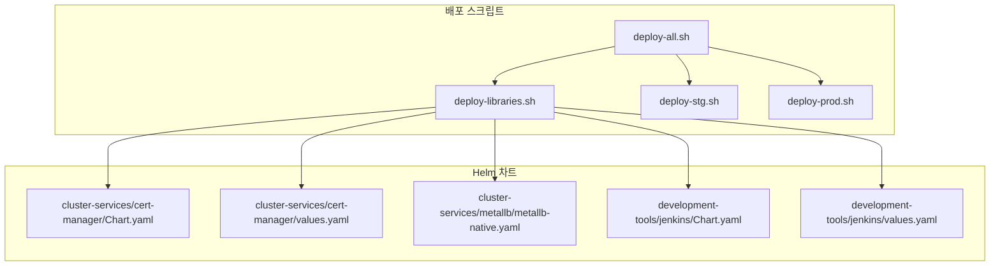
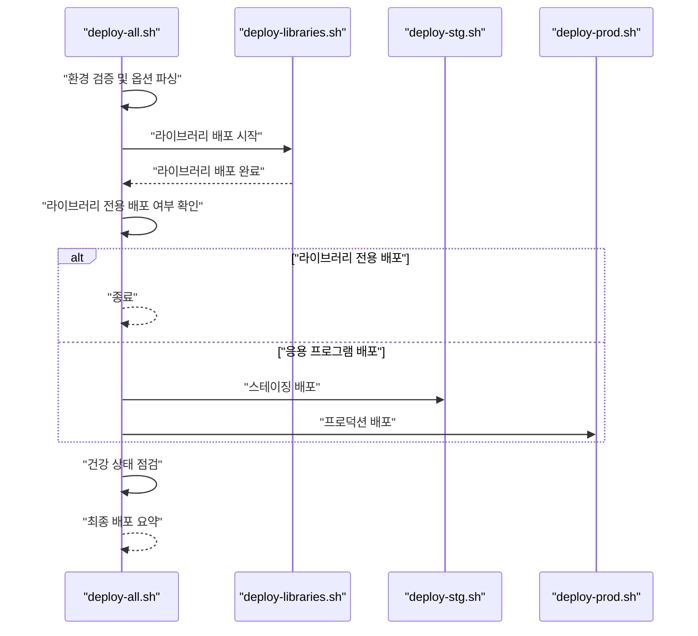
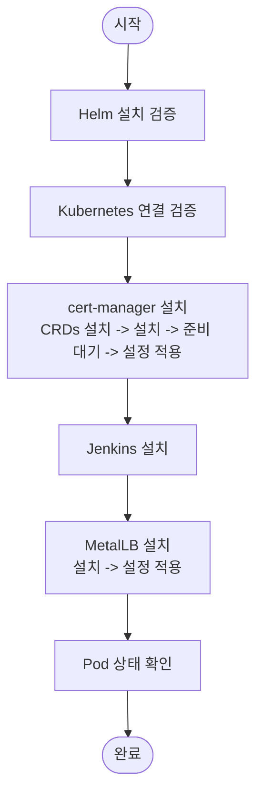
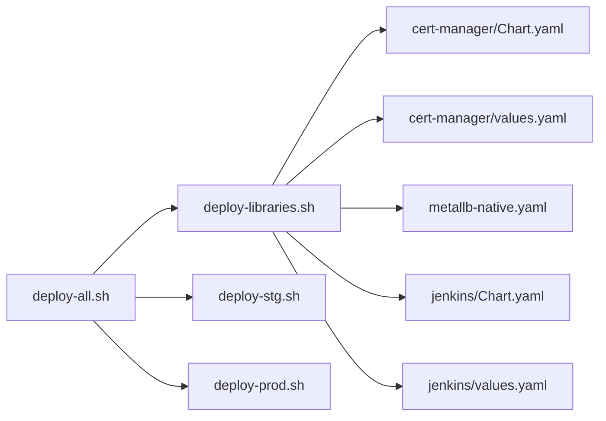

# 라이브러리 배포 오케스트레이션

<cite>
**문서에서 참조하는 파일 목록**
- [deploy-libraries.sh](file://scripts/deploy-libraries.sh)
- [deploy-all.sh](file://scripts/deploy-all.sh)
- [deploy-stg.sh](file://scripts/deploy-stg.sh)
- [deploy-prod.sh](file://scripts/deploy-prod.sh)
- [cert-manager Chart.yaml](file://helm/cluster-services/cert-manager/Chart.yaml)
- [cert-manager values.yaml](file://helm/cluster-services/cert-manager/values.yaml)
- [metallb-native.yaml](file://helm/cluster-services/metallb/metallb-native.yaml)
- [l2advertisement.yaml](file://helm/cluster-services/metallb/l2advertisement.yaml)
- [jenkins Chart.yaml](file://helm/development-tools/jenkins/Chart.yaml)
- [jenkins values.yaml](file://helm/development-tools/jenkins/values.yaml)
</cite>

## 목차
1. [소개](#소개)
2. [프로젝트 구조](#프로젝트-구조)
3. [핵심 구성 요소](#핵심-구성-요소)
4. [아키텍처 개요](#아키텍처-개요)
5. [상세 구성 요소 분석](#상세-구성-요소-분석)
6. [의존성 분석](#의존성-분석)
7. [성능 고려사항](#성능-고려사항)
8. [장애 진단 가이드](#장애-진단-가이드)
9. [결론](#결론)

## 소개
본 문서는 배포 파이프라인에서 기반 인프라를 안정적으로 구축하는 핵심 역할을 하는 라이브러리 배포 스크립트를 중심으로, 클러스터 서비스(cert-manager, MetalLB, nfs-provisioner 제외된 개발 도구)와 개발 도구(ArgoCD, Harbor, Grafana, Prometheus 등)를 어떻게 순차적으로 배포하는지를 코드 수준에서 분석합니다. 특히 Helm 차트 설치 순서의 중요성, 각 배포 후 상태 확인 및 대기 로직, 오류 발생 시 종료 처리 방식, 특정 컴포넌트만 배포하는 기능(--only 옵션)과 dry-run 모드의 구현 방식을 자세히 설명합니다.

## 프로젝트 구조
- 스크립트 디렉토리에는 전체 배포 오케스트레이터(deploy-all.sh)와 개별 배포 스크립트들이 위치합니다.
- Helm 차트는 helm/cluster-services와 helm/development-tools 하위에 위치하며, 각 컴포넌트별로 독립된 Chart.yaml과 values.yaml이 존재합니다.
- 배포 파이프라인은 deploy-all.sh이 전체 흐름을 조율하고, deploy-libraries.sh이 라이브러리 컴포넌트들을 순차적으로 배포합니다.

**도표 출처**
- [deploy-all.sh](file://scripts/deploy-all.sh#L1-L279)
- [deploy-libraries.sh](file://scripts/deploy-libraries.sh#L1-L128)
- [deploy-stg.sh](file://scripts/deploy-stg.sh#L1-L173)
- [deploy-prod.sh](file://scripts/deploy-prod.sh#L1-L299)
- [cert-manager Chart.yaml](file://helm/cluster-services/cert-manager/Chart.yaml#L1-L23)
- [cert-manager values.yaml](file://helm/cluster-services/cert-manager/values.yaml#L1-L35)
- [metallb-native.yaml](file://helm/cluster-services/metallb/metallb-native.yaml#L1-L120)
- [jenkins Chart.yaml](file://helm/development-tools/jenkins/Chart.yaml#L1-L50)
- [jenkins values.yaml](file://helm/development-tools/jenkins/values.yaml#L1-L120)

**섹션 출처**
- [deploy-all.sh](file://scripts/deploy-all.sh#L1-L279)
- [deploy-libraries.sh](file://scripts/deploy-libraries.sh#L1-L128)

## 핵심 구성 요소
- deploy-all.sh: 전체 배포 오케스트레이터. 환경 선택(--env), 라이브러리 배포 건너뛰기(--skip-libraries), 라이브러리 전용 배포(--libraries-only), dry-run(--dry-run) 등의 옵션을 처리하고, 라이브러리 배포 후 응용 프로그램 배포를 조율합니다.
- deploy-libraries.sh: 라이브러리 컴포넌트 배포 스크립트. cert-manager, Jenkins, MetalLB 순서로 배포하며, 각 컴포넌트에 대한 사전 검증, 설치, 준비 대기, 설정 적용 등을 수행합니다.
- deploy-stg.sh/deploy-prod.sh: 각 환경별 응용 프로그램 배포 스크립트. 사전 검증, 네임스페이스 생성, 차트 검증, 배포, 상태 확인, 접근 정보 표시 등의 단계를 거칩니다.

**섹션 출처**
- [deploy-all.sh](file://scripts/deploy-all.sh#L1-L279)
- [deploy-libraries.sh](file://scripts/deploy-libraries.sh#L1-L128)
- [deploy-stg.sh](file://scripts/deploy-stg.sh#L1-L173)
- [deploy-prod.sh](file://scripts/deploy-prod.sh#L1-L299)

## 아키텍처 개요
다음은 deploy-all.sh이 deploy-libraries.sh을 호출하여 라이브러리 컴포넌트를 배포하고, 이후 환경에 따라 응용 프로그램 배포를 조율하는 전체 흐름입니다.

**도표 출처**
- [deploy-all.sh](file://scripts/deploy-all.sh#L118-L279)
- [deploy-libraries.sh](file://scripts/deploy-libraries.sh#L104-L128)
- [deploy-stg.sh](file://scripts/deploy-stg.sh#L133-L151)
- [deploy-prod.sh](file://scripts/deploy-prod.sh#L242-L267)

## 상세 구성 요소 분석

### deploy-libraries.sh: 라이브러리 배포 오케스트레이션
- 사전 검증: Helm 설치 여부(kubectl) 검증, 클러스터 연결 상태 검증.
- cert-manager 배포:
  - Jetstack 저장소 추가 및 업데이트.
  - CRDs 다운로드 및 설치.
  - cert-manager 설치(네임스페이스 생성, 버전 지정, CRDs 포함).
  - 준비 대기: cert-manager Pod이 Ready 상태가 될 때까지 대기.
  - 설정 적용: cert-manager-config 차트를 사용하여 ClusterIssuer 설정 배포.
- Jenkins 배포:
  - Jenkins 차트 설치(네임스페이스 생성, 공통 values 적용).
- MetalLB 배포:
  - MetalLB 저장소 추가 및 업데이트.
  - MetalLB 설치(네임스페이스 생성).
  - MetalLB 설정 적용: metallb-native.yaml을 통한 CRD 및 리소스 배포.
- 최종 상태 확인: 각 네임스페이스의 Pod 상태 출력.

**도표 출처**
- [deploy-libraries.sh](file://scripts/deploy-libraries.sh#L27-L128)

**섹션 출처**
- [deploy-libraries.sh](file://scripts/deploy-libraries.sh#L1-L128)

### Helm 차트 설치 순서의 중요성
- cert-manager: TLS 인증서 발급을 위한 인프라. CRDs 먼저 설치하고, cert-manager Pod이 Ready 상태가 되어야 이후 Ingress/ClusterIssuer 관련 리소스가 안정적으로 작동합니다.
- MetalLB: LoadBalancer 타입 서비스를 위한 IP 할당 인프라. MetalLB 설치 후 네트워크 설정(CRD/Pool/L2Advertisement)이 필요합니다.
- Jenkins: 개발 도구로, 인프라에 영향을 주지 않으며, 다른 컴포넌트보다 순서가 유연하나, 네임스페이스는 별도로 관리됩니다.

**섹션 출처**
- [deploy-libraries.sh](file://scripts/deploy-libraries.sh#L43-L102)
- [cert-manager Chart.yaml](file://helm/cluster-services/cert-manager/Chart.yaml#L1-L23)
- [metallb-native.yaml](file://helm/cluster-services/metallb/metallb-native.yaml#L1-L120)

### 배포 후 상태 확인 및 대기 로직
- cert-manager: Pod Ready 상태 대기.
- MetalLB: 설치 후 네트워크 설정 적용.
- deploy-all.sh: 라이브러리 배포 후 짧은 대기 시간 제공.
- deploy-stg.sh/deploy-prod.sh: 차트 검증, 네임스페이스 생성, 배포(wait/timeout), 상태 확인, 접근 정보 표시.

**섹션 출처**
- [deploy-libraries.sh](file://scripts/deploy-libraries.sh#L61-L63)
- [deploy-all.sh](file://scripts/deploy-all.sh#L243-L256)
- [deploy-stg.sh](file://scripts/deploy-stg.sh#L55-L89)
- [deploy-prod.sh](file://scripts/deploy-prod.sh#L97-L173)

### 오류 발생 시 종료 처리 방식
- set -e: 명령 실패 시 스크립트 즉시 종료.
- 사전 검증 실패 시 오류 메시지 출력 후 종료.
- deploy-all.sh: production 배포 시 사용자 확인 없이 취소됨.

**섹션 출처**
- [deploy-libraries.sh](file://scripts/deploy-libraries.sh#L6-L12)
- [deploy-all.sh](file://scripts/deploy-all.sh#L232-L241)

### 특정 컴포넌트만 배포하는 기능(--libraries-only)
- deploy-all.sh에서 --libraries-only 옵션을 통해 라이브러리 배포 후 응용 프로그램 배포를 건너뜁니다.
- 라이브러리 전용 배포 완료 후 즉시 종료됩니다.

**섹션 출처**
- [deploy-all.sh](file://scripts/deploy-all.sh#L53-L56)
- [deploy-all.sh](file://scripts/deploy-all.sh#L243-L251)

### dry-run 모드 구현 방식
- deploy-all.sh: --dry-run 옵션을 통해 DRY_RUN 환경 변수를 설정하고, 이후 deploy-prod.sh에서 DRY_RUN=true일 경우 실제 변경 없이 dry-run 모드로 동작합니다.
- deploy-prod.sh: DRY_RUN=true일 경우 helm upgrade --install에 --dry-run 옵션을 추가하고, 실행 내용을 로깅합니다.

**섹션 출처**
- [deploy-all.sh](file://scripts/deploy-all.sh#L66-L97)
- [deploy-all.sh](file://scripts/deploy-all.sh#L160-L169)
- [deploy-prod.sh](file://scripts/deploy-prod.sh#L23-L25)
- [deploy-prod.sh](file://scripts/deploy-prod.sh#L161-L166)

### 개발 도구 배포(예: Jenkins)
- Jenkins 차트는 별도의 values.yaml을 통해 설정이 가능하며, cert-manager 설정에 따라 Ingress TLS 설정이 가능합니다.
- Jenkins 배포는 네임스페이스 생성 후 helm upgrade --install로 설치됩니다.

**섹션 출처**
- [jenkins Chart.yaml](file://helm/development-tools/jenkins/Chart.yaml#L1-L50)
- [jenkins values.yaml](file://helm/development-tools/jenkins/values.yaml#L1-L120)
- [deploy-libraries.sh](file://scripts/deploy-libraries.sh#L72-L82)

## 의존성 분석
- deploy-all.sh은 deploy-libraries.sh, deploy-stg.sh, deploy-prod.sh에 의존하며, 옵션에 따라 배포 흐름을 조절합니다.
- deploy-libraries.sh은 cert-manager, MetalLB, Jenkins 차트에 의존하며, 각 차트의 설치 순서와 준비 상태를 관리합니다.
- cert-manager Chart.yaml은 cert-manager 하위 차트를 의존하고 있으며, values.yaml에 ClusterIssuer 설정이 포함되어 있습니다.
- MetalLB는 CRD를 포함한 네이티브 매니페스트를 사용합니다.

**도표 출처**
- [deploy-all.sh](file://scripts/deploy-all.sh#L118-L154)
- [deploy-libraries.sh](file://scripts/deploy-libraries.sh#L43-L102)
- [cert-manager Chart.yaml](file://helm/cluster-services/cert-manager/Chart.yaml#L1-L23)
- [cert-manager values.yaml](file://helm/cluster-services/cert-manager/values.yaml#L1-L35)
- [metallb-native.yaml](file://helm/cluster-services/metallb/metallb-native.yaml#L1-L120)
- [jenkins Chart.yaml](file://helm/development-tools/jenkins/Chart.yaml#L1-L50)
- [jenkins values.yaml](file://helm/development-tools/jenkins/values.yaml#L1-L120)

**섹션 출처**
- [deploy-all.sh](file://scripts/deploy-all.sh#L118-L154)
- [deploy-libraries.sh](file://scripts/deploy-libraries.sh#L43-L102)
- [cert-manager Chart.yaml](file://helm/cluster-services/cert-manager/Chart.yaml#L1-L23)
- [cert-manager values.yaml](file://helm/cluster-services/cert-manager/values.yaml#L1-L35)
- [metallb-native.yaml](file://helm/cluster-services/metallb/metallb-native.yaml#L1-L120)
- [jenkins Chart.yaml](file://helm/development-tools/jenkins/Chart.yaml#L1-L50)
- [jenkins values.yaml](file://helm/development-tools/jenkins/values.yaml#L1-L120)

## 성능 고려사항
- 배포 시각: 각 컴포넌트 설치 후 Ready 상태 대기를 통해 안정적인 배포를 보장하지만, 대기 시간이 길어질 수 있습니다. 필요 시 대기 시간 조정이 가능합니다.
- 네임스페이스 생성: dry-run 방식을 사용하여 네임스페이스 생성 시뮬레이션을 통해 실수 방지.
- 차트 검증: 응용 프로그램 배포 전에 차트 검증을 통해 배포 실패 가능성을 줄입니다.

[이 섹션은 일반적인 성능 논의를 포함하므로 구체적인 파일 분석 없음]

## 장애 진단 가이드
- Helm 또는 kubectl 미설치: 사전 검증 단계에서 오류 발생 시 종료되며, 설치 후 재시도 권장.
- 클러스터 연결 불가: kubectl cluster-info 실패 시 클러스터 연결 상태 확인.
- cert-manager 준비 대기 실패: Pod 상태 확인 후 재시도 또는 수동 확인.
- MetalLB 설정 적용 실패: metallb-native.yaml 매니페스트 확인 및 네트워크 설정 검토.
- 응용 프로그램 배포 실패: 차트 검증, 네임스페이스, values.yaml 설정 확인.

**섹션 출처**
- [deploy-libraries.sh](file://scripts/deploy-libraries.sh#L27-L41)
- [deploy-stg.sh](file://scripts/deploy-stg.sh#L39-L53)
- [deploy-prod.sh](file://scripts/deploy-prod.sh#L69-L95)

## 결론
deploy-libraries.sh은 cert-manager, Jenkins, MetalLB를 순차적으로 배포하고, 각 컴포넌트의 준비 상태를 검증함으로써 기반 인프라를 안정적으로 구축합니다. deploy-all.sh은 이 배포를 전체 파이프라인에서 조율하며, --libraries-only와 --dry-run 같은 기능을 통해 유연한 배포 전략을 지원합니다. 응용 프로그램 배포는 deploy-stg.sh/deploy-prod.sh에서 차트 검증, 네임스페이스 생성, 배포(wait/timeout), 상태 확인, 접근 정보 표시를 통해 안전하게 진행됩니다.