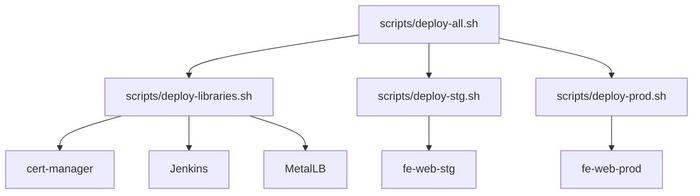
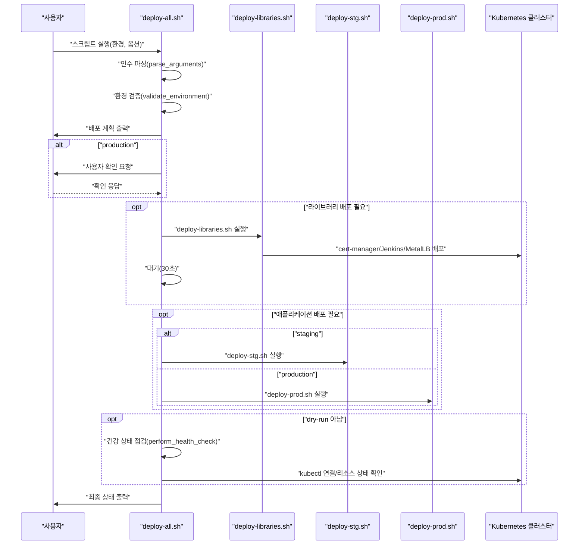
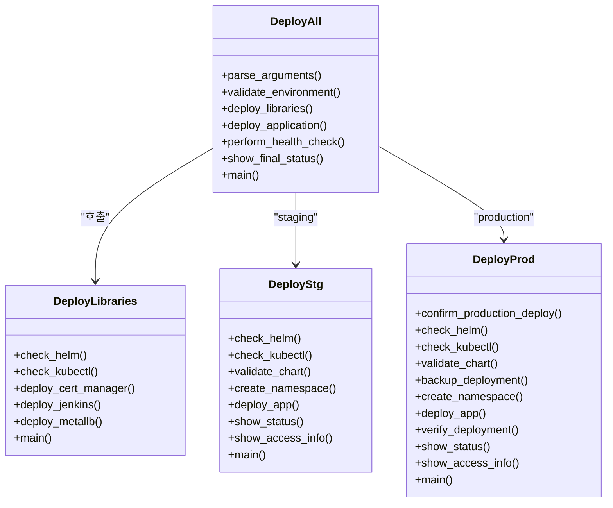
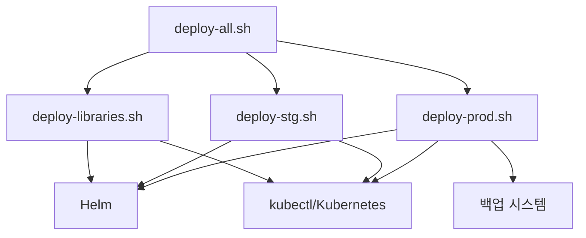

# 메인 오케스트레이션 스크립트

<cite>
**문서에서 참조하는 파일**
- [deploy-all.sh](file://scripts/deploy-all.sh)
- [deploy-libraries.sh](file://scripts/deploy-libraries.sh)
- [deploy-stg.sh](file://scripts/deploy-stg.sh)
- [deploy-prod.sh](file://scripts/deploy-prod.sh)
</cite>

## 목차
1. [소개](#소개)
2. [프로젝트 구조](#프로젝트-구조)
3. [핵심 구성 요소](#핵심-구성-요소)
4. [아키텍처 개요](#아키텍처-개요)
5. [상세 구성 요소 분석](#상세-구성-요소-분석)
6. [의존성 분석](#의존성-분석)
7. [성능 고려사항](#성능-고려사항)
8. [장애 진단 가이드](#장애-진단-가이드)
9. [결론](#결론)

## 소개
본 문서는 메인 오케스트레이션 스크립트인 deploy-all.sh의 전체 동작 흐름을 단계별로 설명합니다. 이 스크립트는 라이브러리 컴포넌트와 애플리케이션 배포를 통합적으로 제어하며, 인수 파싱, dry-run 모드, 사용자 경고 메시지, 사전 검사, 라이브러리 배포 호출, 배포 완료 후 대기 및 건강 상태 점검까지 전반적인 워크플로우를 담당합니다. 또한, 스크립트 내 주요 함수들의 역할과 호출 관계, 오류 발생 시 사용자에게 제공되는 피드백 메커니즘과 종료 코드 처리 방식도 구체적인 코드 위치를 중심으로 설명합니다.

## 프로젝트 구조
- deploy-all.sh는 scripts 디렉터리에 위치하며, 라이브러리 배포 스크립트(deploy-libraries.sh)와 애플리케이션 배포 스크립립트(deploy-stg.sh, deploy-prod.sh)를 호출하여 전체 배포를 오케스트레이션합니다.
- deploy-libraries.sh는 cert-manager, Jenkins, MetalLB 등의 클러스터 서비스를 배포합니다.
- deploy-stg.sh는 스테이징 환경에 애플리케이션을 배포합니다.
- deploy-prod.sh는 프로덕션 환경에 안전 검사와 함께 애플리케이션을 배포하며, dry-run, 백업, 롤백 등의 기능을 포함합니다.

**다이어그램 소스**
- [deploy-all.sh](file://scripts/deploy-all.sh#L118-L154)
- [deploy-libraries.sh](file://scripts/deploy-libraries.sh#L44-L102)
- [deploy-stg.sh](file://scripts/deploy-stg.sh#L77-L89)
- [deploy-prod.sh](file://scripts/deploy-prod.sh#L147-L173)

**섹션 소스**
- [deploy-all.sh](file://scripts/deploy-all.sh#L1-L279)
- [deploy-libraries.sh](file://scripts/deploy-libraries.sh#L1-L128)
- [deploy-stg.sh](file://scripts/deploy-stg.sh#L1-L173)
- [deploy-prod.sh](file://scripts/deploy-prod.sh#L1-L299)

## 핵심 구성 요소
- 인수 파싱: 환경(staging/production)과 옵션(--skip-libraries, --libraries-only, --dry-run, --help)을 파싱합니다.
- 환경 검증: 입력된 환경이 유효한지 검사하고, 별칭(stg, stage, prod)을 표준 이름으로 변환합니다.
- 사전 검사: deploy-libraries.sh 존재 여부, kubectl 연결 상태 등을 검사합니다.
- 라이브러리 배포: deploy-libraries.sh를 실행하여 cert-manager, Jenkins, MetalLB를 배포합니다.
- 애플리케이션 배포: 환경에 따라 deploy-stg.sh 또는 deploy-prod.sh를 실행합니다.
- 건강 상태 점검: kubectl 연결 상태, cert-manager, 애플리케이션 Pod 상태를 점검합니다.
- 사용자 피드백: 정보, 경고, 오류 메시지를 색상별로 출력하며, 프로덕션 배포 시 사용자 확인을 요청합니다.
- 종료 코드: 오류 발생 시 1을 반환하고, 성공 시 0을 반환합니다.

**섹션 소스**
- [deploy-all.sh](file://scripts/deploy-all.sh#L45-L97)
- [deploy-all.sh](file://scripts/deploy-all.sh#L100-L116)
- [deploy-all.sh](file://scripts/deploy-all.sh#L118-L154)
- [deploy-all.sh](file://scripts/deploy-all.sh#L183-L215)
- [deploy-all.sh](file://scripts/deploy-all.sh#L217-L279)

## 아키텍처 개요
deploy-all.sh는 다음과 같은 순서로 작동합니다:
1) 인수 파싱 → 2) 환경 검증 → 3) 배포 계획 출력 → 4) 프로덕션 배포 시 사용자 확인 → 5) 라이브러리 배포(선택) → 6) 애플리케이션 배포 → 7) 건강 상태 점검(선택) → 8) 최종 상태 출력

**다이어그램 소스**
- [deploy-all.sh](file://scripts/deploy-all.sh#L217-L279)
- [deploy-libraries.sh](file://scripts/deploy-libraries.sh#L104-L128)
- [deploy-stg.sh](file://scripts/deploy-stg.sh#L133-L151)
- [deploy-prod.sh](file://scripts/deploy-prod.sh#L242-L267)

**섹션 소스**
- [deploy-all.sh](file://scripts/deploy-all.sh#L217-L279)

## 상세 구성 요소 분석

### 인수 파싱 로직
- 파라미터
  - 첫 번째 인수: 환경(staging/production)이며 기본값은 staging입니다.
  - 두 번째 이후 인수: 옵션(--skip-libraries, --libraries-only, --dry-run, --help)을 받습니다.
- 파싱 규칙
  - --skip-libraries: 라이브러리 배포를 건너뜁니다.
  - --libraries-only: 라이브러리만 배포하고 종료합니다.
  - --dry-run: dry-run 모드를 활성화하고 환경 변수로 전달합니다.
  - --help: 도움말을 출력하고 종료합니다.
  - 알 수 없는 옵션: 오류 메시지를 출력하고 종료 코드 1을 반환합니다.
- 색상별 로깅
  - 정보(log_info), 경고(log_warn), 오류(log_error), 디버그(log_debug) 함수를 통해 사용자에게 명확한 피드백을 제공합니다.

**섹션 소스**
- [deploy-all.sh](file://scripts/deploy-all.sh#L16-L19)
- [deploy-all.sh](file://scripts/deploy-all.sh#L45-L97)
- [deploy-all.sh](file://scripts/deploy-all.sh#L21-L43)

### dry-run 모드 처리
- 환경 변수 DRY_RUN=true로 전달되며, deploy-libraries.sh에서는 사전 검사를 수행하나 실제 배포는 하지 않습니다.
- deploy-prod.sh에서는 DRY_RUN=true일 때 helm upgrade --install에 --dry-run 옵션을 추가하여 실제로 배포하지 않고 dry-run 결과만 출력합니다.
- deploy-all.sh에서는 건강 상태 점검을 건너뛰고, 최종 상태 출력 시 dry-run 모드임을 표시합니다.

**섹션 소스**
- [deploy-all.sh](file://scripts/deploy-all.sh#L81-L84)
- [deploy-all.sh](file://scripts/deploy-all.sh#L263-L266)
- [deploy-libraries.sh](file://scripts/deploy-libraries.sh#L104-L128)
- [deploy-prod.sh](file://scripts/deploy-prod.sh#L161-L167)

### 사용자 경고 메시지 출력
- 프로덕션 배포 시 사용자에게 경고를 표시하고, 'yes'를 입력해야 배포가 진행됩니다.
- 최종 상태 출력 시 프로덕션 환경에서는 운영 관련 팁(모니터링, 로그 확인, 엔드포인트 검증 등)을 안내합니다.
- 사전 검사 실패 시 오류 메시지를 출력하고 종료 코드 1을 반환합니다.

**섹션 소스**
- [deploy-all.sh](file://scripts/deploy-all.sh#L232-L241)
- [deploy-all.sh](file://scripts/deploy-all.sh#L173-L181)
- [deploy-all.sh](file://scripts/deploy-all.sh#L122-L125)

### 라이브러리 배포 전 사전 검사(pre-flight checks)
- deploy-libraries.sh는 다음 사전 검사를 수행합니다:
  - Helm 설치 여부 확인
  - kubectl 연결 상태 확인
- 사전 검사에 실패하면 오류 메시지를 출력하고 종료 코드 1을 반환합니다.

**섹션 소스**
- [deploy-libraries.sh](file://scripts/deploy-libraries.sh#L27-L41)
- [deploy-libraries.sh](file://scripts/deploy-libraries.sh#L104-L128)

### deploy-libraries.sh 호출
- deploy-all.sh는 deploy-libraries.sh를 실행하여 cert-manager, Jenkins, MetalLB를 배포합니다.
- deploy-libraries.sh는 각 컴포넌트별로 배포 로직을 수행하고, 최종적으로 각 네임스페이스의 Pod 상태를 출력합니다.

**섹션 소스**
- [deploy-all.sh](file://scripts/deploy-all.sh#L118-L130)
- [deploy-libraries.sh](file://scripts/deploy-libraries.sh#L44-L102)
- [deploy-libraries.sh](file://scripts/deploy-libraries.sh#L104-L128)

### 배포 완료 후 대기 및 건강 상태 점검(health check)
- deploy-all.sh는 라이브러리 배포 후 30초 대기를 수행합니다.
- 건강 상태 점검은 다음과 같습니다:
  - kubectl cluster-info 연결 상태 확인
  - 라이브러리 배포 시 cert-manager Pod 상태 확인
  - 애플리케이션 배포 시 해당 환경(stg/prod)의 Pod 상태 확인
- dry-run 모드에서는 건강 상태 점검을 건너뜁니다.

**섹션 소스**
- [deploy-all.sh](file://scripts/deploy-all.sh#L253-L256)
- [deploy-all.sh](file://scripts/deploy-all.sh#L183-L215)

### 주요 함수들과 호출 관계
- deploy-all.sh의 주요 함수:
  - parse_arguments(): 인수 파싱
  - validate_environment(): 환경 검증
  - deploy_libraries(): 라이브러리 배포
  - deploy_application(): 애플리케이션 배포
  - perform_health_check(): 건강 상태 점검
  - show_final_status(): 최종 상태 출력
  - main(): 전체 흐름 제어
- deploy-libraries.sh의 주요 함수:
  - check_helm(), check_kubectl(): 사전 검사
  - deploy_cert_manager(), deploy_jenkins(), deploy_metallb(): 컴포넌트별 배포
  - main(): 라이브러리 배포 흐름 제어

**다이어그램 소스**
- [deploy-all.sh](file://scripts/deploy-all.sh#L65-L154)
- [deploy-libraries.sh](file://scripts/deploy-libraries.sh#L27-L128)
- [deploy-stg.sh](file://scripts/deploy-stg.sh#L39-L151)
- [deploy-prod.sh](file://scripts/deploy-prod.sh#L43-L267)

**섹션 소스**
- [deploy-all.sh](file://scripts/deploy-all.sh#L65-L154)
- [deploy-libraries.sh](file://scripts/deploy-libraries.sh#L27-L128)
- [deploy-stg.sh](file://scripts/deploy-stg.sh#L39-L151)
- [deploy-prod.sh](file://scripts/deploy-prod.sh#L43-L267)

### 오류 발생 시 피드백 메커니즘과 종료 코드
- 인수 파싱 오류: 알 수 없는 옵션을 입력하면 오류 메시지를 출력하고 종료 코드 1을 반환합니다.
- 환경 검증 오류: 유효하지 않은 환경을 입력하면 오류 메시지를 출력하고 종료 코드 1을 반환합니다.
- 사전 검사 실패: Helm 미설치, kubectl 연결 불가, 파일 누락 등의 경우 오류 메시지를 출력하고 종료 코드 1을 반환합니다.
- 프로덕션 배포 취소: 사용자가 'yes'를 입력하지 않으면 배포를 취소하고 종료 코드 0을 반환합니다.
- 건강 상태 점검 실패: kubectl 연결 불가 시 오류 메시지를 출력하고 1을 반환합니다.

**섹션 소스**
- [deploy-all.sh](file://scripts/deploy-all.sh#L90-L97)
- [deploy-all.sh](file://scripts/deploy-all.sh#L108-L116)
- [deploy-all.sh](file://scripts/deploy-all.sh#L122-L125)
- [deploy-all.sh](file://scripts/deploy-all.sh#L188-L191)
- [deploy-all.sh](file://scripts/deploy-all.sh#L236-L241)

## 의존성 분석
- deploy-all.sh는 deploy-libraries.sh, deploy-stg.sh, deploy-prod.sh에 의존합니다.
- deploy-libraries.sh는 Helm, kubectl, Kubernetes 클러스터에 의존합니다.
- deploy-stg.sh는 Helm, kubectl, Kubernetes 클러스터에 의존합니다.
- deploy-prod.sh는 Helm, kubectl, Kubernetes 클러스터, 백업 시스템에 의존합니다.

**다이어그램 소스**
- [deploy-all.sh](file://scripts/deploy-all.sh#L118-L154)
- [deploy-libraries.sh](file://scripts/deploy-libraries.sh#L27-L41)
- [deploy-stg.sh](file://scripts/deploy-stg.sh#L39-L53)
- [deploy-prod.sh](file://scripts/deploy-prod.sh#L69-L95)

**섹션 소스**
- [deploy-all.sh](file://scripts/deploy-all.sh#L118-L154)
- [deploy-libraries.sh](file://scripts/deploy-libraries.sh#L27-L41)
- [deploy-stg.sh](file://scripts/deploy-stg.sh#L39-L53)
- [deploy-prod.sh](file://scripts/deploy-prod.sh#L69-L95)

## 성능 고려사항
- 라이브러리 배포 후 30초 대기는 배포된 컴포넌트가 안정적으로 준비될 수 있도록 하는 간접적인 지연입니다. 이 시간은 네트워크, 이미지 다운로드, Pod 재시작 등의 요소에 따라 달라질 수 있습니다.
- 건강 상태 점검은 kubectl 명령을 통해 Pod 상태를 조회하므로, 클러스터 응답 속도에 따라 지연이 발생할 수 있습니다.
- dry-run 모드는 실제 배포를 하지 않으므로 성능 영향이 거의 없지만, 사전 검사는 여전히 필요합니다.

[이 섹션은 일반적인 성능 논의를 포함하므로 구체적인 파일 분석 없음]

## 장애 진단 가이드
- 인수 파싱 오류
  - 원인: 알 수 없는 옵션 또는 잘못된 환경 값
  - 조치: --help를 통해 올바른 인수를 확인하고 다시 시도
  - 관련 위치: [deploy-all.sh](file://scripts/deploy-all.sh#L45-L97)
- 환경 검증 실패
  - 원인: staging/production 이외의 값 입력
  - 조치: staging 또는 production으로 수정
  - 관련 위치: [deploy-all.sh](file://scripts/deploy-all.sh#L100-L116)
- 사전 검사 실패
  - 원인: Helm 미설치, kubectl 연결 불가, deploy-libraries.sh 누락
  - 조치: Helm 설치, kubectl 연결 확인, deploy-libraries.sh 존재 여부 점검
  - 관련 위치: [deploy-all.sh](file://scripts/deploy-all.sh#L122-L125), [deploy-libraries.sh](file://scripts/deploy-libraries.sh#L27-L41)
- 프로덕션 배포 취소
  - 원인: 사용자가 'yes'를 입력하지 않음
  - 조치: 'yes'를 입력하거나 배포를 취소
  - 관련 위치: [deploy-all.sh](file://scripts/deploy-all.sh#L236-L241)
- 건강 상태 점검 실패
  - 원인: kubectl 연결 불가
  - 조치: kubectl cluster-info 확인, 클러스터 연결 문제 해결
  - 관련 위치: [deploy-all.sh](file://scripts/deploy-all.sh#L188-L191)

**섹션 소스**
- [deploy-all.sh](file://scripts/deploy-all.sh#L45-L97)
- [deploy-all.sh](file://scripts/deploy-all.sh#L100-L116)
- [deploy-all.sh](file://scripts/deploy-all.sh#L122-L125)
- [deploy-all.sh](file://scripts/deploy-all.sh#L188-L191)
- [deploy-libraries.sh](file://scripts/deploy-libraries.sh#L27-L41)

## 결론
deploy-all.sh는 라이브러리와 애플리케이션 배포를 통합적으로 제어하는 오케스트레이션 스크립트입니다. 인수 파싱, 환경 검증, 사전 검사, 라이브러리 배포, 애플리케이션 배포, 건강 상태 점검, 사용자 피드백, 종료 코드 처리까지 전반적인 워크플로우를 체계적으로 관리합니다. 특히 dry-run 모드와 프로덕션 배포 시 사용자 확인, 사전 검사, 건강 상태 점검을 통해 안정적인 배포를 보장합니다.