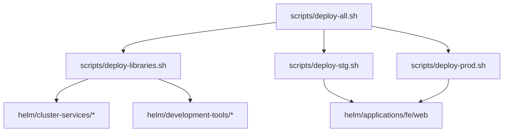
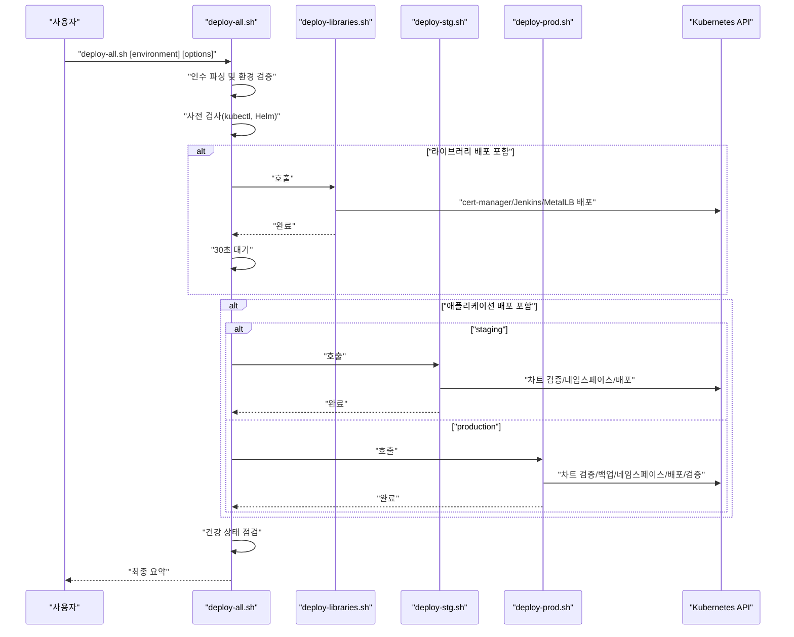
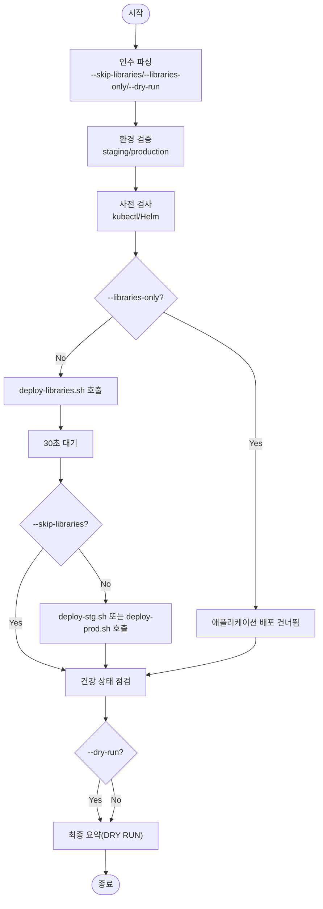
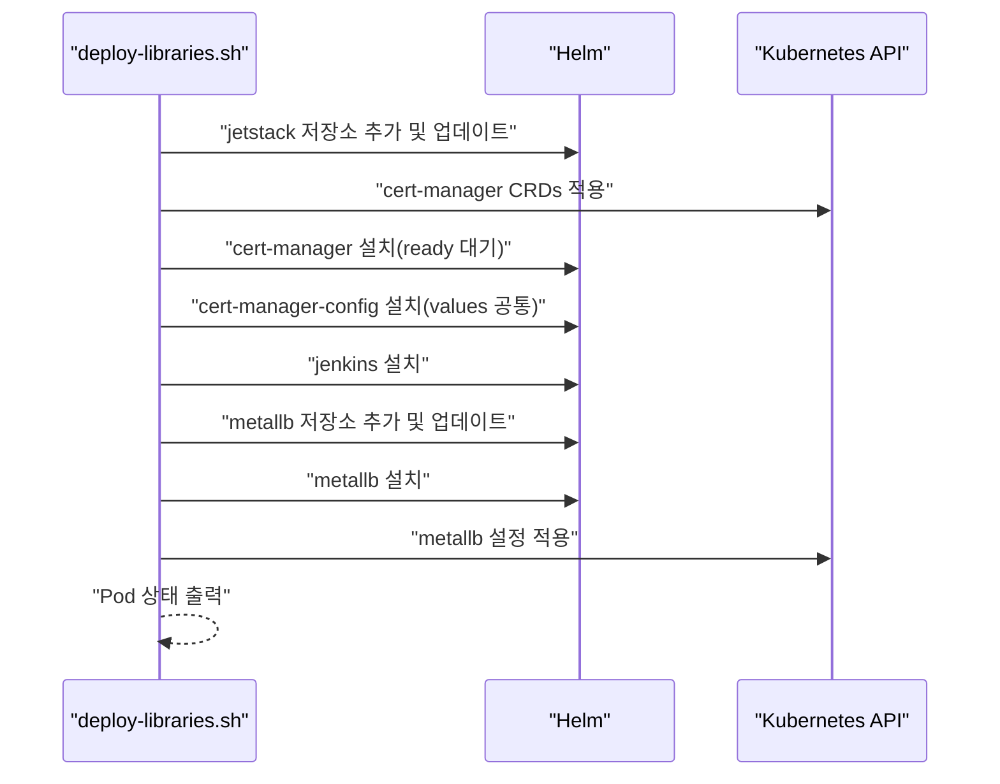
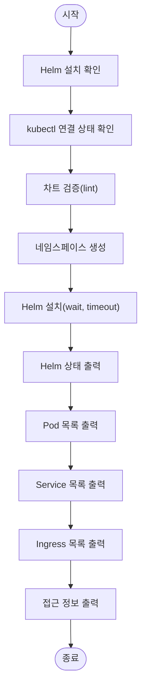
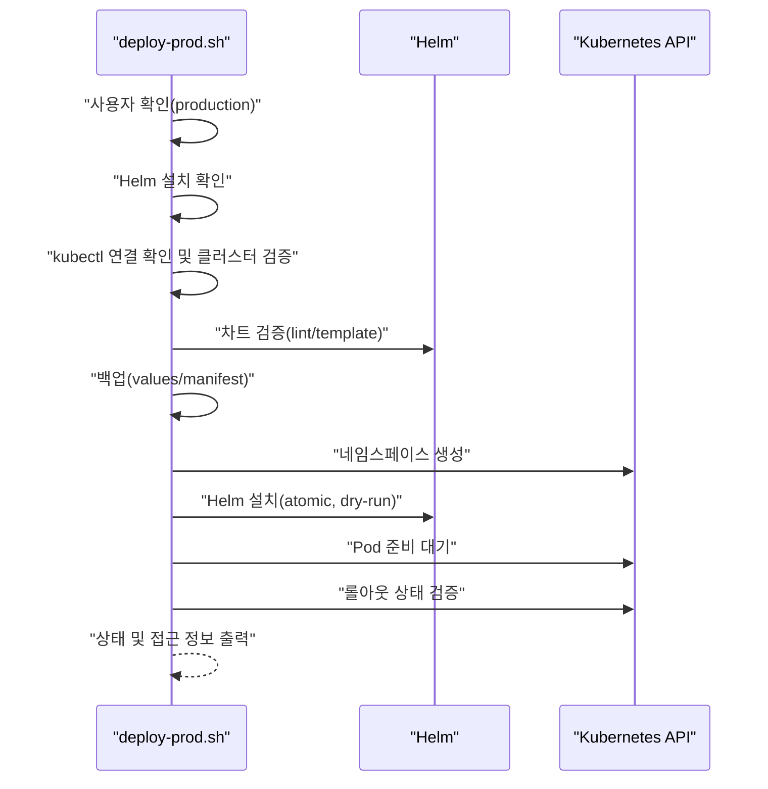
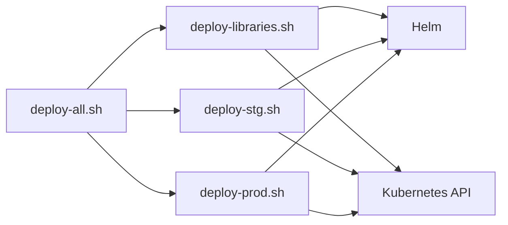

# 배포 오케스트레이션

<cite>
**문서에서 참조하는 파일 목록**
- [deploy-all.sh](file://scripts/deploy-all.sh)
- [deploy-libraries.sh](file://scripts/deploy-libraries.sh)
- [deploy-stg.sh](file://scripts/deploy-stg.sh)
- [deploy-prod.sh](file://scripts/deploy-prod.sh)
- [README.md](file://README.md)
</cite>

## 목차
1. [소개](#소개)
2. [프로젝트 구조](#프로젝트-구조)
3. [핵심 컴포넌트](#핵심-컴포넌트)
4. [아키텍처 개요](#아키텍처-개요)
5. [상세 컴포넌트 분석](#상세-컴포넌트-분석)
6. [의존성 분석](#의존성-분석)
7. [성능 고려사항](#성능-고려사항)
8. [고장 진단 가이드](#고장-진단-가이드)
9. [결론](#결론)

## 소개
본 문서는 prj-devops의 배포 오케스트레이션 메커니즘을 설명합니다. 메인 스크립트인 deploy-all.sh이 전체 배포 프로세스를 제어하고, deploy-libraries.sh과 환경별 배포 스크립트(deploy-stg.sh, deploy-prod.sh)를 어떻게 오케스트레이션하는지를 단계별로 설명합니다. 스크립트 간의 호출 관계, 인수 파싱 로직, 사전 검사(pre-flight checks), 라이브러리 배포 후 대기 기능, 건강 상태 점검(health check) 등을 중심으로 설명하고, 실제 코드 예제를 통해 dry-run 모드, production 배포 확인, 라이브러리만 배포 등의 고급 기능을 설명합니다. 오류 처리 및 사용자 피드백 메커니즘도 포함합니다.

## 프로젝트 구조
- 배포 자동화 스크립트는 scripts/ 디렉토리에 위치합니다.
- deploy-all.sh이 전체 배포 오케스트레이터로서, deploy-libraries.sh과 deploy-stg.sh/deploy-prod.sh을 호출합니다.
- deploy-libraries.sh은 클러스터 서비스 및 개발 도구를 배포합니다.
- deploy-stg.sh/deploy-prod.sh은 각 환경에 맞춘 애플리케이션 배포를 담당합니다.
- README.md는 배포 스크립트 사용법과 배포 전략에 대한 개요를 제공합니다.

**도표 출처**
- [deploy-all.sh](file://scripts/deploy-all.sh#L1-L279)
- [deploy-libraries.sh](file://scripts/deploy-libraries.sh#L1-L128)
- [deploy-stg.sh](file://scripts/deploy-stg.sh#L1-L173)
- [deploy-prod.sh](file://scripts/deploy-prod.sh#L1-L299)

**섹션 출처**
- [README.md](file://README.md#L101-L109)

## 핵심 컴포넌트
- deploy-all.sh: 전체 배포 오케스트레이터. 인수 파싱, 환경 검증, 라이브러리 배포, 애플리케이션 배포, 건강 상태 점검, 최종 요약을 담당합니다.
- deploy-libraries.sh: 라이브러리(인프라 + 개발 도구) 배포 스크립트. 사전 검사, cert-manager, Jenkins, MetalLB 배포를 포함합니다.
- deploy-stg.sh: 스테이징 환경 배포 스크립트. 사전 검사, 차트 검증, 네임스페이스 생성, 배포, 상태 표시, 접근 정보 표시를 포함합니다.
- deploy-prod.sh: 프로덕션 환경 배포 스크립트. 안전 확인, 사전 검사, 차트 검증, 백업, 네임스페이스 생성, 배포, 건강 검증, 상태 표시, 접근 정보 표시를 포함합니다.

**섹션 출처**
- [deploy-all.sh](file://scripts/deploy-all.sh#L1-L279)
- [deploy-libraries.sh](file://scripts/deploy-libraries.sh#L1-L128)
- [deploy-stg.sh](file://scripts/deploy-stg.sh#L1-L173)
- [deploy-prod.sh](file://scripts/deploy-prod.sh#L1-L299)

## 아키텍처 개요
deploy-all.sh은 다음과 같은 제어 흐름을 따릅니다:
- 인수 파싱: 환경(staging/production)과 옵션(--skip-libraries, --libraries-only, --dry-run)을 파싱합니다.
- 환경 검증: 입력된 환경을 정규화하고, 유효성을 검증합니다.
- 사전 검사: kubectl, Helm 설치 여부를 검사합니다.
- 라이브러리 배포: deploy-libraries.sh을 호출하고, 라이브러리만 배포 시에는 이후 배포를 건너뜁니다.
- 대기: 라이브러리 배포 후 짧은 대기 시간을 두어 준비 상태를 기다립니다.
- 애플리케이션 배포: 환경에 따라 deploy-stg.sh 또는 deploy-prod.sh을 호출합니다.
- 건강 상태 점검: 클러스터 연결 상태, cert-manager, 애플리케이션 Pod 상태를 점검합니다.
- 최종 요약: 배포 성공 여부, 환경, dry-run 여부 등을 요약합니다.

**도표 출처**
- [deploy-all.sh](file://scripts/deploy-all.sh#L65-L279)
- [deploy-libraries.sh](file://scripts/deploy-libraries.sh#L27-L128)
- [deploy-stg.sh](file://scripts/deploy-stg.sh#L39-L151)
- [deploy-prod.sh](file://scripts/deploy-prod.sh#L69-L267)

**섹션 출처**
- [deploy-all.sh](file://scripts/deploy-all.sh#L1-L279)

## 상세 컴포넌트 분석

### deploy-all.sh 분석
- 인수 파싱 로직:
  - 환경 인수를 첫 번째 인수로 받고, 두 번째 인수부터 옵션을 파싱합니다.
  - 지원하는 옵션: --skip-libraries, --libraries-only, --dry-run, --help.
  - unknown 옵션은 오류를 발생시키고 도움말을 출력합니다.
- 환경 검증:
  - staging/stg/stage → staging, production/prod → production으로 정규화합니다.
  - 유효하지 않은 환경은 오류를 발생시킵니다.
- 사전 검사:
  - kubectl이 설치되어 있는지 확인합니다.
- 라이브러리 배포:
  - deploy-libraries.sh 존재 여부를 검사하고 호출합니다.
  - 라이브러리 배포 완료 후 30초 대기합니다.
- 애플리케이션 배포:
  - staging → deploy-stg.sh, production → deploy-prod.sh 호출.
  - --libraries-only 옵션 시 이후 배포는 건너뜁니다.
- 건강 상태 점검:
  - kubectl cluster-info 검사.
  - 라이브러리 배포 시 cert-manager 상태 점검.
  - 애플리케이션 배포 시 해당 환경 네임스페이스의 Pod 상태 점검.
- 최종 요약:
  - 배포 성공 여부, 환경, dry-run 여부를 요약합니다.
  - production 배포 시 운영 팁을 안내합니다.

**도표 출처**
- [deploy-all.sh](file://scripts/deploy-all.sh#L65-L279)

**섹션 출처**
- [deploy-all.sh](file://scripts/deploy-all.sh#L45-L116)
- [deploy-all.sh](file://scripts/deploy-all.sh#L118-L154)
- [deploy-all.sh](file://scripts/deploy-all.sh#L183-L215)
- [deploy-all.sh](file://scripts/deploy-all.sh#L217-L279)

### deploy-libraries.sh 분석
- 사전 검사:
  - Helm 설치 여부 확인.
  - kubectl 클러스터 연결 상태 확인.
- 배포 순서:
  - cert-manager: Jetstack 저장소 추가, CRDs 적용, Helm 차트 설치, 준비 대기, 설정 적용.
  - Jenkins: Helm 차트 설치.
  - MetalLB: 저장소 추가, Helm 차트 설치, 설정 적용.
- 배포 완료 후 Pod 상태 출력.

**도표 출처**
- [deploy-libraries.sh](file://scripts/deploy-libraries.sh#L27-L128)

**섹션 출처**
- [deploy-libraries.sh](file://scripts/deploy-libraries.sh#L27-L128)

### deploy-stg.sh 분석
- 사전 검사:
  - Helm 설치 여부 확인.
  - kubectl 클러스터 연결 상태 확인.
  - 차트 검증(lint).
- 배포 과정:
  - 네임스페이스 생성(존재하지 않을 경우).
  - Helm 차트 설치(wait, timeout).
- 결과 표시:
  - Helm release 상태 출력.
  - Pod/Service/Ingress 목록 출력.
  - 접근 정보(ingress host) 출력.

**도표 출처**
- [deploy-stg.sh](file://scripts/deploy-stg.sh#L39-L151)

**섹션 출처**
- [deploy-stg.sh](file://scripts/deploy-stg.sh#L39-L151)

### deploy-prod.sh 분석
- 안전 확인:
  - production 배포 전 사용자 확인 프롬프트.
  - DRY_RUN 환경 변수를 통해 dry-run 모드 활성화 가능.
- 사전 검사:
  - Helm 설치 여부 확인.
  - kubectl 클러스터 연결 상태 확인 및 클러스터 이름 검증.
  - 차트 검증(lint, template).
- 백업:
  - SKIP_BACKUP=false일 경우 현재 values/manifest 백업 생성.
- 배포:
  - 네임스페이스 생성.
  - Helm 설치(atomic 롤백, dry-run 지원).
- 검증:
  - Pod 준비 상태 대기, 롤아웃 상태 검증.
- 결과 표시:
  - Helm 상태, Pod/Service/Ingress 목록 출력.
  - 접근 정보(ingress host) 출력.
- 롤백:
  - rollback [revision] 명령으로 이전 버전으로 롤백.

**도표 출처**
- [deploy-prod.sh](file://scripts/deploy-prod.sh#L43-L267)

**섹션 출처**
- [deploy-prod.sh](file://scripts/deploy-prod.sh#L43-L267)

## 의존성 분석
- deploy-all.sh은 deploy-libraries.sh, deploy-stg.sh, deploy-prod.sh에 직접 의존합니다.
- deploy-libraries.sh은 Helm, kubectl, cert-manager, Jenkins, MetalLB에 의존합니다.
- deploy-stg.sh/deploy-prod.sh은 Helm, kubectl, 특정 애플리케이션 차트에 의존합니다.
- 건강 상태 점검은 kubectl을 통해 Kubernetes API에 의존합니다.

**도표 출처**
- [deploy-all.sh](file://scripts/deploy-all.sh#L118-L154)
- [deploy-libraries.sh](file://scripts/deploy-libraries.sh#L27-L128)
- [deploy-stg.sh](file://scripts/deploy-stg.sh#L39-L151)
- [deploy-prod.sh](file://scripts/deploy-prod.sh#L69-L267)

**섹션 출처**
- [deploy-all.sh](file://scripts/deploy-all.sh#L118-L154)
- [deploy-libraries.sh](file://scripts/deploy-libraries.sh#L27-L128)
- [deploy-stg.sh](file://scripts/deploy-stg.sh#L39-L151)
- [deploy-prod.sh](file://scripts/deploy-prod.sh#L69-L267)

## 성능 고려사항
- 라이브러리 배포 후 30초 대기는 배포된 컴포넌트가 안정적으로 준비되도록 보장하기 위한 간접적인 성능 조정입니다.
- production 배포 시 atomic 롤백과 wait/timeout 설정은 배포 지속 시간을 제한하고 안정성을 높입니다.
- dry-run 모드는 실제 클러스터 변경 없이 검증할 수 있어 배포 전 검토 시간을 줄입니다.

[이 섹션은 일반적인 성능 논의를 포함하므로 구체적인 파일 분석 없음]

## 고장 진단 가이드
- 인수 파싱 오류:
  - deploy-all.sh은 알 수 없는 옵션을 만나면 오류를 발생시키고 도움말을 출력합니다. 옵션 목록을 확인하세요.
- 환경 유효성 검증 실패:
  - deploy-all.sh은 staging/production 이외의 값을 받으면 오류를 발생시킵니다. 올바른 환경을 입력하세요.
- 사전 검사 실패:
  - deploy-all.sh/deploy-libraries.sh/deploy-stg.sh/deploy-prod.sh은 Helm/kubectl 설치 여부를 검사합니다. 설치 후 다시 시도하세요.
- 라이브러리 배포 실패:
  - deploy-libraries.sh은 cert-manager, Jenkins, MetalLB 설치에 실패하면 오류를 발생시킵니다. 로그를 확인하고 네트워크/저장소 설정을 점검하세요.
- 애플리케이션 배포 실패:
  - deploy-stg.sh/deploy-prod.sh은 차트 검증, 네임스페이스 생성, Helm 설치에 실패하면 오류를 발생시킵니다. values 파일, 차트 경로, 네임스페이스 라벨을 확인하세요.
- 건강 상태 점검 실패:
  - deploy-all.sh은 kubectl cluster-info, cert-manager, 애플리케이션 Pod 상태를 점검합니다. 클러스터 연결 상태와 Pod 로그를 확인하세요.
- production 배포 취소:
  - deploy-all.sh은 production 배포 시 사용자 확인 프롬프트를 표시합니다. "yes"가 아닌 경우 배포가 취소됩니다.

**섹션 출처**
- [deploy-all.sh](file://scripts/deploy-all.sh#L45-L116)
- [deploy-all.sh](file://scripts/deploy-all.sh#L183-L215)
- [deploy-libraries.sh](file://scripts/deploy-libraries.sh#L27-L128)
- [deploy-stg.sh](file://scripts/deploy-stg.sh#L39-L151)
- [deploy-prod.sh](file://scripts/deploy-prod.sh#L43-L267)

## 결론
deploy-all.sh은 라이브러리 배포와 애플리케이션 배포를 체계적으로 오케스트레이션하며, 인수 파싱, 환경 검증, 사전 검사, 건강 상태 점검, 최종 요약까지 전반적인 배포 흐름을 관리합니다. deploy-libraries.sh은 인프라 및 개발 도구를 일관되게 배포하고, deploy-stg.sh/deploy-prod.sh은 각 환경에 맞춘 검증과 배포를 수행합니다. dry-run, production 배포 확인, 라이브러리만 배포 등의 고급 기능을 통해 안전하고 효율적인 배포를 가능하게 합니다.