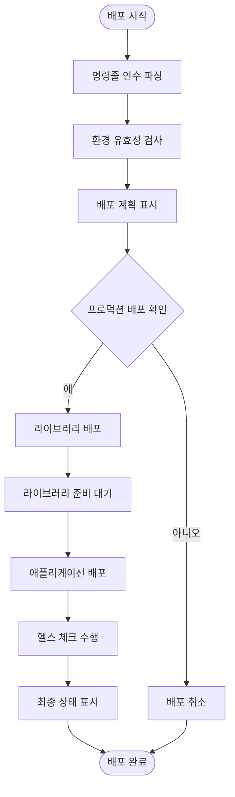
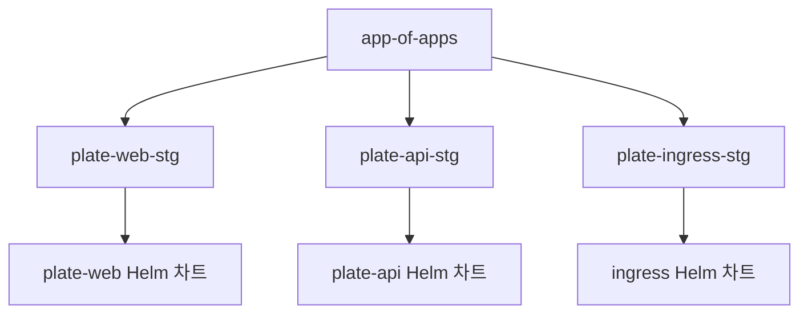
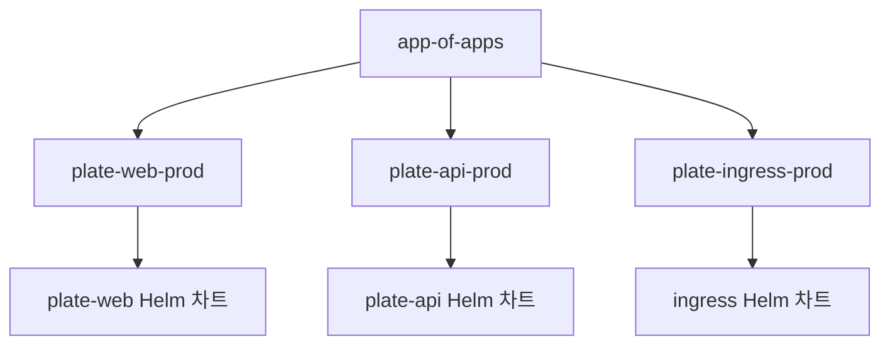
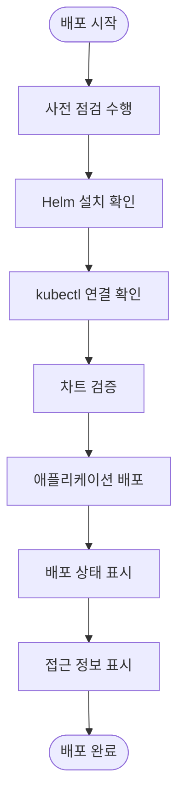
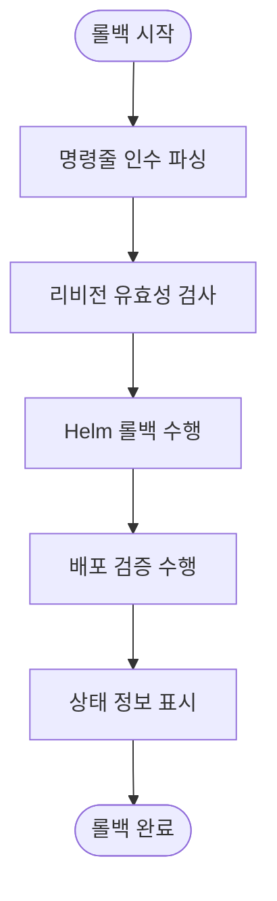
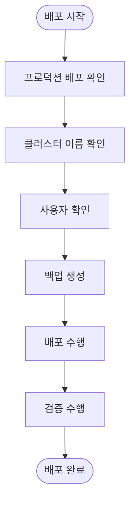

# 환경별 배포 통합

<cite>
**이 문서에서 참조한 파일**  
- [deploy-stg.sh](file://scripts/deploy-stg.sh)
- [deploy-prod.sh](file://scripts/deploy-prod.sh)
- [deploy-all.sh](file://scripts/deploy-all.sh)
- [app-of-apps.yaml](file://environments/argocd/app-of-apps.yaml)
- [plate-web-stg.yaml](file://environments/argocd/apps/plate-web-stg.yaml)
- [plate-web-prod.yaml](file://environments/argocd/apps/plate-web-prod.yaml)
- [plate-api-stg.yaml](file://environments/argocd/apps/plate-api-stg.yaml)
- [plate-api-prod.yaml](file://environments/argocd/apps/plate-api-prod.yaml)
- [ingress-stg.yaml](file://environments/argocd/apps/ingress-stg.yaml)
- [ingress-prod.yaml](file://environments/argocd/apps/ingress-prod.yaml)
- [values-stg.yaml](file://helm/applications/plate-web/values-stg.yaml)
- [values-prod.yaml](file://helm/applications/plate-web/values-prod.yaml)
- [values-stg.yaml](file://helm/applications/plate-server/values-stg.yaml)
- [values-prod.yaml](file://helm/applications/plate-server/values-prod.yaml)
- [values-stg.yaml](file://helm/ingress/values-stg.yaml)
- [values.yaml](file://helm/ingress/values.yaml)
</cite>

## 목차
1. [소개](#소개)
2. [스크립트 오케스트레이션 흐름](#스크립트-오케스트레이션-흐름)
3. [환경별 ArgoCD 애플리케이션 구성](#환경별-argocd-애플리케이션-구성)
4. [배포 전후 상태 확인 절차](#배포-전후-상태-확인-절차)
5. [롤백 기능 구현](#롤백-기능-구현)
6. [환경 간 구성 차이점](#환경-간-구성-차이점)
7. [보안 고려사항](#보안-고려사항)
8. [결론](#결론)

## 소개
이 문서는 `deploy-stg.sh` 및 `deploy-prod.sh` 스크립트가 ArgoCD를 통해 스테이징 및 프로덕션 환경에 애플리케이션을 배포하는 방식에 대해 설명합니다. 스크립트들은 `deploy-all.sh`에 의해 호출되며, 전체 배포 오케스트레이션의 핵심 구성 요소로 작동합니다. 각 환경별 ArgoCD 애플리케이션 구성 파일과의 연동 방식, 배포 전후 상태 확인 절차, 롤백 기능 구현에 대해 자세히 설명합니다.

## 스크립트 오케스트레이션 흐름
`deploy-all.sh` 스크립트는 전체 배포 프로세스를 오케스트레이션하며, 환경에 따라 `deploy-stg.sh` 또는 `deploy-prod.sh`를 호출합니다. 이 스크립트는 라이브러리 배포와 애플리케이션 배포를 통합하여 관리합니다.

**다이어그램 출처**  
- [deploy-all.sh](file://scripts/deploy-all.sh#L1-L279)

**섹션 출처**  
- [deploy-all.sh](file://scripts/deploy-all.sh#L1-L279)

## 환경별 ArgoCD 애플리케이션 구성
ArgoCD는 `environments/argocd/apps/` 디렉터리에 위치한 YAML 파일들을 통해 각 환경별 애플리케이션을 관리합니다. `app-of-apps.yaml` 파일은 모든 애플리케이션을 관리하는 메인 ArgoCD 애플리케이션으로, `environments/argocd/apps` 경로를 소스로 지정합니다.

### 스테이징 환경 구성
스테이징 환경은 `plate-web-stg.yaml` 및 `plate-api-stg.yaml` 파일을 통해 구성됩니다. 이 파일들은 각각 `helm/applications/plate-web` 및 `helm/applications/plate-server` 경로의 Helm 차트를 참조하며, `values-stg.yaml` 값을 사용합니다.

**다이어그램 출처**  
- [app-of-apps.yaml](file://environments/argocd/app-of-apps.yaml#L1-L35)
- [plate-web-stg.yaml](file://environments/argocd/apps/plate-web-stg.yaml#L1-L62)
- [plate-api-stg.yaml](file://environments/argocd/apps/plate-api-stg.yaml#L1-L62)
- [ingress-stg.yaml](file://environments/argocd/apps/ingress-stg.yaml#L1-L70)

**섹션 출처**  
- [app-of-apps.yaml](file://environments/argocd/app-of-apps.yaml#L1-L35)
- [plate-web-stg.yaml](file://environments/argocd/apps/plate-web-stg.yaml#L1-L62)
- [plate-api-stg.yaml](file://environments/argocd/apps/plate-api-stg.yaml#L1-L62)
- [ingress-stg.yaml](file://environments/argocd/apps/ingress-stg.yaml#L1-L70)

### 프로덕션 환경 구성
프로덕션 환경은 `plate-web-prod.yaml` 및 `plate-api-prod.yaml` 파일을 통해 구성됩니다. 이 파일들은 각각 `helm/applications/plate-web` 및 `helm/applications/plate-server` 경로의 Helm 차트를 참조하며, `values-prod.yaml` 값을 사용합니다.

**다이어그램 출처**  
- [app-of-apps.yaml](file://environments/argocd/app-of-apps.yaml#L1-L35)
- [plate-web-prod.yaml](file://environments/argocd/apps/plate-web-prod.yaml#L1-L62)
- [plate-api-prod.yaml](file://environments/argocd/apps/plate-api-prod.yaml#L1-L62)
- [ingress-prod.yaml](file://environments/argocd/apps/ingress-prod.yaml#L1-L81)

**섹션 출처**  
- [app-of-apps.yaml](file://environments/argocd/app-of-apps.yaml#L1-L35)
- [plate-web-prod.yaml](file://environments/argocd/apps/plate-web-prod.yaml#L1-L62)
- [plate-api-prod.yaml](file://environments/argocd/apps/plate-api-prod.yaml#L1-L62)
- [ingress-prod.yaml](file://environments/argocd/apps/ingress-prod.yaml#L1-L81)

## 배포 전후 상태 확인 절차
`deploy-stg.sh` 및 `deploy-prod.sh` 스크립트는 배포 전후에 다양한 상태 확인 절차를 수행합니다. 배포 전에는 Helm 및 kubectl 설치 여부를 확인하고, 차트를 검증합니다. 배포 후에는 Helm 상태, 파드, 서비스, 인그레스 등을 확인하여 배포 성공 여부를 검증합니다.

**다이어그램 출처**  
- [deploy-stg.sh](file://scripts/deploy-stg.sh#L1-L173)
- [deploy-prod.sh](file://scripts/deploy-prod.sh#L1-L299)

**섹션 출처**  
- [deploy-stg.sh](file://scripts/deploy-stg.sh#L1-L173)
- [deploy-prod.sh](file://scripts/deploy-prod.sh#L1-L299)

## 롤백 기능 구현
`deploy-prod.sh` 스크립트는 롤백 기능을 구현하고 있습니다. `rollback` 명령을 통해 이전 리비전으로 롤백할 수 있으며, `helm rollback` 명령을 사용합니다. 이 기능은 프로덕션 환경에서 발생할 수 있는 문제를 신속하게 해결할 수 있도록 도와줍니다.

**다이어그램 출처**  
- [deploy-prod.sh](file://scripts/deploy-prod.sh#L1-L299)

**섹션 출처**  
- [deploy-prod.sh](file://scripts/deploy-prod.sh#L1-L299)

## 환경 간 구성 차이점
스테이징과 프로덕션 환경은 다양한 구성 차이점을 가지고 있습니다. 이미지 태그, 풀 정책, 리소스 요청 및 제한, 인그레스 설정 등이 환경에 따라 다르게 구성되어 있습니다.

### 이미지 및 풀 정책
- **스테이징**: `tag: "latest"`, `pullPolicy: Always`
- **프로덕션**: `tag: "1.25"`, `pullPolicy: IfNotPresent`

### 리소스 요청 및 제한
- **스테이징**: CPU 요청 200m, 메모리 요청 256Mi
- **프로덕션**: CPU 요청 250m, 메모리 요청 256Mi

### 인그레스 설정
- **스테이징**: HTTP 허용, `ssl-redirect: "false"`
- **프로덕션**: HTTPS 리다이렉트, `ssl-redirect: "true"`

**섹션 출처**  
- [values-stg.yaml](file://helm/applications/plate-web/values-stg.yaml#L1-L23)
- [values-prod.yaml](file://helm/applications/plate-web/values-prod.yaml#L1-L39)
- [values-stg.yaml](file://helm/applications/plate-server/values-stg.yaml#L1-L19)
- [values-prod.yaml](file://helm/applications/plate-server/values-prod.yaml#L1-L22)
- [values-stg.yaml](file://helm/ingress/values-stg.yaml#L1-L59)
- [values.yaml](file://helm/ingress/values.yaml#L1-L49)

## 보안 고려사항
프로덕션 환경 배포 시에는 다양한 보안 고려사항이 적용됩니다. 클러스터 이름 확인, 사용자 확인, 백업 생성 등이 포함됩니다. 또한, `DRY_RUN` 환경 변수를 통해 실제 변경 없이 배포를 시뮬레이션할 수 있습니다.

**다이어그램 출처**  
- [deploy-prod.sh](file://scripts/deploy-prod.sh#L1-L299)

**섹션 출처**  
- [deploy-prod.sh](file://scripts/deploy-prod.sh#L1-L299)

## 결론
`deploy-stg.sh` 및 `deploy-prod.sh` 스크립트는 ArgoCD를 통해 스테이징 및 프로덕션 환경에 애플리케이션을 배포하는 핵심 도구입니다. `deploy-all.sh` 스크립트에 의해 오케스트레이션되며, 환경별 ArgoCD 애플리케이션 구성 파일과 연동됩니다. 배포 전후 상태 확인 절차와 롤백 기능이 구현되어 있으며, 환경 간 구성 차이점과 보안 고려사항이 적절히 반영되어 있습니다.