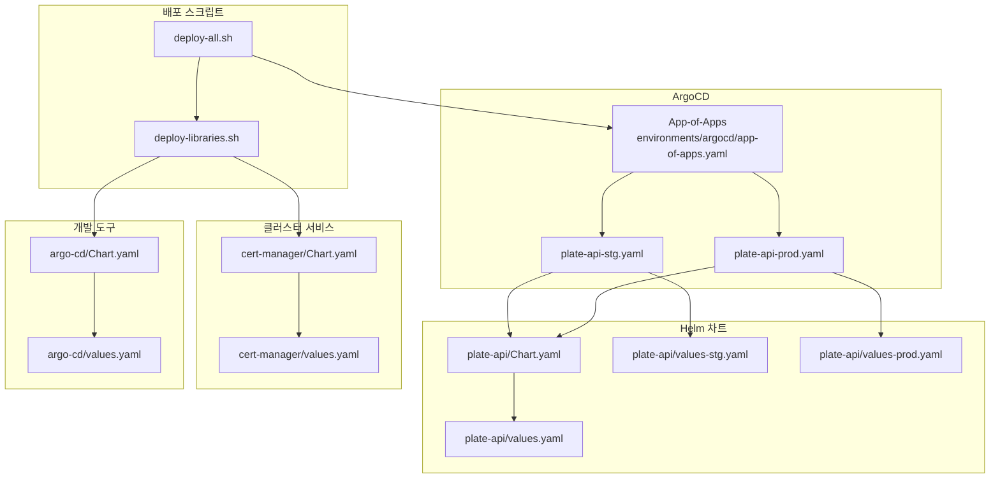
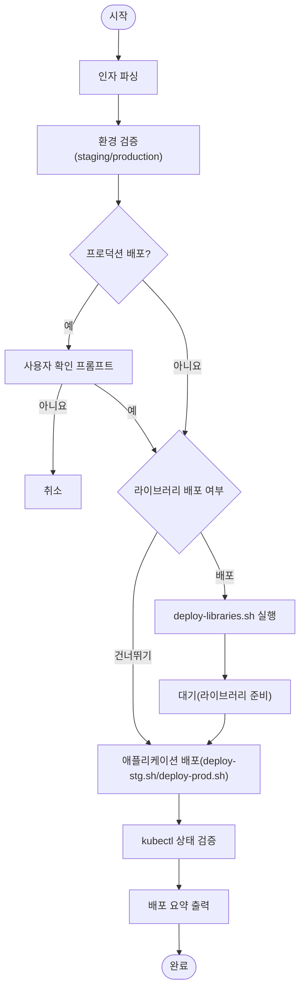
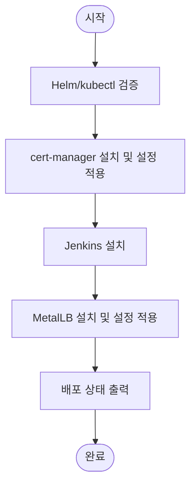
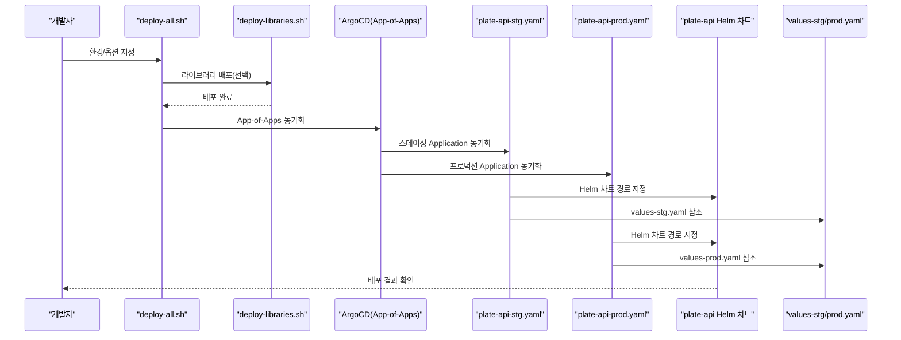

# 시스템 관계

<cite>
**문서에서 인용하는 파일**
- [README.md](file://README.md)
- [deploy-all.sh](file://scripts/deploy-all.sh)
- [deploy-libraries.sh](file://scripts/deploy-libraries.sh)
- [app-of-apps.yaml](file://environments/argocd/app-of-apps.yaml)
- [plate-api-stg.yaml](file://environments/argocd/apps/plate-api-stg.yaml)
- [plate-api-prod.yaml](file://environments/argocd/apps/plate-api-prod.yaml)
- [Chart.yaml (plate-api)](file://helm/applications/plate-server/Chart.yaml)
- [values-stg.yaml (plate-api)](file://helm/applications/plate-server/values-stg.yaml)
- [values-prod.yaml (plate-api)](file://helm/applications/plate-server/values-prod.yaml)
- [values.yaml (plate-api)](file://helm/applications/plate-server/values.yaml)
- [Chart.yaml (cert-manager)](file://helm/cluster-services/cert-manager/Chart.yaml)
- [values.yaml (cert-manager)](file://helm/cluster-services/cert-manager/values.yaml)
- [Chart.yaml (argo-cd)](file://helm/development-tools/argocd/Chart.yaml)
- [values.yaml (argo-cd)](file://helm/development-tools/argocd/values.yaml)
</cite>

## 목차
1. [소개](#소개)
2. [프로젝트 구조](#프로젝트-구조)
3. [핵심 구성 요소](#핵심-구성-요소)
4. [아키텍처 개요](#아키텍처-개요)
5. [상세 구성 요소 분석](#상세-구성-요소-분석)
6. [의존성 분석](#의존성-분석)
7. [성능 고려사항](#성능-고려사항)
8. [장애 대응 가이드](#장애-대응-가이드)
9. [결론](#결론)

## 소개
본 문서는 prj-devops 프로젝트의 주요 구성 요소들 간의 관계와 의존성을 분석하고, 배포 스크립트(deploy-all.sh, deploy-libraries.sh)가 ArgoCD를 통해 Helm 차트를 오케스트레이션하는 방식을 설명합니다. 또한 클러스터 서비스가 개발 도구의 기반이 되며, 개발 도구가 애플리케이션의 배포와 운영을 지원하는 계층적 의존 관계를 설명하고, ArgoCD Application CRD가 Helm 차트의 values.yaml 파일을 어떻게 참조하여 환경별 설정을 적용하는지 기술합니다.

## 프로젝트 구조
- 프로젝트는 세 가지 계층으로 구성됩니다:
  - 1계층: 클러스터 서비스 (cert-manager, MetalLB, NFS Provisioner)
  - 2계층: 개발 도구 (ArgoCD, Harbor, Jenkins, Prometheus, Grafana, Fluentd, OpenBao, Kubernetes Dashboard)
  - 3계층: 애플리케이션 (plate-web, plate-api, plate-llm, plate-cache)
- 배포는 Helm 차트를 기반으로 하며, ArgoCD를 통해 GitOps 방식으로 자동화됩니다.
- 환경별 설정은 각 Helm 차트의 values.yaml 또는 values-<env>.yaml 파일에 정의되어 있습니다.

**섹션 인용**
- file://README.md#L16-L110
- file://README.md#L286-L314

## 핵심 구성 요소
- 배포 스크립트
  - deploy-all.sh: 전체 배포 오케스트레이터. 라이브러리 배포 여부, 환경(스테이징/프로덕션), 드라이런(dry-run) 등을 제어합니다.
  - deploy-libraries.sh: 1계층 클러스터 서비스와 2계층 개발 도구를 순서대로 배포합니다.
- ArgoCD
  - App-of-Apps 패턴을 사용하여 모든 애플리케이션을 한 곳에서 관리합니다.
  - 각 Application CRD는 Helm 차트 경로와 환경별 values 파일을 지정하여 Git 변경 시 자동 동기화됩니다.
- Helm 차트
  - 1계층/2계층은 values.yaml로 설정 관리
  - 3계층 애플리케이션은 values-stg.yaml, values-prod.yaml로 환경별 설정 관리

**섹션 인용**
- file://scripts/deploy-all.sh#L1-L120
- file://scripts/deploy-libraries.sh#L1-L128
- file://environments/argocd/app-of-apps.yaml#L1-L35
- file://README.md#L175-L230

## 아키텍처 개요
다음 그림은 배포 스크립트, ArgoCD, Helm 차트, 그리고 환경별 values 파일 간의 상호작용을 보여줍니다.

**다이어그램 인용**
- [deploy-all.sh](file://scripts/deploy-all.sh#L1-L120)
- [deploy-libraries.sh](file://scripts/deploy-libraries.sh#L1-L128)
- [app-of-apps.yaml](file://environments/argocd/app-of-apps.yaml#L1-L35)
- [plate-api-stg.yaml](file://environments/argocd/apps/plate-api-stg.yaml#L1-L62)
- [plate-api-prod.yaml](file://environments/argocd/apps/plate-api-prod.yaml#L1-L62)
- [Chart.yaml (plate-api)](file://helm/applications/plate-server/Chart.yaml#L1-L16)
- [values-stg.yaml (plate-api)](file://helm/applications/plate-server/values-stg.yaml#L1-L30)
- [values-prod.yaml (plate-api)](file://helm/applications/plate-server/values-prod.yaml#L1-L31)
- [values.yaml (plate-api)](file://helm/applications/plate-server/values.yaml#L1-L116)
- [Chart.yaml (cert-manager)](file://helm/cluster-services/cert-manager/Chart.yaml#L1-L23)
- [values.yaml (cert-manager)](file://helm/cluster-services/cert-manager/values.yaml#L1-L35)
- [Chart.yaml (argo-cd)](file://helm/development-tools/argocd/Chart.yaml#L1-L32)
- [values.yaml (argo-cd)](file://helm/development-tools/argocd/values.yaml#L1-L120)

**섹션 인용**
- file://README.md#L356-L409

## 상세 구성 요소 분석

### 배포 스크립트: deploy-all.sh
- 기능
  - 환경(스테이징/프로덕션) 선택, 라이브러리 배포 여부, 드라이런(dry-run) 옵션 제어
  - 라이브러리 배포 후 애플리케이션 배포 순서 보장
  - 프로덕션 배포 시 사용자 확인 프롬프트
  - 배포 후 상태 검증(kubectl) 및 요약 출력
- 제어 흐름
  - 인자 파싱 → 환경 검증 → 라이브러리 배포(선택) → 애플리케이션 배포(선택) → 상태 검증 → 요약

**다이어그램 인용**
- [deploy-all.sh](file://scripts/deploy-all.sh#L1-L279)

**섹션 인용**
- file://scripts/deploy-all.sh#L1-L120
- file://scripts/deploy-all.sh#L120-L216
- file://scripts/deploy-all.sh#L216-L279

### 배포 스크립트: deploy-libraries.sh
- 기능
  - cert-manager, Jenkins, MetalLB 순서로 배포
  - cert-manager는 CRD 설치 후 values.yaml 기반 설정 적용
  - MetalLB는 저장소 추가 후 manifest 적용
- 제어 흐름
  - 사전 검증(Helm, kubectl) → cert-manager → Jenkins → MetalLB → 상태 출력

**다이어그램 인용**
- [deploy-libraries.sh](file://scripts/deploy-libraries.sh#L1-L128)

**섹션 인용**
- file://scripts/deploy-libraries.sh#L1-L128

### ArgoCD App-of-Apps: environments/argocd/app-of-apps.yaml
- 기능
  - environments/argocd/apps 디렉토리에 있는 모든 Application을 한 곳에서 관리
  - 자동 동기화, 네임스페이스 생성, 자동 복구 설정
- 구성
  - source.path: environments/argocd/apps
  - destination: argocd 네임스페이스에 배포

**섹션 인용**
- file://environments/argocd/app-of-apps.yaml#L1-L35

### ArgoCD Application: plate-api-stg.yaml
- 기능
  - plate-api Helm 차트를 스테이징 환경에 배포
  - valueFiles에 values-stg.yaml 지정
  - destination.namespace: plate-stg
  - syncPolicy.automated: prune, selfHeal, CreateNamespace=true
- 의존성
  - 미리 배포된 cert-manager가 필요(ingress tls, cluster-issuer 사용)

**섹션 인용**
- file://environments/argocd/apps/plate-api-stg.yaml#L1-L62

### ArgoCD Application: plate-api-prod.yaml
- 기능
  - plate-api Helm 차트를 프로덕션 환경에 배포
  - valueFiles에 values-prod.yaml 지정
  - destination.namespace: plate-prod
  - syncPolicy.retry: 보수적인 재시도 설정

**섹션 인용**
- file://environments/argocd/apps/plate-api-prod.yaml#L1-L62

### Helm 차트: plate-api
- Chart.yaml
  - 애플리케이션 차트로, plate-api 서버용 Helm 차트
- values-stg.yaml / values-prod.yaml
  - replicaCount, image, service, ingress, resources 등의 환경별 설정
- values.yaml
  - 기본 설정(예: nginx 프록시, backend 컨테이너, ingress tls, resources)

**섹션 인용**
- file://helm/applications/plate-server/Chart.yaml#L1-L16
- file://helm/applications/plate-server/values-stg.yaml#L1-L30
- file://helm/applications/plate-server/values-prod.yaml#L1-L31
- file://helm/applications/plate-server/values.yaml#L1-L116

### 클러스터 서비스: cert-manager
- Chart.yaml
  - cert-manager 의존성 포함
- values.yaml
  - production/staging ClusterIssuer 설정, http01 ingress class 지정

**섹션 인용**
- file://helm/cluster-services/cert-manager/Chart.yaml#L1-L23
- file://helm/cluster-services/cert-manager/values.yaml#L1-L35

### 개발 도구: argo-cd
- Chart.yaml
  - Argo CD Helm 차트
- values.yaml
  - global.domain, configs(cm/rbac/ssh/tls/repositories 등), clusterCredentials, extraObjects 등

**섹션 인용**
- file://helm/development-tools/argocd/Chart.yaml#L1-L32
- file://helm/development-tools/argocd/values.yaml#L1-L120

## 의존성 분석
- 계층적 의존 관계
  - 1계층(Cluster Services): cert-manager, MetalLB, NFS Provisioner
  - 2계층(Development Tools): ArgoCD, Harbor, Jenkins, Prometheus, Grafana, Fluentd, OpenBao, Kubernetes Dashboard
  - 3계층(Applications): plate-web, plate-api, plate-llm, plate-cache
- ArgoCD Application CRD가 Helm 차트의 values.yaml 파일을 참조하는 방식
  - 각 Application CRD의 source.helm.valueFiles에 환경별 values 파일 경로를 지정
  - 예: plate-api-stg.yaml에서는 values-stg.yaml, plate-api-prod.yaml에서는 values-prod.yaml
- 배포 스크립트가 ArgoCD를 통해 Helm 차트를 오케스트레이션
  - deploy-all.sh는 App-of-Apps를 통해 모든 Application을 관리
  - deploy-libraries.sh는 1계층/2계층을 먼저 배포하여 3계층이 의존하는 인프라를 확보

**다이어그램 인용**
- [deploy-all.sh](file://scripts/deploy-all.sh#L1-L279)
- [deploy-libraries.sh](file://scripts/deploy-libraries.sh#L1-L128)
- [app-of-apps.yaml](file://environments/argocd/app-of-apps.yaml#L1-L35)
- [plate-api-stg.yaml](file://environments/argocd/apps/plate-api-stg.yaml#L1-L62)
- [plate-api-prod.yaml](file://environments/argocd/apps/plate-api-prod.yaml#L1-L62)
- [values-stg.yaml (plate-api)](file://helm/applications/plate-server/values-stg.yaml#L1-L30)
- [values-prod.yaml (plate-api)](file://helm/applications/plate-server/values-prod.yaml#L1-L31)

**섹션 인용**
- file://README.md#L356-L409

## 성능 고려사항
- ArgoCD 동기화 최적화
  - App-of-Apps 패턴을 통한 집중 관리
  - syncOptions.ApplyOutOfSyncOnly=true로 변경된 리소스만 적용
- Helm 렌더링 성능
  - values.yaml/ values-<env>.yaml을 사용한 선언적 설정으로 렌더링 최적화
- 배포 순서
  - deploy-all.sh에서 라이브러리 배포 후 대기 시간을 두어 의존 리소스 준비 보장

**섹션 인용**
- file://environments/argocd/apps/plate-api-stg.yaml#L38-L42
- file://scripts/deploy-all.sh#L243-L261

## 장애 대응 가이드
- cert-manager 문제
  - cert-manager Pod 로그 확인, Certificate/Order/Challenge 리소스 상태 점검
- Ingress 문제
  - DNS A/CNAME 레코드 확인, Ingress Controller LB IP 매칭 여부 점검
- Pod 문제
  - 리소스 부족(OOMKilled/CrashLoopBackOff), 이미지 Pull 오류 확인
- 배포 검증
  - kubectl get pods -n <namespace>로 상태 확인
  - kubectl get ingress -A, kubectl get certificates -A로 리소스 상태 점검

**섹션 인용**
- file://README.md#L335-L355

## 결론
- prj-devops는 계층적 구조를 통해 클러스터 서비스 → 개발 도구 → 애플리케이션의 명확한 의존성을 구현합니다.
- deploy-all.sh과 deploy-libraries.sh는 GitOps 기반 ArgoCD를 통해 Helm 차트를 자동 배포하고, 환경별 values.yaml을 통해 설정을 효과적으로 관리합니다.
- App-of-Apps 패턴을 활용함으로써 모든 애플리케이션을 한 곳에서 통합 관리하고, 자동 동기화, 자동 복구, 네임스페이스 생성 등의 기능을 통해 운영 효율성을 높였습니다.