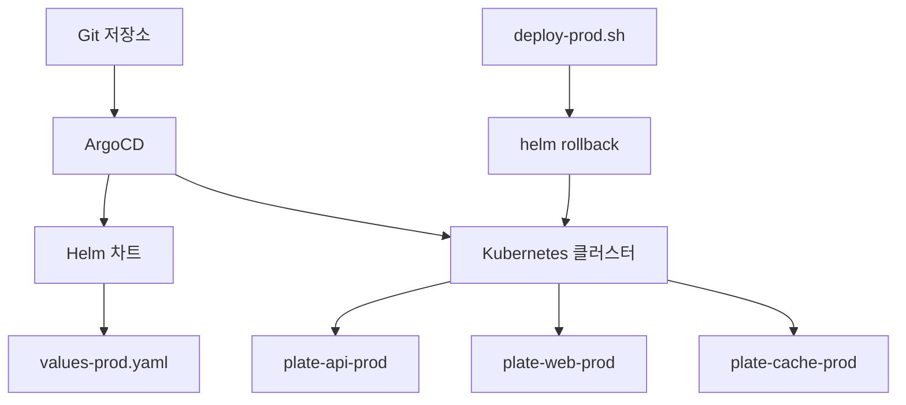
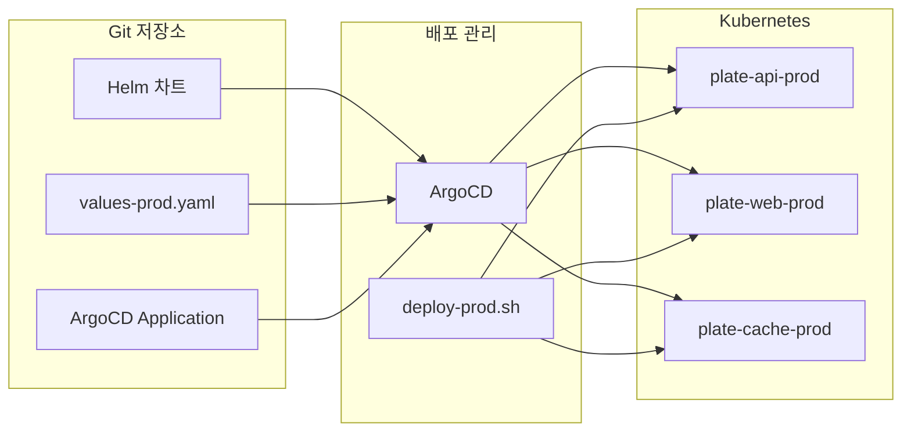
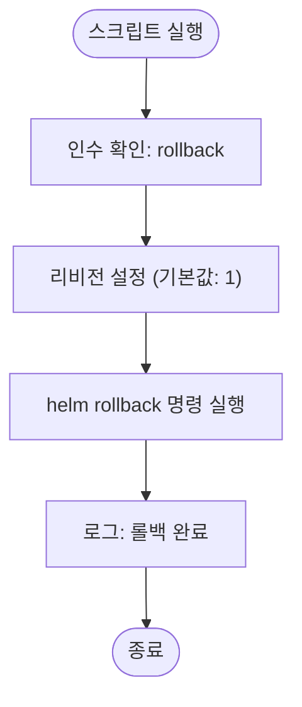
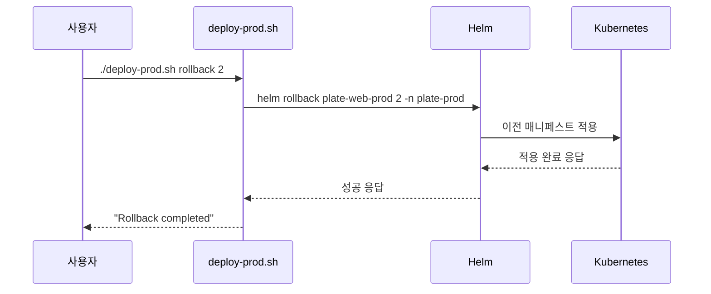
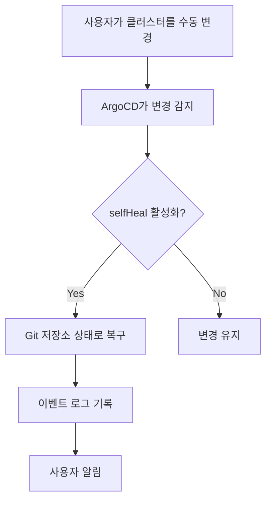
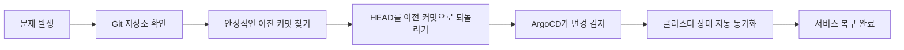
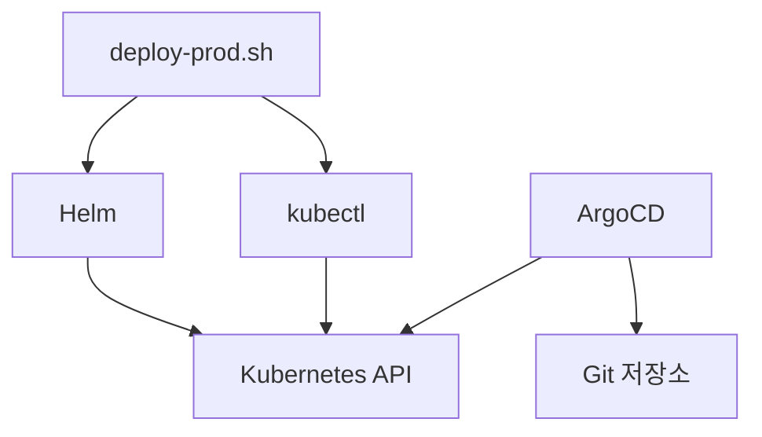

# 배포 롤백 절차

<cite>
**이 문서에서 참조한 파일**  
- [deploy-prod.sh](file://scripts/deploy-prod.sh)
- [plate-api-prod.yaml](file://environments/argocd/apps/plate-api-prod.yaml)
- [plate-web-prod.yaml](file://environments/argocd/apps/plate-web-prod.yaml)
- [plate-cache-prod.yaml](file://environments/argocd/apps/plate-cache-prod.yaml)
- [ingress-prod.yaml](file://environments/argocd/apps/ingress-prod.yaml)
- [values-prod.yaml](file://helm/applications/plate-api/values-prod.yaml)
- [values-prod.yaml](file://helm/applications/plate-web/values-prod.yaml)
- [values-prod.yaml](file://helm/applications/plate-cache/values-prod.yaml)
</cite>

## 목차
1. [소개](#소개)
2. [프로젝트 구조](#프로젝트-구조)
3. [핵심 구성 요소](#핵심-구성-요소)
4. [아키텍처 개요](#아키텍처-개요)
5. [상세 구성 요소 분석](#상세-구성-요소-분석)
6. [의존성 분석](#의존성-분석)
7. [성능 고려사항](#성능-고려사항)
8. [문제 해결 가이드](#문제-해결-가이드)
9. [결론](#결론)
10. [부록](#부록) (필요 시)

## 소개
이 문서는 프로덕션 환경에서 배포 후 문제가 발생했을 때 안정적으로 이전 상태로 되돌리는 절차를 설명합니다. `deploy-prod.sh rollback` 명령어의 작동 원리, ArgoCD의 자동 롤백 기능, Helm 릴리스 롤백(`helm rollback`), Git 커밋 기반 롤백 전략 등을 포함합니다. 실수로 인한 구성 변경이나 애플리케이션 장애 발생 시 신속하게 서비스를 복구할 수 있는 절차를 단계별로 안내하며, 각 단계에서 확인해야 할 상태와 로그를 함께 제시합니다.

## 프로젝트 구조
이 프로젝트는 GitOps 기반의 Kubernetes 환경을 중심으로 구성되어 있으며, Helm을 통한 애플리케이션 배포와 ArgoCD를 통한 선언적 동기화를 사용합니다. 주요 구성 요소는 다음과 같습니다:

- **environments/argocd/**: ArgoCD Application 리소스 정의
- **helm/**: Helm 차트 및 환경별 values 파일
- **scripts/**: 수동 배포 및 롤백 스크립트 포함

**도표 출처**  
- [deploy-prod.sh](file://scripts/deploy-prod.sh#L277-L282)
- [plate-api-prod.yaml](file://environments/argocd/apps/plate-api-prod.yaml)
- [plate-web-prod.yaml](file://environments/argocd/apps/plate-web-prod.yaml)

**섹션 출처**  
- [scripts/deploy-prod.sh](file://scripts/deploy-prod.sh)
- [environments/argocd/](file://environments/argocd/)
- [helm/](file://helm/)

## 핵심 구성 요소
이 시스템의 핵심 롤백 메커니즘은 세 가지로 구성됩니다:

1. **스크립트 기반 수동 롤백**: `deploy-prod.sh rollback` 명령어를 통한 즉시 롤백
2. **Helm 기반 롤백**: `helm rollback` 명령어를 사용한 릴리스 복원
3. **ArgoCD 기반 GitOps 롤백**: Git 커밋으로 상태를 되돌려 자동 동기화

이러한 계층적 접근은 다양한 장애 상황에 유연하게 대응할 수 있도록 설계되었습니다.

**섹션 출처**  
- [deploy-prod.sh](file://scripts/deploy-prod.sh#L277-L282)
- [plate-api-prod.yaml](file://environments/argocd/apps/plate-api-prod.yaml#L31-L61)
- [plate-web-prod.yaml](file://environments/argocd/apps/plate-web-prod.yaml#L31-L61)

## 아키텍처 개요
전체 배포 및 롤백 아키텍처는 GitOps 원칙을 기반으로 하며, ArgoCD가 Git 저장소의 상태를 지속적으로 모니터링하고 클러스터 상태를 동기화합니다. 수동 배포가 필요한 경우 `deploy-prod.sh` 스크립트를 사용하며, 이 스크립트는 Helm을 통해 배포 및 롤백을 수행합니다.

**도표 출처**  
- [deploy-prod.sh](file://scripts/deploy-prod.sh)
- [environments/argocd/apps/plate-api-prod.yaml)
- [environments/argocd/apps/plate-web-prod.yaml)
- [environments/argocd/apps/plate-cache-prod.yaml)

## 상세 구성 요소 분석

### 수동 롤백 스크립트 분석
`deploy-prod.sh` 스크립트는 프로덕션 환경에 대한 안전한 배포 및 롤백을 제공합니다. 롤백 기능은 명령줄 인수를 통해 호출되며, 기본적으로 가장 최근의 이전 릴리스(리비전 1)로 되돌립니다.

#### 스크립트 기반 롤백 흐름

**도표 출처**  
- [deploy-prod.sh](file://scripts/deploy-prod.sh#L277-L282)

#### Helm 롤백 메커니즘
Helm은 각 릴리스의 이력을 저장하며, `helm rollback` 명령어를 통해 이전 리비전으로 상태를 복원합니다. 이 과정에서 Helm은 저장된 릴리스 매니페스트를 기반으로 Kubernetes 리소스를 재적용합니다.

**도표 출처**  
- [deploy-prod.sh](file://scripts/deploy-prod.sh#L280)
- [values-prod.yaml](file://helm/applications/plate-web/values-prod.yaml)

**섹션 출처**  
- [deploy-prod.sh](file://scripts/deploy-prod.sh#L277-L282)
- [values-prod.yaml](file://helm/applications/plate-web/values-prod.yaml)

### ArgoCD 기반 자동 롤백
ArgoCD는 Git 저장소의 상태를 소스 오브 트루스로 간주하며, `selfHeal: true` 설정을 통해 클러스터 내 수동 변경을 자동으로 복구합니다. 이 기능은 실수로 인한 변경을 신속하게 되돌리는 데 매우 효과적입니다.

#### ArgoCD 자동 복구 흐름

**도표 출처**  
- [plate-api-prod.yaml](file://environments/argocd/apps/plate-api-prod.yaml#L36)
- [plate-web-prod.yaml](file://environments/argocd/apps/plate-web-prod.yaml#L36)

**섹션 출처**  
- [plate-api-prod.yaml](file://environments/argocd/apps/plate-api-prod.yaml#L31-L61)
- [plate-web-prod.yaml](file://environments/argocd/apps/plate-web-prod.yaml#L31-L61)

### Git 기반 롤백 전략
Git 커밋을 기반으로 한 롤백은 가장 근본적인 복구 방법입니다. 이 방식은 Git 저장소에서 이전의 안정적인 커밋으로 되돌린 후 ArgoCD가 자동으로 해당 상태를 클러스터에 적용하도록 합니다.

#### Git 기반 롤백 절차

**도표 출처**  
- [plate-api-prod.yaml](file://environments/argocd/apps/plate-api-prod.yaml#L20)
- [plate-web-prod.yaml](file://environments/argocd/apps/plate-web-prod.yaml#L20)

**섹션 출처**  
- [plate-api-prod.yaml](file://environments/argocd/apps/plate-api-prod.yaml)
- [plate-web-prod.yaml](file://environments/argocd/apps/plate-web-prod.yaml)

## 의존성 분석
이 롤백 시스템은 여러 핵심 도구와의 긴밀한 통합을 통해 작동합니다. 주요 의존성은 다음과 같습니다:

각 구성 요소는 명확한 책임을 가지며, 스크립트는 Helm과 kubectl을 오케스트레이션하고, ArgoCD는 Git과 Kubernetes 사이의 상태 동기화를 담당합니다.

**도표 출처**  
- [deploy-prod.sh](file://scripts/deploy-prod.sh#L70-L86)
- [plate-api-prod.yaml](file://environments/argocd/apps/plate-api-prod.yaml#L28)

**섹션 출처**  
- [deploy-prod.sh](file://scripts/deploy-prod.sh)
- [environments/argocd/apps/plate-api-prod.yaml)

## 성능 고려사항
롤백 작업은 서비스 복구 시간(RTO)에 직접적인 영향을 미치므로, 가능한 한 빠르게 수행되어야 합니다. Helm 롤백은 일반적으로 30초 이내에 완료되며, ArgoCD의 폴링 주기(기본 3분)보다 훨씬 빠릅니다. 따라서 긴급한 상황에서는 `deploy-prod.sh rollback` 명령어를 우선적으로 사용하는 것이 권장됩니다.

## 문제 해결 가이드
롤백 과정에서 발생할 수 있는 주요 문제와 해결 방법은 다음과 같습니다:

**섹션 출처**  
- [deploy-prod.sh](file://scripts/deploy-prod.sh#L118-L137)
- [deploy-prod.sh](file://scripts/deploy-prod.sh#L176-L190)

### 롤백 실패 시 확인 사항
1. **네임스페이스 존재 여부**: 대상 네임스페이스가 존재하는지 확인
2. **릴리스 이름 정확성**: 롤백할 릴리스 이름이 정확한지 확인
3. **리비전 번호 유효성**: 요청한 리비전 번호가 존재하는지 확인 (`helm history` 명령어 사용)
4. **클러스터 연결 상태**: kubectl을 통해 클러스터에 정상적으로 연결되어 있는지 확인

### 백업 전략
`deploy-prod.sh` 스크립트는 롤백 전에 현재 상태를 백업합니다. 백업은 `./backups/` 디렉터리에 타임스탬프 기반으로 저장되며, Helm의 `get values` 및 `get manifest` 명령어를 사용하여 구성과 매니페스트를 저장합니다.

**섹션 출처**  
- [deploy-prod.sh](file://scripts/deploy-prod.sh#L118-L137)

## 결론
이 문서는 프로덕션 환경에서의 안정적인 롤백 절차를 다루었습니다. 세 가지 핵심 전략인 스크립트 기반 수동 롤백, Helm 기반 릴리스 롤백, Git 기반 상태 롤백을 통해 다양한 장애 상황에 대응할 수 있습니다. 운영 환경에서는 이들 전략을 적절히 조합하여 신속하고 안정적인 서비스 복구를 수행해야 합니다.

## 부록
### 명령어 참조
- **수동 롤백 실행**: `./scripts/deploy-prod.sh rollback [리비전 번호]`
- **릴리스 히스토리 확인**: `helm history <릴리스 이름> -n <네임스페이스>`
- **현재 상태 확인**: `./scripts/deploy-prod.sh status`