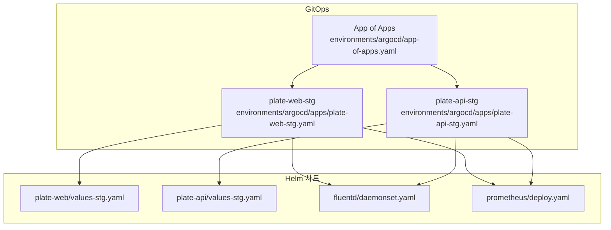
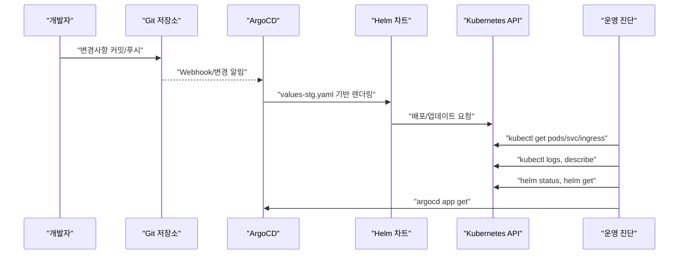
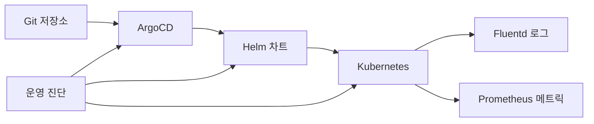

# 진단 및 점검 명령어

<cite>
**문서에 참조된 파일**
- [README.md](file://README.md)
- [deploy-stg.sh](file://scripts/deploy-stg.sh)
- [deploy-prod.sh](file://scripts/deploy-prod.sh)
- [app-of-apps.yaml](file://environments/argocd/app-of-apps.yaml)
- [plate-web-stg.yaml](file://environments/argocd/apps/plate-web-stg.yaml)
- [plate-api-stg.yaml](file://environments/argocd/apps/plate-api-stg.yaml)
- [daemonset.yaml](file://helm/development-tools/fluentd/templates/daemonset.yaml)
- [NOTES.txt](file://helm/development-tools/fluentd/templates/NOTES.txt)
- [deploy.yaml](file://helm/development-tools/prometheus/templates/deploy.yaml)
- [README.md](file://helm/development-tools/prometheus/README.md)
- [values-stg.yaml (plate-web)](file://helm/applications/plate-web/values-stg.yaml)
- [values-stg.yaml (plate-api)](file://helm/applications/plate-api/values-stg.yaml)
</cite>

## 목차
1. [소개](#소개)
2. [프로젝트 구조](#프로젝트-구조)
3. [핵심 컴포넌트](#핵심-컴포넌트)
4. [아키텍처 개요](#아키텍처-개요)
5. [상세 컴포넌트 분석](#상세-컴포넌트-분석)
6. [의존성 분석](#의존성-분석)
7. [성능 고려사항](#성능-고려사항)
8. [장애 진단 가이드](#장애-진단-가이드)
9. [결론](#결론)

## 소개
이 섹션은 Kubernetes 클러스터 상태를 진단하고 문제를 식별하기 위한 핵심 명령어들을 정리합니다. 실제 운영 환경에서 유용한 CLI 명령어를 중심으로, 각 명령어의 사용 목적, 예제 출력 방향, 결과 해석 방법, 그리고 연관된 의존성 파일 위치를 함께 설명합니다. 이 문서는 GitOps 기반 배포 구조(예: ArgoCD)와 Helm 차트 기반 모니터링/로깅 스택(예: Prometheus, Fluentd)을 기준으로 구성되었습니다.

## 프로젝트 구조
- GitOps 배포: ArgoCD App-of-Apps 패턴을 통해 스테이징/프로덕션 환경에 대한 애플리케이션을 선언적으로 관리합니다.
- Helm 차트: 클러스터 서비스, 개발 도구, 애플리케이션 세 가지 계층으로 구성되며, 각 차트는 values 파일을 통해 환경별 설정을 관리합니다.
- 진단 명령어: kubectl, helm, argocd 명령어를 중심으로 클러스터 상태, 배포 상태, 로그 수집, 메트릭 접근 등을 점검합니다.

**도표 출처**
- [app-of-apps.yaml](file://environments/argocd/app-of-apps.yaml#L1-L35)
- [plate-web-stg.yaml](file://environments/argocd/apps/plate-web-stg.yaml#L1-L62)
- [plate-api-stg.yaml](file://environments/argocd/apps/plate-api-stg.yaml#L1-L62)
- [values-stg.yaml (plate-web)](file://helm/applications/plate-web/values-stg.yaml#L1-L38)
- [values-stg.yaml (plate-api)](file://helm/applications/plate-api/values-stg.yaml#L1-L30)
- [daemonset.yaml](file://helm/development-tools/fluentd/templates/daemonset.yaml#L1-L41)
- [deploy.yaml](file://helm/development-tools/prometheus/templates/deploy.yaml#L1-L487)

**섹션 출처**
- [README.md](file://README.md#L1-L120)

## 핵심 컴포넌트
- ArgoCD App-of-Apps: 모든 환경의 애플리케이션을 한 곳에서 관리하며, 자동 동기화 및 self-heal 기능을 통해 Git 기준 상태를 유지합니다.
- Helm 차트: 스테이징/프로덕션 환경별 values 파일을 통해 배포 설정을 관리하고, kubectl/helm 명령어로 상태를 점검합니다.
- 로깅/모니터링: Fluentd(DaemonSet)와 Prometheus(서버/추가 컴포넌트)를 통해 로그 수집 및 메트릭 수집이 가능합니다.

**섹션 출처**
- [app-of-apps.yaml](file://environments/argocd/app-of-apps.yaml#L1-L35)
- [plate-web-stg.yaml](file://environments/argocd/apps/plate-web-stg.yaml#L1-L62)
- [plate-api-stg.yaml](file://environments/argocd/apps/plate-api-stg.yaml#L1-L62)
- [daemonset.yaml](file://helm/development-tools/fluentd/templates/daemonset.yaml#L1-L41)
- [deploy.yaml](file://helm/development-tools/prometheus/templates/deploy.yaml#L1-L487)

## 아키텍처 개요
다음은 GitOps 기반 배포와 진단 명령어 흐름을 나타낸 개념도입니다. ArgoCD가 Git 변경을 감지하고 Helm 차트를 통해 Kubernetes에 배포하며, 진단 명령어는 이를 검증하고 문제를 파악하는 데 사용됩니다.

[이 다이어그램은 개념적 흐름을 보여주므로, 특정 파일 매핑은 없습니다.]

## 상세 컴포넌트 분석

### 1) Kubernetes 클러스터 상태 확인 (kubectl)
- 목적: 현재 클러스터 연결 상태, 노드 상태, 네임스페이스 존재 여부를 확인합니다.
- 권장 명령어
  - kubectl cluster-info: 클러스터 API 연결 상태 확인
  - kubectl get nodes: 노드 상태/사용률 확인
  - kubectl get ns: 네임스페이스 목록 확인
- 결과 해석
  - 연결 실패: 클러스터에 접근 불가 → kubeconfig 확인
  - 노드 NotReady: 노드 문제 → 노드 로그/데몬셋 점검
  - 네임스페이스 없음: 배포 전에 네임스페이스 생성 필요
- 연관 파일
  - 스크립트에서 kubectl 연결 상태 확인 로직: [deploy-stg.sh](file://scripts/deploy-stg.sh#L47-L53), [deploy-prod.sh](file://scripts/deploy-prod.sh#L77-L95)

**섹션 출처**
- [deploy-stg.sh](file://scripts/deploy-stg.sh#L47-L53)
- [deploy-prod.sh](file://scripts/deploy-prod.sh#L77-L95)

### 2) ArgoCD 동기화 상태 점검 (argocd app get)
- 목적: Git 기준 상태와 실제 클러스터 상태가 일치하는지 확인하고, 동기화 실패 시 원인 파악
- 권장 명령어
  - argocd app get <app-name>: 애플리케이션 동기화 상태, 마지막 동기화 시각, 에러 메시지 확인
  - argocd app sync <app-name>: 수동 동기화 트리거
- 결과 해석
  - Synced: Git과 클러스터 상태 일치
  - OutOfSync: 차이 발생 → diff 확인 후 수동/자동 동기화
  - Healthy/Progressing: 상태 표시 → 문제가 있을 경우 describe로 상세 확인
- 연관 파일
  - App-of-Apps 설정: [app-of-apps.yaml](file://environments/argocd/app-of-apps.yaml#L1-L35)
  - 개별 애플리케이션 정의 (예: plate-web-stg): [plate-web-stg.yaml](file://environments/argocd/apps/plate-web-stg.yaml#L1-L62)
  - 개별 애플리케이션 정의 (예: plate-api-stg): [plate-api-stg.yaml](file://environments/argocd/apps/plate-api-stg.yaml#L1-L62)

**섹션 출처**
- [app-of-apps.yaml](file://environments/argocd/app-of-apps.yaml#L1-L35)
- [plate-web-stg.yaml](file://environments/argocd/apps/plate-web-stg.yaml#L1-L62)
- [plate-api-stg.yaml](file://environments/argocd/apps/plate-api-stg.yaml#L1-L62)

### 3) Helm 릴리스 상태 확인 (helm status, helm get)
- 목적: Helm 릴리스의 현재 상태, 최근 변경 이력, 매니페스트/값을 확인합니다.
- 권장 명령어
  - helm status <release> -n <namespace>: 릴리스 상태, 버전, 조건
  - helm get manifest <release> -n <namespace>: 렌더링된 매니페스트
  - helm get values <release> -n <namespace>: 적용된 values
- 결과 해석
  - DEPLOYED: 정상 배포
  - FAILED/UNINSTALLED: 실패 또는 삭제됨 → 롤백 또는 재배포 필요
- 연관 파일
  - 스크립트에서 helm status 사용 예시: [deploy-stg.sh](file://scripts/deploy-stg.sh#L96-L103), [deploy-prod.sh](file://scripts/deploy-prod.sh#L197-L218)

**섹션 출처**
- [deploy-stg.sh](file://scripts/deploy-stg.sh#L96-L103)
- [deploy-prod.sh](file://scripts/deploy-prod.sh#L197-L218)

### 4) 로그 수집 (kubectl logs, Fluentd)
- 목적: Pod 로그를 확인하여 애플리케이션/네트워크/인증서 문제를 진단합니다.
- 권장 명령어
  - kubectl logs <pod> -n <namespace> -c <container>: 특정 컨테이너 로그 확인
  - kubectl logs -l app.kubernetes.io/name=<app> -n <namespace>: 라벨 기반 로그 집합 확인
  - kubectl describe pod <pod> -n <namespace>: 이벤트/상태/리소스 제약 확인
- 결과 해석
  - CrashLoopBackOff/OOMKilled: 리소스 부족/실행 오류 → values/resources 조정
  - 인증서/네트워크 오류: cert-manager/Ingress 문제 → cert/ingress 리소스 확인
- 연관 파일
  - Fluentd DaemonSet: [daemonset.yaml](file://helm/development-tools/fluentd/templates/daemonset.yaml#L1-L41)
  - Fluentd 사용법 안내: [NOTES.txt](file://helm/development-tools/fluentd/templates/NOTES.txt#L1-L6)
  - README에서 로그 확인 예시: [README.md](file://README.md#L346-L355)

**섹션 출처**
- [daemonset.yaml](file://helm/development-tools/fluentd/templates/daemonset.yaml#L1-L41)
- [NOTES.txt](file://helm/development-tools/fluentd/templates/NOTES.txt#L1-L6)
- [README.md](file://README.md#L346-L355)

### 5) 메트릭 서버 접근 (Prometheus)
- 목적: Prometheus를 통한 시스템/애플리케이션 메트릭 확인 및 경고 확인
- 권장 명령어
  - Prometheus 서버 접근: Ingress/Service를 통해 Prometheus UI에 접속
  - 쿼리: Prometheus 쿼리 UI에서 메트릭 조회 (예: kube_pod_status_phase, up)
  - Prometheus 서버 매니페스트: [deploy.yaml](file://helm/development-tools/prometheus/templates/deploy.yaml#L1-L487)
- 결과 해석
  - 쿼리 결과 없음: 스크랩 대상 없음 → Pod/ServiceMonitor/Annotations 확인
  - Alert 발생: Alertmanager 확인 → 알림 규칙/연결 상태 점검
- 연관 파일
  - Prometheus 차트 README: [README.md](file://helm/development-tools/prometheus/README.md#L1-L393)

**섹션 출처**
- [deploy.yaml](file://helm/development-tools/prometheus/templates/deploy.yaml#L1-L487)
- [README.md](file://helm/development-tools/prometheus/README.md#L1-L393)

### 6) Harbor 로그인 테스트
- 목적: Harbor 레지스트리에 대한 인증/접속 테스트를 통해 이미지 풀링 문제 진단
- 권장 명령어
  - Harbor 접속: Ingress/Service를 통해 Harbor UI에 접속
  - CLI 테스트: docker/helm/ctr 등으로 Harbor에 로그인/이미지 풀/푸시 테스트
  - 인증서 문제: cert-manager/Ingress TLS 설정 확인
- 결과 해석
  - 인증 실패: Harbor 계정/암호/토큰 확인
  - 네트워크 오류: LB IP/DNS 레코드 확인
- 연관 파일
  - Harbor 차트 README: [README.md](file://helm/development-tools/harbor/README.md#L1-L251)

**섹션 출처**
- [README.md](file://helm/development-tools/harbor/README.md#L1-L251)

### 7) 배포 상태 점검 (kubectl get pods, kubectl describe)
- 목적: 배포 후 Pod 상태, 리소스 제약, 이벤트를 통해 문제 파악
- 권장 명령어
  - kubectl get pods -n <namespace> -o wide: Pod 상태/노드/IP 확인
  - kubectl describe pod <pod> -n <namespace>: 이벤트/상태/리소스 제약/볼륨/노드 톨레리션 확인
  - kubectl get svc/ingress/hpa -n <namespace>: 서비스/Ingress/HPA 상태 확인
- 결과 해석
  - Pending/ContainerCreating: 이미지 풀/볼륨/리소스 제약 문제
  - CrashLoopBackOff: 애플리케이션 오류 → 로그/설정 확인
  - 429/5xx: Ingress/서비스 문제 → TLS/인증서/백엔드 상태 확인
- 연관 파일
  - 스크립트에서 배포 상태 확인 로직: [deploy-stg.sh](file://scripts/deploy-stg.sh#L92-L113), [deploy-prod.sh](file://scripts/deploy-prod.sh#L192-L218)

**섹션 출처**
- [deploy-stg.sh](file://scripts/deploy-stg.sh#L92-L113)
- [deploy-prod.sh](file://scripts/deploy-prod.sh#L192-L218)

### 8) 환경별 설정 확인 (values-stg.yaml)
- 목적: 스테이징 환경의 배포 설정(예: 이미지, 리소스, 서비스 타입)을 확인하여 문제 원인 파악
- 권장 확인 사항
  - plate-web(values-stg.yaml): 이미지, 리소스, Ingress 여부
  - plate-api(values-stg.yaml): 이미지, 서비스 타입(LoadBalancer), 리소스
- 결과 해석
  - LoadBalancer 미설정 → 외부 접근 불가
  - 리소스 부족 → Pod Pending/Crash
- 연관 파일
  - [values-stg.yaml (plate-web)](file://helm/applications/plate-web/values-stg.yaml#L1-L38)
  - [values-stg.yaml (plate-api)](file://helm/applications/plate-api/values-stg.yaml#L1-L30)

**섹션 출처**
- [values-stg.yaml (plate-web)](file://helm/applications/plate-web/values-stg.yaml#L1-L38)
- [values-stg.yaml (plate-api)](file://helm/applications/plate-api/values-stg.yaml#L1-L30)

## 의존성 분석
- GitOps → Helm → Kubernetes: ArgoCD가 Git 변경을 감지하고 Helm 차트를 통해 Kubernetes에 배포합니다.
- 로깅/모니터링 → 애플리케이션: Fluentd는 Pod 로그를 수집하고 Prometheus는 Pod/서비스 메트릭을 수집합니다.
- 진단 명령어 → 리소스: kubectl/helm/argocd 명령어를 통해 각 리소스 상태를 검증합니다.

[이 다이어그램은 개념적 의존성을 보여주므로, 특정 파일 매핑은 없습니다.]

## 성능 고려사항
- ArgoCD 동기화 최적화: App-of-Apps 패턴과 syncOptions.ApplyOutOfSyncOnly를 사용하여 불필요한 리소스 적용을 줄입니다.
- 로깅/모니터링 리소스: Fluentd/Prometheus는 리소스를 점유하므로, 스테이징 환경에서는 간소화된 설정(values-stg.yaml)을 사용합니다.
- 배포 검증: 스크립트에서 helm template/validate를 통해 배포 전 검증을 수행하고, 프로덕션에서는 atomic/backup/health check을 통해 안정성을 확보합니다.

[이 섹션은 일반적인 성능 가이드를 제공하므로, 특정 파일 분석은 없습니다.]

## 장애 진단 가이드
- 인증서 문제: cert-manager Pod 로그 확인, Certificate/Order/Challenge 리소스 상태 점검
- Ingress 문제: DNS 레코드 → LB IP 매칭 여부 확인
- Pod 문제: 리소스 부족(OOMKilled/CrashLoopBackOff)/이미지 풀 오류 확인
- 로그/메트릭 확인: Fluentd/Prometheus 설정 확인 후 kubectl logs/argocd/helm 명령어로 검증

**섹션 출처**
- [README.md](file://README.md#L336-L355)

## 결론
이 문서는 GitOps 기반 배포 환경에서 Kubernetes 클러스터 상태를 진단하고 문제를 식별하기 위한 핵심 명령어를 정리했습니다. ArgoCD 동기화 상태, Helm 릴리스 상태, 로그/메트릭 수집, Harbor 인증 테스트 등을 중심으로 각 명령어의 목적과 결과 해석 방법을 설명했습니다. 실제 운영 환경에서는 스크립트와 Helm values를 기반으로 검증 절차를 따르고, 문제 발생 시 연관된 의존성 파일을 참고하여 원인 파악을 진행하시면 됩니다.