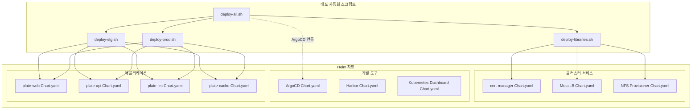
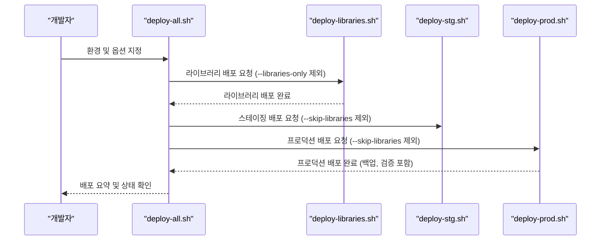
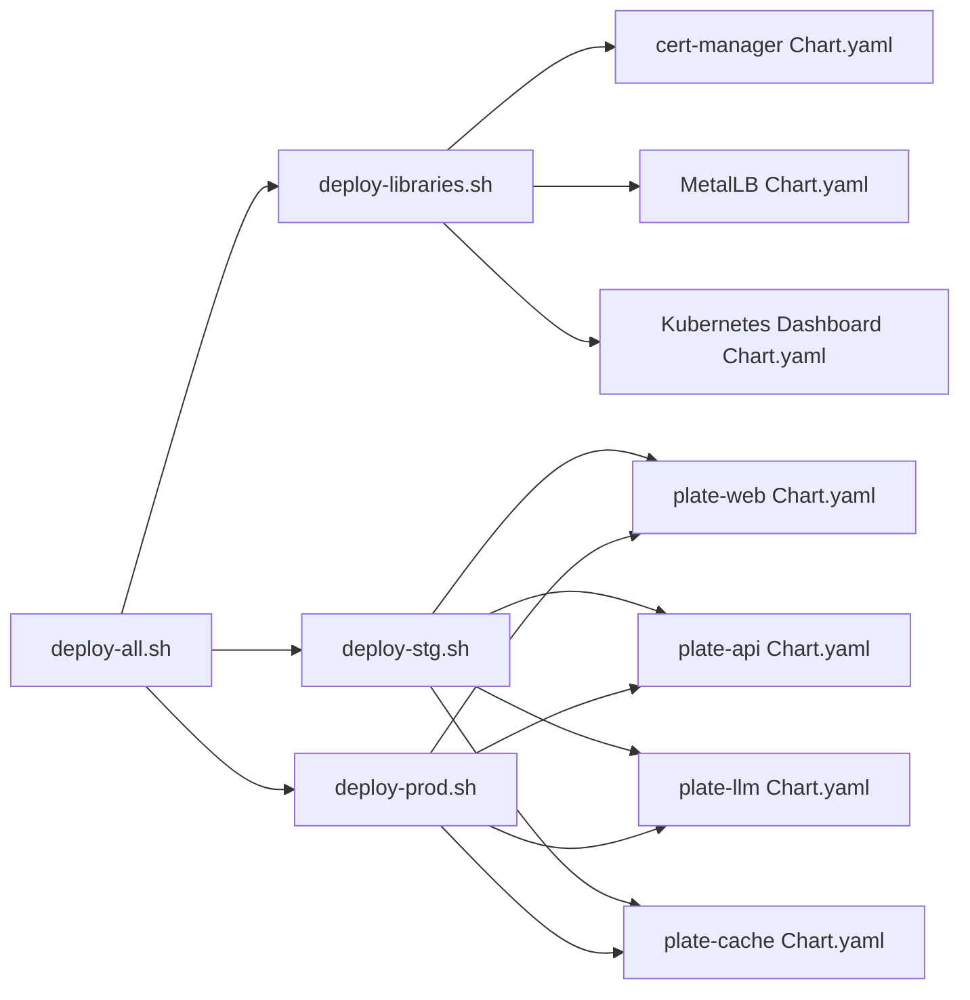

# 배포 가이드

<cite>
**문서에서 참조하는 파일 목록**
- [README.md](file://README.md)
- [deploy-all.sh](file://scripts/deploy-all.sh)
- [deploy-libraries.sh](file://scripts/deploy-libraries.sh)
- [deploy-stg.sh](file://scripts/deploy-stg.sh)
- [deploy-prod.sh](file://scripts/deploy-prod.sh)
- [app-of-apps.yaml](file://environments/argocd/app-of-apps.yaml)
- [Chart.yaml (plate-web)](file://helm/applications/plate-web/Chart.yaml)
- [Chart.yaml (plate-api)](file://helm/applications/plate-api/Chart.yaml)
- [Chart.yaml (plate-llm)](file://helm/applications/plate-llm/Chart.yaml)
- [Chart.yaml (plate-cache)](file://helm/applications/plate-cache/Chart.yaml)
- [Chart.yaml (cert-manager)](file://helm/cluster-services/cert-manager/Chart.yaml)
- [Chart.yaml (nfs-provisioner)](file://helm/cluster-services/nfs-provisioner/Chart.yaml)
- [Chart.yaml (argo-cd)](file://helm/development-tools/argocd/Chart.yaml)
- [Chart.yaml (harbor)](file://helm/development-tools/harbor/Chart.yaml)
- [Chart.yaml (kubernetes-dashboard)](file://helm/development-tools/kubernetes-dashboard/Chart.yaml)
</cite>

## 목차
1. [소개](#소개)
2. [프로젝트 구조](#프로젝트-구조)
3. [핵심 컴포넌트](#핵심-컴포넌트)
4. [아키텍처 개요](#아키텍처-개요)
5. [상세 컴포넌트 분석](#상세-컴포넌트-분석)
6. [의존성 분석](#의존성-분석)
7. [성능 고려사항](#성능-고려사항)
8. [장애 대처 가이드](#장애-대처-가이드)
9. [결론](#결론)
10. [부록](#부록)

## 소개
이 가이드는 prj-devops를 사용하여 Kubernetes 클러스터에 시스템을 배포하는 단계별 안내서입니다. 사전 준비사항, 인프라 및 도구 배포, 애플리케이션 배포, 환경별 배포 절차를 상세히 설명합니다. 각 배포 스크립트의 사용법, 필요한 인자, 예상되는 출력, 일반적인 문제 해결 방법을 포함합니다. 예를 들어, deploy-libraries.sh를 사용하여 클러스터 서비스와 개발 도구를 배포하는 방법, deploy-stg.sh를 사용하여 스테이징 환경에 애플리케이션을 배포하는 방법 등을 단계별로 안내합니다.

## 프로젝트 구조
- 프로젝트는 Helm 차트 기반으로 계층화된 배포 구조를 제공합니다.
- 계층별로 구분된 Helm 차트:
  - 클러스터 서비스: cert-manager, MetalLB, NFS 프로비저너
  - 개발 도구: ArgoCD, Harbor, Kubernetes 대시보드, Prometheus, Grafana, Jenkins, Fluentd, OpenBao, OpenEBS, Promtail
  - 애플리케이션: plate-web, plate-api, plate-llm, plate-cache
- ArgoCD App-of-Apps 패턴을 통한 GitOps 자동화 배포
- 스크립트 기반 배포 자동화: deploy-all.sh, deploy-libraries.sh, deploy-stg.sh, deploy-prod.sh

**도표 출처**
- [deploy-all.sh](file://scripts/deploy-all.sh#L1-L279)
- [deploy-libraries.sh](file://scripts/deploy-libraries.sh#L1-L128)
- [deploy-stg.sh](file://scripts/deploy-stg.sh#L1-L173)
- [deploy-prod.sh](file://scripts/deploy-prod.sh#L1-L299)
- [Chart.yaml (cert-manager)](file://helm/cluster-services/cert-manager/Chart.yaml#L1-L23)
- [Chart.yaml (nfs-provisioner)](file://helm/cluster-services/nfs-provisioner/Chart.yaml#L1-L14)
- [Chart.yaml (argo-cd)](file://helm/development-tools/argocd/Chart.yaml#L1-L32)
- [Chart.yaml (harbor)](file://helm/development-tools/harbor/Chart.yaml#L1-L25)
- [Chart.yaml (kubernetes-dashboard)](file://helm/development-tools/kubernetes-dashboard/Chart.yaml#L1-L36)
- [Chart.yaml (plate-web)](file://helm/applications/plate-web/Chart.yaml#L1-L17)
- [Chart.yaml (plate-api)](file://helm/applications/plate-api/Chart.yaml#L1-L16)
- [Chart.yaml (plate-llm)](file://helm/applications/plate-llm/Chart.yaml#L1-L19)
- [Chart.yaml (plate-cache)](file://helm/applications/plate-cache/Chart.yaml#L1-L16)

**섹션 출처**
- [README.md](file://README.md#L1-L120)

## 핵심 컴포넌트
- deploy-all.sh: 전체 배포 오케스트레이터. 환경(스테이징/프로덕션)과 옵션(--skip-libraries, --libraries-only, --dry-run)을 통한 배포 계획 수립 및 실행.
- deploy-libraries.sh: 클러스터 서비스(cert-manager, MetalLB)와 개발 도구(ArgoCD, Harbor, Kubernetes Dashboard)를 계층 순서대로 배포.
- deploy-stg.sh: 스테이징 환경에 애플리케이션(예: plate-web)을 배포하고 상태 확인, 접근 정보 표시, 삭제 기능 제공.
- deploy-prod.sh: 프로덕션 환경에 애플리케이션 배포. 안전 검사(사용자 확인, 클러스터 검증), 백업, 롤백, 상태 확인, 접근 정보 표시 포함.

**섹션 출처**
- [deploy-all.sh](file://scripts/deploy-all.sh#L1-L279)
- [deploy-libraries.sh](file://scripts/deploy-libraries.sh#L1-L128)
- [deploy-stg.sh](file://scripts/deploy-stg.sh#L1-L173)
- [deploy-prod.sh](file://scripts/deploy-prod.sh#L1-L299)

## 아키텍처 개요
- GitOps: ArgoCD App-of-Apps 패턴을 통해 모든 애플리케이션을 선언적으로 관리. environments/argocd/app-of-apps.yaml이 메인 Application이며, 하위 Application들이 각 환경별로 정의되어 있습니다.
- 배포 순서:
  1) 라이브러리(인프라 + 도구) 배포
  2) 애플리케이션 배포(스테이징 또는 프로덕션)
- 검증: Helm lint/template, kubectl wait/rollout status, 상태 확인 명령어를 통한 검증.

**도표 출처**
- [deploy-all.sh](file://scripts/deploy-all.sh#L1-L279)
- [deploy-libraries.sh](file://scripts/deploy-libraries.sh#L1-L128)
- [deploy-stg.sh](file://scripts/deploy-stg.sh#L1-L173)
- [deploy-prod.sh](file://scripts/deploy-prod.sh#L1-L299)

**섹션 출처**
- [README.md](file://README.md#L356-L407)
- [app-of-apps.yaml](file://environments/argocd/app-of-apps.yaml#L1-L35)

## 상세 컴포넌트 분석

### deploy-all.sh (전체 배포 오케스트레이터)
- 목적: 환경(스테이징/프로덕션)과 옵션에 따라 라이브러리 배포와 애플리케이션 배포를 조율합니다.
- 주요 기능:
  - 인자 파싱: 환경(staging/production), --skip-libraries, --libraries-only, --dry-run
  - 배포 계획 표시: 배포 대상 환경, 라이브러리/애플리케이션 배포 여부, Dry-run 여부
  - 프로덕션 배포 시 사용자 확인
  - 라이브러리 배포: deploy-libraries.sh 실행
  - 애플리케이션 배포: deploy-stg.sh 또는 deploy-prod.sh 실행
  - 건강 상태 검사: kubectl 연결 상태, cert-manager, 애플리케이션 Pod 상태
  - 최종 요약: 배포 성공 여부, 환경, Dry-run 모드 여부
- 사용법 예시:
  - 기본 스테이징 배포: ./scripts/deploy-all.sh
  - 라이브러리만 배포: ./scripts/deploy-all.sh staging --libraries-only
  - 라이브러리는 건너뛰고 애플리케이션만 배포: ./scripts/deploy-all.sh staging --skip-libraries
  - 프로덕션 Dry-run: ./scripts/deploy-all.sh production --dry-run
- 예상 출력:
  - 배포 계획, 진행 상황, 건강 상태 검사 결과, 최종 요약
- 일반적인 문제 해결:
  - 인자 오류: --help 또는 잘못된 인자를 입력하면 도움말 표시
  - 클러스터 연결 실패: kubectl cluster-info 오류 시 클러스터 설정 확인

**섹션 출처**
- [deploy-all.sh](file://scripts/deploy-all.sh#L1-L279)
- [README.md](file://README.md#L175-L214)

### deploy-libraries.sh (인프라 및 도구 배포)
- 목적: 클러스터 레벨 인프라와 개발 도구를 계층 순서대로 배포합니다.
- 배포 순서:
  1) cert-manager: Jetstack 저장소 추가, CRDs 설치, cert-manager 설치, 설정 적용
  2) Jenkins: values.yaml 기반 설치
  3) MetalLB: 저장소 추가, 설치, 설정 적용
- 검증: 각 컴포넌트의 Pod 상태 확인
- 사용법 예시:
  - ./scripts/deploy-libraries.sh
- 예상 출력:
  - 각 컴포넌트 배포 성공 메시지, Pod 상태 표시
- 일반적인 문제 해결:
  - Helm 미설치: Helm이 설치되지 않은 경우 오류 메시지 표시
  - 클러스터 연결 실패: kubectl 연결 불가 시 오류 메시지 표시
  - cert-manager 설치 실패: CRDs 적용, wait 조건 확인

**섹션 출처**
- [deploy-libraries.sh](file://scripts/deploy-libraries.sh#L1-L128)
- [README.md](file://README.md#L195-L214)

### deploy-stg.sh (스테이징 환경 배포)
- 목적: 스테이징 환경에 애플리케이션을 배포하고 상태 확인, 접근 정보 표시, 삭제 기능을 제공합니다.
- 주요 기능:
  - 차트 검증: Helm lint, template 검증
  - 네임스페이스 생성 및 라벨 설정
  - 배포: --wait, --timeout 설정
  - 상태 확인: Helm release 상태, Pod/Service/Ingress 목록
  - 접근 정보: Ingress 호스트 기반 URL 표시
  - 삭제: uninstall 명령어 제공
- 사용법 예시:
  - 배포: ./scripts/deploy-stg.sh
  - 상태 확인: ./scripts/deploy-stg.sh status
  - 삭제: ./scripts/deploy-stg.sh delete
- 예상 출력:
  - 배포 완료 메시지, 상태 정보, 접근 URL
- 일반적인 문제 해결:
  - Chart.yaml 누락: 오류 메시지 표시
  - 네임스페이스/릴리스 이름 불일치: values 파일 및 네임스페이스 확인

**섹션 출처**
- [deploy-stg.sh](file://scripts/deploy-stg.sh#L1-L173)
- [README.md](file://README.md#L231-L247)

### deploy-prod.sh (프로덕션 환경 배포)
- 목적: 프로덕션 환경에 안전 검사를 포함한 배포를 수행합니다.
- 주요 기능:
  - 안전 확인: 사용자 확인 프롬프트, 클러스터 이름 검증
  - 차트 검증: lint, template 검증
  - 백업: 현재 values/manifest 백업 디렉터리 생성
  - 배포: --wait, --timeout, --atomic(실패 시 자동 롤백)
  - 검증: Pod 준비 상태, 롤아웃 상태 검증
  - 상태 확인: Helm release 상태, Pod/Service/Ingress/HAP 목록
  - 접근 정보: Ingress 호스트 기반 URL 표시
  - 롤백: 지정된 revision으로 rollback
  - 삭제: 프로덕션에서는 안전상 직접 uninstall 권장
- 사용법 예시:
  - 배포: ./scripts/deploy-prod.sh
  - 상태 확인: ./scripts/deploy-prod.sh status
  - 롤백: ./scripts/deploy-prod.sh rollback [revision]
  - Dry-run: 환경 변수 DRY_RUN=true로 설정 후 배포
  - 백업 건너뛰기: 환경 변수 SKIP_BACKUP=true로 설정
- 예상 출력:
  - 배포 완료 메시지, 백업 경로, 상태 정보, 접근 URL
- 일반적인 문제 해결:
  - 사용자 확인 미수행: 'yes'가 아닌 경우 배포 취소
  - 클러스터 이름 검증 실패: prod/production 포함 여부 확인
  - 롤백 실패: revision 번호 확인

**섹션 출처**
- [deploy-prod.sh](file://scripts/deploy-prod.sh#L1-L299)
- [README.md](file://README.md#L239-L247)

### ArgoCD 연동 (App-of-Apps)
- App-of-Apps 패턴: environments/argocd/app-of-apps.yaml이 모든 하위 Application을 관리하고, syncPolicy를 통해 자동 동기화를 활성화합니다.
- 환경별 Application: environments/argocd/apps/ 디렉터리에 각 서비스별 ArgoCD Application이 정의되어 있으며, values-stg.yaml 또는 values-prod.yaml을 통해 환경별 설정이 적용됩니다.
- 장점: 명확한 계층 분리, GitOps 통합, 멀티 애플리케이션 지원

**섹션 출처**
- [README.md](file://README.md#L356-L407)
- [app-of-apps.yaml](file://environments/argocd/app-of-apps.yaml#L1-L35)

## 의존성 분석
- Helm 차트 의존성:
  - cert-manager: cert-manager Chart.yaml에 의존성이 명시되어 있습니다.
  - argo-cd: redis-ha 의존성을 포함합니다.
  - kubernetes-dashboard: ingress-nginx, cert-manager, metrics-server, kong 등의 의존성을 포함합니다.
  - plate-* 애플리케이션: 각각 독립된 Chart.yaml을 가지며, values-stg.yaml/values-prod.yaml을 통해 환경별 설정이 적용됩니다.
- 배포 스크립트 의존성:
  - deploy-all.sh는 deploy-libraries.sh, deploy-stg.sh, deploy-prod.sh를 호출합니다.
  - deploy-libraries.sh는 cert-manager, MetalLB, Jenkins를 순차적으로 배포합니다.
  - deploy-stg.sh/deploy-prod.sh는 각각 애플리케이션 차트를 배포하고, 상태 확인을 수행합니다.

**도표 출처**
- [deploy-all.sh](file://scripts/deploy-all.sh#L1-L279)
- [deploy-libraries.sh](file://scripts/deploy-libraries.sh#L1-L128)
- [deploy-stg.sh](file://scripts/deploy-stg.sh#L1-L173)
- [deploy-prod.sh](file://scripts/deploy-prod.sh#L1-L299)
- [Chart.yaml (cert-manager)](file://helm/cluster-services/cert-manager/Chart.yaml#L1-L23)
- [Chart.yaml (argo-cd)](file://helm/development-tools/argocd/Chart.yaml#L1-L32)
- [Chart.yaml (kubernetes-dashboard)](file://helm/development-tools/kubernetes-dashboard/Chart.yaml#L1-L36)
- [Chart.yaml (plate-web)](file://helm/applications/plate-web/Chart.yaml#L1-L17)
- [Chart.yaml (plate-api)](file://helm/applications/plate-api/Chart.yaml#L1-L16)
- [Chart.yaml (plate-llm)](file://helm/applications/plate-llm/Chart.yaml#L1-L19)
- [Chart.yaml (plate-cache)](file://helm/applications/plate-cache/Chart.yaml#L1-L16)

**섹션 출처**
- [Chart.yaml (cert-manager)](file://helm/cluster-services/cert-manager/Chart.yaml#L1-L23)
- [Chart.yaml (argo-cd)](file://helm/development-tools/argocd/Chart.yaml#L1-L32)
- [Chart.yaml (kubernetes-dashboard)](file://helm/development-tools/kubernetes-dashboard/Chart.yaml#L1-L36)
- [Chart.yaml (plate-web)](file://helm/applications/plate-web/Chart.yaml#L1-L17)
- [Chart.yaml (plate-api)](file://helm/applications/plate-api/Chart.yaml#L1-L16)
- [Chart.yaml (plate-llm)](file://helm/applications/plate-llm/Chart.yaml#L1-L19)
- [Chart.yaml (plate-cache)](file://helm/applications/plate-cache/Chart.yaml#L1-L16)

## 성능 고려사항
- 배포 시간 최적화:
  - --wait, --timeout 설정을 통해 배포 완료까지 대기 시간 조절
  - --atomic 옵션을 통한 실패 시 자동 롤백으로 인한 추가 시간 절감
- 자원 사용:
  - 각 애플리케이션 차트의 values-stg.yaml/values-prod.yaml에서 리소스 요청/제한 설정을 통해 자원 효율성 확보
- 네트워크:
  - MetalLB를 통한 LoadBalancer 노출 시 IP 범위 및 설정 검토
- 보안:
  - cert-manager를 통한 자동 SSL/TLS 발급으로 인해 인증서 발급 대기 시간 고려

[이 섹션은 일반적인 성능 논의를 포함하므로 특정 파일 분석 없음]

## 장애 대처 가이드
- 인증서 문제:
  - cert-manager Pod 로그 확인, Certificate/Order/Challenge 리소스 상태 점검
- Ingress 문제:
  - DNS 레코드(A/CNAME) 확인, Ingress Controller LB IP 매칭 여부 점검
- Pod 문제:
  - 리소스 부족(OOMKilled/CrashLoopBackOff), 이미지 Pull 오류 확인
- 배포 검증:
  - ./scripts/deploy-stg.sh status, ./scripts/deploy-prod.sh status 명령어로 상태 확인
- 롤백:
  - 프로덕션 배포 시 --atomic 옵션으로 자동 롤백 가능, 수동 롤백은 ./scripts/deploy-prod.sh rollback [revision] 사용

**섹션 출처**
- [README.md](file://README.md#L335-L355)
- [deploy-prod.sh](file://scripts/deploy-prod.sh#L1-L299)

## 결론
이 가이드는 prj-devops를 통한 배포를 위한 단계별 절차를 제공합니다. deploy-all.sh를 통한 전체 배포, deploy-libraries.sh를 통한 인프라 및 도구 배포, deploy-stg.sh/deploy-prod.sh를 통한 환경별 애플리케이션 배포를 중심으로, 안전 검사, 검증, 상태 확인, 롤백 기능을 포함한 배포 워크플로우를 설명했습니다. 각 스크립트의 사용법과 인자, 예상 출력, 문제 해결 방법을 참고하시면 원활한 배포가 가능합니다.

[이 섹션은 요약을 포함하므로 특정 파일 분석 없음]

## 부록
- 사전 준비사항:
  - Kubernetes 클러스터 접근 권한, Helm 3.x 설치, kubectl 설정 완료
- 환경별 설정:
  - 스테이징: values-stg.yaml, 프로덕션: values-prod.yaml
- GitOps 연동:
  - environments/argocd/app-of-apps.yaml을 통한 App-of-Apps 패턴 적용

**섹션 출처**
- [README.md](file://README.md#L111-L174)