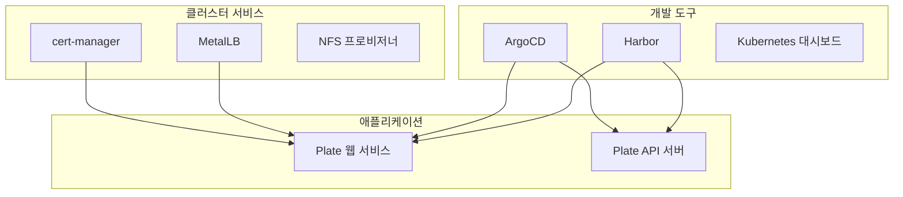

# 사전 준비사항

<cite>
**이 문서에서 참조한 파일**  
- [README.md](file://README.md)
- [environments/argocd/README.md](file://environments/argocd/README.md)
- [scripts/deploy-libraries.sh](file://scripts/deploy-libraries.sh)
- [scripts/deploy-stg.sh](file://scripts/deploy-stg.sh)
- [scripts/deploy-prod.sh](file://scripts/deploy-prod.sh)
- [helm/development-tools/argocd/Chart.yaml](file://helm/development-tools/argocd/Chart.yaml)
- [helm/development-tools/harbor/Chart.yaml](file://helm/development-tools/harbor/Chart.yaml)
- [helm/development-tools/grafana/Chart.yaml](file://helm/development-tools/grafana/Chart.yaml)
- [helm/development-tools/prometheus/Chart.yaml](file://helm/development-tools/prometheus/Chart.yaml)
- [helm/development-tools/fluentd/Chart.yaml](file://helm/development-tools/fluentd/Chart.yaml)
- [helm/development-tools/openebs/Chart.yaml](file://helm/development-tools/openebs/Chart.yaml)
- [helm/cluster-services/cert-manager/Chart.yaml](file://helm/cluster-services/cert-manager/Chart.yaml)
- [helm/cluster-services/nfs-provisioner/Chart.yaml](file://helm/cluster-services/nfs-provisioner/Chart.yaml)
</cite>

## 목차
1. [소개](#소개)
2. [필수 도구 설치 및 설정](#필수-도구-설치-및-설정)
3. [Kubernetes 클러스터 요구사항](#kubernetes-클러스터-요구사항)
4. [네트워크 구성 요건](#네트워크-구성-요건)
5. [접근 권한 설정](#접근-권한-설정)
6. [환경별 인프라 요구사항](#환경별-인프라-요구사항)
7. [구성 요소 간 의존성 관계](#구성-요소-간-의존성-관계)
8. [배포 전 점검 항목](#배포-전-점검-항목)
9. [실제 예제 및 일반적인 설정 오류](#실제-예제-및-일반적인-설정-오류)

## 소개

이 문서는 `prj-devops` 프로젝트의 배포를 위한 사전 준비사항을 상세히 설명합니다. 프로젝트는 Helm 차트 기반의 프로덕션 준비된 Kubernetes 배포 구조를 제공하며, 다중 환경(GitOps 기반)을 위해 체계적으로 구성되어 있습니다. 계층화된 아키텍처를 통해 인프라, 개발 도구, 애플리케이션을 명확히 분리하고 있으며, ArgoCD를 통한 자동화된 배포 파이프라인을 구현합니다.

**Section sources**
- [README.md](file://README.md#L1-L417)

## 필수 도구 설치 및 설정

배포를 위해 다음과 같은 도구들의 설치 및 설정이 필요합니다.

### kubectl
Kubernetes 클러스터와 상호작용하기 위한 명령줄 도구입니다. 설치 후, 클러스터에 접근할 수 있도록 kubeconfig 파일을 설정해야 합니다.

### Helm
Kubernetes 패키지 관리자로, 애플리케이션을 Helm 차트로 패키징하고 배포합니다. 이 프로젝트는 Helm 3.x 버전을 사용합니다.

### ArgoCD CLI
GitOps 기반의 지속적 배포를 위한 도구입니다. ArgoCD CLI를 사용하면 ArgoCD Application을 명령줄에서 관리할 수 있습니다.

### 도구 설치 스크립트
`scripts/deploy-libraries.sh` 스크립트는 클러스터 서비스(cert-manager, MetalLB, NFS 프로비저너)와 개발 도구(ArgoCD, Harbor, Kubernetes 대시보드)를 계층 순서대로 설치합니다. 이 스크립트는 Helm을 사용하여 각 컴포넌트를 배포하며, 사전에 Helm과 kubectl이 설치되어 있어야 합니다.

**Section sources**
- [README.md](file://README.md#L113-L124)
- [scripts/deploy-libraries.sh](file://scripts/deploy-libraries.sh#L1-L128)

## Kubernetes 클러스터 요구사항

### 클러스터 버전
- Kubernetes 버전 1.19 이상이 필요합니다. 일부 도구(예: Prometheus)는 최소 1.19 버전을 요구합니다.

### 리소스 요구사항
- **스테이징 환경**: 최소 2개의 워커 노드, 각 노드당 4코어 CPU, 8GB 메모리
- **프로덕션 환경**: 최소 3개의 워커 노드, 각 노드당 8코어 CPU, 16GB 메모리 이상 권장

### 네임스페이스 구성
- `cert-manager`: cert-manager 관련 리소스
- `metallb-system`: MetalLB 관련 리소스
- `jenkins`: Jenkins 관련 리소스
- `argocd`: ArgoCD 관련 리소스
- `harbor`: Harbor 관련 리소스
- `fe-web-stg`: 스테이징 웹 애플리케이션
- `fe-web-prod`: 프로덕션 웹 애플리케이션

**Section sources**
- [README.md](file://README.md#L115-L117)
- [helm/development-tools/prometheus/Chart.yaml](file://helm/development-tools/prometheus/Chart.yaml#L33)
- [scripts/deploy-libraries.sh](file://scripts/deploy-libraries.sh#L56-L57)

## 네트워크 구성 요건

### Ingress Controller
- MetalLB를 사용하여 LoadBalancer 타입의 서비스에 외부 IP를 할당합니다.
- Ingress 리소스를 통해 외부 트래픽을 애플리케이션으로 라우팅합니다.

### DNS 설정
- 도메인 `cocdev.co.kr` 및 `stg.cocdev.co.kr`이 MetalLB가 할당한 외부 IP 주소를 가리키도록 A 레코드를 설정해야 합니다.

### TLS/SSL
- cert-manager를 사용하여 Let's Encrypt로부터 SSL 인증서를 자동으로 발급받습니다.
- 스테이징 환경은 Let's Encrypt Staging 인증서를, 프로덕션 환경은 실서명 인증서를 사용합니다.

**Section sources**
- [README.md](file://README.md#L159-L173)
- [helm/cluster-services/cert-manager/Chart.yaml](file://helm/cluster-services/cert-manager/Chart.yaml#L1-L23)
- [scripts/deploy-libraries.sh](file://scripts/deploy-libraries.sh#L88-L101)

## 접근 권한 설정

### RBAC 설정
- 각 도구와 애플리케이션에 대해 적절한 Role, RoleBinding, ServiceAccount를 설정합니다.
- 예: ArgoCD는 `argocd` 네임스페이스에 대한 관리자 권한을 가진 ServiceAccount를 사용합니다.

### ArgoCD 접근 제어
- ArgoCD UI 또는 CLI를 통해 접근할 수 있으며, RBAC을 통해 사용자 권한을 제어합니다.
- 프로덕션 환경은 관리자만 접근할 수 있도록 제한합니다.

### 비밀 관리
- Harbor, ArgoCD 등의 비밀 정보는 Kubernetes Secrets 또는 외부 비밀 관리 도구(예: External Secrets)를 사용하여 관리합니다.

**Section sources**
- [environments/argocd/README.md](file://environments/argocd/README.md#L101-L106)
- [helm/development-tools/argocd/Chart.yaml](file://helm/development-tools/argocd/Chart.yaml#L1-L32)

## 환경별 인프라 요구사항

### 스테이징 환경
- **도메인**: `cocdev.co.kr`, `stg.cocdev.co.kr`
- **인증서**: Let's Encrypt Staging
- **레플리카 수**: 2
- **자동 확장**: 활성화
- **리소스**: 개발자 친화적인 설정
- **SSL**: 선택 사항(HTTP 허용)

### 프로덕션 환경
- **도메인**: `cocdev.co.kr`, `www.cocdev.co.kr`
- **인증서**: Let's Encrypt Production
- **레플리카 수**: 3 이상
- **자동 확장**: 활성화
- **보안**: 강화된 설정
- **SSL**: 강제 적용

**Section sources**
- [README.md](file://README.md#L157-L174)

## 구성 요소 간 의존성 관계

### 계층 구조
1. **클러스터 서비스**(계층 1): cert-manager, MetalLB, NFS 프로비저너
2. **개발 도구**(계층 2): ArgoCD, Harbor, Kubernetes 대시보드
3. **애플리케이션**(계층 3): Plate 웹 서비스, API 서버 등

### 의존성
- **MetalLB**: Ingress Controller에 외부 IP를 제공하기 위해 필요합니다.
- **cert-manager**: Ingress 리소스에 TLS 인증서를 발급하기 위해 필요합니다.
- **ArgoCD**: 애플리케이션 배포를 자동화하기 위해 필요합니다.
- **Harbor**: 컨테이너 이미지를 저장하고 관리하기 위해 필요합니다.



**Diagram sources**
- [README.md](file://README.md#L20-L30)
- [scripts/deploy-libraries.sh](file://scripts/deploy-libraries.sh#L113-L115)

## 배포 전 점검 항목

### 사전 점검 체크리스트
- [ ] kubectl이 설치되어 있고, 올바른 클러스터에 연결되어 있는지 확인
- [ ] Helm이 설치되어 있는지 확인
- [ ] ArgoCD CLI가 설치되어 있는지 확인
- [ ] 클러스터에 충분한 리소스(CPU, 메모리)가 있는지 확인
- [ ] 도메인 DNS 레코드가 올바르게 설정되었는지 확인
- [ ] 필요한 네임스페이스가 생성되어 있는지 확인
- [ ] 각 Helm 차트의 values 파일이 올바르게 구성되었는지 확인

### 배포 절차
1. `scripts/deploy-libraries.sh`을 실행하여 클러스터 서비스와 개발 도구를 배포
2. `scripts/deploy-stg.sh` 또는 `scripts/deploy-all.sh staging`을 실행하여 스테이징 환경에 애플리케이션 배포
3. `scripts/deploy-prod.sh` 또는 `scripts/deploy-all.sh production`을 실행하여 프로덕션 환경에 애플리케이션 배포

**Section sources**
- [README.md](file://README.md#L113-L153)
- [scripts/deploy-libraries.sh](file://scripts/deploy-libraries.sh#L106-L117)
- [scripts/deploy-stg.sh](file://scripts/deploy-stg.sh#L134-L151)
- [scripts/deploy-prod.sh](file://scripts/deploy-prod.sh#L243-L267)

## 실제 예제 및 일반적인 설정 오류

### 실제 예제
#### 스테이징 배포
```bash
./scripts/deploy-stg.sh
```

#### 프로덕션 배포 (드라이런)
```bash
./scripts/deploy-all.sh production --dry-run
```

### 일반적인 설정 오류 및 해결 방법
1. **인증서 문제**: cert-manager Pod 로그를 확인하고, Certificate, Order, Challenge 리소스 상태를 점검합니다.
2. **Ingress 문제**: DNS A/CNAME 레코드가 Ingress Controller의 LoadBalancer IP와 매칭되는지 확인합니다.
3. **Pod 문제**: 리소스 부족(OOMKilled / CrashLoopBackOff) 또는 이미지 Pull 오류가 발생하지 않는지 확인합니다.
4. **Helm 배포 실패**: `helm lint` 및 `helm template` 명령어를 사용하여 차트를 검증합니다.

**Section sources**
- [README.md](file://README.md#L337-L354)
- [scripts/deploy-stg.sh](file://scripts/deploy-stg.sh#L154-L173)
- [scripts/deploy-prod.sh](file://scripts/deploy-prod.sh#L270-L299)