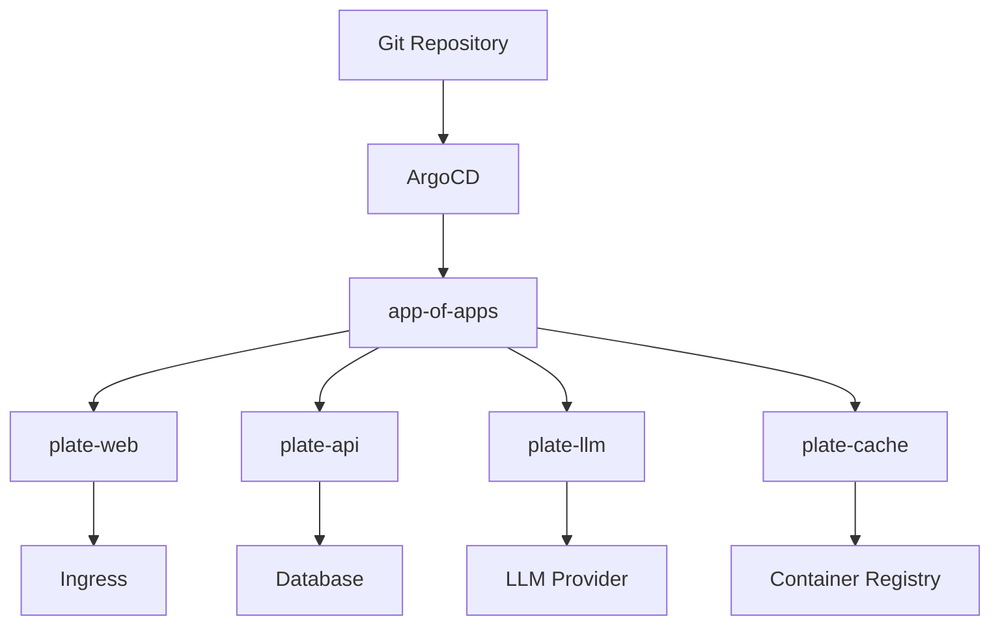
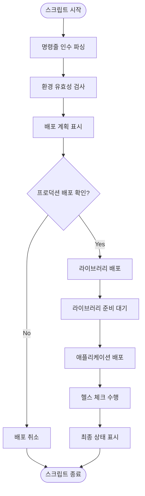
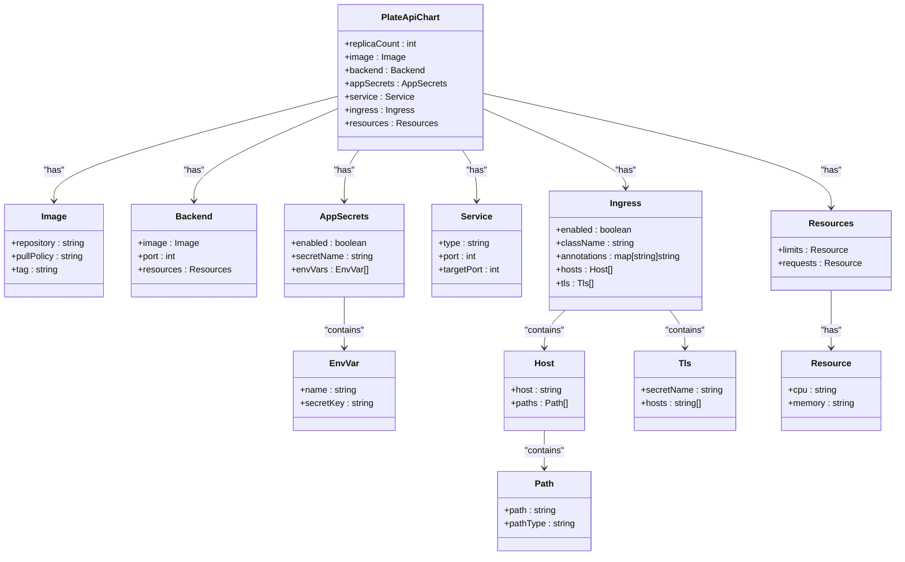
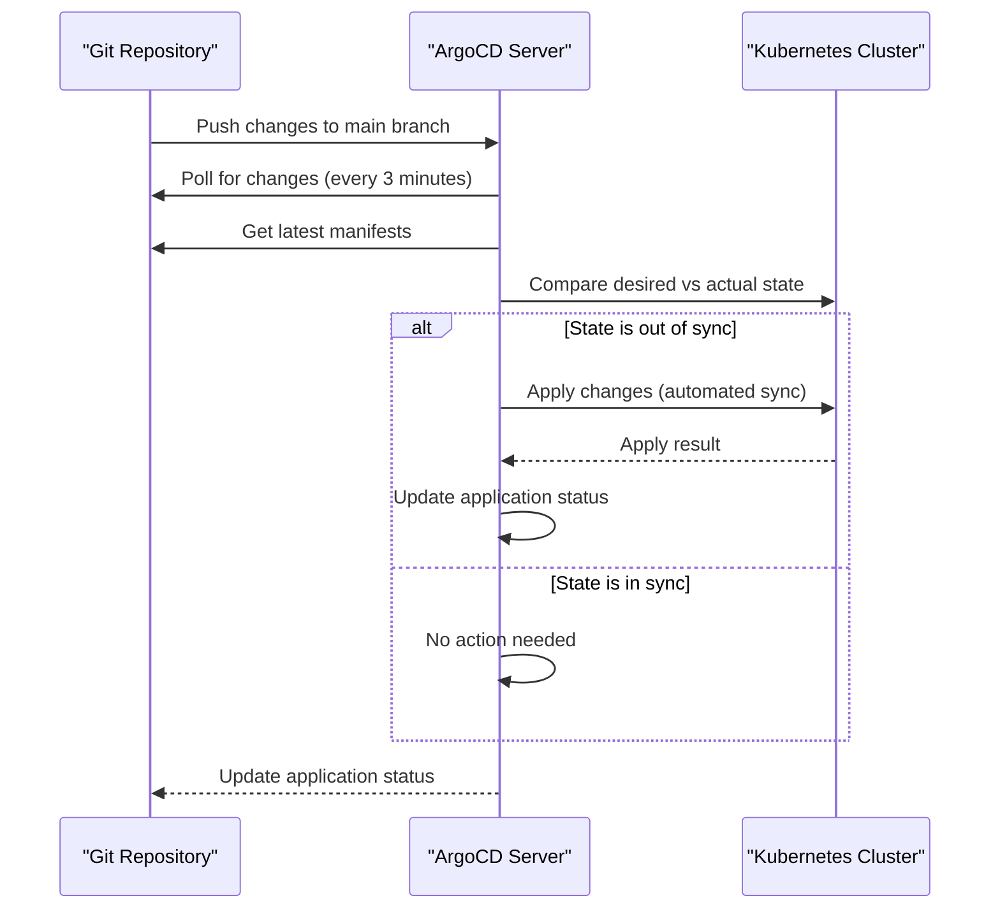
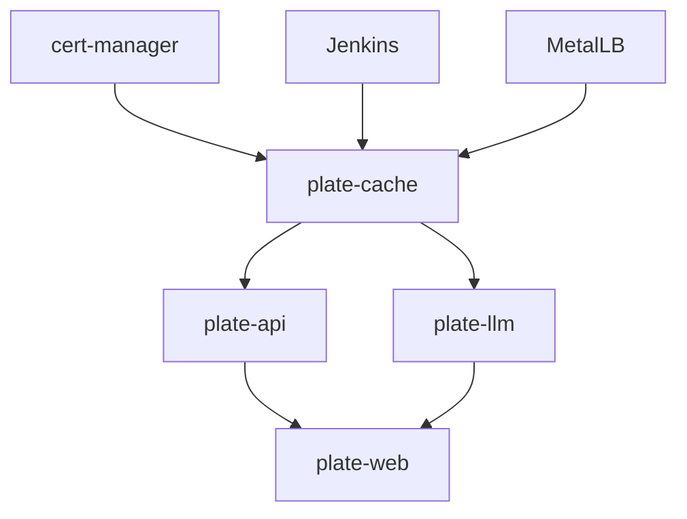

# 애플리케이션 배포

<cite>
**이 문서에서 참조한 파일**  
- [deploy-all.sh](file://scripts/deploy-all.sh)
- [deploy-stg.sh](file://scripts/deploy-stg.sh)
- [deploy-prod.sh](file://scripts/deploy-prod.sh)
- [deploy-libraries.sh](file://scripts/deploy-libraries.sh)
- [app-of-apps.yaml](file://environments/argocd/app-of-apps.yaml)
- [plate-api-prod.yaml](file://environments/argocd/apps/plate-api-prod.yaml)
- [plate-web-prod.yaml](file://environments/argocd/apps/plate-web-prod.yaml)
- [plate-llm-stg.yaml](file://environments/argocd/apps/plate-llm-stg.yaml)
- [plate-cache-prod.yaml](file://environments/argocd/apps/plate-cache-prod.yaml)
- [values.yaml](file://helm/applications/plate-api/values.yaml)
- [values.yaml](file://helm/applications/plate-web/values.yaml)
- [values.yaml](file://helm/applications/plate-llm/values.yaml)
- [values.yaml](file://helm/applications/plate-cache/values.yaml)
- [values-prod.yaml](file://helm/applications/plate-api/values-prod.yaml)
- [values-prod.yaml](file://helm/applications/plate-web/values-prod.yaml)
- [values-stg.yaml](file://helm/applications/plate-llm/values-stg.yaml)
- [values-prod.yaml](file://helm/applications/plate-cache/values-prod.yaml)
</cite>

## 목차
1. [소개](#소개)
2. [배포 아키텍처 개요](#배포-아키텍처-개요)
3. [배포 스크립트 분석](#배포-스크립트-분석)
4. [Helm 차트 및 values 설정](#helm-차트-및-values-설정)
5. [ArgoCD 기반 GitOps 흐름](#argocd-기반-gitops-흐름)
6. [의존성 관계 및 배포 순서](#의존성-관계-및-배포-순서)
7. [Health Check 및 상태 확인](#health-check-및-상태-확인)
8. [배포 진단 및 문제 해결](#배포-진단-및-문제-해결)
9. [결론](#결론)

## 소개

이 문서는 `deploy-all.sh` 또는 개별 스크립트를 사용하여 plate-web, plate-api, plate-llm, plate-cache 애플리케이션을 배포하는 절차를 설명합니다. ArgoCD 기반 GitOps 흐름에서의 애플리케이션 배포 절차, Helm 차트의 values 설정 오버라이드 방법, 배포 상태 확인 및 진단 명령어를 포함하며, 각 애플리케이션의 의존성 관계와 배포 순서, Health Check 설정, 트래픽 라우팅 구성 등을 실제 예제와 함께 안내합니다.

## 배포 아키텍처 개요

시스템은 ArgoCD 기반 GitOps 흐름을 통해 관리되며, Application of Applications 패턴을 사용하여 전체 플랫폼의 애플리케이션들을 중앙에서 관리합니다. 주요 구성 요소로는 plate-web(프론트엔드), plate-api(백엔드), plate-llm(LLM 서비스), plate-cache(컨테이너 캐시 저장소)가 있으며, 각각의 배포는 환경(staging, production)에 따라 다르게 구성됩니다.

**다이어그램 출처**  
- [app-of-apps.yaml](file://environments/argocd/app-of-apps.yaml)
- [plate-api-prod.yaml](file://environments/argocd/apps/plate-api-prod.yaml)
- [plate-web-prod.yaml](file://environments/argocd/apps/plate-web-prod.yaml)
- [plate-llm-stg.yaml](file://environments/argocd/apps/plate-llm-stg.yaml)
- [plate-cache-prod.yaml](file://environments/argocd/apps/plate-cache-prod.yaml)

## 배포 스크립트 분석

### 통합 배포 스크립트 (deploy-all.sh)

`deploy-all.sh` 스크립트는 전체 컴포넌트 배포를 오케스트레이션하며, 라이브러리와 애플리케이션의 배포를 순차적으로 처리합니다. 이 스크립트는 환경(staging, production)을 인자로 받아 배포를 수행하며, `--skip-libraries`, `--libraries-only`, `--dry-run` 등의 옵션을 지원합니다.

**다이어그램 출처**  
- [deploy-all.sh](file://scripts/deploy-all.sh#L218-L279)

**섹션 출처**  
- [deploy-all.sh](file://scripts/deploy-all.sh#L1-L279)

### 개별 배포 스크립트

#### 스테이징 배포 (deploy-stg.sh)

`deploy-stg.sh` 스크립트는 스테이징 환경에 애플리케이션을 배포합니다. Helm을 사용하여 차트를 설치하고, 네임스페이스를 생성하며, 배포 상태를 확인합니다. 이 스크립트는 `deploy`, `status`, `delete` 명령을 지원합니다.

**섹션 출처**  
- [deploy-stg.sh](file://scripts/deploy-stg.sh#L1-L173)

#### 프로덕션 배포 (deploy-prod.sh)

`deploy-prod.sh` 스크립트는 프로덕션 환경에 애플리케이션을 배포합니다. 안전 검사를 포함하여 배포를 수행하며, 백업 생성, 클러스터 확인, 롤백 기능을 제공합니다. 이 스크립트는 `deploy`, `status`, `rollback` 명령을 지원하며, 삭제는 수동으로 수행해야 합니다.

**섹션 출처**  
- [deploy-prod.sh](file://scripts/deploy-prod.sh#L1-L299)

#### 라이브러리 배포 (deploy-libraries.sh)

`deploy-libraries.sh` 스크립트는 cert-manager, Jenkins, MetalLB와 같은 라이브러리 컴포넌트들을 배포합니다. 각 컴포넌트는 Helm 차트를 통해 설치되며, cert-manager의 경우 CRD 설치와 설정 적용이 별도로 수행됩니다.

**섹션 출처**  
- [deploy-libraries.sh](file://scripts/deploy-libraries.sh#L1-L128)

## Helm 차트 및 values 설정

### plate-api Helm 차트

plate-api Helm 차트는 nginx 리버스 프록시와 백엔드 애플리케이션 컨테이너로 구성되며, 기본 values.yaml 파일에 복제본 수, 이미지 정보, 리소스 요청/제한, 환경변수 Secret 설정, 서비스 및 Ingress 구성이 정의되어 있습니다. 프로덕션 환경에서는 replicaCount가 1로 설정되며, Ingress는 비활성화되어 내부 서비스로만 사용됩니다.

**다이어그램 출처**  
- [values.yaml](file://helm/applications/plate-api/values.yaml#L1-L116)
- [values-prod.yaml](file://helm/applications/plate-api/values-prod.yaml#L1-L31)

**섹션 출처**  
- [values.yaml](file://helm/applications/plate-api/values.yaml#L1-L116)
- [values-prod.yaml](file://helm/applications/plate-api/values-prod.yaml#L1-L31)

### plate-web Helm 차트

plate-web Helm 차트는 nginx 리버스 프록시와 busybox 백엔드 컨테이너로 구성되며, 기본 values.yaml 파일에 복제본 수, 이미지 정보, 리소스 요청/제한, 환경변수 Secret 설정, 서비스 및 Ingress 구성이 정의되어 있습니다. 프로덕션 환경에서는 nginx 이미지 태그가 특정 버전으로 고정되며, Ingress는 비활성화되어 최상위 통합 템플릿에서 관리됩니다.

**섹션 출처**  
- [values.yaml](file://helm/applications/plate-web/values.yaml#L1-L73)
- [values-prod.yaml](file://helm/applications/plate-web/values-prod.yaml#L1-L39)

### plate-llm Helm 차트

plate-llm Helm 차트는 LangChain 기반 LLM 서비스를 배포하며, 기본 values.yaml 파일에 복제본 수, 이미지 정보, 포트 설정, 리소스 요청/제한, 서비스 및 Ingress 구성이 정의되어 있습니다. 스테이징 환경에서는 이미지 pullPolicy가 Always로 설정되어 최신 빌드를 항상 가져옵니다.

**섹션 출처**  
- [values.yaml](file://helm/applications/plate-llm/values.yaml#L1-L68)
- [values-stg.yaml](file://helm/applications/plate-llm/values-stg.yaml#L1-L45)

### plate-cache Helm 차트

plate-cache Helm 차트는 컨테이너 빌드 캐시를 위한 PVC를 생성하며, 기본 values.yaml 파일에 PVC 이름, 스토리지 클래스, 접근 모드, 크기, 마운트 경로가 정의되어 있습니다. 프로덕션 환경에서는 스토리지 클래스가 openebs-hostpath로 설정되며, PVC에 production 레이블이 추가됩니다.

**섹션 출처**  
- [values.yaml](file://helm/applications/plate-cache/values.yaml#L1-L14)
- [values-prod.yaml](file://helm/applications/plate-cache/values-prod.yaml#L1-L12)

## ArgoCD 기반 GitOps 흐름

ArgoCD는 Git 저장소의 상태를 클러스터의 실제 상태와 비교하여 동기화하는 GitOps 도구입니다. `app-of-apps.yaml` 파일은 모든 애플리케이션을 관리하는 메인 ArgoCD Application으로, `environments/argocd/apps` 디렉터리에 있는 각 애플리케이션의 ArgoCD Application 리소스를 동기화합니다.

각 애플리케이션의 ArgoCD Application 리소스는 Git 저장소 URL, Helm 차트 경로, 환경별 values 파일, 배포 대상 클러스터 및 네임스페이스, 동기화 정책 등을 정의합니다. 동기화 정책에는 자동 동기화, 삭제된 리소스의 자동 제거, 수동 변경 시 Git 상태로 자동 복구, 재시도 정책 등이 포함됩니다.

**다이어그램 출처**  
- [app-of-apps.yaml](file://environments/argocd/app-of-apps.yaml#L1-L35)
- [plate-api-prod.yaml](file://environments/argocd/apps/plate-api-prod.yaml#L1-L62)
- [plate-web-prod.yaml](file://environments/argocd/apps/plate-web-prod.yaml#L1-L62)
- [plate-llm-stg.yaml](file://environments/argocd/apps/plate-llm-stg.yaml#L1-L62)
- [plate-cache-prod.yaml](file://environments/argocd/apps/plate-cache-prod.yaml#L1-L51)

**섹션 출처**  
- [app-of-apps.yaml](file://environments/argocd/app-of-apps.yaml#L1-L35)
- [plate-api-prod.yaml](file://environments/argocd/apps/plate-api-prod.yaml#L1-L62)
- [plate-web-prod.yaml](file://environments/argocd/apps/plate-web-prod.yaml#L1-L62)
- [plate-llm-stg.yaml](file://environments/argocd/apps/plate-llm-stg.yaml#L1-L62)
- [plate-cache-prod.yaml](file://environments/argocd/apps/plate-cache-prod.yaml#L1-L51)

## 의존성 관계 및 배포 순서

시스템의 컴포넌트들은 다음과 같은 의존성 관계를 가지며, 배포 순서는 이 의존성에 따라 결정됩니다.

1. **라이브러리 컴포넌트**: cert-manager, Jenkins, MetalLB는 모든 애플리케이션의 기반으로, 가장 먼저 배포되어야 합니다.
2. **plate-cache**: 컨테이너 빌드 캐시 저장소로, 다른 애플리케이션의 빌드 과정에 필요하며, 라이브러리 배포 후에 배포됩니다.
3. **plate-api**: 백엔드 서비스로, plate-web의 데이터를 제공하며, plate-cache 배포 후에 배포됩니다.
4. **plate-llm**: LLM 서비스로, plate-api와 독립적으로 동작하지만, Ingress 리소스를 공유할 수 있으므로 plate-api 배포 후에 배포됩니다.
5. **plate-web**: 프론트엔드 서비스로, plate-api와 plate-llm의 기능을 사용하며, 가장 마지막에 배포됩니다.

**다이어그램 출처**  
- [deploy-all.sh](file://scripts/deploy-all.sh#L243-L261)
- [deploy-libraries.sh](file://scripts/deploy-libraries.sh#L113-L115)
- [app-of-apps.yaml](file://environments/argocd/app-of-apps.yaml#L1-L35)

**섹션 출처**  
- [deploy-all.sh](file://scripts/deploy-all.sh#L243-L261)
- [deploy-libraries.sh](file://scripts/deploy-libraries.sh#L113-L115)
- [app-of-apps.yaml](file://environments/argocd/app-of-apps.yaml#L1-L35)

## Health Check 및 상태 확인

배포 후에는 헬스 체크를 수행하여 시스템의 정상 동작을 확인해야 합니다. `deploy-all.sh` 스크립트의 `perform_health_check` 함수는 kubectl 클러스터 정보를 확인하고, 라이브러리가 배포된 경우 cert-manager의 Pod 상태를 확인하며, 애플리케이션이 배포된 경우 해당 네임스페이스의 Pod 상태를 확인합니다.

또한, 개별 배포 스크립트의 `show_status` 함수를 사용하여 Helm 릴리스 상태, Pod, Service, Ingress 리소스의 상태를 확인할 수 있습니다. 프로덕션 환경에서는 `verify_deployment` 함수를 사용하여 Pod 준비 상태와 롤아웃 상태를 확인합니다.

**섹션 출처**  
- [deploy-all.sh](file://scripts/deploy-all.sh#L183-L215)
- [deploy-stg.sh](file://scripts/deploy-stg.sh#L91-L113)
- [deploy-prod.sh](file://scripts/deploy-prod.sh#L193-L218)

## 배포 진단 및 문제 해결

배포 과정에서 발생할 수 있는 문제와 그 해결 방법은 다음과 같습니다.

- **Helm 또는 kubectl 미설치**: `deploy-all.sh`, `deploy-stg.sh`, `deploy-prod.sh` 스크립트는 Helm과 kubectl이 설치되어 있지 않으면 오류를 출력하고 종료합니다. 해결 방법은 Helm과 kubectl을 설치하는 것입니다.
- **클러스터 연결 실패**: `kubectl cluster-info` 명령이 실패하면 클러스터에 연결할 수 없는 상태입니다. 해결 방법은 kubeconfig 파일을 확인하거나 클러스터 관리자에게 문의하는 것입니다.
- **차트 검증 실패**: `helm lint` 또는 `helm template` 명령이 실패하면 Helm 차트에 오류가 있습니다. 해결 방법은 차트 파일을 검토하고 수정하는 것입니다.
- **프로덕션 배포 실수**: `deploy-prod.sh` 스크립트는 프로덕션 배포 전에 사용자 확인을 요구하며, 클러스터 이름에 'prod' 또는 'production'이 포함되지 않으면 경고를 출력합니다. 해결 방법은 배포 전에 클러스터 연결을 다시 확인하는 것입니다.
- **이미지 풀링 실패**: 이미지 리포지토리에 접근할 수 없거나 태그가 존재하지 않으면 Pod가 ImagePullBackOff 상태가 됩니다. 해결 방법은 이미지 리포지토리 접근 권한을 확인하거나 태그를 확인하는 것입니다.

**섹션 출처**  
- [deploy-all.sh](file://scripts/deploy-all.sh#L188-L191)
- [deploy-stg.sh](file://scripts/deploy-stg.sh#L48-L52)
- [deploy-prod.sh](file://scripts/deploy-prod.sh#L78-L94)
- [deploy-libraries.sh](file://scripts/deploy-libraries.sh#L36-L40)

## 결론

이 문서는 plate-web, plate-api, plate-llm, plate-cache 애플리케이션의 배포 절차를 상세히 설명하였습니다. `deploy-all.sh` 스크립트를 사용하면 라이브러리와 애플리케이션을 순차적으로 배포할 수 있으며, 개별 스크립트를 사용하면 특정 환경에만 배포할 수 있습니다. ArgoCD 기반 GitOps 흐름을 통해 Git 저장소의 변경 사항이 자동으로 클러스터에 반영되며, Helm 차트의 values 파일을 오버라이드하여 환경별로 다른 설정을 적용할 수 있습니다. 배포 후에는 헬스 체크와 상태 확인을 통해 시스템의 정상 동작을 검증해야 하며, 문제가 발생할 경우 진단 및 문제 해결 가이드를 참고하여 해결할 수 있습니다.