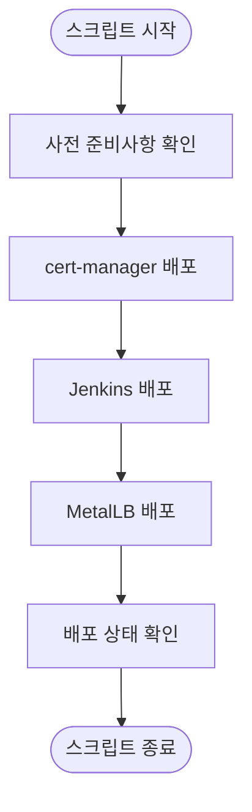
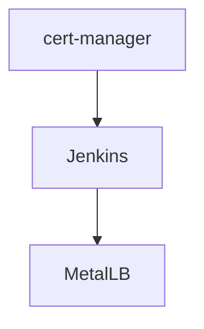

# 인프라 및 도구 배포

<cite>
**이 문서에서 참조한 파일**   
- [deploy-libraries.sh](file://scripts/deploy-libraries.sh)
- [README.md](file://README.md)
- [cert-manager/Chart.yaml](file://helm/cluster-services/cert-manager/Chart.yaml)
- [cert-manager/values.yaml](file://helm/cluster-services/cert-manager/values.yaml)
- [metallb/metallb-native.yaml](file://helm/cluster-services/metallb/metallb-native.yaml)
- [metallb/pool-1.yaml](file://helm/cluster-services/metallb/pool-1.yaml)
- [jenkins/Chart.yaml](file://helm/development-tools/jenkins/Chart.yaml)
- [jenkins/values.yaml](file://helm/development-tools/jenkins/values.yaml)
- [argocd/Chart.yaml](file://helm/development-tools/argocd/Chart.yaml)
- [argocd/values.yaml](file://helm/development-tools/argocd/values.yaml)
- [grafana/Chart.yaml](file://helm/development-tools/grafana/Chart.yaml)
- [prometheus/Chart.yaml](file://helm/development-tools/prometheus/Chart.yaml)
- [harbor/Chart.yaml](file://helm/development-tools/harbor/Chart.yaml)
- [kubernetes-dashboard/Chart.yaml](file://helm/development-tools/kubernetes-dashboard/Chart.yaml)
</cite>

## 목차
1. [소개](#소개)
2. [스크립트 실행 절차](#스크립트-실행-절차)
3. [내부 동작 원리](#내부-동작-원리)
4. [로그 해석](#로그-해석)
5. [구성 요소 역할 및 배포 순서](#구성-요소-역할-및-배포-순서)
6. [실패 시 재시도 및 오류 해결](#실패-시-재시도-및-오류-해결)
7. [성공 후 확인 리소스](#성공-후-확인-리소스)
8. [결론](#결론)

## 소개
`deploy-libraries.sh` 스크립트는 클러스터 레벨 서비스(cert-manager, MetalLB, nfs-provisioner)와 개발 도구(ArgoCD, Harbor, Grafana, Prometheus, Jenkins 등)를 배포하는 자동화된 절차를 제공합니다. 이 문서는 스크립트의 실행 단계, 내부 동작 원리, 로그 해석 방법, 각 구성 요소의 역할과 배포 순서, 실패 시 재시도 방법 및 주요 오류 코드에 대한 해결 방안을 상세히 설명합니다. 또한 성공적인 배포 후 확인해야 할 리소스 목록을 안내합니다.

## 스크립트 실행 절차
`deploy-libraries.sh` 스크립트는 다음과 같은 순서로 실행됩니다:

1. **사전 준비사항 확인**: Helm과 kubectl이 설치되어 있고, Kubernetes 클러스터에 연결할 수 있는지 확인합니다.
2. **cert-manager 배포**: Jetstack 저장소를 추가하고, cert-manager CRDs를 설치한 후, cert-manager를 설치합니다.
3. **Jenkins 배포**: Jenkins Helm 차트를 사용하여 Jenkins를 설치합니다.
4. **MetalLB 배포**: MetalLB 저장소를 추가하고, MetalLB를 설치한 후, 구성 파일을 적용합니다.
5. **배포 상태 확인**: 각 네임스페이스에서 Pod 상태를 확인하여 배포 성공 여부를 검증합니다.

```bash
./scripts/deploy-libraries.sh
```

**Section sources**
- [deploy-libraries.sh](file://scripts/deploy-libraries.sh#L105-L128)

## 내부 동작 원리
`deploy-libraries.sh` 스크립트는 다음과 같은 내부 동작 원리를 가지고 있습니다:

- **Helm 저장소 관리**: 필요한 Helm 저장소를 추가하고, 저장소 정보를 업데이트합니다.
- **CRDs 설치**: cert-manager와 같은 컴포넌트는 CRDs(Custom Resource Definitions)를 필요로 하므로, 먼저 CRDs를 설치합니다.
- **Helm 차트 설치**: 각 컴포넌트의 Helm 차트를 사용하여 설치합니다. `--install` 옵션을 사용하여 이미 설치된 경우에도 업데이트합니다.
- **구성 파일 적용**: MetalLB와 같은 컴포넌트는 추가적인 구성 파일이 필요하므로, `kubectl apply` 명령어를 사용하여 적용합니다.
- **상태 대기**: 설치 후, 컴포넌트가 준비 상태가 될 때까지 대기합니다.



**Diagram sources**
- [deploy-libraries.sh](file://scripts/deploy-libraries.sh#L43-L102)

## 로그 해석
`deploy-libraries.sh` 스크립트는 실행 중 다양한 로그 메시지를 출력합니다. 주요 로그 메시지의 의미는 다음과 같습니다:

- **[INFO]**: 정보 메시지로, 현재 진행 중인 작업을 알려줍니다.
- **[WARN]**: 경고 메시지로, 주의가 필요한 상황을 알려줍니다.
- **[ERROR]**: 오류 메시지로, 문제가 발생했음을 알려줍니다.

예를 들어, cert-manager 설치 중 다음과 같은 로그가 출력될 수 있습니다:
```
[INFO] Deploying cert-manager...
[INFO] cert-manager deployed successfully
```

**Section sources**
- [deploy-libraries.sh](file://scripts/deploy-libraries.sh#L15-L25)

## 구성 요소 역할 및 배포 순서
`deploy-libraries.sh` 스크립트는 다음과 같은 구성 요소들을 배포하며, 각 요소의 역할은 다음과 같습니다:

- **cert-manager**: SSL/TLS 인증서를 자동으로 관리하고, Let's Encrypt와 같은 인증 기관과 통신하여 인증서를 발급받습니다.
- **Jenkins**: CI/CD 파이프라인을 구축하고, 코드 빌드, 테스트, 배포를 자동화합니다.
- **MetalLB**: Kubernetes 클러스터 내에서 LoadBalancer 유형의 서비스를 제공하여, 외부 트래픽을 클러스터 내부로 라우팅합니다.

배포 순서는 다음과 같습니다:
1. **cert-manager**
2. **Jenkins**
3. **MetalLB**



**Diagram sources**
- [deploy-libraries.sh](file://scripts/deploy-libraries.sh#L113-L115)

## 실패 시 재시도 및 오류 해결
`deploy-libraries.sh` 스크립트 실행 중 오류가 발생할 경우, 다음과 같은 방법으로 재시도하고 오류를 해결할 수 있습니다:

- **Helm 미설치**: Helm이 설치되어 있지 않으면, 먼저 Helm을 설치해야 합니다.
- **kubectl 연결 실패**: kubectl이 Kubernetes 클러스터에 연결할 수 없으면, kubeconfig 파일을 확인하고, 클러스터에 접근할 수 있는지 확인합니다.
- **cert-manager 설치 실패**: cert-manager CRDs 설치에 실패하면, 네트워크 연결을 확인하고, GitHub 저장소에 접근할 수 있는지 확인합니다.
- **MetalLB 구성 실패**: MetalLB 구성 파일 적용에 실패하면, 파일 경로와 내용을 확인하고, YAML 구문 오류가 없는지 확인합니다.

**Section sources**
- [deploy-libraries.sh](file://scripts/deploy-libraries.sh#L28-L40)

## 성공 후 확인 리소스
`deploy-libraries.sh` 스크립트가 성공적으로 실행된 후, 다음 리소스들을 확인해야 합니다:

- **cert-manager 네임스페이스**: `kubectl get pods -n cert-manager` 명령어를 사용하여 Pod 상태를 확인합니다.
- **Jenkins 네임스페이스**: `kubectl get pods -n jenkins` 명령어를 사용하여 Pod 상태를 확인합니다.
- **MetalLB 네임스페이스**: `kubectl get pods -n metallb-system` 명령어를 사용하여 Pod 상태를 확인합니다.

```bash
kubectl get pods -n cert-manager
kubectl get pods -n jenkins
kubectl get pods -n metallb-system
```

**Section sources**
- [deploy-libraries.sh](file://scripts/deploy-libraries.sh#L122-L124)

## 결론
`deploy-libraries.sh` 스크립트는 클러스터 레벨 서비스와 개발 도구를 자동으로 배포하는 강력한 도구입니다. 이 문서를 통해 스크립트의 실행 절차, 내부 동작 원리, 로그 해석 방법, 구성 요소의 역할과 배포 순서, 실패 시 재시도 방법 및 주요 오류 코드에 대한 해결 방안을 이해할 수 있습니다. 성공적인 배포 후에는 확인 리소스 목록을 통해 배포 상태를 검증할 수 있습니다.