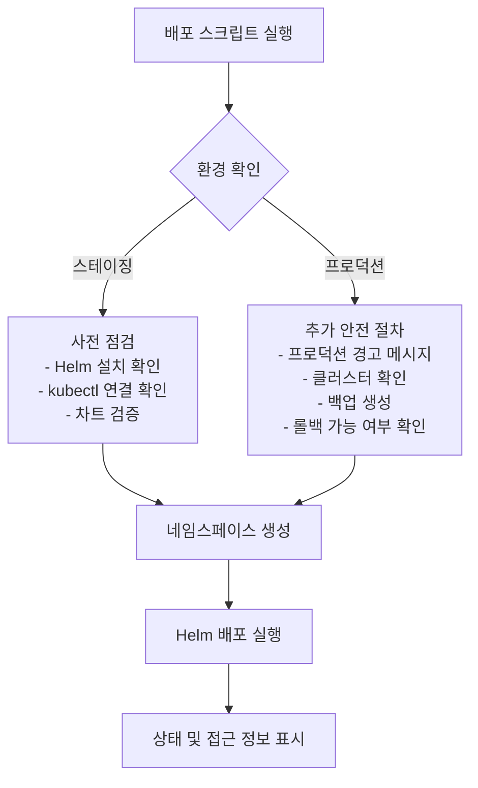
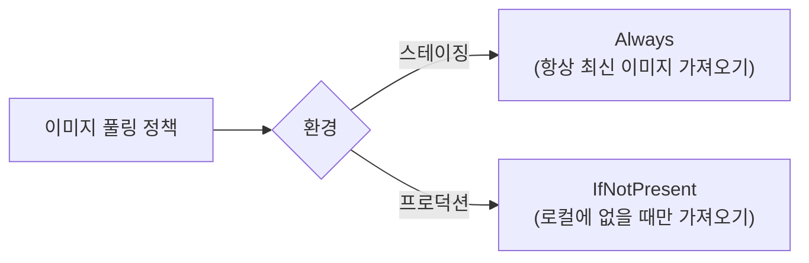
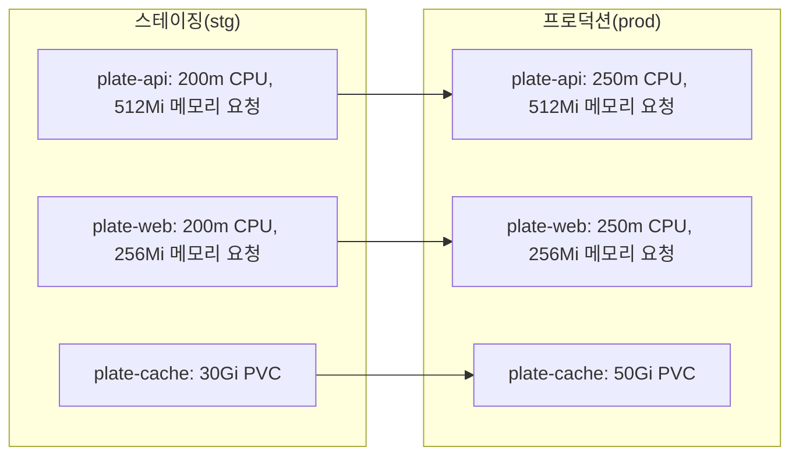
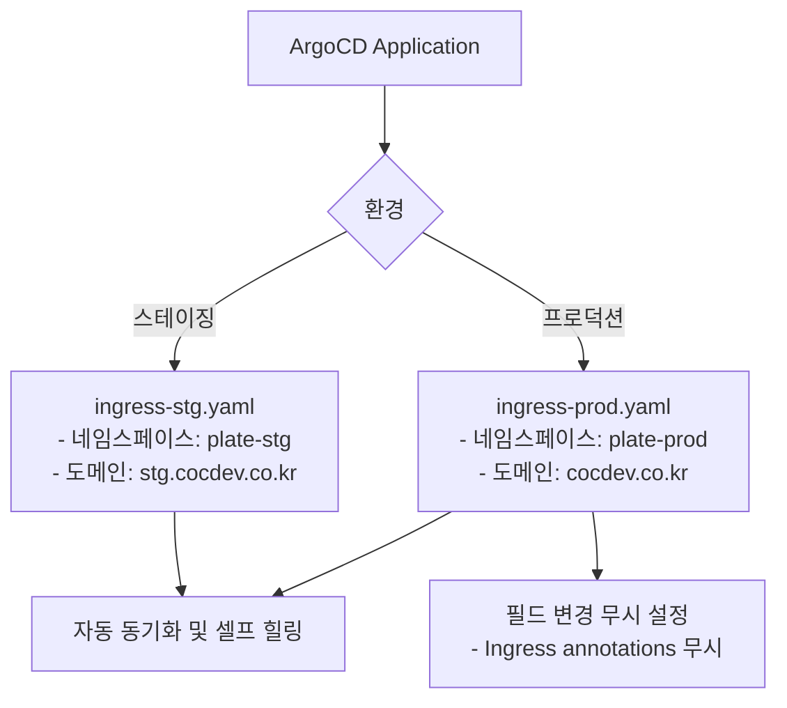
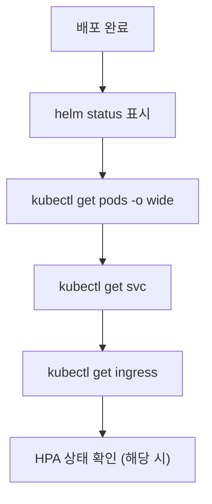
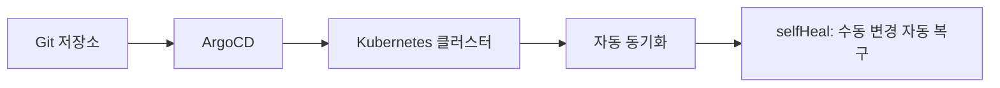

# 환경별 배포

<cite>
**이 문서에서 참조한 파일**  
- [deploy-stg.sh](file://scripts/deploy-stg.sh)
- [deploy-prod.sh](file://scripts/deploy-prod.sh)
- [values-stg.yaml](file://helm/applications/plate-api/values-stg.yaml)
- [values-prod.yaml](file://helm/applications/plate-api/values-prod.yaml)
- [plate-web/values-stg.yaml](file://helm/applications/plate-web/values-stg.yaml)
- [plate-web/values-prod.yaml](file://helm/applications/plate-web/values-prod.yaml)
- [plate-cache/values-stg.yaml](file://helm/applications/plate-cache/values-stg.yaml)
- [plate-cache/values-prod.yaml](file://helm/applications/plate-cache/values-prod.yaml)
- [plate-llm/values-stg.yaml](file://helm/applications/plate-llm/values-stg.yaml)
- [ingress-stg.yaml](file://environments/argocd/apps/ingress-stg.yaml)
- [ingress-prod.yaml](file://environments/argocd/apps/ingress-prod.yaml)
- [cluster-issuer-staging.yaml](file://helm/cluster-services/cert-manager/templates/cluster-issuer-staging.yaml)
- [cluster-issuer-prod.yaml](file://helm/cluster-services/cert-manager/templates/cluster-issuer-prod.yaml)
</cite>

## 목차
1. [소개](#소개)
2. [스크립트 비교 분석](#스크립트-비교-분석)
3. [환경별 values 파일 구성 차이](#환경별-values-파일-구성-차이)
4. [리소스 할당 및 성능 설정](#리소스-할당-및-성능-설정)
5. [보안 및 인그레스 구성](#보안-및-인그레스-구성)
6. [네임스페이스 및 레이블 관리](#네임스페이스-및-레이블-관리)
7. [배포 후 검증 및 상태 확인](#배포-후-검증-및-상태-확인)
8. [롤백 및 삭제 전략](#롤백-및-삭제-전략)
9. [환경 간 구성 일관성 유지](#환경-간-구성-일관성-유지)
10. [운영 정책 및 배포 가이드](#운영-정책-및-배포-가이드)

## 소개
이 문서는 스테이징(stg) 및 프로덕션(prod) 환경에서 애플리케이션을 배포하는 절차를 비교 분석합니다. 각 환경의 목적과 운영 정책에 따라 배포 스크립트, Helm values 파일, 리소스 할당, 보안 설정, 인그레스 구성 등의 차이점을 설명하며, 구성 일관성 유지 방법과 배포 후 검증 절차를 안내합니다.

## 스크립트 비교 분석

### 배포 스크립트 개요
스테이징 및 프로덕션 환경의 배포는 각각 `deploy-stg.sh`와 `deploy-prod.sh` 스크립트를 통해 수행됩니다. 두 스크립트는 유사한 구조를 가지지만, 프로덕션 환경의 경우 추가적인 안전 장치와 검증 절차를 포함하고 있습니다.

**스크립트 소스**
- [deploy-stg.sh](file://scripts/deploy-stg.sh#L1-L173)
- [deploy-prod.sh](file://scripts/deploy-prod.sh#L1-L299)

### 주요 차이점
- **안전성 확인**: 프로덕션 스크립트는 사용자 확인 절차(`confirm_production_deploy`)와 클러스터 이름 검증을 포함합니다.
- **백업 생성**: 프로덕션 배포 시 이전 배포 상태를 백업합니다.
- **롤백 지원**: 프로덕션 환경은 `rollback` 명령어를 통해 이전 버전으로 되돌릴 수 있습니다.
- **삭제 제한**: 프로덕션 환경의 삭제는 수동으로만 허용되어 실수로 인한 삭제를 방지합니다.

**스크립트 소스**
- [deploy-stg.sh](file://scripts/deploy-stg.sh#L154-L173)
- [deploy-prod.sh](file://scripts/deploy-prod.sh#L269-L299)

## 환경별 values 파일 구성 차이

### 이미지 관리 정책
스테이징과 프로덕션 환경은 컨테이너 이미지 관리에서 서로 다른 전략을 사용합니다.

| 항목 | 스테이징(stg) | 프로덕션(prod) |
|------|---------------|----------------|
| **이미지 태그** | `latest` | `latest` |
| **pullPolicy** | `Always` | `IfNotPresent` |
| **이미지 레지스트리** | Harbor | Harbor |
| **버전 관리** | 최신 빌드 항상 가져오기 | 캐시된 이미지 우선 사용 |

**스크립트 소스**
- [plate-api/values-stg.yaml](file://helm/applications/plate-api/values-stg.yaml#L7-L10)
- [plate-api/values-prod.yaml](file://helm/applications/plate-api/values-prod.yaml#L7-L10)

### 프론트엔드 서버 설정 차이
프론트엔드 서버의 경우 프로덕션 환경에서 더 엄격한 버전 관리를 시행합니다.

| 항목 | 스테이징(stg) | 프로덕션(prod) |
|------|---------------|----------------|
| **nginx 버전** | `latest` | `1.25` |
| **backend 리소스** | 명시적 설정 | 주석 처리됨 |
| **목적** | 최신 기능 테스트 | 안정성 보장 |

**스크립트 소스**
- [plate-web/values-stg.yaml](file://helm/applications/plate-web/values-stg.yaml#L7-L10)
- [plate-web/values-prod.yaml](file://helm/applications/plate-web/values-prod.yaml#L7-L10)

## 리소스 할당 및 성능 설정

### 컴퓨팅 리소스 비교
각 환경의 리소스 요청 및 제한 설정은 다음과 같습니다.

**스크립트 소스**
- [plate-api/values-stg.yaml](file://helm/applications/plate-api/values-stg.yaml#L21-L27)
- [plate-api/values-prod.yaml](file://helm/applications/plate-api/values-prod.yaml#L22-L28)
- [plate-web/values-stg.yaml](file://helm/applications/plate-web/values-stg.yaml#L29-L35)
- [plate-web/values-prod.yaml](file://helm/applications/plate-web/values-prod.yaml#L30-L36)
- [plate-cache/values-stg.yaml](file://helm/applications/plate-cache/values-stg.yaml#L8)
- [plate-cache/values-prod.yaml](file://helm/applications/plate-cache/values-prod.yaml#L8)

### PVC 용량 차이
컨테이너 빌드 캐시를 위한 PVC의 경우 프로덕션 환경에서 더 큰 용량을 할당합니다.

| 환경 | PVC 용량 | 스토리지 클래스 | 목적 |
|------|---------|----------------|------|
| 스테이징 | 30Gi | openebs-hostpath | 개발 및 테스트 |
| 프로덕션 | 50Gi | openebs-hostpath | 고성능 빌드 처리 |

**스크립트 소스**
- [plate-cache/values-stg.yaml](file://helm/applications/plate-cache/values-stg.yaml#L8)
- [plate-cache/values-prod.yaml](file://helm/applications/plate-cache/values-prod.yaml#L8)

## 보안 및 인그레스 구성

### 인그레스 설정 차이
인그레스 컨트롤러는 ArgoCD를 통해 관리되며, 환경별로 다른 설정을 사용합니다.

**스크립트 소스**
- [ingress-stg.yaml](file://environments/argocd/apps/ingress-stg.yaml#L35)
- [ingress-prod.yaml](file://environments/argocd/apps/ingress-prod.yaml#L35)

### 인증서 발급 설정
cert-manager를 통한 TLS 인증서 발급은 환경별로 별도의 ClusterIssuer를 사용합니다.

| 구성 요소 | 스테이징 | 프로덕션 |
|----------|--------|---------|
| **ClusterIssuer 파일** | cluster-issuer-staging.yaml | cluster-issuer-prod.yaml |
| **ACME 서버** | Let's Encrypt Staging | Let's Encrypt Production |
| **목적** | 테스트용 인증서 | 실제 서비스용 인증서 |

**스크립트 소스**
- [cluster-issuer-staging.yaml](file://helm/cluster-services/cert-manager/templates/cluster-issuer-staging.yaml)
- [cluster-issuer-prod.yaml](file://helm/cluster-services/cert-manager/templates/cluster-issuer-prod.yaml)

### LLM 서비스 인그레스 보안
LLM 서비스의 경우 스테이징 환경에서만 HTTP 리다이렉트를 비활성화합니다.

| 설정 | 값 | 설명 |
|------|----|------|
| `ingress.kubernetes.io/ssl-redirect` | `false` (stg), `true` (prod 기본값) | HTTPS 강제 여부 |
| `cert-manager.io/cluster-issuer` | `letsencrypt-prod` | 프로덕션 인증서 발급자 사용 |

**스크립트 소스**
- [plate-llm/values-stg.yaml](file://helm/applications/plate-llm/values-stg.yaml#L23-L25)
- [plate-llm/values.yaml](file://helm/applications/plate-llm/values.yaml#L48-L49)

## 네임스페이스 및 레이블 관리

### 네임스페이스 생성 및 레이블
배포 스크립트는 각 환경에 맞는 네임스페이스를 생성하고 레이블을 적용합니다.

| 환경 | 네임스페이스 | 레이블 |
|------|-------------|--------|
| 스테이징 | fe-web-stg | environment=development |
| 프로덕션 | fe-web-prod | environment=production |

**스크립트 소스**
- [deploy-stg.sh](file://scripts/deploy-stg.sh#L74)
- [deploy-prod.sh](file://scripts/deploy-prod.sh#L144)

## 배포 후 검증 및 상태 확인

### 상태 확인 절차
각 환경의 상태 확인은 유사한 절차를 따르지만, 프로덕션 환경에서 더 상세한 정보를 제공합니다.

**스크립트 소스**
- [deploy-stg.sh](file://scripts/deploy-stg.sh#L91-L113)
- [deploy-prod.sh](file://scripts/deploy-prod.sh#L192-L218)

### 접근 정보 표시
접근 가능한 엔드포인트 정보를 사용자에게 제공합니다.

| 환경 | 웹 애플리케이션 | 관리자 인터페이스 |
|------|----------------|------------------|
| 스테이징 | https://[host] | https://[admin-host] (존재 시) |
| 프로덕션 | https://[host], https://www.[host] | https://[admin-host] (존재 시) |

**스크립트 소스**
- [deploy-stg.sh](file://scripts/deploy-stg.sh#L115-L131)
- [deploy-prod.sh](file://scripts/deploy-prod.sh#L220-L237)

## 롤백 및 삭제 전략

### 롤백 절차
프로덕션 환경은 안전한 롤백을 지원합니다.

**스크립트 소스**
- [deploy-prod.sh](file://scripts/deploy-prod.sh#L277-L282)

### 삭제 정책
삭제 작업에 대한 접근 제어는 환경에 따라 다릅니다.

| 환경 | 삭제 가능 여부 | 방법 |
|------|----------------|------|
| 스테이징 | 가능 | `deploy-stg.sh delete` |
| 프로덕션 | 제한 | 수동 Helm 명령어 필요 |

**스크립트 소스**
- [deploy-stg.sh](file://scripts/deploy-stg.sh#L161-L165)
- [deploy-prod.sh](file://scripts/deploy-prod.sh#L283-L286)

## 환경 간 구성 일관성 유지

### 공통 설정 관리
공통된 설정은 별도의 파일로 관리하여 일관성을 유지합니다.

| 공통 설정 파일 | 목적 |
|----------------|------|
| `environments/shared/common-values.yaml` | 스테이징과 프로덕션 모두에서 공유되는 기본 설정 |

**스크립트 소스**
- [deploy-stg.sh](file://scripts/deploy-stg.sh#L20)
- [deploy-prod.sh](file://scripts/deploy-prod.sh#L20)

### Git 기반 구성 관리
ArgoCD를 통한 GitOps 방식으로 구성 일관성을 보장합니다.

**스크립트 소스**
- [ingress-stg.yaml](file://environments/argocd/apps/ingress-stg.yaml#L38-L43)
- [ingress-prod.yaml](file://environments/argocd/apps/ingress-prod.yaml#L38-L43)

## 운영 정책 및 배포 가이드

### 환경별 목적
| 환경 | 목적 | 접근 제어 | 변경 빈도 |
|------|------|-----------|-----------|
| 스테이징 | 개발 및 테스트 | 개발자 중심 | 높음 |
| 프로덕션 | 실서비스 제공 | 제한된 접근 | 낮음 |

### 권장 배포 절차
1. **스테이징 배포**: `./scripts/deploy-stg.sh deploy`
2. **검증 수행**: 기능 및 성능 테스트
3. **프로덕션 배포**: `./scripts/deploy-prod.sh deploy`
4. **최종 검증**: 실환경 동작 확인
5. **모니터링**: Prometheus/Grafana를 통한 지속적 모니터링

### 환경 변수를 통한 제어
프로덕션 배포는 환경 변수를 통해 동작을 제어할 수 있습니다.

| 환경 변수 | 기본값 | 설명 |
|----------|--------|------|
| `DRY_RUN` | false | 실제 변경 없이 실행 가능 |
| `SKIP_BACKUP` | false | 백업 생성 생략 가능 |

**스크립트 소스**
- [deploy-prod.sh](file://scripts/deploy-prod.sh#L23-L24)