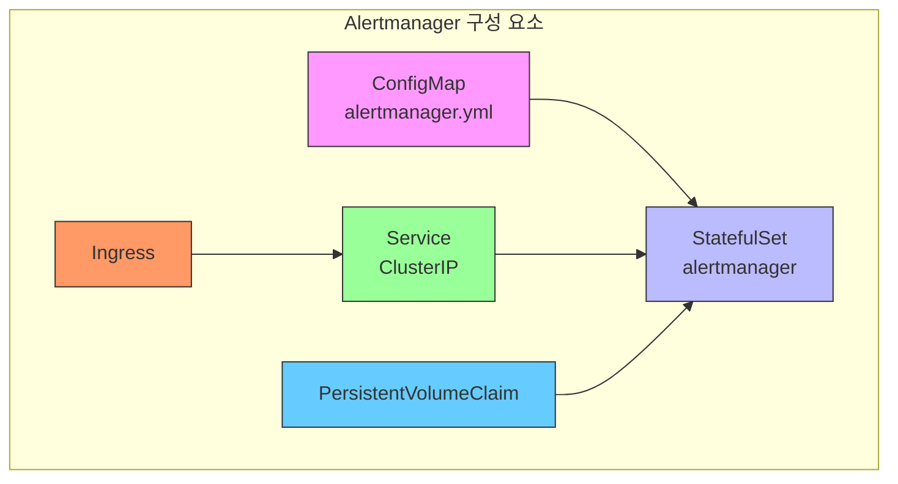
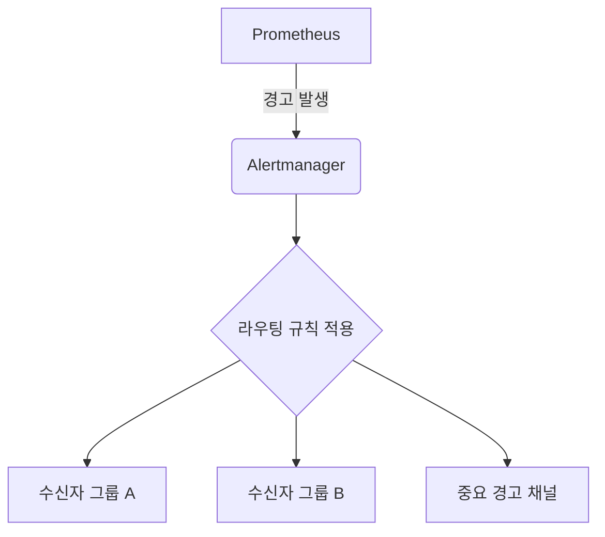
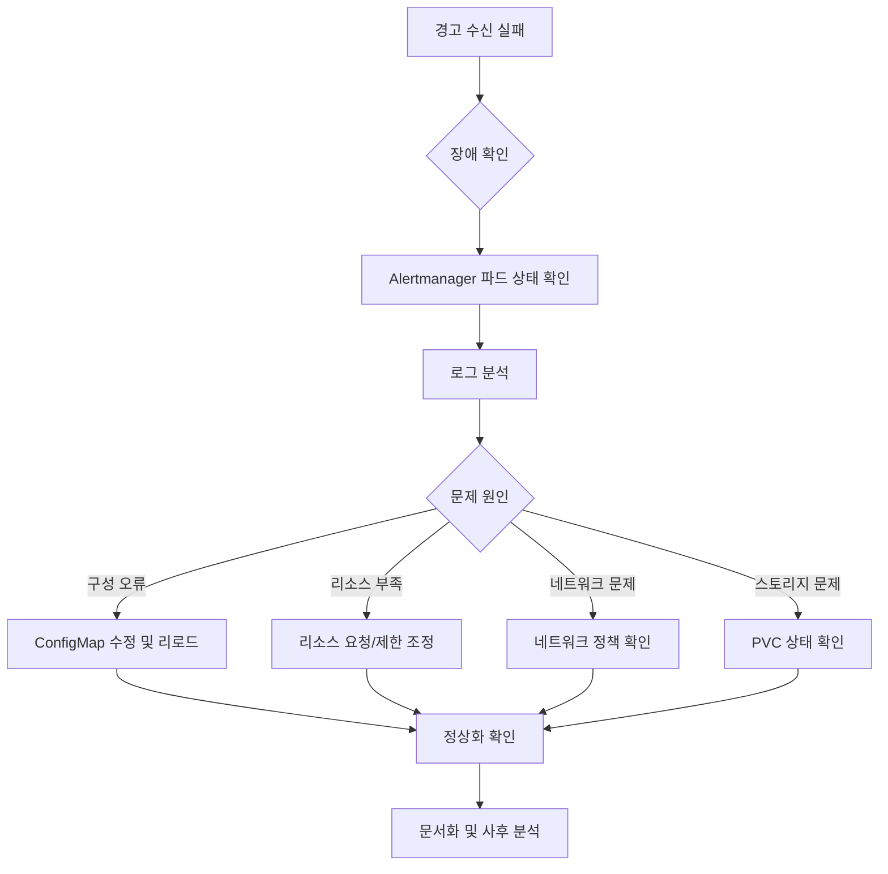

# 경고 관리

<cite>
**이 문서에서 참조한 파일**  
- [values.yaml](file://helm/development-tools/prometheus/charts/alertmanager/values.yaml)
- [configmap.yaml](file://helm/development-tools/prometheus/charts/alertmanager/templates/configmap.yaml)
- [statefulset.yaml](file://helm/development-tools/prometheus/charts/alertmanager/templates/statefulset.yaml)
- [values.schema.json](file://helm/development-tools/prometheus/charts/alertmanager/values.schema.json)
- [prometheus/charts/alertmanager](file://helm/development-tools/prometheus/charts/alertmanager)
</cite>

## 목차
1. [소개](#소개)
2. [프로메테우스 Alertmanager 개요](#프로메테우스-alertmanager-개요)
3. [Alert Rule 정의](#alert-rule-정의)
4. [라우팅 전략 구성](#라우팅-전략-구성)
5. [수신자 설정](#수신자-설정)
6. [중복 경고 억제](#중복-경고-억제)
7. [보안 설정](#보안-설정)
8. [경고 테스트 방법](#경고-테스트-방법)
9. [장애 대응 워크플로우](#장애-대응-워크플로우)
10. [결론](#결론)

## 소개
이 문서는 Prometheus Alertmanager를 활용한 경고 관리 시스템의 설정과 운영 방법을 상세히 설명합니다. Helm 기반의 values.yaml 및 설정 파일을 중심으로 alert rule 정의, 라우팅 전략, 수신자 설정(이메일, 슬랙 등), 중복 경고 억제, 보안 설정 등 핵심 기능을 다루며, 경고 테스트 방법과 장애 대응 워크플로우도 포함합니다.

**이 섹션은 특정 소스 파일을 분석하지 않으므로 소스 정보가 필요하지 않습니다.**

## 프로메테우스 Alertmanager 개요
Prometheus Alertmanager는 경고를 수신하고, 중복을 억제하며, 라우팅 규칙에 따라 적절한 수신자에게 전달하는 역할을 수행합니다. 이 시스템은 Kubernetes 환경에서 Helm 차트를 통해 배포되며, `helm/development-tools/prometheus/charts/alertmanager` 디렉터리 내의 설정 파일들을 기반으로 구성됩니다.

Alertmanager는 StatefulSet으로 배포되며, 영구 저장소(PVC)를 사용하여 상태를 유지합니다. 설정은 ConfigMap을 통해 관리되며, 설정 변경 시 자동으로 리로드됩니다. 주요 구성 요소는 다음과 같습니다:
- **ConfigMap**: `alertmanager.yml` 설정 파일을 포함
- **StatefulSet**: Alertmanager 파드를 관리
- **Service**: 내부 및 외부 접근을 위한 서비스
- **Ingress**: 외부 URL을 통한 접근 지원



**Diagram sources**
- [configmap.yaml](file://helm/development-tools/prometheus/charts/alertmanager/templates/configmap.yaml)
- [statefulset.yaml](file://helm/development-tools/prometheus/charts/alertmanager/templates/statefulset.yaml)

**Section sources**
- [values.yaml](file://helm/development-tools/prometheus/charts/alertmanager/values.yaml#L1-L441)

## Alert Rule 정의
Alert Rule은 Prometheus에서 특정 조건을 충족할 때 경고를 생성하도록 정의하는 규칙입니다. 이 규칙은 일반적으로 `PrometheusRule` 커스텀 리소스로 정의되며, Helm 차트의 `values.yaml` 파일을 통해 관리됩니다.

Alertmanager 자체는 경고를 생성하지 않으며, Prometheus 서버에서 생성된 경고를 수신하여 처리합니다. 따라서 Alert Rule은 Prometheus 쪽에서 정의되지만, Alertmanager는 이 경고를 어떻게 라우팅하고 처리할지 결정합니다.



**Diagram sources**
- [values.yaml](file://helm/development-tools/prometheus/charts/alertmanager/values.yaml#L313-L332)

**Section sources**
- [values.yaml](file://helm/development-tools/prometheus/charts/alertmanager/values.yaml#L313-L332)

## 라우팅 전략 구성
Alertmanager의 라우팅 전략은 `route` 섹션에서 정의되며, 경고를 어떤 수신자에게 어떻게 전달할지 결정합니다. 라우팅은 계층적 구조를 가지며, `matchers` 기반으로 경고를 필터링하고, `group_by`로 그룹화하며, `receiver`를 통해 전달 대상을 지정합니다.

주요 라우팅 설정 항목:
- **group_wait**: 그룹화된 경고를 처음 전송하기 전 대기 시간
- **group_interval**: 동일 그룹에 새 경고가 추가되었을 때 재전송 간격
- **repeat_interval**: 해결되지 않은 경고의 재전송 주기
- **matchers**: 경고 레이블 기반 필터링 조건
- **routes**: 하위 라우팅 규칙 정의

```yaml
route:
  group_wait: 10s
  group_interval: 5m
  repeat_interval: 3h
  receiver: default-receiver
  routes:
    - matchers:
        - severity=critical
      receiver: critical-team
    - matchers:
        - job=database
      receiver: db-team
```

**Section sources**
- [values.yaml](file://helm/development-tools/prometheus/charts/alertmanager/values.yaml#L327-L331)
- [values.schema.json](file://helm/development-tools/prometheus/charts/alertmanager/values.schema.json#L164-L225)

## 수신자 설정
수신자(receiver)는 경고를 수신할 대상(이메일, 슬랙, 웹훅 등)을 정의합니다. `receivers` 배열 내에서 각 수신자의 이름과 통합 설정을 지정합니다.

현재 설정에서는 기본 수신자만 정의되어 있으며, 슬랙 통합은 주석 처리된 상태입니다. 실제 운영 환경에서는 다음과 같은 수신자를 구성할 수 있습니다:
- **Slack**: `slack_configs`를 통해 채널 또는 사용자에게 메시지 전송
- **Email**: `email_configs`를 통해 이메일 알림
- **Webhook**: 외부 시스템과의 연동을 위한 HTTP 콜백

```yaml
receivers:
  - name: default-receiver
    # slack_configs:
    #   - channel: '@you'
    #     send_resolved: true
```

**Section sources**
- [values.yaml](file://helm/development-tools/prometheus/charts/alertmanager/values.yaml#L321-L326)

## 중복 경고 억제
Alertmanager는 `inhibit_rules`를 통해 중복 경고를 억제할 수 있습니다. 예를 들어, 시스템 다운 경고가 발생한 경우, 관련된 CPU, 메모리 등 하위 경고를 억제하여 경고 폭주를 방지할 수 있습니다.

현재 설정 파일에는 억제 규칙이 정의되어 있지 않지만, 필요 시 `inhibit_rules` 섹션을 추가하여 다음과 같은 규칙을 구성할 수 있습니다:

```yaml
inhibit_rules:
  - source_matchers:
      - severity=critical
    target_matchers:
      - severity=warning
    equal:
      - alertname
      - cluster
```

이는 중대한 경고가 발생하면 동일한 알림 이름과 클러스터에 대한 경고 수준이 낮은 경고를 억제합니다.

**Section sources**
- [values.yaml](file://helm/development-tools/prometheus/charts/alertmanager/values.yaml)

## 보안 설정
Alertmanager는 Pod 보안 컨텍스트를 통해 보안을 강화합니다. 주요 보안 설정은 다음과 같습니다:

- **runAsNonRoot**: 루트 사용자로 실행 방지
- **runAsUser**: 사용자 ID 65534로 실행
- **fsGroup**: 파일 시스템 그룹 ID 65534
- **readOnlyRootFilesystem**: 읽기 전용 루트 파일시스템 (현재 주석 처리)

또한, 비밀 정보(예: 슬랙 웹훅 URL)는 별도의 Secret으로 관리되며, `extraSecretMounts`를 통해 마운트할 수 있습니다. Vault와 같은 외부 비밀 관리 도구와 통합하여 `vault.security.banzaicloud.io/vault-role` 어노테이션을 사용할 수 있습니다.

```yaml
securityContext:
  runAsUser: 65534
  runAsNonRoot: true
  runAsGroup: 65534
  fsGroup: 65534
```

**Section sources**
- [values.yaml](file://helm/development-tools/prometheus/charts/alertmanager/values.yaml#L82-L89)
- [values.schema.json](file://helm/development-tools/prometheus/charts/alertmanager/values.schema.json#L22-L37)

## 경고 테스트 방법
Alertmanager의 경고 테스트는 다음과 같은 절차로 수행할 수 있습니다:

1. **임시 Alert Rule 생성**: Prometheus에 테스트용 규칙 추가
2. **수동 경고 발생**: `curl` 명령어로 Alertmanager에 직접 경고 전송
3. **UI 확인**: Alertmanager 웹 인터페이스에서 경고 수신 여부 확인
4. **수신자 확인**: 슬랙, 이메일 등 실제 수신 채널에서 알림 수신 확인

예시: 수동 경고 전송
```bash
curl -X POST http://alertmanager:9093/api/v2/alerts \
  -H "Content-Type: application/json" \
  -d '[{"labels":{"alertname":"TestAlert","severity":"warning"},"annotations":{"summary":"테스트 경고"}}]'
```

**Section sources**
- [values.yaml](file://helm/development-tools/prometheus/charts/alertmanager/values.yaml)

## 장애 대응 워크플로우
Alertmanager 장애 발생 시 대응 워크플로우는 다음과 같습니다:



주요 점검 항목:
- 파드 상태 및 재시작 횟수
- `/alertmanager` 볼륨의 디스크 사용량
- 네트워크 정책에 의한 접근 차단 여부
- 설정 파일의 구문 오류

**Diagram sources**
- [statefulset.yaml](file://helm/development-tools/prometheus/charts/alertmanager/templates/statefulset.yaml)
- [configmap.yaml](file://helm/development-tools/prometheus/charts/alertmanager/templates/configmap.yaml)

**Section sources**
- [statefulset.yaml](file://helm/development-tools/prometheus/charts/alertmanager/templates/statefulset.yaml)
- [configmap.yaml](file://helm/development-tools/prometheus/charts/alertmanager/templates/configmap.yaml)

## 결론
Prometheus Alertmanager는 효과적인 경고 관리를 위한 핵심 구성 요소입니다. Helm을 통한 선언적 설정을 통해 라우팅, 수신자, 보안 등을 체계적으로 관리할 수 있으며, 중복 억제 및 테스트 절차를 통해 운영 안정성을 확보할 수 있습니다. 정기적인 장애 대응 훈련과 문서화를 통해 SRE 문화를 정착시켜야 합니다.

**이 섹션은 요약이므로 소스 정보가 필요하지 않습니다.**