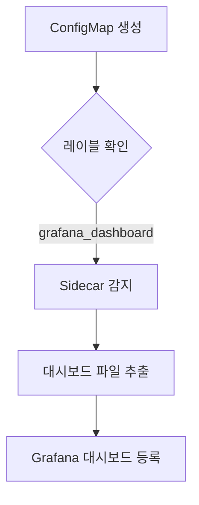

# 대시보드 시각화

<cite>
**이 문서에서 참조한 파일**   
- [values.yaml](file://helm/development-tools/grafana/values.yaml)
- [grafana/templates/dashboards-json-configmap.yaml](file://helm/development-tools/grafana/templates/dashboards-json-configmap.yaml)
- [grafana/templates/configmap-dashboard-provider.yaml](file://helm/development-tools/grafana/templates/configmap-dashboard-provider.yaml)
- [grafana/templates/_config.tpl](file://helm/development-tools/grafana/templates/_config.tpl)
- [grafana/templates/_pod.tpl](file://helm/development-tools/grafana/templates/_pod.tpl)
- [grafana/README.md](file://helm/development-tools/grafana/README.md)
- [fluentd.json](file://helm/development-tools/fluentd/dashboards/fluentd.json)
</cite>

## 목차
1. [소개](#소개)
2. [데이터 소스 설정](#데이터-소스-설정)
3. [대시보드 임포트 및 커스터마이징](#대시보드-임포트-및-커스터마이징)
4. [변수 활용](#변수-활용)
5. [패널 구성 방법](#패널-구성-방법)
6. [사용자 인증 및 RBAC 설정](#사용자-인증-및-rbac-설정)
7. [대시보드 템플릿화 및 자동화 배포 전략](#대시보드-템플릿화-및-자동화-배포-전략)

## 소개
Grafana는 시계열 데이터 및 메트릭을 시각화하기 위한 대표적인 웹 대시보드 시스템입니다. 본 문서에서는 Helm 차트 기반의 Grafana 설정을 통해 Prometheus 데이터 소스를 연결하고, 대시보드를 임포트하며, 변수를 활용한 동적 시각화를 수행하는 방법을 설명합니다. 또한 사용자 인증, RBAC 설정, 대시보드 템플릿화 및 자동화된 배포 전략까지 포괄적으로 다룹니다.

## 데이터 소스 설정
Grafana에서 데이터 소스를 설정하기 위해 `values.yaml` 파일 내 `datasources` 섹션을 구성합니다. 이 설정은 Grafana의 프로비저닝 기능을 통해 실행 시 자동으로 데이터 소스를 추가합니다.

```yaml
datasources:
  datasources.yaml:
    apiVersion: 1
    datasources:
      - name: Prometheus
        type: prometheus
        url: http://prometheus-prometheus-server
        access: proxy
        isDefault: true
```

이 설정은 Prometheus를 기본 데이터 소스로 등록하며, Grafana 서버가 프록시를 통해 Prometheus에 접근할 수 있도록 구성합니다. `url` 값은 클러스터 내 서비스 이름을 기반으로 설정됩니다.

**Section sources**
- [values.yaml](file://helm/development-tools/grafana/values.yaml#L673-L695)

## 대시보드 임포트 및 커스터마이징
Grafana 대시보드는 여러 방식으로 임포트할 수 있으며, Helm 차트에서는 `dashboards` 설정을 통해 정적 또는 동적 방식으로 대시보드를 관리할 수 있습니다.

### 정적 대시보드 임포트
`values.yaml` 내 `dashboards` 섹션에 직접 JSON 내용을 포함하거나, 파일 경로를 지정하여 대시보드를 임포트할 수 있습니다.

```yaml
dashboards:
  default:
    fluentd-dashboard:
      file: dashboards/fluentd.json
```

이 예시는 `helm/development-tools/fluentd/dashboards/fluentd.json` 파일에 정의된 Fluentd 모니터링 대시보드를 Grafana에 자동으로 임포트합니다.

### 동적 대시보드 관리 (Sidecar 활용)
Grafana Helm 차트는 Sidecar 컨테이너를 통해 ConfigMap 기반의 동적 대시보드 관리를 지원합니다. `sidecar.dashboards.enabled`를 `true`로 설정하면, 레이블이 지정된 ConfigMap을 감시하고 대시보드를 자동으로 로드합니다.

```yaml
sidecar:
  dashboards:
    enabled: true
    label: grafana_dashboard
```

이 설정 시, `grafana_dashboard` 레이블이 붙은 ConfigMap은 자동으로 Grafana에 대시보드로 등록됩니다.



**Diagram sources**
- [values.yaml](file://helm/development-tools/grafana/values.yaml#L842-L884)
- [dashboards-json-configmap.yaml](file://helm/development-tools/grafana/templates/dashboards-json-configmap.yaml)
- [configmap-dashboard-provider.yaml](file://helm/development-tools/grafana/templates/configmap-dashboard-provider.yaml)

**Section sources**
- [values.yaml](file://helm/development-tools/grafana/values.yaml#L838-L884)
- [fluentd.json](file://helm/development-tools/fluentd/dashboards/fluentd.json)

## 변수 활용
Grafana 대시보드는 `$pod`, `$namespace`, `$job` 등의 템플릿 변수를 사용하여 동적 쿼리를 구성할 수 있습니다. 예를 들어, 다음 쿼리는 선택된 Pod에 대한 Fluentd 출력 재시도율을 표시합니다.

```
sum(rate(fluentd_output_status_retry_count{pod=~"$pod"}[1m]))
```

이러한 변수는 대시보드 상단의 변수 드롭다운을 통해 사용자가 실시간으로 필터링할 수 있도록 합니다. Helm을 통해 대시보드를 배포할 때, 변수는 JSON 내 `templating` 섹션에 정의됩니다.

**Section sources**
- [fluentd.json](file://helm/development-tools/fluentd/dashboards/fluentd.json#L88-L93)

## 패널 구성 방법
각 패널은 쿼리, 시각화 유형, 옵션 등을 포함합니다. 예를 들어, Fluentd의 입력/출력 비율을 나타내는 그래프 패널은 다음과 같이 구성됩니다.

```json
{
  "title": "Input / Output rate",
  "type": "graph",
  "targets": [
    {
      "expr": "sum(rate(fluentd_input_status_num_records_total{pod=~\"$pod\"}[1m]))",
      "legendFormat": "input"
    },
    {
      "expr": "sum(rate(fluentd_output_status_write_count{pod=~\"$pod\"}[1m]))",
      "legendFormat": "output"
    }
  ]
}
```

이 패널은 시간 기반 그래프로, 입력과 출력의 초당 레코드 수를 비교합니다. 시각화 유형은 `graph`, `bar`, `gauge` 등 다양한 옵션을 지원합니다.

**Section sources**
- [fluentd.json](file://helm/development-tools/fluentd/dashboards/fluentd.json#L144-L248)

## 사용자 인증 및 RBAC 설정
Grafana는 다양한 인증 방식을 지원하며, Helm 차트를 통해 LDAP, OAuth, 기본 인증 등을 설정할 수 있습니다. 기본 관리자 계정은 `values.yaml`에서 다음과 같이 정의됩니다.

```yaml
adminUser: admin
adminPassword: strongpassword
```

또한, Kubernetes RBAC를 통해 Grafana 서비스 어카운트에 대한 접근 권한을 제어할 수 있습니다.

```yaml
rbac:
  create: true
  pspEnabled: false
  namespaced: false
```

이 설정은 클러스터 롤과 바인딩을 생성하여 Grafana가 필요한 리소스에 접근할 수 있도록 합니다.

**Section sources**
- [values.yaml](file://helm/development-tools/grafana/values.yaml#L19-L34)
- [values.yaml](file://helm/development-tools/grafana/values.yaml#L496-L506)

## 대시보드 템플릿화 및 자동화 배포 전략
대시보드를 템플릿화하고 CI/CD 파이프라인을 통해 자동 배포하는 전략은 운영 효율성을 크게 향상시킵니다. Helm 차트는 `templates` 디렉터리 내에서 대시보드 ConfigMap을 생성하며, GitOps 방식으로 관리할 수 있습니다.

### 자동화 배포 전략
1. 대시보드 JSON을 Git 저장소에 저장
2. Helm 차트에서 `dashboards` 설정을 통해 파일 참조
3. ArgoCD 또는 Flux를 사용하여 클러스터에 자동 동기화

이 방식은 변경 사항을 추적하고, 롤백이 가능하며, 팀 간 협업을 용이하게 합니다.


**Diagram sources**
- [values.yaml](file://helm/development-tools/grafana/values.yaml#L838-L884)

**Section sources**
- [values.yaml](file://helm/development-tools/grafana/values.yaml#L838-L884)