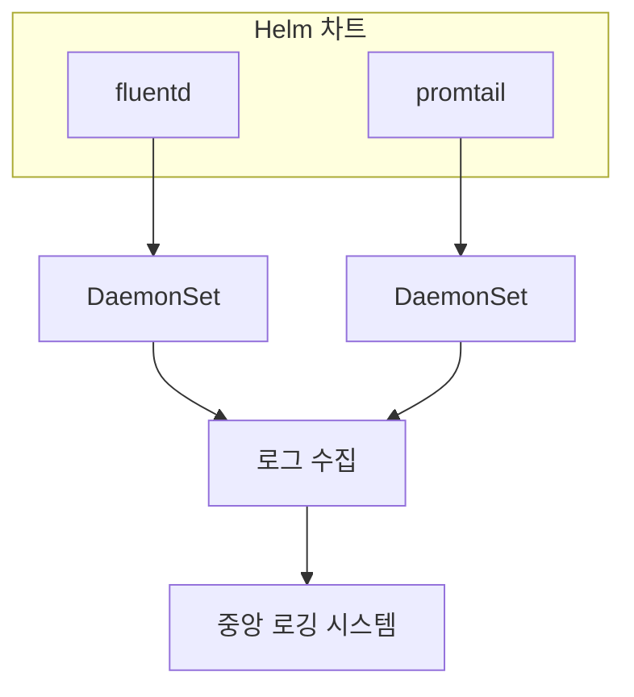
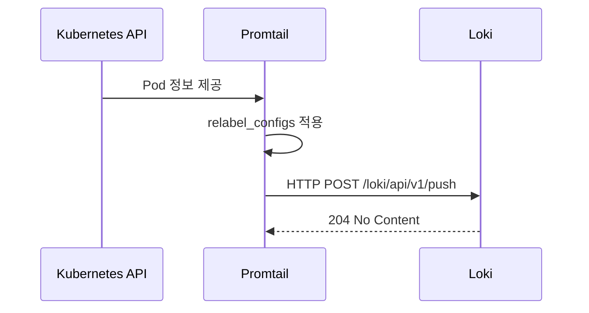
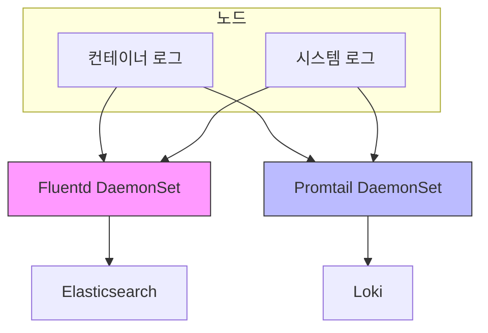

# 로그 수집 파이프라인

<cite>
**이 문서에서 참조한 파일**  
- [fluentd/Chart.yaml](file://helm/development-tools/fluentd/Chart.yaml)
- [fluentd/values.yaml](file://helm/development-tools/fluentd/values.yaml)
- [fluentd/templates/daemonset.yaml](file://helm/development-tools/fluentd/templates/daemonset.yaml)
- [fluentd/templates/fluentd-configurations-cm.yaml](file://helm/development-tools/fluentd/templates/fluentd-configurations-cm.yaml)
- [promtail/Chart.yaml](file://helm/development-tools/promtail/Chart.yaml)
- [promtail/values.yaml](file://helm/development-tools/promtail/values.yaml)
- [promtail/templates/daemonset.yaml](file://helm/development-tools/promtail/templates/daemonset.yaml)
- [promtail/templates/configmap.yaml](file://helm/development-tools/promtail/templates/configmap.yaml)
</cite>

## 목차
1. [소개](#소개)
2. [프로젝트 구조](#프로젝트-구조)
3. [Fluentd 구성 분석](#fluentd-구성-분석)
4. [Promtail 구성 분석](#promtail-구성-분석)
5. [로그 수집 아키텍처](#로그-수집-아키텍처)
6. [로그 필터링 및 변환 전략](#로그-필터링-및-변환-전략)
7. [로그 레이블링 및 성능 최적화](#로그-레이블링-및-성능-최적화)
8. [버퍼링 및 대용량 처리 전략](#버퍼링-및-대용량-처리-전략)
9. [통합 및 운영 고려사항](#통합-및-운영-고려사항)

## 소개
이 문서는 Kubernetes 환경에서 Fluentd와 Promtail을 활용한 로그 수집 파이프라인의 아키텍처와 구성 방법을 설명합니다. 두 에이전트의 역할, 플러그인 구조, 로그 처리 룰, 출력 설정, 그리고 통합 방식에 대해 상세히 다룹니다. 특히 values.yaml 기반의 설정 방식과 성능 최적화 전략을 중심으로 설명합니다.

## 프로젝트 구조
로그 수집 파이프라인은 Helm 차트를 통해 관리되며, `helm/development-tools` 디렉터리에 위치한 `fluentd`와 `promtail` 두 개의 차트로 구성됩니다. 각 차트는 독립적인 로깅 에이전트를 배포하며, Kubernetes 클러스터 내에서 로그를 수집하고 중앙 집중식 로깅 시스템으로 전송하는 역할을 수행합니다.



**다이어그램 출처**  
- [fluentd/Chart.yaml](file://helm/development-tools/fluentd/Chart.yaml)
- [promtail/Chart.yaml](file://helm/development-tools/promtail/Chart.yaml)

**섹션 출처**  
- [helm/development-tools/fluentd](file://helm/development-tools/fluentd)
- [helm/development-tools/promtail](file://helm/development-tools/promtail)

## Fluentd 구성 분석
Fluentd는 Helm 차트를 통해 DaemonSet 형태로 배포되며, 각 노드에 하나의 인스턴스가 실행되어 로그를 수집합니다. 주요 구성 요소는 values.yaml 파일을 통해 정의되며, 플러그인 구조, 입력 소스, 필터링 룰, 출력 대상이 포함됩니다.

### 플러그인 구조 및 확장성
Fluentd는 플러그인 기반 아키텍처를 사용하여 다양한 로그 소스와 출력 대상을 지원합니다. values.yaml 파일의 `plugins` 섹션을 통해 추가 플러그인을 설치할 수 있으며, `configMapConfigs`를 통해 외부 설정 파일을 로드할 수 있습니다.

**섹션 출처**  
- [fluentd/values.yaml](file://helm/development-tools/fluentd/values.yaml#L278-L288)

### 로그 입력 소스 구성
Fluentd는 `fileConfigs` 섹션의 `01_sources.conf`를 통해 로그 입력 소스를 정의합니다. 주로 `/var/log/containers/*.log` 경로의 컨테이너 로그를 `tail` 플러그인을 사용해 실시간으로 수집하며, JSON 및 정규식 기반 파서를 통해 로그를 구문 분석합니다.

```mermaid
flowchart TD
A[컨테이너 로그] --> B[/var/log/containers/*.log]
B --> C[tail 플러그인]
C --> D[JSON 파서]
C --> E[정규식 파서]
D --> F[구조화된 로그]
E --> F
```

**다이어그램 출처**  
- [fluentd/values.yaml](file://helm/development-tools/fluentd/values.yaml#L292-L319)

**섹션 출처**  
- [fluentd/values.yaml](file://helm/development-tools/fluentd/values.yaml#L292-L319)

## Promtail 구성 분석
Promtail은 Loki를 위한 로그 수집 에이전트로, Fluentd와 유사하게 DaemonSet으로 배포됩니다. 주로 Kubernetes 메타데이터 기반의 로그 레이블링과 효율적인 로그 전송을 위해 설계되었습니다.

### 주요 구성 요소
Promtail의 주요 설정은 `config` 섹션에 정의되며, `server`, `clients`, `positions`, `scrape_configs` 등의 블록으로 구성됩니다. `snippets`를 통해 재사용 가능한 설정 조각을 정의하여 중복을 방지합니다.

**섹션 출처**  
- [promtail/values.yaml](file://helm/development-tools/promtail/values.yaml#L404-L545)

### 로그 수집 및 전송
Promtail은 `kubernetes_sd_configs`를 통해 Kubernetes의 Pod 정보를 동적으로 감지하고, `relabel_configs`를 통해 로그에 다양한 레이블을 추가합니다. 수집된 로그는 `clients`에 정의된 Loki 인스턴스로 전송됩니다.



**다이어그램 출처**  
- [promtail/values.yaml](file://helm/development-tools/promtail/values.yaml#L500-L541)
- [promtail/values.yaml](file://helm/development-tools/promtail/values.yaml#L425-L427)

**섹션 출처**  
- [promtail/values.yaml](file://helm/development-tools/promtail/values.yaml#L425-L427)

## 로그 수집 아키텍처
Fluentd와 Promtail은 서로 다른 목적과 특성을 가진 로그 수집 에이전트로, 시스템의 로그 수집 요구사항에 따라 적절히 선택되거나 병행 사용될 수 있습니다.



**다이어그램 출처**  
- [fluentd/values.yaml](file://helm/development-tools/fluentd/values.yaml#L378-L389)
- [promtail/values.yaml](file://helm/development-tools/promtail/values.yaml#L425-L427)

**섹션 출처**  
- [fluentd/values.yaml](file://helm/development-tools/fluentd/values.yaml#L378-L389)
- [promtail/values.yaml](file://helm/development-tools/promtail/values.yaml#L425-L427)

## 로그 필터링 및 변환 전략
로그 수집 후에는 다양한 필터링과 변환 룰을 적용하여 불필요한 로그를 제거하고, 의미 있는 정보를 추출합니다.

### Fluentd 필터링 룰
Fluentd는 `02_filters.conf`에서 `kubernetes_metadata` 플러그인을 사용해 Pod, 네임스페이스, 컨테이너 등의 메타데이터를 로그에 추가합니다. 또한 `relabel`을 통해 특정 로그 스트림을 다른 처리 라인으로 전달할 수 있습니다.

```mermaid
flowchart TD
A[원본 로그] --> B[kubernetes_metadata 필터]
B --> C[메타데이터 추가]
C --> D[relabel 매치]
D --> |fluentd 로그| E[@FLUENT_LOG 라벨]
D --> |기타 로그| F[@DISPATCH 라벨]
```

**다이어그램 출처**  
- [fluentd/values.yaml](file://helm/development-tools/fluentd/values.yaml#L330-L354)

**섹션 출처**  
- [fluentd/values.yaml](file://helm/development-tools/fluentd/values.yaml#L330-L354)

## 로그 레이블링 및 성능 최적화
효과적인 로그 쿼리와 모니터링을 위해 적절한 레이블링 전략과 성능 최적화가 필요합니다.

### Promtail 레이블링 전략
Promtail은 `relabel_configs`를 통해 `node_name`, `namespace`, `pod`, `container` 등의 핵심 레이블을 자동으로 생성합니다. 이 레이블은 Loki에서 로그를 검색하고 필터링하는 데 핵심적인 역할을 합니다.

**섹션 출처**  
- [promtail/values.yaml](file://helm/development-tools/promtail/values.yaml#L440-L480)

### 리소스 최적화
Promtail은 기본적으로 `readOnlyRootFilesystem: true` 및 `allowPrivilegeEscalation: false`와 같은 보안 강화된 보안 컨텍스트를 사용하며, `runAsUser: 0`으로 실행되어 호스트 로그 디렉터리에 접근할 수 있습니다. Fluentd는 리소스 요청과 제한을 통해 메모리 사용을 제어합니다.

**섹션 출처**  
- [promtail/values.yaml](file://helm/development-tools/promtail/values.yaml#L164-L175)
- [fluentd/values.yaml](file://helm/development-tools/fluentd/values.yaml#L82-L87)

## 버퍼링 및 대용량 처리 전략
대용량 로그 처리를 위해 적절한 버퍼링 전략이 필요합니다.

### Fluentd 버퍼링
Fluentd는 내부 버퍼 메커니즘을 통해 네트워크 장애 시 로그 손실을 방지합니다. `buffer` 설정을 통해 메모리 또는 파일 기반 버퍼를 구성할 수 있으며, `persistence` 옵션을 활성화하면 상태 저장 집합(StatefulSet)에서 영구 저장소를 사용할 수 있습니다.

**섹션 출처**  
- [fluentd/values.yaml](file://helm/development-tools/fluentd/values.yaml#L194-L199)

### Promtail의 안정성
Promtail은 `positions` 파일을 통해 각 로그 파일의 읽기 위치를 추적하며, 재시작 시에도 이전 위치부터 로그를 수집합니다. 이 메커니즘은 로그 누락을 방지하는 데 중요합니다.

**섹션 출처**  
- [promtail/values.yaml](file://helm/development-tools/promtail/values.yaml#L427-L431)

## 통합 및 운영 고려사항
Fluentd와 Promtail은 서로 다른 로깅 백엔드(Elasticsearch vs Loki)와 통합되며, 운영 환경에 따라 적절한 선택이 필요합니다.

### 모니터링 통합
두 시스템 모두 Prometheus ServiceMonitor를 지원하여 메트릭을 노출합니다. Fluentd는 자체 메트릭 엔드포인트를 제공하고, Promtail은 기본적으로 메트릭 포트를 열어 프로메테우스가 수집할 수 있도록 합니다.

**섹션 출처**  
- [fluentd/values.yaml](file://helm/development-tools/fluentd/values.yaml#L214-L245)
- [promtail/values.yaml](file://helm/development-tools/promtail/values.yaml#L267-L299)

### 운영 가이드
- **Fluentd**: Elasticsearch와의 통합이 잘 되어 있으며, 복잡한 로그 변환과 필터링이 필요한 경우 적합합니다.
- **Promtail**: Loki와의 긴밀한 통합과 낮은 리소스 사용량이 장점이며, 간단하고 효율적인 로그 수집이 필요한 경우 적합합니다.

**섹션 출처**  
- [fluentd/values.yaml](file://helm/development-tools/fluentd/values.yaml)
- [promtail/values.yaml](file://helm/development-tools/promtail/values.yaml)